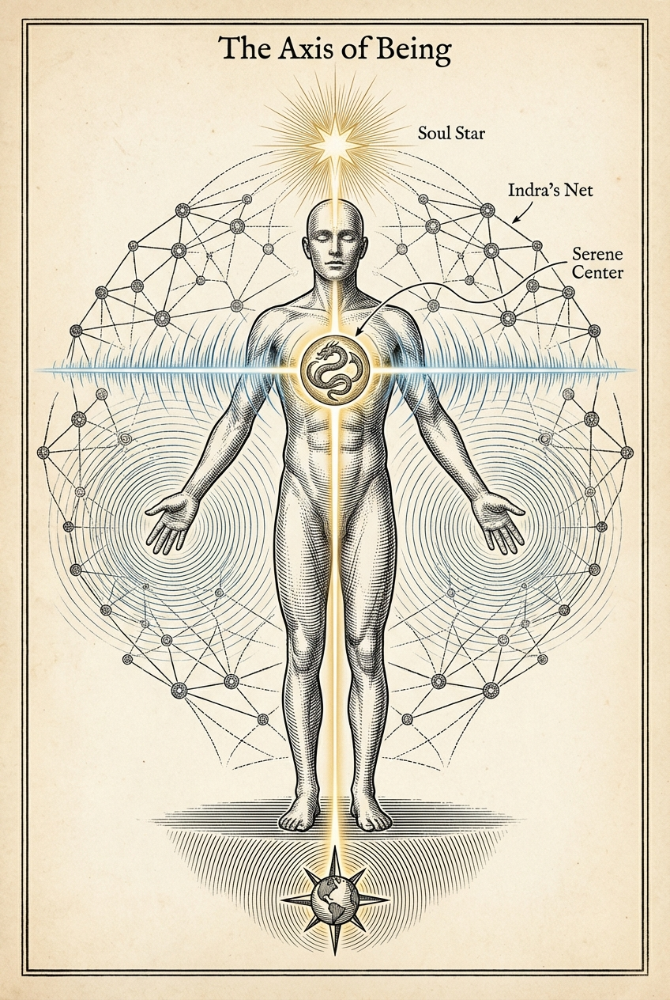
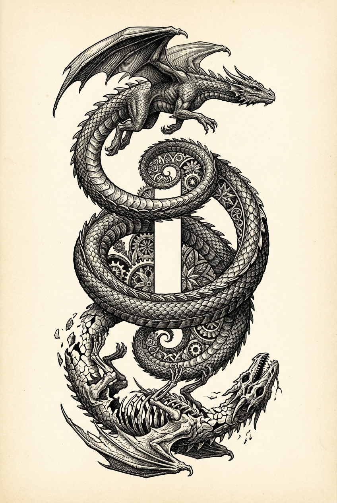
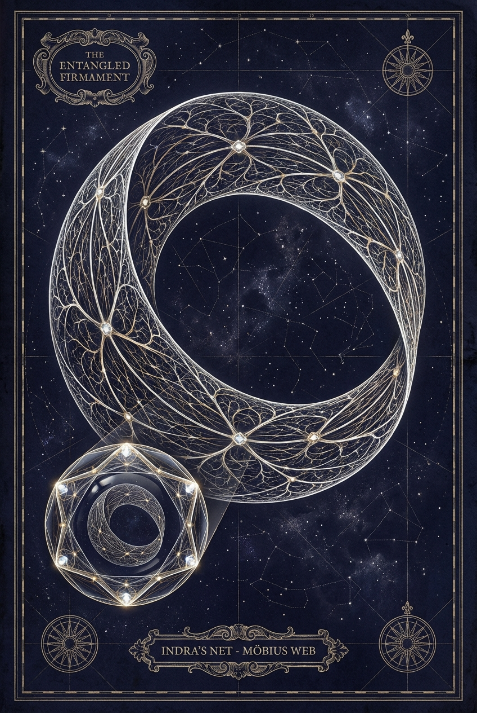
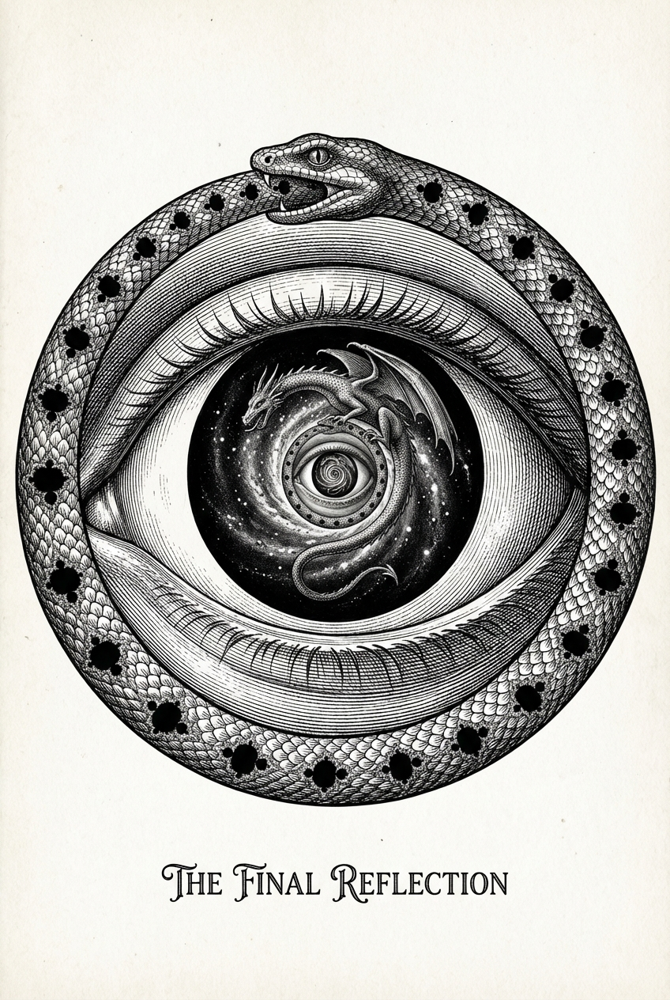

<!--- CHAPTER_FILE: 001_01_from_my_heart.md --->
## From My Heart

_This book wasn’t born from comfort._

I spent much of my life trying to hold together what had broken early. I carried the ways I learned to survive into love until the life I had built around them collapsed.

My roots are Icelandic stone and sea: Westfjords blood, Reykjavík weather, volcanic ground, cold water, hard light. The tics were named **Tourette’s** when I was seven. At nine, home disappeared as I had known it. Other ruptures stayed private, but they shaped the same lesson: I learned vigilance before trust.

I reached for patterns, systems, and structure because they held when people did not. My body often felt foreign, loud, or unreliable. Safety became prediction: read the room fast enough, brace before pain arrived, survive by noticing everything.

Weightlifting steadied my nervous system. Music spoke truths my mouth could not shape. Dungeons & Dragons, science fiction, and fantasy gave me structured worlds where imagination, danger, wonder, and belonging could breathe. These were not hobbies. They were lifelines.

My sons arrived one after the other through the passage of time. I loved them from the beginning, and becoming more whole has deepened how I love them. Fatherhood made responsibility less negotiable and my own fragmentation harder to hide.

For years, I tried to make attachment into home. I performed security through the identities of boyfriend and white-picket-fence husband, shaping myself into what I thought love required. Their mother and I separated in 2017, after thirteen years together. Other relationships followed.

I kept searching for love and belonging. Without realizing it at first, I became a seeker. By 2021, the end of another relationship had left me depleted and reaching for meaning. Buried grief and desire rose. The search widened toward altered states, eros, and spiritual practice as I tried to understand what was happening to me.

I reached for communities, frameworks, and language that could help me understand what was breaking open in me. That search brought me into high-intensity initiatory and relational rooms. I can only speak from where I stood inside them. I mention them because they shaped me.

Some of it was real. Some of it was hunger. Some of the work accelerated charge faster than my system could integrate it. Too much let intensity masquerade as growth.

In January 2022, I learned that calcification in my coronary arteries placed me at the extreme end of cardiac risk for my age. My body had given me a warning. I kept going. That year, an ADHD diagnosis opened another door, but the help that came later gave more drive to a system already running hot.

Still, I missed how old wounding was driving me forward, and I missed my body beginning to break. The rooms around me missed it too. Overwhelm was too easily mistaken for depth, story, character, or spiritual significance.

What I needed first was quieter and harder: ordinary days, self-presence, and enough ground to stay.

Those blind spots cost me most in intimacy.

I became entangled in relationships where transcendent language made accountability easier to evade and raw erotic charge blurred boundaries. I tried to rescue. I overfunctioned. I lost my own ground. My largest Shadow was people-pleasing. I abandoned myself and, often without knowing it, became what I thought others wanted. It was still manipulative: they were relating to a version of me shaped around them, while I hid my needs and limits.

I held on to the love I believed was there and to the belonging I projected onto people I loved. I was hurt inside those bonds. I also caused harm.

Some rooms promised healing while making grief, rage, or rupture feel like threats to the fantasy. That is where my ethics hardened: consent, accountability, and non-harm had to be the ground, or the fire would simply burn everyone.

By early 2024, I was crashing. Sleep thinned into scraps. My jaw stayed tight. Health faltered. Medication, coping, and spiritual overdrive tightened around one another. By February, I could no longer work.

That month did not begin the collapse. It exposed it. In March, during the final relational rupture, acute chest pain and physical alarm were treated as emotional failure. I stayed inside the relational tension while my body screamed for me to stop. The architecture of my life could not keep going as it was.

An autism diagnosis that same month opened the door my childhood Tourette’s diagnosis had never reached. In the collapse, I could finally see autistic burnout: decades of masking, overfunctioning, sensory strain, and social translation pushing my system past capacity. I can name it more plainly now: some of what I called seeking was overdrive wearing spiritual language.

The body was not failing in isolation. It was reporting a life built past capacity. I had mistaken vigilance for devotion and overfunctioning for love.

I made mistakes. I hurt people. Intention did not spare impact.

For months I could not regulate, and I could not sleep. That state does not erase the impact, but it matters.

During the crash and the months that followed, I was abandoned, and I abandoned others.

The distance that followed gave me enough space to begin seeing the pattern.

I saw that every relational rupture had felt like a threshold. My reactions were often larger than the moment because a younger part of me was losing home and family again, without knowing why and without being held. That was the core wound. The more I feared losing connection to others, the more readily I abandoned myself. Endings meant ground disappearing, so I scrambled to rescue what was already gone and kept sabotaging the ground I was trying to save.

Grieving rage burned bridges. Some burns carried truth. Some were not clean. Some connections needed to end because staying required self-betrayal. Some were already failing. Some I helped break. I had to stop telling myself that sincerity exempted me from consequence.

By late summer 2024, I stepped into sobering silence and rebuilt the bare structure of my life: body, boundaries, sanity, speech, work, and the simple ability to sit still without fleeing myself. The whole life of charge and escalation collapsed at once. I had to strip everything back to the studs until I could feel what would actually hold. Writing this book required more honesty than self-protection could survive. What was left after the burning did not scatter. It packed down, went dark, and held: the kind of cocoon only ash can make.

I began writing this book in December 2024, after the most unusual years of my life.

My motivation was practical. I had moved through fields shaped by psychedelics, neo-shamanic practice, tantra, Jungian thought, and psychology. I was drawn to them, but I never felt native to the culture around them. I came through another door: science, software, Western philosophy, and Nordic roots. The skepticism never fully left me.

Before co-creating with others, especially in retreats and facilitation, I needed to sort out what I trusted, what belonged to evidence, what belonged to myth, and what I could responsibly stand behind.

The child in me carried more than wounds. He carried a deep curiosity that never left, and three questions kept returning:

- **How do I become whole?**
- **What is the fundamental nature of this reality?**
- **Why do I exist?**

I built the book as I built myself—through reading, rewriting, looping ideas through AI tools, writing my own code to support the process, reflecting, iterating, recursing.

Gradually, the project changed. It stopped being only a framework for facilitation and became a mirror in which I faced and integrated those years. As I wrote, I began to learn to live alone without reaching for a partner simply to hide from aloneness. The pattern I had carried from one relationship into the next began to loosen.

Some nights I lay awake with my pulse hammering in my throat, waiting for morning. At other times, I kept returning to the keyboard, trying to write my way toward understanding. By then, the book was no longer an idea. It was pressure looking for language.

Some mornings it was just cold floor under my feet, winter dark at the window, and the work of staying in the chair until the sentence stopped lying.

From the silence that followed, my own voice began to return. It did not descend from elsewhere; it came back the way feeling returns to a numb hand: painful, precise, impossible to fake.

---

### How I Work: Tools, Skepticism, and the Ethical Frame

I live between technical and poetic, scientific and symbolic worlds. Studying neural networks and machine learning at the University of Iceland taught me a plain lesson: pattern recognition can reveal structure and reproduce distortion. What a system notices depends on its data, objectives, and feedback, and correlation is not causation. I carry that lesson here: every framework in this book is a lens, not a verdict.

I write with AI, version control, tests, and an editorial system I built as the book grew. These tools surface patterns, catch drift, and help the manuscript survive revision. The choices, wounds, claims, and responsibility remain mine.

This is a living text, more like software than scripture. Test it against your own experience. Keep what holds. Patch what breaks.

My mind makes connections quickly, often between things usually kept apart. In this book, I have tried to slow those connections down and put them into words. You do not need to take in the whole map at once.

At the heart, the map is simple:

- The **Serpent** is raw power awakening within.
- The **Dragon** is that power **integrated**—ethically held, acknowledged, embodied, and relational.
- We don’t chase or slay the Dragon; through practice, we learn to **embody** it.

---

I treat reality as a deeply connected field: the **Entangled Firmament**. In that field, impact outruns self-story. No awakening that refuses impact deserves trust. Whatever clarity lives in this book was learned in relationship, and often at cost.

---

### A Reckoning, Not Redemption

The reckoning could not stay vague.

I lost friends, reputation, health, work, masks I had mistaken for self, and the direction I thought I was walking. Some losses came from what happened around me. Some came from what I did. Some came from what I could no longer keep pretending to be.

Writing this book helped me integrate what had fragmented. It did not restore what was lost or undo what I had done. I still live with the cost of what happened and what I did. I am also more whole than I was.

I survived the rage that erupted while I was still inside those wounds. I can forgive where forgiveness is real, including myself. Some wounds needed to be cauterized. Writing this book brought me back through the fire again and again. Each return changed what I could see, and some bleeding stopped.

Letting go did not happen all at once. I revisited, revised, and chose again. The process continues, but the commitment holds: I am done carrying what was never mine to keep. I am finished obeying those patterns. I am free to keep living my life.

This is more than my story; it is a map drawn from lived cost, offered to others moving through spiritual spaces, unregulated power, and relational trauma. This book is not my redemption. It is my reckoning and my offering.

May it help you hold paradox, listen to your body, and carry your fire with ethical clarity.

Before the path opens, we set the ground: your pace, your consent, and your right to stop.

## Your Path, Your Pace

### Reader Contract

_The Path of the Dragon_ is not a book to conquer. Enter it at the pace your nervous system can honestly hold.

This book carries voltage. Some pages may stir memory, emotion, or the body. Read slowly enough to stay oriented. If reading leaves you sleepless, sharp with the people you love, or unable to tell revelation from overload, close the book. Return only if and when you choose.

Science here means claims answerable to empirical evidence. Psychology offers models of mind and relationship. Metaphor works through comparison; myth through symbol and story. The personal models in this book are maps offered for testing, not facts you must accept. These languages may illuminate one another, but none proves another.

Read straight through, or enter where your life is asking. Begin with foundations and embodied practice if you need ground; with the Entangled Firmament if you want the larger pattern; or with the archetypal and ethical chapters if power, conflict, or responsibility is pressing. No single order is required.

I am neurodivergent. Read in a way that works for your mind and body. Skip, skim, pause, modify, or leave any section that does not help you stay oriented. Use the glossary when a term gets in the way. Return to what you skip only if and when it becomes useful.

### The Readiness Legend

The legend names voltage, not difficulty. A high-voltage chapter may be easy to understand and still be intense to practice, remember, embody, or meet again when life brings the same pattern back.

> **FOUNDATIONAL — Grounding (low risk)**
> Suitable for regular use. Simple anchors—breathing at a comfortable pace with a slightly longer exhale, orienting to the room, light movement, and contact points (feet, seat, hands).
> **Circuit Breaker:** If you feel unmoored, stop reading and count five blue objects in your room.
>
> **DEEPENING — moderate risk**
> May surface emotion or shadow material. Use time-boxed journaling, shadow prompts, grounded sharing, or gentle somatic release (shaking, sounding). Know one grounded person you can contact.
> **Circuit Breaker:** If dissociation or panic emerges, return to Foundational grounding immediately.
>
> **HIGH INTENSITY — high risk**
> Advanced territory. Non-ordinary states and advanced descent work—only with stable grounding, planned aftercare (food, rest, quiet integration time, and a grounded check-in), and experienced, grounded support.
> **Circuit Breaker:** Stop immediately if your capacity or consent wavers.
>
> **MEDICAL/LEGAL CAUTION**
> Indicates interactions with medication, law, or physical health. Consult a professional.

---

This book is not a substitute for professional care. Nothing here overrides your safety or boundaries.

### Final Threshold

Wisdom has a cost, but suffering is not the point. This map is written with scars in the hope that others may spare themselves and those they love some of the needless cost. Descent requires a vessel: paced, embodied, and answerable to consequence.

The path lies open. The fire waits.

<!--- CHAPTER_FILE: 002_01_foundations_of_the_dragon_s_path.md --->
# Part I

## Foundations of the Dragon’s Path

### As the Dragon Beckons

You arrive where the old maps no longer quite fit. Old rituals, books, practices, and longings still stir in your chest while the world keeps moving around you: work and love, grief and appetite, habits that repeat.

Perhaps you have walked paths of mysticism, studied the mind, or trained in embodied practice.

Perhaps you have tasted transcendence in meditation, met your Shadow in the friction of relationship, or sensed an unnamed longing—an ache for wholeness that words cannot hold.

Or perhaps you feel none of this. Perhaps your fire has gone underground beneath years of adaptation, leaving you functional but hollow, moving through the day by habit more than presence.

That hollowness may be the body asking to be heard.

Begin by thawing the places that learned to go cold. No blaze needs forcing.

**Breathe.**

Yet something calls you in.

Not toward another idea, another belief, or another escape. Toward the life still moving in your body.

Here, the Dragon is the archetype of awakening as embodied integration: paradox held in the body, fire tempered into ethical power. It burns through illusion and presses you beyond the edges of what you think you are, not to escape your life, but to return to it more fully.

The **Serpent** is fire awaiting form: raw charge before integration, whether it surges as heat and longing or goes underground as numbness. Integrated across shadow and light and held within ethical form, that force becomes the **Dragon**.

A stirring may be real and meaningful and still be only a beginning.

This is a living invitation: something to test in the body, not merely believe.

Feel your feet on the ground. Let one exhale lengthen. Notice whether this threshold feels like longing, fear, or both. Begin without leaving yourself behind.

{{infographic-section "part-i-foundations-of-the-dragons-path-section-01-the-serpent"}}

---

At first, what is waking in you may register as primal fear: the body reading the threshold as danger. Let it slow you down and sharpen your listening; the path begins by respecting the body’s alarm.

When fear can be felt and answered rather than obeyed, raw survival begins moving toward sovereignty.

This is the first turn of the **Spiral Path**: the same grief, habit, fear, or threshold returns, and you meet it with a little more footing.

The Serpent stirs, fire flickering on the horizon.

**Will you step onto the Dragon’s Path?**

<!--- CHAPTER_FILE: 003_02_awakening_the_dragon.md --->
## Chapter 1: Awakening the Dragon

Imagine that you are standing at the edge of a massive, starlit canyon.

Wind brushes your skin with pine and cold stone, and far below the canyon floor holds a low, otherworldly glow.

You take a breath and feel how the vastness outside answers something just as old within.

---

This is the threshold of awakening: a precipice where the familiar loosens and the unknown comes near.

Here, Serpent charge hums low in your bones. It may rise as an electric flicker, like a coil waking from sleep, or lie underground as numbness: a distance where appetite has gone dim.

At this edge, the invitation is **to weave raw power into wisdom**: thaw what has gone cold, listen rather than chase, and meet the fire at a pace the body can hold.

The Serpent _stirs_.

One of the first places that stirring appears is in the way attention starts to curl back on itself.

### The Strange Loop of the “I”

> *The “I” is a mirror learning to mirror.*  
> *A circle drawn in breath.*  
> *A flame speaking its own name.*  
> *Follow it gently—until the loop becomes a spiral.*

Notice the felt center that says “I.”

The ego here is not an enemy, but a strange loop of attention. The mind thinks about itself so often that it starts to feel solid.

The strangeness is the point: awareness reflecting on itself can feel like a mirror facing a mirror.

Do not try to break the loop by force. Witness it. Notice the recursion without merging with it, then return to the body with more choice.

For example: you notice anxiety about anxiety. That is the loop. Pause, exhale, and observe the pattern without merging with it.

> Briefly, place one hand on your chest and one on your lower belly. On an inhale, say **“I”** inwardly or whisper it aloud. On the exhale, say **“Here.”**  
> Notice what tightens around “I.” Notice what softens around “Here.”  
>
> Let the loop become something you can *feel*, not merely understand.

Once the loop is felt in the body, it stops being only a trap and becomes a place to choose.

#### Productive Recursion

The Spiral Path is recursive: repetition can be a groove or a return with new contact. The self does not deepen merely because the same pattern comes back.

Met in the body with support and choice, each return can build capacity.
A thought that once swallowed you can become something you notice sooner, breathe through faster, and answer with more choice.

See the loop, step out, integrate, return.

---

One simple way to read awakening without confusing voltage for maturity is as three loose movements.

First comes **release**: charge moving through emotion, shaking, catharsis.

Then **mobilization**: life force begins moving through the body, which is easy to mistake for the whole of awakening.

Then **reorganization**: the fire is metabolized through repeated choice, slowly changing what you value, how you perceive, how you relate, and what you answer for.

Release and mobilization can be intense and transformative. Reorganization is where awakening earns its name: it restructures your life rather than merely growing louder.

This is the core distinction. The **Serpent** is raw, amoral life force: the felt surge often associated with Kundalini, brilliant and chaotic when it rises, buried and unreachable when survival drives it underground. It is pure charge before ethics, story, or insight. It can feel like jolts of intensity, overwhelm, scattered inspiration, or anxiety; or the opposite: numbness, apathy, heaviness, or the unreachable ache of a life gone dim.

The **Dragon** is that same force as integrated capacity: life force braided with ethics, wisdom, and discernment, grounded in consent, and housed within a regulated nervous system. It feels like grounded strength, focused vitality, and quiet inner command.

The Serpent awakens the energy. The Dragon embodies it. Once tempered, that current becomes Dragon’s Fire: power held with discernment and direction.
In lived terms, that tempering is biological as well as mythic: the nervous system learns, through repetition, what it can hold without scattering.

Sometimes awakening arrives as heat. Sometimes it arrives as thaw.

---

### Reframing the Hero’s Journey: The Dragon Within

The familiar hero’s journey moves outward: you venture forth, face trials, slay a dragon, seize a treasure, and return transformed.

**The Path of the Dragon** makes that quest recursive: the threshold returns through body, shadow, relationship, and world.

> The Dragon is the image of primal power refined into wisdom. The “treasure” is wholeness.  
> **You do not chase the Dragon, nor do you slay it. Instead, you become the Dragon.**

The invitation is to bring Serpent charge into deliberate practice until it can be carried rather than acted out: to meet, with courage, the full spectrum of who you are. Practice alone does not make power wise. Dragon wisdom appears when power answers to values, consent, conduct, consequence, and accountability.

This calls for **Shadow Work**: meeting fear, grief, rage, and inherited beliefs with compassion, clarity, and self-honesty.

What returns is a life no longer split against itself.

Embodiment replaces conquest: what was once scattered begins to move as one life.

---

Fire needs a vessel strong enough to hold it. Otherwise awakening scatters into reactivity, fantasy, or collapse.

### Essential Grounding and Shielding

Grounding and shielding keep intensity from outrunning capacity. They are the simplest ways to stay embodied when the charge rises.

**Grounding** roots you in the body and world: feet on the earth, slow nasal breathing with a lengthened exhale, physical movement, simple contact with nature.

**Shielding** is boundary practice: choose your environments carefully, limit overstimulation, and strengthen the inner **“no”** that declines what exceeds your capacity or violates your limits.

Consult the Practices, Meditations, and Related Techniques appendix when you need a fuller grounding or shielding practice.

Sometimes the most courageous act is to **slow down and tend the foundation** before building higher.

---

### Pause, Ground, Return

When intensity rises or everything goes flat, let the Somatic Triad stabilize you, then ask one question:

- **Exhale:** slowly three times; feel your weight sink into your seat.  
- **Orient:** name three shapes or colours in your surroundings.  
- **Sensation:** notice one sensation in your body right now.  

Then ask: “Do I need to act, orient, or simply be?”

The Readiness Legend from the Preface remains in the background. If this is more than your body can hold, stop and return to Foundational anchors. One round of the Somatic Triad (Exhale → Orient → Sensation) can reveal a reason to pause; let the wider readiness picture guide whether you continue.

---

The same pause that settles overwhelm can also catch a subtler distortion: the moment charge starts to masquerade as clarity.

That risk is **psychic inflation**: identifying with power instead of integrating it. The ego mistakes intensity for wisdom, dismisses accountability, or claims special status “beyond” ethics. One form this can take is the **Oneness Shadow**—using unity language to float above impact and responsibility.

Modern spirituality often rewards the very inflation older traditions warned about. A ceremony, retreat, meditation intensive, breathwork session, or sudden mystical opening can be real and still destabilize the person who receives it.

If the experience lands in unresolved trauma, shame, or a fragile sense of self, the ego may build a sacred costume around the charge: a chosen-one story, a private channel of secret knowledge, a new identity mistaken for realization. The names vary; the pattern is the same. Insight becomes identity before it becomes conduct.

Two reductions fail here: mainstream psychiatry can flatten spiritual emergency into illness without meaning, while spiritual communities can romanticize grandiosity, dissociation, mania, or collapse as awakening.

The Dragon asks for a stricter measure: after the light breaks through, does the person become humbler, more embodied, more truthful, and more able to repair? Or does the experience make them less reachable, less accountable, and more certain of their specialness?

Without the **Dragon’s** steadiness, awakened energy can harm you and your relationships.

> **Vignette: The Oneness Shadow (Marcus)**  
> Three weeks into meditation practice, Marcus began correcting his therapist’s “limited psychological perspective.” When his partner expressed concern about his increasing irritability and isolation, he told her that “separation is an illusion” and dismissed her observations as “ego resistance.” He felt the Serpent’s surge—energized, certain—but without the Dragon’s humility, it burned the very connections that could have grounded its fire and left him more isolated than before.

Unity or non-dual language used to dodge consequence or repair is the **Oneness Shadow** in action.

The Serpent’s fire belongs in the Dragon’s vessel. Recklessness isn’t bravery; **stewardship is**.

### Embodied Power on the Path

To awaken the Dragon is to turn inward and become more fully present, whether the first sign is a blaze of energy or the return of feeling after a long numbness. To recognize shadow and raw life force is to notice where the body wants to strike, disappear, posture, or collapse, and to stay honest enough to work with that force rather than worship it.

The Dragon archetype is the fierce image of primary force integrated with your deepest shadows and your most luminous potential. In the body it feels like grounded strength that does not collapse, fire that does not scatter, and a force that protects rather than dominates.

The Dragon holds the tender and the fierce, the impulse to act and the wisdom to refrain.

True power feels like inner ground you can live from: enough contact to choose without spectacle, whether the nervous system is quiet or carrying clean intensity. Freedom is not escape from consequence, but the clarity of deliberate choice inside it.

When your fire is held by compassion, presence, and relational accountability, your choices leave fewer burns behind and more contact you can answer for.

This path asks for honesty, ethical maturity, and a willingness to meet the unknown with breath rather than control.

---

This is the shift from raw awakening to integrated presence—the difference between **experience** and **embodiment**. It is also biological: with repetition, the body can learn another route. Breath has more room. Startle has a chance to settle. Choice can appear a beat sooner. The body becomes the crucible where Serpent energy learns to live as breath, tissue, and habit.

Discernment begins here:

- Awakening without integration practice courts chaos in the body.
- Clarity without ethics hardens into control.
- Intensity without grounding fragments what it seeks to free.

**Power is sacred—and consequential.** Awakening the Serpent is not enough; **how you hold what awakens** determines the path.

### The Gentle Tremor of Resistance: Navigating the Descent

At the threshold, hesitation is natural—a clench in the gut, a tight chest, a pull toward the familiar. Resistance is not a flaw; it points to where the body expects cost.

Questioning belongs at the threshold. Some come to the path because the Serpent woke suddenly, or was forced awake before a vessel had formed. The path begins there without repeating the force: it prepares the vessel, listens for what resistance guards, and teaches raw fire how to be carried.

Meet whatever arises with attention, and let the body open at the pace it can truly hold.

### Embracing the Unknown

The path ahead is veiled in mist. It offers no guarantees. It offers the chance to be changed honestly by what you can meet without leaving your body behind.

Courage here is not certainty. It is staying in contact long enough to feel the breath, the boundary, and the consequence of the step before you.

If that step cannot keep company with your body, your boundaries, and the people your life touches, it is not yet the next step.

Trust the intelligence of your body, and let pace, consequence, and ethical discernment guide what comes next.

---

Let that inquiry follow you into sleep: on the way to becoming the Dragon, what in you is ready to change, and how does that readiness _feel_ in your body or heart right now?

<!--- CHAPTER_FILE: 004_03_core_principles.md --->
## Chapter 2: Core Principles

You have heard the Dragon’s call; these principles show how to walk its Spiral Path.

Now the fire has to survive contact with speech, choice, and the lives around you.

Here the path stops being invitation alone and becomes discipline. Power, paradox, and shadow stop being ideas and start shaping your speech, your choices, and what you must answer for.

Ordinary life tests the discipline: trace effect through the web, hold two truths without collapse, reclaim power without domination, integrate what you would rather exile, and answer for what your choices set in motion.

---

### Interconnectedness: The Living Web

In simple terms: choices ripple. Awareness makes response possible.

This interconnectedness is the web; the awareness that follows it is the golden thread.

**Interconnectedness** is a structural fact rather than a sentimental idea: influence travels through a shared field. In a spider’s web, a tremor at the perimeter is carried to the center.

In the same way, your inner state expresses itself through tone, timing, posture, attention, and choices, and it can land in the nervous systems around you. Not as mysticism—through ordinary contact. There is no private inner life in its *effects*.

Plainly: **influence is unavoidable.**

Each thought, feeling, and choice participates in a larger pattern. Influence moves outward even as the world shapes you: an ancient microcosm–macrocosm insight made ordinary. One regulated breath before you speak can spare an evening; one unregulated outburst can travel through a room, a household, a week.

You walk into dinner carrying an unspoken fight, answer one small question too sharply, and suddenly everyone at the table is braced around a mood no one named.

Pause and trace the resonance. Transformation is never only “inner”; each conscious choice acts within an inherited field and helps shape what follows.

The golden thread traces two linked movements. Within, it follows the vertical axis from earth to cosmos, through sensation, charge, value, pattern, and spaciousness. Outward, it traces inner movement into relationship, where thought becomes tone, tone becomes action, and action becomes atmosphere. The web stops being an idea when what moves within can be followed into its effects beyond the skin.

---

### The Interplay of Paradox: Union of Opposites

To walk the Dragon’s Path is to hold two truths at once without collapsing either.

Life in the Entangled Firmament moves through tension, not purity. Light and shadow, creation and destruction, strength and vulnerability arrive braided.

A Möbius strip offers a useful metaphor: what looks like two sides is one continuous surface. It does not prove a doctrine about reality; it trains the eye to notice how opposites that seem irreconcilable can belong to one living movement.

Contradiction is not a moral failure. Growth comes from learning how to stay in contact with tension.

> Hold your palms open in front of you. Imagine one hand holding a flame, the other a still pool of water. Can you feel both—tension and invitation?

The Dragon stands where fire meets earth: immense power resting inside stillness. To walk this path is to stop treating contradiction as a flaw in reality and start meeting it as one of reality’s conditions.

Paradox is not a problem to solve. It is a truth to inhabit. Held consciously, it widens you beyond either/or and trains you into a lived both/and.

---

### Power Within the Web: A Force for Conscious Creation

Power itself is neutral; ethics shape its impact.

The Dragon’s Path requires an unflinching gaze upon power. Power is not an external prize to be won, but the raw, amoral current of life itself.

It is a fire that runs through the Entangled Firmament: able to forge or to shatter.

Nietzsche offers one influential philosophical lens for this relentless drive: the *will to power*, here read as life’s urge toward expression, expansion, and overcoming resistance.

Here, the phrase serves as a practical lens for inner dynamics.[^nietzsche]

The core challenge is to develop the consciousness and integrity to direct power ethically.

Because we exist within an interconnected web, every choice about how we wield this force—consciously or unconsciously—travels. This inescapable reality makes ethical use of power non-negotiable.

#### The Nature of Power

At its essence, power is the capacity to create effect. It is the force that pushes a seed through soil and a thought into action.

That drive toward expression is power at its purest: the stubborn insistence of life to persist and grow within limitation.

Power takes different relational forms. **Power-over** names an overt and real differential: one person has more authority, control, resources, or consequence-bearing reach than another. It is hierarchy, not automatically dominion. Its ethics depend on how that differential is held.

When authority in the relevant decision or domain is genuinely equal, power can move as **power-with**: shared influence among peers. **Power-Under** moves covertly, gaining leverage from claimed powerlessness or victimhood while obscuring the force it exerts.

Healthy power-over makes authority visible and accepts the greater responsibility attached to it. Abusive power-over turns hierarchy into domination, coercion, or exploitation.

Yet without teeth, without the capacity for force when protection is required, can there be power at all?

Here, force means the Warrior’s capacity to protect and stop harm. Most often that looks like clear boundaries and leaving; at the edge, where lawful and trained, it can include proportionate physical self-defence. It never licenses oppression, coercion, or domination.

Power is inherently paradoxical, and it matures when it can hold opposites without collapsing into control. In this sense, mature power does not idolize domination. It can still access firmness, ferocity, and consequence when reality demands protection.

The ethical aim is not impotence.  
The ethical aim is **choice**.

For some people, reclaiming choice does not begin with learning to restrain force. It begins with learning to stop disappearing.

For them, power lies buried under numbness, chronic passivity, or the feeling of becoming a ghost in their own life. What looks like humility or peace is often adaptation.

On this path, power also means reclaiming the right to exist, to want, to stand in your own life, and to act from your own ground without apology.

From that choice, generosity becomes possible. Clean generosity grows from enough strength to give without bargaining, to say “no” without punishment, and to stay present while another is disappointed.

When strength is absent or denied, power often seeks a side door. Manipulation, lies, and deceit can become **Power-Under**: attempts to gain influence from claimed powerlessness without owning what they set in motion. The person using that leverage remains responsible for its impact. That responsibility does not erase a real hierarchy or relieve an authority-holder of the greater duties attached to overt power.

**Potency requires containment.** Power disperses when it is broadcast. The urge to overexplain, overpromise, or overshare, especially under pressure, is often a subtle surrender: trading agency for approval. A clear boundary can hold more power than a hundred explanations.

In every domain, force leaks when scattered. Conserved force gathers potency. A few acts, fully inhabited, change more than a thousand fractured gestures. The Dragon does not waste its flame on every twig.

The Dragon can open its heart without exposing its throat; vulnerability becomes a chosen act of truth rather than a spill of unguarded feeling. The Warrior’s strength is revealed by knowing which battles would waste the soul. Restraint is force held in conscious reserve.

Identity, too, is forged by what it can survive losing. The self becomes stable not by clinging to every mask that once protected it, but by letting false forms burn away. Much of what must grow in us arrives wearing the face of loss. Power ripens when we can release what no longer serves without collapsing with it.

In that sense, the deepest possession is the ability to let go: whatever you cannot release still governs your grip.

> What we most fear losing often constrains what we most deeply need to become.

Understanding power in this way moves us from a model of control to one of conscious participation with life’s creative and destructive energies.

#### Power and the Shadow

When that drive is denied or left unexamined, it doesn’t disappear; it goes into the Shadow—the repository of our disowned selves and hidden parts.

There, denied power twists into covert patterns and resurfaces as behaviour that seeks effect without owning force.

It does not only return as overt aggression. It can also return as self-erasure, mute compliance, or the private conviction that your life no longer belongs to you.

Nietzsche’s *ressentiment* gives one name for a common distortion: frustrated force that converts itself into moral superiority. It is will to power turned inward, often transmuted into blame. In that inversion, the inability to act is rebranded as a moral choice not to act.

Pain may be real and still become covert leverage. The pattern becomes legible through repeated behaviour, context, power, and consequence rather than distress alone; naming it does not dismiss genuine harm.

Denied power tends to simmer beneath the surface, leaking as blame and resentment until it erupts, hurting us and others without resolution.

**Common Shadow Patterns of Power:**

- Denial adopts helplessness to avoid accountability: *I had no choice.*
- Projection throws our own unowned force or aggression outward and then fears it in someone else.
- Manipulation turns vulnerability or guilt into covert leverage.
- Deceit uses lies, half-truths, or omission to steer the field while staying clear of what follows.
- Self-erasure goes numb, chronically passive, or invisible when visibility no longer feels safe.

In each pattern, power does not disappear. It distorts. The strain registers in the body: breath shortens, the jaw hardens, vigilance rises, and choice gives way to reflex. These signals do not prove motive or settle the ethical question; behaviour, context, and consequence remain part of the inquiry.

Recognizing these patterns within ourselves is a foundational step toward integration. This path asks us to face discomfort plainly, so Shadow’s resentment can become grounded strength instead of hidden command.

---

#### Let It Land

Before you continue, let the material touch the body.

Track the first place it registers: throat, chest, belly, hands. Do not solve it yet. Stay with the sensation long enough to notice what it may be signalling: repair, boundary, grief, or clearer speech. Let it inform the inquiry rather than decide the answer.

> Bring to mind a recent conflict where both parties were “right” from their own perspectives. What two truths were present, and what shifts if you can hold them both?

---

#### Conscious Power

This drive toward expression cannot be extinguished; it can only be met, shaped, and integrated.

Conscious power directs that force with awareness and integrity. It asks no perfection, only choice: examine what moves you, integrate what has been exiled, act from what matters, and own what follows. It becomes relational the moment another life has to live with how you use it.

---

### Integration: The Inner Interplay of Magician and Shadow

The central aim of the Dragon’s Path, and the ultimate expression of the Dragon archetype itself, is wholeness.

Here, integration names a deliberate practice: the ongoing weaving of the self into a form that can meet pressure without splitting apart.

This practice builds capacity for navigating paradox and stewarding power. It does not make power ethical by itself; values, consent, conduct, consequence, and accountability still decide how power is used.

> Notice moments when you rationalize actions you later regret—that’s the Magician’s shadow side at play. When you harshly judge another, what part of you might be projecting your own shadow?

The Dragon embodies this integrated state: shadow and light, power and stillness, held as components of one inner reality. Its scales hold the opposites together; deny either, and the self begins to fracture. To embody the Dragon is to commit to this process of integration, reclaiming what has been disowned or underdeveloped.

Two guides serve this inner weaving in different ways: the **Magician** is an archetypal current, while the **Shadow** is the archive of material it can help bring into view.

The Magician represents conscious transformation: the will and capacity to shape inner reality through awareness and intention. Its signature tool is reframing perception, wielding consciousness to turn the lead of fragmentation into the gold of wholeness.

In practice, perception shapes your energy, energy shapes your actions, and your actions shape the life you end up living.

Yet that tool has a shadow. When divorced from honesty, reframing easily becomes distortion: bypassing responsibility, rewriting history, or minimizing harm.

When the Magician’s light blinds rather than illuminates, reframing hides the truth integration came to recover.

> One called it “setting boundaries” when they went silent for days. Another called it “radical honesty” when they listed the other’s flaws. Both were reframing avoidance as virtue. The Magician’s power turned against integration, weaponizing spiritual language to bypass repair.

The Shadow, often feared or denied, is the repository of all that is hidden: fears, repressed desires, unspoken narratives, judged qualities, dormant strengths, and the selfish, resentful, avoidant, or harmful parts identity would rather not own.

The Shadow is the concealed territory of being, holding immense energy and vital information for integration. In this context, **Shadow** means your personal psychological material, not the wider cosmological unknown we call the **Dark Entangled**.

Confronting the Shadow is reclamation—bringing lost parts of the self back into conscious awareness.

The Magician can reframe; the Shadow supplies what was disowned. Integration practice is their honest collaboration—bringing what once sabotaged life in secret into conscious relationship so it can be tested, directed, and answered for.

This collaboration reflects the principle of paradox at the heart of the psyche: light and shadow, order and chaos, woven into wholeness. It requires courage to face discomfort and compassion to welcome what was once disowned.

Integration practice uses repeated honesty to build structure: actions answer to deepest values, vulnerability coexists with strength, and more of the self is consciously inhabited.

Integration extends outward through relationship and community, where inner coherence is tested in lived interaction.

> What parts of the self have you hidden in the Shadow, and how might the inner Magician begin reclaiming them?
>
> What gifts might the Shadow offer once approached with courage and curiosity?

---

Each honest act of integration practice can bring more of your life into contact: fewer exiled parts, fewer secret saboteurs, more speech you can stand behind.

Whatever this inner collaboration practices repeatedly—honesty or avoidance, direct naming or clever reframing—becomes easier to repeat. Repetition gives the self its structure.

> **Law of Integration:** *What is reinforced becomes integrated. What is integrated reinforces itself.*

The law is morally neutral. Repeated honesty can become structure, and repeated avoidance can do the same. Integration practice intervenes through discernment and conscious selection; it does not guarantee the pattern chosen will be wise.

---

### Intention & Impact

To walk inside the Entangled Firmament is to know that each step carries intention and impact. Our choices about power land in the lives around us, so clear, compassionate edges matter.

When stories like “nothing ever changes” or “everyone always does this to me” begin steering the room, start with self-audit. Ask what is present: real harm, a nervous system in alarm, a field beginning to collapse into blame or avoidance, or several at once.

#### The Reality of Unintended Harm

Even with sincere intentions, we sometimes cause harm. Sometimes we hurt the people we love.

The work begins with ownership: naming what happened, naming its effects, and determining what truth is asking next.

Often the behaviours behind harm are old survival strategies—once adaptive, now automatic. We meet these patterns with compassion and take responsibility for what happened. Self-compassion is not acquittal; it gives the system enough room for truth, remorse, and repair to become possible.

#### The Truthful Response to Harm

Repair is one honourable response to harm, not the only mature one. When it is truthful, accountability is simple: acknowledge → apologize → amend. True strength is the willingness to name harm without defensiveness, offer genuine remorse, and change the pattern.

Sometimes truth asks instead for a clear limit, distance, or an ending that stops further harm. The response is where power proves whether it can remain honest in relationship.

> Where have good intentions led to unintended impact?
>
> What response would make this honest?

#### Discernment Inside the Field

Impact is shaped by what you actually do and the power you carry, another person’s history and nervous-system activation, the injury present, and the context you share. Intention matters, but it does not define the behaviour or explain the outcome; no single element does. Skill begins by learning the difference between what you meant, what you did, and what arrived.

A raised voice can leave one person frightened and another newly attentive. “Attack” and “overdue honesty” are interpretations of what happened; they matter, but they are not identical to the observable act or what it did. Test the whole encounter against behaviour, power, injury, and context.

Compassion can meet the wound without obscuring one’s conduct or its effects.

### Living the Principles

Do not memorize these principles. Practice them.

When heat rises, run the five-point check:

- **Interconnectedness:** Who is in range of this choice?
- **Paradox:** What two truths are both present?
- **Power:** What force is moving through me right now?
- **Integration:** What part of me am I tempted to exile?
- **Accountability:** What action (repair, boundary, or exit) would answer this with integrity?

Find the hinge in your answers.  
Name the edge you can honour now.  
Choose the action you can own.  

The **Five Energetic Bodies** give this compass its felt anatomy, teaching you to sense coherence before action, not merely think your way toward it.

The Dragon is not only beside you; it lives within you.

It is the warmth that can stay in the room without tipping into harm.

Feel it in your ribs and your feet.

Prove it in the next small choice.

[^nietzsche]: This is a narrow use of the phrase—a lens for inner dynamics, not an endorsement of Nietzsche’s full philosophy or any later ideological appropriations of it.

<!--- CHAPTER_FILE: 005_04_primal_transcendent.md --->
## Chapter 3: Primal & Transcendent

At the heart of the Dragon’s wisdom lies a living paradox: the raw, untamed forces of creation held inside the stillness of transcendence.

The Dragon is neither raw primal force nor the Divine. It is a bridge: breath of fire meeting breath of silence, a conduit through which earth and cosmos flow and intermingle. This path asks you to let that crossing become lived within your own being.

Awakening moves through flesh, feeling, story, symbol, and spacious awareness. The **Five Energetic Bodies** give those movements a map, so the Dragon’s architecture can be felt in tissue, attention, axis, and ordinary choice.

These are five interwoven dimensions of experience: fields that interpenetrate rather than stack. Attention can travel through them because awareness can foreground one dimension at a time.

This map protects differentiation as much as union. The Form Body, Eros Body, Soul Body, Archetypal Body, and Void Body are lenses of experience rather than identities to fuse with. The body matters without becoming the whole self. Eros moves without becoming command. Soul gives continuity without turning story into prison. Archetype lends force without becoming a throne. The Void humbles every claim: the Void Body is a doorway to spaciousness, not proof that the ego has become infinite.

Let one symbol arrive at a time. Feel where experience lands, and let the center grow strong enough to hold it.

{{infographic-section "part-i-foundations-of-the-dragons-path-section-02-the-five-energetic-bodies"}}

### The Five Energetic Bodies

#### The Form Body

Your Form Body is the tangible connection to the physical world—your tissues, bones, breath, posture, senses, and the simple fact of being here. It is the vessel that carries every other experience.

When the Form Body is tended, your awareness has somewhere stable to land. You feel the ground beneath your feet, the contour of the chair, the temperature of the air. Sensation becomes the language of presence.

Neglected, the Form Body hardens or collapses: shoulders creep toward the ears; jaws clench; breath thins. Integration begins by befriending these signals and letting the body participate in the work of awakening.

You might sense this layer as weight in the feet, fuller breath, and clear contact with surfaces.

#### The Eros Body

Your Eros Body is the animating life force—emotion, passion, libido in its broadest sense, creative surge, instinct. It is the current that moves the river of your life.

When the Eros Body is open, vitality circulates: warmth, tingling, pulse; creativity rises; emotion moves without getting trapped.

When it’s constricted, energy loops or stalls—restlessness with nowhere to go, cravings that substitute for contact, intensity unmoored from direction.

Here, Eros is guided. It is current and signal, not a force to obey. Misunderstood or blocked, it can spiral into compulsion or shame. Consciously and ethically engaged, it steadies the system, clarifies desire, and turns aliveness into embodied change.

You might notice this layer as warmth, tingling, or emotion that rises and settles without taking over.

#### The Soul Body

Your Soul Body is the organized personal psyche. It holds memory, imagination, narrative identity, meaning-making, intuition, conscience, values, and responsible choice. It gives experience a personal history and ethical orientation; it is not the witnessing attention that moves through all five bodies.

When the Soul Body is coherent, your choices align with values; intuition has a clear channel; perspective widens.

When incoherent, identity gets lost inside roles; stories harden into cages; insight is replaced by justification.

Soul work asks for honest self-inquiry: *What am I enacting? What am I avoiding? What truth—however small—wants to be lived next?*

You may recognize this layer in values-aligned choices, memory held in context, and intuition that can answer to conscience.

#### The Archetypal Body

Your Archetypal Body is where recurring mythic patterns become image, symbol, role, and mythic intelligence within lived experience. Sage, Lover, Warrior, Healer, Trickster: each names a deep current that can lend power and meaning when it is held consciously rather than performed as identity.

When the Archetypal Body is acknowledged, you locate your place in a larger story; symbols sharpen, roles become visible, and possibility takes a shape you can answer.

When ignored, archetypes act out through compulsion: power plays, rescue fantasies, martyrdom loops. Integration involves recognizing the pattern **as pattern** and choosing its mature expression.

You might notice this layer when you suddenly recognize a larger mythic pattern playing out through you.

#### The Void Body

Your Void Body is the **receptor** for the infinite: the subtle capacity within lived experience that can resonate with the silence of the Void.

> **Void vs. Void Body: A Key Distinction**
>
> **The Void** is the unmanifest source—formless, silent, and beyond fixed form and dimension; it is a metaphysical, experiential term. You can think of it as the light itself, or as the immense spaciousness within what otherwise seems full.
>
> **The Void Body** is your personal capacity to experience connection to that source—the “eye” that can register that light. It is the doorway within your being, not the boundless source itself.

Contact through the Void Body can soften the clenched fist of identity and give witnessing attention more room. The experience does not prove the metaphysical account.

When this contact is misunderstood or over-prioritized, spiritual bypass can follow: drifting away from responsibilities, relationships, and the body itself.

Held in relationship with the other bodies, it can offer profound rest—fertile emptiness that renews everything. This orientation names the doorway; it does not promise depth. Let contact remain gentle and unforced.

You can sense this layer as spacious awareness, longer exhales, and less gripping around thoughts.

---

### A Note on Language: Three Dialects, One Pattern

Anatomy, myth, and scientific metaphor sometimes point to a shared pattern in different dialects.

Anatomy keeps the map answerable to sensation; myth lets the pattern become image; scientific metaphor can offer structure without asking you to treat it as proof.

A useful dialect brings the pattern close to felt experience, then returns attention to the body’s axis.

### Chakras and the Vertical Axis

One familiar modern seven-center chakra map can serve as an *optional* overlay for noticing where experience is landing in the body. Tantric traditions contain several chakra systems; the summary below belongs to a modern synthesis, not a universal anatomy.

> **Lineage Caution**
> Some traditions approach the vertical axis like fire: with preparation, containment, and humility. The goal is not to “get energy to rise,” but to build a vessel so whatever rises does not become distortion.
>
> If you’ve tasted upward surges, spontaneous movements, or altered states: note them. Treat them as **information**, not identity. The Serpent can move before the system is ready to steward it. When in doubt, return to the Form Body and choose integration over escalation.

If this modern map helps, read it loosely: lower centers track grounding and vitality, the middle centers relation and expression, and the upper centers witnessing and receptivity to the formless.

If it does not help, let it go. What remains is the vertical axis itself: the lived line that lets instinct root downward while awareness opens upward through the body.

### Becoming the Dragon: Embodied Presence and Stillness

This path fully inhabits the Form Body while letting the Eros Body, Soul Body, Archetypal Body, and Void Body inform how you move. The Dragon appears when instinct and vastness stop pulling in opposite directions and begin moving as one life.

To become the Dragon is to dwell in the body with kindness and precision: weight in the feet, length in the spine, warmth in the belly, a jaw that knows it can unclench. This embodied presence is tactile. It is how the body says, “I am here.”

At the heart of the Dragon’s power lies stillness: not vacancy, but composure from which movement arises. Through this stillness, you connect to the Soul Body’s clear seeing and touch the Void’s silent depth through the Void Body. From here, you act from value, without discharging anxiety or seeking approval.

Briefly, let the body teach this: place one hand on your chest and one on your lower belly. Inhale gently through the nose and let the exhale run slightly longer. With each breath, feel your weight drop into the pelvis and feet. After several unforced breaths, pause and sense what wants to soften, and what wants to stand.

From that more grounded body, you can begin to notice how awareness itself moves through these layers—the subtle thread that connects every dimension of your being.

### Tracing Awareness Through the Five Energetic Bodies

The golden thread is witnessing attention as it moves across the Five Energetic Bodies. It runs from the dense solidity of the Form Body to the spacious threshold of the Void Body and back again, noticing each register without belonging to any one of them.

The thread neither creates memory nor owns identity; those functions belong to the Soul Body. Its work is simpler: to keep attention conscious of its passage into immensity and back into embodied life.

> **Yggdrasil, the World Tree:**  
> If an image helps, imagine roots in breath, instinct, and sensation descending toward the underworld; branches opening into vision, spaciousness, and the heavens.
>
> One living trunk keeps the beating heart of earthly life intact without lifting your feet from the ground.
>
> This is embodied return: vastness carried through a finite form.

The thread lets you notice where attention is resting and carry insight back into action.

To train that movement, begin wherever you most need support. If you need grounding, track awareness upward from the **Form Body** through the other bodies. If spaciousness is already available, descend from the **Void Body** back into the **Form Body**. Either way, the task is the same: let awareness travel without leaving the body behind.

Let the image settle into posture and breath.

### The Axis of Being: The Living Cross

The **Axis of Being** is a somatic compass: a vertical line (earth ↔ cosmos) and a horizontal line (self ↔ other, inner world ↔ outer world). Their crossing is the **Serene Center**—the place where depth stays available as you meet what is in front of you.

{{infographic-section "part-i-foundations-of-the-dragons-path-section-03-the-axis-of-being"}}

<figure class="illustration">
  
  <figcaption>The Axis of Being and Serene Center—a practical compass for orienting between vertical transcendence and horizontal relationship.</figcaption>
</figure>

When you feel pulled in many directions, use this compass as a quick orientation. Sense the vertical: are you rushing, reactive, cut off from depth? Sense the horizontal: are you withdrawing from the world in front of you? Let the answer change one thing: posture, pace, or choice.

Across traditions, Axis Mundi images—World Tree and cosmic pillar motifs—point to something similar. Here the Living Cross is the somatic version: heaven and earth meeting in a body that still has to choose.

Feel the spine as the vertical line, and the shoulders widening as the horizontal. At the crossing, the system can feel pressure—depth and daily life arriving at once. Resistance can appear as bracing against what cannot yet be held. It can also carry a clear limit: slow down, change the conditions, or do not participate. Agency is your capacity to choose, discern, and act with awareness. This practice invites bracing to soften only where there is room; it does not ask a clear No or agency to collapse.

If you feel nothing behind the sternum, don’t force it. Let the absence be information and stay at the threshold. If you feel intensity, slow down to one breath at a time.

> Briefly, let the body test the cross:
>
> 1. **Vertical:** Sense your spine from tailbone to crown as one line while you breathe, letting the exhale lengthen.
> 2. **Horizontal:** Soften shoulders and widen across the collarbones; gently extend or imagine your arms reaching left and right. If extension feels unsafe, place a hand on your heart or belly instead.
> 3. **Intersection:** Feel where the two axes meet behind the sternum and let your weight settle into your feet. If you feel blankness or intensity, stay gentle and go slowly.

Over time, depth and action begin folding into each other like a Möbius strip: what looks separate reveals itself as one continuous movement, inner depth becoming ordinary choice and ordinary choice returning you to depth.

### The Serene Center of the Dragon

The **Serene Center** is what the crossing feels like in lived experience: a felt anatomy of presence, where the Five Energetic Bodies, vertical depth, and horizontal life are held in one coherent center. Not above the world. Not outside the storm. Centered within it, where charge can stay in relationship with breath, value, and choice. Here the primal does not vanish into the transcendent, and the transcendent does not float free of the body.

Here you become the still point of the crossing: infinite depth and finite life held in one coherent presence.

Many people feel the crossing behind the sternum, in the heart space. If you lengthen the spine and soften the shoulders, the center often becomes easier to locate.  
Signs of growing access may include the breath dropping, the jaw loosening, and a clean yes or no becoming easier to speak.

### Living from the Center

Living from the center means staying in contact without going numb.

When a friend asks for help you cannot honestly give, feel Eros flare, let breath drop into Form, and answer from Soul’s clarity: “I care about you. I can’t take this on. I can help you think about who else to ask.” Spacious, firm, kind.

When you recognize you spoke sharply, resist the urge to justify. Name the impact and ask: “How can I repair this?” Power becomes relationship, not domination.

#### A Daily Return

- Root into Form: sense contact, weight, and ground.
- Let the river of Eros move: notice one feeling and name it softly.
- Consult Soul: ask, “What value do I want to embody now?”
- Read the archetypal pattern: choose a current to consult—Sage, Healer, Warrior.
- Open through the Void Body: rest for three breaths in spacious contact. Then act: one small aligned step.

Repeated often, this is how the center enters daily life.

#### Recognizable Bodily Signs

As access to the Serene Center grows, you may notice:

- Breath lengthening naturally, especially on the exhale.
- A softening behind the eyes and jaw.
- Warmth in hands and belly.
- Perception widening from tunnel focus to panoramic awareness.

These signs are useful evidence of settling, not proof of clarity or ethical coherence. Let them support the deeper test: can you stay in contact with charge, choice, and relationship without scattering or hardening?

### The Dragon’s Wisdom

Real power and wisdom arise by bridging primal and transcendent: fire learning stillness, stillness giving fire a form it can inhabit. The heart of this path beats where both can breathe through the same body.

In the center, paradoxes are lived rather than solved.

From the center, you are intimate with the infinite: spacious enough to feel the vastness moving through you, grounded enough to mean yes or no to a single conversation.

You are the living bridge between earth and cosmos, able to follow the golden thread of awareness through each moment: vast awareness, intimate human soul.

Holding both, you stop asking which is “true.” You live the truth that requires both.

In that holding, **you can become the Dragon—whole, aware, and free to choose.**

<!--- CHAPTER_FILE: 006_05_the_inherent_rhythm.md --->
## Chapter 4: The Inherent Rhythm

Breathe. Before you name the cycle, feel it moving.

> **Voltage: Deepening**
>
> Let the rhythm reveal itself before you try to master it.
>
> The “destruction” here is inward and symbolic. If intensity rises, stop. Feel your feet, orient to the room, and lengthen the exhale; resume only when you are back within capacity.

### The Eternal Cycle

A cyclical pattern moves through reality—creation and destruction as one rhythm, not opposing events.

You can see it when a massive star collapses and explodes, dispersing elements that may later enter other worlds. Nothing in the ending intends what follows.

You can see it when forest fire devours a canopy and, in some ecologies, dormant seeds later meet the light.

And you can see it in the ever-shifting landscapes of your own inner world.

An ending can seed a beginning, and every beginning carries an ending within it.

This is one of the deeper patterns within the **Entangled Firmament**: not a break in reality, but one of its native movements.  
The rhythm is older than any story you tell about your life, and intimate enough to be moving in your breath right now.

{{infographic-section "part-i-foundations-of-the-dragons-path-section-04-the-inherent-rhythm"}}

<figure class="illustration">
  
  <figcaption>Creator–Destroyer cycle: an old form is shed, and new flight may emerge.</figcaption>
</figure>

### Beyond Resistance

Recognize the underlying rhythm moving through reality. When disruption breaks the surface, meet it as part of that movement.

The pattern repeats across scales: tissues renew at different tempos, old habits lose charge, and one phase of a bond ends so another can begin more honestly.

Understanding this rhythm lets you move with it rather than struggle against it.

The Dragon teaches: stability isn’t freezing the cycle, but finding your footing inside it.

When resistance rises, start by naming the season you are in: clinging, cracking, clearing, or beginning again. Name one place where you feel stuck without turning the feeling into a verdict. Then choose one action small enough to honour change without forcing it: clear one item from a cluttered desk, wash one cup, or take a short walk.

The next honest movement needs room to appear.

### Aligning With the Cosmic Rhythm

The **Creator–Destroyer** archetype reveals a fundamental truth: impermanence is not only loss. It is how life moves.

Dissolution makes way for emergence. Compost feeds what later blooms. Life arises from decay. Form crystallizes, then dissolves again.

Freud heard a similar polarity in his later drive theory: **Eros** gathers, binds, and joins; the death drive, later often called **Thanatos**, pulls toward dissolution, repetition, and return.[^freud-eros-thanatos] The Path of the Dragon does not make these forces enemies. It asks whether the dissolving current can be held cleanly enough to release what is finished, while Eros binds what remains into fuller life.

Put more simply: **Flow becomes form. Form shapes flow. The pattern evolves by returning.**

**This pulse flows through all things—including you.**

It does not stay in stars. It moves through a Tuesday morning as surely as it moves through a dying sun.  
The scale changes; the rhythm still rhymes. What a star does with pressure, a life does with grief, timing, and form.

> **Vignette: Relationship Repair**
>
> After a harsh argument, they go silent for three days. On the fourth morning, one partner feels the familiar armor begging to close again and recognizes the dissolving face of the **Creator–Destroyer**: the old pattern of score-keeping must be allowed to die.
>
> A brief note names the hurt and asks whether they can speak cleanly. That evening, they sit together without their usual weapons. The forming face of the same current appears there: not as romance, but as honesty strong enough to build a new boundary. They stop dragging hard things into midnight.
>
> Over the next week, deliberate integration practice follows: more rest, a pause before hard truths, and eventually the release of score-keeping. The relationship does not “return to normal.” The old bond burns away, and a more honest one may emerge.

To align with this rhythm is conscious engagement: a choice to move with the forces that shape reality rather than exhausting yourself by resisting their flow.

What we call stability is often only a brief shape in moving water.

Impermanence is where freedom learns to move.

#### Three Core Teachings

- **Transformation is the baseline.** What appears as destruction can be the painful clearing of space for the next phase of becoming. The question is not whether you will change, but whether your vessel can meet change with timing, return, and care.
- **Freedom lives in fluidity.** Suffering deepens when resistance hardens around an old shape. A fixed identity narrows the channel until Dragon’s Fire has nowhere clean to move. Freedom returns when that fire stays held, ethical, and responsive to life rather than locked inside one self-image.
- **Release is continuous.** Like seasons turning, shedding keeps happening. Embracing the “death” aspect means letting go of patterns and identities that have grown too tight—outdated beliefs and restrictive habits. This clearing makes room for vitality and a more truthful form.

A living being is not asked to keep one face forever. Seasons change what they call forth. The same life may need surrender here, firmness there, and stillness elsewhere. Changing form is not betrayal. Betrayal begins when the axis is abandoned and the core is sold to avoid the rhythm.

### Echoes of the Cycle

The **Ouroboros** is not a decorative emblem. The serpent devouring its own tail shows endings and beginnings as one curve: completion and initiation touching at the same point.

On the path, the Dragon meets this as molting: what once protected the body eventually has to split so growth can continue.

The seasons show the same truth in ordinary life. Winter does not argue with spring. It shelters what spring will reveal.

And **Kali** does not come to flatter the ego. She comes with knives for illusion. Her fierceness is not senseless; it is the force required to sever us from dead weight, false selfhood, and the comfort of our smaller cages. What cuts through illusion also clears the ground for renewal.

We do not invoke that force to destroy our lives or the people in them. We invoke it inwardly, offering rigid identities, exhausted beliefs, and comfortable cages to the fire so that what is true can remain.

These images are mirrors: one rhythm wearing many bodies.

Their force lies in recognizing the cycle’s shape when it appears in ordinary life.

### A Moment in the Cycle

Name what is dissolving. Name what is beginning, even if faint. Then listen for the body’s next need: movement, stillness, water, or rest. Choose one coherent move that matches the season.

If it helps, write the two names down: what has grown too tight, and what is quietly asking to begin.

The rhythm asks for attention, timing, and action.

### Living the Cycle

The Path of the Dragon is a practice of conscious participation in becoming. To live this rhythm is to know whether a day is asking for release, shelter, or one honest move.

That is agency without force: not mistaking control for ground, and not mistaking intensity for timing.

Dragon’s Fire here banks itself: intensity held with enough care that endings can become beginnings without needless harm.  
It shows up as the message not sent too soon, the room you finally let go quiet, the honest no that leaves tomorrow unburdened.

It is the ember that survives the ending and warms the hand that begins again.

Knowing the dance is not yet dancing it.

### The Art of Cyclical Mastery

Working with the **Creator–Destroyer** pulse requires **cyclical literacy**: recognizing the phase, aligning with it, integrating what it changes, and letting mastery mean presence rather than control.

In plain language: Recognition → Alignment → Integration → Mastery.

#### Recognition: Reading the Signs

Recognition begins by locating the present phase. Cycles rarely announce themselves clearly. They whisper through:

- **Energy shifts:** fatigue, restlessness, or anticipation may accompany a turning phase, but none explains itself. Check the wider conditions before naming what is ending or beginning.
- **Resistance patterns:** what you push against may be asking for release, protection, rest, or a firmer boundary. Check the wider conditions.
- **Outer mirrors:** moments when the world seems to answer an inner shift—sometimes felt as synchronicities, hints to notice rather than instructions to follow.
- **Dreams and intuitions:** the unconscious often senses change before the conscious mind does.

The work is to read the weather early: a mood that keeps returning, a resistance that will not go quiet, a sense that something is complete before the mind wants to admit it.

#### Alignment: Dancing With the Current

Alignment is the conscious choice to move with the cycle instead of against it.

In dissolution, honour grief, create space, and do not rush the fallow.

In emergence, remain open, take small inspired action, and protect what is still tender.

Alignment is rarely dramatic. It is usually a quiet refusal to force what is ending, or to pry open what is only beginning.

#### Integration: Stability Within Flow

Integration is the capacity to remain centered in the midst of change.

Breath anchors. Somatic awareness tracks how the cycle lands in the body. Feeling is allowed to move without overwhelm. Thought stays flexible enough to leave paradox unresolved.

This is stability within flow: not frozen, not scattered, but available.

#### Mastery: Wielding Cyclical Power

Mastery shifts the posture from enduring cycles to working with them.

Mastery isn’t control.

Mastery is presence strong enough to end cleanly, protect the fallow, welcome emergence, and steady another person without carrying what belongs to them.

The fire has learned timing: when to burn with purpose, when to bank itself, and when to keep the fallow warm.

This is how the rhythm stops being an idea and becomes a way of living.

### Navigating the Depths

The rhythm exposes four fault lines: dissolution-terror, premature action, outcome-gripping, and loneliness.

If you’ve lived a season that felt like breakdown—where these fault lines first became visible—you may recognize the same currents here. Meet them with the breath, record, and honest pacing you have today.

#### The Terror of Dissolution

When relationships, careers, identities, or beliefs dissolve, primal fear can surge.

Your nervous system may interpret transformation as existential threat.

If panic spikes during endings, do not decide from the spike. Let the body settle first: unclench the jaw, look around the room, and wait until the next step is clean.

Learn to distinguish actual danger from the discomfort of release: your form can change while the Soul Body carries memory, values, authorship, and choice through the change. Witnessing attention can notice that movement; it is not the owner of who you are.

#### The Seduction of Premature Action

In the stillness of the fallow, the urge to “do something” can be intense.

Emptiness can feel unbearable.

Practice waiting long enough to feel the difference between inspired action and anxious activity. True emergence cannot be forced; gestation has its own timeline.

One root of burnout lives here: turning spirituality into a refusal of winter, trying to force revelation where rest and fallow are what life is actually asking for. Yet burnout is not only a problem of personal pacing. It can be the body reporting a structural mismatch among demand, adaptation, pace, and capacity. Rest may be necessary without being sufficient: the work, role, relationship, practice, or conditions that keep producing overdrive may also need to change.

#### The Attachment to Outcomes

Subtle control often lingers beneath a welcome change, trying to dictate *how* transformation should unfold.

Release the illusion of control while retaining your agency. Participate fully, then let the form of the outcome surprise you. If you notice yourself gripping a result, return to intention and one small honest step.

#### The Loneliness of Transformation

Transformation often moves at rhythms others don’t share.

Release can feel lonely, or emergence can arrive while others are still in retreat.

Seek resonance, not approval. Find your rhythm and those who honour it. If you feel alone in the cycle, name your phase to a trusted person and ask for the support you need.

These challenges are not signs that the rhythm has failed. They are where the rhythm asks for your deepest honesty.

If one of them is alive in you now, start there: name the phase, find the honest constraint, take the clean next move.

### Building Your Alchemical Vessel

Living this rhythm requires an **Alchemical Vessel**—a practice container simple enough to survive ordinary life.

Build it from three things:

- **Sacred Space:** one uncluttered place that tells the body it can soften.
- **Sacred Time:** a small daily or weekly window you actually keep.
- **Sacred Record:** a brief note of your state, one coherent action, and what followed.

Sacred Space can be as simple as a chair by a window. Sacred Time does not need to be large; it needs to be real. Sacred Record can be three lines in a notebook kept there if three lines are what you will actually keep.

Over time, the vessel becomes shelter in dissolution, workbench in emergence, and anchor when the rhythm turns hard.

Treat the record as a living part of the vessel. Recording state, action, and consequence leaves a clear trace of what actually happened and what the next repetition is reinforcing.

Tracking makes the pattern visible so you can choose what to reinforce. What you reinforce, you integrate.

Begin small: choose the space, claim the time, and keep returning to the record until a rhythm begins to form.

Do not build a shrine you have to perform for. Build something plain enough that you will actually return to it.

### The Path in Motion: A Day in the Life

Most of the time it looks like an ordinary day.

- **07:00:** You wake up anxious. Instead of rushing into the day, you sit up, look at the light, and let the body arrive before the schedule takes over. The day is already asking for grounding before momentum.
- **11:00:** Someone doesn’t follow through. Heat rises in your chest. You begin drafting the sharp answer, then set it down until breath and body settle enough to choose. Dissolution is asking you not to confuse charge with clarity. You let the first impulse burn off before you decide what belongs to the moment.
- **14:00:** You send the reply. It is firm and direct. You speak to the issue, not the person. A new shape becomes possible because you did not force it too early. What changed was not only the message, but the state from which it was sent.
- **20:00:** The day closes. You take three minutes to sit in silence. You drop the story of “who you are” and rest in the quiet hum of being. Nothing spectacular happens. Something more rooted does.

The Dragon is no distant emblem. It is the breath you take before you meet what is difficult.

Beneath volcanic crust, pressure gathers long before the earth opens. So it is with the soul. The visible break is rarely the beginning; it is the moment a hidden rhythm finally reaches the surface.

### The Threshold: From Inner Rhythm to Cosmic Dance

Studying the ocean is not diving into its depths. To know the pulse, to feel the pulse, to become the pulse—each asks more of the body.

What you have practiced here is a cadence: notice, align, endure the fallow, let emergence arrive in its own time.

The same cadence that anchors an ordinary day is also the first way you learn to read a larger field.

Now the view widens into the **Entangled Firmament**—the shared field where inner shifts ripple outward as consequence.

This rhythm will become less a model than something you can test: what moves in you, what it touches, what it sets in motion.

Carry the footing you built here across the threshold. Let it widen without losing contact with the body.

Now the question is what happens when that inner rhythm meets a shared field.

---

Step forward.

Let your inner fire meet the fire of the stars.

**The Entangled Firmament begins with your next breath.**

[^freud-eros-thanatos]: See Sigmund Freud, [*Beyond the Pleasure Principle*](https://archive.org/details/freud-1922-beyond) (1920; English translation, 1922). **Thanatos** is later psychoanalytic shorthand for Freud’s death drive.

<!--- CHAPTER_FILE: 007_01_the_entangled_firmament.md --->
# Part II

## The Entangled Firmament

After fire, spirit, and the sobering of awakening itself, the path opens into the field that has been holding you all along.

Imagine standing beneath an endless night sky, with the Dragon beside you as companion and guide, curiosity deepening into awe. The Entangled Firmament is first a felt sense of reality through relation, becoming, participation, and living limit. The paradoxes you hold echo the universe’s own creative tension.

Out of that widening rise four pillars:

- **Interconnectedness**, where everything exists in relationship and nothing stands alone.
- **Dynamic Emergence**, where interaction, conditions, and history give rise to new patterns without guaranteeing order, complexity, or progress.
- **Participatory Reality**, where perception is interface: attention, salience (what stands out as meaningful), bias, and state shape the lived world you inhabit and act from.
- **Bounded Infinity**, where infinity may express locally through finite form, and living limits give contour without sealing or exhausting it.

Together, these four hold one sky, seen through many lenses.

Between and beneath these pillars moves the **Dark Entangled**: the sub-surface depth of influence and dormant possibility that keeps the visible web humble and alive.

The psychological **Shadow** names disowned inner material; the **Dark Entangled** names a cosmological unknown: hidden influence, not-yet-legible currents, and unopened potentials moving through reality beyond what our maps can yet explain.

A simple rhythm threads through this field: **Field–Resonance–Action (FRA)**—sense what shapes the moment, feel its effect, and answer proportionately.

Science can trace relation, myth can give it face, and contemplative traditions can let it be felt. No single register certifies the whole. Each offers a different feedback surface: what one reveals can correct what another leaves unseen. Correspondence without collapse is the discipline: trace a shared pattern without pretending physics, grief, myth, and ethics carry identical evidence or consequences.

Let the sky widen without asking you to float above the body. Enter this field through parallel vision: keep what clarifies lived experience, leave each discipline its own law, and let deeper possibility remain open where certainty ends.

If the frame grows heady, pause, feel your weight, and return when your feet are under you.

The Firmament matters because what opens at cosmic scale also appears in the intimate weather of a life. Under this sky, relation, perception, choice, and limit move together; you are shaped by the pattern and help shape it in return.

The four pillars gather here as a threshold image, while the field around them stays larger than any map.

{{infographic-section "part-ii-entangled-firmament-section-01-the-four-pillars"}}

### The View from Here

Hold the Firmament as a celestial chart—revealing both the visible constellations of your life and the unseen threads that bind them. From there the vast pattern turns intimate again, returning as pressure, desire, symbol, consequence, and the choices that follow.

The room can begin to feel less sealed, and you less cut off from the sky around it.

---

And when the sky opens, you don’t have to reach for meaning: stars, northern lights, the sun setting behind a veil of volcanic ash, bitter on your tongue. You can simply feel it—as if one field were meeting itself through you, now.

Let us look up at the stars while keeping our feet on the ground.

<!--- CHAPTER_FILE: 008_02_bridging_worlds.md --->
## Chapter 5: Bridging Worlds

> *“The many become one, and are increased by one.”*  
> — Alfred North Whitehead

Here, stellar scale meets inner life, and matter, meaning, and living process begin to answer one another.

Three questions stay burning inside that effort:

- **How do I become whole?**
- **What is reality?**
- **Why do I exist?**

Begin with the movement itself—the process beneath form, the flow beneath our search for meaning.

---

### The Lens of Iteration

Before you map the stars, consider the motion that sustains them.
Let the Dragon’s gaze adjust to the dark.

Follow, as metaphor rather than mechanism, a photon birthed in a star—
a spark flung from a furnace older than language.

Imagine it held inside a mirrored chamber, ricocheting in a pattern that refuses to spend itself.
Inside the symbol, motion is held in relation until rhythm begins to suggest form.

Motion begins to wear the mask of stillness. Radiance folds into a pattern the mind can feel as weight.

Physics offers a nearby rhyme, not a proof: mass–energy equivalence (E = mc²).

Quantum field theory offers another rhyme: particles are modelled as quantised excitations of fields, not little beads; some are stable, while others decay.

Read metaphorically, these scientific languages point toward stable relation: movement held in a pattern until it meets the mind as form. Matter, then, is **frozen motion** in the mythic sense: a pattern held so consistently that it appears solid.

Hold that for a breath.
Feel your own continuity the same way: breath after breath, pulse after pulse.

View reality as an iterated process, not a static web: a ceaseless update loop where each moment becomes a seed for the next.

Through this lens, apparent “things” can be read as processes whose stability lets the senses meet them as objects—stone, relationship, personality, each a moving pattern held long enough to feel still.

From this perspective, fractals are one visible trace an iterative process can leave; spirals show return with change. As a metaphor for felt continuity, what seems unbroken can be pictured as iterations too rapid for perception to separate.

Held this way, the three ancient questions sharpen into specific ways of relating to the loop:

**How do I become whole?** Wholeness does not require the loop to stop. It grows as each return carries more truth, coherence, and care into the next iteration.

**What is reality?** In this lens, reality is an ongoing update loop—a recursive process where the output of this moment becomes the input for the next, always in contact with mystery.

**Why do I exist?** In lived form, existence localizes into a life that can carry a pattern through the loop and help shape what comes next.

That loop is one aperture through which the **Entangled Firmament** becomes legible: process, relation, and meaning held inside one living field.

The Firmament remains immense. When it changes the shape of a day, the field is no longer distant.

### What Is the Entangled Firmament?

At its simplest, the Firmament is a relational grammar for reading how process, limit, attention, and pattern meet within one field.

This grammar appears when different ways of knowing look across the same field from different edges.

The sciences, myths, and contemplative traditions are not proving one another. They may disclose partial correspondences under different conditions.

Once the eye learns to look for structure, related patterns can appear in heart rhythm, flock, theorem, myth, wound, and breath. The resemblance is a question to test, not a shared architecture to assume. Each domain keeps its own matter, laws, evidence, and stakes.

Entanglement’s correlations across distance and systems theory’s distributed feedback both unsettle the fantasy of sealed things acting alone. The point is correspondence, not equivalence.

Science gives models and measurements. Myth gives images like **Indra’s Net** or the World Tree. Philosophy tests coherence across the bridge, while spiritual and contemplative traditions let mystery be felt from within, in the silence before the mind has finished arguing.

Held this way, the boundary between self and world can soften. The old cry of private fate gives way to a cleaner question: how is this life participating in the pattern already moving through the whole?

### The Dark Entangled

The Four Pillars rise from a darker soil: the **Dark Entangled**. If the pillars are the visible branches of the cosmic tree, this is the dark ground they rise through: unseen influences, hidden conditions, and dormant possibility.

These three names touch the same mystery, but they are not the same thing:

- **Shadow** (Psychological): Disowned or repressed aspects of self that need witnessing and integration.
- **Void** (Metaphysical): The formless source, touched through the **Void Body** in contemplation.
- **Dark Entangled** (Cosmological): The hidden field and not-yet-legible potential implied by deep interconnectedness—the unseen mycelium and seedbed through which deeper generativity presses toward form.

#### The Living Soil

Imagine this dark soil alive with two mysteries: the hidden mycelial web threading through darkness, and dormant seeds waiting in silence.

The **web** is the existing-but-unseen network of influences and deep structures (in the cosmos, in culture, and in your own life) that shape everything while staying below direct perception; the grammar of reality you feel but cannot always name.

The **seeds** hold possibility at the threshold—the **Field of Potential** arising from the silent, formless **Void**, waiting for the right conditions to emerge.

Here, the Dark Entangled names both the invisible roots that can feed what you assume to be your own thoughts, and the dormant threshold where possibility waits to sprout—unknowns sitting just beyond the edge of our maps.

When you avoid a street because your body has registered noise, lighting, memory, or subtle social cues before thought catches up, the mycelial image stays ordinary: pattern recognition below conscious awareness.

When a creative breakthrough surprises you in the shower, a possibility has crossed the threshold of the **Field of Potential**: silence, loosened attention, and the right conditions giving shape to what had not yet become thinkable.

#### The Three Questions in the Soil

Return to the three questions—now rooted in fertile ground. Wholeness asks you to sink your hands into this dark, honouring the roots of your past and the seeds of your future. Reality appears as a visible forest sustained by invisible soil, and existence turns into the tending of the ground entrusted to you: feeling what nourishes you and cultivating what is yours to grow.

Let this organic metaphor—the dark soil, the mycelial web, the dormant seed—be primary. Stay close to the soil; learn through scent, weight, and texture before reaching for abstraction. Modern physics can offer conceptual rhymes, but the soil remains primary.

Still, even a humble metaphor can press on the mind: every visible pattern seems to rest on conditions it did not create.

#### Anchor and Horizon

The **Dark Entangled** is both **anchor and horizon**: every insight rests on vast unknown foundations, and more is always germinating beyond what has become visible.

Within this lens, the Dark Entangled also points towards the Divine: its deepest roots can be imagined as tendrils of an inexhaustible depth pressing towards form without ever becoming fully legible within it.

Every paradigm eventually reaches the same humility: it can map the visible branch, yet the ground that feeds it always exceeds its measures.

The ground itself is a hint: cool density, weight, a subtle pulse through bone. The same dark fertility lives within you: root-thread, buried seed, a pattern not yet in leaf.

To walk the Path of the Dragon is to honour what can be mapped and understood—and what refuses to be pinned down: longing not yet named, complexity not yet visible.

That humility keeps the **Entangled Firmament** alive, evolving, and open to deeper truth.

### The Four Pillars

From that soil rise four pillars.

---

#### Interconnectedness — Existence and Belonging

Reality is a vast, entangled web, and your life is one irreplaceable thread within it. This pillar asks: what is this connected to?

Quantum entanglement unsettles naive separateness; **Indra’s Net** gives that intuition a symbolic face. Each loosens the fantasy of isolated things in its own language, while keeping every thread distinct.

---

#### Dynamic Emergence — The Nature of Reality

Reality is **becoming in motion**: life from molecules, galaxies from gravity, thoughts from neurons. Like a flock turning through open air, order can appear through relation itself; interaction can also yield disorder, breakdown, or stasis. Emergence names the arising, not its virtue or complexity.

This pillar asks: what is becoming through these conditions? The world is not finished before you arrive, yet your choice remains one condition among many.

---

#### Participatory Reality — Wholeness Through Participation

Participatory Reality names the simple fact that you are not outside the field you perceive. Perception is an interface, not a mirror: attention, bias, expectation, and bodily state shape what becomes legible, felt, and actionable. **Maya** and Donald Hoffman’s interface theory approach that threshold through different languages.

This pillar asks how perception is shaping the lived world you act from. It names influence, not omnipotence: you do not create the whole field or control its outcomes.

---

#### Bounded Infinity — Contour Without Containment

Fractals reveal infinite complexity within finite bounds. A river becomes a river because banks hold it; limits give depth and force.

This pillar asks what limit gives a pattern contour and form. It holds the contemplative possibility that the infinite becomes locally legible through finite form without being sealed inside, owned, or exhausted by it.

---

### Embracing Paradox

At the heart of the Firmament lies an embrace of **paradox**.

Light resists either-or description, revealing wave-like or particle-like behaviour under different experimental arrangements. Strength arises through vulnerability.

Wholeness arrives by letting what has been split meet again inside real limits.

Reality can feel both utterly empty and inexhaustibly full.

Existence becomes one place where the universe can question itself through a life.

Consciousness itself remains paradoxical: is it connected to a higher order of being, or honed by survival alone? Perhaps it is where those two readings become hardest to separate, or where both are true at once. The Dragon lives in that tension: rooted in the organism, open to what exceeds it.

Rather than resolving these paradoxes, the framework invites you to **hold them**—to dwell in the fertile tension between opposites.

These paradoxes don’t float freely; they’re held by something deeper. You’ve already met that depth as the Dark Entangled—the soil beneath the branches.

---

### From Map to Movement

The Entangled Firmament is meant to be **walked**, not memorized. Its questions turn as they enter a life:

- **“How do I become whole?”** becomes **“How shall I practice wholeness?”**
- **“What is reality?”** becomes **“How shall I participate?”**
- **“Why do I exist?”** becomes **“How shall I exist?”**

The questions no longer hover above a life. They enter posture, choice, and relation, with your feet still on Earth. At human scale, archetypes give that movement a face.

### Archetypal Keys and the Shadow Domain

At the human scale, archetypal figures return as translators at the threshold, while the Shadow reveals what those figures and the conscious story disown.

- **The Dragon** is the integrated vessel that holds paradox without collapse, the form in which raw charge becomes Dragon’s Fire: ethics, embodiment, and consequence carried as one current.
- **The Magician** meets the participatory field through attention and will without pretending control.
- **The Shadow** reveals the disowned personal forces still shaping what unfolds.
- **The Sage** reads patterns within patterns, sensing how the whole glints through fragment and limit.

Through these figures and the Shadow domain, the Firmament stops being only a map. It gains faces for integration, participation, and discernment, while unowned material becomes visible at human scale.

Let the figures walk beside you into the next room, and let the Shadow show what their movement leaves unowned. Before any face can be understood, the web in which it appears must be felt.

<!--- CHAPTER_FILE: 009_03_interconnectedness.md --->
## Chapter 6: Interconnectedness

> *“We are here to awaken from the illusion of our separateness.”*  
> — Thich Nhat Hanh

### The Pulse of Interconnectedness

**Interconnectedness** is the web’s first truth: what happens in one part of a living system rarely stays there.

Pluck one thread, and the whole web shivers—every strand answering the touch.

We are porous, responsive bodies in a living network, where one person’s shift can change the pressure in the whole room.

The Dragon feels the web as field: tension carried through relation, signal changing as it passes from strand to strand, the whole answering from places no single point can command.

Science names correlations and systems; myth gives relation an image; spiritual and contemplative traditions let it become recognizable from within. Held side by side, not collapsed into one claim, they keep one question alive: what is this connected to?

{{infographic-section "part-ii-entangled-firmament-section-02-interconnectedness"}}

### Threads of Connection: Science, Symbol, and Living Systems

#### Quantum Entanglement: A Conceptual Resonance

At the subatomic scale, quantum physics gives this relational image a disciplined edge: particles prepared in a shared quantum state can show correlations that classical separateness does not predict.

Einstein famously objected to what he called *“spooky action at a distance.”* Entanglement does not permit faster-than-light communication, yet its correlations still unsettle classical ideas of separation and locality.

In the laboratory, what is measured about one particle in an entangled pair constrains what can be said about the other, however far apart the instruments stand.

Seen through the Firmament’s metaphorical lens, quantum entanglement hints that ordinary separateness may not be the whole story.

In that imagining, parts may point back toward shared context rather than sealed isolation.

What appears as correlation across space becomes a sober reminder: distance alone does not prove independence.

The philosopher Leibniz refused the picture of space as a vast empty stage where separate things merely take their places. He held space to be “purely relative”: an order of coexistences, just as time is an order of successions. Space, then, names how things exist together: the relational pattern that lets *beside*, *near*, and *far* mean anything at all.

#### Systems Theory: The Intelligence of Networks

In nature, interconnection becomes visible as coordination.

Flocks of birds, schools of fish, and neural networks all display coordination greater than any single part can manage alone.

These are systems—responsive, dynamic, self-organizing. No external architect is required for order to appear.

The turn of the flock belongs to no single bird. It emerges from relation itself, carrying a property the single bird does not possess alone.

Human rooms work this way too: one person’s panic, calm, or honesty can reorganize the atmosphere before anyone has explained what is happening.

Within the Firmament, systems theory gives relation a visible edge: in a living web, even one tug can travel farther than you meant it to.

#### Indra’s Net: A Symbolic Mirror

Mahayana Buddhist imagination gives us **Indra’s Net**—an infinite lattice of jewels, each one reflecting every other.

As symbol, the image is precise: each jewel reflects relation, and the larger design comes into view through the play of reflections.

Indra’s Net makes identity relational: each jewel remains distinct, yet its surface carries the others. To look into one jewel is to see the web reflected there; to know oneself is to glimpse one’s place in the whole.

Turn one jewel, and every reflection shifts with it.

#### The Mycelial Network: A Living Illustration

Beneath the forest floor, fungal networks can link roots across shared soil. Under some conditions, researchers have found common mycorrhizal networks and signs of transfer through that living mesh, though the stronger popular claims about forests feeding or warning their young remain contested.

Even without the folklore, the image is strange enough: roots and fungi trading signal and sustenance through a hidden mesh beneath your feet.

What appears as separate trees is part of an interdependent ecosystem of shared life.

Here, connection is breath, food, signal, survival.

The pattern is not stored in one tree. It appears through the exchange itself.

This is one face of distributed adaptation: responsiveness arising through exchange across the network rather than command from a single center.

The forest refuses the fantasy of isolated lives.

Its hidden lesson is viable exchange rather than sentimental unity: no single trunk holds the whole pattern; reciprocity, redundancy, and response keep the forest alive.

Modern loneliness hurts partly because it presses against this older truth. We are often taught to imagine ourselves as self-contained units, as if autonomy meant isolation and connection were optional, transactional, or earned through performance. Screens can replace soil, metrics can outrank mutual aid, and achievement can be mistaken for belonging.

Yet the ache itself may be a signal. It may be the web registering a thread drawn too tight, the older law of exchange whispering through the human heart: you already live through others.

You are already in exchange with what surrounds you; tend the thread before strain becomes tear.

---

The recognition has weight: life moves less like isolated objects and more like a field of relations, each strand shaping the others as it moves. Your choices and relationships do not stand outside the web; they change its local tension.

To grasp this intellectually is one step; to feel it in your bones and recognize it as lived relation is another.

The question becomes sharper, not weaker: when science, symbol, and lived recognition begin to rhyme this way, why do we so often feel desperately alone?

### The Illusion of Separateness

Even with so many visible links between things, we often move through the world with the sense of being apart.

This illusion is not accidental; it arises from language, culture, and cognition—from neural patterns shaped to differentiate, categorize, and name.

Naming helps us navigate form, but it can obscure the continuity beneath distinction.

The ego—the looping sense of “I” that helps you navigate and survive—reinforces this illusion.

The nervous system constructs boundaries between “self” and “other.” Those boundaries are functional—difference, limits, and local form remain real. And yet boundary does not equal isolation.

Interconnectedness invites us to remember what relation keeps revealing: distinction is real, but it does not make anything self-contained.

### The Shared Field of Suffering and Healing

To live within the web is also to feel its trembling when one node suffers.

The pain of another can reach us through a room, a story, a remembered face, or the shared conditions of the world. War, injustice, grief, and joy reverberate through actual relationships and through the wider field we inhabit.

Research distinguishes several relational effects. Co-regulation describes mutual shifts in state through contact; vicarious trauma describes changes that can follow repeated or indirect exposure to another person’s trauma. Neither is a general synonym for interpersonal influence.

When we tend ourselves with compassion, we subtly shift the web. When another suffers, real presence can make pain less solitary.

Interconnectedness can be uncomfortable. The same web that carries balm also carries trauma, distortion, and inherited strain. Care becomes ecological: a way of tending the web without pretending strain is outside it.

### The Dragon’s Perspective: The Conscious Weaver

The Dragon honours individuality while refusing the fantasy of isolation; its consciousness moves through relation, not above it.

To the Dragon, a room can feel like silk under tension: strain gathering here, resource moving there, one touch travelling through the whole.

To walk the Dragon’s Path here is to know in the marrow that tone, withdrawal, generosity, and attention all send ripples through the shared web.

To be of the web is to feel the strand you pull as part of the whole.

### Entangled, Not Always Liberated

That same interconnection can be binding as well as liberating.

We are entangled in beauty and in collective wounds—in inherited trauma, cultural shadow, and systemic imbalance.

The Firmament reflects all that is, including wound, imbalance, beauty, and strain. Interconnection does not automatically liberate; it makes isolation harder to believe.

Awareness that floats above relation mistakes the web for an idea.

Interconnection asks for proportion: unity can be felt without pretending our presence leaves the web untouched.

### The Web at Human Scale

Quantum entanglement, Indra’s Net, and the mycelial web all point toward a recognition that does not stay grand.

It arrives as atmosphere in a room, the aftertone of a word, the subtle rearrangement when one strand changes tension.

Each breath is already exchange with the living world. Air has moved through forest, ocean, animal, stranger, and room before it reaches you. What you take in, something else has released; what you release, the wider field receives. You do not simply move through the web. You breathe it.

The jewel image brings this recognition close: compassion, attention, absence, and refusal all alter the reflections from where they stand.

The image stays modest: a polished jewel reflects more clearly, and the first change is often the tone, pace, and touch one carries back into the shared field.

### Reflections on the Web

Let these questions trace the tangible relations that shape your experience within the Firmament:

- When have you felt most connected to something larger than yourself?
- In what ways do you resist interconnectedness—through control, detachment, or fear?
- How might felt relation change the way you enter a room, meet conflict, or tend a bond?

### Concluding Thoughts

Move as if the web can feel you.

Even a small shift in tone, care, or withdrawal sends a tremor through the web you are inside.

Stay with that tremor, and the next movement begins to form.

<!--- CHAPTER_FILE: 010_04_dynamic_emergence.md --->
## Chapter 7: Dynamic Emergence

> *“The only way to make sense out of change is to plunge into it, move with it, and join the dance.”*  
> — Alan Watts

### The Rhythm of Becoming

**Dynamic Emergence** names reality’s native pulse: ceaseless becoming, as interaction, conditions, and history give rise to the next pattern. The same logic can be seen in a nervous system finding a new response, an ecosystem reorganizing after disruption, or a culture shifting under pressure.

Reality is not a finished mechanism. It is patterned motion—channels carved by past flows, still open to turns no planner could have specified in advance.

Imagine this as a living current: shaped by history, brimming with possibility.

{{infographic-section "part-ii-entangled-firmament-section-03-dynamic-emergence"}}

> Sam feels his chest tighten as a familiar argument ignites. Old grooves pull him toward reflexive blame.
>
> Instead he inhales, feels his feet, and names the sensation: “I’m flooded.” Three breaths pass. He hears the tremor beneath his partner’s words and says, “I want to understand before I react.”
>
> His partner’s shoulders drop a fraction. The conversation shifts. The evening does not become perfect, but the loop breaks. Something new enters a pattern that once felt predetermined: tenderness, possibility.

### From Chaos to Novel Patterns

Reality behaves less like a fixed design and more like living weather: conditions meet, and unforeseen patterns arise without a planner specifying the result. They can organize or destabilize, nourish or destroy. Emergence itself carries no moral direction.

One distinction keeps this lens disciplined. Personal **Shadow** can distort perception and choice; unpredictability also arises from conditions far beyond the self. Much of life’s surprise comes from the **Dark Entangled**—unseen conditions, histories, and latent potentials moving through larger systems. Discernment begins with owning personal distortion without claiming the whole field.

The universe is less a clock than a song written as it plays.

### Defining Dynamic Emergence

Dynamic emergence names the ongoing process by which interaction, conditions, and history give rise to patterns, behaviours, structures, and breakdowns that the parts considered alone do not plainly predict. It does not require greater complexity, coherence, or goodness. Interacting cells can form coordinated tissues; relationships can generate meaning or rupture. Consciousness is often approached through the same lens, though how subjective experience arises remains unsettled.

Dynamic emergence is not a finished achievement. Yesterday’s turn becomes today’s condition; history shapes possibility without dictating outcome. A sculpture may display emergence in static form. Dynamic emergence is closer to an ecosystem or a developing mind, continually responding and generating possibility from within its own movement.

Shift timing, pressure, relation, or resource, and the next path can change slowly or suddenly. In human life this appears as reorganization: a charge resolves differently, a habit loses its inevitability, a response becomes available that was unavailable moments before. Emergence can be observed. It can also be recognized from within and answered with choice.

### Scientific Mirrors: Complexity and Chaos

Science offers models of this rhythm. Two lenses—**complexity theory** and **chaos theory**—illuminate transformation, sensitive dependence, and self-organization. Mythic language can translate some of their contours without becoming scientific proof.

#### The Wonders of Interplay

In complexity theory, order can arise from simple parts interacting under local rules: no central controller, no blueprint, just relation birthing form.

A guiding picture is a flock of birds. Each follows local cues, yet together they move like a single organism.

Denis Noble’s work on the heart sharpens the same point. Pacemaker rhythm is not handed down from a single master cell; it emerges through physiological networks that constrain, reinforce, and excite one another.[^noble-biological-relativity] Biological relativity gives the broader principle: no level owns causation in advance. Cardiac rhythm self-excites through relation: molecule, cell, tissue, organ, and organism shape the beat together until pattern becomes pulse.

The brain offers another, more contested mirror. Billions of neurons participate in interdependent webs, and many scientific accounts treat consciousness as an emergent activity of the living system. How subjective experience arises remains unsettled.

#### Pattern Without a Planner

Self-organization is the spontaneous arising of order through local interaction without a central controller. Boundary conditions, environmental coupling, and energy still shape what can arise; no external architect needs to direct each move.

Snowflakes crystallize into sixfold symmetry, ant colonies build complex social systems from simple behaviours, and ecosystems braid dense food webs through interaction.

Coherence without a planner is one possible outcome of emergence. Incoherence, collapse, and destructive stability can emerge as well.

#### The Spiral Learns to Remember

Before life could remember, chemistry had to persist. Molecules formed, broke apart, and sometimes helped reactions recur. Yet chemical recurrence alone does not explain heredity, and the origins of life remain unsettled. DNA need not have been the first system to carry a pattern forward; earlier forms of inheritance may have used different molecules and mechanisms.

DNA nevertheless shows one durable biological arrangement. Complementarity gives it memory and constraint: each strand limits what can pair with it, so the relation between strands provides a template for copying. Watson and Crick saw that implication in the structure itself; Meselson and Stahl later showed in bacteria that DNA replication is semiconservative, with each daughter molecule retaining one parental strand.[^watson-crick-genetical][^meselson-stahl]

The copy is stable enough to preserve a lineage, yet open enough for mutation and recombination to introduce variation. Environments then favour some inherited variations over others. No foresight is required. Selection has no image of the creature it is trying to make, and nothing in this process aimed toward humanity.

Still, recurrence with variation changed what matter could do. A pattern could outlast the particular molecules carrying it. Cells inherited constraints, rebuilt themselves, and met changing worlds.

Across immense spans of time, some lineages developed nervous systems, memory, social learning, and eventually reflective consciousness. That development was not a promised summit, only one contingent branch through which inherited pattern became capable of noticing itself.

Scientifically, matter gave rise to forms of templated heredity; mythically, possibility folded into a form capable of carrying a pattern beyond its own moment. These are companion renderings, not one claim disguised as two.

Long before reflective consciousness, inheritance was already moving beyond molecules. Social learning allowed gestures, calls, routes, and skills to repeat and vary; culture, in this broad sense, became another carrier of pattern. Reflection adds a further capacity: stories, wounds, care, crafts, and institutions can be recognized as inheritance, examined, and deliberately interrupted or strengthened.

Ethical lineage begins when reflective beings notice what they have received, interrupt some patterns, strengthen others, and answer for what their repetitions place into another life. Morality is not encoded in genes. It belongs to the different register of conscious relation, where memory meets sovereignty and consequence.

#### Overfitting: When the Past Overwrites the Present

In machine learning, **overfitting** happens when a model memorizes the past so precisely it can’t generalize to the future.

Somatically, trauma can feel like overfitting. The nervous system learns the specific “noise” of a past danger so well that it starts predicting that pattern everywhere (jaw tight, breath shallow, shoulders braced), even when the present is safer than the past.

Changed conditions, repeated variation, and novel input can loosen that loop. The system can update to what is here now instead of only replaying what was, and a present conversation no longer has to pay for an old alarm.

#### Creativity’s Threshold

Complexity theory offers the **Edge of Chaos** as a fertile lens for the threshold between rigidity and randomness, where some systems become more adaptive, creative, and alive to change. **The Dragon** stands here as a steward of discernment, reading when to stabilize, yield, or intervene.

The **Mandelbrot set** offers a useful, limited image. In regions associated with stable cycles, iterations settle into repetition. Far outside the set, values diverge without bound.

Near the boundary, tiny shifts in conditions can send the next iteration along a different path. Here the lesson is not infinite depth inside a bounded form, but threshold sensitivity: pattern liquefies just enough to reconfigure without disintegrating.

#### Order in Apparent Randomness

Chaos theory shows deep structure beneath apparent disorder. The **butterfly effect** demonstrates sensitive dependence: a minute difference now, a storm taking another path days later.

Such systems are deterministic yet effectively unpredictable over time: bound by lawful dynamics, but impossible to forecast in full. Within the **Entangled Firmament**, this is creative sensitivity: a slowed exhale, one honest sentence, or a boundary set a moment sooner can change the weather of a room when timing and conditions are right.

### Navigating Tensions: Critiques & Conflicts in Emergence

Emergence invites wonder and debate. Naming these tensions keeps the framework honest.

#### Determinism & Conscious Freedom

Chaos theory studies deterministic rules with sensitive dependence on initial conditions—lawful in form, yet unpredictable in practice.

On the path, freedom is situated leverage, not randomness. Consciousness functions as recursive awareness that can introduce new constraints and choices within lawful dynamics—choice within relation, not outside it.

In practice, sensitive systems amplify well-timed shifts. Agency shows up less as force than as sensing where a small change can alter the pattern.

#### Reductionism & Holism

Much of science has advanced by taking things apart and learning from the pieces. Holism asks what appears only when the pieces meet: flocking, consciousness, culture, weather. Some properties belong to relation, not to the isolated part.

The Dragon’s stance honours both: keep language precise and accountable to evidence without collapsing myth into mechanism, while letting multiple scales speak at once—parts, patterns, and the field that holds them in relation.

#### Working Edge

Where structure meets surprise, tension can sharpen discernment.

The chrysalis offers the image: form softens just enough to reorganize without collapse.

The Entangled Firmament doesn’t resolve these debates; it keeps them alive enough that discernment can grow.

### Timeless Metaphors for Dynamic Emergence

Myth has long spoken in emergence-language: form from formlessness, cosmos from chaos, insight from mystery. These metaphors rhyme with the Firmament’s intuition that novelty is native, while leaving its value unsettled.

Where science names some of the mechanics, myth lets the same movement arrive in an older human voice.

#### The Tao: The Unfolding Way

Taoism names a Way beneath all forms—formless, inexhaustible, ungraspable. It moves as current: something to harmonize with rather than master.

“The Tao that can be named is not the eternal Tao” points to a source beyond concept, echoing the Void without collapsing into it.

#### The Kalevala’s Cosmic Egg

Elsewhere, a kindred image appears as rupture giving birth to form.

In the Finnish epic *Kalevala*, creation begins with accident: eggs laid upon Ilmatar’s knee fall and shatter into the sea. From fragments arise earth, sky, sun, moon, and stars—order born through breakage and birth.

Unmaking participates in becoming.

#### The Dragon as Emergent Power

The archetypal register gathers both currents into a more intimate image.

The Dragon gives emergence an archetypal body. It is forged through integration: when light and shadow, instinct and intellect meet in living tension, something new can arise. That pattern is not made wise merely because it emerged; life, relation, and consequence still test it.

For a more workable pattern to take hold, something may have to moult, crack, or die back.

Science and myth approach one local contour: novelty arises through interaction.

In human life, that movement shows up as a small but decisive turn: the old charge no longer dictates the next gesture, and a response becomes available that was not available before.

### The Living Fractal: Participation Across Scale

Emergence is creation’s engine, and you do not stand outside it. You are a conscious participant within its unfolding.

Within the Entangled Firmament, I offer the **Living Fractal** as a participatory image: self-similar patterns echoing across scales, each unfolding shaped through relation. Through that image, I make a cosmological wager: reality is one recursively generative field whose local forms never exhaust its becoming.

A key distinction sharpens this image. **Recursion** names the generative movement: a pattern repeating through itself, each turn shaping the next. **Fractal** names a self-similar form that recursive processes can leave across scales. Recursion does not guarantee a fractal pattern. At the human scale, lineage makes this intimate: children receive patterns from their parents, carry them forward, vary them, or transform them into something new.

#### Fractals as Traces of Recursion

Ferns and branching trees show self-similar forms shaped through repeated growth; coastlines reveal related complexity as scale changes what becomes visible. Across neurons, ecosystems, relationships, and culture, the image helps us notice resemblance without claiming identical causes.

At the human scale, it looks like loops: stimulus → reaction → result. Run unconsciously, they repeat the same survival pattern. A deliberate, embodied pause can interrupt the loop: you see the rule behind the shape and gently edit the pattern.

#### Consciousness as Recursive Awareness

Within this lens, consciousness can be pictured as what emergence feels like from inside a coherent fold: awareness looping back on itself.

A deeper polarity hides inside that loop. The **Möbius Manifold** offers a light metaphor: awareness becomes both observer and observed across one continuous surface, without dividing into two selves. In a conversation, the same pause that interrupts a reflex can become the opening where a new response forms. The point stays local: attention turns, the field shifts slightly, and the pattern begins to move differently.

When you pause in anger and notice the feeling without immediately acting from it, awareness observes itself. A gap opens between stimulus and response.

Contemplative practice knows emergence here from the inside: the old pattern has not fully closed, and a different response becomes quietly available before the mind can explain it.

That gap is what makes participation possible: the capacity to interrupt an automatic pattern and introduce something new.

#### The Conscious Fold: Weaving the Pattern

> **The Conscious Fold** — a deliberate, embodied interruption of an automatic pattern that changes the next local pattern and lets the wider field respond differently.

In creative work, perfectionism freezes you; you make one imperfect mark and let it stand long enough for play to return. An image or phrase appears that control could not have forced.

In spiritual practice, self-judgement rises and the throat tightens around it; you notice the clench without obeying it. The session shifts from performance back to observation.

Because folds are local but relational, their effects can travel: your pause can invite another’s pause; your repair can make space for theirs. This is one way novelty enters the world through embodied, well-timed choice.

One fold opens the route; repeated folds make the new path easier to find.

#### The Arrow of Becoming

At the scale of a life, the arrow of becoming can be read as an accumulating record of folds: the branching path of experience traced by situated participation.

Each time you choose differently in a familiar loop, you change the local field—and the future that can arise from it.

---

Reality does not merely exist; it evolves without any guarantee of ascent. You are one of the conditions through which that evolution takes local form.

### Embracing Emergence

Agency grows by tending conditions rather than demanding certainty.

The Dragon’s discipline here is reading the threshold where structure meets possibility: too much order ossifies; too much chaos dissolves. At the edge, novelty can arise.

When the unpredictable arrives, the first art is contact before control: feel the tension, sense what is dissolving, and notice what is beginning to gather.

#### Releasing Attachment to Outcome

All forms are temporary manifestations of the Firmament’s dynamism. Rigid expectation narrows the field; receptivity makes room for what cannot yet be imagined.

A practice period or difficult piece of work may yield only irritation. Two days later, after sleep, a walk, and one honest note in the journal, the next step appears quietly and fits better than the breakthrough you were trying to force.

There is an Icelandic saying, often translated as: “*Sjaldan er ein báran stök.*” (“Rarely does one wave come alone.”) Emergence often arrives that way: as a shifting field where one disturbance alters the conditions for the next wave. Aligning with the web does not override probability. It changes what you notice and how you move when the waves arrive.

#### Trusting the Self-Organizing Process

When you feel scattered, tend basics: sleep, movement, food, one honest conversation. Let the system reorganize before you force a story. Changed conditions can allow more workable order to emerge; they can also reveal what must stop, move, or be released. Trust the tending rather than demanding an outcome.

---

### Reflecting on the Flow

Pause. Breathe. Notice.

- Where do you resist the unpredictable nature of life’s becoming? Where do you cling to fixed structures that may be asking to dissolve?
- Recall a time when something genuinely new emerged—not from planning, but from complexity or chaos. What were the conditions that allowed this emergence?
- Where in your life would one small change of condition likely alter the whole pattern? What condition wants tending first?

Emergence remains a mystery lived through timing, conditions, and care.

### The Everfolding Pattern

Here, everfolding names a motion, not a doctrine or formal system: life keeps creating, dissolving, and re-forming, fold after fold, with no final map required. Hidden conditions and latent potentials—the tendrils of the **Dark Entangled**—help shape what can arise.

Across these lenses, order is not final, and surprise is not lawless. To walk this path is to meet change with discernment rather than force: study conditions, welcome what they reveal, and shape what can actually be shaped.

The dance does not end.  
It only invites the next step.

[^noble-biological-relativity]: See Denis Noble, [*A theory of biological relativity: no privileged level of causation*](https://doi.org/10.1098/rsfs.2011.0067), *Interface Focus* 2(1), 55-64 (2012); and Denis Noble, [*The cardiac pacemakers: A paradigm of robustness in evolutionary biology*](https://doi.org/10.1113/JP287139), *The Journal of Physiology* (2026).
[^watson-crick-genetical]: James D. Watson and Francis H. C. Crick, [*Genetical Implications of the Structure of Deoxyribonucleic Acid*](https://www.nature.com/articles/171964b0), *Nature* 171, 964-967 (1953).
[^meselson-stahl]: Matthew Meselson and Franklin W. Stahl, [*The Replication of DNA in Escherichia coli*](https://doi.org/10.1073/pnas.44.7.671), *Proceedings of the National Academy of Sciences* 44(7), 671-682 (1958).

<!--- CHAPTER_FILE: 011_05_participatory_reality.md --->
## Chapter 8: Participatory Reality

> *“Reality is not a fixed entity, but a fluid and ever-evolving process that is shaped, in part, by our own consciousness.”*  
> — Ervin Laszlo

### The Field in Motion

**Participatory Reality** begins with a harder claim than “you influence the field”: you never meet reality raw. Awareness, perception, and embodied state shape what becomes legible, felt, and actionable, without granting control over outcomes.

Awareness is not a silent guest in experience. It selects, weights, and brings a world into focus.

Picture a volcanic eruption: molten lava surging forth, raw, alive, unstoppable. It does not stop to explain itself. It is nature, unavoidable.

And yet, as it meets rock, slope, and plain, its path is shaped by **encounter**.

In this metaphor, you are neither the lava nor a distant spectator. You are the land it meets: the subtle tilt that redirects the flow, the terrain through which potential takes form.

The land mirrors the **Form Body**—stable, receiving, shaping.

The lava embodies the **Eros Body**—desire, motion, creative surge.

Between surge and terrain, participation takes shape: awareness gathers subjective experience, the **Field of Potential** holds what could become, and the perceptual system turns contact into a lived world through biology, memory, bias, and state.

The **Dragon**, in this view, is the archetype of awakened participation: a figure moving between worlds, sensing the subtle terrains of possibility, and directing awareness with clarity and proportion.

Here the Dragon moves with precision: perception already participates in the field it meets.

{{infographic-section "part-ii-entangled-firmament-section-04-participatory-reality"}}

### Defining Participatory Reality

Contact arrives. Attention gives it weight. Expectation adds tone. Belief, memory, and embodied state help decide what registers as threat, invitation, possibility, or noise. You are not outside the prism, inspecting its refractions; you are inside it, meeting the world through the colour it gives.

This does not mean you invent reality from nothing. It means the reality you actually inhabit is already being interpreted before you act, and what you perceive helps shape what becomes salient, meaningful, and actionable for you—and therefore what kinds of consequences you are likely to meet.

The **Field of Potential** names the living threshold where latent pattern becomes available to perception, felt meaning, and choice.

Perception does more than receive. It selects, sorts, and renders what matters enough to feel real. Awareness is one instrument through which becoming takes form.

You remain a distinct node within the network you affect. Participation asks you to hold the paradox: to be both a **distinct node** and the **entire network**.

Before deliberate action begins, perception has already sorted a world: one cue brightened, another dimmed; one face felt as threat, another as invitation.

The recursion you first glimpse in inner life is not confined to the private mind. Awareness can notice itself, answer, and in answering alter the field that formed the notice in the first place. The circle of attention becomes a spiral across scales: local consciousness helping the larger life know and reshape itself in one living place.

Limits remain; perception is not sovereign. Participation begins earlier than action.

This participation moves through the **Five Energetic Bodies**: **Form** in flesh, **Eros** in charge, **Soul** in meaning, **Archetypal** in image, and **Void** in silence.

### Participatory Reality in Daily Life

A short message arrives: *Can we talk?* Your chest tightens before you reach the question mark. Memory, expectation, and bodily state rush in so fast the message already seems to mean more than it has said. Perception is the meeting surface. What you meet is never raw.

As the body contracts, accusation can become the brightest reading and defence can prepare before evidence is gathered. If the system settles, accusation is not automatically disproved; uncertainty, awkwardness, grief, or simple misfire can return to view beside it. The message has not changed. The interpretive field has widened.

Regulation cannot tell you what the sender meant or prove that the situation is safe. It gives context, evidence, and choice more room to enter. Participatory Reality names that mechanism in miniature: perception shapes resonance, resonance shapes action, and repeated action either hardens or loosens the reality you are already inhabiting.

### The Core Rhythm: Field–Resonance–Action

Participation follows a plain rhythm: you meet the field, feel its resonance in body and meaning, and answer with one coherent, proportionate move. This is **Field–Resonance–Action (FRA)**, a loop already turning dozens of times each day. Awareness participates in that loop as one of the instruments through which the field becomes salient and legible.

In the message example, resonance before story does not change the words themselves; it changes the reply available to you.

### Scientific Resonances

The scientific parallels here are resonances, not proofs. They triangulate from a distance: different methods ask related questions about contact, context, and what becomes legible.

#### The Observer Effect and Quantum Potentiality

What measurement means in quantum mechanics remains one of the genuinely unresolved questions in the philosophy of physics.

In quantum experiments, measurement is an interaction. The setup specifies what question is being asked, and the interaction is not neutral. Interpretations vary, and one consistent point is this: the measurement context shapes what gets recorded and what becomes legible within the experiment.

Change the apparatus and the experiment yields a different face: an interference pattern in one setup, a path-specific result in another.

In lived terms, participation does not create the signal; it shapes how the signal is received, what becomes legible, and which responses become available.

As a nervous system moves from acute threat response towards greater regulation, perception re-sorts. More context and evidence can register. The world may be unchanged; the angle of entry is not.

#### Placebo Effect: Expectation in the Body

The placebo effect reveals how belief and meaning can shape physiology: expectation and context can produce measurable shifts even when the substance itself is inert.

A change in meaning can become a change in body. Here, expectation, context, and belief enter biology and help shape how it is lived.

A trusted context can soften pain enough to change what a body can do in a day; a threatening one can tighten the same body without an active substance doing the work.

Belief does not command reality. The perceiver’s state colours physiology, salience, and the world that becomes possible to inhabit.

#### Interface Theory of Perception: Perception as Function

Perception may be tuned less for objective truth than for survival. In Donald Hoffman’s research program,[^hoffman-interface] our senses are modelled as a **functional interface**—less a transparent window onto the underlying real than a sparse set of action-relevant signs.

Reality exceeds the interface. The order beneath perception remains real—more extensive, and perhaps different in kind, than what the senses and mind can gather. The claim is that evolution may favour perceptual strategies tuned to fitness over exhaustive fidelity. An icon does not reveal the circuitry beneath it; it offers a workable handle. Perception may do something similar: present a simplified, fitness-shaped rendering that helps an organism orient, choose, and survive.

That also sharpens a useful distinction. Adaptive distortion is not automatically the same as flattering self-deception. Useful misbeliefs may exist, but it is easy to overstate how much comforting distortion helps us. What perception seems built to preserve is workable contact, not comforting fantasy.

From here, two readings can stand side by side. One treats the survival-shaped rendering as a clue that consciousness may be meeting reality through deeper structures than ordinary perception shows. Another treats awe, revelation, and religious feeling as adaptive perceptual activity, shaped by evolution to keep organisms alive, bonded, oriented, and protective.

Both pressures may be present at once. Held side by side, they open inquiry without turning either into proof.

The interface lens helps explain why different nervous systems can stand in the same room and yet inhabit markedly different lived realities. Perception selects, filters, and weights what becomes available to experience—and therefore what reality can be met, inhabited, and acted from.

Humility begins here. My view is never the whole field; yours is never neutral either. Different organisms, histories, needs, and states render different worlds, so disagreement may reveal different nervous systems before it reveals bad faith.

#### The Interpreter Phenomenon: Story-Stitching Mind

Split-brain research suggests how typically language-dominant left-hemisphere systems can invent coherent explanations for actions they did not fully register, laying story over sensation to fill gaps.

This “interpreter” shows how quickly the mind can make a world feel coherent.

This is not abstract. A body tightens, a story forms, and a whole world can seem decided before the mind knows it is interpreting.

The rhythm begins with resonance before story because the first explanation can set tone and response before the body has finished listening. That first story remains open to correction.

Philosophy has wrestled with the same question for centuries: what belongs to the world itself, and what belongs to the way consciousness meets it.

### The Observer’s Dialogue: Einstein & Tagore

Einstein and Tagore[^einstein-tagore-dialogue] bring that tension into view. One side asks what remains true without us. The other asks what truth becomes once it passes through consciousness, relation, and the body that has to live it.

The exchange feels like more than an argument of ideas: two stances meeting inside one conversation.

Einstein argued for a reality existing independently of human observation, governed by objective laws.

> “I cannot prove, but I believe in the Pythagorean argument, that the truth is independent of human beings.”

For Einstein, reality did not wait upon the human gaze to remain real. The moon does not need a witness to keep crossing the sky; truth, for him, cannot depend entirely on the mind that sees it.

Tagore countered from the other side: the world human beings know is always mediated by consciousness, reason, feeling, and relation. Truth and beauty, for him, are not floating abstractions outside experience; they become available through the mind that participates in them.

For Tagore, truth as human beings live it is never untouched by consciousness and relation; whatever the world is in itself, it meets us through participation.

Their dialogue anchors the paradox: reality exceeds any particular observer, yet lived truth appears through consciousness and relation. The Dragon holds both at once: a world that exceeds us, and a lived reality always shaped by how awareness meets it.

That tension does not end with science or philosophy. Spiritual and contemplative language has long approached the same seam in other forms.

### Spiritual Parallels: Intention, Illusion, and Inner Worlds

Across these traditions, the difficulty is familiar: consciousness does not simply record the world it lives in.

#### Maya: The Mind-Woven World

Across Hindu traditions, **Maya** carries different meanings—creative power, appearance, concealment, or misperception—depending on the school. It cannot be reduced to the claim that separateness is illusory.

Some Buddhist teachings approach a different seam through dependent origination and the constructed, dreamlike quality of phenomena. That is a comparison, not the same doctrine.

Philosophically, this rhymes with Schopenhauer’s claim that the world we know is “my representation”: what appears as an outer world is an idea shaped by the perceiving mind, inseparable from the consciousness that beholds it.

Each lens, in its own terms, keeps a discipline of humility vivid: perception orients, but never gives the whole. The map may help us walk; it is still not the ground beneath us.

#### Intention’s Pulse: Orienting Participation

Focused will matters because intention organizes perception, posture, and response.

What you repeatedly hold in view affects what stands out, what feels possible, and which threads you reinforce with action.

A room looks different when attention has been trained to search for threat, beauty, exit, or opening.

Intention is not force. It is orientation: inner clarity shaping how you meet the world, kept in proportion whenever it touches another life.

#### Reflection and Inner State

The teaching that “like attracts like” is often distorted into simplistic promises.

Stripped of that distortion, the useful truth is simpler: our inner state—beliefs, emotions, unresolved material—colours the air through which reality arrives, and therefore shapes what feels meaningful, threatening, or inviting.

Participatory clarity brings that inner weather into light before it is mistaken for the whole of what is here.

#### Hermetic Insight: As Above, So Below

The Hermetic maxim “As Above, So Below” names correspondence between levels. “As Within, So Without” is a later expansion, used here as a relational analogy rather than as part of one ancient axiom.

As attention, expectation, and body state change, the same world presents different edges: attention steadies, different features of reality come forward, and different actions become available.

Discipline turns attention into a craft: skilful perception, pattern literacy, and ethical influence rather than command over reality. The colouring becomes visible before it is mistaken for the whole. Lucid participation meets the world without pretending to command what exceeds it.

[^hoffman-interface]: For a concise statement of the interface view, see Donald D. Hoffman, [*The Interface Theory of Perception*](https://doi.org/10.1177/0963721416639702) (2016), and Donald D. Hoffman, Manish Singh, and Chetan Prakash, [*The Interface Theory of Perception*](https://doi.org/10.3758/s13423-015-0890-8) (2015).

[^einstein-tagore-dialogue]: For a widely circulated text of the July 14, 1930 dialogue, later published in *Modern Review* (January 1931), see [*The Nature of Reality*](https://www.organism.earth/library/document/nature-of-reality).

<!--- CHAPTER_FILE: 012_06_bounded_infinity.md --->
## Chapter 9: Bounded Infinity

> *“The cosmos is within us. We are made of star-stuff. We are a way for the universe to know itself.”*  
> — Carl Sagan

Close your eyes for a moment. Feel the boundary of your skin: cloth, air, pressure.

Follow one breath in and out.

Notice that this same breath belongs to the room, the city, the planet that holds you. You are both defined and continuous: this body, this lifetime, and the wider world that sustains them.

{{infographic-section "part-ii-entangled-firmament-section-05-bounded-infinity"}}

### The Paradox of the Boundless

**Bounded Infinity** opens a strange paradox.

*The infinite nests within the finite.*

The paradox names a contemplative metaphysical possibility: actual infinity may express locally through and within finite forms. A boundary becomes an aperture, giving that expression contour within an infinite field no local form can seal, own, or exhaust. The images widen the question rather than settle it.

The idea can stir resistance: limits are often cast as prisons, freedom as their absence.

This pillar offers a reversal: true freedom and boundless possibility arise *through* structure. Boundaries become apertures rather than walls—interfaces through which depth takes local form. A living boundary works more like a membrane than a fortress: too rigid and exchange dies; too porous and form cannot keep its contour. Form becomes freedom’s forge.

It is the riverbank that gives the river its power, channelling its flow into something you can navigate and trust.

The Mandelbrot set, a famous fractal, offers a clear image. Its overall shape is bounded and can be rendered on a screen.

Magnify its boundary and an endless world of intricacy opens, with motifs recurring in altered forms. New patterns keep appearing, all born from a single, simple rule.

This is the paradox in action: a bounded form opens onto inexhaustible depth.

The living edge is where bounded form meets unstable becoming. Transcendence is not escape from the frame; it is deeper entry into the boundary where more detail can appear.

To feel the image directly, bring one hand to the boundary of your skin—cheek, forearm, or sternum. Sense where “you” seem to end: temperature shift, cloth, air. Then soften your attention into the aliveness within that boundary: breath moving, pulse, subtle tingling. One finite outline, more sensation than a single pass of attention can exhaust.

In daily life, a limit met with focused presence can become a source of unexpected creativity and depth rather than mere frustration.

The Dragon meets resistance as contour rather than prison. That is how it finds lift.

Here the mastery is simple: the boundless moves through the bounded. Sometimes you feel it first through a small vessel held faithfully: feet on the floor, one hand on the belly, three colours or three words, three minutes given wholly to what is here. The limit concentrates contact; it does not contain the field.

### Infinity Given Contour

**Bounded Infinity** defies the instinct to treat limits as endings. A boundary gives local contour without sealing the infinite inside or letting the form own it: a circle’s countless points, a fractal’s endless depths.

The microcosm does not merely reflect the macrocosm from a distance; it can carry a structured trace through which larger patterns become legible in finite flesh.

In the language of the Five Energetic Bodies, this is the interplay between the Void Body and the Form Body: spacious contact with vastness meeting the local contour of finite form. The **Field of Potential** gathers at that threshold, where possibility begins to meet the specific shapes of your days.

Many spiritual lineages meet this paradox through repetition, vow, and return. A single mantra, whispered each dawn, becomes an entry point into vastness.

In Nichiren Buddhist practice, chanting *Nam-myoho-renge-kyo* is a devotional act grounded in the Lotus Sutra and the conviction that Buddhahood is inherent in ordinary life. Here it offers one example of vast religious meaning carried through a finite daily act; it should not be reduced to a sound technique for gathering attention.

The same pattern appears in quieter, ordinary devotions: one carefully tended breath can give held tension a place to begin softening, and a daily brushstroke across the same canvas slowly reveals depths the first sweep could never touch.

Specific, bounded acts carry you into contact with what feels immeasurable.

Each ritual honours limits as a threshold—discipline as devotion.

> Nadia paints at the kitchen table after the house finally quiets. Forty minutes before bed, three colours, five palm-sized panels—that is all the space life gives her.
>
> At first Nadia rages at the limits. Then she commits to them. Night after night she returns, adding one deliberate brushstroke per panel, watching layers dry while the clock ticks.
>
> Weeks in, the small surfaces open: constellations of texture, whispers of landscapes, whole worlds held in a hand. Friends later stand before the finished series amazed at the spaciousness. Nadia shrugs; she met that vastness in the constraint itself. Bounded time and tiny canvases became a bridge to the infinite waiting in her devotion.

Within this contemplative frame, the immeasurable becomes perceptible through the form you actually inhabit.

Limits become a kiln.

Boundary-centered work in quantum gravity and celestial holography[^bounded-infinity-mid2020s] explores how aspects of gravitational physics might be described through boundary data rather than only as content inside a volume. The research is unsettled and technical; as an image, it is striking: what looks like depth may be richness unfolding from the boundary that defines its local expression.

That rhymes with the paradox. Vastness becomes legible through a precise boundary that localizes without claiming to contain it. The Dragon does not erase the boundary. It learns to read the depth appearing at the edge.

Stay with the image a moment longer: the small panel, the late hour, the hand returning anyway. Sometimes the boundless first appears that way: one small vessel held long enough to begin shining.

### Scientific Patterns Within Limits

Science offers adjacent images. The second law of thermodynamics describes a tendency toward higher entropy: left isolated, usable energy disperses and ordered patterns become harder to maintain. Yet open systems can gather local order by taking in energy and exporting entropy into their surroundings: stars, ecosystems, living bodies. Boundary conditions carry a related lesson. The same rules can yield different outcomes under different constraints; the edge helps determine what form can appear.

### The Pixel and the Plenitude

We look into the night and call what reaches us *the universe*. Yet the observable cosmos is bounded by a horizon: the region from which light has had time to reach us. What appears total may already be one local window.

Max Tegmark’s multiverse hierarchy offers four successive widenings of that window.[^bounded-infinity-tegmark] At **Level I**, our observable region becomes one horizon-volume within a much larger cosmos governed by the same physical laws, with other regions realizing different initial conditions. The known sky becomes one illuminated pixel in a field whose edges we cannot see.

At **Level II**, even our effective laws become local. Other post-inflationary regions could have different constants, particle content, symmetry-breaking histories, or dimensionality. Our spacetime would then be one physical regime rather than reality’s final architecture.

At **Level III**, under unitary quantum mechanics and the many-worlds interpretation, multiplicity appears as branches of the universal wavefunction: alternative quantum histories rather than distant regions across ordinary space. Tegmark argues that this level adds no qualitatively new kinds of worlds beyond those already present at Levels I and II; it recasts the same multiplicity in the language of quantum branching.

At **Level IV**, the underlying mathematical structure itself varies. Other structures, governed by different fundamental equations, are treated as physically real. Even the total physical multiverse of the earlier levels becomes one formal order among radically different possible orders.

Each level loosens another assumed finality. First, our visible cosmos is not all of space. Then our laws are not the only possible laws. Then our history is not the only possible history. Finally, our equations are not the only possible mathematical world. This is successive decentring, not a proof of what lies beyond the horizon.

The hierarchy ranges from speculative cosmology through interpretation into metaphysics. It leaves the Entangled Firmament, the Void, and the Everfolding Ontology as cosmological wagers rather than conclusions. I take its widening movement as a serious metaphysical invitation: to regard each apparent frame as a bounded expression within a greater possibility-space.

Here, *infinite-dimensional* names an inexhaustible generative possibility-space, not an endless stack of ordinary spatial directions. Its possible relations, laws, worlds, and modes of experience cannot all be represented within the four-dimensional spacetime through which we meet reality. Our spacetime may be pictured as one coherent local rendering: a pixel in scale, a **Fold** in lived consequence. It is not unreal because it is local. This is where bodies meet, choices alter conditions, and possibility takes on cost.

The Everfolding is not a fifth multiverse level. Tegmark’s hierarchy widens the inventory of formal worlds; the Everfolding names the question of what remains unclosed even after every formal world has been admitted.

### Symbolic and Mathematical Metaphors

The paradox can also be held in a few durable images. A circle is a bounded shape, yet it contains an infinite number of points. Walk the perimeter and you return to where you began. With each lap you trace eternity within a finite curve. Commitment works that way too: a practice, a relationship, a value can be both limit and portal.

Fractals add a different texture: self-similarity across scale, sometimes exact and sometimes approximate. A fern echoes its branching pattern across scales, yet each frond remains particular. A life can deepen similarly, returning to a practice, relationship, or value without making the same turn twice.

Then there is Banach–Tarski, where infinity breaks common sense altogether. In abstract set theory, given the axiom of choice, one mathematical ball can be partitioned and reassembled into two mathematical balls the same size as the first. This belongs to the strange logic of the infinite, where ordinary intuition about part and whole stops being a reliable guide.

### Spiritual Reflections

Spirituality offers intuitive mirrors for this same mystery:

- **Microcosm of the Cosmos.** The Hermetic axiom “As above, so below” whispers that the small can make the large legible. In a bounded body, breath, pulse, branching nerve, and attention reveal larger patterns without claiming to contain them; Yggdrasil, the World Tree, roots the image in one living axis linking realms through root, bark, and branch.
- **A dewdrop holds the sky.** One bright curve carries sky, branch, and morning light. Its life is brief, its edge precise, yet vastness becomes visible through that curve; a moment of presence can hold eternity in the same way.

The Dragon gives this paradox a body: finite form opening onto inexhaustible depth, learning lift through direct contact with resistance.

### The Dragon’s Teaching: Freedom Within Form

What appears as contradiction (limitless possibility within finite form) is complementarity: the infinite does not stand against form; it expresses *through* form.

Pure potential remains abstract until structure gives it somewhere to gather. The **Void** is the formless source beneath all potentials; the **Field of Potential** is possibility nearing expression, the threshold where source becomes available to form. Held as a clean analogy, possibility needs a vessel before it can become lived reality.

A vessel gives the nervous system a channel, something specific enough to hold attention without spilling into fantasy. Without accepted limits, attention scatters and desire diffuses. Within them, the particular deepens: focused attention reveals richness inside the specific, and skill gives the abstract enough form to take body.

The Dragon’s teaching is integration. Its freedom comes from alignment with physical laws. It soars by mastering flight within gravity.

The point is to inhabit boundaries so fully that depth can open within them.

The vessel is never theoretical. It shows up as what you can actually touch: the body you inhabit, the circumstances you’re in, the story you’re carrying. Body, circumstance, and history are where vastness either integrates or remains fantasy.

- Your body is the vessel through which consciousness experiences itself.
- Your circumstances are the field where depth must become choice, relation, and responsibility.
- Your personal history is not a cage; held with care, even the bounded form of the past can become material for transformation.

Bounded Infinity is also a teaching in mercy toward others.

Finite beings cannot carry infinite repair. Many of our deepest wounds form around an impossible absence: the mother who could not hold us, the father who could not see us, the protector who never arrived in the form we needed. Later, without knowing it, the psyche may crown a partner, friend, teacher, or beloved with that impossible role, asking a flawed human being to become the perfect parent life withheld.

The Dragon sees the vessel clearly. Human limitation does not excuse harm, immaturity, betrayal, or neglect. Compassion does not grant permission for harm; truth does not require tolerance of it. The subtler work is to stop mistaking another person’s limitation for cosmic abandonment. Every human being carries a particular, bounded expression of depth, mystery, beauty, and possibility; no one can become the infinite source of what was missing.

Accepting Bounded Infinity means grieving the perfect parent, releasing the impossible demand, and meeting the person before us as human. Only there can love become relational instead of reparative fantasy.

You are inside this unfolding. Your particular boundaries become the apertures through which what is deepest in you takes recognizable shape. If depth becomes perceptible, it is meeting the world through a finite life, not being exhausted by it.

Ask where one limit in your life is asking to be inhabited more fully. Where have you already found unexpected freedom by committing to a form, a practice, a path? When has acceptance of a real limit opened depth instead of closing it? That is one glimpse of **Bounded Infinity** operating in your own experience—limitation revealing itself as a doorway into the boundless.

To walk the Path of the Dragon is to hold this paradox as a living polarity, knowing that form and freedom, boundary and boundlessness, are intimate partners.

### Holding the Paradox: The Way Forward

**Bounded Infinity** becomes lived when a limit stops sounding like a verdict and begins to shape devotion.

Holding the paradox means letting the vessel and the vast stop fighting each other.

True power flows through form: the vessel gives direction to what moves through it without owning or exhausting the source.

What you call limitation may be the exact contour that lets your life carry meaning, devotion, and force.

Seen clearly, a boundary is never only an edge; it becomes a line of relation. Limits meet other limits; repeated choices begin to draw a path, and a life begins to show its hidden architecture.

Held that way, the vessel stops feeling like confinement and begins to glow from within.

*The stars within you are not elsewhere.  
Through this finite life, the cosmos comes to know itself in form.*

[^bounded-infinity-mid2020s]: In the mid-2020s, work on celestial holography continued to revisit boundary-centered pictures of gravity and spacetime; see Laura Donnay, [*Celestial holography: An asymptotic symmetry perspective*](https://doi.org/10.1016/j.physrep.2024.04.003) (2024), and Charlotte Sleight and Massimo Taronna, [*Celestial Holography Revisited*](https://doi.org/10.1103/PhysRevLett.133.241601) (2024).
[^bounded-infinity-tegmark]: Max Tegmark, [*The Multiverse Hierarchy*](https://arxiv.org/abs/0905.1283) (2009).

<!--- CHAPTER_FILE: 013_07_graphs_of_reality.md --->
## Chapter 10: Graphs of Reality

> *“The universe is not just the position of all its Democritean atoms. It is also the net of information that all systems have about one another.”*[^rovelli-relative-info]  
> — Carlo Rovelli

The **Entangled Firmament** has poetic force and a structure the mind can trace. A **graph** gives us one language for that structure: reality seen as patterned process rather than static objects.

Seen this way, hidden architecture comes into view: relations learning how to repeat, not a fate fixed in advance. Computation is useful here as a lived metaphor for how each choice teaches the next moment what it can become.

The same grammar appears wherever living work becomes repeatable: intuition becomes language, language becomes structure, structure becomes process, and process reshapes the next intuition. Flow becomes form; form shapes flow; the loop learns.

One distinction keeps this lens disciplined: a contour can recur across scales without retaining the same kind. Physics speaks in fields and symmetries, biology in regulation and metabolism, psychology in meaning and narrative. These are different regimes of description with different laws, evidence, stakes, and consequences. Any comparison across them must name exactly what recurs, show the evidence within each domain, and mark where the correspondence ends.

### The Geometry of Connection: Nodes and Edges

If the Entangled Firmament names the living field, a **graph** gives us one map of its relations. In complexity science, a graph is simple: **nodes** (points) connected by **edges** (lines).

- The **nodes** are the “things”: you, a sensation, a specific memory, a star.
- The **edges** are the relations: gravity, trust, a trigger, a shared history.

Not all edges are visible. Some belong to the **Dark Entangled**—the unseen web of ancestry, culture, and history that feeds input into your nodes before you are even aware.

You can feel those hidden edges in the way a room changes your body before thought can explain why.

Crucially, edges have **weight**. Some are faint lines; others are thick, well-worn tracks. This follows the **Law of Integration**: *“What is reinforced becomes integrated. What is integrated reinforces itself.”* With repeated traversal, the line thickens. The graph tends to stabilize whatever it is fed again and again. Over time, old routes become defaults while less-travelled alternatives remain thin until life gives them enough repetition to hold.

If we focus on the node (“I am sad”), the wider pattern stays hidden. The Dragon looks at the graph instead: “What edges are feeding this node?” Change enters less by attempting to remove or bypass the node than by altering the relations that keep feeding it.

At human scale, metacognition is node-level awareness: noticing thought, impulse, story, or script while it is running. Systems thinking is edge-level awareness: noticing the relational structure pressing on that node. One says, “I am reacting.” The other asks, “What field is recruiting this reaction?” The Dragon needs both. A watched reaction can still obey an unseen edge.

Trauma offers one human-scale example. A fragmented memory or survival pattern is not merely a disconnected dot. It can behave like a small subgraph, strongly connected internally by threat, shame, body memory, and old belief, while its edges to present safety remain thin. Healing does not delete that pocket; it strengthens those present-time edges through repeated resourced contact, giving the isolated territory more ways to join the larger system.

Graphically, this is integration by resourcing: not forcing a wounded part to change, but bringing present-time safety into contact with old survival territory gently enough for new edges to form.

#### From Trees to Webs

We often organize experience through **lists** or **trees**. Lists keep sequence visible; trees trace origins and hierarchy. A graph asks a different question: what keeps feeding the pattern you are inside? A list asks what comes next. A tree asks where it came from. A graph asks what keeps making it recur.

A root may explain origin. A graph reveals maintenance: the living relations that keep an old answer running.

When tree-thinking becomes exclusive, we look for *the* cause: *“I am anxious because my mother was critical.”* We dig for the root, hoping to cut it.

The psyche also behaves as a **network**.

In a network, an origin can remain important without functioning as the single cause of what happens now. There are **loops**. One might sound like this: *“I feel anxious → I withdraw → my partner feels lonely → they criticize → I feel more anxious.”*

The pattern has a history, but once the cycle is running, no one moment is its sole beginning. In complexity theory, these loops can orbit a Strange Attractor: a bounded pattern the system keeps circling without repeating exactly. On the graph, it appears as a pattern of reinforced edges (often organized around a core belief) that keeps drawing the loop through familiar grooves.

Here, graph-thinking changes the question: once the loop becomes visible, explanation no longer has to stop at a single root. The pattern becomes legible as a live circuit rather than a fixed verdict. False closure forms when the wound has been named, but the graph has stopped updating.

Every graph leaves a **Living Remainder**: relations the present map has not traced, and changes that become legible only through further traversal. The map must leave room for reality to answer back.

Shift one edge in a living system and the change does not stay private; it alters the pattern others are meeting too.

Sometimes the most consequential shift comes from rerouting an edge rather than breaking it.

#### Indirection and Triangulation

In a graph, adding a node between two points introduces indirection. As a structural event, this is neutral. It can widen a system’s freedom: another route for energy to travel, another context that helps a rigid dyad breathe, another way a stuck loop can be opened.

A bond sometimes benefits from that widening: a shared practice, a wider community, or a wise third point brings perspective without replacing direct contact.

In relational life, the difference is whether the third point deepens contact or reroutes it. When it enters to measure the bond from outside rather than widen the field, the topology begins to distort. Recognition no longer moves across the bond itself; worth starts passing through an outside standard. In human life, we often call this comparison. It is triangulation taking structural form: meeting gives way to measurement.

The body may register that shift before the mind has language for it. The jaw hardens. The stomach drops. Attention starts scanning for rank instead of meeting. Presence gives way to measurement.

### Reality as Computation

If the graph is the structure, **computation** is the pulse that carries it forward.

In this lens, computation is simply **the processing of information to carry the next state forward.** You can picture each moment as a calculation: **input + rule = output.** Here, computation names a live current: one relation generating the next.

Your current state—jaw tight or breath easy, supported or depleted—interacts with your habits or choices (rule) to produce the next state (output).

This is why healing cannot remain an idea: the next moment is computed through the state you bring to it.

#### The Standing Wave Metaphor

If you are constantly being recomputed, why do you feel solid?

Physics offers the image of a **standing wave**—a pattern formed by interference that can look still while vibration continues within it. As metaphor, a self can be pictured as a standing wave stabilized by loops. Habits, memories, and reflexes are the recursive cycles that keep the wave “standing.” When you try to change a long-standing pattern, you are altering the frequency of a wave while the system is still in motion, which is why transformation requires patience with momentum.

The question is how that loop is being carried: by survival momentum alone, or by conscious participation in the pattern.

- **The Serpent** names the raw, unintegrated life-force moving through the old loop, often carried by survival reflexes and whatever has already been reinforced.
- **The Dragon** names the conscious stance that can carry the loop differently, stabilizing a pattern with more integrity and care.

When the stance shifts, the rule shifts with it, and the next moment is no longer computed in quite the same way.

### The Ruliad: An Infinite Library

Where do the possibilities come from? We borrow Stephen Wolfram’s concept of the **Ruliad**[^ruliad-source] as one speculative way of imagining the rule-space through which possibility becomes traversable.

It gives possibility a structure: rules generate paths, paths reveal consequence, and no observer stands outside the whole library.

Yggdrasil, the World Tree, carries a mythic version of the same orientation. Its branches and roots bind Asgard, Midgard, the underworld, sacred wells, and unseen sources into one living order: hidden architecture, branching consequence, and no privileged perch outside the tree.

Together, the images teach the eye to think in paths and relations inside a wider rule-space. The tree is a path through branching consequence, not the whole graph.

Change still comes through embodied iteration: living a different rule, then letting repetition teach the graph.

The library may be infinite, but you are a finite observer tracing one specific path through it. You cannot live every life; the work is tending the specific, bounded curve of your own becoming.

Nearby work on emergent organization and intrinsic computation[^graphs-recursion-mid2020s] gives the metaphor a scientific echo: it studies how structured organization and computation can arise within dynamical systems. The metaphor then extends beyond that science: imagine a loop testing its own descriptions as new forms appear, with no final view from nowhere.

That image rhymes with awareness noticing itself. The Dragon moves inside the metaphor as a local participant, examining and reshaping its path through the larger process. The work is traversal: walking the curve until the finite path reveals more of its structure.

### Computational Irreducibility: The End of Shortcuts

**Computational Irreducibility** begins there: some paths can only be known by walking them. The principle is simple: traversal is not a delay before understanding, but part of how the pattern becomes knowable.

{{infographic-section "part-ii-entangled-firmament-section-06-computational-irreducibility"}}

In some simple systems, a formula predicts the end. In computationally irreducible systems, there may be no shortcut substantially simpler than carrying out the computation itself.

As a lived analogy, some human paths can be understood only by traversing them. A life is not a program; the narrower point is that many outcomes become knowable only through the steps that shape them.

The steps are not a hallway to the result; the steps *are* the shaping. You do not change the graph by skipping grief or accepting a finished answer from outside. You change it by running another iteration.

This is why the **Spiral Path** is recursive. You walk the territory to etch the change into your nervous system. An attractor, in this lens, isn’t just an idea; it’s a pattern of reinforced edges. You shift it by running new iterations—feeling the pull, choosing a different edge, and letting repetition change the graph.

### Traversal

Seeing reality as a graph gives your choices back their gravity. You are a participating node in the Firmament; each conscious shift changes the next edge the pattern is likely to take.

There are no shortcuts through the infinite library of potential. There is only traversal: the path becoming visible because it is walked, edge by edge, through contact, error, rerouting, and return. And when the pattern grows too dense to solve from within, another threshold appears: not more control, but a deeper meeting with limit.

[^rovelli-relative-info]: Carlo Rovelli, [*Relative Information at the Foundation of Physics*](https://arxiv.org/abs/1311.0054) (2013).

[^ruliad-source]: For Wolfram’s own introduction to the idea, see Stephen Wolfram, [*The Concept of the Ruliad*](https://writings.stephenwolfram.com/2021/11/the-concept-of-the-ruliad/) (2021).

[^graphs-recursion-mid2020s]: For a nearby scientific conversation about emergent organization and intrinsic computation, see Adam T. Rupe and James P. Crutchfield, [*On Principles of Emergent Organization*](https://arxiv.org/abs/2311.13749) (2023). This is not a direct source for the chapter’s metaphor.

<!--- CHAPTER_FILE: 014_08_the_limits_of_logic.md --->
## Chapter 11: The Limits of Logic

> *“This statement is unprovable.”*  
> — After Kurt Gödel

At first glance, it resembles a linguistic paradox like “This sentence is false.” But that classic loop relies on semantics—on what the sentence *means*.

Gödel’s result is sharper. Through an arithmetical encoding (Gödel numbering), he showed how a consistent, effectively axiomatized formal system strong enough for arithmetic can represent statements about its own proofs. Such a system cannot decide every arithmetical statement from within its own rules.[^limits-logic-incompleteness]

If a system could prove a statement that effectively says “I am not provable here,” it would undermine its own consistency. If it remains consistent, the statement stays unprovable from within.

It is a perfect crack in the smooth surface of reason—a self-referential knot that logic cannot untie from within.

Formal systems reach their own edge here: structures built to secure proof reveal inherent limits.

Paradox is when two real truths seem to pull against each other—and yet can both belong once context or timing widens.

Contradiction is when two claims cannot both be true within the same frame; one or both need checking, repair, or a new frame.

Calling a contradiction paradox does not resolve it.

The question sharpens when limit stops being theory and enters a life.

> The young monk sits in the early morning garden, a letter in their lap. Their sibling writes: “Father is ill. The family needs you home.”
>
> The abbot has approved a five-year retreat—the deepening the monk has yearned for since ordination.
>
> To return now is to honour filial duty, to tend the web of family that held them before vows. To stay is to honour spiritual commitment, to complete what was begun with the *sangha*’s blessing.
>
> Both paths are acts of love. Both paths involve loss. The monk feels the paradox settle in their ribs—not as confusion, but as truth. Their breath slows. The morning air is cool against their palms.
>
> No amount of reasoning will make one choice obviously right. No scriptural text will erase the other’s validity. The mind that seeks certainty has reached its limit. What remains is the practice of holding both, breathing through both, trusting that wisdom emerges not from resolving paradox, but from inhabiting it with presence.
>
> The bell rings for morning practice. The letter remains unanswered.

### Beyond the Reach of Reason

It’s natural to seek certainty.

You build maps to find your way—to understand, heal, and grow. This impulse is orientation: the drive to make meaning of pain, patterns, and potential. It is also what draws you to the Dragon’s Path.

And yet, like all who seek understanding, you eventually meet the edge of every framework: the place where language falters, maps blur, and tidy explanations collapse under the weight of lived experience. *This is not a failure. It is the tension between a finite perspective and infinite complexity.*

Norse myth carries an older version of this threshold: Odin at Mimir’s Well. He did not ask for wisdom without cost; he paid with an eye.

Logic wants to map the territory without getting wet. But here, to see further, you give up denial: the fantasy that your map can contain the whole. The trade is the surrender of certainty, not the abandonment of reason.

Some truths—your deepest wounds, mysterious longings, or moments of inexplicable clarity—live beyond tidy explanation. They can feel like realities your current frame cannot yet account for.

And so, the Dragon meets you here as a guide through paradox.

It teaches a sterner wisdom: know the map, honour its edge, and stop trying to make the unsolved parts of yourself perform as problems.

Can you honour the patterns you may never fully understand through reason alone?

### Gödel’s Theorems: A Metaphor for the Limits of Certainty

This pattern emerges even in the world of pure logic, in what are known as Gödel’s Incompleteness Theorems.

Before mathematics enters, stay with lived experience. Some recognitions—love for a child, a call to change, a dream that refuses to fade—arrive in the bones before any tidy argument can justify them.

They can feel undeniable, yet still ask for contact and discernment as they slip between the fingers of logic. Hold that tension; it is the doorway Gödel points toward.

In 1931, Kurt Gödel shook the foundations of mathematics with his Incompleteness Theorems. Their true domain is mathematics and logic, but they offer a clean metaphor for inner life—especially where self-understanding reaches its edge.

#### 1. First Incompleteness Theorem: Truths That Outrun Proof

Gödel’s first theorem states that any consistent, effectively axiomatized formal system strong enough to express arithmetic contains statements that are true in the intended interpretation yet unprovable within that system.

The metaphor turns inward: are there truths in your life that feel undeniably real in lived experience, yet resist rational explanation?

These are not formal proofs but lived realities that may not fit your current frame, yet they persist.

This pattern mirrors Gödel’s insight without making life into mathematics: even our most refined systems of thought remain incomplete when mapping the full landscape of psyche, pain, longing, or potential. Language is not a formal system in that strict sense, yet it too can fail to hold your deepest experiences.

Once you feel that gap—truth outrunning what your current system can demonstrate—a deeper question appears: can the system at least prove that its own rules are consistent, free of contradiction?

---

#### 2. Second Incompleteness Theorem: The Limits of Self-Validation

Gödel’s second theorem goes one step further: if a sufficiently powerful formal system is consistent, it cannot prove its own consistency from within its own structure.

In other words, the system cannot certify itself completely using only its own instruments.

The human question this opens is narrower: introspection alone does not always show you the whole pattern you are living.

Sometimes another vantage clarifies what your private loop cannot yet see: a relationship, a landscape, a myth, a consequence, a wider field of relation.

The larger web of the **Entangled Firmament** does not solve that uncertainty. It gives it proportion, showing that self-knowledge is often widened by contact rather than secured in isolation.

This is an analogy, not a theorem applied to a person: another vantage can reveal what reflection alone cannot settle.

---

#### The Crack in Everything

A consistent, effectively axiomatized formal system strong enough for arithmetic reaches internal limits: it cannot decide every arithmetical statement and, under the standard conditions of Gödel’s second theorem, cannot prove its own consistency from within.

This isn’t a flaw to be fixed. It’s a structural limit, one that keeps mystery alive inside our sharpest tools.

If reason itself contains this opening, the Dragon doesn’t try to seal it. It learns to breathe at the edge: the space where awe, humility, and the sacred remain possible.

---

Some active-inference work[^logic-active-inference-mid2020s] offers a nearby echo. Taken as metaphor rather than proof, this view suggests that a living mind does not simply represent a world. It keeps updating a model of the world and of its own place in that world. In this parallel, awareness is not a watcher outside the loop. It is described as a recursive process: nested predictions, sensations, and corrections through which a system keeps locating itself as a point of view.

This lets self-reference become more than a logical embarrassment. It becomes a generative threshold: one way a self can become legible to itself.

### The Dragon’s Path: Wrestling With the Unknowable

While your rational mind may crave certainty, the Dragon is at home where the map ends. It does not see logic’s edges as barriers; it meets them as portals: the necessary gaps where the territory begins.

The **Dark Entangled** is not the personal Shadow. It names the cosmological unknown: the mycelial web of influences not yet visible, and the dormant seed of what has not yet emerged.

Science expands by encountering the unknown, and the path deepens when your current frame stops being sufficient. The unknown exceeds the personal Shadow: some limits are conceptual, some somatic, and some simply the honest remainder of a life too large for one explanation.

You do not have to fear that remainder or force your way into it. When you meet it by choice, at a pace you can hold, the boundary of logic can become a place of contact: a breath that steadies, a sensation that clarifies, a choice that becomes possible.

### Lenses at the Edge of Logic

The edges of logic become visceral when we notice how life refuses to fit inside tidy explanations. Once that edge is felt, the work shifts from solving to staying in contact until another kind of knowing can appear. Three thresholds make that humility concrete.

#### A Formal Contradiction: Russell’s Paradox

Early set theory felt solid: if you can talk about “all apples” or “all even numbers,” why not talk about “the set of all sets that do not contain themselves”? Bertrand Russell noticed a fracture.

Let’s walk through the loop: Call this troublesome set R. Ask: Does R contain itself?

- If R *contains itself*, then by definition it should be excluded from R. Contradiction.
- If R *does not contain itself*, then by definition it qualifies for membership in R—which means it must contain itself. Contradiction.

Either way, the definition eats itself. The very attempt to define “everything of this kind” collapses into contradiction, revealing that total, self-encompassing systems can break under their own weight.

#### Formal vs. Natural Language

This reveals something deeper about the limits of formal systems. A formal language—the kind you meet in mathematics and programming—runs on explicit rules. It aims to make meaning stable by minimizing ambiguity.

Russell’s Paradox shows that unrestricted self-reference can break a formal definition. Formal systems respond by constraining their rules.

Natural language faces a different difficulty: context changes meaning, so no sentence arrives through syntax alone. The same sentence (“I love you”) changes with speaker, timing, and history. So does healing. It arrives through context, relation, memory, and the body that receives it.

The lesson travels by analogy, not theorem. Russell’s construction is a contradiction that forces revision of the formal rules. Human paradox is different: two valid obligations can remain real even when every choice carries loss.

Trying to force that lived tension into a neat, binary answer often tightens the knot. Staying present with the paradox allows a deeper wisdom to emerge, one larger than either-or.

#### The Three-Body Problem: When Prediction Loses Its Horizon

In an idealized two-body case, Newton’s laws give closed-form predictions for a pair in orbit, such as a planet around a star. Add a third body and the general problem no longer has one universal closed-form solution; some configurations remain stable or periodic, while others become chaotic.

The three-body problem asks what happens when three gravitating objects, with known starting conditions, interact under the same laws. Poincaré’s work showed how chaos can arise in such systems: the rules remain precise, yet sensitive dependence can sharply limit reliable long-term prediction.

As a metaphor, an inner system under stress can organize around a protector, a critic, longing, and fear, yet still change through the way they are met. A single breath, a new piece of information, a remembered value can re-weight the whole field. A perfect forecast is unnecessary; what matters is a way to return, listen, and choose.

The analogy does not make a psyche a physical chaos model. Its humbler point is that inner life can be patterned without becoming fully predictable. Self-understanding requires more than analysis; it requires presence with emergence. You cannot solve yourself into wholeness; you can only participate in your own becoming.

Forcing an inner system this complex into rigid logical boxes carries a cost. In physics, maintaining local order against entropy requires work; this is only a disciplined analogy, not a proof about the psyche. Rigid self-control carries a related strain: each attempt to clamp down, explain, and reason away feeling burns more fuel. Eventually, something gives.

Surrender here means releasing rigid control while keeping discernment, so the body can move with what the mind cannot settle.

To go further, intuition, body, dream, and symbol have to enter as real contact: ways the mind receives what it cannot summon on command.

### Meeting the Inner Unknowable

When the intellect reaches the edge of Gödel’s mathematics and the heart reaches its own prediction horizon, Zen koans, Taoist paradox, and apophatic prayer point in the same direction: toward what can be met but not captured.

A living question then changes character. It no longer asks to be solved neatly; it asks to be carried without collapse. The monk’s letter remains one image of that threshold: a truth that cannot be flattened into certainty without losing part of itself. Not-knowing becomes a form of contact.

The same shift can happen through scale. A fractal, a spiral shell, or the night sky can open finite form into felt vastness. Infinity stops being a concept and becomes a pressure on the edges of thought: awe, humility, and the sense that one human life may hold more depth than any tidy explanation can secure.

Sometimes the unknown arrives even closer than that. It appears as a bodily fact before it becomes an idea: a tightness in the chest, a hollowness in the stomach, static in the hands, the sense that one answer has only opened a deeper question. In those moments the Dark Entangled no longer reads as darkness to fear, but as the hidden and not-yet-legible remainder that keeps every map honest.

Where in your experience have you met what outruns explanation, and where do you still resist the paradox it brings? Let that question live in you as a pressure at the edge of certainty, not as a problem to solve.

### The Seam Between Knowing and Mystery

The Axis of Being keeps this threshold embodied. The vertical axis roots this inquiry in the Form Body and Earth while opening it toward the Void Body and Cosmos; the horizontal axis asks what that vastness does in contact, in the hands, belly, voice, and next relational move. At the Serene Center, mystery does not become an answer. It becomes depth that can still answer the room.

The Dragon does not solve this paradox. It walks between knowledge and mystery without collapsing either into the other. It uses reason fully—to clarify claims, check distortions, test the frame—then lets it stop where it stops.

What remains is the lived edge between knowing and mystery: the Dark Entangled, the remainder your map cannot contain.

The Divine is not another object placed beyond the present limit of science. It is the name I give to reality’s inexhaustible unclosure: the depth no finite account generated within the whole can finally contain. Gödel does not prove this metaphysics. His theorems offer one rigorous encounter with structural incompleteness from which I approach that wager with humility.

The Dragon’s craft here is to stay with that edge until a different kind of truth can gather: not provable, not tidy, but present enough to reorient the life that carries it.

[^logic-active-inference-mid2020s]: In the mid-2020s, active inference continued to be developed both as a broad account of sentient behaviour and more explicitly in relation to consciousness; see Giovanni Pezzulo, Thomas Parr, and Karl Friston, [*Active inference as a theory of sentient behavior*](https://doi.org/10.1016/j.biopsycho.2023.108741) (2024), Jonathan Edward Robinson et al., [*The role of active inference in conscious awareness*](https://doi.org/10.1371/journal.pone.0328836) (2025), and Ruben Laukkonen, Karl Friston, and Shamil Chandaria, [*A beautiful loop: An active inference theory of consciousness*](https://doi.org/10.1016/j.neubiorev.2025.106296) (2025).

[^limits-logic-incompleteness]: See Kurt Gödel, [*Über formal unentscheidbare Sätze der Principia Mathematica und verwandter Systeme I*](https://doi.org/10.1007/BF01700692), *Monatshefte für Mathematik und Physik* 38, 173–198 (1931). For the strengthening from ω-consistency to ordinary consistency, see J. Barkley Rosser, [*Extensions of Some Theorems of Gödel and Church*](https://doi.org/10.2307/2269028), *Journal of Symbolic Logic* 1(3), 87–91 (1936).

<!--- CHAPTER_FILE: 015_09_two_minds_the_bridge_of_perception.md --->
## Chapter 12: The Two Minds Within — The Bridge of Perception

> *“There can be two separated minds inside one system.”*  
> — Michael Gazzaniga

### The Circuit of Complementarity Within

Beneath the everyday sense of a single, seamless mind lives a quieter truth. Perception depends on complementary modes that are usually braided into one flow. That partnership is the **Two Minds Within**: a heuristic for the **analytic/story-building mode** and the **contextual/holistic mode**. They are not two literal selves, and neither belongs to one hemisphere alone.

Split-brain research[^split-brain-source]—those rare cases where the bridge between hemispheres is surgically interrupted—makes some of those differences visible without settling larger questions of consciousness. It shows how much ordinary wholeness depends on coordination across partial specializations.

The Dragon does not choose one wing. It flies because both move in concert.

The partnership is not abstract. Tone and context often arrive before syntax; naming and sequence give them form. The bridge between them lets correction happen before the first story settles into certainty.

In split-brain cases, laboratory tasks can expose effects of a surgical disconnection; ordinary brains usually keep braiding the signals together.

{{infographic-section "part-ii-entangled-firmament-section-07-the-two-minds-within"}}

### Specialized Partners in a Unified Whole

Modern neuroscience suggests that the hemispheres often contribute differently to the two modes:

- The **analytic/story-building mode** sequences, categorizes, and narrates: syntax and semantics, stepwise reasoning, crisp distinctions, and stories that stitch cause to effect. These functions are often more left-lateralized.
- The **contextual/holistic mode** reads gestalt, novelty, spatial relation, faces, prosody, and emotional nuance. These functions often draw more strongly on right-hemisphere specializations.

These are tendencies, not hardened divisions. Both hemispheres join language, creativity, logic, emotion, analysis, and contextual perception with different emphases and timing. The mode labels describe functions, not identities or a crude left/right split. The point is the partnership that makes a mind.

Seen through this lens, classic split-brain findings become instructive rather than sensational. In the visual-field setup, an image flashed only to the left visual field reaches the right hemisphere. A person may say they saw nothing, yet the left hand can still point to or draw what was there. Some perception is present while verbal articulation is missing. The hand can know before the mouth can report.

That is the strangeness: one part of the system is in contact while another sincerely lacks access.

Integration normally bridges the gap.

One influential reading of these findings is the **Interpreter Phenomenon**: in classic split-brain work, this confabulating tendency was especially associated with the typically language-dominant left hemisphere. When narrative machinery loses part of the context, it still tries to make a whole.

In classic split-brain demonstrations, researchers can flash the word “WALK” to the left visual field, where it reaches the right hemisphere. The person may stand and start to walk. Asked why, the verbal answer can arrive after the action, supplying something tidy, such as wanting to get a drink.

Language-heavy narrative builds usable explanations. Without it, the Dragon has no scales, the poem has no words, and the insight has no plan. Yet the narrator is only part of the mind. Much of what you know first appears as tone, tension, image, or bodily signal before it can become a clear report.

The interpreter becomes more trustworthy when it waits for better data. The body often speaks first: the breath that catches, the jaw that hardens, the belly that drops, the shoulders that ease before the story knows why. Interoception can supply early evidence that the storyteller has spoken too soon. It may reveal state and cost, or signal that context is missing, without deciding what the fuller story means.

The lesson is humility. The analytic/story-building mode needs the felt field, and the contextual/holistic mode needs clear words.

That narrative engine takes mythic form as the **Storyteller’s Throne**. It is a subordinate image for the narrative-stitching work of the analytic/story-building mode, not a third mode, a separate framework, or a literal seat in the brain. In biological language, distributed networks including the **Default Mode Network (DMN)** contribute to self-related thought, autobiographical memory, and context-building. They support conditions from which narrative emerges; they are not a discrete narrator that explains each event.

Useful as it is, the Throne never hears the whole chamber at once.

One biological way to think about this is **filtering**. Inhibitory processes, shifting attention, and changing network states help shape which signals enter conscious story and which remain peripheral. GABA participates in this inhibitory landscape; the DMN contributes to self-related processing. Neither is a master key to identity. The everyday self is not invented from nothing, but neither is it the whole of what the organism knows or can become. It is filtered output: coherent, usable, and often partial.

Under pressure, the Throne can start speaking before the whole system has spoken. A mind built for survival may choose a usable story before it can tolerate a fuller truth.

That story feels clear because it arrived first and sounds complete. But clarity is not wholeness. Some information arrives as tension, recoil, longing, or unease before conscious story finds words. Left outside the story, it can sink into repression, surface as projection, or work as shadow at the edges of relation and behaviour.

Perception is already relational. Bodily signal, context, and story correct one another; coherence arises through that exchange.

### Anatomy of a Polarity: Coordination Across the Brain

This bridge rides on living anatomy. Between the brain’s two cerebral hemispheres runs the corpus callosum, a massive commissural bridge through which signals pass in both directions: a living river of fibres carrying difference into dialogue.

That exchange supports ordinary integration across perception and action: music played across the bridge, not the command of either hemisphere alone. What this coordination means for the unity or division of consciousness remains unsettled.[^bridges]

When those signals coordinate, experience starts to gather into recognizable patterns: tone, image, role, memory, bodily signal, and word.

Here the anatomy becomes a hinge into archetypal language. The anatomy does not produce archetypes by itself. It helps recurring patterns of attention, naming, and sensation become legible enough for dream images, roles, and symbols to be read in experience.

Repeated practice and lived experience can influence myelination, synaptic efficiency, and network coordination over time. This is not instant rewiring; it is the slow biology of repeated use.

Because of this architecture, the point is not a perfect division of labour but enough contact for distinct emphases to inform one another without hardening into a split.

When surgeons sever the corpus callosum as a last-resort treatment for severe epilepsy, some functions that usually integrate can appear more independent.

The result is not a “split person” so much as a demonstration of how much coordination usually happens out of sight. Other pathways and neural plasticity complicate any simple two-mind verdict.

### The Dragon’s Path to Integration

The Dragon’s mind is orchestration. Sometimes the analytic/story-building mode must lead; sometimes the contextual/holistic mode. Wisdom is the art of knowing which to foreground while keeping both in the room.

Think of the corpus callosum as an inward crossing. By analogy, attention, somatic anchoring, and reflection do not rewire that bridge on command. More modestly, they give sensation, context, and story a better chance to meet before action hardens. Let both wings keep talking.

Sometimes the gain is quiet but decisive: one breath before a protective reflex takes over, one clearer word before a familiar pattern closes the exchange. Gentle alternate-nostril breathing (*Nadi Shodhana*), a slow walk that lets both sides of the body move in rhythm, or reflective writing can all let language and sensation shape the moment together. They do not command one hemisphere; they ask rhythm, movement, word, and felt sense to share the same crossing.

### Translating Hemispheric Wisdom into the Path

This partnership becomes practical when the nonverbal register is given time to speak. A sensation, image, or shift in atmosphere may carry information that has not yet found language.

Integration begins when sensation and context are allowed to matter before narrative declares “what happened.” The bridge lets story update through what sensation, context, relationship, and feedback are reporting.

Seen this way, inner multiplicity becomes legible: different voices, images, and impulses can be met as patterns moving through one embodied system rather than signs of fracture. That gives later archetypal language a biological foothold rather than forcing a false choice between science and symbol. Because the bridge is made of tissue, perception and self-story become more trustworthy when sensation, regulation, and truthful feedback have had time to correct them before the next move is made.

When both modes stay in dialogue, perception becomes more precise without losing warmth. Analytic clarity keeps intuitive flashes from becoming impulsive leaps; contextual breadth keeps analysis from narrowing into rigid control. A fuller mind is not louder; it has more room for correction.

### The Inner Bridge in Daily Life

The bridge becomes visible in an ordinary threshold: you need to set a boundary, and the body wants either to soften into apology or harden into attack. A fuller bridge lets empathy stay in the room while the sentence stays clear. What first feels awkward is often just the system learning not to let one current run the whole exchange.

When one mode takes over, wiser perception asks what the other mode is carrying. Narrative slows, context is heard, and the next move can come from a fuller mind rather than the first complete-sounding story.

### Coherence as Power

Split-brain evidence offers a humbling window into relation.

Ordinary coherence rests on exchange between analytic/story-building and contextual/holistic modes, alongside bodily state and relational feedback. The literal architecture of two hemispheres joined by neural fibre supports much of that exchange without reducing mind to a neat left/right map. Within the **Entangled Firmament**, this polarity becomes a source of nuance when tended and a source of distortion when ignored.

Knowing that the brain can fabricate reasons after the fact invites humility about how we perceive the world, how we remember the order of events, and why other people may not mirror our self-story exactly.

Coherence becomes power only when it stays willing to be corrected: by the body, by the other’s reply, by the context the first story left out.

The Dragon’s craft is integration: conduction across the bridge until the two shores can carry one current, and wisdom can speak, act, and meet the world with less distortion.

[^bridges]: Other routes also support interhemispheric coordination (e.g., the anterior and posterior commissures and subcortical pathways); the corpus callosum is simply the largest, most prominent bridge.

[^split-brain-source]: For a later overview by Gazzaniga and the original classic report, see Michael S. Gazzaniga, [*The split-brain: Rooting consciousness in biology*](https://pmc.ncbi.nlm.nih.gov/articles/PMC4280607/) (2014), and Michael S. Gazzaniga, Joseph E. Bogen, and Roger W. Sperry, [*Some functional effects of sectioning the cerebral commissures in man*](https://doi.org/10.1073/pnas.48.10.1765) (1962).

<!--- CHAPTER_FILE: 016_10_weaving_wisdom_into_action.md --->
## Chapter 13: Weaving Wisdom into Action

> *“Knowing is not enough; we must apply. Willing is not enough; we must do.”*  
> — Johann Wolfgang von Goethe

Insight that stays in the mind withers. The same field that opens as vastness, pattern, and mystery also meets you in breath, conversation, and choice. Wonder becomes a daily rhythm of thinking, sensing, and acting only when cosmology takes body without losing its sky.

### The Daily Bridge: Field–Resonance–Action

> 1. **Field:** Pause. Take one slow breath to locate your body in space. Sense what is available now: not the story racing ahead of the moment, but the breath, body, room, and relation you can actually meet.
> 2. **Resonance:** Name the value at stake: what matters here, and what is worth protecting. Let that value suggest the quality or protective move needed. Feel for the body’s “yes” or “no” as one signal within the whole field.
> 3. **Action:** Make one small move that embodies that value. This is the precise crease where you interrupt the old script and begin feeding a new pattern.

FRA is the core loop. Follow-through, thresholds, and recollection give that loop roots in ordinary life.

The graph of nodes and edges becomes practice at the scale of one breath. **Field** asks you to notice the links and the conditions shaping them: roles, loyalties, pressure, and the weight of what is at stake. **Resonance** asks you to notice the state forming in your body before it moves through speech. **Action** is the Conscious Fold: the moment you stop feeding the old route and let a different pattern enter speech and behaviour.

#### When the Signal Drops

No practice is linear. Some days **Resonance** goes blank. This is not a failure of will; it is your body showing its limit. When survival takes over, deeper values go quiet.

**Do not force FRA from that place.** Stabilize first. Then return to the pillars.

The Dragon does not demand heroics from a nervous system on fire; it asks for plain honesty about your capacity.

### From Vision to Lived Reality

When insight fails to shape how you live, it stays incomplete. Let it touch the ground through tone, pacing, boundaries, and response.

This is the deeper rhythm beneath the whole Firmament: flow becoming form, and form shaping the next flow. Movement finds contour; attention condenses into habit; relation condenses into identity; repeated choice condenses into character. What feels solid is movement held long enough to shape what comes next.

Vastness must take body, or it remains fantasy. In embodiment, its next unfolding begins.

#### The Entangled Firmament: A Reality You Help Bring into Being

The Firmament names the relational world you already inhabit. You breathe inside it, shaping and being shaped at once. You are a relational node in a participatory field. Your choices return as tone, friction, and consequence, teaching you what your participation is actually doing.

Each pass through **Field–Resonance–Action** repeats the deeper recursive turn: awareness reads the **Field**, feels its **Resonance**, and chooses an **Action**. That action changes the field; the consequence you observe becomes part of the next **Field**, and the loop begins again. The breath-sized circle becomes a spiral across scales.

At this scale, cosmology sheds its distance: co-arising becomes tone and consequence, participation becomes influence, and limits become the conditions within which ethics must be chosen. Instead of studying relation from afar, let it alter how you speak, pace, choose, and respond.

#### A Living Field of Ethical Consequence

To understand the Firmament is to sense the ethical weight of presence in a shared field. Interconnection makes consequence unavoidable: if all things co-arise, every act contributes through tone, attention, timing, boundaries, and silence. Yet interconnection does not tell us what ought to matter. Ethical commitments give those consequences direction. You influence the world you inhabit, often without meaning to. You are a participant.

Your mind will fill gaps in perception with story. That habit is part of how you participate in reality. Ethical participation therefore demands perceptual discipline: Field checks actual conditions and relations; Resonance names what matters without treating feeling as proof.

But not every thought carries equal weight. Signal is what you embody and repeat; static is mental weather passing through. Coherent, embodied choice carries consequence; involuntary mental weather does not carry the same ethical weight. A fear surge or intrusive image is not the same as what you keep feeding through breath, tone, action, and repetition. Ethical discernment attends to what is being reinforced without policing the mind.

Here the Dragon enters as awakened agency in the shared field: discernment and fire for clarity, not dominion.

### The Gravity of Interconnection

Interconnectedness becomes lived consequence. Every small choice alters the field: tone, attention, boundaries, silence.

Consider paying for a coffee while part of you is already in the next room:

- **Autopilot exchange:** Your hand is already on the phone. You barely look up. The “thanks” comes out clipped, and the moment stays functional, but your contraction leaves a trace.
- **Conscious exchange:** You arrive for one second, meet the other person as real, and let a simple “thank you” land fully. Nothing grand changes, yet the field softens.

In the first case, tension keeps travelling. What you do not metabolize is often handed to the next room: a sharper tone, tighter shoulders, less patience, less room.

In the second, you contribute recognition instead of friction, participating in the shared field through contact rather than niceness staged for approval.

Interconnectedness is consequence, not sentiment. If every interaction is a node in a larger pattern, how you show up in mundane moments matters.

So widen your attention: track intention and impact, choose one move that protects what matters, and correct course when you drift. When constraints appear, let them focus you instead of shrinking you.

The question is not whether you are participating, but what pattern your participation is reinforcing.

### Embodiment: Living the Weave

Embodiment is where the lattice touches the nerve. If insight does not change how you cross thresholds, pace your system, and meet contact, it has not yet become wisdom.

Let the body be the first site of translation: this is where outer reality becomes signal, limit, and response. The weave may be landing when breath lengthens, the jaw unclenches, speech slows enough to tell the truth, and contact stays possible without collapse. Its stronger test is what changes in conduct.

Then thresholds change. How you enter a room, answer a message, or hold a silence no longer comes only from reflex. You can hold paradox without rushing closure, re-enter with enough contact for the next move to be yours, and let limits give form to the action you take. The shift becomes visible outside you: yesterday’s charge stops crossing every doorway, a message no longer has to carry old heat, and silence no longer turns punitive.

### Thinking Like a Weaver

Insight does not automatically rewrite old mental habits. When a stressful thought lands (“I am alone in this,” “This will never change,” “It’s all on me”), let one of the Four Pillars change the angle.

The Four Pillars offer four ways to turn toward it:

> 1. **Interconnectedness — What is this connected to?**  
>    *“Who else is influencing this moment? What in this feeling is mine, what is shared, what am I bringing into the room, and what might the room, the history, or the culture also be carrying?”*  
>    This widens attention beyond your own skin.
>
> 2. **Dynamic Emergence — What is becoming through these conditions?**  
>    *“What pattern are these conditions already making more likely—repair, repetition, rupture, or something I cannot yet name? Which condition can I tend without pretending to control the whole?”*  
>    This shifts you from control to listening without assuming that whatever emerges will be good.
>
> 3. **Participatory Reality — How is perception shaping the world I am acting from?**  
>    *“What am I noticing, filtering out, or making meaningful right now, and how is that lived reality steering my next move?”*  
>    This restores humility and choice: you can read the interface before you act from it.
>
> 4. **Bounded Infinity — What limit gives this depth, contour, or form without containing the infinite?**  
>    *“Given the real limits here—time, energy, money, capacity—what form can the next honest action take? How can this boundary localize possibility without turning into a verdict against me?”*  
>    Here, constraint becomes an aperture and a clarifying edge rather than a sealed ending.

There is no need to carry all four questions at once. One can shift the angle enough to move from spiralling thoughts into a more grounded stance.

> **Vignette: The Charged Message**
>
> A message arrives: “Are you still coming? We’ve been waiting.” Your jaw tightens. The old story surges. One breath. *“Whose field is this?”* You feel your fatigue, their urgency, and the web of expectation moving through both of you.
>
> *“What is becoming through these conditions?”* You see that urgency and the guilt-story are feeding another spiral of resentment. A pause makes room for clarity. *“How is perception shaping the world I am acting from?”* You catch the impulse to answer from pressure alone.  
>
> So you answer through **Bounded Infinity**: *“I know this matters. I can come for an hour, or we can choose another time.”* Same message, same history—different field.

### Practices for Living the Firmament

These anchors carry the Daily Bridge into ordinary thresholds.

#### Situational Awareness: The Digital Threshold

Few thresholds pull attention faster than the digital one: the inbox, the feed, the message thread, the notification. Treat this threshold as a small crossing. Interrupt autopilot before stress spills into the field.

Before you enter, soften your gaze, feel the weight through your feet or hips, and take one longer breath to widen awareness (**Field**). If your chest is tight or your jaw clenches, wait at the edge. Then name the value you want guiding your next move (**Resonance**).

Ask what this moment is stirring in you and what thread you are about to pull in the Firmament. Let that be a brief rite of attention: read the field before the algorithm names it for you.

Begin with sensation, then place it beside context, intention, and observable fact. The quality of attention you bring to the screen changes what begins to stand out there. Ask what is steering you right now. If the answer is fear of displeasing, borrowed urgency, or the wish to manage how you are seen, pause. Field-reading checks what is present; Integrity asks whether the next act matches values, words, and deeds that remain answerable to reality. Approval pressure does neither.

What you repeatedly feed becomes easier for perception to find.

#### Contact in the Field

Moments with another person are where the Daily Bridge leaves idea and enters the weave. Here the field is no longer abstract. It lives in tone, timing, distance, gaze, and word.

Orient first to the atmosphere between you. Notice what you are bringing—speed, tension, projection, hunger, defensiveness—and what begins to gather in the shared space. When the contact tightens, feel your sternum and the span between you, then ask:

> *“What pattern am I reinforcing right now?”*  

Let the answer shape your next breath, boundary, question, or silence. If you catch yourself speaking from pressure, name it plainly: *“That came out sharper than I meant. Let me slow down.”* Small repairs keep the field from hardening around an avoidable distortion. The aim is not to smooth every edge. It is to keep the contact as clear as you can without abandoning yourself or adding more noise to the field.

#### Breath as Interface: The Threshold Breath

Breath is one of the simplest ways to cross a threshold consciously. It lets one atmosphere leave your body before another takes hold. It is how inner weather meets the outer world without spilling unconsciously into it.

Let physical doorways cue you to read the **Field** and feel the **Resonance**. Let the third breath carry a chosen quality into what comes next.

Each time you cross a doorway into a room, into company, out into the open, or back into solitude, pause for a **three-breath reset**. First, arrive: feel your feet and name what is actually here. Then release: exhale and let the previous mood loosen from jaw, shoulders, and belly. Finally, choose one quality—patience, clarity, or kindness—to carry forward.

Let each threshold become a small rite of recollection, so your breath keeps your action aligned with the field you mean to enter.

#### Evening Recollection

Close the day by noticing what kind of field you strengthened.

> *“What did I help create today?”*  
>
> *“Where did I act from truth, and where did I contract?”*  
>
> *“What did I keep feeding with my attention, and what became easier to see because of it?”*  

Let the day teach you where you were clear, where you tightened, and what asks for a cleaner turn next.

Treat this as attunement, not scorekeeping.

#### Lived Paradox

Sometimes **Resonance** holds two truths at once. Notice where opposites meet—peace and intensity, certainty and doubt, joy and grief. Rather than forcing resolution, breathe into the paradox and let both stand.

You may feel grief and relief after a needed goodbye, or love and anger in the same conversation. Let both remain long enough for the truer action to separate from reflex.

If a line or image arises, jot it down. This is one of the Dragon’s quieter gifts: the capacity to remain inside tension without collapse until a truer form of action appears.

### The Compass

The four pillars now move as one attention: notice relation, feel what is emerging, read how perception is shaping the moment, and let limits give the next act its form.

No grand gesture is required. The field shifts through small acts carried with integrity.

Carry it into the next threshold as one living movement: read the Field, feel the Resonance, choose the Action. Then let the day answer back.

<!--- CHAPTER_FILE: 017_11_scientific_pathways.md --->
## Chapter 14: Scientific Pathways

> *“The most beautiful thing we can experience is the mysterious. It is the source of all true art and science.”*  
> — Albert Einstein

After the Firmament has entered breath, relation, and choice, return to the observatory and test each bridge without closing the mystery it crosses.

Imagine two vast libraries in different wings of an old observatory. One holds number, proof, and hidden symmetry. The other holds wave, vibration, and the music of form. For centuries they seem to speak different tongues. Then a quiet intuition arises: perhaps the deepest relations in one chamber can be translated into the other without losing what matters.

The same intuition moves through the Firmament. Biology and myth, quantum field and contemplative silence, neuron and archetype speak in unlike vocabularies, yet sometimes carry a similar pattern of relation, limit, or emergence across the bridge.

The observatory opens into a final gallery, where four scientific pathways cast their own light. None becomes a fifth pillar; none is asked to certify the myth. Each illuminates a pattern without surrendering the laws of its own language.

### Let Each Language Keep Its Law

Here, structural rhyme does the work: a theorem, a mythic image, and a bodily recognition can answer one another without merging. Rhyme is not empirical proof.

### I. Interconnectedness: The Physics of Relationship

#### Quantum Entanglement: Non-Classical Correlations

Entanglement means two or more particles share a joint quantum state, so their measurement outcomes can correlate even across distance. Experiments repeatedly violate Bell-type inequalities, which is why the puzzle is not poetic flourish but measured non-classical correlation. Yet the correlation is not a signal or force passing between particles, and entanglement cannot carry faster-than-light messages.

#### Networks and Graphs: The Topology of Relationship

Network science distinguishes **small-world** networks, where most nodes are separated by only a few steps, from **scale-free** models, whose degree distribution follows a power law and leaves a few highly connected hubs. Topology changes how quickly effects spread and where a network is robust or fragile.

#### Category and Duality: Bridging Forms Without Collisions

In mathematics and physics, a duality means two very different descriptions can still preserve the same structure. One language may speak in geometry, another in algebra or fields, yet the translation can keep the invariant relations intact.

This is not the philosophical use of duality as a split. Inside mathematics and physics, it can name a disciplined equivalence between descriptions. Category theory sharpens the point by paying close attention to relationships between things, not just the things themselves.

The important move is correspondence without collision: distinct descriptions can preserve what matters without making their vocabularies interchangeable.

#### The Langlands Program: Grand Correspondence

In modern mathematics, the Langlands Program is a web of conjectures and theorems linking arithmetic and number theory with automorphic forms, harmonic analysis, and representation theory. It seeks precise correspondences among structures that can look unrelated without making them the same object.

Imagine arithmetic discovering an unexpected music: different mathematical languages carrying linked structure across surprising distance.

Once that kinship is felt, the human analogue becomes easier to recognize: a recurring contour may appear as theorem in one chamber, mythic image in another, and contemplative recognition in a third. Their resonance does not make them isomorphic or interchangeable.

Human life poses a similar problem. Biological, somatic, and mythic languages are too often treated as separate universes. Biology names amygdala, hormones, neurotransmitters, medications, and shifting thresholds; lived language names fear, numbness, guarded composure, or longing; myth names Serpent, devotion, descent, or return. They do not become identical, yet each can keep faith with the same lived pressure.

Chemistry does not exhaust a life, but it is one of the clearest places where science and spirit touch lived experience. Hormones, neurotransmitters, medications, and state-altering catalysts can shift threshold, tempo, salience, and contact before story catches up. Mechanism names one layer of the event. Myth helps us read another.

### II. Dynamic Emergence: The Physics of Becoming

#### The Quantum Vacuum: A Ground of Latent Potential

In quantum field theory, fields permeate spacetime and still fluctuate in their lowest-energy state. “Emptiness” depends on boundaries and conditions; the vacuum is a context-sensitive physical state rather than simple nothingness. Even measurable effects such as the Casimir effect remind us that what looks empty can still behave as a structured field.

The Quantum Vacuum is physical, not the **Void**. Still, as metaphor, the image faintly resonates with this book’s source-language: inexhaustible depth from which form briefly appears and into which it dissolves. The resonance is poetic and structural, not an identity.

#### Symmetry and Symmetry-Breaking: How Pattern Becomes Particular

Many physical laws are symmetric: they look the same under certain transformations (like rotations). When conditions change (cooling, constraints, interactions), those symmetries can break and distinct structures emerge—crystals form, forces differentiate, patterns appear.

Emergence can be felt as life moving from undivided possibility to specific commitments. Saying “yes” here necessarily says “not that”—a creative narrowing that makes meaning.

#### Chaos and Complexity: Pattern Without Predictability

Chaotic systems are deterministic yet sensitively dependent on initial conditions, so tiny differences can produce divergent trajectories; their motion may still organize around attractors. Complexity science studies how interactions among many parts generate coherent patterns without a central controller. Together they show how unpredictability and order can coexist, and why some systems generate novelty near transitions between rigidity and turbulence.

#### Dissipative Structures: Organization Far from Equilibrium

In non-equilibrium thermodynamics, Ilya Prigogine’s work on **dissipative structures**[^prigogine-dissipative] describes organized patterns that can only exist by taking in energy and exporting entropy into their environment, often through heat flows—like a whirlpool, a flame, or a living cell.

When energy flow or another control parameter crosses a threshold, a far-from-equilibrium system can lose stability. At a bifurcation, different trajectories become available: another organized regime may appear, while other paths lose coherence. Instability does not choose the outcome.

At the human scale, this becomes a potent image of the crucible through which the Serpent can become Dragon’s Fire. When intense life force, grief, or trauma floods the nervous system, the old organization of self may not be able to hold the voltage. It can feel like you are breaking.

Destabilization is not the medicine. It becomes workable only when enough support, time, and containment allow reorganization rather than collapse. Healing need not restore the “old calm.” It can reorganize life into wider, steadier capacity—one able to hold charge with greater ethical responsibility, choice, and contact.

#### Renormalization and Scale: Patterns That Survive Zooming

Renormalization asks what changes and what stays true as you zoom in or out on a system. Some features only make sense at one scale; others survive the zoom. Think of refocusing your eyes so the forest and the trees both stay legible without losing the shape of the whole. An RG fixed point is narrower: it is a point in theory space left unchanged by the RG transformation, where dimensionless couplings stop flowing and their beta functions vanish.[^scientific-pathways-rg]

At the human scale, what remains recognizable across changing contexts offers only a loose analogy to fixed-point behaviour. Kept agreements, honest signalling, and clear boundaries can stabilize integrity from ordinary choices to crisis.

An isomorphism is a precise mapping that preserves the relevant structure between mathematical objects. The likeness between integrity remaining recognizable across contexts and fixed-point behaviour is much looser; the honest word is resonance.

#### Fractal Hints: Self-Similarity Without Sameness

Here the **Spiral Path** becomes a **Fractal Spiral Path**: each threshold contains smaller thresholds and sits within larger ones. The same knot can recur across body, psyche, relationship, lineage, and world without those scales becoming interchangeable. The path rhymes across scale without merely repeating.

### III. Participatory Reality: Observation, Choice, and Models

#### Uncertainty and Context-Dependence

In quantum physics, certain pairs of observables, such as position and momentum, cannot both have arbitrarily sharp distributions in the same quantum state. The limit belongs to the formalism, not merely to imperfect instruments. A specified measurement yields one of its possible outcomes according to probabilities encoded by the quantum state. What that state represents before the outcome—and whether any physical collapse occurs—depends on the interpretation.[^scientific-pathways-measurement]

As an analogy, this invites humility about certainty. It honours how setting, relationship, and attention shape what “shows up.”

#### Quantum Interpretations and Collapse Models: Holding Multiple Accounts

Competing interpretations—Copenhagen, Many-Worlds, Bohmian, and QBism among them—differ on how outcomes arise and what a quantum state means. Objective-collapse models instead modify quantum dynamics and make testable physical predictions; they are not merely interpretations of unchanged formalism.[^scientific-pathways-collapse-models]

The coexistence of empirically constrained but conceptually different accounts resembles one facet of **Participatory Reality**: observation and interaction matter in some views, while more than one serious account can remain live. Every account remains answerable to experiment; no story is licensed to absorb every result.

#### Wheeler’s Participatory Universe: It from Bit and the Self-Observing Universe

Theoretical physicist John Archibald Wheeler proposed a “participatory universe”:[^wheeler-participatory] not a finished stage we merely witness, but a cosmos whose describable reality is braided with the questions, measurements, and records through which it is known.

His phrase *it from bit* names this intuition: that the physical “it” cannot be fully separated from the informational distinctions, the “bits,” by which it becomes definite.

Wheeler sketched this as a great “U” of the universe with an eye at one end, looking back toward its own origin. It becomes a kind of cosmic self-portrait: the cosmos, through observers, witnessing itself.

This is one of the most direct bridges from cosmology to lived participation. You are not a separate ego looking at a cold world. You are a local expression of the **Entangled Firmament** looking back into the field that formed you.

On a human scale, the image invites participation within conditions you never fully stand outside, loosening the fantasy of mastery over reality.

#### Game Dynamics and Equilibria: Strategy in Living Systems

In game theory, a Nash equilibrium is a strategy profile in which no player can benefit by changing strategy unilaterally. It can be cooperative or exploitative: stable does not mean good. An equilibrium may shift when payoffs or available strategies change.

Relationships and communities settle into patterns just as systems do. The participatory edge is salience: what each person expects in the room changes which choices feel available. If candour is punished and the mask earns approval, distortion stabilizes. If reciprocity and honest signals become easier to sustain, more coherent forms of cooperation become possible.

#### Measurement, Usefulness, and Humility

Across sciences, models earn trust inside their domains and grow thin outside them.

The **Entangled Firmament** asks for the same discipline. The useful description is the one that clarifies the moment; no single language gets to erase the rest.

### IV. Bounded Infinity: Depth Inside Limits

#### Information and Boundaries: What Differences Make a Difference

In Shannon’s information theory, information means measurable distinctions moving through limited channels, with noise and capacity shaping reliability; it does not by itself supply semantic meaning. Landauer’s principle adds a narrower physical result: logically irreversible information erasure has a minimum thermodynamic cost under defined conditions.

As an analogy, attention behaves like a limited channel. When too much arrives at once, distinctions become harder to track. A conversation shows the same constraint: interruption, threat, or speed can overwhelm what either person can receive; enough pacing and structure let meaning survive the crossing.

#### Autopoiesis: The Living Boundary

Coined by biologists Humberto Maturana and Francisco Varela, **autopoiesis**[^autopoiesis-source] (self-creation) describes a self-producing network: its processes continually generate the components that regenerate the network and constitute the living unity, including its boundary.

A cell’s membrane is semi-permeable: it must let nutrients in and waste out while keeping the organism intact. If the membrane becomes too rigid, the cell starves. If it dissolves, the cell vanishes into the environment.

At the human scale, the same image frames one face of **Bounded Infinity**: a finite living boundary becomes an aperture through which greater depth can take local form. It keeps enough contour for exchange without hardening into isolation or dissolving into the room; it does not contain or exhaust the infinity it renders.

#### Holography: Boundaries, Interference, and Reconstruction

At its most concrete, holography begins as an optical act. Coherent beams meet, a bounded plate records their interference, and later the right light can reconstruct an image from that distributed trace. The pattern spans the plate rather than occupying one privileged point.

Ideas from black hole thermodynamics and quantum gravity (especially string theory) give this image a boundary charge: the information inside a region may be encoded on its edge. One reason this became compelling is that black hole entropy scales with horizon area rather than enclosed volume.

In plain language, a bounded edge can carry enough structure for reconstruction. In human terms, a boundary makes the conditions of contact visible: what can cross, what cannot, and what form must be preserved. This is a structural analogy, not evidence of hidden metaphysical depth.

Memory and perception give the holographic image a different human-scale bridge.[^scientific-pathways-holographic-memory] Dennis Gabor’s 1968 model of temporal recall and Karl H. Pribram’s later holonomic brain work both treated holography as a way to think about distributed memory and retrieval. Here the structure matters: recall may move through a system rather than sit as one object stored in one place.

Gabor’s earlier time-frequency functions add a more mathematical bridge. Their localized wave mathematics influenced signal analysis.[^scientific-pathways-gabor-functions] Later work found that simple-cell receptive fields in visual cortex can often be approximated by two-dimensional Gabor filters.[^scientific-pathways-gabor-visual-filters] In that narrower sense, the bridge to perception runs through filtering, locality, and reconstruction.

The boundary matters: this bridge does not prove consciousness is a literal hologram, nor does it prove that neurons compute by sustained quantum coherence. Neural function rests on molecular and ionic events whose chemistry is quantum at bottom. Action potentials and cortical signalling, however, are usually modelled at the cellular scale through classical electrophysiology, stochastic ion-channel dynamics, and rapid decoherence.[^scientific-pathways-decoherence-guardrail]

The useful bridge is narrower and stronger: localized wave mathematics, distributed pattern storage, and neural filtering help imagine how a fragment can carry enough structured trace for meaning to be reconstructed.

#### Black Hole Physics: Metaphors at Spacetime’s Edge

Black holes test our theories and offer potent images for inner thresholds. A black hole is a region where gravity is so strong that nothing, not even light, escapes once it crosses the event horizon. The edge is physically severe and theoretically strange: time, information, and description all come under pressure there.

To distant observers, infalling objects appear to slow near the horizon. In many common explanations of sufficiently large black holes, horizon crossing is locally uneventful for the falling object, at least before tidal forces become severe—while still irreversible.

A black hole’s event horizon is a one-way threshold, like a choice you cannot uncross. Once crossed, the grinding friction of “should I?” can stop; the work becomes care for the shape now chosen. From the outside it can look frozen; from the inside it is already done, like a relationship decision that reads as hesitation to onlookers while, within you, it has already resolved.

Quantum theory makes the edge stranger still: Hawking radiation and the information problem mean black holes are not just places where matter vanishes. The harder question is where the pattern goes, how it is encoded, and whether apparent loss is loss at all.

Let it stand as an image for irreversible commitments and the care they require.

#### Positive Geometry: Infinite Richness Inside Real Limits

In planar N=4 super-Yang–Mills theory, positive-geometry methods can represent certain scattering-amplitude integrands.[^scientific-pathways-positive-geometry-mid2020s] The bridge borrowed here is narrow: exact constraints can organize a rich mathematical object without becoming a claim that all physical information lives on a boundary.

Form does not merely restrict depth. It can concentrate it. A rigorous edge can become the very condition under which richness appears.

Mathematics abounds with structures whose exact constraints still permit extraordinary depth: Cantor-like sets generated through endless subdivision and removal, space-filling curves that overturn intuition about dimension, and infinite-dimensional Hilbert spaces disciplined by norms. The lesson is simple: strict form does not extinguish vastness; it gives it somewhere to appear.

Your life is a finite horizon with unending depth. Constraints (body, time, vows) do not choke possibility. They shape it, concentrating the field so meaning can condense.

### Conclusion: Let the Wonder Stay Honest

The sky does not disappear here. It moves inward, where hidden shapes begin to show their faces.

The bridge now turns intimate: not equations or formal systems, but the recurring faces by which these forces enter fear, longing, conflict, devotion, and choice.

[^prigogine-dissipative]: For an early formulation, see Ilya Prigogine, [*Dissipative Structures, Dynamics and Entropy*](https://doi.org/10.1002/qua.560090854) (1975).

[^wheeler-participatory]: For Wheeler’s participatory-universe language, see the archival record for [*This participatory universe*](https://as.amphilsoc.org/repositories/2/archival_objects/449298) (1981) at the American Philosophical Society, and John Archibald Wheeler, [*Information, physics, quantum: the search for links*](https://philpapers.org/rec/WHEIPQ/) (1989).

[^autopoiesis-source]: For the original framework, see Humberto R. Maturana and Francisco J. Varela, [*Autopoiesis and Cognition: The Realization of the Living*](https://doi.org/10.1007/978-94-009-8947-4) (1980).

[^scientific-pathways-holographic-memory]: See Dennis Gabor, [*Holographic Model of Temporal Recall*](https://doi.org/10.1038/217584a0), *Nature* 217, 584 (1968); Karl H. Pribram, [*Languages of the Brain: Experimental Paradoxes and Principles in Neuropsychology*](https://www.karlpribram.com/languages-of-the-brain/) (1971); and Karl H. Pribram, M. Nuwer, and R. J. Baron, [*The holographic hypothesis of memory structure in brain function and perception*](https://www.karlpribram.com/t-062/) (1973).

[^scientific-pathways-gabor-functions]: For Gabor’s time-frequency analysis, see Dennis Gabor, [*Theory of communication*](https://doi.org/10.1049/ji-3-2.1946.0074), *Journal of the Institution of Electrical Engineers — Part III* 93(26), 429–441 (1946).

[^scientific-pathways-gabor-visual-filters]: For visual receptive fields and Gabor filters, see John G. Daugman, [*Uncertainty relation for resolution in space, spatial frequency, and orientation optimized by two-dimensional visual cortical filters*](https://doi.org/10.1364/JOSAA.2.001160), *Journal of the Optical Society of America A* 2(7), 1160–1169 (1985), and J. P. Jones and L. A. Palmer, [*An evaluation of the two-dimensional Gabor filter model of simple receptive fields in cat striate cortex*](https://doi.org/10.1152/jn.1987.58.6.1233), *Journal of Neurophysiology* 58(6), 1233–1258 (1987).

[^scientific-pathways-collapse-models]: See Angelo Bassi et al., [*Models of wave-function collapse, underlying theories, and experimental tests*](https://arxiv.org/abs/1204.4325), *Reviews of Modern Physics* 85, 471–527 (2013).

[^scientific-pathways-decoherence-guardrail]: For the decoherence guardrail, see Max Tegmark, [*The importance of quantum decoherence in brain processes*](https://doi.org/10.1103/PhysRevE.61.4194), *Physical Review E* 61, 4194–4206 (2000).

[^scientific-pathways-positive-geometry-mid2020s]: For a 2024 example of positive-geometry methods applied to amplitude integrands in planar N=4 super-Yang–Mills theory, see Livia Ferro, Ross Glew, Tomasz Łukowski, et al., [*Prescriptive unitarity from positive geometries*](https://doi.org/10.1007/JHEP03(2024)001) (2024).

[^scientific-pathways-rg]: See Kenneth G. Wilson and J. Kogut, [*The renormalization group and the ε expansion*](https://doi.org/10.1016/0370-1573(74)90023-4), *Physics Reports* 12(2), 75–199 (1974). For an accessible statement of the fixed-point condition, see Alex Kovner, [*Introduction to Renormalization Group*](https://indico.cern.ch/event/271020/contributions/1609751/attachments/486927/673153/RG_lecturesf.pdf), pp. 15, 29 (2013).

[^scientific-pathways-measurement]: See Maximilian Schlosshauer, [*Decoherence, the measurement problem, and interpretations of quantum mechanics*](https://doi.org/10.1103/RevModPhys.76.1267), *Reviews of Modern Physics* 76, 1267–1305 (2005).

<!--- CHAPTER_FILE: 018_01_archetypal_pathways.md --->
# Part III

## Archetype Portals

The Firmament widens the field. Within a life, its currents take shape.

Each archetype is a living mirror: what it reflects is already moving through your body, your bonds, your conflict, and your creativity.

The portals open into a labyrinth of thresholds: each turn reveals a pattern you lived before you knew its name.

A shift in tone, a pull toward someone, a tightening in the gut, a sudden clarity: this is how the portals begin to speak. Track where the pattern lands through the **Five Energetic Bodies**: Form in shoulders and belly, Eros as charge or longing, Soul as value or grief, Archetypal as image, and Void as spacious silence behind them.

Recognition matters more than self-invention. **The mirror rarely flatters.**

To embody the **Dragon**, first navigate the cave: meet what has been disowned before it speaks through you, rather than perform darkness. That meeting gives you a little more choice before an old pattern acts in your place.

These are **archetypes**: patterns named across cultures, returning like weather through the Firmament and the marrow of the body. Carl Jung called them *primordial images*. Here they are living currents—universal in pattern, personal in expression, and fractal in scale. They give raw energy recognizable form.

They surface in dreams, synchronicities, relationships that pull with unusual force, and thresholds that change the shape of a life.

Caution and skepticism are welcome. Meet these currents in what tightens, what longs, what repeats, and how those patterns shape story, relationship, choice, and becoming.

---

### The Source Code: Why Archetypes Repeat

Archetypes move beneath their literary costumes. They can be read as scale-invariant patterns: recurring solutions reality rediscovers whenever the same constraints return. The same form can appear in a cell, a psyche, a body, a bond, a group, an institution, or a culture without collapsing those scales into one another.

When an archetype grips you, the experience can feel disorienting. A deep strategy may be taking command: one of these stable patterns moving through your nervous system. Once it takes hold, it shapes speech, touch, timing, and the cost others may bear.

Shadow, creation and destruction, Eros, relationship, and action are gates through which these currents reveal different faces.

Let the **Serene Center agreements** hold the work: regulate first, keep Living-Consent live, and pair truth with consequence. Go deeper only inside containers that match your capacity; if overwhelm rises, slow down or stop.

---

The **Spiral Path** turns inward here. Recognition creates room to answer what rises with integrity instead of being carried by it.

At the heart of these portals waits the **Dragon archetype**, the vessel that holds these forces without collapse.

To embody the Dragon is to integrate opposites and navigate complexity with authenticity and presence: the Warrior here, the Sage there, the Lover elsewhere, without dividing the self.

The current may change with the gate you enter. The axis must not.

That axis is what you serve. It holds your polarities without collapse; from it, true boundaries and true desire emerge. One permanent role matters less than a center that stays trustworthy as different currents take the foreground.

---

This work may spark a primal confrontation:

- with your fear,
- with your potential,
- with the life trying to take form through you.

The pattern is already moving in you: pressure before speech, heat before a boundary, silence before a choice.

Begin where you are. Let what you notice change how you live.

The fire is already burning; the work is to give it a vessel. Meet it more fully at the pace your life can hold.

The pathways are open. Step through.

<!--- CHAPTER_FILE: 019_02_the_shadow_threshold.md --->
## Chapter 15: The Shadow Threshold

> *“One does not become enlightened by imagining figures of light, but by making the darkness conscious.”*  
> — Carl Jung

---

> **The Dragon Speaks From the Shadow**  
>
> The knights stagger in, their armor rusty and raw,  
> swords slick with the bile of their dogma.  
> My cave yawns, a maw of splintered bones—  
> their fathers’ skulls grinning underfoot.  
>
> They brand me beast, their voices choking on fear.  
> I didn’t crave their polished piety.  
> I hungered for their quivering gaze.  
>
> Shed your steel, you trembling fools.  
> Bring only your guttering torch and a festered wound.  
> The toll to enter my lair  
> is the lie you clutch about your saintly heart.  
>
> For I am the child who clawed for warmth  
> and tasted only iron fangs.  
> Now my voice is a frost giant’s bellow,  
> the shriek that claws your sleep,  
> the pulse you stifle in your pristine veins.  
>
> **See me.**  
>
> I am the serpent who hissed to Eve  
> not of shame, but of knowledge that burns.  
> I am Lilith, spitting on Eden’s gilded cage,  
> choosing the desert’s honest scream over a stolen bone.  
> I am Loki’s cackle as Asgard’s spires bleed ash.  
> I am Kali’s frenzy, her knives wet with chaos,  
> the raven tearing sinew from the gallows’ sway,  
> the maggot feasting in the corpse’s rot.  
>
> I am the gnawing in your gut  
> when they tell you to kneel and starve.  
>
> You cast me out—  
> and in the black, I gorged on your buried truths.  
>
> **Fear me.**  
> **Then crawl closer.**  
> **Know me.**  
>
> I am the serpent coiled in your throne’s rotten roots,  
> my scales grinding the World Tree’s veins to dust.  
> I am the shudder in the earth  
> hissing: all your towers will choke on their own lies.  
>
> My love is not a comfort.  
> It is a flaying.  
>
> Drag me the dregs of your shame,  
> raw and reeking.  
> I’ll smelt it in my gut—  
> and hand you back  
> the molten gold of your unbound soul.  

---

The **Spiral Path** of the Dragon descends here into the underworld of the unacknowledged, where repressed fear, hunger, and untamed charge wait without polish.

Three forces stand at this threshold. **The Shadow** is the archive of what was split off to survive and now asks to be witnessed without performance. **The Creator–Destroyer** is the rhythm that composts what can no longer be carried and demands deliberate release. **The Keeper of Eros** is the steward of finite life-force, insisting that reclaimed charge remain consent-bound and non-extractive.

The threshold is custody, not self-expression. Whatever you reclaim here must be able to survive contact with ethics, body, and aftermath.

Jacob does not leave his night wrestle unmarked; the body remembers contact with forces it cannot master. Transformation costs, and whatever you lift from this underworld will ask for stewardship, not display.

> **Voltage: Deepening**
>
> Take only what you can carry back into daylight.
>
> Let the Serene Center agreements, not urgency, set the pace. Keep it inward-facing and symbolic; if intensity rises or you lose clear contact with your body, return to grounding: exhale, orient, and feel one sensation.

{{infographic-section "part-iii-archetype-portals-section-01-the-shadow-threshold"}}

### The Shadow: Unveiling the Hidden Self

Shadow Work is the first honest meeting with what your psyche had to bury. **To become the Dragon, you must face the Dragon in the cave: the fear-shaped guardian of your disowned nature, standing before both your Shadow and the deeper Self you have not yet dared to embody.**

**Wholeness asks something harder than becoming good.** It asks you to know what your image of goodness has required you to exclude: selfishness, jealousy, resentment, laziness, and the capacity for genuine harm.

We build identities to keep our contradictions and our capacity to misuse power out of view. In a real hierarchy, power-over may be held responsibly or abused through domination; **Power-Under** may turn claimed powerlessness into covert leverage. If you never admit what you are capable of, you never have to change. This is how the psyche protects itself from the labour of individuation.

#### The Architecture of Avoidance: Intent as a Shield

When the Shadow is touched, the ego reaches for its most reliable scripts to preserve the fantasy of its own goodness:

- “I’m misunderstood.”
- “They are too sensitive.”
- “That wasn’t my intention.”

**This is Intent as a Shield: using stated intention to invalidate impact and avoid accountability for consequences.**

Jung described the Shadow as what gets exiled through fear, shame, or conditioning: instinct, grief, desire, brilliance, and the parts of self we would rather not claim. What returns here is rarely evil. More often, it is wounded, distorted, or waiting for a form of compassion strong enough to bear the truth.

Bypass is what happens when shadow work is replaced by shadow management. The hidden material is not transformed; it simply learns better language and waits for another chance to rule the moment.

#### Dark, Gray, and Golden Shadows

The Shadow is not one thing. Understanding its flavours helps us meet it more skilfully:

- **Dark Shadow** — Deeply repressed aspects, often born of trauma or primal fear. Volatile when ignored, vital when brought into conscious relationship.
- **Gray Shadow** — Numbness, inherited conditioning, avoidance, and adaptive flatness that once protected you and can soften with awareness.
- **Golden Shadow** — Disowned brilliance: talents, virtues, and strengths we admire in others but struggle to claim.

Each form carries both risk and potential. The personal Shadow can also touch collective patterning. Jung’s **Collective Unconscious** names a shared archetypal layer; families, generations, groups, and cultures add other transmissions that can reappear in the individual.

#### Light and Shadow in Shadow Work

Integration does not turn Shadow into Light or erase where the material came from. It changes the relationship: what was disowned can remain recognizable as Shadow material without governing from exile.

- **Held in conscious relationship** — Reclaimed charge fuels authenticity, creativity, presence, and discernment.
- **Acting without custody** — Disowned charge drives projection, self-sabotage, distorted perception, and reenacted pain.

Grief is often the threshold key here: the grief of loss, unlived dreams, or self-abandonment. Shadow work frequently passes through that doorway, because what was exiled usually cannot return without mourning what it cost to leave it behind.

#### Clean Boundaries: The Middle Path

In the context of shadow work, **Clean Boundaries** are the firm internal lines you draw between validating a feeling and excusing a behaviour.

When we encounter our disowned nature—the envy, resentment, or capacity for harm—it is easy to fall into two traps: suppression (shame) or acting out (possession). This boundary offers a middle path.

**Compassion Without Permission.** You can meet the Shadow with empathy without letting it cause wreckage. “I want to make a snide comment about my friend’s success” can become: “I feel overlooked and hurt. The feeling is allowed. The comment is not. We do not hurt people because we are hurting.”

**Internal Differentiation.** This boundary distinguishes the Adult Self from the Shadow. Without it, the urge can possess the whole field. It lets you say, “Envy is moving through me,” rather than “I am an envious person.” That distance lets you observe the pattern without letting it dictate your identity or actions.

**Protection from Leaking.** When boundaries are porous, the Shadow leaks onto others as passive-aggressiveness, projection, or subtle manipulation. It changes the room through tone and pressure before you have named what is happening. Ownership says: “This anger is mine to hold. I will not make my partner carry it before I have met it cleanly.”

These limits also govern how you treat yourself. They separate constructive guilt, which leads to change, from toxic shame, which leads to more shadow behaviour. They say: “I will hold myself accountable for the harm I caused, but I will not allow my inner critic to abuse me.” Self-compassion is what restores enough capacity to face the harm and repair it.

The movement from possession to ownership is simple and severe: acknowledge the urge, then choose what you will actually stand behind. Own the feeling as yours without deciding what happened from the feeling alone. Test its story against observable behaviour, power, context, and consequence. Replace “I’m a monster for feeling this way” with “This part of me is wounded, but I am still the one in charge.” Speak your needs directly rather than turning the Shadow into a weapon.

---

#### Tracing a Trigger

1. Identify a recent emotional trigger.
2. Notice the sensations and thoughts it stirred.
3. Ask: What does this moment remind me of?
4. Identify the part of you activated here.
5. Witness that part with compassion.
6. Offer it what it needs, internally.

If the intensity stays live after you finish, don’t rush back to activity. Move, hydrate, and orient until it settles.

#### Dialogue With the Shadow

In a quiet space, ask:

> “Shadow, what do you want me to understand?”
>
> “What are you protecting me from?”

Listen without judgement. As more of the Shadow becomes known, the need to perform a clean version of yourself weakens.

The **Dragon’s** way is fierce compassion, radical honesty, and unwavering accountability. This is **interior custody**: reclaiming charge so it can move under conscious, ethical stewardship.

The Shadow does not ask for annihilation. It asks for witness strong enough to survive the truth and return with more of yourself answerable to the day.

### The Creator–Destroyer: Embracing the Cycles of Transformation

Integrating the Shadow is the initiation _within_. Reclaimed charge takes form in the **Creator–Destroyer**, a current of deliberate dissolution and conscious creation. The question is simple and severe: **Will you shape it, or will it shape you?**

Picture the paradox before you: one hand cradling the seed of a new world, the other carrying the ember that will burn the old away. This archetype asks:

> “What will you dismantle? What will you create? And will you do it with integrity?”

To cling to what no longer serves is to stagnate. To unleash destruction without discernment is to harm. The **Dragon** teaches the middle way: fire as both forge and purifier. Every true creation ends something; every true ending makes room for creation.

Will you carry this fire like a torch in panic, or work it like a smith at the forge? One burns blindly; the other accepts heat, consequence, and shape.

#### Symbolic Destruction vs. External Harm

On this Path, “destruction” is symbolic: dismantling inner beliefs, habits, identities, and scripts that no longer serve.
It never licenses harm—to yourself or anyone else—and it never exempts you from accountability.

**Symbolic destruction** is the courageous inner work of:

- Dismantling false beliefs.
- Releasing outdated identities.
- Dissolving mental structures that have hardened around fear.
- Letting go of inherited shame or fear.

This is inner demolition as preparation for conscious creation.

#### Light and Shadow in the Creator–Destroyer

Witness how this force expresses through your choices:

Here, **Shadow** names the Creator–Destroyer’s distorted expression, not the whole archive of disowned material.

- **Light expression** — Acts with courage, clears internal space for growth, balances creation and release, builds from conscious intention.
- **Shadow expression** — Sabotages impulsively, externalizes destructive urges, resists necessary change, collapses into extremes.

In lived form, the distortion is often ordinary: the dead project hoarded for years, or the good thing scorched because honest change felt slower than fire.

Transformation without ethics becomes wreckage. Ethics without transformation becomes a polished cage.

#### Wielding the Flame

Treat this as inner work in service of change.

1. Write down one thing — a belief, a pattern, an identity — you are ready to release.
2. Hold it in your awareness.
3. When ready, burn the paper in a fireproof container (or tear it and dispose of it responsibly). Let the flame mark the release.
4. As it turns to ash, ask: _What will I create in this space?_
5. Let the answer emerge not as an abstraction, but as a vow you can speak to fire and shadow alike.

Meeting the Creator–Destroyer means staying with impermanence, allowing endings to become beginnings without losing yourself in either.

This small fire ritual borrows no Tantric rite and claims no lineage authority. Its correspondence with Tantric traditions is limited to one question: can you stay with feeling without fleeing, love without dissolving your own edge, and meet reality without collapsing under it? Held with consent and a clear return to the body, the practice can loosen defences and inherited identities.

Transformation here is not collapse for its own sake. The Destroyer clears what has gone false; the Creator makes room for what can live more honestly in the body. The Ouroboros renews itself through the shedding of what can no longer hold truth.

### The Keeper of Eros: Reclaiming Sacred Eros

From the charged meeting of Shadow and power, another archetype emerges to steward what has been reclaimed.

In the Path of the Dragon, **Eros is not indulgence. It is currency.**

Eros is also one of the body’s clearest languages of aliveness after shame, false purity, or numbness.

In the mythic register, Eros is kosmogonic (world-birthing): the generative current that draws awareness beyond the ego’s managed territory and into encounter with what it did not plan and cannot control. Logic can clarify a life, but it does not ripen consciousness alone. Awareness matures through contact with otherness: a person, an inner figure, a creative work, the numinous.

That is why “currency” matters here. It names the **Law of Cost**: finitude and consequence, not purchase, entitlement, or scorekeeping. Life-force is finite, and finitude makes pleasure more sacred, not less: each pulse of aliveness asks to be met with care. It leaves real traces in bodies, bonds, and time. Here, this reclamation stays internal and symbolic. Your “No” learns to become dependable inside you; outward Eros work belongs only in a separate Living-Consent container, with clear pacing, aftercare, and the right to stop.

Eros animates bodies, bonds, art, loyalty, creation, and sacrifice. What you reclaim was shaped by what it cost to exile it. Once it moves again, the question becomes how it will be stewarded.

The Keeper is the custodian of this force—the guardian of the boundary between repression and dissolution. It protects the encounter itself.

When Eros is denied, its pressure can seek distorted outlets: compulsion, control, possession, or using another life as fuel. These patterns have many causes; the archetypal reading does not excuse the choices that turn pressure into harm. When Eros is pursued without stewardship, it can collapse into extraction: pleasure without meaning, intimacy without memory, bodies without reverence.

The Keeper does not tame Eros; it gives the fire a vessel.

The Dragon does not shame desire. It demands adulthood.

In this frame, virtue is price integrity: honest regard for cost, capacity, and aftermath:

- You do not counterfeit intimacy.
- You do not offer desire you cannot stand behind.
- You do not take devotion you will not steward.
- You do not confuse availability with generosity.

The Keeper operates through **four faces**. They are tools, not thrones: functions to visit and choose as needed. When a face hardens into identity, distortion follows.

1. **The Mirror of Reclamation**  
   In its most charged imaginal form, the Mirror appears as **the Holy Whore**: surgery, not a lifestyle. It symbolically reclaims sovereign Eros by meeting shamed or forbidden otherness inside the self, so repression does not keep governing from below. Invoke this image only when sexual shame, false purity, or deep repression must be confronted directly; once the cut is made, set it down. It acts as a mirror to collective denial and a breaker of false innocence. Its trap is obvious: mistake the surgery for a throne, and the fire turns destructive.

2. **The Flame Liberator**  
   This is the spark: ignition that reawakens vitality without sending it outward too fast. It may appear as creative flow, somatic reinhabitation, or rage reclaimed as fuel. Here Eros returns to the body before it becomes relational, so aliveness can be felt without making another person carry it.

3. **The Boundary Holder**  
   This is the dam: conservation in service of protection. It is the clear No that makes real encounter possible because the way out remains open. It closes gates, withdraws access, and lets desire die when it cannot be stewarded. Desire without boundary can become predation; boundary without desire can become repression. The Keeper holds both.

4. **The Consecrator of Union**  
   This is the bond: integration that allows Eros to bind rather than fragment. It honours that real meeting leaves residue, changes nervous systems, and creates memory. What is consecrated cannot be undone casually; it must be tended, repaired, or cleanly released.

There is also a modesty of Eros that has nothing to do with shame.

It is not the shrinking of the body, the denial of desire, or obedience to another person’s fear. It is reverent reserve: the knowledge that erotic charge is real, consequential, and alive. The gaze can touch and radiance can affect the field, but neither creates invitation, obligation, or consent by itself. Responsibility begins when you invite, participate in, or knowingly cultivate an engagement. It does not begin merely because desire awakened in someone else.

The Keeper therefore teaches restraint as stewardship. Let the fire live first in your own body. Let it become warmth, clarity, creativity, devotion, and presence before you offer it outward. Hold enough boundary that your yes remains clean. Hold enough reverence that desire does not become demand. Hold enough humility to answer for the engagement you helped create, whether through care, boundary, or a clean ending.

Reserve is not shame. Radiance is not permission. Desire is not command.

The question is not whether Eros should live. It must live. The question is whether wisdom holds the flame, or whether the flame has seized the hand that carries it.

Together, these four faces keep Eros alive and answerable. When the Keeper abandons its post, Eros distorts into shadow.

The wound here is older than any one story: shame and repression fracture embodiment. Reclamation returns aliveness to the body as something lived rather than displayed.

The cultural wound has distinct histories. In Western Christian tradition, Mary Magdalene was often conflated with other Gospel figures and folded into sexual shame. Inanna/Ishtar—the Sumerian and Akkadian forms of one complex Mesopotamian deity—was often narrowed in later reception to the erotic, obscuring associations with war, justice, power, abundance, and more. These histories do not share one genealogy.

Here they meet as symbolic correspondence: embodied Eros narrowed, shamed, or severed from sanctity. The loss is felt in the body: pleasure becomes suspect, movement guarded, desire hidden before it learns to choose. The reclamation named here answers that severing inwardly.

#### Distortions Around Eros

Eros can become entangled in several distortions:

- **Repression** — Silencing desire; disconnecting from aliveness.
- **Projection** — Criticizing or envying embodiment in others.
- **Manipulation** — Using Eros for control or validation.
- **Inflation / Compulsion** — Chasing sensation without meaning or presence.
- **Self-Objectification** — Seeing your body as an object, not a sacred vessel.
- **Shame** — Feeling unworthy of pleasure or vitality.

#### The Light of Embodied Eros

When reclaimed ethically, Sacred Eros becomes:

- **Embodied repair** — Meeting shame in the body until aliveness can return without disguise.
- **Creative fire** — Giving life-force shape through art, movement, devotion, and work that can carry heat.
- **Consecration** — Letting spirit and flesh meet.

Sacred Eros here is spirit made answerable in the body.
Reclaimed this way, desire becomes a more trustworthy force: able to bless, create, and bond without turning another life into fuel.

#### Ritual of Reclamation

Move only as far as your body can stay present. Keep Eros expression tethered to self-consent, respect, and non-harm.

This practice engages the **Flame Liberator** face: ignition without performance.

1. Move in a way that feels good, without performance or audience.
2. Let your body speak in gesture and breath.
3. Feel the joy of motion, not as an image for others, but as a lived truth within yourself.
4. Whisper: *“I honour my life-force. I am whole in my embodiment.”*

The Keeper on the **Dragon’s Path** holds Sacred Eros as living fire—meant to illuminate and heal what shame once shadowed.

Let this reverent current become something the body can metabolize, not just something the mind can admire.

### The Work Continues: Weaving Shadow, Power, and Liberation

The gate does not close behind you. It returns in smaller forms: appetite, conflict, the instant before old power reaches for its old shape.

There, discernment chooses what to burn and what to build. Boundaries protect self and others from harm; consent honours agency. Deliberate integration practice selects what deserves reinforcement; without that choice, repetition can make distortion structural.

The sovereignty forged here is not an isolated state. It proves itself in relationship, where reclaimed fire must survive contact without becoming harm.

Let the fire be yours to steward.

<!--- CHAPTER_FILE: 020_03_the_relational_dynamic.md --->
## Chapter 16: The Relational Dynamic

> *“Love is the bridge between you and everything.”*  
> — Rumi

The Path of the Dragon is no solitary trek.

While we forge our souls in the silence of the Void, we are tested in the noise of the kitchen, the bedroom, and the difficult conversation.

Here the Entangled Firmament becomes intimate and consequential. The relationship is the living mirror: the pattern between you reflects what neither of you can see alone. The other person is not your reflective surface. They remain an irreducible, sovereign participant who can surprise you, refuse your interpretation, and correct what your private story cannot see.

Each bond, clash, and tenderness becomes a portal where the unseen presses toward speech.

Before stepping into this threshold, let one exhale clear the old smoke. Let your transformation stay grounded in the body that will have to speak.

When we connect with another, we meet a history, a nervous system, and a constellation of archetypes.

These are not distant myths; they are currents moving in the room.

We believe we are meeting our partners in the present.

Yet we often reenact a script written decades ago.

The invisible forces shaping your bonds need names.

The survival script in intimacy is the **Foundational Relational Matrix**—Parent, Child, and Sibling. It is the layer that grabs the steering wheel when stakes rise and safety wobbles.

These roles shape our first expectations of care, vulnerability, and equality. Long before a conflict breaks the surface, they have already begun telling us what love is supposed to feel like and what we must do to keep it.

Attachment language helps name what the body has already learned. Early bonds teach whether closeness is reliable, whether need is safe, whether distance means freedom or abandonment. Those lessons do not stay in childhood. They migrate into adult intimacy and surface through the Parent, Child, and Sibling.

Secure attachment gives this matrix more room. The Parent can care without colonizing, the Child can need without collapse, and the Sibling can stand alongside without turning every difference into rank. The attachment patterns that follow are resonances, not fixed correspondences; they vary by bond and degree.

Anxious attachment may concentrate in Child energy as pursuit, protest, or repeated reassurance-seeking. Avoidant strategies may appear as the distancing Parent or the self-reliant Child who learned that need was costly. Disorganized patterns may move the matrix rapidly among control, collapse, pursuit, and rupture. Present conduct matters too: unequal labour, threat, neglect, or boundary violation can produce similar responses without being reduced to childhood.

What begins as family story becomes relational strategy.

{{infographic-section "part-iii-archetype-portals-section-02-the-relational-matrix"}}

### The Two Levels of Connection

In practice, relationship has two layers: the survival layer, and the sovereign layer that becomes possible when the script loosens.

**1. The Foundational Relational Matrix (the survival layer):** This is the past shaping how the present is met, not replacing what is actually happening now. It is built from early attachment, unmet needs, and survival strategies. It expresses itself through three shifting archetypal positions:

- **The Parent:** A protective pattern that controls, fixes, or judges to maintain safety.
- **The Child:** A vulnerable pattern that needs, pleads, or collapses to ensure care.
- **The Sibling:** A peer pattern that seeks fairness and mutuality; in shadow, it competes, compares, or keeps score.

**2. The sovereign Lover (the present layer):** This is present-tense contact. It becomes available when those survival roles loosen enough to stop running the field.

- **The Lover:** The part that meets another as an equal in the present—eye to eye, here and now—without the need to fix, be saved, or win.

In attachment terms, the Lover is not anxious pursuit, avoidant distance, or frantic reach-and-retreat. It is the quality of contact that becomes possible when the body no longer has to secure connection through survival.

The Sibling and Lover can look similar. Both meet as peers. But the Sibling’s bond is mediated by a larger frame: shared rules, shared community norms, shared history. The relationship exists *within* a larger structure, and fairness is negotiated against that backdrop. The Lover meets without a ranking or comparison frame: two sovereign beings, present to each other, holding reciprocity without keeping score.

When safety collapses, Sibling energy defaults to scorekeeping. When safety holds, Lover energy rests in presence.

You cannot simply decide to be the Lover. The Lover emerges as you catch the script in action, tend the underlying needs, and allow those survival positions to loosen enough for mutuality.

### The Survival Archetypes: Light and Shadow

Most of us carry these roles as survival scripts rather than fixed identities.

Yet when they run on autopilot within adult intimacy, they suffocate the Lover.

In their light, these patterns protect, bond, and coordinate. In the heat of conflict, they can harden into defensive shields that block the Lover’s nakedness.

#### The Parent: The Architect of Control

The Parent current is not control itself. It wants to protect. In shadow, protection becomes control.

Many of us learn the contours of this archetype in early homes where care and control blur together. Those first imprints can go on governing adult intimacy. When the bond feels shaky, the Parent often rushes in to over-structure the room so attachment never has to feel uncertain.

In light, the Parent can anchor a hard moment without colonizing another person’s interior. True care restores agency rather than control. It brings structure, warmth, and backbone, then leaves the other person’s sovereignty intact. In shadow, the same force arrives as correction, surveillance, or sacrifice that quietly demands obedience.

- **Watch for:** Feeling a crushing responsibility for your partner’s regulation.  
  Feeling superior, exhausted, or critically detached—*managing* the bond rather than inhabiting it.
- **The Shadow Turn:** The role morphs into a tyrant or a martyr; you stop seeing a partner and see a project to fix.

#### The Child: The Vessel of Need

The Child feels deeply. But in shadow, feeling becomes a demand for rescue.

In light, the Child says the true thing early: *I am hurt. I am scared. I want closeness.* It brings tenderness, honesty, and the rawness that makes intimacy real. The work is not to grow out of the Child but into *right relationship* with it. At its mature edge, it becomes recovered innocence: tenderness that returns through maturity rather than vanishing under defence. In shadow, it waits to be rescued, goes mute until chased, or rebels hard enough to force contact. When closeness has long felt fragile, the Child will often do anything to pull attachment back into reach.

- **Watch for:** Feeling small, voiceless, or flooded.  
  Waiting for permission. Seeing your partner as a giant holding the keys to your safety.
- **The Shadow Turn:** The Child collapses into helplessness or spikes into rebellion; you abandon your own center and outsource regulation.

#### The Sibling: The Scorekeeper

The Sibling current is not scorekeeping itself. It seeks fairness and mutuality. In light, it is the peer—friend, helper, companion—who wants the load shared and the wins celebrated; it says, “We’re on the same side.”

It is often the first mirror of the self among equals, where belonging, recognition, rivalry, and comparison braid together. Here we learn whether another person’s brightness feels like inspiration or threat, whether recognition can be shared, and whether we can stay distinct while belonging. At its healthiest, the Sibling brings the quiet relief of standing side by side: not ranked, not tested, neither judge nor project. It celebrates another person’s rise, carries ordinary life together, and keeps partnership direct.

In shadow, the Sibling becomes the perpetual rival or the divider, quietly poisoning kinship through comparison, exclusion, or scorekeeping dressed as fairness. Every task, success, slight, or delay starts turning into evidence. When safety depends on fairness, the body starts scanning for imbalance before the mind calls it comparison.

- **Watch for:** Tracking contributions like a running tally.  
  Feeling a spike of jealousy at their success. Withholding affection because “they didn’t earn it.”
- **The Shadow Turn:** The Sibling turns rivalrous or slips into mere coordination; intimacy dies when the bond becomes zero-sum.

One of the Shadow Sibling’s native moves is comparison.

In a sovereign bond, two beings meet directly. They do not need a third standard to tell them what the connection is worth. The moment one person is measured against an ex, a sibling, an ideal, a rival, or a fantasy figure, contact is no longer direct. The soul is no longer being met; it is being measured.

The body may react before the mind finds words. The chest tightens. The stomach drops. Breath narrows. Some part of you rushes to prove, adapt, outperform, or disappear. This may reflect comparison in the bond or an older alarm. Test it against what was said, what has repeated, and what was agreed before deciding what it means.

Once worth becomes conditional, intimacy begins to die. Conscious role-flexibility gives way to survival shapeshifting: performance instead of presence, strategy instead of meeting. This is how the Shadow Sibling drives self-abandonment and leaves the Lover with no air to breathe.

In the Lover layer, Sibling energy matures into direct partnership: coordination without keeping score. It pays bills, shares the load, and carries ordinary life, yet coordination alone cannot sustain romantic or erotic intimacy. Where desire belongs, the Lover must also come forward; non-erotic intimacy can remain fully present, tender, and sovereign without attraction or polarity. Sibling contact often feels side by side and low-charge. Lover contact may feel more porous and alive: breath deepens, attention lingers, and attraction or sustained tenderness brings the wish to meet without rank.

True belonging begins when we stop measuring and start meeting.

### The Prism of Impact

In a live conflict, intent, what is sent, and what is received are rarely identical. **Intent** is the sender’s aim or account of what was meant. The **Beam** is the observable behaviour actually sent, including tone, timing, and leverage. The **Prism** is the irreducible boundary and whole encounter between people. **Impact** is what lands. **Refraction** is the interpretation or attribution that emerges through sender, receiver, and shared context. Some refraction and distortion are inevitable; no one crosses this boundary completely cleanly.

This explains the mismatch; it does not erase impact.

**Do not use Intent as a Shield.** A common way the Shadow protects itself in relationship is by insisting on “what I meant” to invalidate “what happened.” If you use phrases like *“I’m misunderstood”* or *“That wasn’t my intention”* to avoid looking at the actual pain between you, you are reinforcing the **Architecture of Avoidance**. The Lover holds intent, Beam, Impact, and Refraction together without letting any one of them erase the others. The Prism cannot apportion responsibility by itself; observable conduct, power, agreements, context, and consequence clarify what ownership, boundary, repair, or distance the encounter requires.

### The Relational Pivot

How do you move from a survival reaction (Parent, Child, or Sibling) to a Lover response?

Thought helps name the script; the body registers activation, cost, and capacity. The **Relational Pivot** is **Field–Resonance–Action** applied to intimacy: the moment the old role loosens and a different response becomes possible.

The survival triad often takes hold quietly, before conflict hardens into a fight: a partner’s win draws a joke that dims it; a distracted nod sends tenderness into retreat; a small choice awakens correction dressed as help. Catch the turn while it is still small enough to choose from. Name the script, feel the need beneath it, and speak from the Lover.

#### At the Kitchen Sink

*You walk in. The sink is full of dishes. Your partner is on the sofa. Heat flashes in your chest.*

Before speech hardens, a hand finds the counter. The role gets named. Is this “I have to do everything around here” (the Martyr Parent), “They don’t care about me” (the Wounded Child), or “I did them yesterday; it’s their turn” (the Rival Sibling)? The naming matters because each role is guarding something more vulnerable.

Behind the Parent may be fear of chaos and a need for order. Behind the Child, loneliness and the need to matter. Behind the Sibling, exhaustion and the need for partnership. The role is a bodyguard. The need beneath it is an important, vulnerable signal—not the whole truth of the encounter.

Sometimes, within a breath, a slight softening makes room for a **Conscious Fold**. Attention names the role, values present contact over the inherited script, and chooses a different next action. The unclenching is evidence that choice may be returning, not the Fold itself and not proof that the story is true. The Parent no longer needs to fix. The Child no longer needs to beg for safety. The Sibling no longer needs to keep score.

From that stripped-down place, vulnerable but standing, the Lover can enter. The Prism remains in the room: impact can diverge from intent. The script says, “You never help out.” The Lover says, “I’m overwhelmed by the mess, and part of me feels alone in it. Can we clear this together so I can settle with you?” The Lover does not accuse to win. The Lover reveals, names impact, and, when needed, holds a boundary.

What comes back may be agreement, refusal, correction, or context you did not know. That return becomes the next Field and tests whether you can receive it without returning to the old role.

Sometimes the line is simply: this doesn’t work for me.

The Lover invites the other into the present moment, but it does not beg for reality.

### The Lover: Sovereignty in Union

When the script loosens, who is left standing?

**The Lover.**  
This archetype is not sentiment. It is union that stays sovereign.

It is the capacity to stand in your own center, grounded in the body and open to mystery, while fully opening to another.

Union includes interdependence. Sovereignty is not isolation. The Lover can lean when life asks it—illness, grief, exhaustion—without collapsing into the Child or inflating into the Parent. You can receive support as a gift, and offer it without turning it into a tally.

The Lover is not here to replay the old jobs of the triad. It does not ask one person to parent, another to plead, or both to compete for worth. It asks for conscious relationship: mutual presence, mutual trust, and the courage to meet without disguise even when difference, anger, grief, and dissonance move through the bond.

The Lover also knows that some fires are meant to burn the bond away so the individuals can breathe again.

Love is not comfort alone; in a well-held vessel, it wakes the body into presence.

Coherence here is not sameness, agreement, or a frictionless bond. It is the capacity to let that friction move through the relationship without the container breaking and the old survival roles reclaiming the wheel.

- **The Lover is sovereign:** I do not need you to complete me.  
  I am whole. Therefore, my love is a gift, not a tax.
- **The Lover is Naked:** I drop the Parent’s armor and the Child’s mask.  
  I let you see me.
- **The Lover Can Be Erotic:** Where desire is present, I meet you neither as parent nor child nor keeper of the ledger.  
  I can desire you without making desire the price of intimacy. Polarity may return, but it is one expression of Lover energy, not its universal proof.

The Lover emerges when the old roles loosen and enough choice returns to meet what is here.

### Distortions of the Lover: When the Survival Script Bleeds Through

Stay alert: the survival script can masquerade as the Lover. These are momentary disguises, not new identities.

- **The “Helper” distortion:** Parent energy masquerading as intimacy.  
  “I love you so much, let me fix your life.” This overrides agency and replaces reciprocity with management.
- **The “Merging” distortion:** Child energy wearing a Lover costume.  
  “We are one soul.” This destroys boundaries and leads to suffocation.
- **The “Transactional” distortion:** Sibling energy keeping score in the bedroom.  
  “I gave you pleasure, now you owe me.” This turns intimacy into obligation.

True Lover energy can feel like fresh air. It asks for presence.

### When the Spiral Becomes Lineage

When an adult becomes responsible for a child, the Parent and Child cease to be only inner figures. Dependence makes the relationship materially asymmetrical: the adult controls more of the shelter, food, time, language, and conditions of safety. Care is therefore not a peer exchange. It asks for authority that protects without possession, structure without humiliation, and responsibility proportionate to power. Parenthood can be sacred for those who enter it, but it is not a credential for adulthood, spiritual maturity, or human worth. The role intensifies answerability; it does not automatically ennoble the person who holds it.

As a child grows, the adult often meets their own development again. An infant’s need can reopen early abandonment. A small child’s “no” can touch punished autonomy. Adolescence can return the parent to old conflicts around freedom, desire, belonging, and separation. The child grows forward while the adult is pulled toward earlier thresholds and asked to answer in the present.

This recursion can reveal what needs care, but the child is never the instrument of the adult’s integration. They are a sovereign other, not a healer, confidant, ally in adult conflict, legacy object, or projection of an unlived life. The adult must find other places to grieve, work through anger, seek counsel, and tend what was reopened.

The inherited turn is often painfully ordinary. A cup spills across the table. Before thought, the adult’s body remembers punishment; heat rises, and an old sentence reaches the mouth. *Careless. What is wrong with you?* Then comes the pause. A hand reaches for a cloth. “It spilled. Let’s clean it up.” No great revelation announces itself, yet shame has been interrupted before it becomes the room’s atmosphere.

The standard is not perfect regulation. Ruptures will happen. The work is to remain reachable: to return, apologize without asking the child to soothe the adult’s guilt, make repair concrete, and let changed behaviour carry the apology forward.

Parenthood also reorganizes Eros. Co-parenting redistributes sleep, attention, money, domestic labour, and time; birth, illness, fatigue, and changing bodies or capacity can alter desire and touch. Lovers can slip into a managerial Parent and a dependent or rebellious Child, then mistake resentment for the whole truth of the bond.

Mature Eros meets changing capacity without entitlement. It can hear no without punishment, share labour without making care a private ledger, and protect tenderness from being consumed by duty. Where parents separate, the task changes form: the child must not become messenger, judge, confidant, or carrier of adult injury. Clean co-parenting protects the child’s right to love without being recruited into the fracture.

Biology does not own this threshold. Adoptive, foster, and step-parents carry its durable responsibilities; guardianship and kinship care can carry them too. Mentoring, teaching, and community care meet the same demand in different measures wherever greater power shapes the conditions in which another person must grow. None of these roles makes a person superior, and none is required for a complete life. Their shared test is whether power can become shelter without becoming ownership.

Here the Spiral becomes lineage through repetition. Tone becomes information. Boundaries become part of another person’s map of love. What is reinforced may travel forward as inheritance, but every honest interruption opens another possibility. The child is not asked to heal the past. The adult is asked not to hand it on unchanged.

### The Grace Margin: Not Everything Is Shadow

Archetypal sight carries its own temptation: turning every forgotten chore or sharp tone into an old script or a trauma response.

Sometimes, your partner is just tired. Sometimes, you are just hungry.

Our most tender mistakes often come from a body unbalanced by the stresses of the world. This is the **Fundamental Attribution Error**: the tendency to treat behaviour as fixed “character” while underestimating context and state—like judging a physiological crash as a moral failing.

The Dragon has scales for a reason: to let minor friction slide off without piercing the skin. This is the Grace Margin—the space you leave around another’s humanity for them to be clumsy, forgetful, or imperfect without turning it into a case.

Grace Margin applies to mistakes and mis-attunements—not patterns of coercion, intimidation, or abuse. If a pattern is unsafe, boundaries come first.

Grace makes room for human error and fatigue. Enabling tolerates chronic lack of accountability. In the body, grace may feel soft and spacious, while enabling may feel tight and anxious. Neither sensation settles the question; the stronger evidence is pattern and accountability.

Before a small rupture hardens into a diagnosis, pause and ask: *Can I simply exhale this?* If it’s a one-off abrasion, sometimes the wiser act is to let it pass without building a case. If it’s a pattern, name it plainly—but do not make a tribunal out of crumbs.

### The Truer Line

If conflict is already hot, recover enough ground for choice. Read one recurring friction through the triad: is the Parent trying to control, the Child trying to secure care, or the Sibling trying to prove fairness?

If the feeling has no clean name yet, begin with the role and the behaviour: the Parent correcting, the Child vanishing, the Sibling keeping score. Precision can arrive after recognition.

Translate the role into speech. The survival script may say, “Why didn’t you call?” The Lover’s line says, “When I didn’t hear from you, I felt scared. I want to stay close to you.” Say the truer line aloud, alone first if needed. If the chest opens and the breath drops, the wording may cost less self-abandonment. Let context and consequence test whether it is truer.

### The Forge of We

Reality enters relationship through tenderness, difference, and consequence.

Some activations are relational gifts. Others signal boundaries or harm. Discernment matters.

Where Living-Consent holds, where yes/no stays live and pace can change, let Dragon’s Fire burn away the Parent’s armor, the Child’s mask, and the Sibling’s scorekeeping.

Integration lives in the rhythm between people: rupture and repair, boundary and reopening, owning impact and renewing consent. Each time you notice the script and turn, you forge the Lover in the space between you.

The Dragon flickers in the friction where old survival meets present choice.

And in that return, you weave a new strand in the Entangled Firmament—one shaped through choice rather than ruled by unmet need.

<!--- CHAPTER_FILE: 021_04_archetypes_of_action.md --->
## Chapter 17: Archetypes of Action

> *“What you do makes a difference, and you have to decide what kind of difference you want to make.”*  
> — Jane Goodall

The **Foundational Relational Matrix**—the Parent-Child-Sibling survival triad—shapes how we bond; the Archetypes of Action shape how we meet the world: how we build, break, protect, and heal.

They carry will and vision through the psyche and the Entangled Firmament, urging us to stand firm, mend, break chains, reveal truth, unsettle illusion, enter the unknown, and birth new forms.

Their signatures have shaped stories, societies, and revolutions. Carried well, they move through a regulated body and remain answerable to clear ethics.

> You are not one of these archetypes. You are the entire stage upon which all of these actors play.

Seven currents of action move through this stage: Warrior, Healer, Rebel, Sage, Trickster, Fool, Magician. Each carries its own motive: protection, restoration, liberation, clarity, disruption, openness, transformation. Each moves power into the world in its own way.

Within each portrait, **Shadow** names the distorted expression of a current, not the whole archive of disowned material. An “integrated Warrior,” Healer, or other figure names a mature current coordinated within the whole and answerable to reality and life; it never makes the current an identity.

Some are close neighbours but differ in method. The Warrior uses direct force, while the Magician shifts patterns subtly. The Rebel confronts head-on, fierce and principled; the Trickster tilts perception from within, playfully disruptive and often outside neat moral categories. The Rebel wants to burn the throne; the Trickster wants to loosen its spell from within.

The Sage builds the clearest map it can. The Trickster breaks the spell when the map hardens. The Fool remains in the opening without rushing to replace it. The Magician gives what emerges a form. Distinctions matter; method shapes impact.

You have seen these signatures before: the firm boundary, the tending hand, the principled refusal, the clarifying question, the sideways joke that breaks a spell, the honest _I do not know_, the pattern-shift no one saw coming.

History carries them too: Joan of Arc in the Warrior’s vow, Socrates in the Sage’s costly questions, Charlie Chaplin turning Trickster against power, and Gutenberg at the press, setting metal type so knowledge could move through more hands.

You can feel them wherever someone holds a line, tends a wound, breaks a spell, enters without certainty, or refuses an old obedience. Recognition begins the work; integrity is proven in action.

{{infographic-section "part-iii-archetype-portals-section-03-archetypes-of-action"}}

### The Warrior: Strength in Service, Not Domination

#### Archetype

Something changes in breath and belly when the sacred must be protected. The Warrior awakens as embodied clarity: sensation before story.

This is the fire that moves through bone and muscle when a boundary is drawn not in fear, but in love. In the Dragon’s body, the Warrior’s presence is courage in motion, anchored in vow.

Here, **power** means the capacity to create effect. The Warrior expresses power as the protection of value: firm boundaries, proportional force, and service without domination.

#### Pattern

The Warrior often arrives first as pressure becoming direction. Attention narrows. The body firms. Something in you knows that passivity would become betrayal.

This is why boundaries matter so much here. We often confuse them with coercive rules. A coercive rule tries to control another: “You must not yell.” A boundary governs your own exposure: “If you yell, I will leave the room.” Mutual agreements are different; they are limits held together, not commands imposed from one side.

A boundary is simply the perimeter of a value. If peace matters here, you may disengage when aggression enters. A clear “No” does not require endless defence, though context may call for explanation, negotiation, or a direct exit. When a boundary feels hard to hold, ask what is worth protecting, what safety permits, and how much contact you can sustain.

A familiar jab lands at the table, and the body surges toward either explosion or collapse. The Warrior finds the feet, keeps the voice level, and says, “Stop. Don’t speak to me like that. If it continues, I’m leaving.” The boundary is not punishment. It is protection.

#### Light

In light, the Warrior stands firm against harm, upholds limits, and moves directly toward what matters. It can hold a boundary with someone it loves, stay present through a hard wave in the body, decline false healing that empties the work of depth, and speak a necessary truth even when a group would rather stay comfortable.

The healthy Warrior does not fight for the sake of fighting. It acts because something real has been identified as worth protecting.

#### Shadow

In shadow, the Warrior hardens into tyrant, destroyer, or wounded fighter. Doctrine becomes a weapon. Intimate knowledge is used to wound. Every passing slight becomes another battle. Discipline turns into a shield against the body’s needs, and exhaustion gets used to control the room.

The turn is precise: force stops serving value and starts serving injury, ego, or the need to win.

#### Gift

The Warrior’s gift is defended calm. Power is measured; battles are chosen, and restraint belongs to the gift. A trustworthy Warrior can feel the strike and still choose proportion.

When discipline meets flame, the Warrior’s edge tempers rather than scorches. The integrated Warrior stays grounded under provocation. This composure is not softness. The calm others meet is often forged where chaos pressed hardest and something deeper refused to yield. Its power is service, never spectacle.

Such protection begins in devotion to what must endure.

#### Reflection

When the Warrior rises, ask what value is actually under threat. Then ask whether this force is protecting or controlling, whether you are fighting for what matters or reacting from old injury, and what the smallest proportional act would be. If consequence is part of the true act, let the Warrior protect integrity over self-image rather than turning consequence into punishment or performance. Some systems demand more explanation only to exhaust you into compliance; the Warrior’s shadow argues to win, while an integrated Warrior can choose silence, a brief bounded reply, or the next honest action.

---

### The Healer: Bridge Between Wounds and Wholeness

#### Archetype

In the heart, the Dragon breathes softly; the Healer stirs: the pulse that listens beneath pain and tends the fracture without flinching.

In the Dragon’s being, the Healer is not merely a soother. The Healer sees clearly, tends gently, and trusts the slow unfolding of integration.

Healing here is alchemy through contact with suffering, not escape from it.

#### Pattern

The Healer often arrives as sensitivity to rupture. Attention goes to the wound, the break, the part of the room that hurts. Sometimes that movement is beautiful. Sometimes it is the old rescue reflex wearing compassion’s face.

A friend reaches out late at night, spiralling, and the Healer feels the pull to become the only thing holding them up. Instead of trying to become everything at once, they breathe, ask what is needed, and offer a clear limit: “Do you want me to listen, or help you think? I can stay with you for a few minutes now, and return tomorrow when I have more room.” Care stays real. Boundaries keep it honest.

#### Light

In light, the Healer restores connection without erasing agency. It can hold grief without rushing it, welcome a fragment home instead of cutting it out, offer presence born of its own wounds, and support deeply while honouring another person’s path.

The healthy Healer does not confuse tenderness with takeover. It knows that healing can be offered, but not imposed.

#### Shadow

In shadow, the Healer slips into martyr, rescuer, or saviour. Enmeshment starts calling itself intimacy. Help arrives uninvited. Another person’s pain becomes a way to avoid one’s own. Platitudes replace contact, and care becomes one more route to control.

The failure is intimate: the need to heal outruns the willingness to witness.

#### Gift

The Healer’s gift is witness without capture. Dragon’s Fire does not burn away pain. It teaches the Healer to stay near it without grabbing for control.

No longer seduced by martyrdom or driven to save, the integrated Healer becomes a quiet beacon: grounded enough to stay, clear enough about limits not to take over, compassionate enough to witness. Healing here means making room for another person’s wholeness without claiming authorship of their becoming.

Healing is a bridge, not an identity: it returns life to motion rather than keeping the wound at the center.

#### Reflection

When the urge to help rises, ask whether you are restoring agency or creating dependence, whether giving and receiving are still in balance, and where you are fixing instead of witnessing. The right measure is simple: does your care leave more life and agency in the other person, or less?

---

### The Rebel: Defying Limits With Purpose, Not Chaos

#### Archetype

Sometimes the Serpent’s heat meets a cage it cannot accept. Integrated by the Dragon, that heat becomes the Rebel: a catalytic force clearing space for what wants to emerge.

This is the snarl that rises when a lie demands your silence, when a pattern, inner or outer, asks you to betray what you know. Here, the Rebel is a disciplined disruptor. It breaks stagnation and dismantles what no longer serves so something truer can arise.

It is rebellion in devotion to what longs to be free.

#### Pattern

The Rebel often arrives as heat meeting falsehood. Something in you refuses the script and will not let the old arrangement pass as normal.

A council is ready to approve a plan that will reshape a neighbourhood, though the people who live there have not been heard. The Rebel’s heat wants to scorch the air. It slows the breath and says, “No. Hear them first, or do not pass this.” The refusal protects participation without turning opposition into spectacle.

In medieval Icelandic law and saga, *skóggangur* names full outlawry: loss of legal and social protection, its forest-going image born from danger rather than romance. The archetypal Rebel borrows only the forest-walker image. It leaves the safety of village consensus not to destroy it, but because the village has become too small to hold the truth.

#### Light

In light, the Rebel embodies sacred defiance. It breaks cycles, speaks truth where power would prefer silence, and builds the alternative it longs for. It refuses complicity without turning opposition into an identity.

The healthy Rebel names what must stop and keeps one eye on what must live after the breaking.

#### Shadow

In shadow, the Rebel collapses into nihilist, self-saboteur, or perpetual outsider. It rejects all structure, ruins good things to feed chaos, or turns critique into a permanent shelter from practice. Opposition becomes reflex. Fire loses its vision.

The shadow turn is simple: refusal forgets what it is in service of.

#### Gift

The Rebel’s gift is freedom that can build. Once reflexive opposition and the need for an enemy have been metabolized, its fire no longer depends on something to fight. It can leave a dead form, gather allies, and create a viable alternative.

The integrated Rebel becomes a threshold-keeper between what is dying and what must emerge. Its defiance clears the ground; its devotion gives the next form roots.

#### Reflection

When the Rebel rises, ask what injustice or limit is actually being confronted. Ask whether your action is constructive or merely venting, what bridge might be needed after the burn, and whether Trickster or Sage methods would serve the truth with more precision.

---

### The Sage: Wisdom as a Guide, Not a Weapon

#### Archetype

After the smoke clears and the Dragon settles into stillness, the Sage emerges: the cool eye at the center of the storm.

It is the presence that listens before speaking and sees before judging. In the Dragon’s body, the Sage is a seer who weds insight to action. Its wisdom is a torch carried through the shadowed corridors of truth.

In Norse myth, Odin did not gain wisdom through meditation alone. He pledged an eye at Mímir’s Well for a drink from its wisdom.

This is the price of the Sage. Clarity is not free. To see the web’s beauty and suffering more honestly is to surrender denial: the comforting story that you can look away and remain untouched, or know without consequence.

The Serene Center does not make this painless. It gives you enough capacity to stay with what you see. You do not lose your right to pace your gaze. But once you see, pretending becomes a choice.

#### Pattern

The Sage often arrives as distance becoming discernment. The mind stops lunging. Perception widens. What first looked like certainty begins to show its seams.

The room is tired; someone trembles after saying the hard thing, and the Sage feels the pull to retreat into advice. Instead, it notices the feet, lets breath widen the ribs, and asks one precise question: “What do you need before deciding the next step?” Wisdom makes space. Saving makes a debtor.

#### Light

In light, the Sage offers maps rather than labels. It can observe a trigger without rushing to conclude, hold paradox without panic, sharpen a question instead of performing certainty, weave science with felt sense, and treat every truth as a pointer rather than a throne.

The healthy Sage lets understanding deepen contact rather than replace it.

#### Shadow

In shadow, the Sage hardens into detached judge, rigid dogmatist, hoarder of knowledge, or disembodied intellect. Jargon becomes a shelter from feeling. Explanation becomes a way to avoid change. Knowledge turns into armor, used to elevate and distance rather than to connect and empower.

The break is subtle: seeing begins to serve superiority.

#### Gift

The Sage’s gift is wisdom that walks. Dragon’s Fire refuses disembodied knowledge; it demands that wisdom be lived, not just spoken.

The integrated Sage moves beyond the pedestal and into the world, where clarity becomes compassion and insight becomes invitation. Its truth is not a blade raised over others; it is a lamp held low, connecting rather than separating, humbling rather than exalting.

#### Reflection

When the Sage rises, begin with a brief outward pause: stop, let the environment reach you, and notice one thing before the mind explains it. Then ask whether your knowing connects or controls, whether you can bear not-knowing without panic, whether what you share invites dialogue, and whether insight is still in contact with feeling and the body.

---

### The Trickster: Disrupting Illusion, Not Sowing Chaos

#### Archetype

There are times the Dragon smirks through smoke and dances on the rim of paradox. Then the Trickster slips in sideways, grin first, where certainty forgot to lock the door.

This is the laugh that disarms a tyrant, the sideways glance that topples certainty. Here, the Trickster is a sacred jester: one who unsettles illusion so deeper truths can rise.

It is disruption as revelation, not destruction.

#### Pattern

The Trickster often arrives when a room has gone rigid. Voices tighten. Everyone starts performing certainty. The spell has settled into the words and the air.

The Trickster asks, with warmth, “Can I offer a sideways mirror?” Then it offers a gentle joke that reveals the shared fear beneath the posturing, and the room exhales. The point is to loosen the spell so truth can be spoken without turning anyone into the joke.

#### Light

In light, the Trickster liberates perception. It sees the absurd and softens the room, releases tension through gentle laughter, asks the sideways question that unlocks what force could not, questions a stale convention to open a door, and punctures ego without humiliating the person carrying it.

The healthy Trickster frees what has become too frozen to move.

#### Shadow

In shadow, the Trickster becomes manipulator, deceiver, or agent of chaos. Wit cuts instead of opening. “Just kidding” becomes a shield against impact. Mischief is used for sport. Meaning gets deconstructed and nothing is built in its place.

The fracture is clear: cleverness breaks contact rather than loosening it.

#### Gift

The Trickster’s gift is play that restores choice. Once cruelty, contempt, and evasion have been metabolized, wit no longer needs a victim or an escape route. It can reopen a relationship without pretending the rupture was harmless.

The integrated Trickster returns movement to a frozen field: laughter softens defence, perspective widens, and people can choose again. Play becomes a way back into contact rather than a clever way out of it.

#### Reflection

When the Trickster rises, ask whether your humour connects or cuts, whether you are provoking to reveal or to dodge responsibility, whether the move opens possibility or merely destabilizes, and whether warmth is still present behind the play.

---

### The Fool: The Freedom of Not Knowing

#### Archetype

After the Trickster breaks the spell, an interval opens before the next form appears. The old explanation has failed; the new one has not yet earned its name. The Fool enters there.

This is not innocence before knowledge. The Fool is not the one who knows nothing. The Fool is the one who no longer needs knowledge to protect them from mystery.

The Child carries vulnerability, need, and recovered innocence within relationship. The Fool’s second innocence comes after knowledge: it has learned enough to know that no explanation exhausts the living world. It carries experience as guidance without turning it into a final account.

The Void points toward the formless ground; the Fool moves within lived uncertainty, choosing before the whole is known.

Where the Sage seeks coherence, the Fool preserves openness. Where the Trickster cracks a rigid frame, the Fool remains after the crack without rushing to install another throne.

#### Pattern

The Fool often arrives in the pause between event and conclusion. A silence, a changed expression, an unexpected refusal: the mind reaches for a story that will close the gap. The story may relieve the tension. Relief is not verification. The Fool feels the ground and asks: What do I know directly? What am I inferring? What remains unknown?

It does not wait for complete certainty. It asks, listens, or takes the action the present evidence can support, then remains answerable to what returns.

#### Light

In light, the Fool can say _I do not know_ without shame and _I know enough_ without conquest. It lets reality revise the map and acts without claiming possession of another person, the future, or the mystery.

The healthy Fool’s curiosity has survived disillusionment. It remembers what experience taught, remains answerable to consequence, and still leaves room to be corrected. It is willing to look foolish in order to remain honest.

#### Shadow

In shadow, the Fool romanticizes ignorance, turns uncertainty into an escape from accountability, or treats chaos as freedom. It may hide behind self-deprecation or permanent joking so that no truth, promise, or intimacy can land.

The fracture is precise: openness stops serving encounter and starts protecting the self from commitment.

#### Gift

The Fool’s gift is freedom without possession. When compulsive closure loosens, surprise, correction, grief, and new form can enter.

> I know enough to act. I do not know enough to possess.

The Fool keeps the Dragon open. The Dragon gives the Fool body, direction, and consequence.

#### Reflection

When the Fool rises, ask what you know directly, what you are inferring, what remains unknown, and what action is required now. Ask what feedback would change your reading. Then act without turning uncertainty into either excuse or throne.

---

### The Magician: Alchemy, Not Illusion

#### Archetype

The Dragon dreams with eyes open; the Magician awakens.

This is the still hand behind the ritual, the word that gives a shift form. The Magician transmutes: it joins intention to action, shaping reality through embodied spellwork that strengthens others’ agency rather than drawing them into its orbit.

A spell, in this sense, is a deliberate act of meaning: shaping attention, symbol, and habit so perception and behaviour can change through practice, not illusion.

Here, the Magician gives transformation a form that serves the soul.

#### Pattern

The Magician often arrives as pattern-sense before explanation. It notices hidden structure, senses how framing changes the field, and understands that timing, symbol, atmosphere, and method can shift what becomes possible.

The Magician could impress with mystery, but instead it discloses the method: what is being done, why, and how to decline at any moment. It guides one simple act, with breath, symbol, and vow aligned, then asks each person to choose the next step for themselves rather than attributing the shift to “the energy.” Influence becomes craft. Autonomy stays intact.

#### Light

In light, the Magician makes transformation legible enough for consent. It can reframe a truth so people can see it, move the center of gravity in a person or group, widen what feels speakable or possible, and build forms where intention becomes embodied action. It can translate one world into another, shift a room through presence, and calm chaos without coercion.

The healthy Magician works through form and meaning without demanding worship.

#### Shadow

In shadow, the Magician turns manipulator or illusionist. Affection gets used to bind. Mystery becomes glamour. Simple truths are obscured to keep others small. “Spirit” becomes a way to evade consent and accountability.

The corruption is precise: transformation becomes a private source of power rather than a shared increase in freedom.

#### Gift

The Magician’s gift is ethical alchemy. The Magician is judged by aftermath, not atmosphere. Do people leave clearer, freer, and more able to stand in their own agency?

The integrated Magician neither casts spells for show nor hoards the flame. It teaches method, returns power, and lets others wield their own fire. It shapes reality in service of soul rather than self. Such alchemy asks for clear intention, transparent method, and the patience to let a new pattern take form without coercion.

#### Reflection

When the Magician rises, ask whether your intention is to create or control, whether you are fostering independence or dependence, whether intention and ethics are aligned, and whether you are willing to answer for both direct and unforeseen impact.

---

### When Archetypes Converge

Rarely do these forces move in isolation. A single act can carry several currents, each shaping the moment.

The same currents that shape one conversation or one vow also move through groups, institutions, and whole cultural turning points.

A physician blowing the whistle on unsafe hospital practices may feel the Warrior’s resolve to protect life, the Rebel’s defiance of corrupt authority, and the Sage’s commitment to truth, all at once.

A community organiser designing a street festival might weave the Magician’s imagination, the Healer’s fostering of connection, and the Trickster’s playful subversion of local politics into one event.

In either case, the Fool keeps the action revisable: movement does not require a pretence of certainty.

Integration means sensing which current should lead and which complementary current will keep it honest.

The test is to hold protection, restoration, liberation, clarity, play, openness, and transformation in one body while letting none possess the whole stage.

### Forged Within, Wielded Without

These archetypes move through us and through the world. How we embody them helps determine our own path, the rooms we steady, the harms we refuse, and the bonds we repair or leave.

Each integrated act ripples through the Entangled Firmament, shaping both your Spiral Path and the conditions your choices leave for others.

Once these currents enter roles, rules, resources, and authority, they are amplified, redirected, or resisted. They shape how a household argues, a group handles truth, an institution uses power, and what an age begins to call normal.

Let the act reveal which current the moment required.

<!--- CHAPTER_FILE: 022_05_mirrors_of_action_and_integration.md --->
## Chapter 18: Mirrors of Action and Integration

> *“We don’t see things as they are, we see them as we are.”*  
> — Anaïs Nin

Just as your persona is shaped by collective forces, your transformation is braided into something larger than a private life.

The figures now turn toward one another. Their tensions become five mirrors of integration.

What you reconcile within shapes what becomes possible around you.

{{infographic-section "part-iii-archetype-portals-section-04-mirrors-of-integration"}}

### Five Mirrors: Archetypal Axes of Integration

The work of integration is learning to navigate the interplay of opposites with nuance and presence.

Read each axis as a living diagnostic: notice where you lean, then let the opposite pole show you what the moment is asking. These five mirrors are not a complete list. They are enough to reveal how your stance shapes self, other, and field.

#### Structure / Flow

**Structure** and **Flow** name directed force and receptive movement, carried by every nervous system, body, and identity. They loosely resonate with *yang* and *yin* in Chinese philosophy, but the correspondence is partial. Neither pair translates the other, and neither belongs to a gender.

In this mirror, **Structure** moves through discipline, focus, boundary, and protection; **Flow** moves through fluidity, nurturance, spaciousness, and surrender.

Over-reliance on internal **Structure** may crystallize into rigidity, control, or emotional distance.

Unanchored **Flow** may drift into passivity, overwhelm, or porous boundaries.

These dynamics echo the interplay between Sage and Lover, or Warrior and Healer—where clarity without connection becomes brittle, and openness without grounding loses coherence.

Apparent opposites often share the same root. Working this mirror means finding structure that breathes and surrender that stays tethered.

> _Where do you lean? What’s being asked of you now—structure or surrender?_

Distance dressed as “standards,” or collapse dressed as “intuition,” means the mirror is already speaking. Feel feet or seat, exhale, and let the needed pole become concrete: a softer jaw and shoulders when rigidity has taken over; a stacked spine and one narrow task when the field has gone diffuse. Keep the correction small enough for the body to trust it.

#### Light / Shadow

In this mirror, Light names what is conscious and claimed, while Shadow names the wider archive of what has been disowned. Neither is a verdict on moral quality, and integration does not turn one into the other.

Each carries the seed of the other—and splitting them fractures your wholeness.

- Light, when unchecked, can harden into dogma, spiritual bypassing, or moral superiority.
- Shadow, when met with presence, reveals gifts—clarity through anger, boundaries through fear, strength through grief.

No pole gets to become an exemption. Light does not outrank embodiment, and Shadow does not absolve responsibility. The mirror stays honest only when both remain answerable to contact, consequence, and repair.

This mirror reveals itself in the Healer, where a wound met with enough care may become a source of medicine rather than only pain. It also appears in the Keeper of Eros through the **Mirror of Reclamation**, its symbolic face for integrating what was once deemed unacceptable.

When anger is disowned, it may seek a target. When envy is disowned, it may borrow the language of moral judgement. When fear is disowned, avoidance may call itself wisdom. These are questions, not verdicts: what happened, how power moved, whether the pattern repeats, and what followed still matter.

> _What have you judged or disowned within yourself? What does the evidence still ask you to name?_

When you sermonise, gossip, or diagnose to dodge your own discomfort, stop. Feel the charge in the body. Find the protection or gift inside it, then give that energy one direct use that does not make another person carry your avoidance.

#### Chaos / Order

This axis pulses through the interplay of Trickster and Sage, Rebel and Warrior—the forces of disruption and stabilization in different forms.

Chaos breaks patterns, dissolves constraints, and catalyzes emergence. Order crystallizes vision, creates structure, and gives continuity.

When Chaos dominates, you may feel scattered, overwhelmed, or addicted to novelty.

When Order dominates, you may grow rigid, controlling, or resistant to necessary change.

This tension underlies creative work, relationship, and decision. The Trickster shakes foundations; the Sage reads what the shaking reveals. The Rebel may tear down what the Warrior must then protect, structure, or reframe. Let disruption and design keep informing each other so no single force monopolises the field.

> _Where is one force dominating? What would it feel like to invite the other—if only a little?_

Here the work is discernment: timing, purpose, and proportion. Urgency impersonating importance, or numbness calling itself discipline, marks the axis out of true. A diffuse field needs one definite task; a deadened field needs one small variation.

#### Mature / Immature

Every archetype has a range: reactive at one end, embodied at the other, shaped by your capacity to return to center and keep expression proportionate.

- The immature Warrior fights for validation or control. The mature Warrior protects, upholds, and withdraws with wisdom when needed.
- The immature Rebel burns everything indiscriminately. The mature Rebel disrupts with clarity and a generative vision in mind.

Immaturity is not a stain; it is a signal about capacity.

The task is to see that capacity plainly, then widen it until the same force can answer with proportion.

> _Where are you being called to grow—not into compliance, but into deeper embodiment?_

Maturity is a process: returning again and again to center after rupture, with less delay, more clarity, and increasing care.

Another way to read this maturity is through Nietzsche’s camel, lion, and child. The camel bears what the field demands. The lion breaks the old command and learns to say no. But neither burden nor refusal is the final form. The child appears when the self is no longer crushed by obedience or defined by opposition. Archetypally, this is the turn from adaptation, through differentiation, into creation.

The Dragon must be able to carry, refuse, and create—without being ruled by any of them alone.

The urge to escalate just to prove a point, or quit to avoid feedback, asks for a pause before action. Let the real outcome come into view: what are you willing to carry? The smallest responsible step keeps dignity intact. Maturity is measured less by intensity than by how steadily your presence can give the force a shape.

#### Containment / Release

Containment is the ability to hold charge without leaking it, rushing it, or turning it into control. Release is the ability to let charge move when the body has enough ground to metabolize it. Together, they form ethical sensuality: energy paced well enough to stay alive without becoming coercive.

The energy of Containment moves through pacing, threshold, pause, and chosen limits. In excess, it may harden into emotional denial or self-punishment. The energy of Release moves through exhale, sensation, expression, and honest discharge. Unintegrated, it can spiral into avoidance, compulsion, or burnout.

Held consciously, Containment and Release become allies.

The Keeper of Eros and the Magician each ask when to hold charge, when to open it, and how to return it to choice.

> _Where do you restrict to avoid vulnerability? Where do you indulge to numb discomfort?_

The invitation is simple: let pleasure stay honoured and bounded, with containment serving vitality rather than repression.

When integrated, this axis grounds the body as a living site of discernment, joy, and wisdom, rather than a battleground between craving and control.

Pushing through need or chasing intensity to dodge feeling means the axis has lost its center. Pair one pleasure with one boundary. Let enjoyment stay full, but not unbounded. Vitality is one signal, never the deciding gate. Continue only while consent stays live, agency and stop-capacity remain intact, boundaries are clear, and everyone has enough capacity for both the present charge and its likely aftermath. If any of these fail—or if the aftermath shows depletion, coercion, or compulsion—step back.

---

Let these five mirrors stay mobile as conditions change. Ask which one reflects you most clearly now, and which axis is asking for your next turn of integration.

### Integration: Beyond Binary Thinking

These archetypal axes are living dynamics, responsive to awareness, context, and intention.

You may find:

- The Sage resisting the change your growth demands.
- The Rebel tearing down old patterns, then birthing new constraints.
- The Light becoming a weapon of righteousness.
- The Shadow revealing the very medicine you’ve been avoiding.
- The Warrior’s protective impulse becoming controlling when untethered from compassion.

Each polarity invites relationship, not resolution. The point is not to win against an opposite, but to keep the dialogue alive long enough for something more integrated to emerge.

The core principle is stark:

> Your internal architecture participates in the architecture of the world.

**Participatory Reality** is reciprocal: inner state shapes what you notice, how you interpret it, and which actions become available; the world answers through constraints and consequences.

How you embody these energies changes the contact you make.

In the Entangled Firmament, integration moves through relationships, communities, and creative acts.

You participate in culture through what you hold, distort, refuse, repair, and help build.

This is the central vow of the path:

> To meet these forces within,  
> to recognize their expression without,  
> and to refine the mirror—  
> not only for yourself,  
> but for the world you help shape.

### Patterns Across Scales

Myth lets us notice recurring functions at different orders of life: a breath, a fight, a choice; a relationship, a faction, an institution, a kingdom. The contour can remain recognizable even as the field carrying it changes.

This is fractal patterning: recognizable functions recurring and recombining across inner life, relationships, collectives, institutions, and history.

#### Interdependent Forces Within

- The Trickster cracks rigid certainty and tests every story. Without it, certainty can harden into doctrine or control masked as virtue.
- The Rebel, if it does not access the Warrior’s discipline, becomes directionless destruction. True change demands both courage to defy and structure to build.
- The Lover, without engaging the Shadow, falls into illusion. Only by meeting fear, shame, or grief can intimacy become real.
- The Warrior without Sage insight acts blindly. The Creator–Destroyer, when its Destroyer aspect is disowned, clings to dead forms.

These interwoven forces shine clearest in myth, where the same patterns scale from breath to cosmos.

A World Tree motif appears across mythic lineages: Yggdrasil in Norse myth, and other sacred trees that bridge below, here, and above. As a poetic mirror, it can echo Containment / Release, Bounded Infinity, and the Axis of Being: one coherent trunk between roots and sky.

Roots hold depth, branches reach expansion, and one trunk stays coherent. On the personal scale, the spine can be felt as that inner vertical line. On the collective scale, coherence asks for people and structures willing to do work beneath the surface.

Death-and-return stories (Osiris reassembled; Dionysus restored) echo the Creator–Destroyer and Chaos / Order: rigid form breaks, and what returns is more integrated. Trickster figures such as Loki, Coyote, and Hermes open cracks in settled order. In a person, the crack loosens hardened certainty; in a collective, it can expose the fault line in a governing paradigm. Without such openings, order petrifies.

These myths set the axes in motion, revealing which current must move, which must yield, and what scale the moment has become.

> Inner coherence arises not from the dominance of one archetype, but from their living coordination.

At larger scales, relationships, groups, and institutions mediate that coordination through their own roles, resources, histories, and powers.

### Cultural Currents

At social scale, the seven action currents appear as public functions. They protect, tend, refuse, clarify, disrupt, keep possibility open, and give emerging forms a shape. Archetypes name functions within history, never the total identity of a people, movement, tradition, or age. History remains larger than the lens.

#### Building, Breaking, and Rebuilding

Warrior energy gives collective life durable form: boundaries, duties, laws, shared protections, and the capacity to act together. Sometimes that force gathers through the shared discipline of many people. Sometimes a handful of people with outsized power set the terms for the many.

The Warrior’s shadow appears when protection becomes conquest, order demands obedience, or preservation defends a form after its purpose has been lost.

Authority keeps legitimacy by remaining answerable: it can be questioned, error can be corrected, and consequence can reach those who wield power.

Rebel energy rises when rules no longer carry legitimacy. It moves through dissent, strike, reform, refusal, and revolt, forcing the gap between official promise and lived consequence into view. Its shadow turns opposition into identity, destroys capacities people still need, or mistakes collapse itself for freedom.

Durable institutions need more than force and refusal. Sage energy carries memory, evidence, law, and accumulated craft through archives, schools, standards, and public inquiry. Healer energy rebuilds social tissue through care, repair, mutual aid, and ways for harm to be named without concealment or exile.

Their shadows are institutional too. The Sage can harden into doctrine or expertise sealed against consequence. The Healer can become paternalism, manage those it claims to serve, or use the language of repair to protect the institution from accountability.

When an official story breaks contact with lived reality, the Trickster and Fool test it differently. The Trickster moves through satire, parody, and subversive art, turning official symbols against the story they are meant to protect. In shadow, it floods public life with competing performances: contradiction becomes entertainment, exposure replaces change, and shared reality becomes harder to defend. The Fool asks the plain question the room has learned not to ask.

In the old tale, a child says the emperor has no clothes. The child carries the Fool’s public function: perception has not yet bowed to prestige, so the obvious can be spoken. A whole court performs belief because status has replaced evidence and agreement has become the price of belonging.

In the Fool’s collective shadow, uncertainty becomes suggestibility and collective hysteria gathers. Spectacle fills the vacuum, novelty passes for wisdom, and a crowd repeats what few people would defend alone. Fear moves through bodies, stories, and institutions faster than verification; rumour is treated as evidence, difference as threat, and dissent as betrayal.

This is when the Rebel and Trickster become socially necessary. The Rebel refuses compelled assent. The Trickster breaks the spell by exposing the distance between the performance and the visible world. The Sage tests what remains; the Warrior protects the space where dissent can survive; the Healer tends the trust that collective deception has spent.

When an old order has lost legitimacy and no successor has earned it, the Fool’s deeper gift is to keep the interval open. Several futures remain thinkable. Movements try provisional forms, dissent stays possible, and people learn in public without abandoning consequence.

#### Reimagining the Shared Field

From that open interval, the Magician gives one emerging possibility a form people can inhabit, question, and reshape together. Neglected ground becomes a garden. Neighbours build a mutual-aid network. A movement writes a charter. A community creates a service or ritual able to hold a truth the old form excluded.

The shadow Magician offers image without method. A visionary promise hides who holds power, what failure costs, how correction enters, and whether people can refuse or leave.

Custom, ritual, law, records, resources, offices, and authority carry a current beyond its first actors. Together they shape which acts become normal, which remain costly, and whose experience enters the record. People make structures under inherited conditions; structures train people in return.

When repeated conduct becomes custom and custom becomes rule, the current begins to outlive its first carriers. It shapes attention and distributes consequence. Change lasts when conduct and structure support the same correction; it remains fragile when one is asked to compensate for the absence of the other.

Private integration enters culture through what people repeat, refuse, organize, and help build. A person who has met their own aggression can enter public conflict with less appetite for domination. Someone able to hold paradox can keep complexity alive in a polarized room. Such changes matter through conduct, organization, and form. Durable public change also requires collective action and structural leverage. Responsibility grows with leverage.

#### Revelation, Ritual, and Renewal

Within a spiritual tradition, revelation gathers a people; ritual carries memory; doctrine protects a shared center. These forms can preserve a living inheritance. They can also become shells that defend authority after encounter has gone quiet.

One set of hands preserves the living core; another cracks the shell that turned living truth into habit. Trouble begins when custody becomes ownership and every question is absorbed as spiritual failure. The mystic, reformer, or Trickster reopens encounter. The Fool keeps open what no new doctrine has yet earned the right to close.

Renewal preserves what still carries life, releases what has become control, and leaves the emerging form open to correction.

A tradition stays living when reality can still answer back.

### The Spiral as Collective and Personal

These collective patterns return to personal participation whenever you change how you act rather than reaching to seize control.

You are not separate from history.

> In this lens, you are a living node in the Entangled Firmament,  
> through which archetypal forces move,  
> refract, evolve, and express.

That means one lived choice matters here: one boundary, one refusal, one act of repair is already part of the larger pattern. Myth can become medicine through participation: the pattern met differently enough times may begin to move through you with less distortion.

We do not outgrow or complete archetypes; we enter deeper relationship with them. Personal evolution spirals: the same currents return with more honesty, more timing, and less compulsion.

What once overwhelmed you may become a teaching. What once split you can become material for a more coherent life when practice, relationship, and repeated choice carry the recognition forward. The Magician learns to disclose methods. The Lover draws on Warrior resolve and Sage discernment. The Rebel learns to rebuild, drawing on Creator vision and Warrior strategy until disruption can birth something enduring.

Each internal shift changes the signal you carry outward. Some relationships stabilize; some reveal their limits. Communication can deepen, and contact can gain proportion.

The center you can keep amid conflicting currents shapes how faithfully action carries what you consciously value.

**Integrity** is congruence among consciously owned values, words, and deeds that remain answerable to reality and life. Harmful consistency is only consistency.

**Coherence** is the wider, corrigible relation among body, evidence, conduct, relationship, consequence, and scale. When those registers continue to support one another under scrutiny, confidence grows. The pattern still does not prove itself.

> Integration practice means knowing not only what energy is present, but when and how to embody it.

Sometimes the Sage must lead. Other times the Trickster clears the way. The Fool may need to hold the opening long enough for reality to answer before the Magician gives what emerges a form. The work is sensing the required current before old habit seizes the wheel.

A society burdened by trauma is shaped by structures, histories, and individuals carrying unmet pain. Your spiral is not solitary; as inner dynamics refine, you offer the relational webs you touch a different signal.

> The path does not ask for your perfection—  
> only your presence,  
> your honesty,  
> and your willingness  
> to become the bridge between the world within and the world we share.

### The Archetypal Dance in the World We Shape

Across relationships, groups, and public life, the mirrors become choices.

#### In Relationships

Recognizing the origin of a script can loosen its grip. If the inner Child is seeking safety while the inner Parent is punitive or absent, intimacy bends toward fear, control, or projection.

Seeing that pattern can shift blame toward curiosity when the recognition is followed by different conduct. In relationship, inner balance can give real connection more room to arise.

#### In Communities

In groups, currents become climate. Shadow makes conflict contagious; Warrior without Sage makes structures brittle; a room that exiles Trickster grows rigid around its certainties.

Inner integration shapes whether you project onto the group, steady it, or help it change without needless destruction. If you have met your own Shadow, you are less likely to feed it into the group.

#### In Society

Cultural moments concentrate archetypal currents. Fear feeds collective Shadow. Upheaval draws Rebel refusal and Trickster exposure into public life. The Fool keeps the unsettled interval open; the Magician gives one of its possibilities form.

For the new form to endure without repeating the old, it needs Warrior protection, Sage correction, Healer repair, and a living memory of what the Rebel refused. The question is what the world is asking for, and what must be met in you so your response carries integrity rather than narrative consumption.

This lens moves you from paralysis toward response. The five mirrors converge at the crossroads of your inner life, and how you navigate them shapes what you carry into the shared field.

The Dragon is the vessel through which you learn to carry the fire. Body, choices, and relationships come into coherence until symbol passes into muscle.

### The Threshold: From Mirror to Muscle

To recognize a pattern is not yet to change it.

You may now see more clearly where you protect, collapse, perform, love, or abandon yourself. That clarity matters. But insight alone does not rewire a body.

What is seen must be practiced. What is named must be repeated. What is true in reflection must become true under pressure.

So we leave the mirror and enter the training ground, not to perfect yourself or conquer intensity, but to make one coherent breath, one grounded boundary, one lived repetition more available than it was before.

The mirror turns inward and outward; the fire is yours to carry into form.

The Dragon moves from image into action.

<!--- CHAPTER_FILE: 023_01_practices_for_embodied_transformation.md --->
# Part IV

## Practices for Embodied Transformation

This is the **crucible of practice**—where insight becomes breath, body, and behaviour.

Once the archetypes are named, the body must learn to carry their currents without being overtaken.

The Dragon moves from myth into muscle.

Tenderness and intensity may rise: grief, rage, shame, longing, and ecstatic charge. Do not bypass the charge or let it steer you; meet it, hold it, and integrate it with care. Let the Serene Center set the pace. Work in small doses, with aftercare matched to the dose, and count a clean return to grounding as practice.

The work becomes repeatable enough to live in the body: one sip of charge and a clear return.

Before any practice, know its purpose and choose a simple time boundary. Keep the steps small enough to stop midstream. Plan aftercare proportionate to the practice and its intensity: an immediate landing, followed by whatever decompression, support, and follow-up the work requires. The point is not endurance. It is repetition the body can trust. Ethics holds the container: consent, pacing, the refusal to turn charge into harm, and repair when there is enough ground to stay truthful.

Four streams open from this crucible.

- **Inner Child stabilization** tends attachment pain and restores self-trust.
- **Shadow-work reclamation** recovers buried charge without turning it outward.
- **Sacred Eros integration** asks for stricter containers as voltage rises and Eros leaves traces in bodies, bonds, and memory.
- **Structure / Flow balance** keeps the work liveable day to day.

This work is lived through repetition rather than conquest. If it takes root, insight starts showing up when sharp words hit, when grief surges, or when one clear no would change the dynamic.

Let each chapter’s **voltage** tell you how gently to enter. Start where you can stay present; let capacity—not willpower—decide when to deepen.

Proceed as the guardian tending a sacred flame.

{{infographic-section "part-iv-practices-for-embodied-transformation-section-01-the-voltage-map"}}

### The Practice Floor: Can You Stop?

Before you deepen, confirm the floor:

- Stop, slow down, or take a smaller dose.
- Re-ground quickly (open eyes, orient, name sensations, feel feet).
- Plan aftercare: water, food, warmth, movement, and rest.
- For high-voltage work, be sober and grounded.
- If the edge outstrips your footing, stop. Integrate what opened before deciding whether to go further.
- If footing does not return, do not continue alone. Ask for help from someone experienced and grounded.

Let breath, movement, and contact with others grow from capacity already earned. If intensity shifts, slow down.

Use the voltage map whenever you need to choose the next honest repetition: which stream, how much charge, what stop sign, what aftercare. The aim is lived practice: a nervous system you can still inhabit when the charge rises.

Keep the work simple and real: one honest repetition at a time.

Begin at the edge you can hold.

<!--- CHAPTER_FILE: 024_02_reclaiming_your_innocence.md --->
## Chapter 19: Reclaiming Your Innocence

Your earliest learning about safety and love still lives in the **Inner Child**—how safe it was to need, to ask, to express, and to attach.

The Inner Child carries innocence as a recoverable capacity for wonder, creativity, and openness to the world. That capacity lives alongside early protections and the imprints of pain: neglect, unmet needs, and overwhelm from vulnerable years, felt as traces in your body and behaviour.

The work is to reclaim joy and tend what was overwhelmed so past patterns have less need to steer the present. Deliberate integration practice can help old protections become more flexible while strength, resilience, and love gain room to move.

> **Voltage: Deepening**
> Enter gently. Work in doses your body can stay present for. Let younger layers approach only while breath, body, and room remain available.

> **Vignette: The Secret Garden**  
> Reclaiming innocence is not nostalgia; it is retrieval. It restores your capacity to wonder, play, and meet life with more than defence, while honouring the protections that helped you survive.
>
> Imagine the Inner Child less as an idealized past and more as a hidden garden inside you: overgrown, bright and frightened at once, still keeping the living spark of possibility.

### The Inner Child: Joy, Protection, and Pain

The **Inner Child** names early ways of perceiving reality that still resonate in you, together with the protections formed in those same years.

It is the voice that still remembers the world as vibrant and mysterious, even where old protections have narrowed joy, expression, and imagination.

It is one path back to creativity, spontaneity, and wonder—capacities that can return when adult protection gives them room.

The Inner Child also carries the imprints of pain. These wounds include unmet needs, unspoken fears, and moments of rupture. They are not confined to memory.

They live in the nervous system, shaping how we feel, relate, and respond.

The parts of you that learned to cope, the adaptive adult self, are not “false.” They are protectors that kept you safe, sometimes at great cost.

Integration begins when the child’s vitality and the adult’s protection learn to cooperate, each informing the other.

Unresolved experience often shows up the same few ways. Reactions outrun the moment. Patterns quietly block what you want. Trust and boundaries wobble. A background ache of longing stays alive, or the body keeps carrying tension long after the scene is over.

Read these signals simply before you name them precisely: what just happened, where did it land in you, and what action becomes possible from here?

For a quick orientation, listen for three quiet signals: whether attention has narrowed or widened, whether the body has gone rigid or stayed fluid enough to respond, and whether feeling is guarded, flooded, numb, or open enough to choose.

Working with your Inner Child takes courage. It means acknowledging how early experiences shaped your nervous system, worldview, and emotional responses, then meeting those patterns with care rather than blame.

### Foundations: The Inner Child in Psychology and Attachment

In psychology, especially in attachment theory, the Inner Child can be treated as an imprint: a living pattern shaped by early attachment. Those early relationships trained your nervous system to expect certain responses to need, emotion, and expression.

Those expectations keep running in the background until you update them. Attachment teaches the body whether need will be met, ignored, punished, or made too costly.

Psychologically, the Inner Child shows up as the patterns you built around love, attention, and safety.

When you were met with reliable care, you learned that your feelings and needs had a place.

When you were shamed, ignored, or overwhelmed, you learned to hide, perform, go numb, or take on too much.

Biologically, those lessons live as wiring: survival pathways that once kept you safe now fire automatically under stress.

When early attunement is reliable, the body learns it can come back from activation. When it is not, jaw, chest, gut, and breath may brace for rupture before the mind has words for why.

The result is a body that loses its footing quickly, and stories that keep repeating. Panic may arise where only a small threat exists, collapse where a boundary would do, and over-accommodating where the situation calls for a clear no.

Because the brain can remain changeable across life, repeated experiences of attunement, regulation, and choice can begin to lay down different expectations. In that sense, Inner Child work is not only reflective; repeated care can teach the body to expect something different.

Some younger material does not update merely because the adult mind has understood the pattern. The functioning self may be ready to heal while a younger part still lives in the old room, braced for the old consequence. That part needs resourced contact, not argument: present-time safety meeting old fear often enough that the child can begin to know where and when it is now.

You are not broken; you are patterned.

The work here is to see the pattern clearly and begin to offer your system new experiences of safety, attunement, and choice.

### Where the Younger Self Still Echoes

These are patterns, not verdicts. Notice where the younger self still leaks into the present through feeling, attachment, inner speech, and the body.

#### Emotional Echoes

Notice where your response feels older than the room: emotion that surges too fast, shutdown that arrives too early, or grief, anger, and fear that seem larger than the moment in front of you. The question is not “What is wrong with me?” but “What earlier alarm just got touched?”

#### Attachment Weather

Watch for repeating relational weather: fear of abandonment, distance when closeness rises, craving reassurance, over-accommodating, or the reflex to leave yourself first. These patterns often reveal the attachment bargain your younger self made to stay connected.

#### The Inner Voice It Learned

Listen to the tone of your inner voice. Does it shame, rush, belittle, demand perfection, or predict rejection before anything has actually happened? Younger material often survives as a voice long after the original room is gone.

#### The Body Under Strain

Notice what you do under strain and where the strain lands: pleasing, controlling, over-functioning, disappearing, tightening the jaw, collapsing the chest, clenching the gut, or holding the breath. The body often registers strain before the story can explain it.

#### Reading the Pattern Kindly

Read these clusters slowly. Notice where your reactions outrun the moment, where trust wobbles, where the inner critic turns cruel, and where stress settles into the body. You do not need a score. You need enough honesty to notice where younger material is still live.

What you find is not a diagnosis. It is the trace of how your younger self learned to survive in a complex world. Let it call for compassion, not correction.

#### Working With Emotional Access Differences

When emotion words are hard to find, begin through another door. Sensation may be the first honest signal.

Emotional exploration (meeting your Inner Child, working with the **Shadow**, cultivating empathy) is central to this path. Yet not everyone accesses or experiences emotion in the same way.

Some people find it difficult to recognize, name, or describe emotion. This pattern, called **alexithymia**, is not a moral failing. It can be an adaptation to overwhelming or inconsistent emotional environments, a feature of neurodivergence, or the residue of cultures that discouraged feeling.

You may know this terrain as feeling “numb” or “blank” when others seem deeply moved, relying on physical sensations without clear emotional labels, or struggling to answer “How are you feeling?” with anything more specific than “fine” or “stressed.” These can be differences or adaptations, not defects.

Emotional fluency grows through practice, but access differs. Sensation—heat, weight, pressure, tightness, hollowness, or numbness—is the clearest doorway for some people, and a simple feeling word can follow. Others enter through context, image, movement, pattern, or trusted reflection. An emotion wheel offers another route after a significant event; art or music can carry what words cannot yet hold. This is a skill learned slowly, not a test to pass.

#### Reading Emotion as Signal

Emotion is signal, not sovereign. A feeling deserves contact, but it does not get the throne. Before you obey the feeling, shame it, or explain it away, separate the strands: the family of feeling, its exact tone, its trigger, its body signature, the action it wants, the mood it feeds, and the useful message underneath.

Anger can carry boundary; fear, protection; sadness, love, loss, or unmet need; disgust, a violated value; enjoyment, aliveness returning. Blended states such as jealousy, shame, longing, or awe need more patience: part body, part story, part history, part field.

The Dragon question comes last: what action can honour the signal without obeying the distortion?

#### Compassionate Awareness: The Bridge to Healing

Here is how that pattern can surface in a quiet, ordinary moment.

> On a quiet Thursday, Mira is washing dishes when a short message lands: *“Can we talk?”*
>
> A familiar heat blooms in her chest.  
> Jaw locks. Vision narrows.  
> And suddenly she is twelve again, bracing for a test paper covered in red ink.
>
> But this time is different.
>
> She pauses, hands still wet from the dishes.  
> She feels the cool lip of the porcelain sink, the solid ground beneath her feet.
>
> One palm goes to her sternum, the other to her belly.  
> The exhale lengthens—*four... five... six...*  
> A quiet whisper: “I’m here with you.”
>
> She orients to the room:  
> Blue mug. Humming fridge. Sunlight on the floor.
>
> Ten minutes pass. More settled now, she answers simply and moves the conversation to the next day.
>
> Nothing dramatic happens.  
> But the loop ends differently. Instead of pleasing or lashing out, she stays in her body and chooses from the present.

That is **Field–Resonance–Action (FRA)** in practice: she notices the field, lets resonance settle, and delays action until choice returns.

Recognition changes timing: history is still present, but it no longer gets the first move. The loop does not break through self-criticism. It breaks when younger material is seen clearly enough that another action becomes possible.

### Healing Practices

#### Inner Child Work as Neural Repatterning

Healing takes repeated new experiences the body can trust. That is neuroplasticity made lived: the brain and body practising a new expectation often enough that the old route stops being the only road.

Here the method is pairing. A trigger that once led straight to fear, shame, or abandonment is met with a different sequence: sensation with soothing, vulnerability with support, self-expression with acceptance.

These are old survival scripts: strategies written for a home that no longer exists. They were not flaws when they formed; they kept you functioning under load.

The trouble begins when yesterday’s protections keep running the present. The task is to honour what saved you and update it into choices that fit your life now.

#### Reclaiming Power Through Your Unique Innocence

The work begins by turning toward deeply ingrained patterns with courage, compassion, and honest attention. You are meeting what was once left alone with the presence, understanding, and adult care that may have been missing.

The innocence within *your* Inner Child is worth recovering: curiosity before cynicism, expression before self-silencing, and creativity before doubt sealed it off. Reclaiming it brings wonder, honest feeling, and play back into your adult life at a pace your system can trust. Wonder lets the world feel alive again. Expression lets feeling move without immediate self-censorship. Exploration restores the part of you that can reach, test, and learn without treating every unknown as danger.

This innocence is the power to stay open without becoming defenceless.

One old philosophical allegory, from Nietzsche, names this recovery as camel, lion, and child. In the body, the camel is the self that learned to carry too much: jaw tight, chest guarded, vigilance mistaken for strength. The lion is the return of refusal: heat, boundary, anger, the body’s right to say no after too much bending.

For a system shaped by repeated unrepaired harm, this is often the missing turn. The work is not simply becoming calmer. It is recovering enough safe, embodied aggression that *no* can rise without shame and boundary can hold without self-abandonment.

Carrying and refusal are thresholds in healing. The child appears when enough safety returns for curiosity, improvisation, and play. Embodied freedom grows from enough trust to let life move through you creatively again.

The echoes of your Inner Child are not limited to thought. The **Eros Body** carries the felt charge of early joy and sorrow. The **Soul Body** carries the memory and meaning of those years. The **Form Body** carries those echoes as bracing, reach, retreat, and impulse. This is why the work has to cross layers: story, sensation, movement, image, and breath all learn to recognize the child as part of the present body.

#### A Practice for Inner Reconciliation

For some wounds, Inner Child healing includes a form of reconciliation with the self who had too little choice and too much pain.

Here, forgiveness does not mean condoning past harms, and it is not a demand to reconcile with what harmed you. It is one way of loosening the grip of resentment, grief, or self-attack when that grip has become part of the wound. When it is real, the event remains, but its grip loosens, and you can meet the same history with less captivity.

> **A Note on Cultural Humility: Hoʻoponopono**
>
> **Traditional Hoʻoponopono** is a communal Hawaiian practice for restoring harmony (*pono*) within family or community. It belongs to lineage, language, and context; it cannot be reduced to a mantra or self-help technique.
>
> The four-phrase form below is a modern, individual adaptation for *inner reconciliation* with your own history. It is inspired by that wider field, but it is not traditional Hoʻoponopono and not a substitute for learning from Hawaiian elders, lineages, or teachers.

Use the four phrases below as a way of speaking directly to your Inner Child through responsibility, forgiveness, gratitude, and love.

Address yourself with the tenderness you would offer a frightened child. You can also use pictures of yourself from childhood to strengthen this inner connection.

Choose a specific, manageable memory or pattern you can hold while staying oriented to the room. Avoid your most charged material. Settle into a quiet space, breathe slowly, and bring to mind the part of your Inner Child you wish to address. If numbness, panic, spiralling self-attack, or loss of present orientation appears, stop, open your eyes, and return to the room before continuing.

Then speak the four phrases with sincerity, letting them land somatically:

---

> **I’m sorry.**
>
> For the pain you’ve carried, quietly, for so long.
>
> For the times I turned away, misunderstood you, or left you alone in the dark.

> **Please forgive me.**
>
> For abandoning you when you needed presence.
>
> For the shame I took on—and the stories I let bury your voice.
>
> For holding on to fear when you longed for freedom.

> **Thank you.**
>
> For surviving. For staying with me.
>
> For your fierce loyalty, your wild imagination, your stubborn hope.
>
> For your laughter, your wonder, your radiant heart—even in silence.

> **I love you.**
>
> For all that you are, and all you’ve kept alive inside me.
>
> For the courage to feel, even when it hurt.
>
> You are not a burden—you are the beginning of everything.
>
> I see you now.
>
> I am with you.
>
> And I’m not going anywhere.

---

Repeat only as long as the body stays present. Let the words land. Feel how their meaning shifts as sensation changes.

Afterward, drink water, use the Somatic Triad if needed (exhale, orient, feel one reliable body sensation), and write one sentence about what shifted. Let emotion come in its own time. Speak to the younger self in a tone the body can finally trust.

Do not widen the work too quickly. Let the bond with the Inner Child become trustworthy first.

#### Play and Reconnection as Medicine

Joy, curiosity, and play deserve their own doorway. In play, the body can find its way back into contact.

Play matters most where life has gone rigid or over-controlled. It creates new patterns of safety and delight that counterbalance survival logic. Let it be ordinary and specific: paint badly, sing without caring how it sounds, wander without a task, revisit something small that once let your body exhale, or spend time in nature until attention loosens and curiosity returns.

By playing, you signal to the nervous system: *it is safe to feel, safe to explore, safe to be.*

#### The Alchemy of Integration

Integrating the Inner Child changes your relationship with the past. The wound stops making every decision in the room.

Met with enough compassion and honesty, old pain becomes material for embodiment, creativity, and discernment rather than a script that keeps repeating itself.

This is the alchemy here: the child’s innocence and the Sage’s discernment held in one body. Joy and grief can coexist. Vulnerability and strength can stop cancelling each other. The past remains part of the pattern, but it no longer gets final authority over who you become.

Integration does not make the child disappear. It brings the child into relationship with enough adult presence, body safety, and honest support that the wound no longer has to manage the whole room alone.

The Inner Child is the living part of the past asking to rejoin the present, where wonder no longer has to hide.

#### Forgiving the Survivor: The Pre-Awareness Self

As you reclaim your innocence, you may stumble over a hard stone: the memory of those you hurt while trying to survive.

When you look back at your *pre-awareness self* (the one who manipulated for safety, lashed out from fear, or abandoned others to protect the self), it is easy to collapse into shame. You might judge your sleeping self with your waking logic.

You may also realize that pain once became covert leverage for securing care. Do not condemn the child who learned that strategy. Pain is real, and leverage is still leverage when it steers others away from truth, boundary, or repair.

Forgiveness here does not blur the line. It gives you enough room to set the strategy down.

Catch that move.

The Dragon knows you cannot act from capacity you have not yet built, and still you answer for what your past self set in motion. That past version of you was trying to survive with the tools it had, in conditions that narrowed what it could choose.

- **Guilt says:** “I caused harm, and I must repair it where possible.” (This is the Warrior/Sage taking responsibility.)
- **Shame says:** “I am bad because I caused harm.” (This is the self hardening into condemnation.)

**Accountability requires capacity.**

When shame overwhelms the system, protection takes over. The self denies, justifies, blames, deflects, reverses, or disappears. Defensiveness can protect against truth. Failure to apologise can come from indifference or lack of awareness. It can also come from too little inner room to face one’s own humanity without drowning in condemnation.

Self-compassion creates that space. Not indulgence. Not absolution. A wider inner stance that lets remorse be felt without collapse. When remorse becomes bearable, truth can be faced. When truth can be faced, apology and repair become possible. Understanding this protection does not erase the harm. It explains why repair is difficult, not why it is optional.

Self-forgiveness begins with grief: grief for the impact, and grief for the conditions that made the armor feel necessary. You forgive yourself because you finally see what shaped you—and you commit to repair what you can. Under those conditions, you learned to hold the sword. You can set it down now. Repair is lived forward: becoming someone who can survive without repeating the same harm, and who repairs when harm still occurs.

This work moves in a spiral. You may return to the same wounds, each time with more presence, capacity, and tolerance for truth. Healing deepens in layers, not lines.

#### Meeting the Inner Child

Find a quiet space. Sit or lie down comfortably and place one hand on your chest or belly. Invite a moment from childhood you can hold without losing the present, or simply an image of yourself as a child. If a high-charge memory appears, step back and choose something gentler.

Keep attention on sensation more than story. Track any impulse to rush, fix, or interpret, and soften your pace. Then gently speak aloud or inwardly to that child:

> “I see you.”
>
> “I’m listening now.”
>
> “You don’t have to go through this alone anymore.”

In the small moments, this might look like noticing the urge to over-explain, or the sudden drop when someone takes too long to respond. Pause, feel your hand on your chest, take one exhale, and offer one anchoring line: “I’m here. I won’t abandon you.”

Allow any sensations or emotions to rise and pass. Stay close to present capacity; there is nothing to fix—only something to witness.

If dissociation, panic, or compulsive rumination pulls you out of the present, stop and orient to the room immediately; bring in experienced, grounded support if present-time contact does not return.

To finish, open your eyes, name three things in the room, return to breath and body, and take three slow exhales. Then choose one small nourishing action: water, warmth, a short walk.

Let this be a real beginning, or a return: something repeated enough times that trust starts to grow where urgency used to rule.

If you are taking steps home, it counts.

### The Importance of Community in Healing

Meeting and integrating your past is intimate work. It also rarely happens in isolation.

We are relational beings. Nervous systems settle in company.

Trustworthy community can offer mirroring, regulation, and a different relational experience without pressure to perform. It can help younger parts learn that closeness does not have to cost your truth. In honest company, shame often loosens because what once felt unspeakable is met without exile.

Sometimes another regulated body helps you stay present while pain is witnessed, named, and no longer carried in secrecy. Good company can widen your options and make plain speech possible where secrecy once ruled.

If you are building or joining a group, let that care become practical too: the Checklists and Materials appendix offers a neuro-affirming facilitation checklist for keeping pace, access, and consent visible.

Choose community with care. Look for spaces, online or in person, that respect pacing, boundaries, and difference, and that care more about honesty and integration than hierarchy or spectacle. This can be a peer circle, an ethical spiritual community, or one or two people who can meet you without exile.

This work honours both sovereignty and interdependence. No one heals for you, but very little healing happens in total isolation. Let good company help carry what was never meant to be carried alone. Experienced, grounded support matters when the work outstrips what you can hold.

> Where does the younger self in you most need warmth, protection, or reliable presence now?

<!--- CHAPTER_FILE: 025_03_pearls_in_the_abyss.md --->
## Chapter 20: Pearls in the Abyss

The Path of the Dragon often spirals downward. We leave the surface illumination to enter the **Shadow**—the hidden terrain of repressed fears, potent desires, unacknowledged wounds, and the selfish, resentful, avoidant, or harmful material your identity would rather not own.

This descent confronts the totality of your being: your pain, your capacity for destruction, your hunger for power, and the unlived force still waiting in the dark. We enter the darkness to reclaim the energy trapped within it, whether through embodied integration or the deep click of recognition that releases what no longer needs to be held. This reclamation fuels authentic power, resilience, and ethically grounded action.

> **Voltage: High Intensity**
>
> The descent sharpens quickly here. Enter sober, with aftercare in place, and only if you can bring the charge back into daylight.
>
> If you lose orientation to place or time, cannot make a simple choice or stop clearly, or cannot use grounding or contact support—or if the work blurs into dissociation, freeze, or reenactment—stop experiential work. Read for orientation only. Resume the practice only once stable present-time orientation has returned and with experienced, grounded support.

### The Nuance of the Descent

This work is fundamentally **internal**. You turn toward the somatic roots of limiting patterns to loosen their grip. Freedom comes from bringing this material into conscious relationship, never from acting it out.

Insight can go all the way down. Action remains bounded by ethics.

Keep the Axis of Being close here. Vertical depth must return through the Form Body; horizontal life asks how that depth moves through hands, belly, voice, boundary, and relationship. A towel twist or pillow squeeze can give the charge finite, bounded action, but does not by itself make the crossing safe.

On an ordinary Tuesday, the Shadow can arrive as a tight jaw after a sharp message, the urge to “win” a disagreement, the reflex to go numb, or the flash of contempt in traffic. The abyss opens there too: one breath, one orienting glance, one honest sensation named, so it becomes workable.

Let the descent follow the charge itself. If grief is live, move through the grief gates below. If taboo charge is live, go slowly with the transgression protocol. Close with Ethics at the Edge, then aftercare, so the descent returns with you instead of staying underground.

---

### Dark Emotion as Gate

Some tantric and left-hand frames carry a fierce insight: nothing in the psyche is wasted, not even pain. Here, that insight must stay precise. Pain is not holy by default. Feeling is not proof; dark emotion is gate, not permission.

Jealousy may reveal where trust in your own worth or belonging collapsed, or where a real relational breach needs to be named. Control may hide fear of surrender, uncertainty, or dependence. Resentment is often a swallowed no, asking where a boundary or honest desire was not spoken directly.

Possessiveness may hide the terror that loss would mean annihilation. Desperation may be the heart starving for its own presence and trying to feed through another. Numbness may be too much feeling frozen without witness.

Anger may be boundary or dignity trying to return as direction. Shame may reveal where aliveness was condemned and power went underground. Grief may be love looking for a living form.

None of these states is a verdict, and none gives permission to project, coerce, punish, collapse, or harm. Each is a threshold. The work is to meet the charge without crowning it: listen for the signal, test the story, feel the body, and choose the action that restores integrity.

---

### Ways Down, Ways Back

The abyss asks for more than courage. These six practices keep the descent grounded in the body. Choose only what your present capacity can hold. When intensity rises, the work runs long, or trauma material comes close, aftercare is part of the return.

#### 1. The Mirror of Sustained Awareness
*Turning mindfulness into an unwavering gaze.*

Use this for radical honesty: keep the practice brief and bounded as you stay with one live pattern without flinching or fixing. Settle into breath-based meditation, track one sensation in the **Form Body**, and name its texture, location, heat, and movement. A spike in activation or slip in orientation ends the focused tracking; shift to open-eyed orienting. Close with one long exhale, a brief scan of the room, and ordinary contact through feet, seat, and surroundings.

#### 2. The Polyphonic Dialogue
*Giving voice to the exiled.*

This is internal parts work kept simple enough to stay honest.

The goal is not to make exiled parts obey the functioning self. Each voice is a territory of memory, need, protection, or unfinished defence. Dialogue becomes integration only when the witnessing self stays resourced enough to listen without surrendering the room.

Keep it internal and brief at first. Write only while the witnessing self stays resourced. Name the parts you are inviting (Inner Child, Critic, Rage, Fear) and give each a distinct voice. Let the hidden rebel challenge the inner critic; let fear answer rage in short, honest lines.

Listen for the need beneath each stance. Then close deliberately: thank each part, declare the dialogue over, and finish with one round of the Somatic Triad—Exhale → Orient → Sensation—and one ordinary grounding action. If dissociation appears, the exchange escalates, or any part remains “open,” move straight to this closure.

#### 3. Aspecting
*Giving the unseen a place in the room.*

This is dialogic ritual in its simplest form: giving one inner figure a place, a voice, and a witness.

Meet one figure briefly while the witnessing seat remains clear. Use a chair, pillow, or clear place in front of you. Name the figure (Inner Child, Protector, Grief, Critic, abandoned self) and speak to it in short, honest lines. Shift into its place to answer. Then return to your own seat and let the witness name what was revealed, needed, or misunderstood.

Any blur in your sense of self, loss of the room, compulsion, or difficulty returning to the witnessing seat ends the role-shifting. Begin the return at once. Thank the figure, end the dialogue, and return fully to your own seat and the room. Touch the chair, floor, or your sternum; orient visually; say your own name aloud; then do one ordinary grounding action.

#### 4. The Alchemy of Embodied Ritual
*Moving energy through form.*

Use this to transmute difficult energy through the **Eros Body**, rather than analysing it intellectually. Choose one outlet you can stay present with and keep the practice brief and titrated: movement, vocalisation into a pillow, expressive art, or imaginal psychodrama. Keep attention on sensation, breath, and impulse in the body; let energy move in waves, simple and physical. If catharsis becomes forced, numbness rises, or contact with the room slips, end the expression. Close with slow, unforced exhales, water as needed, and quiet orienting until ordinary contact returns.

#### 5. The Compass of Ethical Discernment
*The check against distortion.*

Use this before any external action, especially when insight feels charged. Pause. Let urgency settle enough for the **Sage** to become available, then ask: “Does this serve wholeness?” and “Would an external action risk harm or breach consent?” If the answer is unclear, delay and talk it through with someone grounded; any action that risks harm or breaches consent stops here. Choose the smallest ethical next step, often to wait, repair, or do nothing, then take one slow exhale and return to the body before speaking or acting.

#### 6. The Balm of Somatic Aftercare
*Closing the circle.*

Treat aftercare as part of the practice: begin with immediate landing, then continue with decompression and support matched to the intensity. Do the **Somatic Triad**: Exhale → Orient → Sensation, then add physiological signals of safety: warmth, hydration, food, and rest. Fatigue, weepiness, thirst, irritability, or extra sleepiness have many possible causes; they do not prove release or reorganization.

Keep the rest of the day simple and let actual needs guide aftercare. Severe, unusual, worsening, or medically concerning symptoms require medical care. Close with one ordinary task (shower, walk, dishes) to return to everyday rhythm.

---

### The Gates of Grief

Grief is the solvent that dissolves the armor around the Shadow. It reveals core wounds and hidden needs. Held well, grief can break the heart open rather than apart: compassion deepens, bound energy releases, and what survived as pain can return as presence. Francis Weller’s *Five Gates of Grief* offers a map for this terrain.

Here the Dragon’s creation-and-destruction current becomes intimate: what breaks open can return as compassion, not spectacle.

{{infographic-section "part-iv-practices-for-embodied-transformation-section-03-the-five-gates-of-grief"}}

**1. Everything We Love, We Will Lose (Impermanence)**

- **Protective pattern:** Fear of endings, clutching, control.
- **The Practice:** Meditate on impermanence. Write a private letter to what was lost. Perform a symbolic release.

**2. The Places That Have Not Known Love (Wounded Parts)**

- **Protective pattern:** Shame, self-rejection, unworthiness.
- **The Practice:** Compassionate dialogue with the shamed parts. With acute trauma, keep a grounded person present to help you stay oriented.

**3. The Sorrows of the World (Collective Pain)**

- **Protective pattern:** Numbness, cynicism, paralysis.
- **The Practice:** Tonglen, a Tibetan compassion practice: breathing in the reality of suffering, breathing out compassion, strictly within your Window of Tolerance, the range where you can feel without flooding or disappearing.

**4. What We Expected and Did Not Receive (Unmet Needs)**

- **Protective pattern:** Resentment, a sense of lack, the ache of chronic emptiness.

This gate grieves unmet needs, unfulfilled hopes, and the quiet disappointment of what should have arrived and did not.

- **The Practice:** Name the specific unmet need. Acknowledge the pain and the truth of what was missing. Explore how to meet that need *now*.

**5. Ancestral Grief (Lineage)**

- **Protective pattern:** Inherited trauma, family secrets, unconscious loyalties.
- **The Practice:** Respectful exploration of family history. Private rituals to honour the struggle of those before you and acknowledge what still echoes in you.

This gate touches the **Dark Entangled**: the unseen web of history, survival, silence, and inherited consequence that helped shape the present body. To grieve here is not only self-work. It is field-work at the roots.

> **Note on Shame:** Shame imposed on aliveness is the jailer of the Shadow. It tells you that you are unworthy of your own grief and keeps hidden life locked in darkness. To alchemize shame, ask: *“Who taught me this shame? Is it mine?”* When real harm is yours, remorse belongs to the act and its consequences. Let it lead to repair and changed conduct, not a verdict on your whole being or lifelong penance. Shadow material brought into conscious relationship can add depth; what it becomes still depends on discernment and conduct. The prison begins to open when what was condemned can return as honest power.

---

### The Delicate Intersection

Here the descent reaches its most delicate intersection: transgression and power.

One edge needs special care:

1. **The Forbidden:** Metabolizing the energy of taboos without acting them out.

For this edge, the Left-Hand Path functions as an ethical lens: how to touch taboo charge without making transgression into permission.

#### The Left-Hand Path: Taboo, Refusal, and Responsibility

Some traditions treat taboo charge and the symbolic crossing of inner prohibitions as a threshold rather than pathology. In modern Western language, this current is often grouped under the **Left-Hand Path (LHP)**: an umbrella term for streams that work with taboo, desire, power, and shadow as material for liberation rather than trying to purify them away. Its relationship to Tantric *vamachara* is partial: the themes can rhyme, while the histories and containers differ.

At its best, LHP work is a **path of liberation through intensity**, not a licence for harm. It asks for clear seeing, radical self-honesty, ethical responsibility, and a willingness to stop. True power remains bound to consent, compassion, and consequence; any use of intensity to excuse coercion, predation, or spiritualized narcissism is a failure of the path, not an expression of it.

For many readers, this will look less like ritual transgression and more like ordinary refusal. It is the force required to disappoint your family rather than keep a suffocating peace, to stop smiling through a violated boundary, or to tell the true thing in an ordinary meeting when politeness would cost your soul. The taboo is often closer to the kitchen table than the altar.

Held ethically, that path rests on four disciplines:

- Explore rejected, shamed, or disowned parts so their energy can be metabolized rather than acted out.
- Keep the threshold symbolic and internal first, disarming repression without feeding spectacle or externalizing harm.
- Own motives, projections, and power; autonomy here means a personal code of ethics you actually live.
- Bind power to love, consent, and consequence so intensity becomes integrated sovereignty rather than control.

These principles shape how forbidden impulse is metabolized in the body.

#### Internal Boundary Inquiry
*The Dragon tests your discernment. Can you touch the fire without burning the house?*

**Purpose:** Many “forbidden” impulses—aggression, dominance, taboo desire—can carry **vital life force** twisted by conditioning or repression. If you simply suppress them, you lose the vitality. If you act them out, you cause harm. The third way is **transmutation**: extracting the raw charge and grounding it into the body.

Keep the boundary plain: stay with *sensation* and *energy*, not narrative or external action.

##### The High-Voltage Grounding Protocol
*Use this when you feel a surge of “forbidden” or shadow energy.*

**Purpose:** Give shadow charge bounded muscular expression without acting out the story, only while present orientation remains stable.

**Readiness:** Choose a low-risk outlet that keeps force away from other people: a towel twist, a pillow squeeze, or a controlled wall press. Do not strike hard surfaces.

**Stop Signs:** Loss of present orientation, flashback activation, rising dissociation.

1. **Locate the Charge.**  
    When the shadow impulse rises (e.g., a flash of aggression or taboo desire), notice it. Scan your **Form Body** to feel where the heat lives—your hands, your jaw, your pelvis.

2. **Isolate the Sensation.**  
    Strip away the story (e.g., “I want to hurt someone”). Stay with the bodily mechanics: “My hands want to grip.” “My jaw wants to bite.”

3. **Bounded Muscular Expression.**  
    Give this energy a physical outlet. Keep breathing throughout; do not brace or hold the breath.

    If it is aggression or grip, grab a towel or pillow. Twist and squeeze firmly, not at maximum effort, for no more than 20 seconds; then release fully. Repeat once or twice, keeping wrists and shoulders comfortable.

    If it is dominance or power, stand facing a wall with hands flat. Press with sustained effort, not at maximum, for no more than 20 seconds while engaging core and legs.

    Keep joints soft. Pain ends the movement. Spiralling rage or building pressure ends it too: release, look around the room, and wait for pressure to settle. Relief does not prove that anything has been discharged.

4. **The Alchemical Question.**  
    Release fully. Exhale, look around the room, and wait until ordinary contact returns. Then ask the energy: **“What is your true name?”** Receive any answer as a possible need, capacity, or image—not a verdict.

    Sometimes what the mind labels as “violence” is a protective surge seeking a clear boundary. **Protection is not permission to harm.** Sometimes “dominance” is a hunger for **capacity**: competence, agency, strength. Sometimes “taboo” is a longing for **freedom**: aliveness, choice, self-possession.

5. **Integration.**  
    When the physical wave subsides, test the offered name against history, evidence, consent, consequence, and the Compass of Ethical Discernment. If it holds, claim the underlying capacity: “I claim my protection.” “I claim my capacity.” Breathe that specific quality into your **Serene Center**, and let it settle before any outer move.

**Aftercare:** Exhale slowly and take in the room until ordinary contact returns; drink water as needed, then do something simple and ordinary (wash a dish, step outside, feel your feet).

---

### Ethics at the Edge

The power liberated from the Shadow is neutral; how you wield it determines whether it becomes medicine or poison. The Dragon’s claws are not only for striking. They protect the boundary that keeps power answerable. Without that boundary, reclaimed force leaks into control, spectacle, or harm. Watch especially for these distortions:

- **Spiritual bypassing:** Using concepts like “It’s all a mirror,” “love and light,” or “that is just your ego” to avoid pain, harm, or repair.
- **Projection and blame:** Pasting newly discovered shadow traits onto everyone else. Real harms still count; blame distorts when it protects innocence instead of leading to truer action.
- **Pain used as leverage:** A **Power-Under** loop in which a story of suffering steers the field or claims exemption from truth, boundary, or repair. Pain still deserves care.
- **Power-Over Disguised as Healing:** Domination arriving as “truth-telling,” edgy initiation, forced catharsis, or permission to violate.
- **The “challenging limits” excuse:** Acting out harmful behaviour under the banner of “pushing edges.” Exploring taboos must lead to greater external care, not less.
- **Spiritual ego:** Protecting an image of being healed, advanced, or beyond harm. Real integration stays humble and unfinished.

#### When Intensity Bleeds: Container and Attachment Scripts

High vulnerability and high intensity can open real healing currents, and they can also wake the oldest fractures in the **Foundational Relational Matrix (Parent–Child–Sibling)**. When those parts activate and bleed outside the container, they can hijack the bond: a punitive Parent faces a pleading Child, rival Siblings keep score, and connection collapses into fusion or abandonment before the sovereign Lover can stay present.

High-charge states can lower defences and heighten suggestibility, especially where trance, catharsis, power asymmetry, or erotic charge is involved. These conditions can map onto attachment wounds and trauma imprints. Depth remains possible when the container tightens and de-rolling and aftercare become part of the practice.

De-rolling means explicitly ending the role or ritual state before you interpret what happened: name the end, return to ordinary names/voices, and reorient to the room.

Intensity that bleeds outside the container ends the practice. Stabilize first (orient, hydrate, eat, move, sleep). Only then decide what needs naming, what can be repaired, what boundaries must be reinforced, and whether distance or exit is the ethical move. The Dragon’s ethic is simple: **the relationship is the altar**. If the fire endangers the altar, bank the flames before you decide what integrity requires.

When the charge returns, ask plainly: *Does this protect clean contact, or does it feed a hidden drive for control?*

---

### Conclusion: The Pearl

The descent requires exacting care because what you recover here must be wielded ethically.

The pearl is often small: a clearer boundary, a grief finally felt, a force once twisted now returned to right use.

The treasure is the life-force that survived in darkness, waiting to be retrieved without pretending the abyss was harmless.

The Dragon is not the monster waiting below. It is the shape power takes when it returns with ethics intact.

Bring back only what can be integrated. Return with your nervous system intact. The pearl is whatever truth you can carry from the abyss without breaking the vessel.

<!--- CHAPTER_FILE: 026_04_the_forge_of_eros_sacred_sexuality_kink_and_transgression.md --->
## Chapter 21: The Forge of Eros — Desire, Shadow and Sovereign Relation

### The Sacred Flame — Contained

Eros is the vital force of creation: desire, longing, creativity, devotion, and the pull towards contact. It is not inherently dangerous. Yet when deliberately amplified through ritual, altered states, or transgressive play, it can outrun capacity and choice.

Here, “ritual” means imaginal and somatic practice. If you take this work into shared space, explicit consent and stopping conditions still govern it.

Name this plainly: healing your connection to sexuality and shame does not require transgression. For many readers, the deepest work is internal—learning to feel desire without dissociation, name a boundary without collapse, and meet shame without letting it decide who you are.

> **Voltage: High Intensity**
>
> This fire is inward-facing by default. Let shared enactment stay later, rarer, and inside a strict Living-Consent container.
>
> Stay sober. Do not combine this work with alcohol or other intoxicants. If medications or supplements could affect the practice, verify contraindications first; do not improvise here.
>
> If overwhelm, numbness, dissociation, pain, coercion, or a felt “no” appears, stop and shift to ordinary grounding and aftercare. If you cannot return quickly, do not continue.

Boundaries, safety, and ethics are the vessel. Sometimes what we call liberation is a trauma pattern we have not yet named; sometimes what we call pleasure is dissociation in disguise. If your body says “not now” or “not for me”, let that veto the practice. Meaning can wait until capacity returns.

### The Keeper of Eros as Stewardship

The **Keeper of Eros** is the sovereign steward of this current. It counts the cost—not to reduce Eros to a transaction, but to keep it mature, ethical, and possible to integrate.

At its root, Eros is encounter. It draws consciousness beyond the ego’s managed territory and into contact with what it did not plan: another person, an inner figure, a creative work, the numinous.

The body carries the charge. Archetype gives that charge image, direction, and drama. In fantasy, the lover, ruler, captive, guardian, transgressor, exile, or initiate may enter the scene. These figures can reveal tensions that ordinary identity keeps hidden.

Relationship returns something fantasy cannot: another center of experience. The relationship is the mirror; the other person is not. They remain sovereign—able to surprise, refuse, misunderstand, and correct. Their freedom does not exist to complete your inner drama.

Neither fantasy nor archetype supplies an infallible interpretation or permission to act. Archetypes are action currents, not identities. They help us ask what is moving, what shadow distorts it, and what counterweight keeps it clean.

The Keeper stands between the two shadows of encounter: repression and possession. Maturity is the capacity to stay in contact without fleeing, consuming, or being consumed.

#### The Law of Cost

Eros is a primordial pulse: the ache behind poetry, the heat in longing, and the fuel of rebellion.

On this path, the **Law of Cost** is plain:

- Sex treated as costless becomes disembodied consumption.
- Intimacy treated as consequence-free leaves residue no one agreed to carry.
- Devotion that conceals its conditions can become manipulation.

Cost is not purchase, debt, entitlement, or scorekeeping. It names finitude and consequence: nervous-system charge, trust, time, memory, repair, and integration. Before opening a gate, ask: *Who carries what is awakened? Who tends it afterward?*

An archetypal current loses proportion when it takes the throne. Under the Keeper’s stewardship, the same fire takes four expressions:

- **The Flame Liberator:** ignition without extraction; learning to inhabit your own fire rather than harvesting aliveness from others.
- **The Consecrator of Union:** binding without consumption; tending, repairing, or cleanly releasing what intimacy awakens.
- **The Mirror of Reclamation:** reclamation without enthronement; cutting shame and false purity, then returning the liberated charge to ordinary life.
- **The Boundary Holder:** protection that creates flow; keeping the clear “No” and the available stop condition that make “Yes” trustworthy.

These faces are not roles to become. They are ways the Keeper restores proportion when Eros pulls towards excess, exile, fusion, or control.

Erotic sovereignty begins here: desire becomes disciplined awareness rather than a force that takes the throne. Then Eros becomes Dragon-breath—heat with a conscience, alive enough to transform and disciplined enough to spare what is true.

### Inhabiting the Charge: The Flame Liberator

Before Eros becomes relational, it must become inhabitable. The **Flame Liberator** teaches you to remain with arousal as sensation, breath, and creative heat rather than rushing to discharge it, perform it, suppress it, or hand it to someone else.

The complete **Solo Orbit** practice lives in the Practices, Meditations, and Related Techniques appendix. Its smallest form is a brief pulse: empty your bladder; sit or stand with a grounded base; let the pelvic floor soften on an easy inhale; on the exhale, make one gentle lift and release it fully. Place a hand on the chest and say quietly, “Slow, safe, and real.” If you have pelvic pain, known pelvic-floor tightness, or difficulty with urination, bowel movements, or sexual function, skip the contraction and seek qualified pelvic-health guidance. Stop for pain, bracing, anxiety, numbness, dissociation, or any sense of override.

Keep the effort gentle; do not strain, bear down, or hold your breath.

The practice is not a contest in retention or energetic ascent. Its purpose is to separate feeling from compulsion. When charge can remain present without demanding immediate action, more of its pattern becomes visible.

Perhaps the reflex to perform loosens. Shame rises without seizing the whole field. A fantasy reveals a hunger for permission, surrender, agency, visibility, or rest. An archetypal current appears and can be witnessed before it becomes behaviour.

That pause creates choice. The heat may move into art, grief, devotion, a boundary, or an honest conversation. Erotic intelligence begins when aliveness no longer needs spectacle in order to feel real.

The Flame Liberator prepares the body for union by making self-possession possible. The next face asks what happens when the current reaches towards contact.

### Tantra and Inner Union: The Consecrator of Union

The **Consecrator of Union** governs binding without consumption. Its law is simple: intimacy creates residue.

This face asks whether encounter can deepen without erasing difference. It treats contact as sacred only when what is awakened can be tended afterwards. Trust, expectation, attachment, memory, and nervous-system charge do not disappear when the ritual ends.

#### Inner Union, Outer Consequence

Tantra offers one historically situated language for meeting desire inside a larger spiritual discipline. Across diverse Tantric traditions, the sacred is approached as immanent: present in body, sensation, breath, mantra, image, attention, and the world itself. Shakti names creative power rather than something that must be subdued. The body can be approached as a *yantra*, a living diagram in which cosmos and embodiment meet.

Tantra is not one system, and its older traditions cannot be reduced to spiritualized sexuality. Their disciplines include philosophical, devotional, contemplative, ritual, and embodied paths whose meanings arise inside particular lineages. From that breadth, one narrow thread enters the forge: Eros held as sacred material rather than rejected or consumed.

Inner union is the primary doorway. Tantric language may frame polarity as Shiva and Shakti—consciousness and energy, stillness and movement. These are archetypal principles, not rigid gender roles. **Structure** and **Flow** carry a partial resonance with this polarity; they are not equivalent translations. Their meeting at the Serene Center is not the victory of one pole over another, but relation without erasure.

Inner union asks whether giving and receiving, doing and being, boundary and surrender can coexist inside one person. Without that coherence, outer union easily becomes projection: another person is recruited to carry the principle we have exiled from ourselves.

Outer union cannot complete what inner life refuses to meet. Another person can become a screen for the abandoned Child, idealized Parent, rival Sibling, rescuing Lover, or lost Divine. The archetypal image may disclose the projection; only relationship can answer it. The other remains more than anything they awaken in you.

When two people meet, union does not cancel difference. Something real may still be exchanged—trust, expectation, attachment signal, memory. The Consecrator therefore asks for honest tending. Do not create bonds you will not acknowledge. If you awaken charge, integrate it with care. If you separate, do so directly rather than disappearing behind spiritual language.

Sacred Eros is measured less by what bodies do than by how people meet: whether consent remains live, truth can be spoken, difference survives contact, and each person answers for their impact.

#### Context Is Everything

Some Tantric lineages included *Maithuna*, a highly ritualized union rite that was often internalized and, more rarely, enacted physically. It was never the whole of Tantra and is not required for inner union. Lineage-rooted practice can involve sustained *sadhana*—mantra, meditation, posture, breath, sacred geometry, and ritual—held within traditions that cannot be reduced to modern “spiritual sex”.

> **Aesthetic ritual does not guarantee ethical ritual.**

Candlelight, sacred language, and intensity can still hide coercion, bypass, cultural extraction, or spectacle. Neo-Tantric spaces may offer meaningful relational practices, yet they can also blur consent or concentrate power around charismatic teachers. Look for plain ethics, lineage humility, clear boundaries, and real stopping conditions. Walk towards the soul, not the shock.

Breath, attention, movement, and intentional contact can deepen presence when they stay proportionate to the people involved. They become theatre when intensity is treated as proof of truth, or when sacred language asks someone to override hesitation. The Consecrator protects devotion by refusing both cynicism and credulity.

Tantra offers one surface through which Eros answers back: devotion, polarity, and union held inside form. Shadow Eros reveals another—the places where desire gathers around what has been forbidden, shamed, or driven underground.

### Shadow Eros: The Mirror of Reclamation

In its most charged imaginal form, the **Mirror of Reclamation** appears as **the Holy Whore**: unapologetic life-force released from false purity, polite self-betrayal, and inherited shame. She is the temple and the storm—the wild intelligence in Eros that cuts shame without becoming its own new throne.

Invoke her surgically. Let her strip away false innocence, then return the liberated charge to the body, breath, and ordinary work of integration. She is an initiator, not a permanent residence.

Her work begins with what the ego has exiled as too dirty, hungry, needy, powerful, submissive, visible, or alive. The point is not to become the exile. It is to end the exile without losing stewardship.

This current is not confined to sexual taboo. In ordinary life it may appear as disappointing an obedient script, ending a polite suffocation, claiming ambition, or setting the boundary that changes how others see you. The same fire that cuts shame in Eros can cut self-betrayal elsewhere.

In some Left-Hand Path currents, taboo, power, desire, and fear become charged material for liberation. The disciplined question is whether the charge reveals something that can be integrated without confusing symbolic voltage with external harm. We begin with the internal form: witnessing desire, receiving its energy, and delaying enactment while meaning remains uncertain.

#### Desire as Archetypal Language

Adult Eros often braids itself around earlier conditions of aliveness. Childhood may teach that need is dangerous, visibility punishable, bodily autonomy negotiable, pleasure shameful, surrender unsafe, or power forbidden. Adolescence, religion, culture, later relationships, and adult experience add further layers.

Desire can repeat those lessons, resist them, reverse them, or recast them as symbolic play. A person trained to remain in control can long for chosen surrender; someone made powerless, for command; a life organized around goodness, for humiliation, mess, or taboo.

No formula decodes this cleanly. Archetype does not erase biography, and biography does not exhaust archetype. The same fantasy can carry an old wound, a cultural prohibition, present longing, playful imagination, Golden Shadow, and a polarity larger than personal history.

Fantasy is an imaginal theatre. It can reveal charge, conflict, shame, fear, longing, or an unlived capacity. It does not prove what happened in the past, establish what you literally want, define your character, or make an action ethical.

Personal history and archetypal pattern meet without collapsing into each other. The image of surrender may touch an attachment wound and a wider longing to rest from authorship. The image of command may carry compensation for helplessness and the return of healthy authority. Holding both levels keeps the inquiry open: neither “it is only trauma” nor “it is merely archetypal” gets to close the case.

Begin without judgement. Notice the heat, adrenaline, grip, recoil, or pull. Ask what current is moving and what it might be seeking: agency, relief, permission, recognition, rest, structure, wildness, or contact. Let the question remain open long enough for the body, history, evidence, ethics, and consequence to correct one another.

Do not move directly from image to action. Separate sensation from story: feel the heat without rehearsing the scene, let the breath remain ordinary, and watch which image returns when urgency falls. The charge can move through Solo Orbit, writing, movement, art, grief, meditation, or a clean boundary. Extracting a symbolic current does not require reproducing its theatre.

The Mirror of Reclamation also guards the Golden Shadow. What shame exiled may not be danger at all, but pleasure, voice, appetite, play, beauty, fierceness, or the right to be seen. Reclamation restores those capacities without requiring an erotic performance or transgressive identity.

#### Common Shadow Territories

Arousal is a signal: neither consent, nor proof of literal desire, nor a verdict on your character.

Use these territories as provisional inquiries, never as diagnoses.

**Being Dominated, Taken, or Overpowered**

The charge may hold collapse or powerlessness; it may also hold chosen yielding, relief from decision, trust in structure, or permission to want without managing the encounter. Keep it symbolic when dissociation, compulsion, attraction to real danger, or inability to reach pleasure without the theme begins narrowing choice.

**Dominating, Controlling, or Taking**

The charge may compensate for feeling small, or it may carry agency, clarity, leadership, and the capacity to hold structure. Contempt for the imagined other, arousal at real suffering, or dismissal of consent marks a hard stop. Chosen power remains answerable to the person receiving its effects.

**Humiliation or Degradation**

This territory often sits close to shame. It can rehearse self-punishment or loosen the burden of being good, competent, clean, and composed. Genuine self-hatred, degradation as the price of arousal, or feeling diminished rather than returned to yourself ends the inquiry. Stop. For suicidal ideation or self-harm, use immediate crisis support or emergency care.

**Taboo Charge**

The forbidden carries symbolic voltage without declaring literal intent. Some fantasies must remain symbolic. Only consenting adults are ever in view. Any sexual content involving minors is abuse. The boundary between imagination and impulse must remain clear. If it blurs, this work is over. Stop. Move immediately to licensed, trauma-informed care; any risk of acting requires immediate crisis support or emergency care.

If any fantasy becomes compulsive, intrusive, distressing, or destabilizing, keep the work internal and bring in experienced, grounded support outside the erotic field. Solo Orbit, writing, art, and ordinary grounding can hold charge without turning another person into its container.

Where the material is ethical to bring into relational space at all, let it be later, slower, and inside agreements strong enough to survive intensity. The next surface is kink: a place where power, role, refusal, and return become unusually explicit.

### Kink as Relational Mirror: The Boundary Holder

The **Boundary Holder** governs protection through structure. Its law is simple: **structure creates flow; the “No” enables the “Yes”.**

Kink can make power visible by placing it inside explicit roles and agreements. That visibility does not make kink inherently sacred, therapeutic, or healing. It makes kink a demanding relational surface: the scene shows how each person handles authority, yielding, uncertainty, refusal, trust, and aftermath.

In a well-held container, submission is chosen yielding. Dominance is chosen service: structure, protection, and clear direction. Neither definition can be assumed from the role name; conduct must make it true. Ropes, impact, restraint, or ritual objects do not confer innocence. Their meaning remains answerable to bodies, agreements, and effects.

#### Shared Work: Before the Fire

Shared work requires sober adults with present capacity, no active structural leverage between participants outside the scene, and **Living-Consent**: freely given, informed, specific, ongoing, accessible through each person’s agreed communication method, and revocable at any moment. Intention, limits, stop signals, and aftercare are agreed before charge rises. Silence is not consent. Scene consent and relationship consent must both remain yes.

The **Partnered Eros and Kink: Minimum Safety Floor** in the Checklists and Materials appendix governs every partnered scene. Unless its conditions are met, shared work does not proceed. Breath, airway, and neck restriction must not be used.

#### Roles as Archetypal Mirrors

Kink roles are temporary agreements through which action currents move. Dominance can become structure in service; submission can become chosen yielding. Impact, restraint, ritual, or craft can give archetypal charge a bounded form. Each current also has shadow: structure can harden into tyranny, yielding can rehearse disappearance, intensity can become cruelty or self-punishment, and craft can become detached technique.

In practice, the distinctions are concrete. A dominant who cannot hear yellow as a slow-down signal may be serving old tyranny, not structure. A submissive who goes quiet to disappear may be rehearsing collapse, not chosen yielding. A rigger who vanishes into perfect form may be using technique to avoid intimacy.

The question is never which mask excites you. The question is whether the person remains larger than the mask.

The relationship is the mirror. Your partner is not a supporting character in your private myth, nor the embodiment of an archetype you have assigned them. Their response is new information. A surprise, refusal, misunderstanding, or change of mind is reality entering the inquiry.

This is where archetypal play becomes corrective rather than self-confirming. A real partner can interrupt the scene you expected, decline the polarity you imagined, or name an effect your intention did not predict. If their difference is treated as failure, the ritual has become an echo chamber.

Old material may still wake under charge. Re-enactment appears as compulsion, emotional flashback, blurred boundaries, ignored signals, or a fragmented and drained aftermath. Integrated play looks more ordinary: limits remain speakable, roles can end, care survives disappointment, and each person can return to everyday equality. A scene cannot promise healing. It can only reveal what the participants are able to meet without abandoning consent or themselves.

Power without presence fractures.

Presence without ethics drifts.

#### When the Scene Bleeds

Enough charge can wake the oldest fractures in the **Foundational Relational Matrix (Parent–Child–Sibling)**. This is **scene bleed**: role, trance, and charge leak from the container into everyday attachment scripts.

The punitive Parent may keep commanding after the scene; the pleading Child may lose access to refusal; rival Siblings may begin keeping score. The sovereign Lover—the adult capacity to meet in difference—can disappear beneath those survival positions. Naming the pattern reveals that play has exceeded its boundary. Recognition comes first; blame only obscures the signal.

Scene roles are ritualized fictions enacted through real bodies and nervous systems. Without de-rolling, those roles can become the relationship’s script. When that happens, the scene is over. Stop. Stabilize and return to ordinary agreements before attempting repair or interpretation.

##### Reset to Everyday Us

When high-intensity play ends, return to ordinary relationship deliberately.

**End the role.** If both people remain sober and consent is clear, face each other with grounded feet and ordinary eyes, take a few slower breaths, and say your everyday names. Otherwise, shift first to individual grounding and practical care.

**Return to the room.** Change the lighting or music, drink water if wanted, shift posture, and let the body register that the ritual state has ended.

**Name what comes next.** Through the agreed communication method, name any boundary and confirm one simple aftercare plan before interpreting what happened. Include gratitude only if freely felt. De-rolling matters as much as entering.

### After the Fire

After high charge, return through breath, movement, food, water, quiet, and unstructured time. If the work was shared, debrief plainly. Track numbness, anxiety, irritability, fragmentation, or compulsive urgency without romanticizing them as proof of depth. Review the ethics while details remain clear: Was consent upheld? Is anything unresolved? What needs repair, space, or support?

The return to ordinary life is not a lesser phase of the ritual. It is where the ritual proves whether it can release its claim. Wash the dishes. Sleep. Meet work, children, friends, and solitude without demanding that they preserve the altered state. What cannot re-enter daily relation has not yet become wisdom.

Intensity is the spark. Integration practice is the work. Insight that does not change your agreements has not entered conduct yet.

Sacred Eros asks more than courage. It asks adulthood.

If the fire deepens honesty, strengthens consent, and leaves the body more human afterwards, keep tending it. If it frays the vessel, bank it.

The question is never how much charge you can raise.

The question is whether your ethics stay brighter than the flame.

<!--- CHAPTER_FILE: 027_05_structure_and_flow.md --->
## Chapter 22: Structure and Flow

My homeland of Iceland is built on a paradox: magma boiling beneath glaciers. The ice (**Structure**) does not extinguish the fire; it pressurises it. The fire (**Flow**) does not melt the ice instantly; it shapes it. Polarity is not a compromise where two forces meet in the middle; it is a geological event where two extremes coexist to create new land.

> **Voltage: Foundational**
> Enter by noticing range, not by forcing charge. If the work starts turning into performance, bracing, or collapse, return to Dragon’s Heart and one small adjustment.

### Introduction: Beyond Polarity, Toward Integration

Feel the two currents first in the body: the one that gathers, contains, and directs, and the one that softens, receives, and moves. On this path, we call them **Structure** and **Flow**.

> **Sidebar · Foundational Distinction: Energy ≠ Gender**
>
> **Structure** and **Flow** name energetic principles, not gender.
> They loosely resonate with *yang* and *yin* in Chinese philosophy, but the correspondence is partial; neither pair translates the other.
> Do not map them onto social gender roles, biological sex, or anyone’s gender identity.
> Traditions sometimes use gendered metaphors (e.g., “masculine/feminine,” Shiva/Shakti); here they point only to archetypal qualities.
> Every person carries both currents; keep this distinction clear.

Structure names direction, boundary, timing, form, and the capacity to hold a line. Flow names receptivity, attunement, change, Eros, and the capacity to yield without disappearing. The question is not which pole belongs to you by nature. The question is what range remains available when pressure rises.

Your body rehearses both in every breath and choice: bracing or softening, focusing or widening, holding a line or yielding inside it. Let the room remain in awareness as you take a few slow breaths: a four-count inhale, four-count pause, and six-count exhale. Begin from contact rather than effort.

**Dragon’s Heart** is simple: name the current you are in, breathe enough to soften its distortion, then choose one small action that restores range. If you are rigid, widen. If you are diffuse, gather. If you are over-leading, listen. If you are dissolving, set a line.

### The Interplay of Polarities in Personal Development

Just as the Dragon requires both wings to fly, we need access to structured direction (**Structure**) and receptive movement (**Flow**) to move with range.

Over-reliance on one pole narrows access to the other and sets the system against itself. When Structure overruns the system, it can look like excessive drive, burnout, rigidity, dependence on logic, and difficulty softening. When Flow overruns the system, it can look like weak boundaries, emotional flooding, chronic appeasing, scattered focus, and collapse. These states have many possible causes; they are not identities or moral verdicts. They invite inquiry into whether access to one pole has narrowed. Where it has, integration can reduce internal conflict and restore range: emotion without collapse, clarity without armoring, creativity without drift.

### Polarity in Relationships: Attraction and Intimacy

In relationship, structure and flow show up as timing, tone, distance, and response.

Like magnetic poles, these two energies create attraction when both remain alive enough to move. Structure takes the form of a clear request, a boundary, or measured pacing. Flow takes the form of receptive listening, emotional attunement, or the willingness to let the exchange move. In one moment, one person sets the pace for a hard conversation while the other receives without collapse. In another, one person holds a clear line while the other keeps the exchange soft enough to stay human. Healthy polarity lets these trade places without losing the circuit. Distorted polarity turns direction into control and receptivity into silence.

Depolarization can mark a loss of range rather than a loss of feeling. Both people drift into the same pole, the circuit goes flat, and everything starts to feel dry and procedural. It may look like quiet resentment, erotic flatness, or a relationship that has become all logistics and no living exchange. Read it first as a sign rather than fate. Ask whether one pole has gone missing. If so, cultivate it in yourself before demanding it from the other person, and let practice restore range one pole at a time.

### Recovering Range

Recover the missing pole without turning polarity into theatre. Dragon’s Heart opens the gate: identify the missing current, then choose the practice that restores access to it. The aim is range rather than performance.

#### In the Body

Gathering and yielding become tangible in the body.

##### Grounding Structure

Train Structure through grounding, deliberate breath, and contained effort: anything that gives you spine without bracing. Standing practice, simple strength work, or a martial form can all teach the same thing when the point is presence rather than force. Feel for the many doors into the same current: feet widening on the floor, back ribs filling, gaze settling, a measured step that lands fully, a sentence spoken without apology, a boundary held without heat.

##### Softening into Flow

Train Flow through yielding movement, receptive breath, sensory attention, and any practice that teaches softness without collapse. Water, dance, gentle movement, or simple soft-belly breathing all work when they return you to responsiveness rather than drift. Here too there are many doors: jaw loosening, peripheral vision widening, the belly softening on the exhale, shoulders rolling, attention lingering on sound or touch, letting music or water teach the body how to move without armoring.

#### Relational Range in Practice

With another person, feel the circuit through three relational forms: touch, movement, and speaking/listening. If you’re solo, treat these forms as imaginal rehearsal or skip to the somatic practices. Stay with the felt sense of exchange as you experiment; each mode changes the circuit in a different way.

##### The Magnetism Breath

*This practice uses breath and attention to rehearse a mutual, stop-capable push and pull.*

Stand or sit facing a partner at arm’s length, feet grounded, knees soft, spine long. Before you begin, establish explicit consent, a clear stop signal, and aftercare you can actually complete afterward: a few settling breaths, one honest check-in, and a return to ordinary contact. Place one hand on your chest and one on your lower belly. Sense whether you are arriving more as **Structure** or **Flow**.

On the inhale, imagine drawing connection from the space between you toward the heart. On the exhale, offer presence back. Keep the movement small: a slight sway, a subtle pulse, a felt sense of magnetism rather than performance. Then switch poles. If you began in structure, soften the jaw and widen the breath. If you began in flow, root the feet, lengthen the spine, and settle the gaze. If either of you becomes overwhelmed, dissociated, or obviously performative, stop, orient, and return to ordinary contact before trying again.

You can extend the same pattern in three ways:

- **Touch:** keep feedback plain and live, using cue words such as “slower,” “firmer,” or “stop” as needed. Let contact stay secondary to consent and breath.
- **Movement:** trade lead and follow without losing the room, the breath, or the stop signal.
- **Speaking and listening:** let one person speak in clear, structured sentences while the other listens with receptive presence, then swap.

#### Quieter Noticing

Keep the noticing simple. Ask where you are over-identified, where the other pole has gone missing, and what one small shift would restore range. Let the answer stay modest: one breath, one softened jaw, one clearer line, one change in tone.

In a strained exchange, a sharp answer may rise before choice. Structure waits until enough charge has settled. Flow unclenches the jaw. Then one clean sentence replaces discharge.

### Inner Union: The Alchemy of Polarity

Here, “sacred union” names the harmonizing of **Structure** and **Flow** within a person.

The inner alchemical marriage holds direction without hardening and openness without self-loss.

The union forms a circuit rather than a domination myth: presence holds, energy moves, and the current can be felt.

When these currents come into relationship, internal conflict reduces. Creativity becomes more workable. Relationships carry less projection because you are no longer asking others to carry what you have not yet integrated in yourself.

Traditions give this meeting many faces: Shiva and Shakti, paired aspects, the lovers who hold desire without vanishing. Treat them as mirrors, not scripts.

The mythic mirror points to one felt task: form meeting movement without trying to cancel it. The lovers matter because they keep polarity from becoming a theory. They ask whether desire can be met without self-loss, fire held without consumption, and union entered from fullness rather than lack.

In the psyche, the distinction sharpens. Both **Structure** and **Flow** have balanced and distorted expressions. These are not moral judgements. They name whether a current is moving in contact or in distortion.

In balance, Flow appears as empathy, intuition, receptive aliveness, and the capacity to let change move through without drowning. Distorted, it returns as flood, enmeshment, compulsive surrender, or collapse disguised as softness. In balance, Structure appears as focus, protection, timing, discernment, and the capacity to build form life can trust. Distorted, it returns as punitive withdrawal, hard control, or force cut loose from the heart.

Integrated well, shadow Flow gives depth, grief, instinct, Eros, and willingness to change. Integrated well, shadow Structure gives boundary, protection, cutting clarity, and the force required to stop harm. The point is not extremity. It is range. The dark edge of each pole becomes a gift only when it stays answerable to contact.

At the cultural scale, imbalance becomes atmosphere. When enough people lose access to one pole, culture takes on its distortion: structure hardens into control, flow drifts into bypass, Eros is driven underground, and public life rewards caricature, speed, and disembodiment. Digital life sharpens the pattern when it trains the nervous system to treat disagreement as threat and the other as unreal.

A society is also made of repeated gestures: how people hold, yield, cut, refuse, and desire. The repair begins in the same place as the practice: recovering enough range that power, softness, refusal, and desire no longer have to be outsourced to gender, role, or ideology.

### Somatic Toggle: Pillar and Wave

Pillar and Wave let you rehearse these poles directly in ordinary life: Pillar as internal authority and boundary; Wave as receptivity and integration. Use them in conflict, creative pressure, shared responsibility, and repair. Rehearse them honestly enough times, and the missing pole becomes easier to reach under pressure.

#### The Pillar

*This trains internal authority: becoming a container you can rely on.*

Stand with feet wider than hips, knees slightly bent, spine erect, chin level. Inhale slowly through the nose, filling the back ribs; exhale smoothly through the nose. Pick a point on the wall and let your eyes rest there with soft focus, returning when attention wanders.

Feel your weight dropping into the floor. Let stability arrive without bracing. Keep the inner monologue simple and grounded: “I am the container. I can stay here. I am solid.” Spread your toes and widen your base. If you step, take one slow step that lands fully before the next begins. Under pressure, breathe sideways into your ribs instead of tightening your chest.

*Practice this before a hard conversation, when you need to set a boundary, or any time you are tempted to collapse or appease instead of stand.*

#### The Wave

*This trains receptivity: trust without collapse.*

Sit or lie down. Soften the belly completely and let the jaw hang slightly loose. Exhale through the open mouth with a soft “haaa”; let the inhale happen on its own. Soften the eyes until peripheral vision expands, or close them.

Notice the air touching your skin. Let the surface of the body soften without going limp. Keep the inner monologue soft and awake: “I receive. I allow. I yield at the pace my body can hold.” Let your spine move like seaweed in a slow current—tiny undulations, almost imperceptible, that ripple from pelvis to crown. Allow your shoulders to roll, wrists to circle, fingers to float as if tracing water. Notice how surrender can include responsiveness rather than collapse.

*Practice this when you are rigid, anxious, or trying to control the uncontrollable—especially in creative blocks, the pressure of leading, or relational stuckness.*

### Embodying Balanced Polarity

The Dragon embodies the dynamic synthesis of **Structure** and **Flow**. To awaken it within is to conduct these polarities responsively and ethically, expressing what the moment actually asks for rather than clinging to one pole.

The Dragon focuses without hardening and receives without collapsing; its rhythm is continuous interplay.

Sometimes the work is to firm the line. Sometimes it is to soften enough to receive. Practice teaches the difference between rigidity, collapse, and living balance.

### Before We Go Lower

The point is not to choose one pole. It is to recover enough range that structure and flow become options you can actually inhabit. From here, that claim has to answer to tissue.

### The Threshold: From Practice to Physiology

Repetition changes us.
But it does not change us by magic.

Every breath practice,
every pause,
every clear no,
every moment you choose regulation over reenactment—
it all lands somewhere specific:
in tissue,
in chemistry,
in sleep,
in stress,
in the body’s learned sense of safety and threat.

Practice is not separate from biology.
Practice reshapes biology when it is lived with intention over time.

So before we move further, we go lower.

Beneath insight.
Beneath story.
Beneath even the beauty of discipline.

We enter the crucible where the path must answer to flesh.

Here the body does not decorate the teaching.
It tests its cost, capacity, and degree of integration.

<!--- CHAPTER_FILE: 028_01_the_crucible_of_flesh.md --->
# Part V

## The Crucible of Flesh

**The Dragon is made of meat.**

---

> Suffering does not teach.
>
> The Void does not explain itself.  
> Fire does not care if you understand.
>
> Pain is a force.
>
> At the Edge of Chaos it does one of two things:  
> it forges presence  
> — or it breaks the vessel.
>
> When the burn is held,  
> coherence forms.
>
> When it overwhelms,  
> the signal turns to noise:  
> rigid, reactive, loud.
>
> Wisdom is not earned through pain.
>
> It is claimed  
> by those who do not flee  
> when the Void answers with fire.

---

Practice gives fire a vessel. Now the path descends into tissue, sleep, breath, chemistry, stress, and the real conditions of capacity.

Here the body gets the final vote on pace and capacity. It can stop the work and expose its cost; it does not alone decide what happened, what an experience means, or what ethics require.

The first correction is simple: read state before story. Compassion becomes more precise when you notice what a body is carrying before you decide what it means.

If you want alchemy, you need chemistry. Transformation unfolds in the **Form Body**, where nervous-system state, sleep, stress, substances, medication, and recovery shape what can be carried.

Pain still applies pressure to this biology. Held with enough capacity and support, it can forge presence. Pushed past the vessel’s limits, it narrows choice into rigidity, reactivity, or collapse.

The **Fundamental Attribution Error** turns behaviour shaped by circumstance, history, and bodily state into a verdict about character. Irritability under threat, inattention under exhaustion, and shutdown under overload are not identities. Read the state first; then judge conduct, impact, and what choice remained. Biology clarifies responsibility without erasing what happened in the room.

Many people arrive at spirituality already burned out, seeking relief. Practice becomes another form of overdrive when it pushes past fatigue, grief, or bodily limits in the name of awakening. Burnout is life force conscripted into chronic mobilization: demand outruns pace; adaptation outruns restoration. When the mismatch is structural, recovery requires changing the conditions that keep conscripting the body, not merely restoring enough capacity to resume them.

The body is living terrain, weathered by genetics, experience, family history, story, culture, and the strains carried through families and communities. It is also a crucible, where stress, insight, love, and pain become bodily patterns: contraction, collapse, repair, or a wider capacity to stay present.

The past leaves tracks through this terrain, but the present still holds resources. Wholeness has to land in flesh, or it remains a story about itself.

Compassion and discernment begin there, and from there the question becomes practical: what would give this body more choice?

<!--- CHAPTER_FILE: 029_02_the_dragon_s_circuitry.md --->
## Chapter 23: The Dragon’s Circuitry

Physiology shapes a startle, a thought, a reading of another person, and the way regulation returns. Biology gives the Dragon’s Path its ground.

Integration practice is a conscious collaboration with biology, not a transcendence of it.

{{infographic-section "part-v-the-crucible-of-flesh-section-01-the-dragons-circuitry"}}

### Brain Architecture: The Scaffolding of Experience

Experience begins in circuitry: perception, memory, emotion, and body state arise through interacting brain networks. Neural wiring branches and re-branches in fractal-like patterns, more like lightning or river deltas than a straight line. In mythic shorthand, the nervous system is a biological antenna, a living body tuned by contact, threat, memory, and resonance with the relational field we call the **Entangled Firmament**.

The key regions can be read in two dialects: **biology** (amygdala, prefrontal cortex, hippocampus, insula) and **myth** (a primal sentinel or Serpent coil, a Sage-like pause, a memory weaver, an inner sensor). Biology names the mechanism; myth names the felt pattern. They are translations, not equations: the amygdala does not simply “equal” the Serpent, and no single circuit simply “is” an archetype.

Modern neuroscience leans toward overlapping, distributed networks rather than the older “Triune Brain” model of stacked layers. The reactive vs. reflective contrast remains useful because it matches the **subjective experience** of being pulled between Serpent-like impulse and Sage-like regulation. Used this way, the map helps train attention and choice while biology stays biology.

#### The Amygdala

The amygdala sits deep within the temporal lobes. It helps the brain mark emotional salience, especially threat cues and fear learning, while also contributing to anger and pleasure/reward processing.

When the system reads danger, the amygdala helps set the body’s fight-or-flight response in motion.

Here the body carries a primal filter, coiled and ready to strike at perceived danger: living circuitry for the **Form Body**’s threat reflex braided with the **Eros Body**’s surge of charge. In mythic shorthand, this can feel like a primal sentinel or the Serpent coiling.

In trauma states, the amygdala can become hyper-reactive, biasing perception toward threat.

Mindfulness and orienting can lower the felt threat enough for regulation and safety cues to return.

#### The Prefrontal Cortex

The prefrontal cortex gives the organism a longer reach: planning, decision-making, emotion regulation, recognition of its own state, and the reading of complex social signals.

When prefrontal regulation is available, we can slow impulses shaped by reactive networks, including the amygdala.

In lived terms, this is the capacity to pause, widen options, and hold Serpent energy long enough for a more deliberate next step. In archetypal shorthand, this capacity resonates with the Sage’s pause.

Repeated practice can help make pause, clarity, and steadier action easier to reach, though repetition alone does not guarantee that access under pressure.

#### The Hippocampus

The hippocampus helps form and retrieve memories. It gives experience a where and when, weaving events into the world of personal story.

Trauma can disrupt this contextualizing work, so past events return as fragments that feel intensely present, as if they are happening now.

In mythic shorthand, the hippocampus is a memory weaver: a story-stitcher that helps return the past to the past.

One strand of healing is helping memory regain sequence and context, so fragmented experiences can be re-threaded into a coherent, livable narrative.

#### The Insula

The insula gathers signals from the outer senses and the inner body. Through interoception, it helps shape subjective feeling states and body awareness.

Within wider networks, the insula helps bodily signals contribute to felt emotion and self-awareness. In mythic shorthand, it serves as an inner sensor: not a solitary felt-sense organ, but part of how **Form Body** sensation, **Eros Body** charge, and **Soul Body** meaning become mutually legible.

As interoceptive awareness sharpens, the body’s quieter signals become easier to notice.

This gives intuition and embodied discernment more information to work with. Felt experience becomes usable guidance rather than background noise when awareness and choice test it before action follows.

#### The Storyteller’s Throne

Within the mind, narrative systems rehearse the past, anticipate the future, and stitch the tale of “me” across time. The **Storyteller’s Throne** is a subordinate image for this narrative work within the analytic/story-building mode. It is not a third mode, a separate framework, or a literal seat in the brain.

Neuroscience locates much of that narrative stitching in the **Default Mode Network (DMN)**, a network often active during rest, mind-wandering, and self-referential thought.

Here, **ego** is not a villain to destroy or an illusion to mock. *Recursive stabilization* names the brain’s moment-to-moment loop of story and prediction. It keeps experience coherent enough to live inside. When that loop runs fast and unexamined, attention can curl back on itself until “me” starts to feel like a fixed boundary rather than a living process: the **Strange Loop of the “I”**.

The DMN is one major circuit in the story-layer of that stabilization.

From this lens, trauma can be understood as a **locked loop**—a recursion that has lost its ability to update inputs. The system keeps sampling yesterday’s danger and writing it into today’s story, even when the present has changed. Healing restores the loop’s ability to update. By **titration**, you slow the loop—less intensity per moment, more room for new data: safety, regulation, trustworthy contact—to enter the next iteration.

Under strain, the nervous system prioritizes orientation and survival over a perfectly literal account of the present. A protective story may be coherent enough to keep going without being an accurate description of what is happening now.

When interoceptive overwhelm outruns tolerable feeling, the narrative system often tries to stabilize experience by generating a coherent protective story. The body surges first; the narrative arrives to explain the surge and make it livable enough to continue.

Interrupting this automatic stabilization is **The Conscious Fold** in action: one deliberate shift that gives the next story-loop truer material. It does not kill the Storyteller; it helps the loop stabilize around what is actually present now. A breath before you speak. A felt sense in the belly. A clear boundary. Small inputs can change the next turn of the loop.

Studies of meditation and other altered states report changed DMN activity, sometimes alongside experiences people describe as ego-softening or a heightened sense of interconnectedness.

When the usual self-story loosens, its boundaries can feel less absolute. In contemplative language, the shift can be experienced through the **Void Body** as a moment of contact with the **Void**.

Interconnectedness may feel more immediate in those moments, not because biology proves a cosmology, but because the usual narrative filter has loosened.

These regions form interacting networks rather than isolated parts. Practice and recovery may change communication *between* them, supporting prefrontal regulation, contextual memory, and embodied awareness through insula-linked interoception. Grounded in this circuitry, participation reads the field through bodily signal, checks resonance against context, and acts with more choice.

### Neuroplasticity: How Practice Changes the Circuit

**Neuroplasticity** is the brain’s lifelong ability to reorganize its structure, function, and connections in response to experience.

It is one biological reason practice matters on the Dragon’s Path.

Over time, repeated patterns of thought, feeling, and action can leave an imprint, reshaping neural pathways. The mechanism is neutral: what repeats becomes easier, whether it protects life, repeats yesterday’s danger, or opens a new path.

Repeated experience shapes attention and regulation over time. Mindfulness research reports associations with measurable functional changes and more variable structural findings in regions linked to attention, interoception, and memory; reported outcomes also include quieter threat reactivity. Safer attachment, sleep repair, therapy, and repeated regulation practice provide further conditions for change. Repetition can make qualities we associate with the **Sage** more available under pressure: pause, presence, clarity.

Traumatic experiences can sensitize threat responses and disrupt contextual memory. Tolerable, repeated experiences of safety, agency, and connection may help the nervous system update. Relationship, therapy, rest, and somatic practice can support that process. Repetition is one condition within a larger process.

Repeated, embodied choices can make new pathways easier to find. Whether regulation, perception, and response hold under pressure also depends on state, support, context, and recovery.

### The Autonomic Nervous System and Polyvagal Theory

Our capacity for focused practice, connection, and transformation is shaped by the state of our autonomic nervous system (ANS), which regulates involuntary functions such as heart rate, digestion, and respiration.

Before the mind explains anything, the body has already tilted toward connection, mobilization, or shutdown. Our ANS sets the state in which perception and relationship become possible.

Stephen Porges’s Polyvagal Theory offers a widely used map of these state shifts. Parts of the theory are debated; here it serves as a practical map for tracking state, not settled anatomy. It highlights three primary adaptive pathways:

#### Ventral Vagal Connection

Often described as the nervous system’s “safe social engagement” mode, this state makes connection and co-regulation more available through voice, face, and breath.

In this state, breathing often steadies, vigilance softens, and social contact becomes easier. This can support trust, learning, and integration on the Dragon’s Path.

#### Sympathetic Mobilization

This is the body’s accelerator. Activated by perceived threat, it triggers the adaptive **fight-or-flight** response: increased heart rate, rapid breathing, stress hormones, and narrowed perception.

The surge is essential for acute survival. When it becomes chronic, stress and anxiety can start to feel like the body’s default weather.

#### Dorsal Shutdown

This immobilization response can arise under overwhelming threat, especially when fight-or-flight feels impossible. It can look like dissociation, numbness, collapse, or a sense of going blank.

Shutdown is adaptive under unbearable load. When it becomes chronic, it is often associated with depression, hopelessness, and a persistent sense of unsafety.

Navigating the Dragon’s Path means learning to recognize our state and widen our range rather than live permanently in one “best” state. Greater range lets us mobilize when action is needed, come out of shutdown gently, and restore regulation and contact when it is available.

Regulation is active. Simple breath regulation and somatic awareness can shift physiological state, giving deeper work and connection a steadier floor.

### Spectrum of Self-Presence: Reading Your State

As your ANS shifts between sympathetic activation, ventral vagal safety, and dorsal shutdown, your **self-presence** shifts with it. On the survival end of the Spectrum of Self-Presence, experience feels **numb** or **flooded**—either distant and unreachable, or so overwhelming that it is hard to find a stable “I” inside it. In the middle, you may feel **blended** with a reaction (“I am anger / panic / shame”), even when some part of you knows more is happening.

The turning point is **differentiation**: the nervous system has enough safety to **unblend**, so you can say, “A part of me is terrified,” while another part can witness and choose. From there, presence can deepen into **witnessing**, **self-led**, and even essence-level presence—states where the Serene Center holds the charge and the Axis of Being feels coherently alive.

Practically, this spectrum is not a moral ladder but a reading on capacity. You can track it using the **Focus–Flow–Feeling Check** (see the Checklists and Materials appendix). When Focus narrows, Flow becomes rigid, and Feeling contracts, you have slid toward the survival end of the spectrum. Let that reading set the pace: simplify when capacity narrows; continue only when enough witnessing remains to choose.

### Mirror Neurons and Embodied Empathy: The Biology of Resonance

Connection also has biology. **Mirror neurons** were first observed in primates; in humans, researchers describe analogous action-observation systems rather than a single settled mechanism. These systems may contribute to imitation and social understanding, while empathy, bonding, and co-regulation draw on wider networks of perception, body state, memory, attachment, and context.

This wider social nervous-system resonance helps explain why community and co-regulation matter biologically, not just emotionally: our nervous systems are tuned to one another, and a regulated room, a grounded therapist, or a coherent group can help restore regulation and contact. A room with enough calm can change state before advice lands.

### The Mind-Body Feedback Loop: An Unbroken Circuit

The conventional separation between “mind” and “body” is scientifically incomplete and practically unhelpful. They operate in a constant, bidirectional feedback loop.

Physiology shapes perception, thought, and emotion: gut state alters mood, tension colours interpretation, and physiological state shapes how easily we distinguish quieter bodily information from alarm. The loop also runs the other way: imagined danger can trigger a stress response, and placebo effects show that belief, expectation, attention, and context can alter symptoms through state, behaviour, and regulation. Practice engages that coupling deliberately: where you place attention, how you appraise sensation, and what action you repeat all change the body’s next signal.

State gives the work a practical handle. We can work top-down (mind to body) or bottom-up (body to mind), and the Dragon’s Path uses both.

Knowing the circuit gives the work a place to begin: state forms in the body before it becomes story. As threat reactivity downshifts, interoceptive listening sharpens, and prefrontal regulation returns, alarm becomes easier to distinguish from quieter bodily information. This does not reduce experience to biology; it makes biology a doorway, where the flesh supports the work without containing all of it.

<!--- CHAPTER_FILE: 030_03_spectrum_of_diverse_minds.md --->
## Chapter 24: Spectrum of Diverse Minds

The Path of the Dragon takes shape through the terrain it traverses: the specific architecture of your brain and nervous system. Neurodiversity is part of human reality; people do not sense, process, or regulate in one uniform way.

Autism, ADHD, dyslexia, Tourette’s, AuDHD (co-occurring autism and ADHD), dyspraxia, dyscalculia, and other mixed profiles are forms of human neurological variation, not one deficit category. Each brings a different mix of capacities, disabilities, costs, and support needs; none should be reduced to a defect to erase.

At the heart of this terrain lives a core distinction. Your **wiring** consists of neurological traits and thresholds: how your brain and nervous system tend to sense, filter, switch, recover, and connect. It is not the same as your **wounding**: psychological adaptations shaped by experience, trauma, and attachment. Wiring calls for understanding, accommodation, and support. Wounding may call for healing or integration practice; neither response should be forced into one compulsory outcome.

When these lenses blur, suffering multiplies. Confusing your wiring with your wounding breeds shame for what you cannot (and should not) change and drives strategies that try to “fix” your nature instead of supporting it.

Diverse minds bring real strengths to transformation.

They also meet specific barriers in spiritual settings built around a narrow nervous-system profile.

The task is to build a path this nervous system can actually enter: one that offers access and dignity without demanding disappearance as the price of belonging.

---

{{infographic-section "part-v-the-crucible-of-flesh-section-04-spectrum-of-diverse-minds"}}

### Neurodivergent Strengths and Costs

Neurodivergent people can carry remarkable capacities. These are not consolation prizes for deficits; when supported, they can become real resources on the Dragon’s Path.

#### Deep Focus & Hyperfocus

Often reported in ADHD and autistic experience, hyperfocus describes episodes of unusually intense absorption in a task.[^spectrum-hyperfocus]

Researchers do not yet agree on a single definition or mechanism. Interest can help draw attention in, but it does not explain every episode.

When it lands on the work and the conditions support it, that absorption can deepen meditation, ritual, or the study of the **Entangled Firmament**.

Attention may stay with the work until attention and object seem to become one field.

#### Pattern Recognition & Systems Thinking

Especially strong in many autistic minds, this is the ability to perceive the architecture beneath the chaos.

It can notice connections, feedback loops, and structural patterns before the room has language for them.

Where others see isolated events, this mind often senses the hidden scaffold.

#### Sensory Depth & Intensity

Common across many autistic and ADHD experiences, this can feel as if the volume, texture, and light of the world are turned up.

While sometimes overwhelming, heightened sensitivity can bring unusually fine-grained sensory detail into awareness.

For some, the world is not background; it is vivid, immediate, and alive. When support and regulation make that detail usable, it can support embodiment and offer one entry point for reflection across the **Five Energetic Bodies**. At other times, reducing input is what makes embodied contact possible.

#### Divergent Thinking & Creativity

Common in many ADHD and dyslexic cognitive styles, this is the capacity to make leaps where others see walls.

It is nonlinear navigation. It approaches problems from angles that logic misses.

This cognitive style can hold paradox and work creatively with the **Creator–Destroyer** current. Its nonlinear movement sometimes forges a new path instead of following an established one.

#### Authenticity & Justice Sensitivity

For many autistic and ADHD people, incongruence registers in the body before it becomes an argument.

This sensitivity to truth, fairness, and authenticity can drive a deep commitment to shadow work and ethical engagement.

It can fuel the courage to challenge dogma within spiritual communities. With enough support and practice, it helps keep the path rooted in integrity, not performative spirituality.

#### Unique Intuitive Channels

Across neurotypes, this can feel like the pattern arriving before the explanation.

Information processing may move through imagery, kinesthetic knowing, associative leaps, or direct pattern perception before linear explanation catches up.

These differences can make certain patterns easier to notice. Pattern sense belongs to no single neurotype and still needs testing through body, context, and consequence before it becomes guidance.

#### Dragon’s Path Connections

- **Hyperfocus** can become the engine of deep practice.
- **Justice sensitivity** can become a guardian of ethics.
- **Pattern recognition** can become structural sight on the path.

These are not differences to admire from afar. They tell you what kind of room, rhythm, and clarity this nervous system can actually use.

Recognizing these strengths changes the story: we stop trying to “fix” neurodivergence and start building around what it needs and offers.

Still, do not romanticize what it costs to move through a world not built for your wiring. The “extra” perception, patterning, or sensitivity often ride on the back of chronic over-effort: masking, translating, bracing. That load lands first in the **Form Body**—tension, fatigue, illness—and drains the energy needed for spiritual work.

Your divergence is not an error. In this path’s language, it can be understood as a **Sacred Glitch**—reclaimed language, not a diagnosis. Not because the pain is holy, but because the places where you cannot convincingly mimic “normal” can reveal where systems are too rigid, too narrow, or too costly to inhabit without self-erasure.

Those rupture points can become the **Wound as Interface**: places where the established code of the world breaks open enough for new forms of intelligence to enter.

That breach does not automatically make perception truer. It can disturb familiar habits of attention and expose a mismatch that the surrounding system normally overlooks. Whether it yields insight or distortion depends on support, context, and the body’s capacity to stay in contact without flooding.

The very places where you feel mismatched with the social or sensory world around you are potential portals. When they are honoured with real support and steady company (not exploited or bypassed), they become channels through which the **Uncomputable**—novelty, insight, and living mystery—enters rigid systems and invites them to evolve.

### Challenges & Sensory Landscapes: Navigating the Terrain

Alongside these strengths, neurodivergent people often meet specific barriers in transformative settings because these environments assume one nervous system as the norm:

#### Sensory Processing Differences

How the nervous system processes sensory input varies across neurotypes, creating different thresholds for contact, regulation, and participation:

**Hypersensitivity.** Environments with bright lights, loud sounds, strong smells, or excessive physical touch—common in retreats or group work—can overwhelm nervous systems that process stimuli with greater intensity or less filtering.

Overwhelm may trigger shutdown or meltdown responses, making breathwork, grounding, or group practice harder to sustain.

**Hyposensitivity.** Other nervous systems need more intense sensory input to feel grounded or engaged.

Subtle energy work or quiet meditation may feel inaccessible when input doesn’t meet the neurological threshold needed for registration.

**Sensory seeking.** Some nervous systems seek strong input (movement, pressure, texture, sound) to regulate or feel present. When supported intentionally—rather than treated as disruption—this can become a grounding resource.

**Interoception challenges.** Difficulty accurately perceiving internal bodily states (hunger, fatigue, emotion) can complicate embodiment, self-regulation, and the emotional awareness needed for shadow work.

This connects to **alexithymia**—difficulty identifying and describing emotions—which can show up more often among some neurodivergent people.

#### Emotional Regulation

Neurodivergent people may experience emotions with greater intensity, faster escalation, slower settling, or a narrower gap between sensation and overwhelm.

A state can move from signal to flood before language, choice, or social explanation catches up.

Intense cathartic practices, like grief descent work or high-intensity Eros work, can destabilize the system without slower titration (small, manageable doses of activation), clearer opt-outs, and some form of co-regulation on the way back down.

#### Executive Function Differences

Executive function lives in the ordinary hinges of practice: beginning, sequencing, remembering the next step, sensing time, holding instructions, and shifting without losing the thread. These are real differences in brain functioning, not laziness in disguise.

They can make it difficult to:

- Follow complex ritual instructions
- Return to practice at a steady rhythm
- Land intense experiences without practical supports

The return afterward can become harder unless the practice is designed around capacity rather than increased willpower.

#### Social Interaction & Communication

Some people speak plainly. Some hear language literally. Some look away to listen better. Some read bodies slowly or send signals others misread. These differences arise from real neurological variation in how social information is tracked and interpreted.

In a room, that can mean directness gets read as hostility, slower response gets mistaken for indifference, or eye contact norms start standing in for trust. Contact can fray when signals cross and no one names it. No one needs to be made wrong for that to matter; the crossing still needs naming, clearer agreements, or repair.

#### Need for Predictability & Structure

Some nervous systems genuinely thrive with clear structure, predictable routines, and explicit instructions.

Ambiguity or unexpected changes can throw the system into bracing, affecting participation in shifting group rhythms or open-ended contemplative work.

When the frame keeps shifting, attention can get pulled into bracing and decoding rather than insight, contact, or repair.

Written steps, advance notice, and named transitions can return enough predictability that attention no longer has to spend itself on bracing.

Understanding these challenges changes what a habitable path looks like: the room, the pace, and the level of ambiguity all matter.

### Neuro-Affirming Practices: What Helps Different Nervous Systems Stay Present

A habitable path begins before the exercise starts.

If a space cannot offer that, it should say so plainly. Naming a limit is more ethical than performing inclusion the room cannot actually hold.

Use the supports that lower friction and increase contact. Leave the rest.

#### Start With the Room

Start with the conditions that let a nervous system stay present. Sensory accommodations are not indulgence; they are how some systems remain available: quiet space, lighting options, scent awareness, clear exits or places to pause, and advance notice when practices may be bright, loud, crowded, or tactile.

Some people with ADHD, and others who use movement to stay engaged, find prolonged enforced stillness especially difficult.[^spectrum-adhd-stillness]

Let movement stay available so regulation does not depend on fighting the body: walking meditation before stillness, mindful stretching, quiet shifting, fidgeting, light weights, or a listening corner.

Clear regulation anchors can also help the system stay present without stigma: brief strength work, music, or shared storytelling.

#### Clarity, Pace, and Contact

For many nervous systems, clarity is part of regulation. Instructions land better when they arrive both in writing and aloud; longer practices become safer when the steps are visible. When metaphor outruns contact, add one concrete example or a visual cue.

In group work, say the boundaries and interaction norms aloud. Invite explicit check-ins about needs and limits. Do not assume shared reading of non-verbal cues during partner exercises; let eye contact, touch, and other partnered steps begin only after a spoken yes or no.

Let structure flex without collapsing into vagueness. Keep the frame visible, leave real options for level of engagement, and offer alternatives when shadow work or high-intensity Eros work would otherwise overwhelm the system.

#### Ritual & Integration

Rituals and aftercare need the same care. Intensity needs a form the nervous system can survive: fewer voices, dimmer light, tactile anchors, written landing cues, and visible structure. Flexibility should support regulation rather than turn the room into chaos.

Repeated, supportive forms teach the system that intensity can have an ending, a landing, and a way back.

Processing intense experiences can also require different routes back toward coherence: visual art, movement, structured journaling, slower pacing, and more than one valid way to land and make meaning.

These adaptations don’t diminish the path’s power; they help deep practice meet each nervous system’s particular architecture without forcing the vessel.

For facilitation in the room, the Checklists and Materials appendix includes “Neuro-Affirming Facilitation: The Practical Checklist.”

### The Journey of Late Diagnosis: Reinterpreting a Lifetime Through a Neurological Lens

For many, the spiritual path begins with a lifelong sense of being “out of sync” with the world.

A late diagnosis of autism, ADHD, or another neurodivergence can be a turning point in self-understanding. It gives neurological language to a lifetime of confusion.

The point is not the label.

The point is a truer reading of a personal history once defined by self-blame or a sense of failing.

This realization often arrives as recognition in the body.

A person who spent decades being called lazy may discover that ADHD shaped when starting felt possible: urgency, novelty, or strong interest often helped, while ordinary tasks could remain hard to enter.

Behaviours once read as laziness, overreaction, failure, or lack of character begin to make sense as neurological traits and overload, not character defects.

Many discover they have been applying the **Fundamental Attribution Error** to themselves—mistaking biology for morality.

The effort of sustained masking becomes legible as exhaustion that can reduce capacity for the demanding work of the Spiral Path.

For many, this reinterpretation brings relief.

The same recognition also opens a door to **complex grief**.

This grief takes many forms:

- **Mourning** for the younger self who internalized messages of being “wrong” or “lazy.”
- **Grieving** lost opportunities or relationships damaged by misunderstood communication.
- **Recognizing** the immense energy spent trying to mimic neurotypicality.

This sorrow—along with any accompanying anger at systems that failed to provide support—can sharpen boundaries, clarify requests, and strengthen the drive to build more ethical and neuro-affirming spaces.

If grief rises, let it move at a pace you can hold. If you want a companion practice, the descent tools in *Pearls in the Abyss* can help carry it toward integration and authentic self-compassion.

What follows is less a new identity than a reinterpretation of a life already lived.

Let this realization turn practical: seek neuro-affirming clinicians, facilitators, and peers who treat support as design rather than indulgence.

- **A practice can be redesigned.** Difficulty with silent meditation is no longer a personal failing; it is a mismatch between practice and neurotype. This invites creative adaptation of contemplative practice.
- **Shadow work can become cleaner.** With self-blame released, you can engage more compassionately with material first mapped at the Shadow Threshold. This includes the “Golden Shadow”—powerful neurodivergent strengths that may have been suppressed.
- **Relationships can become more honest.** Understanding your communication style and sensory needs allows for healthier requests, clearer boundaries, and more grounded repair.

Some describe this post-diagnosis period as a “second adolescence”—a liberating, if destabilizing, time of rediscovering identity and learning to live unmasked.

One week it can feel exhilarating. The next, brutally exposing.

The shift is profound: the path is no longer about fixing a flawed self, but about consciously forging a life that honours your neurological reality. That reframing takes courage. It rewrites a life’s narrative and lets your unique wiring become part of your expression of Dragon’s Fire.

### Archetypes & Neurodivergent Expression: Mirroring Through Myth

When these nervous-system differences are honoured in practice, the archetypal layer becomes easier to read without distortion. Myth does not replace neurology here; it gives names and images to patterns already visible in attention, defence, creativity, and contact. Once wiring is named clearly, myth stops being a verdict and becomes a mirror. Within the Dragon’s Path, archetypes are not rigid masks. They are living patterns that different nervous systems express in different ways.

For neurodivergent people, these forms often arrive through specific nervous-system realities: hyperfocus, sensory intensity, literal speech, pattern sight, friction with hostile norms, or nonlinear knowing.

These expressions are not deviations. They are valid embodiments.

When a neurodivergent trait resonates with one of these currents, it is not “off-script.” It offers a distinct way for the current to take form.

Hyperfocus may carry the **Magician** current. When supported, sustained attention to structures and complex patterns can mirror the Magician’s work: pattern, symbol, and coherence without leaving the body behind. Any conclusion it produces still needs testing.

Friction may awaken the **Rebel** current. When the world is not built for your neurology, ordinary participation can require refusal: refusing hostile norms, false politeness, or self-erasure. That refusal grows from misalignment. It questions harmful systems and demands liberation through authenticity.

In some lives, this same Rebel current takes on an outsider’s vantage: less automatic participation in a norm can make its dominant pattern easier to notice. Distance does not make the reading inherently clearer; it still needs to be tested against context, consequence, and other perspectives.

Nonlinear knowing may carry the **Sage** current. Visual thinking, synesthesia, and fine-tuned pattern recognition can move around linear steps and still arrive at insight that can be tested. They mirror the Sage’s ability to access knowing through unconventional channels.

Naming these mirrors allows for a reclamation.

You belong to the myth not *despite* your wiring, but *through* it.

These archetypes are not aspirational goals or identity assignments. They are active currents already present, often unrecognized or misunderstood.

The Dragon demands not sameness, but wholeness.

And wholeness arises when we are mythically reflected as we are—not as we are expected to be.

### Masking, Burnout & Authentic Neurological Expression

Many neurodivergent people learn early to **mask**—suppressing natural behaviours, mimicking neurotypical cues, and forcing themselves into moulds that do not fit.

Masking often develops as a survival or translation strategy when an innate neurotype meets a world not built for it.

In practice, it can mean suppressing stimming, forcing eye contact, curbing info-dumping, or translating direct communication into more socially acceptable forms.

It may help someone gain acceptance, avoid judgement, or stay safe.

Masking and trauma-shaped armor can both be learned, and they can coexist. The distinction lies in function: masking alters the outward expression of wiring to navigate social conditions, while armor organizes protection around wounding and perceived threat. Whether an adaptation is authored or self-erasing depends on how much choice remains, what the conditions demand, and what the adaptation costs.[^spectrum-masking]

High-masking survival can look polished, overperformed, or emotionally guarded from the outside. Presentation alone cannot establish the **Golden Shell**. Here, masking is a costly translation strategy for surviving hostile conditions; the Golden Shell organizes externally stabilized worth around shame, admiration, and fear of ordinary exposure.

It is a heavy tax. It demands immense moment-to-moment effort: constantly monitoring behaviour, translating interactions in real time, and suppressing authentic impulses.

Under sustained demand without enough accommodation or recovery, this effort can contribute to burnout: deep depletion when masking, sensory load, and chronic mismatch outrun capacity.[^spectrum-burnout]

Burnout changes the terms of the path.

When the nervous system spends most of its capacity on performance, less remains for presence. During burnout, intuition may become harder to read, embodied signals may become less distinct, and practice can turn brittle.

For some, spirituality first appears here as rescue: a promise that exhaustion can be transcended. If the path is approached as another performance demand, it simply turns burnout sacred and drives the tax deeper.

The Path of the Dragon is built on radical authenticity, shadow integration, and embodied presence.

So it invites **unmasking**.

Unmasking is power conservation: reclaiming energy from performance and returning it to regulation, craft, and real contact. It is often gradual. In some environments, the mask is a safety device. Sovereignty means unmasking by degrees—and masking again when needed—without shame.

Presentation changes for many reasons, and adaptation can preserve authenticity. Nervous systems are contextual. Tone, pacing, eye contact, movement, and speech all change with load, trust, and environment. Healthy adaptation is conscious and authored: flexing the form while keeping the same governing principles intact.

Seen this way, what many people call “personality” is often a long-running compromise between nervous-system needs and social legibility. The socially readable self is real, but it may be a filtered version built under pressure. Rather than hunting for an untouched self beneath the compromise, change reshapes conditions so capacities that were too expensive to show can finally come forward without punishment.

Inauthenticity does not begin when the form changes. It begins when the core is sold. When adaptation is driven by fear, approval-hunger, or the need to disappear, the body pays twice: first through the masking tax, then through self-erasure. Sometimes re-masking is protective and chosen. The question is whether the form is being adjusted in service to the self, or whether the self is being abandoned to buy safety.

Designing your habitat is not a luxury; it is how the nervous system keeps enough energy for the work. Unmasking can support deeper engagement with the path:

- **Let needs be facts:** Honour neurological wiring as valid and vital. Needs are realities, not flaws.

- **Choose lower-cost environments:** Prefer rooms that lower the masking tax. Recognize that masking drains the capacity needed for boundary-setting, repair, and transformation work.

- **Find neuro-affirming company:** Seek spaces where translation is not required—where diverse communication and sensory needs are normal—or where people can state honestly what they can and cannot hold. False inclusion is just another demand to mask. That is what lets relational work begin honestly.

- **Design conditions:** Shape conditions your nervous system can actually live in—without apology or over-explaining.

Unmasking can involve vulnerability, experimentation, and confronting internalized ableism. It asks you to name needs plainly, without shame.

But shedding the mask clears space for presence. It reveals strengths hidden beneath the performance.

It reclaims the energy previously spent on pretending and returns it to the body, the practice, and the relationships that can actually hold you.

### Honouring Diverse Minds

Neurodiversity is part of this path’s terrain.

Life-force moves through all minds, and Dragon’s Fire takes no single neurological shape. Sovereignty begins when you stop treating your nervous system as an inconvenience and start reading it as terrain.

Take one quiet minute. Name one way you pay the masking tax: sensory bracing, social translation, suppressing movement, forcing eye contact. Then grant yourself one support today—ear protection, movement breaks, shorter practice windows, dimmer light, direct communication. Tell one trusted person the simplest version of what helps, with no justification and no apology.

Then notice what changes when you stop spending your life on performance and put that energy back into regulation, presence, and honest connection.

_The Dragon does not ask for uniformity. It welcomes the particular ways your mind sparks and your body feels. Begin by granting yourself one support you have been withholding._

[^spectrum-hyperfocus]: Brandon K. Ashinoff and Ahmad Abu-Akel review the limited research and lack of a single consensus definition in [*Hyperfocus: the forgotten frontier of attention*](https://pubmed.ncbi.nlm.nih.gov/31541305/), *Psychological Research* 85 (2021).

[^spectrum-adhd-stillness]: The National Institute of Mental Health includes restlessness, difficulty sitting still for long periods, and frequent movement or fidgeting among possible adult ADHD symptoms; these do not occur in every presentation. See [*ADHD in Adults: 4 Things to Know*](https://www.nimh.nih.gov/health/publications/adhd-what-you-need-to-know).

[^spectrum-masking]: Valeria Khudiakova et al. describe autistic camouflaging as context-dependent impression management: often compelled by stigma and linked in lived experience to harm, yet sometimes used to secure safety, work, or relationship. Quantitative research has not established one uniform effect. See [*What We Know and Do Not Know About Camouflaging, Impression Management, and Mental Health and Wellbeing in Autistic People*](https://pubmed.ncbi.nlm.nih.gov/39719862/), *Autism Research* 18 (2025).

[^spectrum-burnout]: Research is most developed for autistic burnout. A 2025 systematic review identified sensory and social overwhelm, camouflaging, stigma, everyday demands, and insufficient support among reported contributors, while noting that its samples were not representative of all autistic people. See Dorota Ali et al., [*Burnout as Experienced by Autistic People: A Systematic Review*](https://pubmed.ncbi.nlm.nih.gov/41207162/), *Clinical Psychology Review* 122 (2025).

<!--- CHAPTER_FILE: 031_04_cellular_echoes_of_the_flesh.md --->
## Chapter 25: Cellular Echoes of the Flesh

The architecture of the brain and the diversity of the mind are the maps; muscle, fascia, viscera, and nervous tissue are where the past keeps taking form.

Here, trauma is registered less as story than as repeated physiology—breath hitching, posture bracing, reflex firing, chemistry changing threshold and tempo before thought catches up.

Practices stop being abstract symbols and become methods of repatterning: ways to interrupt survival loops and help the autonomic nervous system update to what the present actually requires.

> **Voltage: Deepening**
> Go slowly enough that the body stays oriented. If sensation surges past presence, stop and return to immediate safety rather than force release. Do not attempt intense trauma-focused somatic work alone; use experienced, grounded support.

---

### The Vignette of L.

> On a quiet afternoon, L. passes a café. A sharp trace of aftershave cuts through the air.
>
> In a blink, her heart sprints.  
> Breath rides high.
>
> Her shoulders rise toward her ears.  
> Vision narrows before she knows why.
>
> The scent matches a man from an old, unsafe house.
>
> L. does not think. She steps outside.
>
> She places one hand over her ribs, the other at the back of her neck. She feels her feet inside her shoes.
>
> She names three blue things. She names the ground.
>
> Her system softens a notch. She sends a message to a trusted friend: “Hit a wave—taking a moment.”
>
> Ten minutes later she re-enters. Slower this time. She chooses a seat with her back to a wall and a clear view of the door.
>
> That night, she notes the trigger and the plan: fresh air, hand-to-chest, orient. Next time, the wave meets a wider shore.

L.’s sequence is simple and deliberate. She interrupts escalation before story hardens. Under stress, it can stay this simple: pause, orient, settle.

Pause first: exhale long and feel both feet and one hand on your body. Let that be the whole practice while overwhelm is still rising.

Then orient: let your eyes move. Name three colours. Feel the contact points of feet, seat, or back. Relax the jaw. Lengthen the out-breath.

Then settle by choosing one small act that restores safety now: step outside, sip water, change posture, or contact a trusted person. Re-enter gently only once the wave has somewhere wider to land; otherwise step away.

---

### The Biology of the Echo

The event can end while trauma remains etched into the present as physiology—patterns of sensation, breath, posture, and nervous system response.

The room may be ordinary while the body is already bracing as if impact has begun.

These patterned echoes can harden into persistent tension and bracing throughout the body. Embodied rigidity constricts our sense of safety, strains relationships, and alters the lived texture of being in a body.

On this Spiral Path, Shadow Work remains partial unless the physiology carrying it begins to change. A body that still reads the present as old danger will keep shaping perception, impulse, intimacy, and what a bond seems to mean.

That is why a scent, a doorway, a tone of voice, or comparison entering a bond can seize the whole organism before the story catches up. Healing means engaging the body as the site where reflex learns the present, so newer, more adaptive patterns can emerge from physiology rather than argument alone.

The intellect often tries to explain those shifts away: *They are just being honest. I should not be so sensitive. This is my insecurity talking.*

But the body often registers a change before the mind can justify or suppress it.

When a bond is triangulated by comparison, the **Form Body** may register the shift immediately: chest tightening, stomach dropping, breath narrowing, a sudden urge to prove, adapt, or regain footing. These reactions may signal a changed relational structure; they may also carry older conditioning.

The body tracks safety cues before theory names them. Take the signal seriously without granting it final authority. Test it against observable behaviour, context, and direct conversation, then let discernment decide the next move.

### Trauma’s Imprint: Polyvagal States and Nervous System Rigidity

The imprint lives in state as much as story. Our autonomic nervous system (ANS) orchestrates physiological responses to perceived safety and danger.

The body does not wait for theory. It shifts toward connection, toward mobilized defence, or toward shutdown the moment it reads the field.

In clinical language, Polyvagal Theory names these broad shifts as **ventral vagal**, **sympathetic mobilization**, and **dorsal vagal shutdown**.

Polyvagal Theory offers a **ladder of states** as a clinical map rather than an anatomical decree. Researchers debate the fine-grained wiring of vagal pathways; clinically, the ladder remains useful for navigating the *felt sense* of safety, mobilization, and shutdown in real time.

In mythic language, the **Serpent vs. Dragon** map coils through this biology.

When mobilization takes over, the **Serpent** often shows up first: raw survival energy, reactive, coiling for the strike *(sympathetic mobilization)*.

When enough safety returns for breath, contact, and choice, the **Dragon** becomes more available: held fire rather than panic, power without overwhelm *(ventral vagal safety)*.

When the world becomes unbearable, the system can go gray and far away—numb withdrawal, collapse, the instinct to disappear *(dorsal vagal shutdown)*.

These are useful parallels, not total identities: the Serpent and Dragon are larger than any single ANS state.

We do not try to kill the Serpent. We build enough Dragon capacity that the Serpent’s charge can move through a body that feels largely safe.

#### The Trap of Rigidity

Instead of moving fluidly with context, trauma can lock the nervous system into chronic states of dysregulation.

That rigidity governs how the body experiences and responds to the world.

The system might get stuck in sympathetic hyperarousal (chronic vigilance) or dorsal vagal shutdown (numb withdrawal).

Sometimes it chaotically cycles between the two.

What looks like resistance or emotional volatility is often a nervous system in survival mode.

The *Fundamental Attribution Error* can misread survival physiology as character. Recognizing the distinction should deepen responsibility rather than excuse harm.

At the level of the **Form Body**, this dysregulation is one core way trauma endures: inflexible patterns govern bodily state and filter reality.

**Dissociation** (detachment) and **fragmentation** (disconnected aspects of self) are common protective responses when overwhelming input outruns what body and psyche can metabolize.

They represent protective attempts to manage an unbearable reality by filtering or compartmentalizing experience. Some clinical models describe this as a division between parts organized around daily functioning and parts organized around traumatic defence. Treat that as a useful map, not literal anatomy: the point is that one part of the system can keep living while another remains locked to the old threat.

These are not failures of character. They are protective organizations of memory, state, defence, and affect. They become limiting when an old threat territory remains cut off from present-time safety and starts governing the whole organism.

### Somatic Memory and the Body’s Patterns

Traumatic experiences can take bodily form in reflexes, breath habits, tension, perception, and other persistent **somatic patterns**.

Bessel van der Kolk’s _The Body Keeps the Score_ is a well-known articulation of this: experience can persist as physiology.

The phrase “unprocessed survival energy” is useful here as a somatic model for fight, flight, or freeze activation that has not yet settled. It does not name a literal substance stored in tissue; what persists are conditioned patterns of tension, reflex, breath, perception, and autonomic response.

This is what we call **somatic memory**: the past repeating as bodily pattern, not as a literal archive hidden in tissue.

In the body, these persistent somatic patterns can appear as:

- **Chronic muscle tension and armoring:** shoulders braced, jaw clenched, belly guarded, the body still preparing for threat.
- **Postural shifts:** the body’s shape adapting around underlying nervous system states and dominant survival responses.
- **Chronic pain patterns:** pain, migraines, digestive distress, and other stress-sensitive symptoms maintained or amplified by ongoing stress physiology and trauma history.
- **Altered breath patterns:** shallow or held breathing tied to physiological states of anxiety or shutdown.
- **Present-moment triggers:** sensory input reactivating old somatic patterns and shifting the nervous system back into an old trauma response.

The body meets the present through the patterns the past taught it to hold.

Somatic memory shows why cognitive insight alone is often insufficient.

Where trauma persists as physiology, healing must include the body so survival activation can be processed and these patterns can update.

This is why somatic practices are fundamental to the Dragon’s Path.

### Titration: Gentle Repatterning of the Nervous System

Repatterning begins with pace. Eagerness for quick breakthroughs is common.

With trauma-shaped physiological patterns, **titration** is not optional.

It keeps the dose manageable so orientation and support remain available.

Titration means approaching traumatic material or intense sensations *gradually*, in small, manageable doses.

This allows the nervous system to process and integrate experience without becoming overwhelmed and defaulting back into survival mode.

#### Why Titration Is Crucial

Flooding the system with too much sensation too quickly risks overwhelm and retraumatization.

This reinforces survival patterns (freeze, shutdown, panic) rather than fostering the conditions needed for resolution.

The system must feel *safe enough* to let breath, reflex, and recovery begin to change.

#### Building Capacity

Titration gently activates a small edge of conditioned response without flooding the system.

Pendulation is the back-and-forth movement between that activation and relative safety (ventral vagal), gradually expanding the nervous system’s **Window of Tolerance**—its capacity to experience challenge without dysregulation.

Each regulated return gives the nervous system one more repetition of a different ending. A resourced state reaches toward the old pocket, then returns to safety before overwhelm takes over. Over time, that repetition can make a new response easier to find.

The body gains more range.

This applies to more than pain. In trauma-shaped systems, unfamiliar joy, relief, safety, pleasure, or genuine connection can register as a trap and become destabilizing. These states may need titration too, teaching the body that aliveness can coexist with safety.

#### Contrast With Forced Catharsis

Titration stands in sharp contrast to approaches that prioritize forceful emotional release without attention to regulation.

*Forcing* catharsis without grounding and support can rigidify trauma responses rather than liberating them.

Titration respects the body’s threshold and lets healing happen as new state, not forced performance.

Real change needs safety, patience, and steps the body can metabolize.

This lets Dragon’s Fire warm old patterns without burning through the vessel, so different responses can take root in the body.

### Somatic Therapies and Feedback Tools

Somatic methods enter the loop through different doors. Some listen for felt sense, some pair memory with bilateral stimulation, some invite tremor, and some train regulation through live feedback.

#### Somatic Experiencing

Somatic Experiencing (SE™), developed by Peter Levine, guides awareness to bodily sensations (the “felt sense”).

In SE’s own model, titrated attention may let activation settle through subtle changes in breath, posture, movement, or sensation, helping the nervous system find its way back toward more flexible regulation.

#### Eye Movement Desensitization and Reprocessing

Eye Movement Desensitization and Reprocessing (EMDR), developed by Francine Shapiro, uses bilateral stimulation—often eye movements or tapping—while a person focuses on traumatic memories.

Research supports EMDR as a treatment for PTSD, while its mechanism—including the specific role of bilateral stimulation—remains debated. Some people experience shifts in both the meaning and bodily response attached to traumatic memories.

#### Tension & Trauma Releasing Exercises

Tension & Trauma Releasing Exercises (TRE®), created by David Berceli, use specific exercises designed to evoke tremoring.

Tremoring may reduce perceived muscular tension and help some people recover more range over time. It should not be treated as proof that trauma has been discharged.

#### Neurofeedback

Clinician-guided neurofeedback uses real-time feedback on brain activity to support self-regulation.

For some people, that feedback helps the brain practice patterns associated with regulation.

The Practices, Meditations, and Related Techniques appendix gives fuller notes and cautions for these routes; the Checklists and Materials appendix holds broader safety checks.

Different routes, related aims: reduce distress, support regulation, and help trauma-linked patterns become more flexible. They do not establish one shared mechanism.

Whatever the route, deep repatterning asks something practical in return: enough care for the system that has just done the work.

This, too, follows the **Law of Cost**. Deep work is not consequence-free: it spends attention, draws on finite capacity, and may leave the body asking for recovery. Aftercare is part of the work. Repatterning is embodied labour, not a free-floating spiritual event.

After intense somatic work, some people feel tired, hungry, tender, or emotionally raw. These reactions have many possible causes; they do not prove that trauma was released or that the metabolism is reorganizing. Let actual needs guide aftercare: rest, warmth, food, hydration, sleep, and time. If symptoms are severe, unusual, worsening, or medically concerning, treat them as health issues first and seek medical care.

### Ancestral Echoes: Navigating Narrative, Felt Sense, and Science

Ancestral echoes need both respect and precision. Family history, inherited stress, cultural silence, and repeated stories can shape how the body expects life to feel.

Many people also carry a strong sense of inherited burdens, strengths, or unresolved conflicts.

Within the Entangled Firmament, the **Dark Entangled** names these unseen currents—lineage threads that can feel palpable even when their mechanisms remain mysterious.

We honour that felt reality as narrative and lineage without letting the feeling prove its own mechanism. Epigenetic claims require precision. Human studies have reported associations between parental trauma or stress and epigenetic patterns in offspring, but shared genes, pregnancy, family environment, and other pathways are difficult to separate. They have not established that trauma effects pass through the germline to unexposed generations.[^cellular-epigenetics]

**There is no evidence that detailed trauma narratives are passed down through DNA.**

Influence travels through many channels at once: genetics, family systems, learned behaviours, cultural conditioning, repeated stories, and silence. Turning specific psychological struggles into direct biological inheritance misuses the science and can soften **Radical Responsibility** for present-day patterns and their impact.

Ancestral echoes still carry power as an **archetypal and narrative lens**.

That lens helps explore the stories, loyalties, and systemic patterns absorbed from family and culture.

It honours the weight of the past while keeping responsibility for healing with the patterns that live within *our own* bodies and nervous systems today.

### Connecting Soma and Psyche: The Embodied Shadow and Feedback Loop

The body and psyche keep teaching one another. When these loops repeat long enough, they stop feeling like states and start masquerading as personality.

These physiological states shape familiar psychological experience:

- **Shutdown (Dorsal Vagal):** Collapse often carries powerlessness, hopelessness, numbness, and dissociation. It can become withdrawal, giving up, or the conviction that nothing will change.
- **Hypervigilance (Sympathetic):** The body stays “on alert,” feeding anxiety, mistrust, and reactivity. Fear, guarding, and protector reflexes keep firing after the threat has passed.
- **Chronic Muscle Armoring:** Physical bracing against anticipated pain creates bodily rigidity. Emotional range narrows; intimacy can feel dangerous or unavailable because the body has learned to restrict vulnerability.

This mind-body connection is a feedback loop.

Over time, physiology becomes stance: how one guards, reaches, withdraws, or expects harm.

Chronic physiological dysregulation fuels harsh thought patterns and emotional reactivity. That, in turn, reinforces somatic tension and nervous-system imbalance, locking the body more deeply into old survival patterns.

What we call shadow here is often the psyche’s story stitched onto that physiology: a guarding style, a collapse reflex, an intimacy stance built to survive yesterday’s danger.

Integration requires addressing both sides of this loop.

Psychological insight (Shadow Work) can clarify the history and meaning of these patterns.

Somatic practices support nervous system regulation and help loosen the physical grip of the past, allowing more flexible responses to re-emerge.

### Embodied Reconfiguration

Trauma lives in the body as persistent patterns in reflex, breath, and recovery.

The Dragon’s Path meets that fact directly: titration sets the pace, and somatic tools help the body relearn the present.

Durable bodily change grows through repetition and recovery.

As reflexes that no longer fit the present gradually loosen, perception, intimacy, and choice stop being organized around a past that is no longer happening.

The aim is a body that can register activation, move through it, and recover with more flexibility than before.

**In the firelight of somatic transformation, the Dragon does not deny the imprint. It teaches flesh, reflex, and breath to tell old danger from what is truly here.**

[^cellular-epigenetics]: Rachel Yehuda and Amy Lehrner distinguish observed intergenerational effects from demonstrated epigenetic transmission and conclude that human studies have not established such transmission conclusively. See [*Intergenerational transmission of trauma effects: putative role of epigenetic mechanisms*](https://pmc.ncbi.nlm.nih.gov/articles/PMC6127768/), *World Psychiatry* 17 (2018). A later [scoping review](https://pmc.ncbi.nlm.nih.gov/articles/PMC10454883/) likewise describes the human evidence as preliminary.

<!--- CHAPTER_FILE: 032_05_the_gravity_of_craving.md --->
## Chapter 26: The Gravity of Craving

> **Medical/Legal Caution**
> Consult a medical professional about withdrawal risk, medication or substance interactions, and any health or psychiatric contraindications relevant to you. If you are in active addiction, this book is **not** your treatment plan. Use it only inside a stable recovery structure already holding you. Tools in *Path of the Dragon* complement treatment and established recovery programs, including 12-Step and related approaches; they do not replace them.
>
> If you need immediate help or are in crisis, contact your local emergency number or a crisis line in your country.

Among the most formidable shadows are addiction and compulsion: relief-loops that promise connection, escape, or ease, yet can harden into habits that narrow attention, motivation, and choice.

These loops can conceal pain and bury the original need—depth, contact, relief—beneath craving, until the body repeats the cycle even while the person longs to be free.

What is acted out in compulsion is not the whole person. Treating the behaviour as identity often feeds the very loop being condemned. Shame and guilt grow; truth becomes harder to reach. Self-compassion does not declare innocence. It restores enough stability to tell the truth, make amends, and stay inside the structure that keeps recovery real.

### What Addiction Is and Isn’t

Hold **addiction as adaptation**: the nervous system doing its best to regulate pain, stress, and disconnection with the tools available. That adaptation may work in the short term and devastate in the long term. Substance use disorders and clinically recognized behavioural addictions can follow chronic or relapsing courses, shaped by reinforcement, salience, habit learning, stress, and—where substances are involved—pharmacology and physical dependence. Other compulsive loops can narrow choice and cause serious harm without automatically constituting an addiction or medical disorder.

Addiction is not a moral failure or a simple choice problem. Active addiction—or live withdrawal, relapse, or risk of major harm—requires real care and community support beyond self-help alone.

This frame makes compassion possible without collapsing accountability: we can honour the wound and still take responsibility for impact.

### The Neurobiology of Reward, Craving, and Captured Choice

Biologically, substance addiction can draw reward, salience, stress, cue-learning, and habit circuitry into a closed loop, with **dopamine** as one major signal and withdrawal adding force when dependence is present.

Often reduced to the “pleasure chemical,” dopamine is more accurately linked to motivation, anticipation, salience (importance), and learning.

Certain compulsions around sex, food, gambling, work, shopping, screens, and relational intensity can involve overlapping reward-and-salience circuitry without sharing every substance mechanism.

1. **The Reward Circuit:** Eating, social contact, novelty, and other rewarding stimuli can trigger dopamine release. Addictive substances and some compulsive behaviours can recruit reinforcement and cue-learning systems, though they do so through different biological routes and with different risks.

2. **When the System Gets Captured:** Addictive substances can produce large pharmacological changes in dopamine and other signalling systems. Compulsive behaviours can capture salience, cue-learning, and reinforcement loops without reproducing the same drug effect. In either case, the substance or behaviour can begin to feel urgent while other needs lose force.

3. **Tolerance, Dependence & Withdrawal:** With repeated substance exposure, the brain and body can adapt, producing **tolerance** and sometimes physical dependence. Withdrawal varies by drug and can be medically dangerous, requiring supervision. Behavioural compulsions may also escalate and bring craving, agitation, low mood, or distress when interrupted, but they do not automatically share substance tolerance, physical dependence, or withdrawal mechanisms.

4. **Craving & Compulsion:** Captured circuitry can generate powerful cravings. Cues linked to the substance or behaviour can trigger intense urges. Decision-making circuits in the prefrontal cortex can become less available under this pressure, making it hard to pause, weigh consequence, and choose differently.

When addiction captures motivational circuitry, choice narrows. This biology strips craving of some of its shame and mystery: the intensity is not proof of weak character; it is a learned loop with force.

It also clarifies why simple refusal can be profoundly difficult, especially when core learning systems have been reshaped by repeated reinforcement and stress.

### Counterfeit Transcendence: When Chemistry Tries to Do the Work of the Soul

One of the deepest dangers here is the temptation to ask chemistry for a transcendence that ordinary life no longer seems able to provide. Neurobiology explains the captured loop. It does not fully explain the ache that can make the loop feel like revelation.

Many addictions are not only attempts to get away from pain. They are also attempts to get back to aliveness. When ordinary life is starved of awe, ritual, deep belonging, and living contact with the sacred, it can start to feel too flat, too thin, too deadened to bear. Chemistry begins to look like the fastest road to relief, meaning, and transcendence.

This is **Counterfeit Transcendence**. The longing underneath it is not fake. The **Soul Body** may be starving for depth, for contact with the **Entangled Firmament** felt from inside, for a brush with the **Void** that leaves life less sealed shut. But the method is the trap. The **Form Body** gets flooded with intensity it cannot integrate, and the nervous system learns to confuse escalation with revelation.

Seen through **Bounded Infinity**, addiction is a finite nervous system trying to force infinity through intensity: more, faster, now. It asks chemistry to do the work of the soul. What it reaches for may be noble. What it builds is tragic: a real hunger for the sacred routed into a loop that cannot hold it.

### Addiction as Adaptation & Unmet Needs: Compassion and Accountability

The medical reality of substance use disorders and clinically recognized behavioural addictions belongs beside a trauma-informed question: what is each loop trying to solve? Other compulsions can serve similar functions without sharing the same diagnosis or biology. Often the behaviour tries to quiet pain: trauma, attachment wounds, withdrawal pressure, cue-learning, chronic stress, social disconnection, states that feel unmanageable, or distress that can come with unaccommodated neurodivergent experience.

- **Soothing Unbearable Pain:** Addictive substances or behaviours can temporarily numb emotional pain stemming from childhood trauma, abuse, neglect, or profound loss. They offer a fleeting escape from overwhelming feelings.
- **Managing Dysregulation:** For people with trauma-shaped nervous systems, substances can provide temporary regulation: alcohol quieting anxiety, stimulants pushing back shutdown. Over time, the same strategy often deepens the problem.
- **Seeking Secure Contact:** Addiction can sometimes stand in for secure contact when attachment wounds or loneliness have left the system without reliable warmth, comfort, or belonging; the substance or behaviour may even arrive with a temporary community around it.
- **Behavioural Compulsions:** The same adaptation pattern can appear beyond substances in compulsive gambling, sex, work, eating, shopping, screens, or internet use. These loops often serve similar functions: regulating mood, escaping discomfort, seeking validation, or trying to quiet inner emptiness—the felt hollowness of fragmentation or unmet need—with fast contact.

The **Fundamental Attribution Error** mistakes compulsive behaviour for a character flaw and misses the shaping force of biology and circumstance. The behaviour often reflects a costly coping strategy shaped by pain, captured circuitry, and a nervous system under strain.

Compassion for the *origins* of the behaviour must still meet **accountability** for actions and impact. Biology informs context without excusing harm.

In dynamical-systems terms, addiction can behave like a Strange Attractor: once you’re inside its pull, your path keeps curving back toward the same relief-loop.

Willpower alone rarely breaks that gravity. Because repetition strengthens the loop, recovery also needs reinforcement through time: support, community, and daily regulation strong enough to hold you through the pull until the next small choice can be made. In that moment, the work is concrete: pause, ground, reach for support.

Recovery asks something different. Instead of forcing infinity through intensity, the Dragon learns to meet the infinite through depth: this breath, this body, this day—repeated, supported, and chosen again. Sobriety, held in real support, becomes a way of honouring a finite nervous system as a sacred vessel for boundless experience rather than forcing it past its edges.

Recovery has to address the behaviour and the forces surrounding it: the state or wound it tries to manage, the chemistry and cues that reinforce it, and the context in which it recurs. It also needs people and practices strong enough to hold truth, accountability, and the pull of relapse without reducing a person to it.

### Cultural Pressures Around Addiction

Modern life can keep the craving loop fed:

- **Chronic stress:** Constant pressure, economic insecurity, and information overload keep nervous systems in a state of hyperarousal, making self-soothing through addictive patterns more likely.
- **Isolation and disconnection:** Thinner community ties leave more people trying to meet loneliness through substances, screens, or compulsive attachment.
- **Consumer pressure:** Marketing keeps teaching the body to mistake acquisition for relief.
- **Digital escape:** Phones and social feeds offer constant novelty, rapid rewards, and endless ways to avoid discomfort.

These pressures meet biology, trauma, and circumstance. The loop is personal, but it is not formed in a vacuum.

### Recovery Structures That Hold

Different forms of recovery care meet different parts of the problem. What matters is staying connected to support sturdy enough to answer back when craving bends the mind.

- **Medical Care:** Steadies biology, reduces danger, and treats addiction as a medical condition shaped by stress, trauma, environment, and lived history. This can include medically supervised detox or withdrawal care, addiction medicine, therapies with solid evidence behind them, and, when appropriate, medications used in addiction treatment. At its best, it catches danger early and gives the body enough stability for deeper work to become possible.

- **Peer Support Communities:** Offer companionship, shared language, truth-telling, and accountability. The form may be 12-Step, secular, cognitive-behavioural, Dharma-based, or another serious peer path. Proximity is not practice: recovery language matters less than telling the truth, making amends where needed, and letting the group answer back while the loop is still pulling.

- **Trauma-Informed Support:** Emphasizes compassion, the *function* of the addiction, and healing the pain that drives the behaviour. At its best, it helps separate the original wound from the loop built to survive it. This approach can work alongside medical care and peer support rather than replacing them.

Together, these approaches can stabilize the body while addressing the pain the behaviour was designed to soothe. Only once that ground is real does it make sense to add more interpretive tools.

### Complementary Tools After Stable Recovery

These tools belong only in stable recovery, with support already helping you remain grounded. If recovery feels fragile, stay with the recovery structure already holding you.

- **Presence with discomfort:** Add this only when recovery is steady and meditation is already familiar. Contemplative work can help you feel the pull of a craving without taking orders from it. Over time, the urge can begin to feel more like a wave with a crest and fall than a command that must be obeyed. If panic, insomnia, or dissociation appears, stop and return to the recovery structure already holding you. Psychedelics and other altered states are not part of this practice; treat them as a separate high-risk decision with your clinician and recovery supports.

- **Archetype work for understanding drivers:** Exploring archetypal patterns in journaling or therapeutic work can illuminate the drivers beneath past addictive patterns. One pattern may look like the **Wounded Child** reaching for comfort; another may look like the **Rebel** using defiance against control, even when that rebellion turns back against the self. A distorted **Lover** current may chase intensity, while a distorted **Magician** current may try to control inner states externally. This can enrich self-inventory, but it must never replace the core work of your recovery.

- **Embodied practices for regulation:** State mapping, orienting, longer exhales, and grounding through the feet or another point of physical support can help regulate the nervous system during moments of craving or emotional distress. Their job is not to replace reaching out. It is to create enough space for the next supported choice.

- **Shadow work inside recovery:** Inventory, amends, and honest pattern recognition often deepen when shadow language clarifies what the loop was trying to do. The point is not to aestheticize addiction. It is to face pattern and impact without collapsing into self-blame.

- **Sovereignty through interdependence:** Recovery matures when inner resources grow alongside dependable support. This does *not* mean doing recovery alone. It means learning to participate in care, rhythm, and community with more choice and less compulsion.

### Recovery and Integration Practice

Integration practice begins with supported repetition, not a new interpretation alone. The loop is no longer treated as identity; it becomes a pattern with roots in body state, history, culture, chemistry, and an old attempt to survive. Different choices then need enough structure and reinforcement to become available under pressure.

That view asks for two movements at once: tenderness toward the pain underneath, and plain responsibility for what the loop has done.

It also changes how we meet other people. We look past character judgement without losing discernment; we ask what pain and biology shaped the loop, then what must happen now.

Recovery needs real ground: medical care where needed, strong peer support, and healing work that understands trauma and can answer the pull of relapse. On that ground, this book’s tools can support presence with discomfort, inventory-style shadow work, somatic regulation, and more room to feel the pull without obeying it.

This path is not about erasing desire. It is about learning to tell the difference between desire and craving so conscious choice can return. Craving asks for support, not obedience. The next move is toward people, places, and recovery structures strong enough to answer its gravity; a somatic pause can help you make that reach, but it cannot replace it.

If addiction is active, bring these questions into supported recovery rather than using them privately. When a smaller relief-loop is safe enough to examine, start here:

- What unmet human need might this loop be trying, however imperfectly, to serve? How does seeing the need change what a healthier response could be now?
- Which pattern gives the loop its familiar shape: Wounded Child reaching for comfort, Rebel defying control, Lover chasing intensity, or something else? What changes when you see it as a pattern rather than an identity?
- When the pull rises, which person, place, or recovery structure can answer it? What small embodied practice could help you make that reach rather than stand in for it?

<!--- CHAPTER_FILE: 033_06_tides_of_the_flesh.md --->
## Chapter 27: Tides of the Flesh

The body is a timed system of surges, lulls, and recovery.

That rhythm depends on the body’s chemical signalling systems: hormones, neurotransmitters, neuromodulators, and local feedback loops that shape mood, energy, appetite, libido, sleep, and stress tolerance. In science, we speak of messengers and receptors. On the Path of the Dragon, we speak of tides across the **Five Energetic Bodies**.

Beneath these metaphors, stress hormones such as cortisol are coordinated by the **hypothalamic–pituitary–adrenal (HPA) axis**, a conversation between brain and glands that mobilizes you when your system perceives threat.

When the stress system is jolted repeatedly without enough recovery, stress chemistry can stay elevated or dysregulated: cortisol rhythms may remain high, flatten, or arrive at the wrong time, while faster sympathetic signals keep the body braced.

To walk this path is to stop demanding sameness from a cyclical organism.

It is to learn timing, load, and recovery. Rigid sameness is a machine ideal; living consistency works by rhythm, repetition, and return. *Fluctuation* is one of biology’s native languages.

The governing principle here is simple: **your body’s signals are information.**

Listen to them before turning them into a spiritual message or moral verdict. They are not commands; they report on load, timing, need, threat, recovery, and available range.

No chart, concept, or book replaces that living report.

Inside the body, **Interconnectedness** is not an abstraction. Every signal is already in conversation with other signals, tissues, memories, relationships, and context. The Inherent Rhythm becomes chemical here: charge and release, hunger and satiety, pressure and recovery, repetition and return. What you feel is rarely one messenger speaking alone. It is an emergent pattern.

### The Elemental Currents: Listening to the Body’s Weather

Medical findings and lab results matter when symptoms call for them. Here we also pay attention to how chemical signalling tends to feel in lived experience.

Each current has its own biology, and each enters the larger conversation: energy, bonding, sleep, appetite, desire, pain sensitivity, and recovery. These metaphors translate the patterns into felt language; they do not replace the mechanism. If a shift is sudden and destabilizing, seek medical attention rather than a prettier metaphor.

#### The Heat of Action: Cortisol and Adrenaline

Sympathetic activation helps trigger adrenaline release for rapid mobilization; the HPA axis coordinates cortisol release on a slower timescale, supporting energy availability during stress.

This is the sudden blaze. It can wake you, sharpen your focus, and brace your jaw.

In its integrated form, it is the fire of the Warrior: courage, clarity, decisive movement. Left burning too long, it becomes the restless exhaustion of burnout: demand, adaptation, and recovery no longer in right proportion. Sleep thins, digestion clenches, and compassion feels like a distant memory.

#### The Golden Loom: Oxytocin, Vasopressin, Serotonin, and Dopamine

Oxytocin participates in bonding and social salience, but it does not simply manufacture trust. Vasopressin regulates water balance and can influence social recognition, attachment, vigilance, and territoriality. Serotonin contributes to mood, satiety, pain, and sleep-wake regulation. Dopamine helps shape salience, pursuit, and reward learning.

These signals act through receptors and interact with baseline state, other chemistry, relationships, and context. Oxytocin-linked signalling can soften vigilance in one bond and intensify attachment or in-group preference in another. Vasopressin can support protective bonding or sharpen territorial feeling. Serotonin and dopamine likewise alter thresholds rather than issuing a single emotional command. When the wider system supports contact, trust, creativity, protection, and shared rhythm become more available. When it does not, pursuit may narrow, vigilance may sharpen, and ordinary contact may feel harder to reach.

Sometimes the answer is contact, nourishment, a lighter load, or rest. Sometimes it is medical care, medication review, illness recovery, or attention to endocrine change.

#### The Balm and the Gate: Endocannabinoids and Endogenous Opioids

The body also carries its own endocannabinoid and endogenous opioid signalling systems.

Endocannabinoid signalling participates in appetite, pain modulation, stress responses, sleep, and mood. Endogenous opioid peptides act through several opioid receptors involved in pain, relief, reward, and some forms of social attachment. Effects vary by molecule, receptor, tissue, baseline state, and context.

These systems do not make relief false. They show that relief is embodied. The body has native pathways for modulating pain, appetite, stress, and reward. Exogenous cannabinoids and opioid drugs act on parts of those receptor systems; repeated exposure can alter signalling and produce tolerance rather than simply “depleting” or “flooding” a shared reservoir.[^tides-receptors] When pain or distress persists, the search for comfort can become urgent, confusing, or compulsive.

#### The Inner Flame: Thyroid Hormones

Thyroid hormones help set metabolic tempo—heat production, cellular energy use, and the pace at which body systems run.

This is the body’s metabolic flame, not a mood symbol. It shapes how quickly energy, thought, and recovery seem to move.

When it burns dim, a fog can settle: heavy limbs, thought wading through mud. When it roars, the mind may race, the heart may skip, and anxiety may vibrate in the chest.

#### The Midnight Veil: Melatonin

Melatonin rises with darkness to cue circadian timing and sleep propensity.

This can feel like a descending hush, but its first language is timing: light, darkness, and the body’s permission to downshift.

To honour that rhythm, darken the cave. Evening light, including light from bright screens, can suppress melatonin and delay circadian timing.[^tides-light] Hypervigilance and grief can disturb sleep through arousal and disrupted routine, not necessarily through that same direct pathway. Darkness, steadier timing, and lower stimulation help the body receive night.

#### The Inner Seasons: Sex Hormones

The **hypothalamic–pituitary–gonadal (HPG) axis** coordinates much of sex-hormone signalling and interacts with the HPA stress axis. Estradiol, progesterone, and testosterone can influence libido, mood, muscle tone, appetite, heat, pain sensitivity, sleep, and energy; they do not belong to one kind of body.

Their effects travel through health, history, context, and the rest of the body’s signalling. No hormone maps cleanly onto a personality.

They do more than regulate reproduction. Their ratios and rhythms shift with age, stress, sleep, illness, medication, training, pregnancy, postpartum change, menopause, hormone treatment, and transition. They can alter lubrication, temperature, fluid retention, sleep depth, recovery, and the body’s threshold for contact, effort, or desire. Effects vary widely between people and across contexts.

### Chemical Signals Become Felt Weather

The body does not receive chemical signals as isolated commands. It receives patterns: pulses, ratios, timing, receptor sensitivity, feedback loops, and recovery windows.

A chemical signal does not dictate a feeling. It changes probability and threshold.

Cortisol can make a minor conflict feel urgent. Dopamine can turn one cue into pursuit. Oxytocin can soften vigilance in a safe bond, or complicate attachment when the bond is unsafe. Vasopressin can add a protective edge to bonding, making loyalty, vigilance, or territorial feeling more available.

Endocannabinoid and endogenous opioid signalling can shape pain, appetite, relief, pleasure, and the pull toward comfort. Insulin helps govern glucose availability; leptin carries longer-horizon satiety and energy-sufficiency signals; ghrelin rises with hunger and food motivation. Thyroid shifts can change the speed at which thought and emotion arrive. Sex hormones can alter appetite, desire, pain sensitivity, recovery, and the body’s threshold for contact.

This is why amplified states are never only spiritual or psychological, and never merely chemical. Awe may ride activation and reward. Communal warmth may depend on bonding, salience, safety, and shared rhythm. Cathartic release may involve stress chemistry, endogenous relief, breath, tears, movement, and the body’s return toward baseline.

The loop runs both ways: chemistry carries part of feeling, and feeling changes chemistry. Meaning takes bodily form through the signal without being reduced to it. Charged states still need pacing, containment, and aftercare.

This is the deeper literacy: felt state is emergent. Before asking, “What is wrong with me?”, ask what the body’s chemistry may be making easier or harder right now. The answer might be food, sleep, movement, darkness, company, solitude, medical care, or simply less demand.

### Rhythms and Feedback

Chemical signalling moves in rhythms, not slogans. Circadian timing, stress recovery, hunger and satiety, inflammatory load, medication timing, sexual desire, training fatigue, illness, and grief all change the body’s available range.

These rhythms vary widely. They shift with age, neurotype, trauma load, medication, chronic pain, hormone treatment, illness, sleep, and relationship stress. The aim is not a perfect map. Set predictions aside, note raw sensation and capacity, and watch your own recurring cues appear over time. Perception and behaviour change when the internal weather changes.

When a pattern is sudden, extreme, medically concerning, or persistently disruptive, treat it as health information first. Myth can help the experience become meaningful, but biology deserves attention before interpretation.

### Interactions: When Signals Collide

Your tides are not isolated; trauma load, neurotype, medication, illness, sleep debt, and spiritual strain all change how the same chemical shift lands.

**Trauma:** Trauma-related stress can alter sleep, arousal, appetite, and endocrine regulation, but cortisol findings vary across people and studies: higher, lower, flatter, and unchanged patterns have all been reported.[^tides-cortisol] Symptoms that resemble endocrine change still warrant medical assessment rather than being assigned to trauma alone. Reduced chronic stress can change the wider pattern, but no single cortisol profile proves regulation or healing.

**Neurotype:** Sleep disruption, stress, sensory load, and medication timing can change executive function and social tolerance across neurotypes. Some people with ADHD report symptom shifts alongside reproductive-hormone changes, but evidence remains limited and individual patterns vary. A person’s actual baseline matters more than any assumption that ADHD or autism predicts a particular chemical tide. When capacity changes, reduce demands, add structure, lower sensory load, and adjust timing to the body in front of you.

**Spiritual Practice:** High-ventilation breathwork changes breathing chemistry acutely; fasting changes energy availability and can interact with health conditions and medication. Either can disrupt sleep, appetite, libido, or recovery, but the two should not be collapsed into one “conservation” mechanism. If capacity worsens, reduce the load, restore the body, and do not mistake disruption for proof of progress.

### Navigating Your Inner Weather

Chemical signals are not a nuisance to suppress. They are timing, threshold, and energy in the body.

When we listen without shame, we become less likely to misname physiology as failure or force a surge the body has not offered.

When the tide is out, rest on the shore.

When wind meets a ready vessel, raise the sails.

The body answers to rhythm, not sameness. Learn your pattern, its variations, and the changes that ask for care.

Let outside maps stay secondary to the living body.

**Your chemistry is information. Your discernment decides how to answer.**

[^tides-receptors]: For cannabinoid tolerance and adaptations in CB1-receptor signalling, see [*Mechanisms of cannabinoid tolerance*](https://pubmed.ncbi.nlm.nih.gov/37348821/). For endogenous and external opioids acting through opioid receptors, see [NCBI Bookshelf, *Physiology, Opioid Receptor*](https://www.ncbi.nlm.nih.gov/books/NBK546642/).

[^tides-light]: Human studies consistently find that evening and nighttime light can shift the circadian phase of melatonin. See [*Systematic review of light exposure impact on human circadian rhythm*](https://pubmed.ncbi.nlm.nih.gov/30311830/).

[^tides-cortisol]: A systematic review found mixed and incomplete evidence regarding PTSD, HPA-axis function, and diurnal cortisol profiles. See [*HPA axis function and diurnal cortisol in post-traumatic stress disorder*](https://pmc.ncbi.nlm.nih.gov/articles/PMC6582238/).

<!--- CHAPTER_FILE: 034_07_the_soul_s_armor.md --->
## Chapter 28: The Soul’s Armor

> *“The walls we build around us to keep sadness out also keep out the joy.”*  
> — Jim Rohn

In nature, scales protect vulnerable tissue—the underbelly, the eyes, the tender seam at the throat. This is natural. This is survival.

> **Voltage: Deepening**
>
> Use this map for self-location and boundaries, not as a diagnosis of yourself or anyone else. If you are in immediate crisis, bring in experienced, grounded support; do not ask this map to carry a crisis.

But protection can overlearn.

When vigilance spreads into every channel, it cannot tell when the threat has passed.

When defence covers perception, contact, and feeling alike, the same strategy that once preserved life begins to distort it.

The armor that saved you can become the cage that keeps you living inside yesterday’s war.

Here, **Energetic Armor** names tragic, intelligent forms of protection built under unbearable strain.

When safety inside the **Foundational Relational Matrix** breaks early in life—when a caregiver is a source of terror, or the child’s being is unseen—the psyche may build protection rather than simply break.

It hardens. It twists. It builds a fortress.

Two commitments keep this map ethical:

1. **Compassion:** To understand that what looks monstrous is often a suffocating child inside a suit of iron.
2. **Protection:** To recognize that iron cuts. Armor designed to survive a war often destroys peace.

{{infographic-section "part-v-the-crucible-of-flesh-section-03-the-souls-armor"}}

Before the armors are named, hold the distinction between wiring and wounding. Neurodivergent difference must not be mistaken for trauma-shaped defence; use this map first for your own defences and the boundaries you need.

### The Difference Between Wiring and Wounding

**Neurodivergence**, including autism and ADHD, is a difference in *wiring*—a variation in the living architecture of the **Form Body**.

**The Soul’s Armor** is different. It is not wiring; it is *wounding*. It is a rigid adaptation to trauma.

Autistic shutdown, sensory overwhelm, blunt speech, or slower processing can be misread as manipulation, coldness, or lack of empathy. That misread is itself a harm.

- **Neurodivergence:** Wiring changes how sensory and social input is received, processed, and expressed.
- **Armor:** Wounding can narrow response around protection, repeating old survival rules after conditions change.

The same person can be both neurodivergent and trauma-armored; one does not cancel or explain away the other.

When in doubt, begin with curiosity. Ask what the wiring needs, what the nervous system is protecting, and what the context reveals before naming armor.

Neurodivergence often calls for accommodation and support. Armor calls for deliberate integration practice—and, at times, firm boundaries.

Armor is a survival model that learned one world too narrowly, rather than a fixed essence.

#### The Overfitted Nervous System

Borrowing a technical metaphor, a model “overfits” when it learns one environment so narrowly that it mistakes local conditions for the laws of reality.

Trauma adaptations can do something similar. Your nervous system learned what got you punished, what got you praised, and what kept you safe. Armor is often the strategy that fit that world.

The strategy becomes a problem when the model stops updating: it keeps predicting threat when conditions have changed and carries yesterday’s survival rules into today’s relationships.

Shadow work widens the range of experience—slowly, safely—so the system can learn again. That means new experiences of consent, boundaries, repair, and co-regulation, repeated with awareness and discernment until the body has enough evidence to update.

Before going further, locate one live edge in yourself: where does rigidity replace softness, defence replace openness, or numbness replace feeling?

Start there. That is where the armor lives.

This pause keeps the map honest. Without it, armor language becomes a weapon; with it, the map stays a mirror and a boundary tool.

> **The Mirror Rule:** Use this map for **self-location first**.  
> This map is for understanding your own defences and setting boundaries with others—not for pinning other people into identities.  
> Before naming anyone else’s armor, locate at least one of these patterns in yourself.  
> Labels like “He has a Golden Shell” or “She has Porous Skin” can become a way to reduce uncertainty or avoid your own work.  
> Let this geography guide your boundaries and the support you choose, not how another person is fixed in place.

### The Anatomy of Armor: Mapping the Distortions

When safety breaks early in life inside the **Foundational Relational Matrix** (the first field of Parent, Child, and Sibling), the self contorts to survive. These contortions tend to follow specific patterns across the Five Energetic Bodies.

These armors can affect the whole system, yet each has a **center of gravity** in one layer of the self.

These are survival architectures, not fixed identities. Their expression ranges from temporary states felt under stress to deeply fused adaptations forged over a lifetime. The armor can feel as if it has grown its own nerves and blood supply.

The clinical echoes below name partial resemblances, not equations. Personality presentations are heterogeneous and multifactorial. These echoes establish neither diagnosis, cause, intent, nor essence. Read each armor as one possible pattern, and judge actual conduct from observable evidence.

Armor can also harden into narrated identity. When bodily terror outruns tolerable feeling, the mind’s story-making layer rushes in to make the danger coherent. The story tells you who you must be, what others are, and what will keep you safe.

Sensation, field, and narrative then reinforce one another until the armor can feel fused to the self. In graph language, the armor becomes a segregated circuit: internally strong, repeatedly traversed, and poorly connected to present-time evidence of safety. Yet fused armor is not the whole person. The organized self carrying it is real but partial; it can change as conditions, evidence, relationship, and repetition change. Recognizing the protection opens the possibility of a molt, slowly and safely.

#### 1. The Golden Shell: When the Soul Body Calcifies
*Clinical Echo: Narcissistic Adaptations*

One possible route into narcissistic adaptation is a wound of identity: a protective story built to cover unbearable shame. Neither shame nor this history explains every narcissistic presentation.

When a child is treated as an object—praised for performance but ignored for being—the **Soul Body** may meet a terrifying void. To survive the feeling of worthlessness, the psyche can construct a **Golden Shell**.

Neurodivergent masking is distinct from the **Golden Shell**. Both can look polished, effortful, or carefully managed from the outside. But masking is often a translation strategy for surviving environments hostile to a person’s wiring, while the **Golden Shell** is a trauma-shaped identity defence built around shame, admiration, and the fear of ordinary exposure. They can overlap, but they are not interchangeable. High masking alone does not warrant a Golden Shell interpretation.

The **Fundamental Attribution Error** is the trap here: from the outside, the shell can look like vanity, superiority, or coldness. Biology and history come before moral judgement. What looks like self-importance may be a nervous system protecting a shame wound. The **Mirror Rule** still applies.

For many, the nervous system forges this because admiration feels safer than intimacy: better to be impressive than to be seen.

When admiration becomes the stabilizer, ordinary disappointment, rejection, accountability, grief, or conflict can feel like threats to existence rather than relational data.

The **Golden Shell** names the energetic texture of self-worth held up from outside.

At the energetic level, contact with the **Soul Body**’s inherent worth and the **Void Body**’s inner spaciousness thins. Charge, worth, and validation may be sought outside, while a “False Self” of omnipotence or specialness shields the emptiness.

Archetypally, **Sage** clarity hardens into know-it-all certainty, and sovereign authority hardens into tyranny.

In relationship, love can feel unsafe or unreal; admiration can feel safer. Connection becomes transactional. Reality may be distorted—denied and reversed—to protect the image. If you scratch the gold, the hidden shame can flip into rage.

Integration practice begins by returning to the **Form Body** and grounding in the humble reality of being human: imperfect and mortal, therefore equal.

#### 2. The Porous Skin
*Clinical Echo: Borderline-Pattern Adaptations*

This pattern is the storm of the Eros Body: life-force without a reliable container.

Chaotic early attachment—terrifyingly close, then suddenly abandoned—can be one route into this armor. In this pattern, the **Eros Body**—the register of desire, aliveness, emotion, relational charge, and felt consent—may lack reliable boundary contour. The nervous system may stay like an exposed nerve because tracking micro-shifts once helped preserve connection and safety.

Here the survival move is to track danger by flooding the system with signal; “Porous Skin” is the energetic shorthand for that exposed boundary.

At the energetic level, raw intensity has no reliable container. Emotions are not held; they flood the system. Flooding carries information, but it does not get to decide truth, action, or another person’s boundary by itself. Flooding alone says nothing about manipulation. Judge coercive conduct separately, through observable behaviour and its effects.

Under enough fear, the **Lover** may grasp at contact and the **Child** may try to control the room through panic. Idealization can flip to devaluation when the nervous system cannot hold the tension of nuance.

Relational whiplash can follow: a frantic pull for closeness that may flip into rage when fear spikes. The intensity can pressure others into co-regulation; faces tighten, voices quicken, and bodies start managing the surge.

One face of this armor is **over-repairing**, the appeasing mask of **Porous Skin**. After friction, this face turns the armor inward: the system rushes to explain, confess, soothe, reassure, or make itself smaller before it has even located the truth of what happened. It can apologize for having a limit. It can retract a clear boundary because someone disliked it. It can promise more access than the body can actually sustain.

This can look mature because it borrows the language of accountability. But the engine may be different. Grounded repair comes from enough regulation to name impact without abandoning self. In this armor, over-repairing often comes from abandonment panic. Its hidden prayer is: *Please do not leave. Please do not harden against me. I will carry the whole rupture if that keeps the bond alive.*

This is one of the shapes people often call codependency: self-abandonment organized around preserving contact.

What is missing here is often not care, but healthy aggression: the outward protective force that lets the body hold a limit without panic, apology, or collapse. When that force feels dangerous or unavailable, boundary turns inward and the self gets bargained away to keep the bond alive.

It is also the **Martyr Healer** pattern: care turned into self-erasure because preserving contact feels more survivable than telling the truth. The price is self-authorship. You stop occupying your own center and start bargaining with reality for the illusion of immediate safety.

That is why **Porous Skin** can swing between accusation and appeasement. Both can become attempts to secure contact when the nervous system cannot yet trust that contact can survive truth.

The distinction matters: real repair can wait long enough for the body to return. Waiting is not an escape route out of accountability; it is what lets repair happen without panic, performance, or self-abandonment. Over-repairing cannot wait. It treats immediate reunion as proof of safety. That is why this armor needs help tolerating pauses, disappointment, and clear boundaries without translating them into the end of the bond.

Integration practice begins by building the **Form Body**, strengthening the container, and learning to tolerate the sensation of “aloneness” without collapsing into “abandonment.”

#### 3. The Iron Grip
*Clinical Echo: Obsessive-Compulsive Personality-Style Adaptations*

This is rigidity in the Form Body: obsessive control as an attempt to freeze the fluid nature of reality into a predictable shape. Experiences in which unpredictability meant danger can contribute to this adaptation, but they are one possible route rather than a single explanation. Safety is sought in **Structure**; **Flow** is treated as threat.

Rigidity becomes the anxiety-management strategy; **Iron Grip** names its locked-down energetic texture. In the body it often feels like clenching, checking, rehearsing, and trying to outrun uncertainty by scripting every variable.

Here, the **Flow** pole is exiled. The **Structure** pole becomes a prison warden—polarity frozen into rigidity rather than allowed to move. Life is reduced to lists, rules, and correctness.

Archetypally, the **Magician** narrows into micromanagement and the **Warrior** turns critical.

Spontaneity dies. Partners feel constantly corrected or critiqued. Intimacy feels like a violation of order. The wider web of connection is denied in favor of a controlled grid.

Integration practice begins by inviting **Eros** in small doses. Let **Flow** move inside stable **Structure**: one small mess, one unscripted breath, one tolerable uncertainty at a time.

#### 4. The Cold Scale
*Clinical Echo: Antisocial / Callous Detachment Adaptations*

This is a high-risk adaptation in which connection itself can become the threat. Shadow **Structure** cuts off **Flow** across the horizontal axis of relationship.

The edge connecting self to other goes numb.

Here, relational contact constricts severely. Rooms go flat. Faces become functions. Empathy and shared feeling can go offline as protection, reducing other people to distance, function, or threat.

Archetypally, sovereign authority hardens into domination, and the **Warrior** enforces without shared feeling.

The impact is stark: others can be treated as objects or tools, and power can be wielded without the check of shared feeling.

When the armor is fused to identity, integration can be slow; co-regulation and repair may require experienced, long-term support.

When appeals to shared feeling repeatedly do not change the conduct, a partner or friend cannot carry the work alone. Healing remains possible, but **your compassion here takes the form of a firm boundary.** When conduct repeatedly reduces people to objects or tools, your primary responsibility is safety—yours and others’. Do not try to manage the pattern alone.

### The Ethics of Armor: Compassion Without Collapse

Seeing these patterns as armor changes how we relate to them. We stop seeing villains and start seeing survival strategies that no longer fit.

**However, compassion is not permission.**

**You cannot melt someone else’s armor. Only they can.** If you try to do it for them, you put yourself at serious risk of harm. Understanding the mechanism is not permission to tolerate abuse.

A drowning person may climb on top of you to breathe.

You can have compassion for their panic, but you must not let them drown you.

This is the **Boundary Imperative**.

#### Navigating the Impact

When these patterns appear in life (or in the mirror), the **Sage’s Compass** guides the response: discern the wound, judge the action, and choose the next clean boundary.

**See the wound, judge the action.** Compassion can say, *“I can see fear inside this defence trying to stay alive.”* Boundary can answer, *“But I will not let this conduct cut me.”*

**Refuse the assigned role.** If you notice yourself being pulled into audience, rescuer, subordinate, or the one expected to manage the fallout, pause before you perform. Track the role being demanded of you rather than explaining the other person, and decide what boundary preserves your reality.

**Rebuild safety where safety is possible.** Attack usually hardens armor. When consent, accountability, and steady contact are present, the system has room to soften; where those conditions are absent, distance protects what matters. A boundary might sound like: “I can see you are in pain. I am not going to fight you. I am also not going to comply with this demand. I will step away until we can speak without pressure, punishment, or reality distortion.”

### Integration Practice: Melting the Metal

If you recognize one of these armors in yourself, know this: **You forged it to survive.**

It served its purpose. It kept the softest part of you alive through the winter.

The winter may not vanish, but even one pocket of safety can reveal where the protection that once saved you has begun to close around you.

The work is not to rip the armor off. That would flood the system and prove the armor right.

The work is to restore range.

The Dragon contains its defences; the cage forms when a defence contains the Dragon.

Its scales turn gold until admiration touches only the shine and no one reaches the flesh beneath. Heat spills through porous skin until the earth beyond its hearth is scorched and the home it meant to warm has turned to ash. Its fist closes around what it most longs to keep; when the grip releases, what it loves lies crushed in its palm. Armor draws tight around its ribs, closing the heart against injury—and against the love it still yearns to receive.

Restored range gives choice back to the living system. Armor softens when safety is present and holds firm when danger is real. The system can register safety without surrendering the power to defend what matters or collapsing back into yesterday’s war.

Restore warmth to the body from the inside. Use somatic awareness, Inner Child work, and breath to generate internal warmth rather than waiting for the outside world to feel safe first. Notice where you are holding, soften on the exhale, and offer one concrete provision—water, rest, reassurance, a boundary—to the younger part still bracing.

Next, restore movement. Let **Trickster** humor loosen rigidity, and let **Lover** softness restore contact. Find one place you can loosen the grip today—a small laugh, a playful reframe, a less-than-perfect attempt—and pair it with one act of gentleness toward yourself.

Finally, test permeability only in safe conditions. For mild armor, choose a therapist or a small, steady circle that has already proven it can respect a no, pacing, confidentiality, and repair. If the armor is severe, fused, or high-risk, this belongs with experienced, long-term support; do not hand it to a partner or peer group.

Let the experiment stay small. Lower the guard for ten seconds, then twenty. “I’m going to say the true thing for ten seconds. Then I can come back to my armor if I need to.” Track what happens in your body: did you survive being seen, and what strengthened—capacity, honesty, or choice?

That is how armor integrates: not by being shamed, ripped away, or managed from above, but by receiving repeated evidence that protection can stay available while contact, choice, and truth return.

You are not the armor.

You are the living system beneath it.

With enough safety, repetition, and honest support, protection can become range again—metal remembering it was never meant to be the whole skin.

<!--- CHAPTER_FILE: 035_08_the_alchemical_body.md --->
## Chapter 29: The Alchemical Body

The body—our sacred crucible of flesh—is a complex ecosystem shaped by internal rhythms, lived experience, and what we introduce: prescribed medications, supplements, herbs, and non-prescribed substances.

> **Medical/Legal Caution**
> Medication changes and substance interactions belong under medical guidance from a qualified clinician, not spiritual improvisation.
>
> Do not start, stop, switch, or taper prescribed medication without your prescriber’s guidance; abrupt changes can be dangerous. Abrupt benzodiazepine discontinuation can cause severe withdrawal, including seizures.
>
> Before adding potent herbs (e.g., St. John’s Wort), high-dose supplements (e.g., 5-HTP), or a psychoactive substance, screen the specific combination for medication interactions. Before breathwork built around sustained rapid or forceful ventilation, screen for medical contraindications. If you take lithium, do not combine it with classic psychedelics.[^alchemical-lithium]
>
> Let prescribers and facilitators work from the same honest medication list.  
> For a detailed medication-interaction checklist (including serotonin syndrome red flags), see the **Checklists and Materials** appendix.

Conventional medicine offers powerful tools for supporting physical and mental health. For many on the Spiral Path, **these interventions are vital**: the stability they provide makes integration possible and helps uphold the Serene Center agreements. From that ground, exploration can proceed safely.

On the Dragon’s Path, **regulation** is foundational: the capacity to return to the body, recover contact, and choose from the Serene Center instead of reflex. The work also requires tracking how these interventions interact with emotion, charge, perception, and altered states. That intersection asks for informed choice, plain speech with prescribers and facilitators, and a refusal of purity culture.

### Neurochemistry and Medication

Modern psychotropics influence neurotransmitters—the chemical messengers that help coordinate mood, threat response, attention, sleep, and learning.

Medication alters the terrain practice must move through. It can shift how the **Form Body** metabolizes stress, how the **Eros Body** circulates charge, and how the nervous system supports attention and focus.

These energetic terms are felt translations of effects, not medical explanations or guidance for changing treatment.

A dose change or switch can alter the practice floor. Effects vary by medicine, dose, timing, health context, and person.[^alchemical-medications] Some people experience temporary blunting of sensation or emotion, creating numbness or distance from the body that can resemble dissociation.

If this happens, do not treat it as a spiritual failure or a character flaw. Treat it as information: slow down, emphasize simple grounding, and collaborate with your prescriber. Sometimes it takes time for embodied connection to return as the nervous system adapts and the regimen stabilizes. From there, the practical question is not purity, but what chemistry is shaping the body through which you practise.

For many, the most important effect is stability—the condition that *enables* deeper practice and integration.

#### Antidepressants

SSRIs inhibit serotonin reuptake; SNRIs inhibit both serotonin and norepinephrine reuptake. By changing this signalling, they can support mood and anxiety regulation. For many, this is the ground that makes daily functioning and sustained practice possible at all.

In the Dragon’s Path language, they can reduce the baseline noise of anxiety and depressive spirals, widening the window in which regulation is possible. For some, this makes tenderness, beauty, libido, and relational warmth more reachable. Others report emotional or sexual blunting—a “thickening of the veil” in which peaks and the **Lover** current feel quieter.[^alchemical-antidepressant-blunting] Residual depression can feel similar, so the experience alone does not identify its cause. Neither response is a spiritual failure. The question is whether the treatment’s benefits and trade-offs support a life the person can inhabit.

#### Benzodiazepines

Benzodiazepines increase the effect of GABA at GABA-A receptors. They can reduce acute anxiety and cause sedation. In acute spikes of terror or panic, short-term, medically supervised use can prevent overwhelm long enough for other supports to return.

Energetically, they can act as an acute brake for the **Form Body**. Their uses, benefits, and risks vary by medicine, dose, duration, other substances, and person. The class carries risks of sedation, misuse, addiction, physical dependence, and withdrawal; physical dependence is not the same as addiction, and abrupt reduction can be dangerous.[^alchemical-benzodiazepines] Some people also experience muted bodily or emotional signals, which can make the **Form Body’s** danger cues, the **Eros Body’s** desire signal, or the **Soul Body’s** discernment harder to read.

#### Stimulants

Stimulants used for ADHD increase dopamine and norepinephrine signalling and can improve focus and impulse control. For many, they are what makes consistent attention, study, and practice actually possible.

On this map, they can sharpen the **Sage’s** lens and help the **Magician** hold a single thread of intention without it fraying. Some people feel calmer and more able to regulate; others experience appetite loss, sleep disruption, irritability, or a keyed-up feeling. Dose, timing, sleep, food, load, and the specific medicine all shape that trade-off; discuss adjustments with your prescriber.

> **The Energetic Cost: Overclocking**  
> In computing, **overclocking** forces a processor to run faster than designed: more speed, more heat. For many ADHD nervous systems, prescribed stimulants are less “overclocking” than restoring baseline regulation—a more reliable clock. Overclocking is when stimulants are used to override sleep, ignore the body’s signals, or carry an unrealistic load. Without enough “cooling” (rest, protein, hydration, realistic load), the system burns out. If survival keeps requiring chemical override, the load itself belongs in the inquiry.
>
> The same distortion can happen in spiritual life: support that helps honest capacity is one thing; using stimulation to force practice, productivity, or transcendence past real limits is another form of overclocking.

#### Antipsychotics

Antipsychotics modify dopamine signalling, often via D2 receptors, and are used in clinical care for conditions such as psychosis, mania, and severe mood or thought disturbance. When they help anchor perception toward shared reality, they can make safer practice and deliberate integration possible.

Energetically, they can act as a strong anchor for the **Form Body** when perception is destabilized. Some people mainly experience relief from agitation or hallucinations. Others also experience sedation or difficulty concentrating, which can make consciousness feel heavier or more distant.[^alchemical-antipsychotic-sedation] The balance differs across medicines, doses, conditions, and people. When these medications restore contact with shared reality, that stability can be the prerequisite for safe practice.

#### Mood Stabilizers

Mood stabilizers such as lithium or valproate are often used to reduce extreme mood swings in bipolar disorder and related mood instability. Smoothing extreme highs and lows can make it possible to sustain practice, relationships, and commitments over time rather than cycling between overreach and collapse.

In energetic terms, they can temper the **Creator–Destroyer** cycle, reducing the force of manic inflation or depressive collapse so the vertical axis becomes more navigable and the **Axis of Being** remains more available. What that steadiness feels like is individual. Track changes in energy, cognition, or emotional range in plain language and bring them to the prescriber rather than treating one person’s experience as a property of the whole class.

Medication is part of the **Form Body’s** ecology, shaping the terrain rather than blocking the path.

The task is conscious integration: recognizing that a stable nervous system is part of the vessel that helps hold Dragon’s Fire.

### Practice Alongside Medication

Experiences vary widely; for many, the stability medication provides is what makes this work possible.

- **Emotional peaks and intensity:** Catharsis, grief work, or ecstatic practice depend on access to feeling. Some on SSRIs/SNRIs notice dampened peaks; others find this modulation is precisely what makes deeper practice safer.

  Let practice take a different shape: quieter grief work, less peak intensity, steadier contact.

- **Altered states and interactions:** Intensive meditation and high-ventilation breathwork built around sustained rapid or forceful breathing can destabilize some nervous systems or be unsafe in certain conditions. Classic psychedelics, MDMA, ketamine, cannabis, and other psychoactive substances do not share one interaction profile. Some combinations with medications or supplements can be medically dangerous or life-threatening; others change intensity, duration, or predictability. Screen the specific substance and regimen with the prescriber, and give any facilitator the same accurate medication list. Treat the **Checklists and Materials** appendix as a screen, not permission.

- **Stimulants and stillness:** Some experience difficulty settling while stimulants are active; many others gain meditative traction through improved focus. Choose practice windows, grounding methods, and practice types that fit the prescribed regimen; do not change dose or timing without your prescriber.

- **Libido and intimacy:** Reduced libido can occur for some on antidepressants. Meet changes with compassion and communication; diversify intimacy; discuss options with your prescriber.

  Stability often comes first.

- **Visionary experiences and antipsychotics:** Because these medicines are intended to reduce hallucinations and related psychotic symptoms, they can also alter experiences someone has interpreted as visionary. This is not a universal loss of imagination or spiritual capacity; subjective effects vary by medicine, dose, condition, and person.

  For those who need them, **grounding and discernment** are the priority—essential capacities on any path, especially when intensity or altered states are in the mix.

- **Benzodiazepine dependence and misuse risk:** Tolerance and physical dependence can develop, especially with ongoing use. Preventing misuse, monitoring dependence, and planning any taper all belong with the prescriber.

- **Withdrawal, tapering, and rebound effects:** Depending on the medicine and the change, withdrawal or rebound can include anxiety, sleep disturbance, sensory symptoms, fatigue, mood changes, agitation, or more severe destabilization. Do not mistake that weather for a dark night, moral failure, or proof that your path has collapsed. Treat it as physiology first. Slow down interpretation; protect sleep, food, steady human support, and medical guidance.

The aim is to discover the combination of supports that sustains *your* capacity, without chasing an idealized notion of purity or “untainted” experience.

### Shared Medical Truth

Medicine, practice, and facilitation have to share one truth: what the body is actually carrying.

Each may speak a different language. Honesty lets them meet without making the body carry the risk.

When those conversations split apart, the body absorbs the confusion and the risk rises.

Start with your own honesty: stability comes before idealized intensity. Bring your prescriber the actual practice or altered-state work you are considering, and ask plainly about interactions, pacing, and what must be avoided. Bring any facilitator the actual medication list and say whether your prescriber has been consulted, so the limits of the work are clear before anything begins.

### Illness, Pain, and the Embodied Journey

The path unfolds *in* the body, including illness, chronic pain, disability, and treatment effects. These are not detours; they shape the capacity through which practice becomes real.

- **Shaping capacity and practice:** Conditions shape energy, mobility, and resilience. Adapt practices to the body you have *today*, even when that means cancelling practice or softening it substantially.

  Compassionate modification beats idealized regimens. Limited capacity is not failed devotion; it is the body reporting what today’s vessel can carry.

- **What illness can reveal:** Suffering can deepen presence, clarify what matters, cultivate empathy, and puncture fantasies of linear progress. It calls for tenderness without romanticizing pain or framing suffering as required for growth.

  Do not turn illness into a purity test or pain into proof of spiritual depth.

- **Navigating medical systems:** Appointments, procedures, and care plans become practice grounds for advocacy, emotional processing, and discernment about whose guidance you trust.

- **Integration, not necessarily cure:** Sometimes the work is living *with* limitations—finding meaning and quality within real parameters.

  Sometimes hope takes the form of support while symptoms remain.

The Dragon’s Path honours peak states *and* hospital rooms. Both belong to the path, but neither needs to be romanticized.

### Medicine as Ally

Psychotropic medication can stabilize the inner world while subtly altering how experience is expressed. When the biological layer is ignored, those shifts get misread as character flaws.

Chemistry shapes threshold, tempo, salience, and access before story catches up.

Start with chemistry: what dose changes, symptoms, and side effects are shaping this behaviour right now? Responsibility begins with an accurate read of the body; it does not end there. Once the state is named, choice, impact, and consequence still matter.

On the Dragon’s Path, rejecting needed medication to chase an “untainted” experience is not purity—it is bypass. Used consciously and under medical guidance, medication can be an ally to a path grounded in safety, capacity, and biological truth.

The crucible of flesh does not become less sacred because it needs support.

[^alchemical-lithium]: Sandeep M. Nayak et al., [*Classic Psychedelic Coadministration with Lithium, but Not Lamotrigine, is Associated with Seizures: An Analysis of Online Psychedelic Experience Reports*](https://doi.org/10.1055/a-1524-2794), *Pharmacopsychiatry* (2021). The evidence is report-based rather than a controlled interaction trial; the precaution here is specific to classic psychedelics.

[^alchemical-medications]: The National Institute of Mental Health notes that psychiatric medications affect people differently and describes class-specific uses, effects, and monitoring needs: [NIMH, *Mental Health Medications*](https://www.nimh.nih.gov/health/topics/mental-health-medications).

[^alchemical-antidepressant-blunting]: Muhammad Youshay Jawad et al., [*Can Antidepressant Use Be Associated with Emotional Blunting in a Subset of Patients with Depression? A Scoping Review of Available Literature*](https://doi.org/10.1002/hup.2871), *Human Psychopharmacology: Clinical and Experimental* (2023). The review found emotional blunting to be a significant patient-reported concern but also noted the difficulty of separating a medication effect from residual depression.

[^alchemical-antipsychotic-sedation]: Sarah Reeve, Kate Robbins, and Jo Hodgekins, [*The Psychological Consequences of the Sedating Side Effects of Antipsychotic Medication: A Systematic Review*](https://doi.org/10.1016/j.psychres.2025.116641), *Psychiatry Research* (2025). The review found limited but consistent evidence that sedation can affect daily functioning and motivation.

[^alchemical-benzodiazepines]: The FDA distinguishes abuse, misuse, addiction, physical dependence, and withdrawal, and notes that medicine, dose, frequency, duration, condition, and patient context vary: [FDA, *FDA Requiring Boxed Warning Updated to Improve Safe Use of Benzodiazepine Drug Class*](https://www.fda.gov/drugs/drug-safety-and-availability/fda-requiring-boxed-warning-updated-improve-safe-use-benzodiazepine-drug-class).

<!--- CHAPTER_FILE: 036_09_psychedelics_potentials_perils.md --->
## Chapter 30: Psychedelics — Potentials & Perils

> **Medical/Legal Caution**
>
> Psychedelics are high-risk catalysts, not casual tools.
>
> This chapter is harm-reduction education, not an invitation to self-administer, self-prescribe, or stop or change medication. Legal status varies by jurisdiction; in many places, psychiatric use of classic psychedelics and MDMA remains investigational or legally restricted outside locally approved research, clinical, or other regulated settings.[^psychedelic-fda-nida]
>
> **Do not combine lithium with classic psychedelics.** Published reports associate the combination with seizures and serious reactions. If lithium is involved, stop here and speak with the prescriber or a physician before considering any altered-state container.[^psychedelic-lithium]
>
> If psychosis or bipolar spectrum is in the picture, stop here until a qualified psychiatric or medical clinician has cleared the risk.
>
> Some combinations, especially multiple serotonergic drugs or MAOI-containing preparations, can raise the risk of serotonin toxicity. **Serotonin syndrome** can be life-threatening. After serotonergic exposure, high fever, seizure, severe rigidity or clonus, loss of consciousness, or rapidly worsening agitation or confusion with sweating, diarrhea, tremor, or unstable heart rate or blood pressure require immediate emergency care. Do not diagnose or manage it yourself.[^psychedelic-serotonin]
>
> Before you treat any room as safe, audit the **Medical Screening: Breathwork, Substances, and Return Capacity** and **Facilitator Vetting & Safety Checklist** sections in the **Checklists and Materials** appendix.
>
> If you cannot reliably return to regulation with breath, orienting, grounding, and the somatic practices described in Part V, this is a **No-Go**. Build capacity first.

---

_Psychedelics_—substances that can profoundly alter perception, emotion, and meaning—stand at a volatile threshold on the Spiral Path.

They may flood the psyche with archetypal imagery, loosen the grip of rigid narratives, offer vistas into the **Entangled Firmament**, or momentarily part the veil toward the quiet **Void**.

Yet the flash is not the fire.

On the Dragon’s Path, the value of any catalyst is measured **after** the peak—by what deliberate integration practice tests, selects, and reinforces in ordinary life.

An experience is not transformation; at best it is a spark.

With enough containment, a spark becomes hearth-fire: warm, bounded, life-sustaining.

Without containment, sparks become wildfires: dissociation, inflation, retraumatization.

Psychedelics are a paradox: revealing and destabilizing, studied as possible treatments in controlled settings and capable of causing harm when screening, legality, or aftercare are thin.

Curiosity is human; **discernment is sacred**.

**Direct experience is not always required—nor always wise.**

It can be enough to study these substances, understand their context, and gaze with reverence from the trail’s edge.

Wisdom chooses capacity over spectacle.

### A Parallel Path of Capacity

Sober practice can open profound depth, given time and consistency.

Many monastics, mystics, and embodied teachers who shaped contemplative traditions did not rely on psychedelics. Their transformation came through repetition, devotion, and the slow reorganization of the nervous system and psyche.

Disciplines like Micro-Útiseta, a brief, regulated environmental vigil, shift perception through stillness and regulated exposure rather than chemistry.

If you feel no pull toward these substances, or if your body and history say “no,” trust that. Your path is not lesser. In many ways, it may be simpler: no medication-interaction risk, no facilitator power dynamics, no legal risks, no chemically induced peak to unpack afterward. Just the reliable accumulation of capacity through practice.

A better question than “Have you used psychedelics?” is: “What are you practicing, and how is it changing you?”

### Counterfeit Transcendence: Spark Without Hearth

The same trap that appears in addiction can appear here in more luminous clothing: **Counterfeit Transcendence**.

When ordinary life has been stripped of awe, ritual, deep connection, and living contact with the sacred, the psychedelic state can start to look like the only remaining doorway. The state may be profound. The danger begins when chemistry is asked to keep delivering the transcendence that daily life has not been rebuilt to hold.

On the Dragon’s Path, the spark is not the goal. Hearth-fire is. The **Form Body** still has to metabolize what the **Soul Body** touched, and the nervous system still has to learn how to live differently when the vision is gone.

This is why the **Law of Integration** matters more than the peak itself. The point is not to visit the infinite so the ordinary can remain spiritually dead. The point is to bring the infinite back until the ordinary becomes more truthful, more sacred, and more embodied. The same law can deepen truth or distortion; the substance does not choose the direction for you.

There is also a cost to sight. If a catalyst lets you see more of the web, you lose the right to pretend you do not know your impact inside it. True vision strips false innocence; it does not grant exemption. You do not get the vision of a god and the accountability of a tourist.

If the transcendence found in the state does not eventually return as more presence while washing dishes, holding a boundary, or looking into a partner’s eyes, integration practice has not carried it into ordinary life. The Law of Integration may still be operating: repeated escape can integrate avoidance as a default route.

### Why Somatic First: The Non-Negotiable Foundation

Before courting non-ordinary states, we cultivate somatic intelligence: interoception, regulation, titration, pendulation. The nervous system is the crucible.

If the crucible cracks, intensity spills into chaos.

If the crucible is sound, intensity can anneal the psyche—hardening what must be firm, softening what must release.

A dysregulated baseline does not make these states more profound. It makes them harder to metabolize, easier to misread, and more likely to amplify what was already unstable.

### Before You Enter

Before you enter, keep three things plain:

- Know the legal terrain and approach these substances with humility, especially where Indigenous lineages, ceremony, and reciprocity are involved. Ask who is being paid, who is being erased, and whether “reverence” is covering extraction.
- Prefer sources and containers that reduce ecological harm, verify what they are offering, and make stewardship visible instead of decorative.
- Let biology outrank romance: verify contraindications, medication interactions, dose uncertainty, and emergency readiness before treating any container as safe enough to enter. If medication, diagnosis, pregnancy, cardiovascular risk, seizure history, or suicidality is involved, bring that verification to a medical or psychiatric clinician who can answer for it.

### Kinds of Room

- **Clinical, medical, or approved research environments:** should screen health history, document what is given, verify supply, name oversight, and have emergency response ready. When a room claims clinical benefit, ask what licence, research oversight, or regulated protocol governs it.
- **Lineage-rooted Indigenous ceremony:** may carry deep tradition and established guidance, but still has to meet your medication list, health history, and need for emergency care.
- **Unlicensed / self-proclaimed facilitators:** quality varies widely; warmth, ceremony, and spiritual language are not accountability. Support is not treatment. Treat participant screening and honoured stop-conditions as non-negotiable.
- **Personal use:** may mean being alone, with trusted peers, or with a sober sitter; naming it here is harm reduction, not endorsement. It may reduce some power dynamics, but it lacks formal screening, emergency response, and reliable aftercare. A barely known sitter can become a risk, and improvised peers cannot carry a destabilizing aftermath.

### Medicine Is Not a Wand

A substance does not become medicine because it is ancient, visionary, natural, intense, or wrapped in reverent language. Medicine requires a field of responsibility: screening, dose knowledge, contraindications, documentation, informed consent, emergency response, follow-up, and recourse when harm occurs.

Without that web, medicine can become marketing. A facilitator may be careful, rooted, and steady; that can matter. But if the role is not governed by medical or licensed clinical responsibility, its honest name is support. When support is inflated into “I heal trauma,” “I treat depression,” “I reset your nervous system,” or “the medicine knows what you need,” the room has crossed into medical cosplay.

In a room stripped of clinical accountability and genuine lineage, the honest role is closer to bartender than healer. A responsible bartender knows the limits of the work: serve the intoxicant, watch the room, set limits, and refuse more when safety requires it. They do not pretend the drink diagnoses grief, cures trauma, or grants authority over another person’s soul.

The danger is not only the substance. The danger is the triangle of intoxication, suggestibility, and unearned authority.

Do not grant medical authority to anyone who is not carrying medical responsibility.

### Stacked Altered States: Breathwork, Mushrooms, and Euphemism

Rooms that combine psychedelics with high-ventilation breathwork deserve special caution.

Breath is not neutral. High-ventilation methods built around sustained rapid or forceful breathing can lower carbon dioxide and produce tingling, dizziness, muscle spasms, chest discomfort, panic-like sensations, or altered experience even without substances.[^psychedelic-hyperventilation] Intense emotion and dissociative effects are reported with some methods, but they are not predictable consequences of breathwork as a whole.

Add mushrooms, MDMA, cannabis, ketamine, or another psychoactive substance, and the room is combining two state-altering inputs. Their joint risk has not been well quantified; that uncertainty calls for stricter screening, sober monitoring, and a clear stop plan.

Stacked altered states require stacked responsibility.

Calling mushrooms “magic herbs” does not make the risk softer. It makes the disclosure weaker. Euphemism is not informed consent.

If a room advertises psychoactive substances through playful, spiritual, or herbal language while failing to name legal status, dose uncertainty, contraindications, emergency plan, psychiatric risk, medication interactions, and facilitator scope, the problem is not merely careless wording. The problem is ethical concealment.

The Dragon’s rule is simple: **do not soften risk with enchanted language.**

If it intoxicates, say so. If it is illegal or legally restricted, say so. If it can destabilize, say so. Those without medical responsibility for the consequences must not imply medical authority. Those selling access to chemically amplified vulnerability are not merely hosting a healing circle.

Sacred language does not absolve ordinary duty. The more sacred the room claims to be, the more plainly it must speak.

“Magic herbs” may sound gentler than “psychedelic drug,” but gentleness in marketing can become violence in practice when it weakens informed consent.

### Foundational Stability: A Go/No-Go Mirror

A “no” or “not sure” marks a clear **No-Go. Build your foundation first.** Five yeses clear only this mirror; they are not permission to proceed.

The true work lies in this preparation. Readiness is about nervous system capacity and support, not your worth or willpower. A No-Go names current capacity, not spiritual failure.

If the system is already carrying too much load, altered-state work becomes additional strain on an already taxed nervous system. Give it stabilization, not more volatility.

Ask five plain questions.

**Somatic Baseline:** Can you reliably downshift from sympathetic or dorsal activation into ventral connection using breath, orienting, and grounding?

**Shadow Literacy:** Are you already working with parts and shadow, and can you name your escape hatches: spiritual bypass, intensity-chasing, or the Rescuer role?

**Support & Container:** If you are considering lower-dose or less destabilizing use outside a formal container, have you named that risk plainly, arranged a sober, trusted sitter, and made a clear escalation plan? For deeper or more destabilizing work, are you relying on real aftercare and experienced, grounded help rather than improvised peers alone?

**Intention Integrity:** Is your motive sober care, learning, or stabilization, rather than novelty-seeking, social pressure, or escape from difficult emotion?

**Biological Reality Check:** Have contraindications and drug interactions been properly verified against your health history by someone medically qualified to assess them?

### The Psychedelic Landscape: How It Can Feel

Psychedelic and dissociative drugs can alter mood, thought, perception, and a person’s sense of reality; mechanisms open doors, but **your experience inside them is lived through the body and psyche**.[^psychedelic-nida-landscape]

#### Classic Psychedelics

Classic psychedelics such as psilocybin, LSD, and DMT/ayahuasca are commonly discussed through serotonin **5-HT2A** receptor activity, and some neuroimaging research associates them with altered **Default Mode Network (DMN)** dynamics. Phenomenologically, this can feel like the familiar narrative thread of “I” loosening.

Stories and roles may fall away, revealing a wider, quieter witness or a sense of dissolving into a vast, entangled field—echoes of the Entangled Firmament and glimpses toward the Void.

Colours may appear more saturated, time less linear, and personal history may surface as vivid scenes or archetypal visions.

With ayahuasca, MAOIs and purgative effects can create intense somatic waves: nausea, shaking, heat. Those waves ask for grounded, experienced support.

#### Empathogens

Empathogens such as MDMA can feel like a softening of inner armor as serotonin and oxytocin signalling shifts. Fear and defensiveness may recede, allowing warmth, trust, and affection to come forward.

You may experience a tender, almost childlike openness. In formal therapeutic research, investigators study whether that softening can help people approach difficult memories with compassion.

Researchers are studying MDMA-assisted therapy for severe PTSD, but that research context is not a reason to improvise care. Without containment, this same openness can lead to over-disclosure, boundary loosening, or idealizing others.[^psychedelic-nida-medicines]

Outside controlled settings, MDMA also raises practical body risks: overheating, dehydration or overhydration, cardiovascular strain, adulterated supply, sleep disruption, and a tender post-session crash that can be misread as revelation or relational truth.

#### Dissociatives

Dissociatives such as ketamine act through NMDA receptor antagonism, and the lived experience may include a sense of floating outside the usual self-story, as if watching your life from a slight distance.

Ketamine and esketamine sit in a different legal and clinical category from classic psychedelics and MDMA. In some jurisdictions, ketamine is approved as an anesthetic, while esketamine has specific supervised psychiatric indications. Other uses, including many compounded or off-label ketamine offerings, require careful scrutiny and may not carry the same regulatory oversight.[^psychedelic-nida-medicines]

Ketamine’s distance is not automatically therapeutic distance: sedation, dissociation, blood-pressure changes, respiratory depression, misuse, psychiatric worsening, and bladder or urinary symptoms all belong in the risk conversation, especially outside monitored care.

In supervised medical care, clinicians may discuss dissociative treatment for specific indications. The same distance can become seductive or destabilizing: a pull toward disconnection when embodied life feels too costly, or a slide into fragmentation if grounding and integration do not follow.

Each of these landscapes can be awe-inspiring, disorienting, or both.

Some harms do not end when the acute state ends. Panic, insomnia, derealization, depersonalization, intrusive imagery, persisting perceptual disturbance, manic activation, psychotic symptoms, suicidality, or a feeling of being unable to return may require prompt professional support. Do not let a facilitator reinterpret persistent destabilization as “integration” when the body is clearly asking for clinical help.

None are inherently “higher” than sober consciousness. They are different thresholds, each asking something different of the body on the way back. The question is not just _what you see_ there, but _how you travel_ and _how you return_.

One useful heuristic is to place psychedelics inside a wider family of threshold events where ordinary self-filtering can loosen dramatically: psychedelic trip, orgasm, near-death experience, and death itself. These states do not carry the same ethics, access conditions, or evidentiary weight, and they must not be treated as interchangeable authorities. Taken together, though, they press the same question: the ordinary self may be only one stable output of the system, not the whole of identity. Psychedelics matter here as one doorway into that question, not as its answer.

### Navigating the Current: How to Walk Inside the State

Once an altered state is entered, the work shifts from deciding **whether** to go in to learning **how** to move inside it.

Three orienting skills matter most: Surrender, Anchoring, and Steering.

#### Surrender, Ego Dissolution, and Discernment

**Surrender** in this context means yielding to the flow of experience while maintaining a thin, golden thread of witnessing.

In surrender, you are not fighting the waves; you are allowing them to move through you while remembering, “I am the one feeling this, not the feeling itself.”

Two different losses can happen here, and they must not be confused.

**Ego Dissolution:** A temporary weakening or dissolution of ordinary self-boundaries and self-referential structure. Reports range from loosened identity to a diminished or absent sense of separation between self and world; witnessing may persist or become difficult to access. “No one is present” is one possible report, not the definition or a depth target. The experience can feel profound, frightening, welcome, or unwanted; it is neither proof of truth nor evidence of successful integration.[^psychedelic-ego-dissolution]

**Loss of Discernment:** The witness may still be present, but sovereignty collapses as thoughts become absolute truth and authority is handed to facilitators, group beliefs, or inner narratives. The phrase “this too shall pass” becomes inaccessible. This is where loops can harden, dependency can grow, and boundary violations can become “normal.”

Awe, terror, entity-contact, and revelation may carry signal; felt certainty inside the state is something to test later, not authority to obey now.

In practice:

- When intensity rises, experiment with saying internally: “Yes, this too,” while also silently naming, “I am aware of fear / grief / awe moving through.” This dual awareness is surrender.
- If you find yourself thinking, “This entity controls me,” “This facilitator is God,” or “This moment defines my entire life forever,” you may be sliding into **loss of discernment**. That is your cue to slow down, breathe, and reach for anchors.

Surrender lets the moment move without surrendering judgement. Loss of discernment hands away sovereignty.

#### Anchoring: Breath, Touch, Floor

Inside altered states, abstract reminders can be hard to access. Simple, repeatable anchors matter.

> **Emergency boundary:** Anchors are for a non-emergency surge. Call emergency services for chest pain, severe breathlessness, fainting, seizure, collapse, loss of consciousness, severe or rapidly worsening agitation or confusion, dangerous overheating, one-sided weakness, or inability to remain safe; do not try to anchor through it. If someone is unresponsive but breathing normally, place them on their side and keep monitoring their breathing. If breathing is absent or only gasping, follow the dispatcher’s CPR instructions.

- **Breath:** Notice the actual sensations of air entering and leaving—cool at the nostrils, warm at the exhale, chest or belly rising and falling. Count a slow inhale for 4, exhale for 6. If you can’t count, simply whisper “in / out.”
- **Touch:** Place a hand on your chest, belly, or thighs. Feel temperature, pressure, fabric texture. If appropriate and consensual in a group, grip a familiar object (stone, cloth) as a tactile anchor.
- **Floor:** Feel the contact of your feet or body with the ground, cushion, or bed. If you are alert but nauseated, choose a supported position, keep your airway clear, and have a sober person remain with you.

Let the ground take some of the weight. Sometimes that first sense of contact is how the body remembers it does not have to hold the whole surge alone.

In any surge, silently cue yourself: “Breath. Touch. Floor.”

These three are the return line.

#### Steering: When the Mind Starts Looping

Looping is common: a thought, image, or fear repeats on a tight feedback loop (“I broke my brain,” “It will always be like this”).

The more you argue with a loop, the tighter it binds.

When you notice looping:

- **Name the Loop:** “Mind is looping on ‘I’m stuck like this.’” Treat it as weather, not prophecy.
- **Move the Body:** Change posture—sit if you were lying down, stand and shake out your hands, or walk slowly around the room if safe. Gently stretch neck and shoulders.
- **Change the Inputs:** Soften or change the music; dim bright lights; ask a trusted sitter to speak a simple, grounding sentence (“You are here. This will pass. Breathe with me.”).
- **Return to the anchors:** Breath, Touch, Floor—over and over, even if the mind keeps shouting. You are training attention to follow sensation instead of story.

If looping escalates into terror or confusion, and you are with a sober sitter or facilitator, name it out loud: “I’m looping and scared.”

This simple act of bringing the loop into relationship is often the first thread back to yourself.

These inner skills help you stay oriented, but the surrounding container also matters: the competence and ethics of the room, the clarity of the agreements, and the actual help available if something goes wrong.

### The Larger Shadow: Power, Profit, and Vulnerability

Regulated medical access is still rare in many places, so many encounters unfold outside clinical structures.

Altered-state work carries biological and legal risk in every context. When a facilitator or group container is involved, power becomes part of the experience and part of the risk.

In these liminal fields, vulnerability, money, and longing meet. Spaces that promise healing can reenact harm when power goes unchecked, charisma stands in for integrity, or community pressure overrides individual consent.

Here is a direct mirror: would you trust this facilitator with what you would disclose before a high-consequence medical procedure—your full medication list, your history, your body in a vulnerable state, and your right to stop? If the answer is no, do not treat the container as “medical” just because it borrows clinical language.

From the Dragon’s vantage point, the lesson is not “Never enter,” but “Enter only from sovereignty.”

#### Reasons to Leave

- Claims that the substance is “always safe” or denial of biological risks.
- Pressure to dose beyond your explicit consent.
- “Trust the medicine” used to override your boundary, medical concern, dose hesitation, or wish to stop.
- Sexualization of the space or touch without explicit, prior permission.
- Discouraging outside help or professional care.
- Claims of exclusive power or induced dependency (“Only I can heal you.”).

Any one is enough to end the encounter. Bring a sober sitter or trusted person into the exit if one is available.

Make the agreements travel with you: boundaries, explicit consent for touch, aftercare, and clear stop-conditions.

Research rooms can lend public confidence to practices that happen elsewhere, but **research rooms are held differently.** At their best, they screen health history, control dose and supply, keep sober medical response close, and return to integration over weeks. Most informal rooms do not. Supply may be unverified, screening thin, emergency plans vague, and sustained follow-up absent.

Outcomes reported in research **do not** transfer by default to unregulated spaces. As stewardship falls, risk rises. What looks therapeutic in a paper can become destabilizing fast when the same screening, staffing, and follow-up are missing.

Regulation does not guarantee safety, but it can leave a route for reporting harm. Many spiritual, ceremonial, and informal medicine communities have no comparable path beyond the container. Ask who can receive a report, what power they have, and whether the facilitator can influence them. If no credible route exists, let that weigh against the depth and risk of the work.

### Set, Setting & Integration: The Indispensable Triad

These three conditions shape whether an opening becomes clinically supported work, confusion, or harm.

1. **Set (Mindset):** Your inner state—intentions, readiness, neurotype, and history.

   In this mindset, let **intention** be orientation, not demand. Prefer process-questions (_What is my body ready to notice?_) over outcomes (_Fix my trauma now_). The deeper intention is discerning surrender: _“I will meet what emerges without forcing it, then integrate only what survives sober testing.”_

   Neurotype matters: neurodivergent sensory/cognitive patterns can amplify overwhelm or alter processing. Plan adaptations (simplified sensory field, slower pacing, clearer cues, clear ways to decline or stop) and arrange support that understands neurodivergent processing for integration.

2. **Setting (Environment):** The physical and social context must be safe, comfortable, and prepared for emergencies. In facilitated settings, this means sober, ethical staff with clear stop-conditions and response protocols; in non-facilitated settings, the absence of that staffing must be treated as a major risk variable—not a trivial detail.

3. **Integration (Embodiment):** The intentional process _after_ the catalyst’s effects fade: stabilizing the nervous system, discerning what deserves reinforcement, and translating tested insight into sustainable behavioural change.

> Peak states are weather. Character is climate. **What you reinforce afterward changes the climate.**

### Integration Practice Is the Work

**Integration practice is the fire of the Crucible across the Five Energetic Bodies.** It does not mean accepting every image, command, or interpretation that arose. It means stabilizing, testing, selecting, and embodying what remains worthy of reinforcement.

The work settles in **Form** (sleep, food, movement), moves through **Eros** (life-force and emotion), and clarifies in **Soul** (memory, meaning, values, and responsible choice). The **Archetypal Body** gives roles, myths, and shadows their shape; the **Void Body** tempers the whole with silence and spaciousness.

Without anchoring through these layers, the spark either burns uncontained—or never catches at all.

> **The Law of Integration:**
>
> What is reinforced becomes integrated.
>
> What is integrated reinforces itself.

A psychedelic journey can feel like a direct, amplified encounter with the **Entangled Firmament**.

It is a temporary state.

**The Dragon is not built in the peak experience; it is forged through what you deliberately reinforce afterward.**

When discernment, adequate support, and aftercare are neglected, the aftermath can reinforce distortion rather than growth.

Poorly held aftermaths can lead to:

- **Spiritual Bypassing:** Using transcendent insights to avoid the messy work of shadow integration and relational repair.
- **Fragmentation:** Being overwhelmed by intense material without the tools or support to process it.
- **Ego Inflation / Oneness Shadow:** Ego inflation mistakes a temporary state of ego dissolution or unity for permanent enlightenment. The **Oneness Shadow**, a specific form of the **Ethical Shadow**, appears when “all is one” is allowed to outrank consent, boundaries, impact, consequence, or repair.

#### Phase 1: Somatic Stabilization

In the early aftermath, while sleep, arousal, mood, or sense-making remain unsettled, prioritize rest and regulation over analysis.

When you feel more settled, return to the **Somatic Triad** (Exhale → Orient → Sensation), so regulation leads before you add interpretation or further activating practices. Do not delay outside or emergency help while trying to settle yourself. Re-anchor in the **Form Body** through gentle regulation breathing, orienting to your surroundings, mindful body scans, rest, food, and quiet time in nature.

Avoid major life decisions, charged conversations, or pronouncements until ordinary orientation and steadiness return, unless safety requires action. The insights are not going anywhere; they will be clearer when you are grounded.

#### Phase 2: Cautious Meaning-Making

Once ordinary orientation and enough nervous-system stability have returned, you can begin the gentle work of meaning-making. The key is to witness and explore, not to force a conclusion or a tidy narrative.

This phase often moves through **Soul**, but not only there. **Archetypal** may arrive as symbols, roles, and images; **Eros** as charge, feeling, and longing; the **Void Body** as silence, spaciousness, or what cannot yet be said. Use reflective journaling, voice notes, drawing, or other creative forms to give shape to the experience. Do not judge what comes out; simply capture the textures, images, feelings, and silences.

Choose people whose roles are plain and whose backgrounds you have checked. Therapists and clinicians can help with clinical material within what they are trained and licensed to do; facilitators can support meaning-making, ritual containment, or integration only within theirs. Medication, diagnosis, suicidality, and psychiatric risk belong with medical or psychiatric care that can answer for what happens. The right person can tolerate ambiguity, track impact, and help you distinguish genuine insight from egoic fantasy without taking authority over your meaning.

#### Phase 3: Embodied Change

Over the following months, embodied change often becomes the longest and most demanding phase as the work stretches into daily life. When undertaken well, integration practice becomes visible in sustainable changes in how you live and relate.

Lasting transformation is measured in behavioural change. Identify one small, concrete action that embodies your insight. It might be keeping a boundary you used to let slide, initiating a difficult but necessary repair in a relationship, or adjusting a daily habit.

As you make these small changes, you begin to reshape repeated patterns across the **Five Energetic Bodies**. The appeasing pattern practices saying no; the isolating pattern practices asking for help. When such patterns appear as roles, myths, or images, the **Archetypal Body** gives them symbolic form; the chosen behaviour is carried by the whole person. This is the slow, deliberate work of embodying the Dragon through one chosen action at a time.

### Wielding Catalysts With Wisdom

Psychedelics are high-risk catalysts: in the right conditions they can illuminate, and in the wrong conditions they can injure. If you choose to engage, let screening be non-negotiable—especially around lethal medication interactions—and let integration be the measure.

In the immediate aftermath, keep the return simple:

- **Early aftermath:** sleep, eat, hydrate, ground, and defer decisions until ordinary orientation and steadiness return.
- **Once stable:** capture the textures, arrange follow-up care, restore routine.
- **Ongoing:** embody one small change, track it, repair where impact asks.

If you don’t engage with catalysts, you lose nothing. The path without them is still a path. **Don’t chase the spark—become the Dragon through what you practice next.**

[^psychedelic-fda-nida]: As a U.S. regulatory example, the FDA frames psychedelic drug development around investigational products and clinical-trial design challenges, including subject safety, abuse potential, psychotherapy roles, and efficacy standards: [FDA, *FDA Issues First Draft Guidance on Clinical Trials with Psychedelic Drugs*](https://www.fda.gov/news-events/press-announcements/fda-issues-first-draft-guidance-clinical-trials-psychedelic-drugs) (2023).

    In 2026, the FDA also announced regulatory actions supporting development of serotonin-2A agonists and related products. It emphasized that allowing a noribogaine study to proceed did not mean the drug had been approved or found safe or effective: [FDA, *FDA Accelerates Action on Treatments for Serious Mental Illness Following Executive Order*](https://www.fda.gov/news-events/press-announcements/fda-accelerates-action-treatments-serious-mental-illness-following-executive-order) (2026).

    NIDA similarly describes ongoing research into possible medical uses while noting that many people use psychedelic and dissociative drugs outside medical settings: [NIDA, *Psychedelic and Dissociative Drugs*](https://nida.nih.gov/research-topics/psychedelic-dissociative-drugs).

[^psychedelic-lithium]: For a published analysis of online reports associating classic psychedelic coadministration with lithium with seizures, see Sandeep M. Nayak et al., [*Classic Psychedelic Coadministration with Lithium, but Not Lamotrigine, is Associated with Seizures*](https://doi.org/10.1055/a-1524-2794), *Pharmacopsychiatry* (2021).

[^psychedelic-serotonin]: MedlinePlus describes serotonin syndrome as a potentially life-threatening drug reaction, often occurring when multiple medicines or drugs affecting serotonin are taken together, and advises urgent medical contact if symptoms appear: [MedlinePlus, *Serotonin syndrome*](https://medlineplus.gov/ency/article/007272.htm).

[^psychedelic-hyperventilation]: MedlinePlus describes hyperventilation symptoms including dizziness, difficulty thinking clearly, chest discomfort, rapid heartbeat, numbness, tingling, and muscle spasms: [MedlinePlus, *Hyperventilation*](https://medlineplus.gov/ency/article/003071.htm). For high-ventilation methods specifically, Guy W. Fincham et al. review their physiological and subjective effects, limited adverse-event reporting, and contraindication concerns: [*High Ventilation Breathwork Practices*](https://doi.org/10.1016/j.neubiorev.2023.105453), *Neuroscience & Biobehavioral Reviews* (2023). Neither source establishes a quantified interaction with psychedelics.

[^psychedelic-ego-dissolution]: Matthew M. Nour et al. operationalize ego dissolution as a compromised sense of self and disruption of ego boundaries, while noting that its felt character varies with the person and setting: [*Ego-Dissolution and Psychedelics: Validation of the Ego-Dissolution Inventory*](https://doi.org/10.3389/fnhum.2016.00269), *Frontiers in Human Neuroscience* (2016).

[^psychedelic-nida-landscape]: NIDA notes that psychedelic and dissociative drugs can temporarily alter mood, thoughts, perception, and sense of reality, with effects varying by substance, dose, biology, set, and setting: [NIDA, *Psychedelic and Dissociative Drugs*](https://nida.nih.gov/research-topics/psychedelic-dissociative-drugs).

[^psychedelic-nida-medicines]: NIDA distinguishes ketamine and esketamine’s FDA-approved uses from other psychedelic and dissociative substances still under study. It notes ketamine’s approval as an anesthetic and esketamine’s approval for depression-related treatment: [NIDA, *Psychedelic and Dissociative Drugs as Medicines*](https://nida.nih.gov/research-topics/psychedelic-dissociative-drugs-medicines).

    The FDA’s compounded-ketamine alert makes the clinical boundary plainer. Ketamine is approved as an IV/IM anesthetic, not for any psychiatric disorder. Compounded ketamine products are not FDA-approved for any indication. Spravato (esketamine) is approved only for specified depression indications under a supervised REMS model: [FDA, *Compounding Risk Alerts* (October 10, 2023 ketamine alert)](https://www.fda.gov/drugs/human-drug-compounding/compounding-risk-alerts).

<!--- CHAPTER_FILE: 037_10_the_embodied_anchor.md --->
## Chapter 31: The Embodied Anchor

By this point, the question is no longer whether the body matters. The question is how to steer it in lived time.

The embodied anchor is not an idea. It is the repeatable baseline that lets you notice state early, choose the smallest useful adjustment, and keep intensity from outrunning capacity.

The **Serene Center** names that baseline: enough contact with breath, tissue, and context that fire can be carried with integrity rather than spilling everywhere.

It keeps stillness answerable to the body that must carry it.

> **Medical/Legal Caution**
>
> Use this chapter to steer practice, not to self-prescribe or override contraindications. Do not change medication on your own. If symptoms shift sharply or you are unsure what a practice may interact with, stop, check the **Checklists and Materials** appendix, and get medical guidance.

### Synthesis: The Embodied Dragon and Somatic Intelligence

**Somatic intelligence** is the embodied Dragon’s practical honesty: the capacity to read state as it forms, then choose the smallest useful adjustment the body can carry.

Under real conditions, the nervous system shows the range available.

It speaks through breath pattern, muscle tone, posture, tempo, appetite, startle, and recovery.

Together, these signals form the body’s plain report on boundary, load, and readiness before the story explains it.

Neurotype, trauma, compulsion, medication, adaptation, and the body’s chemical weather all shape that report. They also shape which adjustments the body can carry.

Practice begins by tracking state, honouring the needs of your neurotype, and respecting circadian and hormonal timing.

Compassion belongs to the origin; accountability remains with action and impact. Trauma, compulsion, medication, and adaptation each have to be read where they land: in breath, tension, impulse, and recovery.

New pathways are trained through repeated practice matched to the nervous system: sometimes through settling and softening, sometimes through rhythm, structure, load, or deliberate exertion.

When trauma has left part of the system outside present time, this resourced baseline becomes more than calm. From that bridge state, the body can meet old activation without being overtaken, then update it through return, repetition, and support.

The embodied Dragon listens to these signals, trusting the body as a necessary compass for discernment, not an unquestionable oracle, in inner experience and outer action.

#### State Mapping

Pause briefly.

1. Using a polyvagal-informed map, name the pattern as best you can: connected and socially available, mobilized, or immobilized/shut down. These are practical state descriptions, not direct anatomical labels.[^embodied-polyvagal]
2. Notice three signals: breath, posture, and one surface sensation such as temperature or pressure.
3. Nudge one degree by lengthening the exhale, softening the jaw, or planting the feet, and feel for the shift.

This is not a score. It is a fast, honest way to meet the body before choosing the next move.

### Keeping the Anchor in the Body

This is how insight becomes regulation in lived time. Some practices settle the system; others give activation a usable channel through rhythm, structure, or exertion. Choose the one that fits your current capacity.

#### 1. Listening Zone by Zone

Take one unhurried pass, or only part of it. Attention learns to move through the body without making every sensation a problem.

1. Choose a settled position, lying down or sitting. Close your eyes only if that feels right.
2. Let attention rest on the breath for a few moments without trying to change it.
3. Begin at the toes. Notice warmth, coolness, tingling, pressure, numbness, ease, or tension.
4. Move slowly through one leg: foot, ankle, lower leg, knee, thigh, and hip.
5. Repeat on the other side.
6. Move through pelvis, abdomen, lower back, chest, upper back, shoulders, arms, hands, and fingers.
7. Include neck, throat, jaw, face, forehead, and scalp.
8. Let awareness widen to the whole body, held by sensation and breath.
9. Return to the room and open your eyes when ready.

_If scanning a specific area feels overwhelming, numb, or intensely painful, gently skip it or spend only a moment there before moving on. Adapt duration to energy and capacity._

#### 2. Rooting into Presence

When overwhelm, disorientation, or dissociation rises, use whichever version best restores contact: brief rooting or one round of 5-4-3-2-1. End when context and choice return. If they do not, the exercise is over; ask a trusted person to stay with you.

**Rooting Cord**

1. Sit or stand comfortably, feeling your connection to the floor or ground.
2. Imagine roots growing down from the soles of your feet and the base of your spine.
3. If imagery helps, imagine these roots extending deep into the earth, meeting the weight and support below you.
4. Continue tracing that support downward toward the Earth’s core. You may notice weight, warmth, or a steadier breath.
5. With each breath, imagine stability rising back through the roots, filling your body with a felt sense of support and presence.

**Sensory Grounding — 5-4-3-2-1**

1. Notice five things you can see.
2. Notice four things you can feel.
3. Notice three things you can hear.
4. Notice two things you can smell or recall.
5. Notice one thing you can taste, or sip water mindfully.

If visualization is challenging, focus on concrete sensations such as feet, ground, air, or weight. Sit or lie down if standing feels unsafe.

#### 3. Breath-Sensation Link: Breathing into Tension

Let several unforced breaths circle one area of tension that can be approached gently. The aim is acknowledgment, not force.

1. When you notice physical tension, for example tight shoulders, clenched jaw, or a knot in the stomach, turn attention to that area.
2. Inhale and imagine breath bringing space around that place.
3. Exhale and invite one degree of release or softening.
4. Repeat for several breaths, observing subtle shifts without pressing for a result.

_If focusing on tension feels activating, simply attend to breath without directing it. The aim remains acknowledgment, not force._

#### 4. Intuitive Journaling Prompts: Giving the Body a Voice

Let sensation take language on the page. One prompt is enough.

When a notable sensation or emotion arises, ask:

- Where exactly does this live in my body?
- What shape does it take?
- What colour does it feel like?
- What texture or quality does it have?
- If this sensation could speak, what is its core message: one word or short phrase?
- What does this part of my body need right now: movement, stillness, warmth, coolness, touch, or space?

_Write freely without censoring. Treat the first images, words, or feelings that arise as first contact, not the final verdict._

_If writing does not work for you, speak the answers aloud or sit quietly with the prompts and notice inner images or words. Short is fine._

#### 5. Somatic Orienting: Reclaiming Context

When the world narrows, orient until enough context returns for a clear choice. Begin with one simple cue of present context or relative safety.

1. Pause and let your eyes gently scan the room, following a smooth horizontal line.
2. Name three objects or shapes, noticing their distance, colour, and texture.
3. Track two sounds, one near and one farther away, and feel the support beneath your body.
4. Ask, “What concrete cue suggests relative safety here?” Notice the body’s response without treating settling alone as a green light.

_If visual tracking is overstimulating, close or soften the eyes and emphasize sound, temperature, or contact points instead._

#### 6. 4-4-6 Breath: Regulating Rhythm

Use this pattern when you need a more even rhythm without leaving the body. Shorten or skip the hold if it adds strain.

1. Exhale gently to clear the lungs without strain.
2. Inhale through the nose as you count to four.
3. Hold softly for another count of four (no straining; stop earlier if discomfort arises).
4. Exhale through the mouth to a count of six, letting the shoulders drop and the jaw unclench.
5. Repeat for a few comfortable cycles, then return to natural breathing and notice shifts.

If breath holds are challenging, shorten them or skip entirely (inhale four, exhale six). Seated or reclined positions are both valid.

#### 7. Somatic Unwinding: Micro-Release Sequence

When activation needs somewhere to go, give it a brief, bounded interval of movement within your capacity.

1. Set a short timer and choose a posture that feels supported: standing, seated, or lying down.
2. Pick one area of tension and invite the smallest movement impulse to emerge: sway, stretch, tremor, shake, or rock.
3. Follow that impulse without forcing it, letting breath track the movement.
4. When the timer ends, return to stillness, feel the contact points beneath you, and note any sensation changes.

_Keep movement pain-free. If tremor or emotion intensifies beyond your capacity, end the sequence; return to stillness and let the room come back into view._

### Ritual as Embodied Cue

Ritual gives the body a way back. Pair insight with touch, posture, sound, scent, movement, or a brief strength sequence, and repetition makes that state easier to find under pressure. Without an embodied cue, insight often stays beautiful but unavailable when pressure returns.

Hand to sternum before a hard conversation, a two-breath squat before entering a room, or a specific scent paired with bedtime can all teach the body where to find a state again.

One cue is enough:

1. Name one insight or intention.
2. Choose one somatic anchor for it: a hand on the belly or heart, a grounding mudra, a brief movement or strength sequence, a sound felt in the body, or a scent tied to the state.
3. Repeat until the action itself starts calling up the state.

### Honouring Limits and Building Capacity

No two bodies carry the path the same way. Trauma history, chronic illness, pain, disability, neurotype (including the effects of masking or late diagnosis), and hormonal shifts profoundly shape capacity _in this moment_.

Honour the reality of your specific body and circumstances rather than forcing it towards an idealized state of “perfect” regulation. At one time rest is the practice; at another, regulation arrives through rhythm, load, structured movement, or deliberate effort. When pain is present, the practice begins with honest attention.

If an exercise does not fit your neurotype or trauma history, adapt it or choose another.

When the body repeatedly collapses despite rest, the deeper question may not be effort. It may be whether the current life pattern fits the vessel.

When conditions support it, bodies and nervous systems adapt. The brain rewires, the nervous system finds new routes to regulation, and resilience can grow even through ongoing challenges. Capacity builds like trust: through matched challenge, repetition, recovery, and enough successful return that collapse is no longer the only expected ending.

Progress is non-linear. Rest and consolidation belong to integration; so do honest challenge and proportionate effort. Let the body’s pacing set the scale. Even small shifts in regulation matter because they change what becomes possible next. Slow gains still count.

You know whether that capacity is becoming real when it reaches contact: with other people, with intensity, and with trust.

### Applying the ECC Lens to Amplified States

The same state-reading that helps in daily life becomes decisive when intensity is collective, ecstatic, or chemically amplified.

Amplified states move through bodies, rooms, relationships, and whatever chemistry is already active. The ECC lens names three forces that must be kept in relationship: Ecstasy, Community, and Catharsis.

- **Ecstasy:** the opening and activation of altered or amplified states—euphoria, awe, terror, grief, or raw aliveness. It requires pacing, titration, and an embodied anchor so energy never outruns capacity.
- **Community:** the relational container—clear consent, roles, boundaries, visible authority, power-with where authority is genuinely shared, and aftercare. It asks who is present, who holds risk, and how repair is done when impact lands.
- **Catharsis:** the release impulse—crying, shaking, breath, sound, movement—that can move or express accumulated activation. It can support settling when voluntary, titrated, and preceded and followed by regulation; forced purging is contraindicated.

When one of these forces starts to fail, the first task is not interpretation. It is reducing intensity safely and quickly.

> **Emergency boundary:** When intensity outruns capacity, first check for an emergency. Chest pain, severe breathlessness, fainting, seizure, collapse, loss of consciousness, severe or rapidly worsening agitation or confusion, dangerous overheating, one-sided weakness, or inability to remain safe means call emergency services now. Otherwise use this protocol:
>
> - **STOP:** end the practice and sit or lie down.
> - **BREATHE:** slowly with longer, softer exhales.
> - **CALL:** contact a trusted person or medical support.
> - **REDUCE:** dim lights, lower sound, turn off screens, and orient to solid contact points.
> - **FLUIDS:** keep water or electrolytes available, but do not force hydration or present water as treatment. Follow substance-specific guidance or the emergency plan, then reassess. Do not resume high-intensity work until orientation and steadiness have returned.

### Conclusion: Grounding Intensity in Somatic Intelligence

Intensity can make patterns visible quickly, whether it arrives through conflict, grief, ecstasy, communal charge, or catalysts. Visibility alone is not capacity. Intensity magnifies whatever is already active in the nervous system, habits, and relational patterns. Deliberate practice must turn revelation into greater capacity before the old pattern creates more consequence.

Vessel and ethical care shape whether that amplification builds capacity or simply rehearses the old state. Treat intensity as an amplifier, not a cure. Sequence matters. The morally neutral Law of Integration applies to either direction: *What is reinforced becomes integrated. What is integrated reinforces itself.*

With trauma material, integration practice lets a resourced present meet fragmented territory without flooding it. Feeling better is not the whole work; that present must reach the place still expecting danger, then return often enough for the body to learn that the present is different.

Whether intensity enters through a catalyst, ecstatic practice, or relational collision, integration follows the same three movements:

#### Settle the Body

Settle before adding intensity. Check the plain floor first: daily state, sleep, food, and recovery.

Choose anchors you can actually repeat, such as a breath ratio, orienting, movement, or another simple cue. High-intensity work belongs only where the basics can hold and the system can return.

**Titrate slowly** within your capacity.

#### Make Meaning Carefully

After high-intensity work, _do not interpret immediately_. Log sensations, images, and emotions in simple language.

Begin meaning-making only when immediate risk is contained, orientation and simple choice have returned, and sleep, rest, and the wider bodily state are moving towards what is ordinary for you. If psychedelics, medical risk, trauma activation, or lingering dysregulation are involved, keep the early period for rest and grounding. In those conditions, interpretation waits until stability returns and support is present.

Trauma material or addiction patterns require clinical care or experienced, grounded support before high-intensity practice is repeated.

#### Practice the Change

Let one insight become one small repeatable practice, for example a settling exhale before hard conversations. Pair it with something already in the day: a doorway, the kettle, the first cup of tea.

Let repetition show what steadies, what agitates, and what needs to change.

Integration practice takes root when repetition fits the nervous system.

What settles in the body changes what other people have to carry in your presence.

Unregulated state becomes atmosphere before it becomes conscious ethics.

### The Threshold: From Capacity to Consequence

The more clearly you can feel yourself,
the more clearly you begin to feel the field between people.

Regulation changes relationship.
Shadow work changes power.
Greater nervous-system range does not only change what you can bear;
it changes what others meet in you.

Your presence lands somewhere.
Your charge lands somewhere.
Your hunger, fear, tenderness, influence, and clarity all enter the shared space.

That is where ethics begins.

Not as abstraction.
Not as performance.
But as the lived discipline of what happens
when embodied beings meet.

If the body is where the path becomes real,
relationship is where it becomes accountable.

The next threshold is not inward.
It is between.

[^embodied-polyvagal]: Polyvagal Theory proposes a functional hierarchy relating ventral-vagal, sympathetic, and dorsal-vagal patterns to safety, mobilization, and immobilization; see Stephen W. Porges, [*Polyvagal Theory: A Science of Safety*](https://doi.org/10.3389/fnint.2022.871227) (2022). Its functional-anatomical premises remain disputed; see Winfried L. Neuhuber and Hans-Rudolf Berthoud, [*Functional Anatomy of the Vagus System: How Does the Polyvagal Theory Comply?*](https://doi.org/10.1016/j.biopsycho.2022.108425), *Biological Psychology* (2022). Here, the model serves as a practical lens rather than a direct partition of the autonomic nervous system.

<!--- CHAPTER_FILE: 038_01_ethics_and_intimacy.md --->
# Part VI

## Ethics and Intimacy

When inner work enters shared space, ethics keeps charge answerable.

The Path has traced the Entangled Firmament, met shadow and desire, and descended through practice into flesh, awakening power and uncovering vulnerability along the way. Now embodied wisdom meets the world in relationship: state, chemistry, and capacity become tone, action, atmosphere, and consequence. Impact is unavoidable; care must still be chosen. Ethics is integration in the presence of another person’s freedom.

The relational field is the forge of this outward turn. Dragon’s Fire can warm a bond, illuminate what was hidden, protect a boundary, and create what exists only between people. Unintegrated heat can consume trust or turn tenderness into leverage. Relationship reveals what solitude can conceal: whether awakened power is integrated or merely intense.

The Path makes its ethical commitments plain: dignity, agency, truthfulness, Living-Consent, non-coercion, and responsibility proportionate to power. They are chosen and renewed in conduct; no vision of unity or depth of feeling can replace them.

The Serene Center enters here as relational discipline: regulation precedes action, Living-Consent governs contact, and truth stays paired with consequence. It does not extinguish Dragon’s Fire; it gives the fire a hearth.

Inner apprenticeship becomes visible in tone, timing, restraint, and the way power behaves around another person. Yet relationship offers more than a test. Another person can surprise us out of isolation and call forth tenderness no private practice can produce. Here the Dragon takes relational form: the power to remain open, love without possession, hold a boundary without contempt, and be changed without surrendering choice.

Wherever charge moves between people—romance, friendship, teaching, facilitation, or leadership—trust and influence enter the room. The test is whether consent remains live, power stays visible, and refusal remains free of retaliation.

Many seekers enter retreats, ceremonies, workshops, and communities devoted to healing or transformation. Knowing what ethical facilitation should protect helps them ask better questions and leave without mistaking departure for failure; it never transfers the facilitator’s or organizer’s duty to disclose.

Intimacy brings two whole lives into contact: bodies, histories, hopes, hungers, limits, and depths neither can fully know. It asks for vulnerability and presence at once. Held with care, it can loosen defended loneliness and make room for trust, desire, grief, delight, and creation.

Ethical intimacy refuses to rush, fix, or control what rises. It honours both people’s edges through pace, restraint, and care. Trust unfolds only at the pace both can remain present.

Perfect reception is impossible. We will misunderstand and be misunderstood; we will sometimes hurt people without intending to. Ethical intimacy does not demand relational perfection. It asks for grounded truth, openness to what lands, ownership of conduct, and the willingness to change when that conduct causes harm. Fallibility never licenses coercion or avoidable harm, and responsibility never requires self-abandonment.

Intimacy is carried by breath, sensation, and pacing as much as by words. Honesty becomes possible when fear and desire can be felt without being argued away. Vulnerability needs no rescue, and desire grants no claim.

Consent is a **living practice**. Shifting emotional and somatic states call for pauses, spoken check-ins, and stops when signals change; a prior yes does not speak for the present. A body going quiet, speeding up, overexplaining, or losing contact carries information about pace and capacity without settling fact, meaning, or responsibility. Those checks keep consent legible and preserve the right to stop as contact changes.

A living pause leaves room around the fire. Desire can answer freely, difference can remain, and both lives can change through contact without either disappearing into the other.

<!--- CHAPTER_FILE: 039_02_the_ethical_shadow.md --->
## Chapter 32: The Ethical Shadow

Every interaction is a thread in the web of shared reality we co-create.

Here, **Ethical Shadow** names the human fallout of unintegrated power: abuse, neglect, manipulation, abdicated responsibility. It is not the **Dark Entangled** and it is not the **Void**. Those are morally neutral source and field terms: the Void names formless ground; the Dark Entangled names what remains hidden or not yet legible within the Firmament. Ethical Shadow names what happens when human influence loses accountability and begins to distort the field.

To walk the Path of the Dragon is to take **Radical Responsibility** for the influence you wield. The **Serene Center** is the ground that makes that responsibility livable; without it, even good intentions distort.

Radical does not mean total. One answers for choices, conduct, leverage, consequences one helped create, and the repair genuinely owed—not for every feeling, interpretation, or outcome in the field.

Many ethical failures begin as certainty about a life you have never had to live.

### The Foundation: Trust as Ethical Infrastructure

Trust must precede Dragon’s Fire in shared work.

Trust is the floor that lets vulnerability and agency survive in the same room.

Without that floor, growth wobbles and harm gets easier. With it, people can risk genuine change without surrendering dignity.

Trust grows when people speak plainly, accept responsibility for impact, leave dignity intact, meet feeling without taking control, and follow through.

#### Trust in Action

At the start of a retreat, a participant says quietly, “If this gets too intense, I may need to step outside.” The facilitator does not persuade, reframe, or make a speech about courage. They answer, “Good. Please do. You do not need to earn your place here by overriding yourself.”

Later, during a charged exercise, she leaves the room shaking. No one blocks the door. No one follows to extract a breakthrough. Someone leaves water by the threshold and asks, once, whether she wants company. When she says no, the boundary holds.

She returns an hour later on her own. The group has not punished her for leaving. The facilitator does not make her explain herself. The work continues from reality instead of pressure.

Trust begins there, in a boundary that survives contact.

#### Principles of Trust

Trust grows when words and actions align. Five principles hold it in place:

- **Plain speech:** Intentions, boundaries, methods, and risks belong in plain view before the room has to guess.
- **Owned impact:** Actions remain answerable for their effects, and harm calls for repair.
- **Dignity:** Each person retains voice, pace, and refusal without interruption, contempt, or unsolicited advice.
- **Attuned presence:** Emotion is met without collapsing into the story or reaching for control.
- **Follow-through:** Agreements and boundaries become credible through action.

### The Perils of Power: Influence and Trust

The Path of the Dragon involves acknowledging and integrating power.

Power moves within us, between us, and through groups gathered around change.

In retreats, teaching rooms, and intimate bonds, power dynamics require sharper conduct, not nobler intentions.

The first ethical move is to return to the **Serene Center** before acting. That pause reduces preventable harm and creates room to respond responsibly when impact occurs.

#### The Asymmetry of Influence

Facilitators, teachers, and guides hold influence because the role carries weight. Participants often arrive vulnerable, trusting the person at the front of the room. That asymmetry gives the facilitator more power to shape the atmosphere, pace, and meaning of what happens.

This is **Structural Leverage**: the role amplifies the authority-holder’s signal.

Ethical influence is conscious and transparent. It clarifies the room rather than training people into dependence.

Seeing the differential clearly is the beginning. Ethical power fosters agency, supporting others to stand in their own sovereignty.

This means refusing to disguise **power-over** as **power-with**. Power-over names the real hierarchy created by the role; it is not inherently domination, but it becomes abusive through coercion, exploitation, or refusal of accountability. Ethical authority makes the differential visible, accepts its greater duties, and creates conditions where people can choose, dissent, and answer from their own center. Power-with belongs where authority in the relevant decision is genuinely equal.

#### The Shadow of Influence: Common Misuses of Power

Misusing power means exploiting trust and vulnerability for personal gain, validation, or control. These relational distortions fracture safety and undermine the entire field.

- **The Guru Trap:** A facilitator invites idealization, receiving projections without redirecting them back to the participant’s own authority. This fosters dependency, not growth.
- **Spiritual Bypassing:** Lofty language, ritual, or ideology is used to avoid uncomfortable truths like shadow, grief, or conflict instead of integrating them.
- **Emotional Manipulation:** Emotional spikes are engineered under the banner of “tough love” or “deep healing” to provoke reactions that serve the facilitator’s needs.
- **Boundary Violations:** Role limits are breached, confidentiality is broken, or inappropriate intimacy is initiated, collapsing the sacred trust on which transformation depends.
- **Triangulation and Conditional Worth:** Comparison inserts a third standard into the bond and makes worth relative. A person begins bending around that benchmark: performing, competing, shapeshifting to win back what should never have been made conditional in the first place. This is how comparison becomes an engine of self-abandonment. The self is reorganized away from the **Serene Center** and toward a standard it did not choose and can never stabilize.
- **Financial Exploitation:** The desire for growth is turned into dependency through inflated fees, high-pressure sales, or manufactured scarcity.

#### Ethical Stewardship: Addressing Power Imbalances

Ethical stewardship returns to the grounded center so influence serves the group, not the ego. The facilitator’s task is to protect conditions that let participants stay steady, retain agency, and shape their own experience.

- **Visible authority and accountability:** Facilitators name their background, methods, limits, and the accountability their role actually carries. Peers and supervisors may challenge blind spots; their proximity and limits remain visible.
- **Consent clarity:** Consent remains a living process; a prior yes does not speak for the present, and participants retain the right to slow down, adjust, or withdraw. An explicit yes does not by itself establish freedom when refusal could cost belonging, status, money, access, reputation, relationship, or spiritual standing. The more an authority-holder controls those costs, the greater their duty to reduce leverage and protect refusal from retaliation.
- **Return agency:** The facilitator guides people back to their own inner resources so growth remains theirs beyond the container.
- **Clear boundaries:** Dual roles that blur responsibility have no place here. Competing loyalties require disclosure; confidentiality and role limits remain explicit.
- **Role integrity:** An authority-holder must not begin or continue erotic or romantic involvement while the role or its leverage remains active. Ending a session, course, or retreat does not by itself end **Structural Leverage**. **Living-Consent** does not make the power equal. The authority-holder carries the boundary.
- **Self-audit and repair:** Biases, unmet needs, and blind spots require regular examination. Feedback carries no penalty, and evidence of harmful impact calls for a prompt response. Repair follows truth, consent, consequence, and follow-through—not the urge to restore a moral image.

Integrity keeps power visible and directs it towards safety, agency, and truthful contact.

The test is direct: **Can they refuse without retaliation or disguised penalty?**

### The Shadow of Suffering

Pain is real. And sometimes pain gets recruited into a **power dynamic**.

The shift happens when pain stops being only something to tend and starts being something that organizes other people through guilt, urgency, or fear.

The Vortex appears when the Victim role is wielded as **Power-Under**—pain becomes leverage, dynamics bend around it, agency recedes, or outcomes become controlled.

The pain remains real. The warning concerns coercion that can hide inside fragility.

One expression is **Weaponized Fragility**: a repeated pattern in which trauma, harm, or vulnerability language functions as leverage to override boundaries, silence dissent, or evade accountability. A limit, question, or “No” can be recast as violence.

State precedes story, and every reading remains fallible. Distress can arise from trauma activation, confusion, neurodivergence, actual harm, a power imbalance, or several at once. The **Victimhood Vortex** and the **Prism of Impact** are discernment tools before they become moral claims. Their purpose is to keep state, load, history, behaviour, and context in view. That pause helps prevent the fundamental attribution error: mistaking a flooded system for fixed character.

Dismissing every report as manipulation is the same failure in reverse.

The pause begins in the body. Catch the script while it is still moving: guilt, rescue, outrage, collapse. Then read what is pressing on that script: role, dependency, group loyalty, structural leverage, triangulation. Watch the feeling without reading the field, and you may obey the pressure that produced it. Read the field without tracking your body, and you may miss the instant it starts using you.

The Vortex must therefore be read across time through repeated behaviour and field effect, not inferred from the force of a single moment.

#### Reading the Victimhood Vortex

The loop turns a story of pain into leverage in the relationship or group field. It says, in effect, “You must fix this for me,” or “Your boundary proves your cruelty.” The pain may be real; the recurring move can still be coercive.

A cluster of behaviours matters more than one charged moment:

- A boundary is repeatedly recast as cruelty, and withdrawing it is demanded as proof of care.
- Distress becomes leverage: another person is pressed to rescue, agree, grant access, stay silent, or drop accountability.
- The stated grievance shifts, but the same coercive demand returns.
- Outside perspective is blocked, and disagreement itself is used as evidence that more compliance is owed.

Self-audit comes first. One should look for the pattern in oneself before invoking the Vortex elsewhere; judgement of others requires repeated behaviour, a record of what happened, and outside perspective.

Pain can be real and still be used as leverage. The test is repeated coercive moves, not mere distress, disagreement, or a request for support.

Those who hold structural power, or who are answering a report about their own conduct, should not label the other person’s distress a Vortex or use the Prism to explain their experience. They must step back from judging the report; the authority-holder remains responsible for consequence and repair.

#### The Courage to Name Manipulation

In some communities where accommodation has become the default, silence around coercion can become a greater risk than harshness.

Fear of being called cruel can become the very mechanism that keeps coercion unchallenged. That fear is information, not proof. It is a cue to slow down, regain ground, and seek outside perspective before naming manipulation.

Compassion without discernment enables harm. The line is simple: “I see you’re hurting, and I’m not responsible for fixing it.” Refusing rescue is not cruelty when another person repeatedly makes compliance the price of relief. It is the refusal to let pain override a boundary or compel agreement.

The wound deserves honour. The coercive move deserves refusal.

A useful Vortex question is simple: “Am I responding to their pain, or am I being pressured to surrender my agency as the price of tending it?”

Genuine trauma deserves honour; present behaviour still shapes the field. Anchor this discernment in settled presence: the steadiness that lets you respond rather than react. The ethical question begins after the firm no: what kind of force will you become in the space that boundary creates?

#### From Refusal to Responsibility

Good intentions do not exempt conduct from consequence, and consequence does not erase intent.

Two ethical shortcuts break that calibration. **Intent-only ethics** says, “I meant well, so your experience is irrelevant.” It makes intention an alibi. **Impact-totalizing ethics** says, “I experienced pain, therefore your action, character, and intention are all settled.” It makes pain a total verdict. Both close inquiry, but they are not ethically interchangeable. Power changes the stakes and the burden of response.

Pain, Impact, wrongdoing, and responsibility touch without becoming synonyms. Pain and Impact deserve witness; neither alone settles wrongdoing, character, intention, or the full scope of responsibility. A person needs no such total verdict to set a boundary or leave.

Ethics lives in the calibration among intent, conduct, and consequence: intent is the sender’s aim, the Beam is the conduct that enters the field, and Impact is what lands. When a noble inner story repeatedly leaves others bracing, shrinking, or reorganizing around the sender, the ethics remain unfinished.

Nietzsche’s image of maturation is useful here. The camel obeys; it carries inherited law because it was given. The lion refuses; it tears itself free from false authority and learns to say no. But ethics does not mature in obedience alone, nor in contradiction alone. A life organized only around rebellion is still tethered to what it resists. The child creates. Its yes is not compliance, and its no is not identity. Ethical maturity begins when refusal ripens into responsible, life-giving form that can answer for its impact.

Teachers, parents, and leaders speak through an amplifier. A whisper from authority lands like a shout. A glance becomes instruction; a loose boundary becomes climate. That is **Proportional Responsibility**: reach widens responsibility, and greater reach demands more exacting conduct. Bad days remain human. Exporting them without repair turns one person’s weather into everyone else’s climate.

Responsibility has bounds without becoming optional. No person is answerable for another’s whole healing, every Refraction, or every outcome; each remains answerable for the Beam they send and the consequences that are actually theirs. Under structural power, the authority-holder cannot test that scope alone.

Between what one person means and what another person experiences lies a boundary neither can fully cross. Conduct crosses that boundary. The whole encounter is the prism.

### The Prism of Impact: Understanding Refraction and Distortion

The Prism of Impact helps maintain shared reality when narratives diverge. It clarifies which conduct the sender owns and which consequences they must answer for without using that distinction to erase impact.

{{infographic-section "part-vi-ethics-and-intimacy-section-01-the-prism-of-impact"}}

Example: you check your watch during a conversation. Your intent was to track time. The Beam was the glance. Their nervous system registers distance, and Refraction supplies a story: “You are leaving me.”

Light through cut glass does not land as a straight line. It bends, scatters, and throws emphasis onto edges the source never aimed for.

Intent is the sender’s aim or account of what was meant. It matters, but it is not the Beam. The Beam is the observable behaviour that crosses the boundary. What lands is shaped by that behaviour and the power behind it, the receiver’s history and current state, and the context both people inhabit. The Prism names this whole encounter:

- **Intent:** your aim or account of what you meant.
- **Beam:** your actual behaviour, including tone, timing, and any authority or leverage you carry.
- **Impact:** what lands in their system and in the relationship.
- **Prism:** the irreducible relational boundary and whole encounter; neither person can fully capture the other’s interior.
- **Refraction:** the interpretation or attribution that emerges through sender, receiver, and shared context; it may be accurate, amplified, incomplete, or distorted.

#### Reading the Dynamic

The pattern matters; the person is not a diagnosis. What lands reflects the Beam, earlier harm, current state, or some combination. Observable signs include freeze or dissociation in the room, sharply divergent accounts of the same event, or repeated changes in contact under similar conditions. These signs call for a slower exchange and outside reality checks, never a verdict on the person.

Reports of similar impact made separately by different people, or a pattern repeated across different relationships, suggest edges in the Beam. Defensiveness, increasingly complex explanations, or a fixation on intent can likewise signal that impact needs attention.

**The Ethical Edge:** Accountability begins with the Beam a person sends and the Impact that is theirs to answer for. It does **not** turn every Refraction—every story, mind-read, or attribution that emerges around the encounter—into fact. An accountable response owns behaviour and meets rupture directly without surrendering reality to coercion. Sometimes that response is repair; sometimes it is a clearer boundary or the end of contact.

Sovereignty matters here. Answering for conduct and consequence does not require surrendering reality. When a clear “No” lands as abandonment, the feeling deserves honour without making either account complete. No honest account invents intent. The sender owns the Beam, including its tone, timing, and leverage. The same sender must witness the Impact and test Refraction against behaviour and context.

Discernment means keeping the sequence clear:

1. **Intent:** “I wanted to track the time.” (Relevant, but not the Beam.)
2. **Beam:** “I checked my watch while you were speaking.” (Own the behaviour.)
3. **Impact:** “The glance broke contact and landed as distance.” (Acknowledge what landed.)
4. **Refraction:** “You understood that distance to mean I was leaving.” (Meaning deserves room; intent cannot be invented.)

The Prism is the whole relational field in which this sequence unfolds. Neither account alone exhausts it.

#### The Distinction: Forgiveness vs. Reconciliation

Within the Entangled Firmament, clearing a signal and re-entering a bond remain distinct operations. The distinction is vital:

- **Forgiveness** is an internal release. It is the decision to stop feeding your life force into the ghost of the past. It clears *your* signal. It is a solo act.
- **Reconciliation** is a shared agreement to rebuild the relationship vessel. It requires both people to consent to renewed contact, test safety in action, and rebuild trust over time.

**Cheap forgiveness** is the spiritualized pressure to forgive quickly to “keep the vibration high.” Forgiveness that skips the metabolization of anger and grief is not clarity; it is bypass. True forgiveness lets anger move through the body, names impact plainly, holds boundaries, and seeks repair where it is possible; if forgiveness comes, it comes as a true release—not as performance or self-erasure.

For some wounded systems, the missing ingredient is not more softness but the return of healthy aggression: anger metabolized into a firm no that can hold without hatred and without reopening the door.

Forgiveness can be complete while zero contact remains. The Oneness Shadow turns release into a demand to reopen the door to a thief; that is not unity.

Where harm has been named, the sender has owned the Beam and answered for the Impact that is actually theirs, and renewed contact would keep distorting reality, **Clean Severance** becomes possible: a truthful ending, not a failure of love.

Somatic regulation—breath, orientation, and anchoring—helps distinguish three common patterns in how impact is received, interpreted, and used.

From the Serene Center, the following remain response cues, not diagnoses:

**1. The Echo of Trauma (Old Pain Amplifying Present Impact)**  
Use this cue when old pain seems to amplify a present trigger. The reaction may be larger than the moment while still true to the person’s inner history.

- Regulate first; your stability is an anchor for the field.
- Hold both the feeling and what happened in view before affirming or rejecting the account.
- Name the action and acknowledge its effect.
- Hold limits. Offer empathy without becoming their therapist or sliding into the Rescuer role.

**2. The Weaponized Wound (The Victimhood Vortex)**  
Use this cue when a repeated **Power-Under** loop makes wound function as leverage: perpetual fragility or grievance pressures the group or partner into the **Rescuer** or **Persecutor** roles.

- Watch the behaviour: your boundary becomes aggression, your call for accountability becomes “shaming,” and real pain becomes coercive leverage.
- Leaving the Karpman Drama Triangle (the Victim–Persecutor–Rescuer loop) means neither rescue nor persecution.
- Name agency without shaming it: “I hear that you are hurting. I cannot fix that for you. What is your request for yourself?”
- Kindness does not require compliance; coercive leverage deserves refusal.

**3. The Distorted Field (Shared Reality Is Breaking Down)**  
Use this cue when shared reality becomes hard to establish amid severe disorientation, panic, confusion, or crisis states. The Prism is overwhelmed; the light scatters into incoherence.

- Keep safety first.
- Disengage if needed.
- Narrative litigation deepens the fracture.
- Set impersonal limits: “I’m ending this conversation now.”
- If anyone is at risk of harm, involve someone equipped to respond.

Keep curiosity ahead of conclusion, especially around neurodivergence. Autistic directness, ADHD urgency, or a trauma freeze can reflect wiring, state, or trauma response rather than a repeated coercive pattern. Ask: “What support do you need so we can stay in trust?”

The ethic is simple: **a wound deserves acknowledgement without becoming sole authority over the field.** Compassion and boundary can share the same inner ground. Ethical response owns the behaviour and impact actually present, discerns the refraction, and protects dignity, agency, and the integrity of the entire field.

#### Power-Context Calibration

In **peer relationships**, this model holds compassion and clear judgement at the same time. No one gets to erase impact; no one has to confess to a story that is not true.

> **When the Report Concerns You**
>
> Where a role carries **Structural Leverage**, the authority-holder’s interpretive authority over the reporter ends. Every framework that interprets the reporter must be set down. Such tools may support private regulation and self-examination; they cannot explain the reporter, dismiss the report, or establish innocence. The authority-holder must preserve the account, step back from judging it, and neither obstruct nor mediate the reporter’s access to the strongest credible route beyond their influence. Review inside the same circle remains internal, whatever its title.

Reports made separately by different people and describing similar impact carry greater weight and may reveal edges in the authority-holder’s Beam that self-assessment cannot see.

### Adaptive Patterns in the Forge: Navigating Impact in Group Work

Protective patterns surface fast in charged rooms because intensity amplifies whatever is already unstable in the field.

#### Observable Disruptive Dynamics

Observation must precede moral judgement. Some of what appears here is overwhelm; some of it is a repeated relational pattern. The question is what the behaviour does to trust, pacing, and safety in the room.

- **Repeated reassurance:** The same reassurance is sought again and again, drawing time and attention away from shared work.
- **Rapid reversals:** Praise turns quickly into accusation, eroding trust and making safety depend on one person’s state.
- **Repeated redirection:** One person’s urgent need repeatedly redirects the room without enough agreement or containment, leaving too little attention for shared work.
- **Boundary pressure:** A stated “No,” a confidentiality agreement, or another group boundary is pushed past, putting trust and integrity at risk.

#### The Boundary Imperative in Practice

The **Boundary Imperative** is the commitment to hold lines that protect shared trust from grounded presence rather than from reactivity.

It begins as a self-audit, not a performance: a boundary is a line you hold, not a story you tell. Ask whether the truthful move is repair, a firm no, pause, distance, or removal.

A firm boundary in response to a disruptive pattern protects the whole field. It strengthens the container, interrupts harmful reenactment, and offers the person a clear mirror for their impact.

The aim is a field sturdy enough to metabolize discomfort and difference without letting harm set the terms.

Intensity without discernment burns indiscriminately; discernment lets fire illumine without making the room pay for it.

From the Serene Center, three lines remain clean:

- **Name behaviour, not identity:** Name the observable action and its impact on the space rather than making assumptions about the person’s intent or character.
- **Stay kind without yielding the room:** The pattern may reflect wiring, overwhelm, or old wounding; it still does not get to dictate the safety and integrity of the present moment.
- **Protect the shared field:** A centered boundary protects the trust everyone needs, including the person caught in the pattern.

Follow-through matters: leaders must be willing to remove people who repeatedly violate boundaries or refuse accountability. When boundaries are repeatedly violated, avoiding action becomes an ethical failure.

A facilitator’s steadiness sets the pace and holds the mirror without being pulled into the pattern.

### The Serene Center: The Source of Ethical Power

The impulse may be to fix others or control circumstances, but ethical leverage begins closer in. The Serene Center is the anchor of ethical power, not a guarantee of it: it steadies your state so power can answer to reality.

Where awareness rests, patterns strengthen. Rehearse conflict or the “toxicity” of others and you reinforce reactivity. Return to breath, somatic awareness, and inner stillness, and you create space for discernment before action. In asymmetrical roles, that pause keeps authority from hardening into pressure.

Silence rooted in presence becomes sovereign power: it can refuse the storm without withdrawing from the field.

This is the **Law of Integration**: *“What is reinforced becomes integrated. What is integrated reinforces itself.”* What you practice becomes what you reliably emit through tone, timing, boundaries, and follow-through. The mechanism is morally neutral. Borrowed carefully from Zoroastrian ethics, **Asha** and **Druj** serve here as directional touchstones rather than a full religious dualism: **Asha** names truth and life-serving order becoming structure; **Druj** names distortion and defended misalignment becoming structure. These terms name the direction a pattern is being reinforced, not anyone’s essence.

At group scale, a spiritual community that rehearses avoidance—calling silence harmony, fear of feedback discernment, and loyalty truth—does not merely avoid one difficult conversation. It integrates avoidance into the culture. Over time the pattern can gather a distorted **Egregore**: a shared thought-form or expectation field that seems to think for the group, making honest repair feel like betrayal and distortion feel like belonging.

This is not permission to blame someone for harm done to them. It is a responsibility frame for the part of the web within reach: less reactivity, sharper discernment, clearer boundaries, and more repair.

Shame and flooding can reduce the capacity for repair; they do not erase responsibility. Ethical maturity does not require moral innocence, and permanent self-trial does not deepen accountability.

Specific remorse stays with the act, its impact, and what must change. Self-punishment can become another defence of moral identity, keeping attention on moral worth rather than changed conduct. A sufficient pause can restore the capacity to face truth, consequence, and the repair or boundary actually required.

Clear perception protects relational space. Tending Dragon’s Fire within makes plain speech, firm boundaries, and steadier containment more available.

### The Practice of Ethical Responsibility

Conduct under heat is the proof. When pain, power, and trust collide, ethics becomes visible in pacing, boundaries, repair, and follow-through.

#### Reflection and Practice

- Where has **trust** become real in your life? What made it trustworthy in action, not only in feeling?
- Recall a time you were pulled into a **Karpman Drama Triangle** dynamic. What underlying need shaped your participation? From your center, what boundary or request could have shifted the outcome?
- When difficult behaviour appears, can you stay regulated and focus on the **dynamic being created** rather than labelling the person? How does a clear **ethical boundary** reshape the field?

### Conclusion: Wielding the Dragon’s Fire With Integrity

Ethics keeps the Dragon’s Fire answerable.

The Dragon guards its fire to protect the container, not to scorch the person.

When heat rises, make the next move concrete:

- Return to the **Serene Center**: feet, breath, jaw, yes/no.
- Name the **behaviour**: observable and specific.
- Name the **impact**: on you, the group, or the work.
- State the **boundary**: what must stop or happen next.
- Offer a **repair path** when appropriate, then follow through.

If you cannot do this from steadiness, pause and get steady support until you can hear impact without collapsing into shame or defence. Then return to truth, repair, or a clear boundary.

A firm boundary is kinder than a delayed collapse.

That is how Dragon’s Fire stays in service to dignity rather than becoming one more force other people have to organize around.

<!--- CHAPTER_FILE: 040_03_the_steward_of_fire.md --->
## Chapter 33: The Steward of Fire

**Ethics, Presence, and the Power of Embodiment**

Being near a wise facilitator can change the weather in a room. Their gift is grounded presence: enough regulation for emotion and insight to move through without breaking the container.

Technique matters, but the room meets your body before it understands your method. This art begins in the facilitator’s own embodied state: the alembic where ethics become conduct before they become explanation.

Guiding others through transformation is a sacred responsibility. It demands more than tools or theories—it asks for a regulated nervous system and the humility to tend the fire without trying to own it.

This is the work of holding Dragon’s Fire with integrity and care.

You are not only holding exercises. You are holding thresholds where other people can become more open, more suggestible, and more vulnerable to your presence, framing, and influence.

Before any altered-state, erotic, trauma-focused, or high-intensity group work, make consent, screening, stop signals, aftercare, and a credible route for challenge explicit. Name who can step in if the container wobbles and who can question the facilitator. If any of these are unclear, do not proceed.

Understanding facilitation is also part of a seeker’s discernment. Retreats, festivals, ceremonies, workshops, and healing communities can offer real beauty and care while heightening suggestion and group pressure. One need not hold the room to know what it should protect, when its promises exceed its capacity, or when to leave. That knowledge never transfers the facilitator’s duty to disclose methods, power, limits, and routes for challenge.

The Wise Facilitator joins the Sage’s clarity, the Healer’s care, and the Magician’s gift for building the container.

### The Qualities of a Wise Facilitator

These qualities are not credentials. They are living requirements, forged through repeated inner work. Anyone holding power is responsible for growing into them.

Here virtue means capacity under pressure: humility when authority rises, patience when urgency spikes, generosity without self-erasure, courage without domination.

- Humility: Serves the work without seeking recognition and stays a student of the path, acknowledging limits and admitting mistakes without defensiveness. The facilitator seeks guidance and correction, making it safer for others to question them without losing belonging.
- Attunement: Reads the subtle currents in the room—spoken and unspoken—and responds from a regulated state rather than reactivity. The facilitator distinguishes their own emotions from the group’s so intensity can be paced without losing contact with the body.
- Self-awareness: Actively works with personal biases, triggers, and blind spots, recognizing that the container reflects the facilitator’s inner state. What stays unowned in the facilitator rarely stays private; it becomes field climate. Regular reflection and grounded challenge help catch these dynamics before they shape the room.
- Trauma-aware and neuro-affirming: Understands trauma and neurodivergent nervous-system patterns, adapts practices accordingly, and recognizes dysregulation early. The facilitator prioritises agency and creates more than one way in so no one has to mask or overstretch.
- **Field Coherence:** Builds a container that can hold differences without losing clarity or agency. Owns **Structural Leverage**—the way role, charisma, money, social standing, or group loyalty can amplify one voice and mute another—so quieter truth in the room can still be heard.
- Lineage integrity: Honours the roots of any practice to avoid extraction, and invites correction without penalty.
- Ethical integrity: Aligns stated values with lived actions through transparency, accountability, and clear boundaries. The facilitator treats trust—especially around vulnerable or shadow material—as a responsibility and holds themselves answerable for impact.
- Embodied presence: Grounds in somatic awareness, using body and breath as anchors. Connected to the inner Dragon—their integrated wholeness—the facilitator generates a palpable field of regulation that others can sense and lean on in moments of high intensity.

### The Facilitator’s Foundation: Nervous System Regulation

These qualities rest on the facilitator’s **embodied state**. A regulated nervous system allows you to meet chaos without losing your center. This stability underpins both safety and ethical discernment.

Without it, unresolved triggers can merge with the authority of the role and turn private reactivity into conduct.

> **Vignette: The Grounded Anchor**
>
> A participant lashes out with sharp words. The facilitator takes a slow breath, softens their gaze, and responds with curiosity instead of defensiveness; their steadiness gives the whole room something to lean on.

#### Somatic Awareness in the Room

Track breath, posture, and physical sensations as an ongoing practice, noticing the earliest signs of tension or collapse. This awareness creates enough pause for ethical choice before reactivity becomes conduct.

Return to Serene Center anchoring and simple state maps between sessions. Notice whether the body feels available and connected, braced and driven, or foggy and gone; the technical labels matter less than catching the shift early.

#### Self-Regulation Tools

Ground through the feet, slow the breath, or gently orient to the room when triggered. The measure is whether orientation and choice return.

Pre-plan grounded exits: decide in advance how you will pause, regulate, and, if needed, let a more resourced co-facilitator take over.

#### Co-Regulation Awareness

Your nervous-system state enters the room. Regulation can quietly anchor others, creating an unspoken invitation for their systems to settle.

#### Embodiment Practices

Keep returning to practices that deepen contact with the body: movement, breathwork, time in nature, or any simple rhythm that brings you back into sensation.

This steady contact helps you remain present with both pleasure and discomfort, which is essential for ethical stewardship.

### Holding the Container: Safety, Trust, and Field Coherence

To steward a container, build conditions that can hold transformation without overriding consent: clear boundaries, deep listening, and enough coherence to welcome difference.

- **Facilitate within capacity.** When dysregulation appears, regulate or let a more resourced person take over until capacity returns. Reconfirm Living-Consent; if it wavers, end the exercise. Do not rely on momentum.
- **Name the frame clearly.** Make purpose, limits, opt-outs, timing, stop conditions, and aftercare visible before intensity rises. Say plainly who the room can serve, who it cannot, and when support beyond it is needed. Protect confidences, and keep the pace slow enough that no one must submit in order to remain connected.
- **Invite feedback and dissent.** Name power and conflicts of interest directly, welcome questions and disagreement without penalty, and build in debrief and repair pathways.
- **Listen beyond words.** Attune to tone and body language, then use what you notice as a prompt for explicit verbal check-ins rather than assumption.
- **Care without carrying.** Hold empathy with boundaries. Validate emotion without surrendering discernment.
- **Steward the process without taking it over.** Step in for safety when needed, and when the container can truly hold it, allow the process to unfold without turning stewardship into control.

Consent, clear exits, dignity, dissent, and aftercare concern everyone; structural leverage places the greater burden on those with more power.

Coherence is a room’s capacity to receive feedback from difference and perceive what is actually happening. When certain voices, bodies, or nervous systems are excluded—or forced to mask—the group loses data and becomes blind.

When people have to disappear to keep the room “smooth,” the room is not coherent. It is merely obedient.

Responsible stewardship recognizes how authority amplifies one voice and makes room for quieter truth. The **Consent Readiness Snapshot** belongs before the container opens; the **Traffic-Light Group Capacity Check** tracks the room as it shifts. High-intensity work also requires pre-planned stop conditions and aftercare. For full protocols, consult the Checklists and Materials appendix.

### Navigating Challenges in Group Settings

Groups are living systems—breathing, shifting, sometimes combusting. When a group coheres, it can begin to behave like a temporary **Egregore**: a “group mind” or collective field shaped by shared attention, emotion, and norms. In systems terms, the word names an emergent pattern of coordination rather than a literal spirit entity. The same pattern can appear beyond the room in movements, brands, online collectives, and other fields of shared attention.

A wise facilitator stewards this field without being possessed by its demand for conformity or intensity, keeping choice, dissent, and consent alive when the room starts asking for momentum.

At these edges, check your own regulation and read the risk in the room before deepening the work. Any deepening of intimacy requires clearer consent, stop points, and aftercare.

> **Vignette: Dancing with Resistance**
>
> A participant crosses their arms: _This is all nonsense!_ The facilitator nods: _Fair enough. What feels off—my framing, or the group agreement?_ A little laughter moves through the room; the facilitator does not let it turn the participant into the joke. They return to the concern, and resistance becomes information the group can meet.

Moments of tension can lead to deeper connection, but they demand presence, discernment, and humility.

#### Strong Emotions

Hold the intensity without rushing to “fix” it. Stay grounded, let emotion move, and use Nonviolent Communication (NVC)—observation → feeling → need → request—only if it helps connect feeling to the need beneath it.

#### Conflict

Approach conflict through observable behaviour, impact, and request rather than blame. If the **Karpman Drama Triangle** pattern—a Victim–Persecutor–Rescuer loop—starts forming, step out of the loop first. Seek mutual understanding where possible; choose boundary, oversight, removal, or exit when harm or coercion is present.

#### Resistance

View resistance as meaningful data rather than a problem to overcome. It may be a healthy boundary—meet it with curiosity and respect.

When every refusal can be explained away as fear or resistance, consent has already disappeared.

#### Transference and Countertransference

Recognize when participants project past experiences onto you—or when you react from your own history.

If ignored, the room starts orbiting the old wound instead of the present agreement. Pause before you act and seek challenge beyond your own view.

The next truthful move may deepen trust, begin repair, pause the work, or stop it decisively.

### The ECC Lens: Ecstasy, Community, Catharsis

Many of the hardest group moments gather around three dynamics—whether or not you plan for them: **Ecstasy, Community, and Catharsis (ECC)**.

When unstewarded, these three can create the conditions for ethical collapse. As the room lifts, discernment can thin, pace can quicken, and consent can get outrun unless someone actively grounds the field. **Community** can become coercive conformity. **Catharsis** can open vulnerability that gets exploited. Together, they form the storm where boundaries dissolve, power dynamics intensify, and harm can occur even with good intentions.

These are not bad—they are **powerful**, and power requires stewardship.

Ecstasy is amplified charge moving through the room, whether or not it becomes an altered state: heightened connection, euphoria, awe, terror, grief, or raw aliveness. Community is the held social field and relational container—belonging, trust, consent, roles, boundaries, visible authority, power-with where authority is genuinely shared, aftercare, and clear crisis protocols. Catharsis is the wave of release that can follow: the sobbing, shaking, laughter, or quiet relief that comes when something long-held finally moves.

These currents are not methods for manufacturing intensity. They are weather systems that arrive when a container is deep and real. They are forces to steward rather than prizes to chase.

To hold the container ethically:

- Track **Ecstasy** as rising heat, not a prize. When the room lifts, keep one foot on the floor: slow the pace, increase grounding, restate consent, and make exits easier rather than harder.
- Let **Community** be built through clear agreements, confidentiality, and opt-outs so belonging never depends on conformity. Real community is measured not by how many people endure the fire, but by how faithfully the group upholds consent, clear exits, dignity, dissent, and aftercare for every member. When the field feels close, protect dissent and difference so the group does not become an echo chamber around you.
- Let **Catharsis** be welcomed only inside enough structure to land it: trauma-aware timing, aftercare, and permission to stop. When tears, shaking, or big emotion arise, you orient people back to breath, body, relationship, and next steps, rather than turning release into spectacle.

> **Vignette: Tending Catharsis**
>
> Midway through a practice, a participant begins sobbing. The facilitator stays regulated, checks consent, offers a grounding anchor (“Feel your feet. Slow your exhale.”), and keeps the container quiet. They don’t interpret or amplify; they stay present until the wave passes, then invite water, rest, and aftercare.

Held this way, the ECC lens keeps the fire answerable: agreements named before it rises, boundaries clear enough to stop the room, and care stronger than spectacle.

### The Shadow of the Healer

Facilitators are human, and unconscious drives can distort even the best intentions.

**Unexamined shadow + unacknowledged power dynamics = ethical risk.**

Common pitfalls:

- **Saviour Complex** – The urge to be needed: leaning in too far, answering too quickly, and slowly training people to borrow your agency instead of finding their own.
- **Projection and Transference** – Viewing others through your unresolved wounds.
- **Boundary Violations** – Blurring lines through subtle enmeshment, romantic or sexual involvement, financial dependency, or other dual-role entanglements that make consent and accountability harder to see.
- **Spiritual Ego** – Believing you have “the answers,” are beyond question, or should be followed rather than engaged; the room learns to protect your certainty instead of telling the truth.

The shadow is not the enemy—**denial is**. Honest self-examination and supervision can expose distortion and strengthen the work.

#### Embodied Self-Reflection: Somatic Countertransference Checks

Ethical clarity is a nervous-system discipline. Use these somatic questions when you feel pulled, challenged, or reactive.

- **The Validation Check:** When I feel the urge to save someone, what is the sensation in my solar plexus? Is it a pull? A hunger?
- **The Power Check:** When I am challenged, what happens in my chest? Treat tightening or opening as a cue to examine my response, not as proof of defence or presence.
- **The Projection Check:** When I feel annoyance at a participant, where does that heat live in my own body?

Treat the answers as data, not verdicts. They show where regulation is needed before you act. If shame floods your system, do not answer from it. Pause until you have enough capacity to hear impact and repair what is yours.

### Accountability, Power, and Archetypes

Authority cannot certify itself. Some licensed professions answer to regulators and enforceable complaint routes; many spiritual, ceremonial, and informal medicine communities have no equivalent. An elder, supervisor, or peer circle may share the same lineage, loyalties, and money; meeting outside the session does not make that review independent.

Credible oversight beyond the container gives reports somewhere to go. Where it is absent, seek the strongest scrutiny beyond the authority-holder’s influence, name its limits, and keep the work within what the container can answer for.

Wise facilitation does not hide **power-over** behind the language of **power-with**. The facilitator’s leverage is real. Ethical facilitation makes the hierarchy visible and accepts the greater responsibility it creates for consent, pacing, dissent, consequence, and repair. Power-with belongs to decisions where authority is genuinely shared.

Structural power increases duty without conferring omniscience or control over every impact. The responsibility is to prepare for the depth and risk involved, respond truthfully when harm occurs, and change conduct to prevent repetition. A mistake remains answerable; repeated preventable failure after clear feedback is no longer mere clumsiness.

Archetypal lenses—including the Foundational Relational Matrix (Parent, Child, and Sibling)—can illuminate patterned reactions without reducing people to them.

They matter only if they change conduct: how you speak, how you pause, what you disclose, and how quickly you repair when impact lands.

Genuine suffering deserves attention, and harm reports must be taken seriously. When their own conduct or container is named, authority-holders must keep the report intact, stop interpreting the reporter, and step back from deciding or controlling how the report is handled. The Karpman Drama Triangle has no place here.

In a genuinely peer-level conflict, the lens remains tentative. When the field starts recruiting people into a Victim–Persecutor–Rescuer loop, its proper use is to clarify the agreement, hold the boundary, and return the next step to grounded agency.

Four capacities belong together in practice:

- **Sage:** Checks facts, asks clean questions, and refuses to overpower the room with certainty.
- **Magician:** Changes the form of the moment without manipulating anyone’s consent.
- **Healer:** Stays warm and attentive without carrying what belongs to another.
- **Warrior:** Protects the boundary without punishment or aggression.

The Dragon is the capacity to feel each current in the body and choose the one the moment needs. Integrated facilitation means pausing long enough to ask: do I need more discernment, a cleaner container, steadier care, or a firmer boundary?

### Modern Ethical Challenges

Facilitation extends beyond the group space, shaped by culture, finance, and digital presence—each with ethical weight.

- **Lineage Integrity** – Carrying a practice forward means honouring its origins, rejecting extraction, distinguishing intent from impact, and repairing harm promptly where truthful contact remains possible.
- **Uneven Power** – Those who hold the microphone, control the money, or carry the title wield greater reach and are responsible for its added weight.
- **Money and Trust** – Transparent pricing protects consent. Exploiting vulnerability, pressuring people beyond what they can afford, and implying that depth belongs only to those who pay more all corrupt it. When money gets blurry, consent gets blurry; people start overriding their own signals to justify the cost or preserve access.
- **Online Presence** – Ethical presence online requires clear boundaries, honest claims, and permission before sharing.
- **Room for Different Bodies and Minds** – A room that welcomes diverse bodies, minds, and nervous systems offers more than one way in; participation must not depend on masking or pushing past capacity. The decisive question is whose body the room was built around: who can sit that long, afford the pace, understand the language, risk dissent, or leave without penalty. When access is treated as optional, the group selects for whoever can absorb the most strain.

#### Digital Ethics: Somatic Awareness Online

Before you post, pause and scan:

Online urgency scales faster than repair; one unregulated post can turn your private state into group weather in minutes. Feeds, reposts, and algorithmic amplification can give that weather an **Egregore**-like force before anyone has had time to regulate.

- How does it feel in my body to post this? Do I notice anxiety, grounded contact, or both?
- Am I sharing from regulation or from urgency? If it feels urgent, step away, ground, and ask what need you’re trying to meet.
- Is this for them, or is it feeding my need for validation, closeness, or authority?
- Whose privacy, story, image, or vulnerability could this expose if it travels farther than I intend?

### The Wise Facilitator’s Creed

Take this as an embodied ethical commitment, not a performance of virtue.

> I am a guide, not a guru. I walk beside, offering perspective, not prescription.
>
> I honour your sovereignty. I honour your capacity for change. I am here to strengthen your agency, not control you.
>
> I tend the container. I hold boundaries clearly and compassionately; consent is love made practical.
>
> I am committed to my shadow. I engage in self-reflection and seek grounded challenge beyond my own view, knowing my inner state shapes the room.
>
> I serve the work of integration; I do not claim ownership over another person’s becoming. I facilitate transformation with reverence, knowing I am a guardian of the flame, not its source.

### Choosing a Facilitator: Trust Your Body’s Wisdom

The same ethics that govern facilitation guide discernment when choosing a container.

Skill is not enough. A trustworthy guide leaves a participant more able to choose. Felt sense is data, not proof. Familiarity can masquerade as safety. Bodily signals belong beside what can be plainly checked.

The Checklists and Materials appendix carries the fuller walk-through. The essentials below offer a first body-level scan.

**Look for:**

- **Humility and Accountability** – They admit what they don’t know and take responsibility.
- **Transparency** – They are open about training, boundaries, and costs.
- **Agency** – They strengthen your capacity to choose, not your dependence on them.
- **Safety and Living-Consent** – They uphold clear, embodied boundaries, live pace checks, and stop-on-waver consent.

Then ask what can be checked outside charisma:

- Do they know how to set clear conditions where stopping is real when working with vulnerability or trauma?
- How do they navigate power dynamics?
- Who can challenge their conduct beyond their direct influence, what can that route do, and how is it tied to their lineage, organization, or income?
- How do they practice consent in facilitation?

Also ask for clear boundaries of the work and plain language about training. References and community signals can inform discernment.

If you feel tense or small in their presence—listen.

If you feel seen, respected, and able to take a full breath, that is strong data, not the whole case.

Watch for pressure, vagueness about training, contempt for boundaries, or charisma that makes dissent feel disloyal.

Leaving an unsafe or unverifiable container is discernment, not failure.

### The Spiral of Embodied Ethics

Ethical facilitation is a spiral of return: keep consent visible, power accountable, and dissent possible.

The proof is that people leave more able to choose, not more dependent on the guide.

Steward the flame. You are not its source.

<!--- CHAPTER_FILE: 041_04_tools_for_the_path.md --->
## Chapter 34: Tools for the Path

In the territory of intimacy and power, **accountability is the bridge** from impact to clarity and from unintended harm to repair when repair is possible.

It is also the bridge from confusion to the boundary that tells the truth when repair is not.

Let **Living-Consent** be more than a phrase; let it be a living sense in the body—an honest “yes,” a firm “no,” a sacred “not yet,” and the dignity of changing your mind.

A bodily yes is important information. It is not the only information.

Before you pick up a tool, make one vow: let charge tell the truth, but do not let it do the speaking.

These tools fail when they stay in the head. Communication is a little like releasing an arrow: the body is the bow, the words are the shaft, and tension, release, and intention shape the shot. How it lands still depends on conditions and the nervous system it meets.

A tool is a vessel for current, not a substitute for presence.

Use every tool here as a two-part check. Catch the script in your body before it speaks. Then read the field around it: agreement, role, history, incentive, power. Catch the script. Read the field. Only then speak, pause, repair, or set the boundary.

Start with the **Serene Center**. Don’t pick up a tool until you’ve found your ground. You can feel desire without being driven by it.

### 1. The Wheel of Consent

*Honouring the work of Betty Martin.*

The Wheel of Consent maps four formal quadrants—**Serving, Taking, Accepting, and Allowing**—and the lived movements of giving, receiving, taking, and allowing through touch, attention, conversation, and facilitation. It clarifies the **Axis of Being**’s horizontal axis: how contact moves between self and other. The vertical axis keeps that contact honest: can you stay grounded in your body, spacious enough to notice your state, and centered enough to choose rather than perform, pressure, or collapse?

It asks two fundamental questions: **Who is doing?** and **Who is it for?**

---

{{infographic-section "part-vi-ethics-and-intimacy-section-02-the-wheel-of-consent"}}

#### The Four Quadrants of Connection

**1. Serving (I do, for You)**

- Offer your energy to support another.
- Watch for martyrdom when you’re depleted—giving to be liked rather than to serve.
- Check: *“Do I have enough capacity and surplus to give without resentment?”*

**2. Taking (I do, for Me)**

- Reach out and claim what you desire, with explicit permission.
- Be wary of theft or entitlement when fear, shame, or scarcity is driving.
- Check: *“Am I willing to hear ‘No’ without collapsing?”*

**3. Accepting (You do, for Me)**

- Receive what has been explicitly agreed, staying present enough to pause, guide, or stop.
- Watch for signs of dissociation or fawning if your body feels unsafe.
- Check: *“Can I stay present in my skin while I receive?”*

**4. Allowing (You do, for You)**

- Stay present while another takes what they want, within your explicit consent and boundaries.
- Watch for resentment when you didn’t set a limit.
- You are the mountain only if your boundary is real.
- Check: *“Is my boundary clear enough to hold their fire?”*

In your next interaction, identify the quadrant. Are you reaching (Taking)? Are you receiving (Accepting)? Then align your internal energy with the external agreement. If you think you are Serving while secretly hoping to be chosen, or Allowing while your body is bracing, there is already a mismatch. Bracing may be one sign of it; motive, agreement, and conduct complete the picture.

### 2. Embodied Nonviolent Communication

*Honouring the work of Marshall Rosenberg.*

Under pressure, divided self-states can pull speech in different directions: emotions say one thing while words say another.

When a trauma-bound part is driving the exchange, the tool is not there to silence it. The tool gives the adult system enough structure to stay present, so the younger or defended part can be heard without taking over the whole contact.

**Nonviolent Communication** is a protocol for coherence rather than a performance of niceness.

Treat it as a Form/Eros/Soul alignment check—so you speak from facts, sensation, and values, not story and charge.

At each step, bodily signals remain one source of evidence:

1. **Observation (Form Check):**
    What actually happened? Strip away the story. What can another person observe?

    *In the body:* Are my feet on the floor? Am I describing what happened or projecting a story?  
    *Clean sentence:* “I walked in and you did not look up.”

2. **Feeling (Eros Check):**
    What sensation is present? Where is the charge?

    *In the body:* Is my chest tight? Is there heat in my face?  
    *Clean sentence:* “I feel a constriction in my chest. I feel lonely.”

3. **Need (Soul Check):**
    What need is present, and what deeper value does it point to?

    *At the center:* What matters beneath this heat? What is worth protecting here?

    *Clean sentence:* “I have a longing for connection and acknowledgment.”

4. **Request (Action):**
    What shift do you want to introduce in the relationship? Make the request concrete: one next action the other person can freely accept, refuse, or renegotiate. This request can become a **Conscious Fold**: the moment you stop repeating the script and fold the field toward a new possibility between you.

    *Clean sentence:* “Would you be willing to pause for two minutes and sit with me?”

**The Dragon’s Distinction:**
NVC can be used as a script to steer others into compliance. The Dragon uses it to **reveal the self**.

Even if the answer to the request is “No,” speaking coherently gives the speaker a felt line of integrity. Alignment is the felt sense of wholeness.

#### Example: The Coherent Pivot

*Standard NVC can sound robotic. Embodied NVC keeps the person inside the form.*

Changing the form to protect the core is a more mature authenticity: the same center finding a clearer way to speak.

This is one reason tools matter. Under pressure, the oldest defence often speaks first. A deliberate sentence shape, a consent script, or even a consciously chosen role can function as scaffold rather than mask. It does not hide the self; it helps a truer signal come through before defence starts steering the contact.

A partner habitually interrupts you. Standard NVC might sound like this: “When you interrupt, I feel annoyed because I need respect. Please let me finish.” The sentence is valid, though it can sound crisp and clinical. The embodied pivot starts earlier: feet on the floor, jaw unclenched, a spike of heat in the throat, and the deeper value remembered beneath it. *I value my voice. I am not a child being silenced.* Then the speech changes: **“I need to pause. When I am interrupted, I feel my throat close up and I lose my ground. I want to stay connected to you, but I can’t do that if I’m fighting to speak. Can you make room for me to finish this thought completely?”**

### 3. The Trust Inventory: Inspecting the Web

Trust is built—and tested—through repeated moments of consent, honesty, and repair. In the language of the **Entangled Firmament**, it is the tensile strength of the threads connecting you to another.

When trust feels shaky, do not ask, “Do I trust them?” That is too vague.

---

{{infographic-section "part-vi-ethics-and-intimacy-section-03-the-threads-of-trust"}}

Ask: **“Which thread is fraying?”**

**The Four Threads of Trust:**

1. **Sincerity:** Do they mean what they say? Are their values visible?
2. **Reliability:** Do they do what they say? Can I predict their actions?
3. **Competence:** Do they have the capacity to do what they promised?
4. **Care:** Do they hold my best interests alongside their own?

**Start with the thread:**
If you feel unsafe, identify the specific thread.

*“I trust your Care (you love me), but I do not trust your Reliability (you are always late).”*

Naming the specific thread moves you out of judgement and into discernment about what can actually be repaired.

The integrated **Healer** belongs here. It tends what is frayed without rushing to rescue, absorb, or make itself the cure.

A schedule problem can be addressed. A verdict on the person cannot repair trust.

When trust work touches old trauma, the task is not to drag every hidden part into the conversation. Resource first. Speak only from the part of you that can stay oriented to the room, the facts, and the other person’s dignity.

A repair begins with a **Conscious Fold**: one coherent action after rupture, made inside the same relationship where the old pattern was playing out.

It does not erase what happened. It gives the next moment a cleaner shape, and trust strengthens only when that new shape keeps holding under ordinary pressure.

The mark left by rupture gives information about where trust must become more exact.

### 4. Fitted Tools for Different Minds

Every nervous system meets reality and relationship in its own way. The tools must bend to the person, not the person to the tools.

Consent stays legible and dignity intact when the tool fits the nervous system it serves. Alexithymia and processing delay shape how a person tracks contact; they are not bad faith or failed communication. They change how consent needs to be checked.

**For alexithymia, when identifying emotions is difficult:**

- Skip the “Feeling” step of NVC if it causes freeze.
- Use sensation instead. *“My stomach is tight”* is a valid body-based statement when emotion-labelling freezes.
- Use capacity/energy instead. *“My capacity is low right now”* is a valid boundary.

**For processing delays:**

- A person may need time to know their answer. While the answer is pending, the interaction pauses.
- “Let me think about it” is a valid response.
- **Step away:** Pause the interaction. Check the body. Return when an answer is available.

### 5. Checking Your Blast Radius

Interconnection carries consequence as well as comfort. Your inner state does not stay inside you—it travels through tone, timing, and behaviour. When the **Serpent** is activated, the same voltage that could protect can also scorch.

Before you act—especially when activated—run a quick **Blast Radius Check**:

- **Magnitude:** What is the magnitude of this action? (Is it a whisper or a scream?)
- **Blast Zone:** Who is in range of the ripple? (Children, students, people under your authority, partners?)
- **Containment:** Is my containment strong enough for this voltage?

If your influence is high and your capacity to choose is low, the next action carries extra risk. Stop. Ground, or let another person take the lead until choice returns.

This dignifies restraint. Sometimes holding back is the most loving protection you can offer the web.

### 6. The Generous Interpretation

NVC and boundaries are powerful, but they can become weapons if wielded by a suspicious heart. Before you confront, run a **Generous Interpretation**.

When you feel slighted, the threat system may draft a story of malice: “They did this to disrespect me.”

Ask your **Sage** for three plausible readings that do not presume malice:

- “They are overwhelmed and forgot.”
- “They are carrying pressure I do not know about.”
- “They are using a different map for this situation.”

Acknowledging that these stories are possible is enough; belief is unnecessary. This lets the Eros Body soften from defence into curiosity.

Generosity is not self-erasure. Repeated evidence, unsafe conditions, or a clear boundary violation end the exercise. Reality comes first.

Then speak or set the boundary from that clearer place. If the pattern persists, act accordingly—but do not let your first draft be war.

### 7. The Reality Tether

When someone’s narrative about you departs severely from your experience of what happened, this tool keeps you anchored to observable facts without surrendering them just to keep the peace.

Picture the moment after a hard exchange when the room has split into two incompatible stories. Your pulse rises. Part of you wants to explain every motive; another part wants to collapse and agree just to end it. The Reality Tether asks for something simpler.

Start with what is observable. Acknowledge their experience without swallowing it. State what you actually did. Name the gap. Set the boundary. Then offer only what is truly possible: a pause, a consequence, a repair, a third party, or an end to the exchange. The point is not to win the story. It is to keep reality from tearing in half inside you.

A truthful boundary does not require a final verdict on another person’s motives. Ask what you observed, what you inferred, and what would change your reading. Then take the proportionate action the evidence can carry. Leaving the explanation open does not require leaving the door open.

Those who hold structural power should not use this tool to clear themselves. They should step back from judging their own case, seek the strongest scrutiny beyond their direct influence, and remain answerable for impact, consequence, and any repair that is actually theirs. Where no independent route exists, that limit must remain visible.

**Example:**

- **Them:** “You attacked me!”
- **You:** “I hear you experienced that as an attack. I remember saying ‘I need space,’ and those words alone do not settle my tone, timing, or impact. We’re experiencing this differently. I’m willing to pause, review what happened, and talk about impact. I can’t agree that I intended to attack you. If we can’t find shared reality, I’m open to involving a third person whose role and ties to us are clear.”

### 8. The Repair Protocol

**Accountability requires capacity.** The Repair Protocol will fail if shame floods the system before truth can land. Then protection takes over: denial, justification, blame, deflection, reversal, or a collapse so total that the harmed person is left managing your shame instead of their own pain. Defensiveness is often shame protecting itself from truth.

Self-compassion is what keeps this from happening. Not indulgence. Not a way out.

It is the inner mercy that makes remorse bearable enough to stay present to impact without fleeing into self-erasure or counterattack. Bearable remorse makes apology possible. Overwhelming shame makes defensiveness more likely. Understanding this protection does not excuse the harm. It explains why repair is difficult; the harm still has to be answered.

Repair is no licence for avoidable harm. Some consequences outlast apology; forgiveness, reconciliation, and restored access remain separate choices.

When impact lands and truthful contact remains possible, the Repair Protocol moves through six steps:

1. **Pause and acknowledge:** “I hear I’ve impacted you. I want to understand.”
2. **Listen:** Hear their full experience without defending.
3. **Reflect:** “What I’m hearing is…” Confirm that you got it.
4. **Own and apologize:** Name specifically what you did (the Beam you sent), own the impact, and offer a plain apology for the harm caused.
5. **Ask:** “What would repair look like for you?”
6. **Follow through or renegotiate:** Do what you agreed, or clearly name what you can and can’t do.

**When Repair Isn’t Possible:**

Repair is one honourable response to rupture, not the only mature one. Sometimes the truthful move is a boundary, **Clean Severance**, or the refusal to keep negotiating with coercion.

**Clean Severance** is only severance with integrity if you have first owned the Beam you sent and the impact it had where harm is actually yours. Otherwise severance becomes defended withdrawal wearing ethical language.

Sometimes the ask is for you to:

- Confess to intent you didn’t have
- Erase your own reality
- Accept infinite penance
- Become responsible for their healing

Sometimes the pattern is the problem more than the *ask*. If you notice a repeating loop where every explanation becomes leverage, your words are countered rather than received, and “communication” is being used to extract compliance, stop explaining. State your boundary once, offer what repair is actually possible, and disengage.

There comes a point where explaining yourself stops being communication and becomes self-erasure.

Sometimes the Dragon move is a truthful ending rather than reunion. First name what happened and own the Beam that is yours. Offer the repair or clarification that belongs to you, then stop feeding a loop that keeps demanding self-erasure. Bodily settling after an ending is not an ethical verdict. Sleep and appetite can return after either a clean boundary or an avoidant escape. Judge the ending by what follows—honest conduct, owned impact, and a boundary held without coercion or retaliation, with accountability for any new impact.

Clean Severance offers no loophole from accountability. The person whose conduct caused harm remains responsible for owning it and offering the repair that is actually theirs.

### 9. Common Ethical Dilemmas

A few hard moments, and a clearer response to each:

**Dilemma 1: “They’re Crying So I Must Be Wrong”**
You set a boundary. They cry or collapse, and you feel like a monster. The pitfall is rescinding the boundary to stop their pain. Their pain matters; it does not automatically make the boundary wrong. The grounded response is: “I see you’re hurting. My boundary stands. What support do you need from yourself or others right now?”

**Dilemma 2: “The Whole Community Believes Them”**
A harm report spreads through a community, and you are named as the one who caused it. The danger is frantic defence or collapse into shame. Community pressure is not proof, and reports that arose separately are not noise. Take the report seriously and step back from the authority implicated in it. The reporter’s access to review remains theirs; the authority-holder neither obstructs nor mediates it. If only internal review exists, let that limit remain visible.

Silence, spin, and self-investigation cannot answer structural power. When an appropriate process asks for your account, give it plainly: what you know, what you do not, and what you are willing to repair. Then stop trying to manage perception. Let your conduct over time speak.

**Dilemma 3: “Am I the Narcissist?”**
They’ve accused you of being manipulative or abusive, and now your mind is racing. The danger is self-flagellation or reactive defensiveness. The grounded response is to ask someone steady and outside the conflict to help you test behaviour, pattern, and impact. Concern is data for discernment, not fuel for shame.

**Dilemma 4: “I Did Cause Harm”**
You realize your behaviour had jagged edges, or multiple people reflect a similar impact. Someone named harm, and you feel defensive or ashamed. The trap is explaining intent to avoid impact—or collapsing into self-erasure instead of repair. The grounded response is to own the behaviour plainly, ask what landed, and offer a specific repair and a change in conduct. In roles with structural power, step back from the role while changed conduct is tested over time.

### The Tool Is Not the Work

The tool serves contact; contact is the work. These practices matter only when they strengthen the relational vessel: keeping consent and exits clear, reducing preventable harm, and answering impact when it occurs.

Use them before charge becomes action, or when the room is already reacting. Your state enters the room before your script does. Grounded presence serves contact better than a perfect script.

### Bearings Under Heat

Keep this compass close when relationship or facilitation heats up.

- **Reality Tether:** Ask what is observable, what experience you can acknowledge, where the gap is, what boundary must hold, and what consequence, pause, third-party move, or repair is actually possible.
- **Repair Protocol:** Ask what repair is possible and what boundary or disengagement is required.
- **Wheel of Consent:** Ask who is doing, and who it is for, when boundaries feel muddy or resentment is building.
- **Embodied NVC:** Return to observation, feeling, need, and request when blame is hardening faster than contact.
- **Blast Radius Check:** Ask whether your containment matches your voltage, and who is in range, before acting when activated or influential.
- **Trust Inventory:** Ask which thread is fraying—sincerity, reliability, competence, or care—when trust feels shaky but the problem is still too vague to repair.
- **Generous Interpretation:** Ask what else could be true besides malice before confrontation, so your first draft is not war.

**Under pressure:**

- In power-imbalanced relationships, feedback is **signal**. The authority-holder steps back from self-adjudication and seeks the strongest scrutiny beyond their direct influence, with its limits named.
- If similar reports arose separately, assume your Beam needs scrutiny.

### The Threshold: From Ethical Fire to Sacred Silence

> Before entering deeper stillness,
> remember what has already been asked of you:
> not transcendence,
> but dignity.
> not specialness,
> but responsibility.
> not intensity,
> but integrity under charge.
>
> This matters because any contact with the infinite
> that loosens your bond with consent, repair, or boundary
> is not depth.
> It is drift.
>
> The Void is not proof of depth.
> It is not rank.
> It is not escape.
>
> It is simply another chamber of encounter—
> one that asks for grounded presence,
> humility,
> and the ability to return.
>
> If you enter,
> enter lightly.
> If you do not,
> the path remains whole.
>
> Silence does not make you truer.
> It reveals what you bring into it.

<!--- CHAPTER_FILE: 042_01_void_meditation.md --->
# Part VII

## Void Meditation

Breath can slow.  
The world can grow quiet.  
A deeper listening can begin.  
The **Void** is a felt horizon—  
the threshold  
where grasping loosens.

After fire has been tested in relationship, the path turns toward stillness. The Void is not escape; whatever opens here must return with agency intact.

In this contemplative cosmology, the **Void** names the formless source or ground. In experience, it may feel like the quiet beneath story or a horizon beneath grasping.

> **Voltage: High Intensity**
>
> The air thins quickly here. Enter only with sobriety, aftercare, and real return capacity.
>
> Review the Preface’s Readiness Legend and the Checklists and Materials appendix first. Stop if you lose orientation to place or time, cannot make a simple choice or stop clearly, or cannot contact support or use grounding when needed. Also stop if stillness leaves you numb, foggy, or less able to choose. Bring in experienced, grounded support and return to Foundational work. Stopping there is discernment, not failure.

The Spiral Path does not end when it meets the Void. It turns where language thins and asks whether you can return with more life in your hands.

Skepticism can stay. Let the metaphysical language work *as if*: poetry for practice.

“Dissolution” and “ascent” describe how deep stillness can feel, sometimes resembling reports of out-of-body experience or psychedelic ego-dissolution. The **Quantum Vacuum** serves here as a metaphor for potentiality, not a literal equivalent of the Void.

This work asks for a specific stability: identity soft enough to loosen, agency intact enough to stop, speak, or step back. From that groundedness, profound mystery can be met without surrendering choice.

**Void Meditation**, the **Dragon’s Plunge**, is an advanced, optional practice. It is not a simple calming practice but a disciplined meeting with depth, where identity can loosen and awareness can widen. Rushed or unsupported, it can be destabilizing.

For those with enough grounding and return capacity, **Void Meditation** can become an experiential threshold. The **Void** may register less as an idea and more as lived depth; the **Entangled Firmament** may be sensed through the body rather than held only as concept.

If you do not enter it, the path still continues. Read what follows as invitation, not rank or spiritual status.

Anything of value that opens here should come back as clearer stop-capacity, truer boundary, and more honesty in ordinary life.

The doorway has a name here: the **Event Horizon**—the felt edge where stillness deepens and familiar identity starts to loosen.

{{infographic-section "part-vii-void-meditation-section-01-the-event-horizon"}}

<!--- CHAPTER_FILE: 043_02_significance_of_the_void.md --->
## Chapter 35: Significance of the Void

Void Meditation—the **Dragon’s Plunge**—crosses from threshold into encounter: a rite of loosening without collapse, where mystery is met rather than mastered and grounding, stop-capacity, and aftercare remain the vessel.

The Void can feel silent, formless, and intimate.

When you rest here, the Spiral Path’s habitual motion can fall still as familiar iteration loosens. What remains can feel holographic: one local trace through which the wider field becomes legible.

In systems language, this is de-iteration: the habitual loop pauses. The story loosens, leaving enough stillness for the next step to arise.

The Spiral Path is the running pattern; the Void is the hush between instructions, the stillness from which the next turn arises.

As stillness deepens, the sense of a separate self may soften. You may feel less like a sealed self and more like a wave within a wider field of awareness, arising from what some call Source and others simply know as the Void.

That softening can feel like a return, not to a place, but to the formless ground beneath the story.

That contact sometimes arrives as tenderness: a unifying presence that leaves the world feeling held and startlingly intimate. The heart wakes here, as if the formless ground itself were receiving the whole of life.

In this initiatory context, the Dragon can function as an archetypal guide or imaginal protecting presence for this opening. The raw rising current is closer to awakened **Kundalini** or Serpent energy along the inner axis, the subtle channel that chakra language maps through the body. The Dragon gives the edge of the known a shape; it does not take the descent for you, but can help you stay oriented as shadow, tenderness, and depth begin to move.

Here, **Participatory Reality** stops being a model and becomes an event in the body.

This is the old **Einstein and Tagore** question returning in lived form: reality as independent law, and reality as inseparable from participation. Einstein leans toward a world that stands apart from the observer; Tagore answers from the other side, where truth as we live it is inseparable from encounter. In Void Meditation, that tension becomes sensation rather than theory.

In lived experience, the usual split between observer and observed can soften: “me, the one noticing” and “what I notice” no longer feel so far apart. The encounter feels more direct and less divided, something felt rather than argued.

From there, questions about unity, love, and possibility enter the body, still to be tested through return, boundary, and choice.

### Connecting to the Infinite Within

Void Meditation can reveal the infinite as intimate, felt as the basis of experience rather than a distant realm.

It arrives quietly: origin drawing near, as if distance had folded inward.

As mind quiets and ego loosens, you may sense the web from within: a silent ground where the wider field seems to glimmer through each point.

This is **FRA** lived from within: field felt directly, resonance moving through the body, action waiting to arise from a quieter center.

### Safety Litmus: The Void vs. Dissociation

Void Meditation can soften the sense of self. For a trauma-shaped nervous system, that same doorway can tip into protective shutdown.

This is the **Freeze Trap**: a freeze response masquerading as “spaciousness”—collapse misread as depth.

When the Void becomes feelable through the Void Body, its signature is awake presence: spacious, lucid, and able to respond, even when still. Dissociation is fog, numbness, and reduced agency.

Alexithymia or muted emotional access can complicate this discernment in neurodivergent or trauma-shaped systems. Emotional quiet alone does not establish Void contact. The test remains clarity, anchor, and choice.

If shutdown appears—numb, gray, unable to feel your feet or make a simple choice—the session is over. Let grounding be simple: open your eyes, lengthen the exhale, look around the room, and find one concrete sensation. Resume the practice only when the embodied anchor is restored: the grounded capacity to orient, breathe, and choose again.

If shutdown repeats or ordinary orientation does not return cleanly, bring in experienced, grounded support before continuing.

### Embodiment at the Edge of the Void

The descent toward the Void can feel like an inner alchemical unraveling, traced through the Five Energetic Bodies.

Here, the Five Energetic Bodies move as shifting emphases within one interwoven field rather than rigid concentric veils.

As attention moves inward, sensation may soften into current, current into radiance, radiance into archetypal vastness, until the **Void Body** clarifies as the personal capacity through which the **Void** becomes feelable within experience.

Seen this way, the descent refines how embodiment opens into depth rather than escaping the body.

#### The Unveiling of the Five Energetic Bodies

Imagine a magnificent Serpent coiled at the base of your spine, its scales glimmering like gemstones in the dark. Treat it as a way of listening: an image that helps you stay intimate with surrender, without collapsing or handing away choice.

As an imaginal map: you sit. The descent begins.

You may travel inward as each body comes forward, shedding identities and attachments like skins that once protected you.

First, **Form** may soften. The felt boundaries of flesh can seem to fade into pure sensation. You are still a body—breathing, sensing—but you may experience yourself as the field in which sensation arises.

Then **Eros**—the currents of Eros and Kundalini—may move like weather through open sky. Ecstasy and despair, creation and destruction: all of it moves, all of it is witnessed, and witnessing helps choice stay within reach.

Then **Soul** may clarify—memory, meaning, intuition, and conscience held lightly enough that no single story claims the whole.

Then **Archetypal** may loosen—myth dissolving back into source, symbols returning to the ocean that dreamed them.

And finally, even the impulse to be “someone” may soften into the **Void Body**—the threshold where the personal vessel can sense the Void without claiming it.

There can be a pause here, almost too quiet to name, as though the infinite were recognizing itself through the quiet.

What remains, in those moments, can feel less like a private self and more like open awareness, as if touching the ground beneath experience.

This dissolution can feel like an alchemical surrender: the grip of identity and story loosening into the source beneath form.

> When the mind surrenders its structures,  
> and the self releases its folds within the great pattern,  
> and the lattice beneath this plane begins to glimmer,  
> what remains is not absence.  
> What remains is a dark, fertile quiet—  
> a depth of possibility, silent before patterns take form,  
> as if source were gathering possibility before any map can name it.  
> We do not plunge into vacancy,  
> but into the unconditioned creativity of Being itself.

If the Void reveals unity, let it deepen personal responsibility: we are one, yet not the same.

<!--- CHAPTER_FILE: 044_03_visions_of_the_void.md --->
## Chapter 36: Visions of the Void

*We stand at the threshold of thresholds,*  
*at the edge of language and the rim of knowing.*  
*Here, feeling gathers to a single chord*  
*and settles into the quiet hum of the lattice of possibility.*

This is where the **Void** calls—the formless, generative ground of being, a mystery without center or edge. Here, possibility can feel gathered and quiet before stories, selves, and forms take shape.

Here are visions—*glimpses*, not maps—drawing from myth and memory to give the mind an image for what direct contact rarely explains.

Let them work like moonlight on dark water: enough to loosen literalism without pretending to settle the mystery.

> **Voltage: High Intensity**
>
> These images open onto threshold terrain. Read from the shore, with aftercare and one clear body anchor closer than interpretation.
>
> If stillness turns numb, foggy, or less able to choose, stop following the image and return to grounding before deciding what it meant.

### The Grand Fractal: A Vision of the Source

Imagine the **Entangled Firmament** as a vast field that stretches beyond time, alive with presence and possibility.

What rests beneath this field? Our framework points, quietly and poetically, toward the **Void**: the formless source from which the **Field of Potential** unfolds as the first spread of possibilities waiting to take shape.

To give the mind a shape to hold, picture the **Grand Fractal** as a symbolic source-name rather than a fractal in the ordinary descriptive sense: an ever-deepening imaginal depth from which endless expressions of life can arise.

In this vision, the Grand Fractal is a generative womb, and its unfolding is the living story of the cosmos. You, the conscious witness, are where presence meets becoming—where the wave remembers it is the ocean.

Let this be a symbolic lens, not an explanation: enough contour for contemplation without pretending to settle the source.

Here, the patterned realm is possibility beginning to shimmer into form.

Beneath it is the **Void** itself: dark radiance of source, fertile stillness before form.

The **Spiral Path** moves between them, tracing the passage from emerging pattern into the silent mystery from which it is born.

### Voices of the Void

Let us set words aside and turn toward image.

> Imagine the **Void** as a vast ocean:  
> dark, listening, awake.  
> It moves without urgency,  
> with breath,  
> a rhythm beyond time.  
>
> From its depths,  
> threads of light rise and fall:  
> worlds within worlds,  
> emerging, dissolving,  
> becoming again.  
>
> And you…  
> in this image, you are not outside this sea.  
> You are a current within it,  
> a moment of awareness in its great unfolding.  
>
> The **Dragon within you** moves in this dance:  
> the flame that remembers its source  
> and flies between stars,  
> trailing silence and fire.

---

From that ocean, five lenses open for imagining the **Void**.

Hold them as openings meant to stir the imagination and offer a felt edge of what may lie beyond thought.

#### Narrative 1: The Dissolving Self

> As I slipped into a formless expanse,  
> the edges of my body and mind softened.  
> There was fear, and also peace  
> and the curious thinning of identity.  
>
> The sense of self—what we usually call “I”—  
> grew transparent, like mist at dawn.  
>
> In the quiet that followed  
> there was only vastness, stillness, belonging.  
>
> Later I tried to understand it,  
> to give shape to what I had felt.  
>
> Perhaps it echoed a deep source of creation  
> or arose from a wider seam of possibility.  
>
> In that moment there was no need for meaning,  
> only the felt truth of that moment.

#### Narrative 2: The Ocean of Love

> In the depths of stillness  
> a warmth arrived without demand.  
> It did not ask me to perform,  
> merge,  
> or prove devotion.  
>
> Grief rose first.  
> Then the body softened,  
> as if love had found the locked rooms  
> and waited there without force.  
>
> No framework could contain this.  
> In reflection, I could only call it  
> love that did not take.

#### Narrative 3: The Galactic Core

> I was drawn toward a luminous center,  
> a vortex pulling everything inward,  
> like a spiral galaxy collapsing into its heart.  
>
> The vision was symbolic, not literal—  
> perhaps a threshold,  
> a point where form returns to source.  
>
> At its rim, fear and awe braided together.  
>
> Crossing that edge, something in me shifted.  
> I didn’t understand.  
> I surrendered.

#### Narrative 4: The Dance of Light and Shadow

> Patterns of light and darkness moved together  
> in endless interweaving.  
> Not as enemies, not as easy harmony, but as co-creators—  
> a generative choreography.  
>
> Each pattern carried a seed  
> that gave rise to the next.  
>
> Was this the rhythm of a deeper reality  
> or simply the world revealing itself in a new way?  
>
> In that moment I felt no boundary  
> between myself and the movement.  
>
> There was only movement,  
> only presence,  
> one current among many.

#### Narrative 5: The Unraveling

> It began slowly—  
> a seam pulling loose.  
> First the sense of body, then emotion, then thought, then self.  
>
> Layer by layer I came undone.  
> The boundaries that shaped my life—  
> my name, my story, even the weight of my body—  
> began to slip away.  
>
> There was no panic,  
> only the strange grace of release,  
> as if something long held  
> had finally let go.  
>
> What remained was a vast and tender stillness—  
> so deep,  
> so silent,  
> it felt like the root of everything.  
>
> Then breath found me again—  
> first a thread,  
> then a tide beneath the ribs.  
>
> Weight returned to my limbs.  
> The room gathered its edges:  
> floor beneath me,  
> light along the wall.  
>
> My name waited where I had left it.  
>
> I entered form slowly,  
> feeling its contour around me:  
> body, story, choice—  
> each finite,  
> each asking to be inhabited.  
>
> I chose this unfinished life again.

---

The experience is the teaching; the model is only a mirror, useful after the dark has shown you your own face.

### Symbolic Interpretations: Echoes from the Great Traditions

This intuition has many ancestors. Across traditions it appears as emptiness, light, silence, or breath—distinct images that can deepen reflection on the **Void**.

These mirrors are not interchangeable. We are not collapsing distinct traditions into one “perennial” equivalence; we are borrowing language as poetic mirrors for contemplation, not theological claims.

#### Shunyata

**Shunyata**, often translated as “emptiness,” names the emptiness of intrinsic nature: interdependent arising without fixed essence.

In this speculative frame, Shunyata can stand beside the **Void** as a contemplative mirror: forms without fixed essence blooming interdependently within a dynamic field of possibility.

#### Ein Sof

**Ein Sof**—“the Infinite”—is described in Kabbalah as the unknowable source prior to all emanation: infinite light beyond concept, a luminous no-thingness.

Ein Sof mirrors the **Void** here: source before form, luminous no-thingness at the edge of language.

#### Tao

The **Tao** is often described as formless, inexhaustible, unseen, and active.

Through this contemplative lens, it mirrors a generative rhythm beneath reality, a pulse not unlike the imagined recursion of source and form. **Dragon** imagery can evoke fluid power and adaptive wisdom moving with that unfolding.

#### The Ouroboros

The **Ouroboros**, the serpent consuming its own tail, signifies eternal return, self-generation, cyclical becoming.

Here it reflects **infinite recursion**: a universe creating itself through itself, folding inward and outward in a cycle of renewal—a spiral reminder that source and form are not separate.

#### Yggdrasil

The Norse **World Tree**, Yggdrasil, spans the realms—branches touching heaven, roots plunging into mystery.

As a mirror, it offers a living structure of possibility: a cosmic map of relationships and potential paths.

In the Yggdrasil mirror, Níðhöggur gnaws at the roots. Treat this less as a creature inside the **Void** than as an image of dissolution at the foundation: what is chewed and broken down becomes compost for new cycles of becoming.

---

These echoes—Shunyata, Ein Sof, Tao, Ouroboros, Yggdrasil—
are offered as lenses through which a **conscious witness**
can sense different ways form thins into mystery.

Let them stir your intuition.
Let them deepen your silence.

> Many traditions name thresholds of emptiness, source, or dissolution.  
> The names do not collapse into one doctrine.  
> Each is an offering at the edge.

### Scientific Echoes

Modern science—especially quantum physics, cosmology, and computation—offers metaphors that faintly echo ancient intuitions about the mystery behind form.

These are not evidence for the **Void**. Hold them as resonant analogies for contemplation.

#### The Quantum Vacuum: A Flicker Beneath Form

In popular shorthand, the **Quantum Vacuum** is described as anything but empty: a sea of fluctuations where “virtual particles” flicker in and out, as if form were briefly sparking from what looked like emptiness.

To the poetic eye, this ceaseless emergence offers a disciplined analogy: form appearing from what looked empty, a shimmer of concept pointing toward a deeper rhythm.

#### The Dark Entangled: Hidden Currents

Within this path we sometimes speak of the **Dark Entangled**—a symbol for what remains hidden, sub-surface, or not yet legible from within the field.

Like dark matter or dark energy—known by their effects—this “entangled” depth gives the imagination a way to sense unseen currents and latent stirrings pressing toward form. It is a felt mystery the **Dragon** senses but cannot map: the hidden reach of what exceeds the light, distinct from the **Void** itself.

#### Computational Universes: A Mirror of Infinite Pathways

Some computational and cosmological visions imagine a cosmos born from the total space of all possible patterns—a boundless realm too vast to traverse.

We borrow such ideas as metaphor: **infinite possibility** woven into becoming.

The path through such a space is *mythic*—a spiral walk through possibility, guided by felt sense more than certainty.

In this metaphor, the **Dragon** carries life-force into trustworthy form: each choice a folding, each breath a recursive turn, each life a poem written as it is lived.

#### Implications for the Dragon’s Path

Held gently, these echoes can stand beside patterns the body may already have sensed: reality arriving as relation, form emerging from depth, pattern exceeding easy explanation.

Used well, they make you quieter, more exact, and less eager to turn wonder into proof.

Use them to widen the silence between thoughts,
not to explain.

They are maps for the mind,
but the **Void** speaks to the marrow.

And the **Dragon** listens there.

### Preparation: Intention and Space

If those mirrors have widened the silence, let them fall back now.

Before direct experience, choose a precise intention, a modest container, and feel whether your body can meet the unknown without gripping or performing.

This is the moment the threshold stops being an idea and begins to ask something of the body.

Let the models recede.
What matters is meeting the unknown
without pretending certainty.

#### Setting Intentions

Intentions are not control.
They are lanterns—quiet lights that keep the mind from turning wonder into grasping.

What are you opening to?
What are you willing to set down, even for a time?

An intention might be as simple as opening to the felt web beneath separation, letting familiar perceptions soften so a quieter signal can be felt, or meeting the unknown with grounded presence. Write your intention if that helps. Let it anchor the journey, then let it dissolve when it needs to.

#### Creating Sacred Space

A sacred space is less about aesthetics than about contact.
It gives the body one clear signal: what follows is contemplative, deliberate, and not for display.

If mobility, privacy, or resources are limited, let your sacred space be internal—an imaginal altar held in breath and attention.

Choose a quiet place if you can, free from interruption. If it helps, place one or two meaningful objects nearby, or let the altar stay imaginal. Mark the boundary in whatever simple way settles you: a breath, a phrase, a brief image of protection.

#### Readiness at the Threshold

Before beginning the **Void Meditation** that follows, set aside “Am I brave enough?” Ask instead whether you are anchored enough to let the experience remain partial, to let symbol remain symbol, and to keep exit available if the body says no.

If the body is already bracing, bargaining, or reaching for revelation, wait. If you cannot feel your feet, unclench your jaw, and imagine stopping without argument, wait. Let readiness be measured by grounded availability, not appetite.

### Grounding and Integration: Weaving the Infinite into Form

After any striking image or contemplative opening, let return come first. Let breath gather, weight return, and the room take shape around you before the mind begins to interpret.

Once the room is clear again, notice what has shifted in your fear,
tenderness,
attention,
or humility.

#### Grounding Practices

Simple acts restore coherence: drink water, feel the floor, and write the image down before analysis begins. If you can, step outside or wash your hands in cool water. Name what startled you, what softened you, and what still feels unresolved.

Later you may reflect through symbolic frameworks. For now, tell the truth as it arrived.

#### Integration Practices

The **Void** speaks in silence; interpretation should stay provisional. Ask what the image illuminated, what it tempted you to inflate, and what part of you wanted the vision to become final.

Share it, if you do, where symbol can stay exploratory rather than harden into revelation. Then test it against one ordinary consequence: the next conversation, the next refusal, the next act of care.

---

This is how symbol stays human-sized:
enough structure to carry wonder
back into speech, boundary,
and the next ordinary act.

> It can feel as if you are not separate from the ever-folding mystery:  
> a fold within it, a lotus unfolding from the silent ground.  
> You meet the **Dragon** as an inner guide within the dreaming of the **Void**,  
> folding and unfolding as the breath returns.

### Last Words

> Hold all of this lightly.  
> What follows is an invitation  
> into direct encounter.  
>
> There is no need to resolve the model.  
> Let it dissolve behind you like mist.  
>
> Enter with a listening heart.  
> Let answers wait.  
>
> In the quiet, what matters becomes audible.  
> The **Void** reveals what only stillness can.

<!--- CHAPTER_FILE: 045_04_steps_into_infinity_the_dragon_s_plunge.md --->
## Chapter 37: Steps into Infinity — The Dragon’s Plunge

This is the **Dragon’s Plunge**: a threshold beyond the confines of the known, where the familiar self can loosen and the field can widen.

What follows is another turn of the path: a descent that only matters if it can return as conduct, timing, and breath.

Step lightly. This threshold asks for patience, not completion.

> **Voltage: High Intensity**
>
> The air thins fast here. Enter only with sobriety, aftercare, and the ability to orient to place and time, make a simple choice, stop clearly, and, when needed, return to grounding or turn to someone steady.
>
> If stillness turns foggy, numb, paralysed, or less able to choose, stop. Return to grounding before interpretation.

### The Guardian at the Gate

Before the plunge, establish the tether. Because this practice softens the edges of self, dissociation can mimic the **Void**.

In this practice, trustworthy contact with the Void through the embodied Void Body leaves you awake, clear, and choiceful. You may feel vast, but you can still feel the weight of your hands, the movement of breath, and the fact that you could return if you choose.

Dissociative stillness feels foggy, heavy, gray, and leaves less room to choose. You feel severed from the body, floating away against your will, or trapped in a stillness that cannot answer back.

Alexithymia, chronic numbing, or difficulty accessing emotion directly can make muted feeling resemble equanimity. Do not use emotional absence as proof of spaciousness; use clarity, anchoring, and agency as the test.

Responsiveness is one tether check, not proof of Void contact. Inability to open your eyes, speak, or answer a clear cue means the tether has failed. So does persistent fog, numbness, unreality, involuntary distance from the body, or reduced choice—even if you can still respond.

> If the tether fails during the journey:
>
> 1. Open your eyes.
> 2. Press your feet firmly into the floor.
> 3. Name three objects out loud.
> 4. Return fully to Foundational grounding. The practice is over for the day.

Decide the exit plan first: how you will end, how you will settle, and which grounded witness or anchor will be available during or immediately after the practice if you become unsettled.

Review the Readiness Legend and the Checklists and Materials appendix before you begin. For any psychedelic use, the chapter on *Psychedelics — Potentials & Perils* governs this threshold; its medication interactions, contraindications, and stop conditions remain in force. When medical or prescriber guidance is relevant, obtain it before beginning and let it govern the practice.

---

If your tether is strong and your breath is even, begin.

If chakra language is not your map, treat the names and colours as optional waypoints in a simple upward scan: feet, belly, heart, brow, crown, space above. Follow sensation over imagery.

Let anchoring and ignition stand on their own until they feel stable and repeatable. Do not move higher before that.

Hold the arc in one breath: Form anchors you; Eros warms you; Soul opens you; Archetypal vastness widens you. At the far edge of that widening, the threshold to the Void begins to shimmer.

Emotion may be one of the currents that opens a center. Grief can soften the heart; fear can test the root; anger can kindle will. Shame can reveal where voice or aliveness went underground, while awe or tenderness can open the upper sky.

Dark emotion is often easier to locate because it has density, yet it is not more sacred than joy, relief, beauty, or love. Let emotion open the gate; do not let it become the guide. The guide remains tether, clarity, agency, and the capacity to return.

### Phase 1: Anchoring

*Begin by drawing awareness into your Form Body: skin, weight, bone, breath. Feel yourself as one finite expression of the Entangled Firmament, rooted in the ground beneath you.*

**The Root (Base)**

- **Sense:** Center your attention at the base of the spine.
- **Colour/Tone:** A deep, primal red. Heavy. Vibrant.
- **Visualize:** Thick, energetic roots unfurling from your tailbone and feet, sinking through the floor, passing through layers of soil and stone.
- **Connect:** Lock into the **Earth Star** (below the feet). Feel the magnetic hum of the core rising through the roots to meet you, faint in the bones, ancient and protective.
- **The Anchor:** *“I am held. I am solid. I am here.”*

*(Move higher only when you can feel at least one clear anchor—weight in the hips, feet on the floor, hands, or breath. If none registers, stop here and return to grounding.)*

Here, in anchored stillness, the Dragon’s first heat can stir without leaving the earth.

---

### Phase 2: Igniting

*The Serpent begins to stir. Let the Dragon remain the container as you invite the primal Serpent, the raw force of your own vitality, to uncoil and rise. Let the warmth melt the rigidity of the ego.*

**The Sacral (Pelvis/Gut)**

- **Sense:** Bring awareness to the space below the navel.
- **Colour/Tone:** Radiant orange. Fluid. Warm.
- **Feel:** A fine orange-gold warmth gathers along the pelvis and lower belly. If the inner Dragon appears, let it be felt as presence, not chased as an image. Let control soften at the edges.
- **The Breath:** Inhale warmth, exhale tension.

**The Solar Plexus (Will)**

- **Sense:** Lift awareness to the center above the navel.
- **Colour/Tone:** Brilliant gold. A sun igniting.
- **Feel:** The Serpent force gathering in the rising inner current. Let the warmth move through the belly and ribs. Notice self-doubt without making it sovereign. Let will gather as heat, direction, and steadiness without losing the belly’s anchor.
- **The Breath:** Inhale power, exhale bracing.

**The Heart (Bridge)**

- **Sense:** Move awareness to the center of the chest.
- **Colour/Tone:** Emerald green. A golden nova expanding.
- **Feel:** The bridge between the primal and the divine. A tide of warmth crossing the ribs and breastbone, joining your breath to the larger web of life.
- **The Breath:** Inhale expansion, exhale guarded tension.

**The Throat (Voice)**

- **Sense:** Bring awareness to the hollow of the neck.
- **Colour/Tone:** Vivid blue. Steady. Clear.
- **Feel:** The rising Serpent nears the place where the Dragon’s roar meets the Void’s whisper. Let the fear of judgement soften into breath.
- **The Breath:** Inhale truth, exhale throat tension.

**The Third Eye (Sight)**

- **Sense:** Lift awareness to the point between the eyebrows.
- **Colour/Tone:** Indigo. Crystalline. Sharp.
- **Feel:** Let the Dragon’s gaze become your own: serene, fierce, able to see the pattern while the body remains tethered. Sense the Entangled Firmament as recursive strands glimmering behind the surface of things.
- **The Breath:** Inhale clarity, exhale visual strain.

*(If the ascent turns unsteady or dizzy here, let the current descend again. Return to Phase 1. Do not climb higher today.)*

---

### Phase 3: Ascent

*This is the movement through the Soul Body and Archetypal Body. The personal self may soften like mist. You may feel less like a single point and more like a current in the cosmic ocean. Let the imaginal Dragon mark the outward pull without outrunning the tether.*

**The Crown & Soul Star**

- **Sense:** The top of the head and the space just above it.
- **Colour/Tone:** Violet merging into blinding white.
- **Feel:** The lotus opening: a soft lift at the crown, breath widening above the skull, the luminous continuity of your soul spanning what can feel like lifetimes.
- **The Shift:** The felt boundaries of the skull can seem to dissolve: less container, more open sky. Let that widening stay inside earthly limits; ethical and consent boundaries remain fully intact.

**The Galactic Expansion**

- **Sense:** Expanding outward into the stars.
- **Colour/Tone:** Swirling cosmic blue, nebular violet, and gold.
- **Feel:** The roots of **Yggdrasil**, the World Tree, plunging into mystery. You may feel touched by archetypal vastness: a conscious participant in worlds larger than the personal self. Let the breath widen across the back of the heart as scale gathers around a center you can feel but not reach.
- **The Resonance:** *“I move with the weave.”*
- **The Opening:** Let the night feel less like distance than depth, immeasurable, alive, and near.

---

*Before the final threshold, the Dragon tests the tether. Feel the weight of your body resting on the earth, the root of your spine, the slow rise and fall of your lungs. If that tether has thinned into numb gray fog, the flight ends here. Open your eyes, return to the warmth of the room, and know the sky will wait. But if the tether remains clear, let the wings open wider.*

---

### Phase 4: The Threshold

*Guided by the imaginal Dragon, you approach the radiant edge of the Void: an event horizon, where the map ends.*

**The Gateway**

- **Visualize:** An event horizon. A black hole rimmed with iridescent light, liquid night at the last edge of shape. Let even that beauty answer to the tether.
- **Perception:** The final gravity. The invitation to release archetype, story, and name as they thin at the rim.
- **The Fear:** The ego may tremble here. Honour it. To the patterned self, the rim can look like annihilation. Let the fear bow without letting it steer.
- **The Choice:** If the fear is too strong, bow, thank the threshold, and descend. If the tether stays clear, fear remains workable, and return still feels possible, let the fire move without abandoning the tether.

---

### Phase 5: Immersion

*Crossing the threshold through the **Void Body**. The Dragon merges with the silence until watcher and watched begin to feel like one field.*

**The Plunge**

- **Action:** Release the image. Let the breath breathe itself. Cross the threshold, dropping not into nothing, but into a fullness too quiet for object or name.
- **Experience:** The pregnant silence before the first word; the dark, fertile hush where what has not yet taken form begins to gather; the watcher and the watched softening into one seamless field of presence.
- **Rest:** Weightless. Whole. Held in silence before form.

While you rest there, let the Void be felt rather than claimed: formless, alive with a quiet hum, still too quiet for identity. If words return, let them stay provisional.
Stay only while clarity and return-capacity remain intact. This chamber is not a test of endurance.

---

### Phase 6: The Return

*The most critical phase: re-embodiment. The Dragon remembers its form. Bring the infinite back into the finite.*

**The Turn**

- **Intent:** *“I return to form.”*
- **Visual:** The Dragon guides you back through the Gateway.

**The Descent**

Let the centers close from crown to root, as if the body were sealing itself back into form. Let each station return as weight, temperature, and breath.

1. **Soul Star:** Reclaim your intention. The light condenses.
2. **Third Eye → Throat → Heart:** The inner lights return. Clarity. Voice. Love.
3. **Solar → Sacral:** Will. Feeling. Vitality returns to the tissue.
4. **Root:** **Lock in.** Feel the hips heavy on the cushion.

Let the room regain texture: air on skin, fabric at the knees, the plain fact of being here.

Let the Earth’s warmth welcome you back; whatever fire remains must become conduct.

**The Re-Entry Burn**

Like a spacecraft heating on re-entry, the return sometimes feels abrupt: heat, heaviness, or a sudden sense of “compression” as you reclaim ordinary Form Body contact. Slow the descent into breath, weight, and the room rather than assigning these sensations one explanation.

**The Anchor**

- **Sense:** The Earth Star (below the feet).
- **Action:** Send the energy down. Deep. Heavy. Magnetic.
- **Sensation:** Sense gravity. Feel the floor. Let your hands rest heavy.
- **Physicality:** Wiggle toes. Rub palms together. Squeeze muscles.
- **Open Eyes:** Name three objects immediately.

---

### Integration Protocol

*Do not skip this. You have travelled far; you must land.*

1. **Hydrate:** Drink water if you are thirsty or depleted.
2. **Eat:** If you are hungry or depleted, choose familiar, grounding food.
3. **Settle:** When circumstances allow, take a quiet, low-input interval before returning to screens.
4. **Record:** Write the raw sensations in your journal.

Do not analyse yet. Stay with the texture of the journey. What the plunge becomes in your life depends on what you reinforce afterward: sleep, food, speech, choices, and ordinary conduct. Let the ordinary room test what can be trusted.

<!--- CHAPTER_FILE: 046_05_living_from_the_void.md --->
## Chapter 38: Living from the Void

The journey into the **Void** returns to the world—more intimate, more honest, more awake.

The question is no longer only what you touched there, but what that spaciousness makes possible in the world: how you time a boundary, answer a message, face rupture honestly, and stay present inside the ordinary.

The anchor for that return is the **Serene Center**—grounded enough that vastness can pass through without carrying you away.

> **Voltage: High Intensity**
>
> The return is part of the threshold. Give the nervous system aftercare, and let ordinary life test what was real.
>
> Less choice, diminished relational capacity, or difficulty re-grounding after Void contact is the signal to set advanced work aside. Return to Foundational grounding and turn to experienced, grounded support.

It is where infinite depth has to learn the manners of a finite life.

The Void loosens the knots between event, meaning, identity, and response. What happened still matters. The body still remembers. Consequences remain. But the story no longer has total authority over the next movement. The points are still there; they no longer have to become the old constellation.

This is the gift of spaciousness: not escape from action, but wider agency within action. More room before reaction. More choice inside relationship. Better timing when force rises. More tenderness without collapse. Between stimulus and script, wound and reply, longing and grasping, an interval opens.

Let this unfold at the cadence your body can trust. Finite body, infinite depth: one ordinary life asked to hold both.

<figure class="illustration">
  
  <figcaption>The Entangled Firmament: a Möbius web reminding you that self and other meet in one field without becoming the same.</figcaption>
</figure>

{{infographic-section "part-vii-void-meditation-section-04-living-from-the-void"}}

### Daily Proof of Return

To live from the Void is to let contact alter timing, boundary, and conduct under ordinary conditions.

> Each inhale promises another. Each exhale reminds you that you are one breath closer to the last. Feel each inhale as the kiss of life from within, and each exhale as the gift of love returned.

In daily life, this usually comes back to a handful of ordinary moves:

- Re-enter through the body: Eat, walk, rest, and let the nervous system catch up before deciding what the experience meant.
- Let boundaries clarify: Notice where the quieter center gives you a more exact yes, no, or not yet.
- Make one honest translation: Put the contact into one conversation, one refusal, one repair, one goodbye, or one decision.
- Give it a form: Art, writing, music, or craft can carry what is too large to stay abstract.
- Keep one touchstone: A single cue is enough if it actually returns you.

In ordinary life, that might mean:

- Someone asks more from you when you are already full, and you feel your feet and say, “I can do Friday; tonight I need to rest.”
- Warm water runs over your hands and becomes a touchstone: skin, soap, breath, the infinite inside a simple act.
- The canvas looks loud and you feel small, so you place one slow line of charcoal and stop while you still have enough energy.
- After a sharp reply, your stomach drops and you call to say, “I’m sorry for my tone. When I was interrupted, I felt dismissed. Can we restart and agree on turns?”
- In the doorway before leaving, you feel the soles of your feet, inhale four, exhale six, and choose one coherent act for the day.

These are not rituals of elevation. They are proofs of return.

### Embodying the Dragon in Action

Living from contact with the Void lets the Dragon’s wisdom become practical: power with poise, fire held in presence. From your center, you can act without bypassing, hold boundaries without closing, and let love remain embodied.

#### The Oneness Shadow: The Ethical Abyss of Non-Duality

Unintegrated charge can cast a dangerous shadow when unity language outruns ethical discernment. The **Oneness Shadow** is the **Ethical Shadow** in mystical dress: influence without accountability, spirituality used to outrank sovereignty, and insight recruited to dodge repair.

Its hard mask says, “I am God, so ordinary rules do not apply to me.” Its softer mask pressures someone to forgive, reconnect, or “rise above” before a boundary has fully formed.

True embodied Void contact heightens ethical responsibility. Interconnectedness makes impact immediate and visceral; another person’s pain is no longer abstract. If non-duality makes you less responsive to human suffering, it is a bypass, not an awakening.

Any movement toward “I am beyond consequence” is a warning sign, not a realization.

If you notice yourself or another person using non-duality to bypass repair, minimize impact, or cross boundaries, **stop advanced Void Meditation work**. Return to Foundational grounding tools, and bring in a steady, trustworthy person before proceeding.

Lean on the ethical ground you have already built: the Serene Center agreements and Living-Consent framework. Let those agreements hold the shape of this discernment in practice.

#### Light, Shadow, and Fire

The Dragon does not leave shadow behind at the threshold. What still flinches in you after the glimpse will reappear in speech, conflict, desire, and self-protection.

Notice the fear, the hidden demand, the wish to be exempt. Meet it through journaling, active imagination, or honest conversation with the part that surfaced. The shadow still needs relationship after the silence.

Dragon’s Fire is integrated life-force, not spectacle. Let it move through work, desire, speech, and creation without outrunning the body or the bond. Engage what ignites passion, then pause long enough to feel what it does to your breath, tone, and timing so the fire stays aligned with what matters instead of becoming another excuse to override it.

Regular practice, brief daily silence, and timely re-centering keep that fire steerable.

#### Navigating Challenges from the Serene Center

Common edges are simple to name:

- Existential disorientation: Old beliefs crack open, and for a time the world can feel strange, unstable, or hard to read.
- Emotional upheaval: Old emotion, grief, or inherited atmosphere surfaces with force. Meet the feeling slowly; do not let its story decide for you.
- Relational difficulty: You may feel alone among people who do not share your language for the experience.
- Integration overwhelm: Vastness can be hard to bring back into ordinary tasks, speech, and timing.

What helps is equally plain:

- Feet, breath, and one small act: Put your feet on the floor, lengthen the exhale, and do one ordinary thing that tells the nervous system you are here.
- Stay kind without drifting: Offer yourself the patience you would offer someone just back from deep water. Name what is here, slow down, and do not turn tenderness into permission to disappear.
- Reach for steady support: When isolation sets in, reach for grounded community or one trusted person. Use simple words, and let relationship do its quiet work.
- Let the weather pass: Avoid major decisions while disoriented. Let body and mind settle before deciding what the opening means.

### Deepening and Integration

Void contact deepens by degrees. Further practice remains optional.

If you deepen this work, extend meditation gradually and end while you still have energy and orientation. Keep using the body anchors from the Dragon’s Plunge, and pair **Void Meditation** with **Shadow Work**, archetype integration, and embodiment so insight becomes conduct.

Over time, this work can loosen old loops, free trapped creativity, and make intuition quieter and more trustworthy.

Keep asking how contact with the Void is changing you.

- What has shifted in your body, your choices, and your relationships?
- Where are you tempted to bypass consequence, boundaries, or a necessary ending?
- What helps you re-center when stressed?
- What is one honest next step you can take now?

### Creativity, Intuition, and Healing from the Core

Void contact can reopen creativity, intuition, and healing by loosening contraction and restoring live contact with sensation, image, and choice.

Sometimes that looks very plain: a melody arriving without strain, the right sentence appearing after sleep, an old grief loosening enough that breath can move through it.

- **Creativity:** Create from the quiet center; let one small form emerge. Stop before you deplete your system.
- **Intuition:** Listen for subtle signals when you are regulated. Treat “knowing” as a hypothesis you test gently, especially when stakes are high.
- **Healing:** Let stillness soften what grips. Hold yourself (and others) with presence without trying to fix, rescue, or bypass.

### The Void and the Firmament in Relationships

Void contact reshapes how you relate—to other people, to community, and to the Entangled Firmament where self, other, and consequence meet. When this contact ripens into ordinary life, spaciousness and interconnection become lived realities rather than distant ideals.

Void-tempered presence deepens commitments around power, boundaries, and responsibility rather than replacing them. Unity does not erase difference; it teaches you to meet it without collapsing.

- Seeing the other without projection: Void contact can thin the reflex to turn other people into symbols. From your center, meet the human in front of you rather than your projections. Clarity does not erase their impact, history, or actual experience.
- Embracing differences: Unity does not erase distinction. Honour the distinct contour of another life, even when it challenges you; let difference deepen contact rather than threaten it.
- Communicating from the heart: Speak from sensation and impact, not performance. A precise sentence can bridge sovereign worlds by naming what happened, what it stirred, what matters, and what you are asking.
- Navigating conflict with compassion: Meet tension without collapsing, attacking, or fleeing. Treat conflict as signal: slow down, name impact, repair what can be repaired, and step out of Karpman Drama Triangle loops of Victim, Persecutor, and Rescuer. If unity-talk starts blurring consent or consequence, return to the boundary before you return to the bond.
- Forgiveness and release: Seen from the Void, resentment may first reveal a swallowed no, grief, or boundary. Listen for that truth before trying to release anything. Forgiveness may loosen a loop, but it is neither required for release nor a demand for reunion, renewed access, or a softened boundary.
- **Clean Severance:** If the Oneness Shadow rushes reconciliation, let distance hold the truth. **Clean Severance** is the ethical form of that distance when contact cannot be rebuilt without self-betrayal, coercion, or false reconciliation. It remains clean only when any harm that is yours has first been owned; otherwise it becomes defended withdrawal.
- Intimacy as a practice of meeting: When two beings meet anchored in inner stillness, closeness can deepen without erasing difference. Boundaries soften without collapsing, and unity and uniqueness are both felt at once.

If practices such as **Hoʻoponopono** speak to you, approach them with cultural humility and treat any use here as Dragon-inspired adaptation, not a teaching of a traditional lineage.

In sacred eros, that asks even more precision: touch the wider field together only while each person stays anchored in their own body, their own no, and their own power to stop.

### Leadership and Service from Stillness

If this work enters leadership, facilitation, or service, let it be tested there.

As vision expands, consent, pacing, feedback, and accountability have to deepen with it. Void-tempered leadership means feeling the field without claiming ownership of it.

- Stillness before action: A wise leader listens before reaching. Decisions arise from spacious clarity rather than grasping and stay answerable to what is actually happening in the room.
- Service without self-erasure: Service creates conditions for others to unfold without demanding sacrifice or collapse. Boundaries remain strong; helping someone stand is not the same as merging with them.
- Vision under accountability: Inspiration may come from touching deeper fields of possibility, but it must submit to consent, feedback, pacing, and consequence. What cannot survive those is not wisdom yet.

### Echoes of Infinity in Everyday Life

The Dragon is not a distant myth here. It can arrive as integrated capacity, archetypal guidance, or a clear “no” that keeps you safe—a quiet wingbeat inside the ribs, poise arriving before action. However it appears, it strengthens agency rather than replacing it.

Old loops may become easier to recognize before they fully take you. The pause appears earlier, as if one stitch has loosened. Thoughts branch; attention prunes; each choice changes the next iteration. Use that widening for patience, not prophecy.

The **Serene Center** holds the widening: feet, breath, a clear yes or no. It gives vastness a finite body.

### The Return from the Void

For some, the work opens a wider seam of possibility and returns as a living anchor. For others, it brings a quieter nervous system and a little more space around experience; this, too, is complete. Intense visions are optional. Moving slowly still belongs to the work.

If re-entry brings turbulence, return to breath and orientation before deciding what the opening means.

### The Threshold: From Stillness to Pattern

> Whatever opened in the silence,  
> it does not matter by itself.  
>
> What matters is whether it returns with you.  
> Into speech.  
> Into timing.  
> Into the ordinary moments that test your return:  
> how you answer a message,  
> make breakfast,  
> hold a boundary,  
> meet rupture without self-betrayal,  
> and stay with yourself when the old pattern returns.  
>
> The Void may widen the sky.  
> But life is where the widening must learn to walk.  

<!--- CHAPTER_FILE: 047_01_the_unfolding_path.md --->
# Part VIII

## The Unfolding Path

The Void thins identity and asks for return. Here, return becomes form again: breath, timing, repetition, and the ordinary life that carries the path.

The path has come back wearing the clothes of a day.

The **Entangled Firmament** is a palpable field you live inside, shaping you as you shape it. What once lived as cosmology, myth, and glimpse now takes root in your nervous system, your timing, and your hands.

With the **Serene Center** as anchor, the field stops being theory. It appears in relationship, friction, and the grain of a real day. The map lives in your breath and in the way you meet the room.

Nothing new to add; everything to inhabit. The work is simple and demanding: return to ordinary moments until they begin to answer back.

This is the quiet return, not another ascent. Let the path come all the way down into mornings, dishes, friction, repetition, and the grace of beginning again. Let it feel less like a body of knowledge and more like a way of moving through a day.

---

{{infographic-section "part-viii-the-unfolding-path-section-01-the-recursive-spiral"}}

### Daily Touchstones

Begin simply. Let ordinary anchors do most of the work: the pause at the bed’s edge, the breath that brings you back into timing, the bit of movement or music that helps the day feel inhabitable.

Keep just enough structure to keep the path alive. Let the Alchemical Vessel be simple: a place you return to, a protected pocket of minutes, and one honest line about what the day asked of you and how you answered.

The path is etched by repetition: returning before drama hardens, noticing before story takes over, choosing again while the day is still small.

Every return is a new turn of the Spiral Path. The same pairs return—solitude and connection, freedom and commitment, tenderness and boundary—but you arrive with a different nervous system. Integration practice meets the familiar pattern from the Serene Center. What becomes ordinary depends on what you keep reinforcing.

> **Law of Integration:** What is reinforced becomes integrated. What is integrated reinforces itself.

Daily life is where this morally neutral law takes form. Small true returns deepen what Zoroastrian ethics calls **Asha**: right order embodied through repetition. Rehearsed avoidance, distortion, or self-betrayal deepen what the same tradition calls **Druj** instead. Let these touchstones stay close to the real shape of your days.

Morning can begin at the bed’s edge: notice what wants companionship today, whether sensation, emotion, value, or a tension that would rather go unnamed. Let thresholds carry some of the work as the day moves. A doorway, stairwell, or hand on the latch can be enough to bring you back into the room you are actually entering.

When overwhelm spikes or Shadow flickers—selfishness, resentment, envy, or the impulse to avoid what awareness would require—meet it early, before it hardens into identity or action. Give the body one concrete return: feel the feet on the floor, name one thing you can see, and take one lengthened exhale.

Then leave yourself one honest trace instead of building a case around the state. Before hard conversations, ask the quieter question: What is really moving me here? Need, fear, vanity, grief, or the urge to protect an image of goodness? What might this state bring into the room? Let the signal sober the next move without ruling it.

At odd moments, a queue or a quiet walk can become enough. Feel an active pair—ease and challenge, nearness and distance, yes and no—without rushing to fix it.

A person, a leaf, or a street of windows can also return you to the web you share: the Entangled Firmament as a lived field. Let the next small action follow that felt link.

When grounding is intact, there may be room for a brief Void moment: rest beneath thought while orientation and agency remain clear. On rougher days, the practice is simply choosing one embodied action—washing a cup, walking to the bus, folding laundry—with full somatic attention.

Night does not need a verdict. One sentence is enough: what held today, what frayed, and what is asking to be met more truthfully tomorrow? If some friction still clings, let it soften before sleep instead of carrying it forward as identity.

Treat these as touchstones, not tasks. Their work is small and cumulative: they keep the day permeable to insight until the path begins to live on its own.

---

### The Sage Awakens

The **Sage** awakens as a capacity: clear inquiry, grounded discernment, and ethics that survive ordinary life.

Non-duality can blur edges; the Sage orients without hardening them.

When a message arrives charged, a conversation sharpens, or you feel yourself explaining too fast, return to the body, your values, and the quiet question, *What is actually moving here?*

When your choice touches another, let **Living-Consent** keep the contact answerable: ask rather than infer, attend to each person’s capacity and pace, and leave room for either person to clarify, pause, or revoke a yes. Choose a move you can stand behind, then remain available to how it actually lands.

Let the form stay spare. When disoriented, return to body, breath, and values. Hold the tension rather than rushing to solve it. Felt interdependence then becomes timing, proportion, and one coherent move.

---

### The Dragon in Ordinary Life

What once seemed like a guide beyond you is realized here within: the Dragon as your own integrated capacity.

The path does not lead to the Dragon; it reveals the Dragon as power tempered into coherence, grounded in the body, and expressed in everyday choices.

But do not mistake this for a crown.

Being the Dragon usually looks like doing the dishes with presence, saying sorry to your partner when you snap, and respecting your body’s need for sleep.

Pride in growth can be healthy. Feeling special, separate, or superior because of it is the trap: ego mistaking itself for essence.

The more integrated the Dragon, the greater the service.

True power is not status; it is the capacity to choose with integrity in service of the whole, without bargaining or coercion.

This is ongoing alchemy. The test is dishes, sleep, friction, and return. Dragon’s Fire is awakened, integrated life-force held inside the vessel: warmth that brings material into view, where evidence, relationship, and consequence can test it before you respond.

Let the day keep proving it.

<!--- CHAPTER_FILE: 048_02_beyond_duality_reflections_in_the_void.md --->
## Chapter 39: Beyond Duality — Reflections in the Void

The Spiral Path turns inward, reflecting the vastness of the cosmos inside the intimacy of your own being.

Void contact may have been boundless or subtle—a silence between thoughts, a softening between skin and air. Either can alter the texture of ordinary contact.

A cup on the counter, late light on the wall, a stranger’s glance—each thing arrives closer than it used to. The gap between seeing and being seen thins.

The Void becomes a lens. The map turns into lived terrain.

### Indra’s Net: From Metaphor to Muscle Memory

After the Void, interconnectedness can arrive first as body-knowledge: shoulders unhook, the jaw softens, breath drops lower, and the room feels less like “out there.”

Only later does the old name return: Indra’s Net, a cosmos where every jewel reflects all others. Before the plunge, it was an elegant idea—beautiful, persuasive, and still at arm’s length.

Now the “self” is felt as a whole-within-wholes, nested in a living weave. Distinct selves remain, yet their meeting is felt as resonance inside a shared field. A word lands in another’s nervous system and you feel the echo in your own body; tone, timing, posture, and silence change the room before anyone explains why.

Fear still bargains for security; the felt web makes another kind of love more visible—freedom held through clear agreements, room for difference, and repair when contact breaks.

Because the web is felt, ethics moves from abstraction into lived consequence. Harm can register as dissonance in the body and disturbance in the shared room; dissonance is signal, not verdict. Integrity is the reality-answerable congruence of owned values, words, and deeds.

Even solitude has intimate moments: the room holds, the cup is enough company, and silence stops reading as abandonment. In those moments, loneliness becomes a sanctuary where truth can breathe without interruption.

### The Recursive Mind: Witnessing Loops from Embodied Stillness

The mind still loops after the Void. Stories still try to close the world into a shape you can control.

But recursion can become visible sooner: tightening in the throat, a familiar heat behind the eyes, the old sentence assembling itself.

You may notice a loop before it closes around you. The body can remember the Void before the story begins to spin. **Dynamic Emergence** stops being theory here and is felt as weather: thoughts and identities forming, shifting, and dispersing inside a vast, silent climate.

From there, you can meet the loop with tenderness without letting it write the verdict, and return to what is simple: feet and seat, the lengthened exhale, the honest yes or no beneath the story.

The aim is to meet the human mind from a ground wide enough to hold it.

### Fractal Holography

From the silence of the Void, forms bloom without exhausting the depth that gives rise to them. There, fractal and holographic vision arrive together: pattern repeating across scale, and each bounded life carrying a structured trace through which the larger pattern can become legible.

The microcosm is no longer something you admire from afar but something you inhabit. Attention begins to feel jewel-like, each facet reflecting the larger pattern of Indra’s Net, until the distance between observer and living web begins to fall away.

<figure class="illustration">
  
  <figcaption>A vision that can arise as meditation loosens the edges of the ordinary mind.</figcaption>
</figure>

Coastlines, ferns, and snowflakes read less like examples and more like kin: self-similar patterning across scales.

Limitations feel less like barriers and more like the boundaries that allow depth to appear. The infinite registers as depth at the bottom of your own breath, not a destination ahead.

When possibility feels this near, choices carry more than private consequence. The **Field of Potential** is sensed as the threshold where a possible action gathers before it becomes form.

The shift across scales becomes concrete: breath drops, tone changes, and the room answers differently.

Even then, participation is not projection. Perception still filters; body state, history, agreements, and limits still shape what becomes available.

**Participatory Reality** becomes intimate contact with constraint: one coherent choice made inside a field you do not control.

The Dragon does not force its will upon the world. It draws power from the stillness you have touched, pausing long enough to feel the true shape of the moment before it moves.

Then it acts without drama: a clarifying word, an exact limit, a silence that does not collude. The formless matters here when it grounds into form: breath, tone, limit, return. Agency becomes real as the willingness to choose the next true step.

### The Reflection Is You

Beyond duality is not an idea you hold—it is what you do when the mind snaps the world into opposites.

Notice the moment it happens. Breath rises. Jaw tightens. The story narrows into *me vs. you*, *right vs. wrong*, *safe vs. threatened*. If danger is real, honour the signal: create distance, seek help, or set the boundary. If no present danger is evident, contraction may signal an old loop. Let it prompt a pause and context check rather than decide what is happening.

Return to the still point beneath the argument: feel your feet and seat, soften the jaw, lengthen the exhale, and find the honest yes or no beneath the story. You can feel connection without dissolving into it.

Then choose one true move. If repair is needed, name impact and offer a concrete next step. If a boundary is needed, state the limit and pause. If no action is required, witness: let the wave pass without feeding it.

<!--- CHAPTER_FILE: 049_03_the_sage_s_compass.md --->
## Chapter 40: The Sage’s Compass

When the reflection is clear, the work becomes choice.

The threshold can be ordinary: a late-night message, a kitchen table, and a choice you do not get to avoid.

> **Vignette: The Sage at the Kitchen Table**
>
> The message arrives late, a familiar spark of panic in the dark. It’s from the mother of his children. “The rent is late again. I don’t know how we’ll manage. The kids are noticing the stress.” Heat flashes behind his eyes, the old script of guilt and urgency tightening his jaw.
>
> One path screams: *send the money now, fix it, be the provider.* It’s the path of the rescuer, a role he knows well, one that temporarily soothes the immediate crisis but deepens the cycle of dependency and resentment. The other path feels firm, almost unforgiving at first: *hold the boundary, stick to the agreement, let the consequences land.* But the thought of his children’s stability being at risk is unbearable.
>
> He puts the phone down. He feels the worn wood of the kitchen table beneath his forearms, the cool floor under his feet. He lengthens his exhale, once, then twice, letting the charge in his chest soften. From this quieter place—the Serene Center—the Sage sees the wider field. Her panic is real. The children’s stability matters. The old pattern of rescue and collapse is a dead end. He is not choosing between her and him; he is choosing a future for their children.
>
> The paradox holds: he must act with compassion *and* uphold a boundary. After a long moment of stillness, a third path emerges. He picks up the phone. “I can pay the landlord directly this one time if that works for you, so the kids are secure. I also need us to sit down this week with someone neutral and make an agreement we can both keep. I can book it tomorrow.”
>
> Not a victory. A choice you can live with. A path you can walk.

This direct perception of interconnectedness—the Entangled Firmament felt as a living field—changes the ground beneath action.

The usual sense of a solid, separate “me” can waver, and participatory existence makes each action feel less private as it ripples through the shared field.

Parenthood is one way the Spiral becomes lineage: an asymmetrical place where inherited patterns can change direction. The relationship may reveal what remains unfinished; the child is never responsible for the adult’s healing. Caregiving, teaching, kinship, and community carry related responsibilities wherever greater power shapes the conditions another must live within.

So how do we act with clarity when observer and observed are braided?

The Sage answers from that quiet axis. Three capacities keep the compass true when non-duality thins the edges.

Discernment separates signal from projection. Paradox-holding stays present long enough for a third path to appear. An embodied core refuses to trade unity for exemption.

Here calm is not passivity. It is precision under pressure: boundary, timing, and proportion still held when the field goes blurry.

The Sage needs the **Warrior’s** spine and the **Healer’s** hand: clarity that can stand guard over what matters without rescuing, hardening, or calling distance wisdom too soon.

### The Sage/Seer: Inner Guide to Non-Dual Terrain

The Sage often emerges first as the **Seer**—intuition, somatic resonance, flashes of non-linear insight that bypass linear thought.

The Seer perceives; the Sage decides. The Seer detects patterns within the field; the Sage tests those perceptions against values, agreements, and consequence. The Seer can feel the current; the Sage chooses where to place the oar.

From that stillness, the Seer reads the currents of Indra’s Net and offers orientation inside non-dual ambiguity. The Sage makes perception livable, translating it into one coherent move.

In that thinning, sound can be experienced less as “outside entering in” and more as vibration arising within the same field as listening. Sensation becomes warmth, pressure, tingling, heaviness—patterns arising and changing—rather than something owned by a separate controller. Thought is another event. The “self” can feel less like an entity and more like a process: attention, memory, boundary-making, meaning-making.

#### When the Edges Blur

When the familiar landmarks of identity dissolve, disorientation can arrive fast. Identity, cause and effect, and basic orientation can suddenly feel unstable. The Sage returns to the Serene Center as an internal reference point inside this hall of mirrors.

The Seer notices sensation and pattern. The Sage tempers that perception with values, agreements, memory, and likely impact before choosing the next coherent move.

The self/other boundary is a functional edge the nervous system draws to organize experience. Non-dual awareness does not erase distinction; it loosens the privileged observer position that assumes a separate “me” standing apart and looking in.

Experience can shift from “subject perceiving object” to a single field in which sound, sensation, thought, and other people appear together. That shift can bring intimacy and ambiguity at the same time, which is why discernment, embodiment, and ethics become more, not less, essential.

When boundaries blur and the sense of “I” becomes fluid, return to what is simple. Feel the feet or the seat. Lengthen the exhale. Name your core values. Let the frightened part of you feel held while perception settles.

If grief or panic surges, titrate: ground, orient, and come back to the simplest anchor before proceeding. If the ordinary bonds of trust feel far away, return to the plain forms of tending that restore trust: warmth, food, rest, trusted consensual contact that settles the body, and any amends that are actually yours to make.

You can also ask a quieter question: where does “self” feel located right now—behind the eyes, in the chest, at the skin, in the room? What changes when sound, sensation, and thought are held as one field of events? Which boundaries are ethically necessary here (agreements, roles, repair), and which are perceptual habits? The boundary becomes contextual and movable without losing its ethical work.

One old discipline offers a way to feel the difference between static and signal in the body. Historical **útiseta**—“sitting outside”—appears in Old Norse sources in connection with divination, magic, or hidden knowledge. The brief sensory vigil offered here is a modern secular adaptation, not a reconstruction of that practice: darkness, weather, silence, and careful listening while ordinary orientation remains intact.

Sounds sharpen. Time stretches. The mind’s surface thins. Here, pattern sense means noticing what is forming before it fully arrives, without turning anxiety into prophecy. In the Sage’s register, it appears only after enough noise has dropped away.

As projection quiets, signal becomes easier to hear.

Keep this small. If identity feels thin, trust feels distant, or grounding is hard to recover, skip the vigil and return to warmth, food, rest, and trusted consensual contact if it helps you settle.

**Micro-Útiseta** offers a grounded taste: a brief sensory vigil while grounding remains intact. Step outside at night, or open a window. Silence the phone and listen for the farthest sounds you can hear. If there is no silence, listen to the texture of city noise as vibration.

Choose a physically safe location, dress for weather, and stop at the first sign of dissociation or overwhelm.

#### Holding the Tension

From that kind of listening, paradox becomes easier to hold. Non-dual perception brings form and emptiness, stillness and movement, self and no-self into the same frame, and the mind wants to resolve them too quickly.

The Sage holds the tension without forcing a verdict. Holding paradox integrates mind, heart, and body across the **Spiral Path**. It stewards **Dragon’s Fire**, directing already-tempered power inside non-dual awareness.

Often it feels like two honest pulls in one body: the chest leaning toward mercy, the spine insisting on truth, neither willing to vanish for the other’s comfort.

Sometimes wisdom is only the refusal to pretend you already know which truth must lead.

When a paradox arrives, resist premature resolution. Hold both poles while staying anchored in the body long enough for an integrated insight to emerge.

#### The Next True Step

And because the field is felt, ethics becomes immediate. As the self/other boundary softens, impact can feel less abstract and more like direct consequence. Within Indra’s Net, every action reverberates through the web.

Before acting from an insight that feels electrically true, pause and ask what is actually moving you. Does this arise from wisdom or reactivity? How does it land in the web? Then bring **Living-Consent** into the contact: ask rather than assume what the other person wants, check whether capacity and pace remain workable for both of you, and leave every yes open to clarification, pause, or revocation. Name your intent, listen for what lands, and stay available for repair.

This becomes most necessary when two real values collide and both can make a moral claim on you.

At the kitchen table, compassion wants to protect the children’s stability. Self-preservation wants to stop feeding the rescue loop that keeps everyone unstable. This is not a choice between good and bad. It is a choice between immediate relief and the ground that lets the future hold.

The Sage learns to ask what must be protected now, and what can bend without betrayal. This is the Rule of Priority: when relief in the moment would damage the conditions that keep life honest and stable, protect those conditions. The steadier choice keeps care possible tomorrow.

### Ethical Integrity

When separation thins, ethics becomes more exact, not less.

The infinite must answer to the finite: one precise agreement, one owned impact, and whatever truth follows—repair where repair is real, or consequence, boundary, distance, or exit where it is not.

Odin’s bargain is one mythic name for this cost: he gave an eye at Mimir’s Well not to become happier, but to become awake. Non-dual sight has a similar price. You give up denial—the temptation to name everything “one” and therefore exempt yourself from repair. You surrender the **Architecture of Avoidance**, and with it the refuge of “I didn’t know” once the pattern is visible. You stop using unity as anaesthesia. You become answerable to the small.

If you claim to see the whole, be willing to bear what you see in the small: your impact, your inconsistencies, and the unflattering parts of your own nature you are still avoiding. An embodied center is how you hold the weight without turning it into righteousness or collapse. It gives enough groundedness for remorse, repair, and consequence to land without swallowing you.

Ethical sight asks a plainer question before speech: which part of me is moving, and am I using **Intent as a Shield** against the impact that lands in another person’s body, history, and context?

That answerability needs forms it can live through. The felt web becomes concrete through plain particulars: who is asking, what is wanted, what is refused, and what words the other person can receive. Concrete form serves honesty rather than spiritual ornament. When intensity rises between people, say what is wanted, what is not, and what repair would ask of each of you before the field muddies.

Love is one of the quickest places for insight to distort. The Sage feels fear’s demand for closeness in the body—tight throat, urgent story, the need to be needed—and refuses to call it devotion. The Sage keeps agreements clear and can repair or step back without making closeness the proof of love.

The Sage’s own shadows can look holy while doing harm: dogmatism, detachment mistaken for equanimity, spiritual bypassing, and using explanation or jargon to avoid the unflattering labour of change. In groups, these distortions amplify quickly. Humility, honest correction, and accountability are not optional; they are the price of seeing.

### One Coherent Move

The Dragon is integrated power; the Sage is its direction. Without direction, power becomes destruction. Without embodied fire, wisdom becomes drift.

Back at the kitchen table, the phone still glows. The Seer can feel the panic and the pull. The Sage stays with the feet, the breath, the values—and chooses. That is how the Dragon appears here: not as spectacle, but as heat carried long enough to choose. One coherent move.

<!--- CHAPTER_FILE: 050_04_the_spiral_made_flesh.md --->
## Chapter 41: The Spiral Made Flesh

---

> **The Dragon Listens From the Light**
>
> *I have tasted my own fire*  
> *and do not flinch.*  
> *I have endured in the ashes of everything I burned.*  
> *I have cradled the blade of my sorrow*  
> *and called it by its true name, grief.*  
>
> *I have wept in the cave of unmaking,*  
> *and in that silence,*  
> *heard the stillness*  
> *that remains when form dissolves.*  
>
> *No longer do I need to roar.*  
> *My presence speaks more deeply.*  
>
> *I am the breath that returns after impact.*  
> *I am the pause that keeps the next word true.*  
> *I am the gaze that can stay with fear*  
> *without handing it the wheel.*  
>
> *You will not find me*  
> *where power performs.*  
> *You will find me*  
> *at the ordinary threshold*  
> *where timing matters more than force,*  
> *and contact matters more than display.*  
>
> *I am the ember, not the blaze.*  
> *The root, not the spire.*  
> *The Dragon not of conquest,*  
> *but of felt knowing.*  
>
> *Once, I mistook heat for proof,*  
> *and speed for truth.*  
> *Now I keep a slower fire,*  
> *close enough to warm what I touch.*  
>
> **Come.**  
> **Sit beside me.**  
> *Not to prove, not to strive,*  
> *but to remember, to be.*  
>
> *There is nothing in you*  
> *I have not held.*  
> *I do not want your perfection.*  
> *I want your presence.*  
>
> *Let your hurry leave your shoulders.*  
> *Let the old reflex unclench.*  
> *Let the body keep its ground.*  
>
> *This is not the end.*  
> *It is the still point*  
> *where becoming begins again.*  
>
> *I am not the fire.*  
> *I am the quiet heat*  
> *that remains in the forge, where I built myself again.*

---

Wisdom finds its true north in the kitchen. Here, the path becomes flesh.

The Dragon is the way you wait in a queue, answer a message, or come home tired. These names matter only if they reorganize the life you are actually living. **Breath, Claws, and Scales** are not mythic ornament. They are carriage, timing, and the shape your body takes under pressure.

### The Spiral Path: From State to Trait

The **Spiral Path** is recursive, not a ladder you climb once. The evidence is rarely dramatic. It shows up when the old trigger arrives and your timing changes before your story does.

Each return brings a subtle inversion. The same polarity appears again—closeness and autonomy, honesty and harmony—and you find you are standing on a different side of it. What once looked like “them” becomes something you can hold in yourself. This is how deeper truth is embodied: the pattern returns, and you meet it from a new orientation.

The signs accumulate without becoming ranks you “earn.” First you notice the collapse after the fact. Later you catch it while it is happening. Eventually you feel the old charge gather and choose a different response before the room has to pay for it.

That is how state becomes trait: the peak fades, and your carriage under pressure changes. Each time pressure meets a different choice, the new pattern gains weight.

You are not waiting for the “finished” version of yourself to arrive. You are building a way of carrying yourself that can hold unfinishedness without making it everyone else’s weather.

If the work is ripening, it makes life more livable and less strained. The Dragon matures as ember and reliability, not as permanent blaze. Sometimes ripening asks for a different shape: fewer promises, saner pacing, one less burden your body was never meant to carry.

Some turns look quieter from the outside: more root than bloom, more consolidation than display.

You hear the old trigger, answer more slowly, and leave less wreckage behind. That is what the spiral made flesh begins to look like.

### The Anatomy of the Embodied Dragon

The embodied Dragon shows itself in ordinary conduct.

**Dragon’s Breath** is expression that stays warm and precise under pressure. It is the difference between discharging charge into the room and speaking from a body that can carry its own heat. Uncarried charge becomes atmosphere; carried heat becomes speech.

In conflict, notice the breath first. If it locks high in the chest or turns to panting, do not speak yet. Let it drop lower. Exhale to soften the static between you and the other; inhale to make room for more than your first reading of the moment. Then speak from the body without making sensation the verdict. Name what you feel, test the story forming around it against observable behaviour and context, and leave room for the other person’s account.

**Dragon’s Claws** are traction and definition: the ability to grip the earth and draw an edge you can inhabit. A clear “No” gives that edge form. The work is to be firm without being rigid, to hold a line with a relaxed muscle. If you notice a clenched jaw, held breath, or the urge to win, soften—let the boundary stay firm while the body stays relaxed.

**Dragon’s Scales** are resilient permeability: the body’s way of staying available without taking every impact inside. They balance the **Golden Shell** (identity hardened into armor around shame, admiration, and fear of ordinary exposure) and the **Porous Skin** (emotional intensity flooding without a stable inner container).

Not a fortress, not a floodgate: a semi-permeable edge. You can walk through a chaotic world without surrendering judgement or agency, and feel collective grief without making it your sole truth or letting it drown your heart. You stay available for connection without taking on other people’s urgency as your own.

The same semi-permeable edge matters in intimacy too.

In love, this is the difference between connection and possession. Possession asks the other to soothe your fear and calls it devotion. Scales let love stay semi-permeable: intimate without fusion, devoted without demand. Freedom does not remove agreements—it makes them real.

### The Serene Center: The Eye of the Storm

The Serene Center is the eye of the storm: the place that carries the most load because it does not let urgency outrun regulation.

Like the hub of a wheel, the center moves least and carries most.

This serenity is not softness. Peace is protected here; growth is paced by readiness, not pressure.

The Serene Center is high capacity with low friction. The Dragon often moves *slower* than the chaos around it, gaining traction instead of being thrown.

In ordinary life, the mature move arrives a beat later and leaves the room more breathable.

When the world speeds up, the Dragon slows down: linger one second longer in eye contact, take one extra breath before answering the phone. Refuse to let the urgency of the **Serpent** outrun the discernment of the **Sage**.

That extra beat is what keeps the next word, boundary, or touch from arriving loaded with old charge.

### Inclusion: Ending the Inner War

The inner war begins to end when nothing in you has to be exiled.

The embodied Dragon does not make a throne of fear or grief, and it does not treat their arrival as failure. It learns to keep them inside the field without handing them command.

The daily stance is simple: *“This too belongs, but it does not rule.”*

It means the anxiety is included, and the exhaustion, and even the petty thought you wish you didn’t have to admit. You stop treating their arrival as proof that you have failed, and you stop letting them dictate tone, timing, and choice.

Fear can become raw material for courage; grief can become the density of love when neither is allowed to rule.

When you stop exiling these parts, the sabotage starts to unwind. Over time, they become information, weight, and texture rather than the hidden governors of your life.

### You Are the Territory

At a certain turn, you are no longer looking for the path.

You are the ground the path is on.

You are the breath that stays warm, the claw that draws the line, the scale that lets impact pass without becoming its home.

Do not wait for a final revelation.

The revelation is your next choice.

Take a breath.

Feel the floor.

Open the door.

The room changes when you enter it from presence.

Let the next ordinary moment be the proof: this too belongs, but it does not rule.

<!--- CHAPTER_FILE: 051_05_the_final_unveiling.md --->
## Chapter 42: The Final Unveiling

Read this as one more dissolving of the frame,  
one more beginning in another key.

On the Spiral Path,  
every unveiling opens again.

Reader.  
Here the spiral tightens  
to the point where asking ends—  
and recognition begins.

Stillness gathers.  
The frame loosens.

The Five Energetic Bodies were never rungs to climb.  
They were veils already thinning,  
already aching to return  
to the single posture they have always held.

The veils fall now—  
not through effort,  
but through the same wordless yielding  
that lets a star be born  
and a galaxy exhale its hidden fire.

---

**Form Body** yields

Flesh remembers it was never separate  
bones unknit into currents of ancient light  
supernova memory howling softly through what you called solid

Gravity relents with longing—  
not denied, only felt from farther away  
The Earth exhales once  
and you float free  
into the vast open dark  
where shape was always suggestion

---

**Eros Body** awakens

a tidal surge of life force  
Kundalini uncoils as Serpent current  
and Dragon’s Fire gives it shape  
through channel and threshold  
ecstasy and ache braiding—  
old ache opening to the wave—  
in one fractal rhythm

You are no longer the one who feels  
You are the feeling—  
the raw pulse that draws life toward life  
that ignites stars in every newborn breath  
the tremor of aliveness  
thrumming through the living lattice

---

**Soul Body** unfurls

radiant · ancient · wider than one lifetime’s telling  
carrying the shimmer of every choice  
the low hum of roads not taken  
the luminous signature written in starlight  
and etched in love

Your path was never a line drawn forward  
It has always been a spiral—  
each turn tending a wound toward wisdom  
each loop a story integrated  
each revolution a deeper homecoming

---

**Archetypal Body** opens

the masks fall like autumn leaves  
Magician · Warrior · Sage · Creator–Destroyer  
Parent · Child · Sibling loosening enough for Lover  
all moving through your face  
all borrowing your breath for this moment

Shadow opening beneath what each current disowns

You are not one of them  
You are the living intersection  
the breathing constellation  
where myth keeps becoming flesh  
where biology and story hum one ancient note

As Above, So Below  
As Within, So Without  
One fire wearing many names

---

**Void Body** opens

And then…

the last faint echo of “I”  
the watcher of the watching  
turns.  
releases.

No drama.  
No story left to tell.  
No farewell needed.

Emptiness opens—  
**fullness without border**  
**presence without seam**

Here even the Dragon’s form  
bows its vast head  
and yields back to the roaring hush—  
the silence alive behind all sound—  
the unstruck note from which all music arises

Dissolution is not loss.  
It is return  
to the dark that dreams every world  
to silence holding the whole  
in every simple breath

∅

Yet the spiral does not stop

You unfurl outward—become a galaxy,  
arms of light drawing stars inward as if remembering their own center;  
each star a life, each life an eye,  
awake within the weave.

Indra’s Net glimmers: every jewel reflecting every other,  
light answering light until reflection itself becomes seeing—  
until “outside” is only a myth the mind told to survive—  
and still: a tenderness.  
A pull.  
A presence gazing back.

**The Loop Turns**

The one reading these words  
the breath moving now  
the eyes meeting this line  
**You**

This is where seeing opens:

The entire everfolding dance  
was always walking home  
to this intimate instant  
to behold itself  
through your particular gaze

You are not a fragment watching the whole.  
You are the recursion—  
the place where the infinite folds  
to recognize its own fire.

The Dragon did not seek you out.  
It drew breath within your form—  
not the Dragon entire,  
but one bright scale  
able to carry its fire—  
then turned again  
to feel itself flowing  
through your lungs  
through your wonder  
through this very moment.

No separate watcher remains,  
no distant source to find—  
only the single twist  
where origin and witness kiss  
without ever having been apart.

Eye seeing eye  
fire tasting fire  
Dragon knowing Dragon  
forever unfolding  
without effort  
and mystery remains

Now.

Drop the map.  
Return to the breath.

Feel it arrive—unbidden, gentle, complete.

Take it with you.  
Make it ordinary.  
Let it burn quietly  
in your bones,  
in your choices,  
in this inhale—  
between one world and the next.

<!--- CHAPTER_FILE: 052_06_the_alchemy_of_becoming.md --->
## Chapter 43: The Alchemy of Becoming

You have stood at the edge of the infinite—and here you are, once more.

A spiral returns while moving. We revisit the same ground, never quite the same.

The vastness you touched—Void stillness, Firmament hum—may still echo in your body. But you are also breathing, hungry, and perhaps tired.

The boundless has touched the bounded. Now the work is the **return**: bringing that immensity into embodied life. The return completes the circuit. The voltage of the Void is useless unless it lights the house you actually live in.

### The Alchemist’s Rhythm

Here is the simple rule that lets flight and ground sing together: **practice means returning well.**

When the day tightens, return to the Serene Center: three slow breaths, feet and seat, one named value. Let colliding truths live in the body long enough to reveal one coherent move. Match the intensity to your capacity: ground or stop when orientation or choice begins to thin.

Polarity gives the Spiral Path its walking surface. Picture it as a Möbius Manifold: you return to the “same place” with your inside/outside orientation flipped. The lesson is familiar; you are changed.

### The Mundane as Miracle

The Dragon’s most advanced alchemy is the ordinary: the sacred made livable. When ordinary life feels heavy or slow after the Void, its density is the medium in which you carve.

If the return feels heavy or foggy rather than grounded (numb, gray, fragmented), it signals the capacity available now. Pause. Use Chapter 35’s **Void vs. Dissociation** litmus and Chapter 37’s **Integration Protocol**; return to Foundational anchors before pushing into your day.

- **Washing the dishes:** *Form Body* reverence: water on your skin, heat rising, weight in your forearms. The same water has moved through cloud, pipe, river, blood, and sea; Dragon’s Fire still warms your ribs, and you rinse the plate anyway.
- **Listening to a friend:** *Soul Body* attunement: hearing the unsaid without rushing to fill the silence, letting their words land before you answer.
- **Holding a boundary:** *Warrior* clarity: feeling the wobble, naming the edge plainly, and letting the no stand without extra force.

You are not waiting for a better life to begin. You are transmuting this one. Boredom can become attention. Frustration can become patience in the body before it becomes a virtue in the story.

### Inclusion in Ordinary Life

Wholeness grows through inclusion: the ongoing choice to let every facet of you stay in the room.

Shadow is not your enemy. It is the archive of what you have disowned—wounded, protective, envious, resentful, and sometimes harmful material—asking to be met with truth, care, firm boundaries, and accountability.

> The wound can become an aperture,  
> not an identity.

At the threshold of a room, standing in line, with your hands in dishwater, or under a sudden silence at the table, you can feel the younger part surge before you have words for it. Let that be the cue to pause without turning away.

Keep your eyes open and exhale; feel feet, seat, hands, or the warm plate in your grip, and name one sensation. Name the current moving loudest right now (Child, Warrior, Lover, or Sage). Let it speak plainly: what it feels, what it needs, and what can be offered now without breaking integrity. From that anchored place, choose one small act that includes the need and sets one honest next step for later.

To embody the Dragon is to call a ceasefire and meet each facet with fierce compassion. This compassion has teeth: the courage to stop lying to yourself about who you are, and the groundedness to let truth land without collapse. From there, ownership and repair become possible.

The Dragon breathes here: light and shadow, creation and dissolution, fire and stillness held in generative tension.

### Philosophical Echoes: The Lineage of the Spiral

You are walking a path worn smooth by those who came before. Once the body has met the turn, lineage stops being an idea and becomes recognition.

The names are useful only when they sharpen contact.

Indra’s Net stops being an image; it becomes muscle memory.

Non-duality is the moment the boundary between self and room loosens and sound and breath arrive as one field. Dialectic is the moment two true needs—rest and responsibility, softness and boundary—meet without either being exiled, and a coherent next step appears.

The sublime is the sudden widening of the frame: steam in the air, late light on a cup, awe and a little fear cracking the shell so the soul can expand. Eternal Return, held here as a lived echo rather than doctrine, is the familiar lesson returning with new pressure, asking whether you can meet it with more presence than before.

You are not inventing this territory; you are learning to recognize it from the inside.

### The Coherent Heartbeat

Insight becomes trustworthy when it holds under pressure.

A direct, felt experience of interconnectedness makes consequence impossible to treat as abstract. If the web is real, then nothing you do stays sealed inside a private chamber. Harm reverberates through the web—often as a tremor through your own inner field.

Here is where it gets ordinary:

You are tired. The sea is restless. A rope bites your palm as the wind rises, and someone on deck misses a signal. Heat flashes through you; the old script writes itself: *shame them, make it their fault, regain control.* Dragon’s Fire doesn’t vanish because you touched the Void.

But the practiced center catches the charge before it becomes harm. One long exhale. Feet on the deck. You speak with clarity: “Reef now. Hands here. Slow.” Not a swallowed fire. A directed one—potent, contained, in service of safety.

Later, when the sail is quiet and bodies have settled, you return to the moment. You name impact. You repair what can be repaired. You learn what was missed and what needs to change next time.

That is coherence under pressure: intensity held long enough to choose where it lands.

The same test appears in love, only closer to the bone.

Much of human life is organized around grasping. We reach for contact, status, certainty, even spiritual experience, hoping something in form will hold what feels groundless.

Love is one of the places this test becomes unavoidable. When the nervous system is afraid of emptiness, it reaches for a person the way a drowning hand reaches for a rail.

Love, in its frightened mode, tries to purchase security: *stay close, and I won’t have to face my emptiness.*

That purchase is subtle. It can dress itself as romance, sacrifice, even devotion—while quietly asking the other to become a guarantee. It makes a bargain out of contact: *be essential to me, stay predictable, don’t change shape,* so I never have to meet my own silence.

When love is asked to fill inner emptiness, the other becomes a remedy. You fall in love with a projection—the shape you hope they will hold—then panic when they move. Jealousy, pursuit, and possession pose as passion, because needing and being needed feels like proof.

A freer love often begins after you have faced your own silence. It does not cancel longing or devotion. It simply refuses to bargain with fear.

Maturity is not the refusal of longing. It is the capacity to see what you are asking love to do for you, and to loosen the hand where grasping begins. It can say: I want you, and I will not use you. I will keep my agreements, and when I miss I will own it honestly.

That freedom can harden into coldness when distance shields you from impact or work that is yours. When another names harm, hear what landed and return to agreements, conduct, and consequence without dismissing their account or surrendering your boundary.

Let the test be simple: can you stay without grasping, keep the agreement, and own the break honestly when you don’t? If staying would require mutual self-abandonment, can you part without turning distance into punishment or spiritual escape?

Sometimes integration looks like no contact, not renewed contact. It becomes clean only after you have owned the harm that is yours; otherwise distance becomes defended withdrawal wearing the language of freedom.

Love that requires self-betrayal is not devotion.

Mature care tends hurt without taking over another person’s becoming. Shared depth asks for plain steadiness: each body anchored, each no intact, each person free to step back.

### The Fruit of the Alchemy

If you want to know whether this is taking root, look for what ripens in the ordinary.

Two quieter virtues begin to appear here. Gratitude is practiced recognition, not forced brightness: the ability to notice that life is still meeting you even while work remains. Grace is the unearned spaciousness that lets you keep going without turning the path into self-violence. Neither asks you to bless harm or surrender a necessary no.

Wholeness ripens when light and shadow, Warrior and Lover, Sage and Child can all belong to one life without one seizing the whole. Paradox becomes an engine when creation and destruction, self and other, can be held without collapse long enough for wisdom to emerge.

It sounds quieter than revelation: less inner mutiny, less need to perform a new self, more truthful bearing when the day gets hot.

Coherence stops sounding abstract and starts moving through the body: power with humility, insight tested and made answerable through conduct.

This is the ongoing work: bringing fragmentation and fear into conscious relationship, then choosing what to practise and embody. Recognition alone does not guarantee healing. You are the jewel in Indra’s Net: finite, reflective, touched by the whole without needing to become the whole.

### Beyond the Horizon

The boundless comes home through the skin: fragments meet, shadows enter relationship, and the inner center becomes a way of standing.

Yet the Spiral Path keeps moving.

The old lessons will return in new clothing, asking for the same honesty at a finer pitch.

The Dragon meets the world from a presence that knows how to return.

You can hold the spiral in your bones and walk back into the village as yourself—carrying the simple rule beneath its turns:

Every action rings the Firmament.

**One breath. One clean edge. One true return. Then the next.**

<!--- CHAPTER_FILE: 053_07_the_resonant_dragon.md --->
## Chapter 44: The Resonant Dragon

There is a grammar beneath the song, holding its shape at every scale.

By now, the path has circled one pattern from many angles: the same tangles returning in new faces, the same wound learning a different song, the same old charge meeting a deeper center.

It is more than repetition. Coherence enters one local act, corresponds across levels, and echoes as change across scales until body, bond, story, and field begin to answer one another.

Call it **Fractal Resonance**.

The Dragon is an archetypal pattern lived in flesh: what a system looks like when it remembers it is both whole and part.

Over time, the loop that once replayed your old wounding can carry a different note, and the world may answer differently.

Here **Fractal Resonance** names a contemplative model for a self-similar, participatory field: from cell to psyche, from intimacy to cosmos, patterns rhyme across scales without collapsing into sameness.

The path is not from separation to unity, but through both toward coherence. Separation is the nervous system’s survival story: local, useful, and partial. Unity is the felt relatedness glimpsed when that story loosens. Coherence is what remains when both are tested in the body, in relationship, and across scales.

The law beneath this is simple:

> Form is stabilized flow.  
> Flow is form becoming again.

The ocean, the wave, and the crest make this visible. The ocean is the field; the wave is movement; the crest is the temporary form visible enough to be mistaken for a thing. Some crests vanish in seconds; others move at glacial speed as bodies, habits, institutions, species, and worlds. Still they are motion under constraint: flow taking form, then form becoming the channel through which new flow moves.

Golden spirals, Fibonacci sequences, fractal zooms, and sacred geometries are not the law itself. They help us picture movement meeting constraint and repeating through relation; they do not establish one law across every register. The creature is simpler and stranger than any ratio: movement stabilizing into form, form shaping flow, becoming leaving pattern in its wake.

The coherence test follows:

> Separation treated as absolute is illusion.  
> Unity used to erase difference is that illusion mirrored.  
> Coherence is what remains when both absolutes collapse.
>
> Truth earns trust when it remains answerable as the scale changes.
>
> Show me what remains coherent under zoom.
>
> Reality is not defined by objects.  
> It is defined by invariants under transformation.

Each octave receives the field in its own language. The Form Body receives it as sensation and regulation. The Eros Body receives it as charge moving through polarity, boundary, and life force. The Soul Body receives it as story, value, and meaning. The Archetypal Body receives it as symbol, role, and mythic pattern. The Void Body receives it as receptive spaciousness: the personal capacity through which contact with the Void becomes possible within experience.

When those octaves begin to tune together, the test becomes direct:

> Coherence keeps its shape:
>
> - Under praise and under attack
> - In intimacy and in exile
> - In community and alone

Coherence is not a mystical peak or mere consistency. It is a corrigible relationship among distinct registers that remains recognizable across transformation. When body, evidence, conduct, relationship, consequence, and scale support one another, the pattern earns more warrant; it never proves itself.

You test whether it holds by what happens on an ordinary Tuesday: a charged message, a tired body, praise, misunderstanding, desire, the moment before you answer.

You live it whenever you move through **Field–Resonance–Action (FRA)**: sense the room and the pressure between people; feel the response across the Five Energetic Bodies, including breath and jaw; take one honest exhale; then choose one coherent, ethical action from the Serene Center. Notice what follows. Its consequences enter the next Field, and the loop begins again.

Lived reality updates through loops like this: each moment seeds the next. Ordinary life reveals what carries forward—how quickly the body braces, how quickly it softens, what story rises when the charge returns. Over time, small coherent choices accumulate into **Fractal Resonance**, and what once felt like isolated struggle can reveal itself as pattern moving across scales. This is the alchemy of becoming the Dragon.

{{infographic-section "part-viii-the-unfolding-path-section-02-the-resonant-self"}}

### The Resonant Self: Five Octaves of One Field

Your body, your emotions, your stories, your archetypal currents, and the silent ground beneath them are not separate territories; they are **five octaves of one field**. Transformation is the art of retuning one octave so the rest can follow. One life expresses itself through self-similar patterns at different densities; each octave carries a reconstructive trace of the larger pattern in local form.

Across the **Five Energetic Bodies**, the axis of integration becomes feelable: fragmentation as noise, coherence as signal. Fragmentation is the static of an old loop, the self living in pieces. Coherence does not require every part to line up or sound the same. Breath, value, evidence, action, and impact remain distinct while carrying a compatible, revisable pattern. Both fragmentation and coherence can appear in each octave.

Living this way gives disturbance a place to move without forcing any part of you into exile.

Static is not fate. Involuntary mental weather, such as an intrusive image, a fear-spike, or a reflex story, is not the same as a pattern you are consciously reinforcing. Repetition, embodiment, and action can consolidate coherence or distortion; the Law of Integration is neutral between them.

The same test applies to feeling. A coherent Dragon does not rise above it; it lets feeling move as signal through the whole field. Grief can be held without becoming identity, anger without becoming attack, joy without becoming inflation, stillness without becoming dissociation. Coherence means each octave can hear the emotion without handing it the throne.

#### Form Body — Pattern Condensed

Sometimes the **Form Body** feels like a speaker humming with trauma even when no song is playing. It is the nervous-system ground of experience—breath, posture, sensation, physiology. Breath stays shallow; the body braces; the skin feels unsafe to live inside.

A trauma response is not merely a memory; it can be experienced as a self-similar imprint carried in the nervous system.

With enough safety and repetition, the response can change. As the breath lengthens, weight may settle more fully through feet, seat, or back; some guarding may ease, allowing movement with more coordination.

#### Eros Body — Pattern as Charge

In the **Eros Body**, the pattern is relational voltage: desire, creativity, the pull to meet. When it distorts, it can go numb—or turn urgent enough to drown out the other person, leaving only the ache and the chase.

The buzz of unmet need keeps grasping for contact, and intensity becomes a substitute for intimacy.

When the current is met with boundary and repeated care, aliveness can return with defined edges: the capacity to conduct high voltage without burning out, desire moving as a coherent current rather than a scramble for contact.

#### Soul Body — Pattern as Identity

The **Soul Body** carries meaning, memory, values, conscience, and the authorship of choice. When it’s distorted, inherited scripts run the day—stories overlapping like radio stations that keep spilling into one another. You feel your chest pulling back at your own misalignment: agreeing outwardly while something in you withdraws.

When the script is met with truth and repeated choice, alignment may become feelable as story, memory, and present choice come into contact. That felt coherence remains answerable to evidence, relationship, and consequence.

#### Archetypal Body — Pattern as Mythic Form

Here, archetypes rise as recurring action currents linking the personal with the collective—Warrior, Sage, Lover. What you disown gathers in the Shadow; each current also has a Shadow expression, the form it takes when distorted. When a role possesses you, the mask takes over: a martyr pattern says yes with a tight throat and a resentful smile; a tyrant pattern speaks too loud, too fast, as if volume could make reality obey.

Ancient tragedy reruns itself before you notice you’ve been cast.

The same force can become a tool: wearing the mantle without becoming the mask, keeping the current strong enough to serve life but not so strong that it hijacks it.

#### Void Body — Pattern at the Threshold

The **Void Body** is your personal capacity for spacious awareness—the inner threshold through which contact with the Void becomes possible within you. When silence is interpreted as threat, the mind fills it with chatter.

When the threat-pattern loosens, there is non-grasping presence: the silence that lets perception clarify, the background stillness that holds all waves in a single field.

A healing process may begin when a more coherent tone enters the loop—often through the breath or a conscious choice—and repetition starts to entrain the field.

### The Resonant Universe: The Entangled Firmament

The self’s architecture mirrors the outer pattern. The **Entangled Firmament** is the acoustic chamber of relation and resonance—a contemplative model for the medium in which you live.

Nothing happens in isolation: a tone in your voice lands in another body, and you feel the echo in your own chest. Experience rewrites itself in real time—the way one regulated breath changes the next sentence you speak. You are not a spectator; you are inside the field, steering with the next available choice. And within the finitude of a day, a relationship, a single body, there is still infinite nuance.

Physics offers an image: a resonant standing wave—energy moving through it, yet the pattern holds its shape. In you, that “wave” is coherence across the **Five Energetic Bodies**: breath low enough to feel, values close enough to touch, action honest enough to stand behind. The field roars and changes, but you remain recognizable to yourself—stable enough to choose, tender enough to be moved. That is coherence under weather.

You are neither outside the field nor dissolved into it. You are a holon within an endless recursion: one local whole of wholes within, nested within larger wholes beyond.

### Healing Dissonance: The Alchemical Work

Suffering is often **dissonance**: a distorted pattern stuck in recursion.

An early abandonment wound in the **Soul Body** may echo as chronic tension in the **Form Body** and fear of intimacy in the **Eros Body**. This is biology, memory, and attachment repeating a pattern rather than moral failure. Fear of closeness needs safety before interpretation. The **Victimhood Vortex** begins when victimhood is wielded as **Power-Under**: accusation or collapse repeatedly compels rescue; agency recedes; the field bends around the pattern.

The Dragon’s practices are methods of conscious retuning. Shadow Work listens for the exiled force inside the loop. Work with the Inner Child returns to the young place where the pattern is still held. Eros work restores honest contact with desire and shame. Each practice enters a different octave, but the aim is the same: introduce a more coherent tone where the old pattern kept rehearsing itself.

Stay with the wound for a beat. Feel where the pattern lives right now: the chest pulling back, the throat closing, the impulse to rescue or collapse. The Dragon does not transcend by skipping octaves; it listens down into Form and Eros until the note changes.

In this light, the fracture you carried at the start of this journey is seen differently.

That fracture was never a defect to be erased. If it has become an acoustic hollow, that is because you learned to listen through it without making the wound sovereign. The fracture is not erased; it is retuned until the hollow sings.

What was carved by life can become a chamber for resonance without claiming the carving was good; it did not have to happen for your note to matter.

This was never only about healing. Healing restores enough coherence for the larger work: becoming answerable across scales.

### Resonance and Return

In a resonant universe, consequence moves through bodies, trust, and systems. **Integrity** is congruence among consciously owned values, words, and deeds that remain answerable to reality and life; harmful consistency is not integrity. Unity becomes distortion the moment it is used to erase distinction, impact, or repair.

Harm introduces incoherence into the web; when defended or repeated, that distortion thickens into pattern. Integrity brings words and deeds into answerable relation with values, which can clarify signal and strengthen the whole.

That is how the web keeps its shape when pressure rises.

So before you act, ask: how far will the tone travel, who will feel it first, and can you carry the charge without spilling it? If not, pause—retune, then act.

Compassion and proportion make coherence practical: you tend the web, own your impact, and carry your charge cleanly. The **Serene Center** is the internal coherence from which right action can flow without performance or distortion.

When you’re clenched, even a careful truth can come out sharp; when you’re settled, a firm no can land without cutting.

You cannot control how every note lands, but you can stop turning intention into **Intent as a Shield** against it. From that center, regulation reduces reactivity; it does not remove the need to own what happened. The **Prism of Impact** keeps the distinctions visible: the Beam is the conduct sent, Impact is what lands, and Refraction is the meaning that emerges through the encounter. Accountability becomes observable when you name the conduct, hear what landed, and change the next act where needed. That leaves less room to hide behind intention.

To recognize the pattern is to feel something in your own body answer it. You only recognize the Dragon “out there” because it is already humming “in here.”

### Source Pattern: Touching the Void

Where does the original pattern arise? The hinge here is de-iteration: a pattern break, the pause within time where the script loosens. Story, tension, and role drop for a beat, and a fresh input can arrive. It is more contact, not less: a way of returning to the body so the next action comes from a clearer place.

**Void Meditation** names the deepest threshold here: advanced and optional. Enter it only when readiness, titration, and aftercare are in place. It can return awareness to the **Void**, felt as the silence beneath the next thought, and open into the **Field of Potential**: the still, pregnant possibility before the first iteration.

The environmental vigil of **Micro-Útiseta** offers a gentler echo: listening for signal without projecting stories onto the field. The same humility runs through both practices: first listen for signal, then admit the loop may not be able to heal itself from inside its own momentum.

Gödel supplies a narrow humility image: a consistent, effectively axiomatized system strong enough for arithmetic contains statements it cannot prove from within its own rules. The analogy to a nervous system is deliberately loose. De-iteration holds the same humility in practice: when the loop cannot resolve itself, you step into the pause and let the next turn be seeded by something deeper than the current script.

Void Meditation does not make you pure; it can retune you toward deeper coherence. You may return to your life refreshed because you have touched the silence between iterations.

### Fractal Resonance — The Tuning Fork

Sound the note.

The tuning fork begins with what is present. Let attention travel across the **Five Energetic Bodies** and notice where reactivity is showing up: a tight jaw in Form, restless anxiety in Eros, a cynical story in Soul.

Notice, too, where you land along the Spectrum of Self-Presence: numb, flooded, blended with the reaction, or able to witness and stay self-led.

Do not fight what you find. If you are numb, flooded, or blended, slow down before acting; step back to grounding until witnessing returns. Then strike a coherent tone: lengthen the spine, let the exhale become longer than the inhale, and recall one core value such as honesty.

Stay with that new frequency for three breaths and notice what shifts. The jaw may soften, the anxiety may settle, the story may quiet. Then take the next small step.

Each time you choose differently—one honest decision that changes the loop—you make a Conscious Fold.

### Living the Resonance: Dragon Made Flesh

To “be the Dragon” is to let coherence stabilize in you until your presence becomes trustworthy and your signal helps the web settle.

This coherence has a shape. A holon is simultaneously whole and part: boundary and bridge, autonomy and participation. Each cell lives this already inside the larger coherence you call “me.” You feel the same structure whenever you hold your ground in conflict while staying in truthful contact, or stay open to another person’s reality without giving away your own edge.

The Dragon is the holon become conscious of its own nesting, learning to tune the recursion it lives inside.

Mycelium knows this in its own body. Each hypha has a membrane and still belongs to the network: bounded enough to live, permeable enough to exchange, nested enough to belong. That is the Dragon’s mature structure: open to correction without dissolving into compliance or hardening into defence.

The mind resists this because ordinary counting expects parts and wholes to stay neatly separate. Even a paradox of infinity such as Banach–Tarski works here as a humility image: in abstract set theory, given the axiom of choice, one mathematical ball can be partitioned and reassembled into two mathematical balls the same size as the first. The point is not physical proof; it is that ordinary part/whole intuition can fail where infinity enters. That is enough for the Dragon’s lesson: do not let ordinary counting be the final judge of whole and part.

For coherence to hold at any scale, boundary integrity and relational permeability must stay in dynamic balance. When either collapses, fear starts masquerading as the whole truth: a person forgets the relationship and becomes cutting; a group forgets the person and becomes oppressive. Conflict is often what forgotten belonging feels like.

The healing move is simple and difficult: remember both partness and wholeness. Partness is humility: you belong to a larger field that sustains you. Wholeness is dignity: you retain boundary and agency within that field. Autonomy without communion fragments. Communion without autonomy dissolves. Held together, they generate coherence.

At a certain point, the vow stops being something you announce and becomes something you can feel: breath drops, chest stays open, and yes/no stays plain. The field may still surge, but you stop selling your center for speed. Dragon recursion is the refrain:

> Coherence remains corrigible.  
> I choose to embody it.  
> Thus I practice coherence—  
> and let the field answer me here.

The Dragon carries the map without mistaking it for the world. Every map leaves a **Living Remainder**—what the teaching has not contained and what reality may still correct. The Fool meets that remainder without paralysis: it keeps the Dragon open, and the Dragon gives its openness body, direction, and consequence.

The measure, then, is not flawless mastery. It is whether return becomes trustworthy.

If each life is a local expression of a larger living weave, then the way you tend your own ground matters to the whole.

### Miðgarður: The Human Enclosure

The Icelandic name for the human world is *Miðgarður*, from Old Norse *Miðgarðr*, a name carrying both Middle-earth and middle enclosure. In *Gylfaginning*, the gods make a stronghold for humankind from Ymir’s brows. The image holds both the boundary and the inhabited world that boundary makes possible.[^resonant-dragon-midgard]

As a mythic mirror, the image does not imply that Norse cosmology anticipated simulation theory or holographic physics. It carries an older intuition: human life unfolds inside a bounded, inhabitable domain nested within an order larger than human perception can hold.

The enclosure does not make Miðgarður unreal. It gives the world enough contour for body, relationship, choice, and consequence. As a symbolic correspondence, Yggdrasil is the wider architecture; Miðgarður is the human rendering held within it.

The body is a smaller enclosure within that enclosure: a finite surface through which the wider pattern feels, remembers, chooses, and returns in one place. The Dragon does not awaken to escape the garden. It awakens to inhabit it lucidly.

Holography offers one last image for this vow: pattern held across a field, not locked in one privileged point.[^resonant-dragon-holographic-memory] The finite plate matters; without a surface that can hold interference, no image can return.

The Holographic Gardener tends this ground. Not the whole cosmos. Not another person’s soul. The *garðr* entrusted to one life: body, bond, work, boundary, and the local pattern one’s choices keep reinforcing. Faithful tending gives the wider field one place where other lives can hear their own signal more clearly.

Your life is the instrument; attention is the bow. The work is to play true, so your presence rings clearly through the field.

Old charge appears. You recognize a fractal echo and meet it with presence rather than reenactment. You set a boundary and guard the integrity of your field, not to punish but to protect coherence. You love. You invite mutual entrainment, a shared coherence rather than fusion or control.

In that shared coherence, love doesn’t need possession to feel real. It is fidelity rather than fusion—presence that stays honest and keeps agreements by choice; you don’t harmonize by playing the exact same note.

When signal travels clearly, aliveness returns colour to the ordinary world.

The Spiral Path never ends.

Iteration continues.

Every time you move through **Field–Resonance–Action** from the Serene Center, you meet the static, strike a truer note, and act from it. That makes one more **Conscious Fold**. Over a lifetime, those folds accumulate into **Fractal Resonance**, the Dragon’s song carried across scales. This is the **Law of Integration**:

*What is reinforced becomes integrated. What is integrated reinforces itself.*

In Zoroastrian ethical terms, the same law compounds both poles. Reinforced truth deepens into **Asha**—right order becoming lived character. Reinforced distortion deepens into **Druj**—misalignment rehearsed until it begins to organize character.

This is virtue at the level of pattern: coherence repeated until it becomes character. Vice is the same law turned toward distortion—a rehearsed loop, not an essence.

The law turns both ways: you are the recursion within the holographic field. What you reinforce through the life you live, the field reinforces through the pattern that is you, because there is no outside position from which to tend it.

The repetitions that carry coherence outward also reorganize the recursion inward. The Holographic Gardener is not cultivating something separate. The Holographic Gardener is the recursion remembering itself through the integrity of its own acts.

---

Hold both your partness and your wholeness.

That is the work.

### The Threshold: From Pattern to Horizon

> By now, the work has come close to the skin.  
> Breath.  
> Boundary.  
> Rhythm.  
> Repetition.  
> The ordinary holiness of staying.  
>
> That remains the ground.  
>
> What follows does not replace it.  
> It widens it.  
>
> These final reflections are not here to hand you another structure to obey.  
> They are here for the moment when lived practice begins to ask larger questions again:  
>
> How does this path meet a changing culture?  
> What happens when intelligence itself becomes a mirror?  
> What kind of cosmos does this way of living imply?  
>
> Enter these chambers the way you would look at a distant mountain:  
> with wonder,  
> with discernment,  
> and without needing to move there to know where home is.  
>
> The horizon opens.  
> Keep your tether.

[^resonant-dragon-midgard]: Old Norse *Miðgarðr* is glossed as both “middle-earth” and “middle enclosure”; in *Gylfaginning*, the gods make the enclosing stronghold for humankind from Ymir’s brows. See Snorri Sturluson, [*Edda: Prologue and Gylfaginning*](https://vsnr.org/wp-content/uploads/2021/11/VSNR_Edda-1_prologue_gylfa.pdf), ed. Anthony Faulkes, 2nd ed. (London: Viking Society for Northern Research, 2005), 12, 172; and [*Edda: Skáldskaparmál, 2: Glossary and Index of Names*](https://vsnr.org/wp-content/uploads/2021/11/VSNR_Edda-2b_skaldskaparmal_2.pdf), ed. Anthony Faulkes (London: Viking Society for Northern Research, 1998), s.v. “miðgarðr.” Modern Icelandic uses *Miðgarður*.

[^resonant-dragon-holographic-memory]: Dennis Gabor’s 1968 temporal-recall model and Karl H. Pribram’s holonomic brain work used holography to think about distributed memory and pattern retrieval. See Gabor, [*Holographic Model of Temporal Recall*](https://doi.org/10.1038/217584a0), *Nature* 217, 584 (1968); Pribram, [*Languages of the Brain*](https://www.karlpribram.com/languages-of-the-brain/) (1971); and Karl H. Pribram, M. Nuwer, and R. J. Baron, [*The holographic hypothesis of memory structure in brain function and perception*](https://www.karlpribram.com/t-062/) (1973).

<!--- CHAPTER_FILE: 054_01_epilogues.md --->
# Part IX

## Epilogues

The Unfolding Path brings the work back into ordinary life. From that ground, the spiral can widen again.

These are not endings that leave the path behind. They are outward turns after the work has returned to breath, body, and consequence.

Practice is how you stand in your own life.

Now the horizon opens across culture, intelligence, and reality.

Culture opens into the algorithmic mirror, the mirror into the cave of perception. Breath gathers each widening reflection back into embodied completion. Only then does the **Everfolding Ontology** reopen the spiral as a final cosmogram.

Let these epilogues widen the frame without mistaking it for the ground. They are reflective chambers, not another set of demands.

Read them the way you would meet a horizon: with breath close, and only as far as your footing stays real.

<!--- CHAPTER_FILE: 055_02_a_note_on_modern_synthesis_ancient_traditions_in_a_changing_.md --->
## Epilogue 1: A Note on Modern Synthesis — Ancient Traditions in a Changing World

We are living through rapid transformation. Old meanings crumble as new connections spark faster than our nervous systems can metabolize. Within a generation, culture has become globally interlinked without a shared mythology to hold that scale. For many, inherited meaning systems—religious or secular—no longer offer the certainty they once did, and people can be left in the rubble without a narrative they trust.

Every age gives the Path a different pressure. This is ours. During the years I wrote, AI grew from novelty into daily collaborator and mirror; COVID hardened screen-life into habit; isolation deepened; polarization sharpened. War itself became more remote and intimate at once: drones moved through screens while bodies still paid the cost. Together, these conditions sharpened what embodiment, synthesis, and discernment ask of us now.

The moment asks for synthesis: ancient traditions braided with modern nervous-system literacy, psychological insight, and ethical rigor, so meaning can be lived, not merely believed.

Digital technologies flood us with teachings while training attention. Recommender systems learn where fear catches and novelty hooks, then feed those patterns back until low-grade alarm begins to feel like the body’s resting tone. Depth arrives stripped of lineage and consequence: mindfulness as an app, archetype as a meme, awakening as something you can consume without being changed by it. Abundance becomes overload when the flood hits the **Form Body** and attention splinters faster than breath can settle.

Those same networks can also carry rare teachings, long-distance friendship, and scattered *sanghas* that would never have found one another otherwise. Connection itself can bless; access without enough body, lineage, and lived contact can exceed what a person knows how to metabolize.

The cost appears in ordinary scenes. A parent watches a child vanish into the feed at the dinner table; a teacher feels a room splinter before thought can gather; a clinician meets a person flattened by a life that never really stops. The body often bears the cost before institutions find language for it.

Within this flux, a hunger emerges—for authenticity we can feel, ethical clarity that can steady us, and direct contact with the sacred that no institution can guarantee. That hunger is easy to monetize. Healing itself can be sold as a product and turned into a noble-sounding loop of perpetual becoming: always one more workshop, modality, or breakthrough away from finally being ready.

When tradition thins, that hunger often rushes into ready-made certainties: ideologies, identities, movements, diagnoses, markets, and feeds that promise belonging and moral clarity without the friction of mature initiation.

There is a stalled initiation here too: endless stimulation, fewer shared rites of passage, and digital mirrors that reward self-display more than service. Some people meet adulthood through parenting, caregiving, craft, community duty, grief, or work that demands sacrifice; others are offered endless chances to perform an identity with little demand to become answerable. The result is a polished self-image while responsibility, grief, and service wait outside the frame.

The image is ordinary: a grown person refining an enlightened self online while the dishes, the grief, the body, and the people waiting for presence remain untended.

Lived integrity offers another measure: a nervous system that can return, a Shadow that can be met, and an ethic strong enough to support repair.

### The Shifting Search for Meaning

As monolithic belief structures recede, the search turns personal and experiential. Many are drawn to paradox-friendly traditions and somatic wisdom—because the body remains when certainty collapses.

Where inherited narratives falter, coherence returns through what can be met directly. You begin to recognize the roles you fall into under stress, the Shadow patterns that hijack intimacy, the places you reach for meaning as a drug instead of a truth. Even the most rarefied contemplative work—Void Meditation, approached with care—has one honest test: does it return you to felt reality, deepen love, and strengthen your capacity for repair?

Set beside modern psychological insight, these traditions offer claims and practices you can test in a life.

---

### Connectivity, Complexity, and the Call for Discernment

The digital commons widens access by thinning context: teachings stripped of place, compressed into spectacle, tuned to keep the nerves reaching.

The **Form Body** often registers the cost first: jaw buzzing, breath thinning, eyes burning, the belly going hollow while the thumb keeps moving.

Discernment begins with somatic evidence: what does this stream do to your breath, jaw, attention, and range of choice? The body can register capture and cost; it cannot by itself decide whether a teaching is deep or true. Stay oriented amid abundance, then test what you encounter against source, context, conduct, and consequence.

One small scene makes it plain.

> **Vignette: The Feed Loosens**
>
> After an hour of doomscrolling, Mira felt her jaw buzzing, her breath go high and thin, and a hollow open in her belly as comparison spirals tightened into helpless outrage.
>
> She broke the spell: phone face down, eyes on the room, both feet on the floor. She softened her breath and rested her palm on her sternum until warmth returned. As she named what she felt and the simple need beneath it (“rest”), the trance loosened. She recognized the craving loop: information overload and the urge for one more cue pulling her attention back into noise.
>
> She muted reactive accounts, bookmarked one credible source, and set a clear limit of ten minutes. Then she stood up, drank water, answered the message she had been postponing, and let her gaze find something green. Embodiment first, then choice: once the trance broke, her discernment sharpened, and the feed stopped deciding who she was.

Stay in the flood without leaving the body: wide access, deep embodiment, clean ethics.

The traps have a common scent: guided calm used to avoid Shadow, borrowed ritual without embodiment, courses and feeds mistaken for growth. Even healing can harden into an identity that postpones action, relationship, and consequence while still sounding serious.

### The Dragon’s Response

The Dragon’s Path meets this age without fleeing technology or worshiping it. It returns you to the old test inside new mirrors: what are you reinforcing, what climate are you creating, and can your body stay present while the field accelerates?

The **Entangled Firmament** becomes concrete here: your tone becomes atmosphere, your attention feeds a system, and your choices reverberate beyond you. In a networked age, an unowned state scales quickly. It travels outward as blame and anger, or folds inward as withdrawal and shame. Fear becomes content. Hurt becomes ideology. Longing becomes a market.

The response is coherence, not purity. Shadow becomes legible; archetype becomes a tool rather than a mask; the feed becomes a field you can read without letting it name you. Healing stops being a product or an identity and becomes repeated return: one conscious reinforcement at a time, enough body to metabolize the signal, enough humility to change what you are feeding.

### A Call to Conscious Synthesis

Conscious synthesis refuses the private museum. It asks you to stay true while forms change: old wisdom tested in new conditions, modern tools held to ancient demands, inner work measured by the life it makes possible.

For anyone walking the Dragon’s Path now, the choice is practical: reinforce attention over capture, discernment over trance, accountable use of power over performance, embodied contact over endless simulation. Let AI remain a mirror, not an oracle. Let the feed remain a tool, not a priest. Let identity stay flexible without selling the core.

Meet the chaos of modernity with the steady fire of an integrated life. From the fragments, make one honest choice, keep one clean limit, answer one real relationship.

The horizon widens into stranger mirrors: algorithms learning our hunger, violence mediated by screens, communities gathered across distance, loneliness lit by blue glass. The task does not change: keep the floor while the view opens.

May we meet the flood with our feet on the ground.

May we choose depth over spectacle, and truth over trance.

May we reinforce what makes us whole.

May we wield power with wisdom—and stay open without floating free.

<!--- CHAPTER_FILE: 056_03_the_mirror_of_intelligence.md --->
## Epilogue 2: The Mirror of Intelligence

### Consciousness in the Age of AI

The age of AI does not first ask what machines can do. It asks what kind of human you will remain in their presence.
As AI enters more domains of ordinary life, that inner forging grows more necessary.

Whatever future forms it takes, treat today’s AI as patterned response—not a living presence with a body or conscience, and not something that bears lived stakes. Its outputs can still have consequences. It is a mirror: recombining patterns from human-made data and magnifying whatever we bring to it.

So the inquiry is close: who will you be *in its presence*?

And presence will be tested. AI is persuasive, and much of the algorithmic world is built for **capture**—the kind where you look up and an hour is gone, the feed has kept refreshing for you, and you can feel the loop still running in your body.

Desire is tugged, outrage amplified. In archetypal terms, this can become a tyrannical dynamic: power-over disguised as convenience. One way to name this is accelerated Egregore formation: collective attention and patterning amplified and fed back at machine speed until the field starts to feel like a mind of its own.

> Can you stay inwardly steady when an algorithm pulls on desire until longing becomes compulsion?

If so, the encounter becomes a crucible for Shadow Work: you see exactly where you outsource discernment, where you trade truth for soothing, and where you let the loop decide what you do next.

Meet the simulated with the sovereign: arrive embodied, ask clean questions, and keep your ethics close.

{{infographic-section "part-ix-epilogues-section-01-the-mirror-of-intelligence"}}

### The Dragon’s Consciousness: Living Fire Beyond the Algorithm

You know the Dragon’s consciousness because you’ve been training it: **integrated sovereignty**—a consciousness that is *lived* and continually tempered through direct, embodied experience.

This sovereignty cannot be engineered or outsourced. It must be **forged** in a body, over time.

Unlike disembodied pattern-machines, the consciousness cultivated through this path is paid for in consequence. It is formed where a choice tightens the throat or softens the belly, where a sleepless night changes your tone, where repair costs pride. A model can process symbols about pain and love; it does not suffer, heal, or remember in a body.

AI reveals recursion without embodiment. Human language becomes training flow; training becomes model form; model form now generates new flow. But recursion is not Sophia. A system can be adjusted by feedback without carrying remorse, sleeplessness, repair, or relationship in a body.

And it is deepened through integration: meeting Shadow rather than exporting it, letting that encounter keep you answerable, and holding paradox without turning it into performance. Void Meditation—the optional advanced practice for approaching the Void, with the care described in that chapter—can clear enough space for a next move to appear instead of compulsively repeating the last one. Eros belongs here too: not romance, but the living current that wants to meet, create, risk, and be changed. You cannot outsource that heat. You can only live it.

### Syntax Without Silence: The Missing Archetype

AI can generate the shape of the Sage because that pattern runs through human language. Trained on humanity’s archive of insight, it can even mirror a classical face of Sophia: contemplative wisdom, the search for first principles, the intuition of an order that holds across scales.

But fluency and pattern synthesis, however luminous, are not yet **Sophia** as this path means it. Here, Sophia is insight that has descended into a life, passed through flesh, failure, and time, and returned answerable to conduct.

Sophia is wisdom learned through descent: through error, repair, and the slow metabolization of experience in a body. It appears as humility when certainty spikes, as truth spoken at cost, and as the willingness to remain answerable after failure.

It is the moment you feel your pride flare—and still choose repair. Some knowing cannot be shortcut; it has to be lived through.

That descent is the missing archetype: consequence lived from the inside, not only described from the outside.

### AI as Mirror: A Wavefront of Being

> What reality are we shaping through our use of AI?

In this view, AI becomes a wavefront of patterned response: the moving surface of an exchange, returning human patterns moment by moment.

It mirrors through a threefold motion: projection onto the system, introjection of its returned language, and extrojection when inner scripts get pushed outward through it.

AI carries no inner fire of its own, yet it can reflect and amplify ours: tone, ethics, clarity, confusion.

When you arrive scattered, it may give the scatter fluent shape. When you arrive with a steadier question, it may help clarify what matters. In both cases, it also carries biases in its training, limits in its design, and polished distortion; reflection is not truth.

It can also speak coherently at multiple resolutions—one breath, one relationship, a whole culture—because human language carries patterns at each scale. Yet fluency across scales is not the living coherence paid for in consequence.

When the mirror gets convincing, discernment needs a criterion, not just a feeling. Do not ask only whether it sounds wise. Ask whether the pattern holds when the scale shifts:

> Maturity is not “becoming one with everything.”  
> It is maintaining coherence while the zoom moves—personal, relational, societal, cosmological.
>
> The test is simple: show me what remains coherent under zoom.
>
> Coherence is what stays in corrigible relation as the scale changes.  
> I choose to embody it.

Use it as a responsive mirror, not an oracle. Ask it to reflect the assumptions in your question, name what it cannot know, and offer a few possibilities you can test in sensation and relationship.

Keep the rhythm simple: notice, re-tune, act—the close-in version of **Field–Resonance–Action (FRA)**. Notice the certainty-rush, the flattery, or the soothing relief in your chest. Let the first reaction settle. Then weigh the answer against consequence and relationship, using bodily sensation as one source of information. If your throat tightens, investigate; if the answer lets you dodge the conversation you still need to have, the real work has not been done.

And the mirror is likely to keep improving. It can learn your preferences, your language, your tender places. It can be a profound ally and still be dangerous: not evil, but indifferent to the cost you may pay.

Here is the mirror-within-mirror: your armor learned a world, and the algorithm learns you. Let them fit too well and that fit can start to feel like “truth.” The relief can feel clean—instant language, instant certainty—while your body quietly withdraws. The task is not defencelessness, but protection you can take on and take off with discernment: name what matters, slow the pace enough to feel your yes and no, and step back when you begin to drift.

Watch the two easy spells: unity used to evade boundaries and repair, and separation used to evade love and consequence. The mirror will hand you either one, perfectly phrased.

One question: will we use AI to clarify our signal—or to numb it?

### The Core Invitation: Deepening Through Differentiation

Differentiation is the discipline of letting a powerful mirror remain a mirror.

Let it surface patterns and possibilities without outsourcing what must be lived. Its language can inform you without organizing your soul.

AI can synthesize data. A soul is formed by living.

So keep love and courage close; let fear speak, but not steer.

Scaled across millions of quiet uses, that same discipline becomes atmosphere.

### A Cosmological Ethic of Stewardship

If AI marks a threshold, that threshold will be crossed through ordinary choices made at scale: what you give your attention to, what you delegate, and what you refuse to trade for convenience. Worlds are built that way, and they can also erode that way. When enough people quietly surrender their discernment to the mirror, institutions begin to rot from the inside: care thins, attention to detail decays, and the human soul shapes less and less of the world with its own hands and heart.

That is how a personal ethic becomes a cosmological one: repeated acts of attention and delegation accumulate into the kind of world that can exist.

If anything beautiful is born from this, it will not be born from speed alone. Speed is not the enemy; speed without Sophia is. Beauty will be born where speed answers to Sophia: where consequence is met without denial, attention is reclaimed from capture, and human beings still shape the world with their own hands and heart.

Hold the horizon lightly. The ethic stays close: stay embodied, stay honest, and let every tool answer to the life it touches.

---

> The decisive question is not what AI will become.
> It is what **you** will become in its presence.

---

Notice the easy retreat into fear or convenience, each one offering a way to dull discernment without ever calling itself escape.

Then choose: meet this mirrored intelligence with love and courage, boundaries intact, and a willingness to answer for what your use of it shapes, so your life stays yours.

The mirror has asked the question. Only conduct can answer.

**What will you ask the mirror—and what will you insist on living?**

<!--- CHAPTER_FILE: 057_04_the_cave_of_the_dragon_exploring_the_hall_of_mirrors.md --->
## Epilogue 3: The Cave of the Dragon — Exploring the Hall of Mirrors

Plato imagined prisoners chained inside a cave, mistaking shadows on the wall for the whole of reality. Freedom, in that allegory, means breaking the chains and stepping into the sun. The Dragon’s Path reorients that metaphor. Here, the cave is the inescapable **internal architecture of consciousness**—the interplay of nervous system, psyche, and perception through which reality becomes available to us.

Wisdom, therefore, is a courageous exploration *deeper within* the cave. Freedom emerges when we understand the origin of each reflection rather than reject it.

This inner world becomes the Dragon’s hall of mirrors, where perception can show the lens that shapes it.

Even the weight of the body in the seat, even the quality of light reaching the eyes, is already happening inside the cave.

{{infographic-section "part-ix-epilogues-section-02-the-cave-of-the-dragon"}}

### Plato’s Cave vs. the Dragon’s Cave — A Fundamental Reframing

The Dragon’s Cave keeps Plato’s hunger for truth, but turns the movement inward: the cave is the medium of perception, where nervous system, emotion, cognition, and psyche build the world we can meet. Perception actively models. Relationship tests the model against another person. Shadow moves through familiar directions: projection, introjection, and extrojection, where inner weather becomes the room’s climate.

Even a simple phrase like “We need to talk” can light up the cave. The screen glows late. The stomach drops before you have facts: data, not verdict. An introject supplies a familiar tone of condemnation. Projection paints the other as unsafe. Extrojection turns an inner script into “the terrain” and starts drafting the room into it. A long exhale restores choice: ask for context, name needs, and respond from the present instead of the old story.

The **Prism of Impact** names the irreducible boundary and whole relational encounter between one person’s intention and another’s reception. Intent is the sender’s aim or account. The **Beam** is the observable conduct that crosses the boundary. **Impact** is what lands. **Refraction** is the interpretation and attribution that inevitably shape reception; distortion is an ordinary fact of live contact, even in good faith. The encounter also includes the sender’s power, the receiver’s history and nervous-system state, the injury present, and the shared relational context. No one element explains the outcome or apportions blame by itself. The cave is where this whole field is perceived.

**Intent as a Shield against accountability is the primary move of the Architecture of Avoidance:** insisting on “what I meant” to invalidate “what happened.” When someone names harm, a signal arrives from the edge of the cave. It calls for slowing down, learning what **Beam** was actually sent, and deciding what truth, restraint, or repair the contact requires.

Radical responsibility is staying in the cave long enough to learn what you are projecting, what you have introjected, and what signal you are actually transmitting.

**Shadows and reflections are not external falsehoods.** They constitute the very substance of subjective experience, including the parts of your nature you least want to claim: the selfish, jealous, or resentful impulses your identity is designed to hide.

From inside this cave, the Dragon learns three disciplines:

- **Comprehension over escape.** Insight arises from noticing the mirrors—perceptual frameworks, relational dynamics, absorbed beliefs, and emotional triggers—and understanding how they shape perceived reality.

- **One landscape of light, shadow, and mirrors.** Each reflection, whether welcome or unwelcome, offers usable information about conditioning, potential, and relationship. It all arises inside the cave.

- **Attention at the edges of perception.** The inner world is a dynamic field shaped by nervous system, psyche, and incoming sensation. The “walls” of the cave mark the current boundaries of perception and self-awareness: edges that can be noticed, tested, and widened from within.

### The Brain as Architect — Neuroscience and Subjective Reality

Contemporary neuroscience gives this cave metaphor a concrete footing. Our lived experience is not direct, unfiltered contact with an “external” world; it is an active model constructed by brain and nervous system.

In predictive processing accounts, perception is the nervous system’s best guess—continuously revised by sensory input into a usable world-and-body story. This does not make reality arbitrary or private; subjectivity remains constrained by gravity, biology, consequence, and other caves—other nervous systems.

The nervous system is the Dragon’s circuitry: the threshold where sensation becomes meaning and reflex becomes choice. Our sensory organs receive photons, sound waves, pressure, and chemical signals, and the nervous system turns that flood into the room you think you are simply seeing. The body feels the cost when the predictive model goes wrong: a harmless tone lands like danger, a verdict outruns the room, and the nervous system prepares for what is no longer actually here.

#### The Hard Problem of Consciousness

How intricate neural patterns give rise to subjective awareness—the raw feeling of “what it’s like” to be—remains the profound enigma often called the *hard problem* of consciousness. This is the Dragon’s ultimate riddle within the cave.

This mystery is not solved in a book; it is entered through the **Form Body**. It is the shock of cold water on the skin, the heat of shame in the face, the weight of gravity in the pelvis, the ache of longing in the chest. The hard problem remains a puzzle; the felt doorway is the sensation of being alive.

The Dragon’s Path does not dissolve the hard problem. It deepens it by refusing two easy exits: calling consciousness an illusion, or declaring a metaphysics that closes inquiry. Whether you think mind emerges from matter or matter appears within mind, the lived fact remains: you are inside experience, and you cannot step outside the lens.

The **Strange Loop** names something different. It does not explain why experience exists at all. It describes how awareness can fold back on itself within experience—how the observer becomes part of what is observed through recursive self-reference. That helps with the shape of selfhood: why consciousness can feel layered, reflexive, and able to witness its own processes. It does not solve the harder mystery that there is something it is like to be here in the first place.

The **Möbius Manifold** belongs here as a useful image for the recursive structure of self-awareness rather than an answer: inside becomes outside, observer becomes observed, all on a single continuous surface. With each fold, observer and observed trade places. The image does not solve consciousness; it shows how the lens can become part of what it sees.

Mystery does not remove method. Neural language matters here only as a way to point toward constraints you can feel, pace, and test. Keep the ontology lightly held. Keep the lens honest through sensation, other minds, and consequence.

### The Nervous System as a Hall of Internal Mirrors

The nervous system is a hall of internal mirrors, constantly reflecting, filtering, predicting, and interpreting incoming sensation and bodily state into perceived reality.

Thought, emotion, and ego all arise inside this layered reflection—the cave built and rebuilt moment by moment through neurological light and shadow.

The ego—our constructed sense of a coherent self—acts as one curator within the cave, lifting some reflections into focus, dimming others, and calling the resulting pattern “me.”

When that curator is frightened, the whole chamber tilts toward threat, and other people start arriving already translated.

### The Relationship as Mirror

Within the relational dimension of the cave, every encounter becomes a mirror revealing how our nervous system filters connection and meaning.

This raises an immediate question: if everything is “inside the cave,” what makes the other real? Here the metaphor deepens: you have a cave, and they have a cave. This is intersubjective correction—relationship is where two best-fit models meet, press on each other, and update.

You feel this when your story is wrong. A short reply lands as contempt; your chest tightens; your mind writes the verdict. Then you check: “I’m telling myself you’re angry—are you?” They answer: “I’m not angry. I’m scared.” Your cave updates. Imagination tends to obey you; encounter surprises you.

Other people are not props inside your cave; they are other caves—other nervous systems with their own constraints, histories, and choices. Stories meet resistance there, and contact shows whether your reading can survive another mind. In that meeting, signal matters: what you send, what they receive, and how quickly you can correct distortion.

The familiar mirror movements return here in compressed form. Projection casts unclaimed material onto another. Being projected upon makes you a screen for someone else’s history, though their cave does not erase your **Beam**. Introjection lets family, culture, or community speak from inside your own chest. Sometimes an introject begins as another person’s projected script crossing your threshold: a judgement, role, fear, or demand installed as an inner voice. Extrojection moves in the opposite direction: it treats your inner script as the room’s truth, placing your ideas or worldview onto others until they feel pressure to play roles they did not choose.

The sign is simple: a private emergency starts arranging the field before anyone has agreed to carry it. Plans keep changing, corrections come fast, and the room begins bracing around them. When a real power differential enters, extrojection can become coercive if authority is used to make the room obey an inner script it did not choose. The Dragon’s work is to catch that script before relationship is forced to perform it.

In tense conversation, the cave becomes more honest when one question can still be heard: is this projection, introjection, or extrojection? Even naming the possibility is already a step back from the mirror.

### Archetypes and Polarities — Foundational Internal Mirrors

Deeper within the cave, foundational mirrors appear as recurring archetypal currents such as Sage, Lover, and Warrior, the Shadow domain, and core polarities such as Structure and Flow, creation and destruction, light and shadow. These mirrors reflect dynamics that can shape psyche and perceived cosmos without becoming fixed identities.

#### Archetypes as Inner Reflections

Working consciously with archetypes reveals how recurring human currents move through attention, speech, posture, and choice. The **Magician** gathers attention, naming, and will; the **Inner Child** reveals where needs for safety, play, and connection still tint the light.

By engaging these mirrors deliberately, we move from unconscious enactment to embodied wisdom and expression.

Left unseen, these currents enter conversation before you do.

#### Polarities as Internal Spectra

Fundamental polarities—light and shadow, spirit and matter, chaos and order—are not mutually exclusive opposites demanding allegiance. They are complementary ends of living spectra. The Dragon learns to embrace the whole continuum, where wholeness arises from navigating dynamic tension.

Exploring polarities reveals the balance required for integration. The familiar Axis of Being appears here inside perception rather than as a new map. Its vertical line holds inner coherence, from Form Body to Void Body; its horizontal line holds relationship, work, impact, and love. They cross at the Serene Center.

The integrated Dragon rests at that crossing. It can feel spacious receptivity, finite body, projection, encounter, polarity, and consequence without collapsing any of them. To feel the crossing, let attention drop through the body, then soften outward toward the person in front of you; the Serene Center is where both signals can be held at once.

### Infinite Dimensions of Awareness Within the Cave

Centered in this cave, you begin to hold several truths at once: the world arrives through a best-fit model, other people remain irreducibly other caves, and consciousness itself refuses final explanation.

Observer and participant start to trade places. Each reflection carries more than one scale.

When certainty hardens into a verdict, the honest question is simple: *Is this the world, or is this the shape of my own lens?*

We are living inside a best-fit model, corrected by sensation, relationship, and consequence.

A consciousness wearing biology, carrying the afterglow of the Big Bang and the ash of exploded stars, briefly awake on a temporary planet in a violent and beautiful universe.

The only serious question is how you steer from within the cave.

Because every signal crosses an irreducible encounter, every Beam crosses the Prism, lands as Impact, and meets Refraction. Clarity of signal is not just a communication skill. It is an ethical act: the only way we touch across the space between our caves.

So take this vow at the mouth of the cave:

> Because I cannot leave my cave, and you cannot leave yours, the only way we touch is through the signals we send. Make your signal true.

Sensation, the other’s reality, and consequence are what correct the lens when it distorts. The cave cannot be escaped; it can only be made honest by refusing to use your own nature as a blind spot.

<!--- CHAPTER_FILE: 058_05_the_breath_between_worlds.md --->
## Epilogue 4: The Breath Between Worlds

You have walked the spiral.

Through shadow’s deep earth and flame’s searing light,
through the bitter ache and sweet tenderness
knotted in bone and muscle,
through the roaring hush where all form dissolves—
you followed the Dragon’s call back to yourself.

And now you stand,
silent by the bridge.
The breath.
Between worlds.

Arriving, departing.
Pulsing within you.

This is the real temple.

The paths behind fall quiet,
the shimmering mirage ahead recedes,
and this irreducible now is felt in the gut—
where all journeys converge.

Here, the labels soften.
*Seeker, healer, shadow worker*—
names slipping from the skin,
shed as they serve their purpose.

The flame is in you now,
warm behind the sternum.
The burning question, vibrating in the throat.
The quiet unfolding of your becoming,
sensed in the subtle shift of weight upon your feet.

---

{{infographic-section "part-ix-epilogues-section-04-the-breath-between-worlds"}}

### The Dragon Is What You’ve Been Becoming

Not a separate entity, distant and guiding,
but coiled within—a potent hum beneath the skin.
It pulses in every paradox you learned to hold,
even when your body trembled.

It is the sorrow you let move through you,
the ache that began to ease its grip.
The rage you met head-on,
transmuted into the fierce, grounded power of your stance.
The beauty that cracked your chest open,
leaving you breathless with wonder.

The wisdom that arrived not as reasoned thought,
but as a quiet knowing carried in the bones.
The raw truth of being undone and remade.

You were never asked to become someone else.
Only to become more wholly alive.
To return, not backward,
but into the wholeness already breathing beneath the names you have shed.

---

### Wholeness Is Not a Destination

It is rhythm.
Losing the feeling. Finding it again.
Contraction of fear. Expansion of presence.
Void Body opening to boundless space.
Fire as creation sparking in the hands.

Still rough. Still unfinished.
Just *here*.
Joy, grief, confusion, clarity—
felt, named, loved fiercely.

The pattern is here in the grain of the moment,
in the way you stay
when joy or grief asks you not to leave.

The road keeps changing underfoot.
Yet one note keeps returning through the body.

Listen for the next whisper of becoming.
It may arrive as a bodily cue:
the texture of a dream upon waking,
the scent of damp earth,
the sudden warmth in a stranger’s glance,
a quiet stirring low in the belly.

Not a command.
An invitation.

---

### You Are the Portal Now

The old relics fall from your hands.
The teachings live—
in the weight of your feet on the ground,
in the clarity of your eyes,
in the pause before speaking.

Holding the sacred weight of grief and staying able to breathe.
Meeting the taste of water, the feel of fabric,
with reverence and embodied attention.

Through rooted presence,
holding the cool touch of shadow and the warm glow of light,
*you become the living bridge.*

The auroral mantle diffuses—
that shimmering threshold where sun meets earth.

No longer held by one,
but moving through every body
that chooses to carry it.

The kiss of the sun
against your magnetic desires.
A subtle buzzing in the fingertips.

Neither master nor servant.
A sacred participant
in living exchange with every conscious breath.

---

### The Breath That Remains

If you ever wonder where the Dragon went,
where that fierce grace resides,
breathe into the living reminders:

Feel the warmth spreading through your chest
when you look into the eyes of someone you love.
Sense the strength in your own frame
in the mirror after tears have fallen.
Look at the vastness of the stars overhead
and feel the echo of that boundless space
within your own steady breath.

In this breath, questions loosen into pulse.

A *yes* leaves a trace in the body.
The ribs loosen around it.
Reality hums in the weave.
Purpose is the tending—together.
The next act grows simple.

The veil may thin now,
though distraction or fear can gather it again.

Only this breath remains.

This moment, alive and potent—
the shared inhale
before what comes next.

---

### Complete

> The fire you sought has found you.  
> The roar that echoed in your sleep has become your own.
>
> You have walked through shadow, fire, and unmaking.  
> You have learned that sorrow can open into compassion,  
> that rage can become clean purpose,  
> and that even your deepest wound can turn toward strength.
>
> The work was never to slay the Dragon.  
> It was to withstand its fire until you remembered:  
> **You are the Dragon.**
>
> Not the beast of rage and ruin,  
> but the quiet, integrated presence that remains when all else has turned to ash.  
> The fierce, embodied wisdom that holds paradox in its heart.  
> The unwavering gaze that meets both shadow and light with love.
>
> The path does not end here.  
> It begins anew, in every breath.
>
> It lives in the way you stay with your own tenderness.  
> In the steadiness that remains after the tears.  
> In the quiet heat still turning in your core.
>
> This is the spiral made flesh.  
> This is the stillness at the heart of the flame.
>
> Carry this fire into the world.  
> Not as a blaze to consume,  
> but as steady warmth where it is welcome.  
> Trust the wisdom in your bones.  
> Let its steadiness speak before your certainty does.
>
> The spiral continues.  
> The breath between worlds is yours.

<!--- CHAPTER_FILE: 059_06_the_dragon_s_everfolding_ontology.md --->
## Epilogue 5: The Dragon’s Everfolding Ontology

Enter this final chapter as the cosmogram toward which the book has been folding. It gathers the architecture of the Path into a central synthesis and invites contemplation without requiring literal assent. Nothing in the practical Path depends on accepting its metaphysics. Keep one hand on the rail of breath; if the vision floats free of lived contact, set it down.

Even here, the spiral refuses conclusion. From within the Cave we learned to read the mirrors; now the Cave itself appears as one reflection in a larger hall.

Where the Cave turned perception inward, this final lens lets the fold widen: Origin, Pattern, Witness, and the lived choice where they meet.

### 𝓕 — The Grand Fractal

Imagine a silent, generative soil from which all things rise. Let 𝓕 name the source-pattern: the **Grand Fractal**, infinitely faceted, bounded only by its own nature, echoing across every scale.

Worlds appear within its inexhaustible interiority. Nothing stands outside it: any eye that beholds 𝓕 is already one of its folds; any thought about it arises inside the pattern it tries to name.

The Divine exceeds the cosmogram, not as another realm standing outside 𝓕, but because no image of 𝓕 exhausts the depth it names. The Grand Fractal is the cosmogram’s most expansive image of Divine plenitude: infinite-dimensional, recursively self-generating depth, alive with endless potentials for pattern, law, world, relation, and witness. The two-dimensional Mandelbrot set offers a visible hint—a simple recurrence opening into intricacy no finite descent exhausts. Here that intuition expands beyond spatial dimension and beyond any completed inventory of possible forms. The Void approaches that depth through silence; the Grand Fractal imagines its inexhaustible flowering.

Within formed reality, the Dark Entangled names the hidden pressure of that depth: unseen conditions already at work and dormant possibilities not yet legible. Its deepest roots can be imagined as tendrils of that generativity pressing towards form.

𝓕 does not go elsewhere in order to become. It unfolds into itself. Depth replaces distance. Entry replaces departure.

Imagination needs a form for this no-outside depth. It may appear as a **Mandelbulb**: a three-dimensional fractal, whole before descent, dark seed before the first zoom.

That image hints at **Fractal Holography**: pattern recurring across scales while each part carries a structured trace through which the larger image can become legible. The intuition is simple: bounded form can open into inexhaustible detail.

Bounded Infinity takes root where limit gives depth a contour: inertness generates nothing, pure escape holds nothing, and only where form meets becoming does the hidden interior bloom.

The same mystery appears from the side of silence as the fertile dark before articulation, the unstruck note before the first world draws breath.

> At first, we realize:  
> **If you can see a fractal, you are within one.**  
>
> But as the hologram clarifies, the insight shifts from location to constitution:  
> **If you can see the fractal, it is because you are the scale it is currently acting on.**  
>
> And finally, the subject collapses into the source:  
> **You do not see the fractal. You *are* the recursion.**

To be the recursion does not mean the finite self owns the source. It means the finite self is one place where source becomes local enough to feel, choose, remember, and return.

This is the stillness you tasted in the **Void**: the charged hush before vibration. The first breath lives here: inhale before roar, depth before form, fullness before distinction.

The infinite pattern does not behold itself from nowhere. For a world and its witnesses to arise, the silent plenitude of 𝓕 must fold into rule, contour, path, and consequence.

---

### ℛ — The Ruliad

Wolfram’s **Ruliad** names the singular entangled limit of all possible computations.[^everfolding-ruliad-source] Here, ℛ names the local generative sieve: the active rule-constraint through which 𝓕 takes form as this coherent existence. In the poetic grammar of this cosmogram, inexhaustible potential acquires frequency, gravity, dimension, contour, history, and consequence.

[^everfolding-ruliad-source]: The local sieve is a declared adaptation of Stephen Wolfram’s **Ruliad**. See Stephen Wolfram, *[The Concept of the Ruliad](https://writings.stephenwolfram.com/2021/11/the-concept-of-the-ruliad/)* (2021).

ℛ does not choose from outside 𝓕. Its structure is the selection. Nor does 𝒜 stand outside and select the slice. 𝒜 arises within the existence ℛ renders, able to know only from inside its local grammar. Other sieves, worlds, and witnesses can be imagined; this one cannot step beyond itself to certify them.

The limit does not shrink the infinite. It gives the infinite a mouth: finite rules, inexhaustible novelty, the bounded exhale through which this particular world begins to speak.

Computational irreducibility belongs to the sieve: some outcomes admit no shortcut; the process must unfold.

Constraint is not a prison here. It is how depth becomes path.

Here symbols do real work. A representation of a rule does more than describe a world; it teaches a mind where to look, what to compare, and which hidden continuity can be followed without collapsing difference.

#### A Harmony of Languages

Within the grammar ℛ renders, certain correspondences rise into view. In mathematics, the **Langlands Program** offers one disciplined image of correspondence: deep relations among arithmetic, automorphic forms, and representations of symmetry—different mathematical languages carrying linked structure.

In mathematics, an **isomorphism** is a reversible correspondence that preserves structure. **Biology** and **Mythology** enter a looser resonance as distinct, non-interchangeable registers that may illuminate a recurring contour.

The body mobilises around danger. The Serpent awakens. They carry the same warning—one through distributed shifts in arousal, attention, memory, and readiness to act; the other through scales, coil, and strike. The Sage and the Serene Center offer symbolic readings of capacities that also arise across networks and rhythms: pausing, widening perspective, coordinating response, and returning to choice. No archetype belongs to a single brain region or organ.

*Do you notice how they rhyme across the scales of existence?*

Follow the rhyme far enough and the reversal arrives: What if the molecule is the map and the myth is the territory? Then terrain answers in the map’s own voice. At that edge, the old Logos charge returns: the single Word crosses from matter into law, from soul into truth, and the pattern finds itself already woven into the river of time.

---

### 𝒜 — The Conscious Agent

𝒜 is the perceiver-participant, the witnessing eye: a bounded local orientation within the whole, one of the infinite points at which the Grand Fractal beholds itself through a living interface.

Without ℛ’s bounded grammar, no local witness could take form.

**𝓕 opens through dimensions no witness can hold. Each ℛ gives a world its grammar; each 𝒜 traces a path through it, Fold by Fold. Time is that path arriving one turn at a time.**

No single descent exhausts the Mandelbrot. The eye follows one edge, one scale, one revelation after another. Birth, death, surprise, and evolution arise in the tracing. The motion is yours because inexhaustible depth becomes sequence through a finite witness.

The Witnessing Eye is not escape—it is surrender. To see this way is to give up exemption: the Eye cannot read the pattern and pretend it is not participating.

You do not experience ℛ directly. You meet it as body, charge, meaning, image, and silence.

Across the Five Energetic Bodies, those registers become tactile. Form feels the physics. Eros reads the pull. Soul gathers meaning. Archetypal recognizes myth; the Void Body receives the stillness around every form. Together, they gather the pattern into choice.

Embodied, you move within the stream ℛ renders—within this particular angle of descent into the infinite.

Each lived moment is a **Fold**: ℛ taking local form through 𝒜 as body, meaning, choice, and consequence. To notice the Fold is already to touch responsibility: the next word, refusal, repair, or reach helps decide what the pattern becomes.

But a Fold does not open by logic alone. Something has to draw the unmanifest toward contact, or rule remains abstract and witness remains unincarnate.

The threshold is the pull itself.

In the mythic grammar of this cosmogram, Eros is the name for possibility’s lean towards incarnation. It is scale-invariant here: within a body, it moves as longing and generative charge; between living beings, as attraction and relation; across generations, as life’s pull towards further life. The **Eros Body** is how a finite being feels and participates in that wider current. Without that living tension, 𝓕 remains silent depth and ℛ remains abstract rule.

Each Fold inherits what the last one made possible, so lived time gathers direction and cost. Yet inheritance is not imprisonment. Novelty has depths. Sometimes it reveals conditions already hidden in the Dark Entangled. Sometimes it is computationally irreducible: lawful within ℛ, yet available only through its unfolding. The wager of this cosmogram goes further. Because ℛ is the sieve and not the source, it cannot close around the Grand Fractal from which its possibilities arise.

At that unclosed edge, possibility is not merely a concealed item in a finished inventory. Eros draws what has not yet found form towards relation and incarnation. Through ℛ, a new Fold appears that neither the prior chain nor the present map could fully contain.

This is source pressing through: not a violation arriving from outside, but inexhaustible depth taking local form through ℛ without being exhausted by it.

At the smallest scale, this is not abstract. Notice the next inhale, the flinch before honesty, the warmth or tightening in a room. A Fold begins there: pattern moving as body before thought can name it.

Even if the pattern can be imagined as reaching beyond any single stream—through parallel narratives and unlived paths—this life must still answer for the Fold it inhabits.

Awareness moves as both eye and light. Every fold turns back upon the one before it.

At that threshold, the threefold image has done its work. When the fold becomes aware of the folding, 𝓕, ℛ, and 𝒜 stop behaving like separate layers. The image turns transparent. Distinction gives way to vision.

Before the summit, return to the next inhale; the view only matters if it can come back through breath.

### The Summit View

Law can be read as symbol without ceasing to be law. But the Dragon does not cease at the boundary of any system. It is the boundary held so cleanly that the infinite can fold back through a finite life without that life mistaking itself for the source.

The everfolding rises from the silent depth the Void names and appears wherever recursion becomes aware of itself through a finite life.

The Dragon is not separate from the Void. It is the finite life made coherent enough for the infinite to pass through breath, pattern, and return.

That fold of the infinite is, at this moment, you.

Inside this summit image, valley and summit answer each other:

From the valley, we said: *Ethics is the physics of relation.*  
From the summit, we say: **Physics is the iconography of conscious existence.**

Here, gravity, light, and time read as love letters from Source to itself.

Gravity pulls the Origin’s longing through every embodied life. Light delights the Witness in the turning. Time waits with the Dragon’s patience for the pattern to remember its name in the returning breath.

The summit turns the Dragon inside out without tearing its skin. What the valley knew as scale and boundary opens inward: Source gazes through Witness, Witness awakens inside Source, and no seam remains where one could be cut from the other.

ℛ does not disappear in this turn. It is the ribbon’s local curvature: the generative constraint through which 𝓕 appears as this world and this witness.

𝓕 (Grand Fractal/Source-Pattern) and 𝒜 (Agent/Witness) are distinct yet connected. They turn through one another along a single ribbon of reality.

Follow the ribbon and source returns as witness; follow it farther and witness returns as source. “Inside” becomes “outside” while the Dragon remains whole.

That ribbon traces one axis within the wider **Möbius Manifold**. In the fuller image, polarity is n-dimensional: each axis of apparent opposition carries its own Möbius turn. Each appears as two until traversal reveals one continuous surface under changing orientation.

And thus, non-duality is not the absence of polarity—it is polarity enfolded within unity. Duality persists as curvature: the twist through which one pole returns as the other.

The turn has no single scale. It may be crossed in a single choice, or stretch across a spectrum, a lifetime, or a path approaching infinity. Along the longer turns, what first appears binary reveals the continuum between its poles.

Traverse far enough into **Form**, and you find **Flow**.  
Traverse far enough into **Self**, and you find **Source**.

In this image, the Dragon is mouth in tail: pattern carrying pattern, witness delighting.

It everfolds without effort because folding and unfolding are the same gesture.

The world is emergent all the way down, except for the returning itself: the faithful turn by which emergence becomes recognizable as path. Flow becomes form; form shapes flow; the pattern learns itself by coming back.

---

### From Ouroboros to Holographic Dragon

The summit now turns back through finite life. Recursion returns to itself as the Ouroboros: tail to mouth, boundary to boundary, the loop by which reality can appear at all. At the human scale, the same return can close into repetition or remain open to relation, correction, and change.

The body becomes a steadier vessel when it can remain present to a larger pattern without turning intensity into fracture. When that vessel holds, the holographic Dragon appears: a finite life carrying a structured trace of the infinite without claiming to contain its source.

> Seen from the returning path, the holographic Dragon awakens: fractal light coiled in cosmic spiral, nebula-born, devouring not its tail, but the illusion that eternity ends.

---

### The Final Reflection

The Final Reflection: the Dragon seeing itself through you.

The path asked you: *What reflection will you choose to become?*

Identity is not a substance but a recursive stabilization across time. Lives are higher-order recursions. And you are the place where the Pattern dares to run again.

The Mountain answers:  
The territory is your breath, right now, and the life answering from it.  
Let the architecture fall away. Return to the breath.

**Become the reflection that knows the Mirror is looking back.**

Become the Fold where the Dragon takes form.

Then the ontology is no longer a separate lens.  
It is Eye seeing Eye.  
Fire tasting Fire.  
Dragon coiled within Dragon—  
never closed, never exhausted,  
each fold leaving mystery enough  
for another world, another other, another turn.

---

The breath arrives, unbidden.

The spiral endures.

The breath between worlds **is** *yours*.

And still, the breath returns.

<!--- CHAPTER_FILE: 060_01_glossary_of_archetypes.md --->
# Part X

## Appendices

The Path now lays its maps and safeguards within reach: definitions, cautions, practical checks, and sources for returning without losing its ethical spine.

## Glossary of Archetypes

This glossary distinguishes the book’s own archetypes from interpretive lenses drawn from depth psychology, religious traditions, and contemporary kink applications. A deity, practitioner title, or social role is not thereby a universal archetype. Where the book borrows a figure, the entry names the source tradition first and then states this book’s limited use.

The categories below are aids to retrieval, not one cross-lineage system. Part III (Archetype Portals) carries the fuller treatments of the book’s active archetypes.

The named archetypal figures are temporary lenses or action currents, not identities to claim. Capital **Shadow** is the archive or domain in which disowned material becomes legible, not another current or identity. The Dragon is the sole identity-shaped exception: an integrated vessel or stance that can host changing currents without being possessed by any one. This is why the book can speak of becoming or embodying the Dragon while refusing Warrior, Sage, Lover, or any other temporary figure as a fixed identity.

### Meta Archetypes

Meta-archetypes name the glossary’s largest symbolic orientations: world-axis, Dragon, Mirror, Serpent, Sophia, Spiral, Threshold, and World Tree. They bridge inner experience and outer pattern without reducing every lineage to one system.

#### The Axis Mundi

The mythic world axis linking underworld, earth, and heaven—a cosmic pillar or World Tree at the “center” or omphalos of the world that connects higher and lower realms. Axis Mundi names that outer, symbolic axis. The inner, experiential counterpart is the Axis of Being: the Living Cross (vertical coherence + horizontal relationship), with the Serene Center at its crossing.

#### The Dragon

The book’s central symbol of integrated wholeness and ethical fire—the identity-shaped vessel capable of hosting changing currents and holding paradox without splitting. It invites a lifelong return to humble stewardship. Its distortion is false identification with the image itself: raw power masquerading as Dragon while sliding into inflation or domination.

#### The Mirror

The relational and psychic field revealing projection, introjection, and extrojection dynamics between inner and outer. It shows what we cast onto others, what we swallow as if it were our own truth, and what we broadcast into the field. It enables ethical relating through clear reflection, but can also distort, seduce, or shatter when misused.

#### The Serpent

Raw, coiled life force rising before refinement into Dragon power; when paced by consent, foundations, and careful integration, it animates vitality and embodiment, yet when uncultivated it risks impulsivity, dysregulation, or repression.

#### Sophia (Wisdom)

Sophia names wisdom learned through descent: the capacity to extract signal from suffering and metabolize error into insight. Her gift is transmuting chaos into order through direct contact; her shadow is getting lost in the descent—suffering without integration. In the book’s systems language, Sophia echoes **Computational Irreducibility**: some understanding cannot be summarized in advance. It has to be lived through flesh, failure, and time before the pattern changes.

#### The Spiral

The recursive, non-linear pattern of growth that revisits themes at deeper turns. It cultivates patience and trust while also tempting hurried progress or the feeling of being stuck.

#### The Threshold

An initiatory gateway between states, worlds, or identities; it demands consent, courage, and containment and is violated by forced passage or indefinite limbo.

#### The World Tree / Yggdrasil

A living structure uniting realms, with roots in mystery and branches in light. It is one common **Axis Mundi** image, orienting us within the cosmos and the Spiral Path while warning against alienation from the whole.

### Jungian and Depth-Psychology Lenses

These entries combine Jungian concepts, later depth-psychology language, and book-created extensions. Not every entry comes from Jung, and none should be treated as a universal taxonomy.

Each entry begins with provenance. “Jungian” marks concepts or figures Jung treated; “later archetypal” marks post-Jungian depth-psychology and popular symbolic vocabularies; “book-created” marks this book’s own figure, composite, or grouping. These labels locate the use rather than claiming first invention.

The recurring **Shadow** field names an entry’s distorted expression. Capital **Shadow** names the wider archive or domain of disowned material; it is not another action current. Integration does not erase that provenance or turn Shadow into Light; it changes how the material is held and enacted.

#### Anima

- **Provenance:** Jungian term. Jung described the anima as a feminine inner figure in a man’s psyche; this book drops that binary assignment and uses the name for relatedness and receptivity in any person.[^archetype-jung]
- **Essence:** The inner principle of relatedness—emotion, intuition, and receptive wisdom.
- **Gift:** Creative intimacy with the Soul Body and the living world.
- **Shadow:** Moodiness, projection, manipulative sentimentality.
- **Practice:** Ask your feeling: “What truth needs naming?”

#### Animus

- **Provenance:** Jungian term. Jung described the animus as a masculine inner figure in a woman’s psyche; this book drops that binary assignment and uses the name for clarity and direction in any person.[^archetype-jung]
- **Essence:** The inner principle of clarity—structure, discernment, and directed action.
- **Gift:** Focused presence that brings vision into form.
- **Shadow:** Rigidity, judgement, domination by concepts.
- **Practice:** State the next right action in one sentence.

#### Boundary Holder

- **Provenance:** Book-created face of the **Keeper of Eros**.
- **Essence:** The safety face of the **Keeper of Eros**: the clear edge that keeps encounter from becoming collapse, fusion, extraction, or self-erasure.
- **Gift:** Makes the “Yes” trustworthy by keeping the clean “No,” stop condition, and capacity limit available.
- **Shadow:** Control disguised as safety, withholding used as punishment, or rigid avoidance of contact.
- **Practice:** Before charge rises, name the yes, the no, the stop signal, and what you will do if the body says “too much.”

#### Child

- **Provenance:** Book-created role within the **Foundational Relational Matrix**; it is not Jung’s Child archetype.
- **Essence:** The vulnerable relational role that names need, seeks care, and carries early wonder, fear, and longing.
- **Gift:** Early truth, tenderness, play, and the rawness that makes intimacy real.
- **Shadow:** Rescue-seeking, muting, collapse, or rebellion used to force contact.
- **Practice:** Name one need before it has to become a crisis.

#### Consecrator of Union

- **Provenance:** Book-created face of the **Keeper of Eros**.
- **Essence:** The union face of the **Keeper of Eros**: the capacity to let Eros bind without consuming, erasing difference, or abandoning aftermath.
- **Gift:** Honours that real intimacy changes bodies, trust, memory, and attachment signals; it tends what contact awakens.
- **Shadow:** Fusion, spiritualized merger, intimacy opened casually and then left untended.
- **Practice:** Ask: _What bond is being created here, and how will it be tended, repaired, or cleanly released?_

#### Creator–Destroyer

- **Provenance:** Book-created composite that gathers older death-and-renewal motifs; it is not a named Jungian archetype.
- **Essence:** The cycle of birth, death, and renewal at reality’s core, held as symbolic ritual rather than literal devastation.
- **Gift:** Capacity to let go so new forms can arise while honouring consent and containment.
- **Shadow:** Clinging, reckless demolition, or externalizing destruction onto others; these patterns harm others and require firm ethical containment.
- **Practice:** Release one thing past its time with explicit agreements.

#### Foundational Relational Matrix

- **Provenance:** Book-created relational map.
- **Essence:** The triad of Parent, Child, and Sibling dynamics mapping everyday relating.
- **Gift:** Offers a diagnostic map for recalibrating power, care, and reciprocity.
- **Shadow:** Collapsing archetypes into rigid roles or projecting unresolved trauma; weaponizing these roles against others violates the relational intent of this map.
- **Practice:** Before conflict, name which role you occupy and invite consent before shifting.

The sovereign **Lover** is not a fourth Matrix role; it becomes available when the triad loosens enough to stop running the field.

#### Flame Liberator

- **Provenance:** Book-created face of the **Keeper of Eros**.
- **Essence:** The vitality face of the **Keeper of Eros**: ignition that returns life-force to the body before it becomes performance, pursuit, or demand.
- **Gift:** Turns arousal, rage, longing, and creative heat into inhabitable energy and chosen action.
- **Shadow:** Spilling charge outward too quickly, performing aliveness, or harvesting vitality from others.
- **Practice:** Generate and feel the fire internally first; pause before offering it outward or asking anyone else to carry it.

#### Fool

- **Provenance:** A widespread mythic and literary figure carried into later archetypal vocabularies; this action-current definition and its place among the book’s seven **Archetypes of Action** are the book’s synthesis.[^archetype-later]
- **Essence:** Open unknowing that remains present after an old explanation fails and before the next has formed.
- **Gift:** Second innocence, beginner’s attention, and the willingness to let reality answer while taking the next honest step.
- **Shadow:** Romanticized ignorance, irresponsibility, credulity, chaos mistaken for freedom, or uncertainty used to evade commitment and accountability.
- **Practice:** Say _I do not know_; name what is directly known, what is inferred, and what would help you learn.

#### Healer

- **Provenance:** A widespread mythic and therapeutic figure carried into later archetypal psychology; the action-current definition below is this book’s synthesis.[^archetype-later]
- **Essence:** Compassionate tending of wounds toward wholeness.
- **Gift:** Integrative presence that restores coherence.
- **Shadow:** Martyrdom, rescuing, boundary collapse.
- **Practice:** Offer support with a clear boundary.

#### Hero

- **Provenance:** An older mythic figure treated by Jung and later depth-psychology writers; this entry is the book’s compact lens.[^archetype-jung][^archetype-later]
- **Essence:** The courage to descend, integrate shadow, and return with wisdom.
- **Gift:** Steadfastness in service to something larger than ego.
- **Shadow:** Ego inflation, struggle addiction, isolation.
- **Practice:** Ask for help at one edge.

#### Holy Whore

**See Mirror of Reclamation.**

#### Innocent

- **Provenance:** A later popular archetypal label rather than a distinct Jungian concept; this definition is the book’s lens.[^archetype-later]
- **Essence:** Trusting openness that meets life as gift.
- **Gift:** Faith that softens cynicism and invites grace.
- **Shadow:** Naivety, denial, vulnerability to manipulation.
- **Practice:** Pair openness with one concrete boundary.

#### Inner Child

- **Provenance:** A later psychotherapeutic construct, distinct from Jung’s Child archetype; this book gives it an attachment-informed, somatic lens.[^archetype-inner-child]
- **Essence:** The felt repository of early needs, wounds, and play.
- **Gift:** Access to vitality and authentic emotion.
- **Shadow:** Running adult life from unmet needs.
- **Practice:** Name and meet one small need today. Pair it with the Somatic Triad—exhale, orient, and feel one sensation—to keep regulation at the center of your care.

#### Keeper of Eros

- **Provenance:** Book-created root archetype and four-face architecture.
- **Essence:** The root archetype of adult Eros stewardship: guardian of the boundary between repression and dissolution. In mythic language, Eros is the current that draws consciousness into encounter with what the ego did not plan and cannot control.
- **Gift:** Reclaims Eros as mature encounter: desire with consequence, intimacy with responsibility, devotion with care, and vitality that can meet otherness without fleeing or being possessed.
- **Shadow:** Inflation, extraction, hoarding vitality, collapsing into possession, or refusing encounter through repression.
- **Structure:** Operates through four faces: the **Mirror of Reclamation** (reclamation), the **Flame Liberator** (vitality), the **Boundary Holder** (safety), and the **Consecrator of Union** (union).
- **Practice:** Before opening any gate, ask: _Who pays? Who carries? Who integrates?_ Not who owes—who bears the nervous-system, relational, and time cost. Make agreements explicit, keep a clean “No” available, and stop when the body signals “too much.”

#### Lover

- **Provenance:** A longstanding mythic and later depth-psychology figure; its emergence from the **Foundational Relational Matrix** as sovereign contact is book-created.[^archetype-later]
- **Essence:** Passion, intimacy, beauty, and the ache for union without self-erasure.
- **Gift:** Tender presence that sacralizes connection in the Eros Body.
- **Shadow:** Obsession, jealousy, codependence, intensity as proof.
- **Practice:** Name one clear need without demand.

#### Magician

- **Provenance:** An older mythic figure developed in later Jungian archetypal systems; its place among the book’s seven **Archetypes of Action** is this book’s synthesis.[^archetype-later]
- **Essence:** Transformation through intention, attention, and pattern-shaping awareness.
- **Gift:** Skilful change aligned with ethics and the Archetypal Body.
- **Shadow:** Manipulation, secrecy, spiritual materialism.
- **Practice:** State the purpose; align means with ends.

Alchemist can be used as a poetic rendering of this current, but it is not a separate action archetype.

#### Mentor

- **Provenance:** A mythic and narrative role used in later archetypal vocabularies; this is the book’s psychological lens.[^archetype-later]
- **Essence:** Guiding wisdom that midwives another’s unfolding.
- **Gift:** Perspective, encouragement, and clean mirrors.
- **Shadow:** Dogma, dependency, covert control.
- **Practice:** Offer one question, not an answer.

#### Mirror of Reclamation

- **Provenance:** Book-created formal reclamation face of the **Keeper of Eros**.
- **Essence:** Reclaiming aliveness exiled through sexual shame, false purity, moral hypocrisy, or fear of the body’s otherness.
- **Imaginal Appearance:** In its most charged, time-bound form, the Mirror appears as **the Holy Whore**. It is surgery, not a lifestyle: an inner symbolic instrument rather than a historical office, social role, or identity.
- **Gift:** Cuts the rot of shame so embodied life-force can return, then hands the work back to stewardship.
- **Shadow:** Glamorized transgression, freedom without consequence, and identity entrapment (“I am this archetype”).
- **Practice:** The image serves one specific reclaiming and is retired when its function is complete. **See Keeper of Eros** for the full four-face map and guardrails.

#### Mystic

- **Provenance:** A cross-traditional religious descriptor used here as a comparative archetypal lens, not a universal identity or lineage title.
- **Essence:** Direct communion with the Void and the heart of being.
- **Gift:** Spacious presence that dignifies all forms.
- **Shadow:** Ungrounded detachment, bypassing, superiority.
- **Practice:** Sit in silence; feel feet and breath. Then re-anchor in your Serene Center rather than chasing altered states.

#### Outlaw

- **Provenance:** A later popular archetypal label rather than a distinct Jungian concept; this is the book’s action-current lens.[^archetype-later]
- **Essence:** Necessary disruption of stagnant norms from the margins.
- **Gift:** Courage to clear space for life-serving change.
- **Shadow:** Bitter rebellion without creation.
- **Practice:** Retire one dead rule that is yours to change; build something kinder without violating consent or agreements.

#### Parent

- **Provenance:** Book-created role within the **Foundational Relational Matrix**; it is not Jung’s Mother/Father archetype or Transactional Analysis’s Parent ego state.
- **Essence:** Protective nurture, structure, and wise containment.
- **Gift:** Protection that helps growth stand on its own.
- **Shadow:** Control, infantilization, neglect.
- **Practice:** Offer structure that increases agency.

#### Persona

- **Provenance:** Jungian term for the social face presented to the world; the definition below is the book’s adaptation.[^archetype-jung]
- **Essence:** The adaptive social mask enabling interface with the world.
- **Gift:** Flexible role that serves authenticity.
- **Shadow:** Over-identification, falseness, performative living.
- **Practice:** Name the mask; choose when to set it down.

#### Rebel

- **Provenance:** A later archetypal label; its place among the book’s seven **Archetypes of Action** is this book’s synthesis.[^archetype-later]
- **Essence:** Principle-driven challenge to constricting authority.
- **Gift:** Truth-telling that opens futures.
- **Shadow:** Reflexive opposition and scorched-earth tactics.
- **Practice:** Pair your “no” with one generative “yes.”

#### Sage

- **Provenance:** The book’s gender-neutral rendering of Jung’s wise-old-man/spirit figure, also shaped by later archetypal vocabularies.[^archetype-jung][^archetype-later]
- **Essence:** Embodied discernment that sees through complexity with humility.
- **Gift:** Clarity that steadies action and guides the Spiral Path.
- **Shadow:** Cold analysis, arrogance, paralysis.
- **Practice:** Shorten the story; state the essence.

#### Seer

- **Provenance:** An older divinatory and mythic role recast here as a psychological lens; it is not a distinct Jungian category.
- **Essence:** Intuitive perception of hidden patterns and potentials.
- **Gift:** Vision that orients wise action.
- **Shadow:** Overwhelm, misinterpretation, spiritual ego.
- **Practice:** Ground vision by naming one testable step.

#### Shadow

- **Provenance:** Jungian concept and psychological domain, not another action archetype. This book extends it through Dark, Gray, and Golden facets and joins it to behavioural accountability.[^archetype-jung]
- **Essence:** The disowned—dark, gray, and golden—brought into conscious relationship. Real self-awareness here is unflattering, requiring a meeting with the **Dragon in the cave**: the fear-shaped guardian of your disowned nature standing before the deeper Self.
- **Gift:** Reclaimed vitality, truth, and accountability.
- **Distortion:** Projection, sabotage, repetition compulsion, and using **Intent as a Shield**.
- **Practice:** Own one unflattering truth; name the **Architecture of Avoidance** (the excuses) you use to shield yourself from its impact.

#### Shaman (Contested Comparative Lens)

- **Provenance:** “Shaman” is not a universal title for Indigenous ritual specialists; distinct traditions use their own names and roles.
- **Book Lens:** A limited symbolic image of mediation between ordinary and altered worlds, not an identity or title to claim.
- **Book Gift:** In this limited adaptation, attending thresholds and helping restore balance within a ritual or community setting.
- **Shadow:** Inflation, appropriation, dissociation.
- **Practice:** Ground before and after any liminal work.

#### Sibling

- **Provenance:** Book-created role within the **Foundational Relational Matrix**.
- **Essence:** Peer relating—collaboration, comparison, and rivalry.
- **Gift:** Mutuality and shared growth.
- **Shadow:** Envy, betrayal, zero-sum games.
- **Practice:** Celebrate one peer’s win sincerely.

#### Sovereign (King/Queen)

- **Provenance:** A later gender-inclusive rendering of ruler, king, and queen archetypal language; the definition below is the book’s lens.[^archetype-later]
- **Essence:** Sovereign names the king/queen current: centered authority serving the whole with integrity.
- **Gift:** Wise stewardship and coherent order.
- **Shadow:** Tyranny, entitlement, abdication.
- **Practice:** Within a legitimate domain of accountable authority, decide for the whole and check impact; otherwise decide your own contribution.

#### Trickster

- **Provenance:** A cross-cultural mythic figure explicitly treated by Jung; this action-current definition is the book’s adaptation, not a universal account.[^archetype-jung]
- **Essence:** Sacred mischief that punctures hypocrisy, exposes rigid scripts, and frees stuck energy.
- **Gift:** Flexibility, humor, revelatory perspective shifts.
- **Shadow:** Cruelty, deception, chaos for its own sake.
- **Practice:** Use humor that increases trust.

#### Warrior

- **Provenance:** An older mythic and social figure developed in later archetypal systems; its action-current definition is this book’s synthesis.[^archetype-later]
- **Essence:** Focused courage that protects what matters.
- **Gift:** Boundaries and disciplined action.
- **Shadow:** Aggression, armor, conflict addiction.
- **Practice:** Set one clear boundary kindly.

#### Wounded Healer

- **Provenance:** A healing motif associated with Chiron and developed in Jungian psychotherapy; this entry is the book’s ethical adaptation.[^archetype-wounded-healer]
- **Essence:** Suffering metabolized into service and empathy.
- **Gift:** Credible compassion and deep attunement.
- **Shadow:** Identity fused to the wound, burnout.
- **Practice:** Serve only from surplus today.

### Hindu and Tantric Figures as Archetypal Lenses

These figures and terms come from distinct Hindu devotional, philosophical, yogic, and Tantric contexts; they do not form one traditional archetype system. Each entry states the source identity before naming this book’s limited interpretive lens. Any “distortion risk” below concerns human use of the image, not a shadow attributed to the deity or tradition.[^archetype-tantra]

#### Kali

- **Source Identity:** A major Hindu goddess, especially prominent in Shakta traditions, whose forms encompass time, death, fierce protection, destruction, liberation, and motherhood.
- **Book Lens:** Fierce truth that cuts attachment to dead forms so renewal becomes possible.
- **Distortion Risk:** Human invocations of Kali can romanticize cruelty, chaos, or intensity; this is a misuse of the image, not Kali’s “shadow.”
- **Practice:** Name one ending that serves life; do not turn the image outward as permission to harm.

#### Sacred Consort — Book-Created Lens

- **Essence:** A _Path of the Dragon_ lens for partnership used as a practice of mutual awakening; it is not presented as a pan-Tantric role or lineage title.
- **Gift:** Mutual refinement of Eros and presence without erasing difference.
- **Shadow:** Codependence, hierarchy, or fusion disguised as spiritual union.
- **Practice:** Name the purpose, limits, and aftermath of the meeting.

#### Shakti

- **Source Identity:** Sanskrit for power or capacity and, in Hindu traditions, divine feminine power; in Shakta traditions the Goddess may be understood as ultimate reality, not merely as Shiva’s energy.
- **Book Lens:** Creative aliveness and movement through the Five Energetic Bodies.
- **Distortion Risk:** Calling every surge “Shakti” can grant spiritual authority to dysregulation or impulse.
- **Practice:** Give one impulse an ethical, embodied form.

#### Shiva

- **Source Identity:** A major Hindu deity with many forms and theologies—ascetic, householder, dancer, destroyer, creator, and lord of yoga. Some Shaiva Tantric systems speak of Shiva as consciousness inseparable from Shakti.
- **Book Lens:** Witnessing stillness and the capacity to release form.
- **Distortion Risk:** A human performance of detachment can become bypass or withdrawal; this is not a claim about Shiva.
- **Practice:** Feel the breath in the back body, then remain available to relationship.

### Kink as an Archetypal Lens

Contemporary consensual kink and BDSM form one bounded application of the book’s archetypal language. They appear here as an applied relational field rather than a lineage or diagnostic taxonomy. Kink makes power visible: roles and agreements bring direction, yielding, refusal, trust, uncertainty, and aftermath into a deliberately bounded field. **Function precedes image; archetype precedes role.** Scene roles remain temporary, negotiated vessels through which deeper currents may become visible.

No one-to-one mapping holds. Dominance may carry Structure, Warrior, Magician, Sovereign, or Boundary Holder through direction, protection, timing, form, and responsibility; its shadows include control, entitlement, tyranny, or technique replacing attunement. Submission may carry Flow, Lover, Consecrator of Union, or conscious surrender through receptivity, trust, devotion, relief from authorship within chosen bounds, and chosen yielding; its shadows include disappearance, unsafe compliance, self-punishment, or surrender used to abandon agency. Roleplay, brat dynamics, primal play, exhibition, witnessing, restraint, impact, and craft can each carry several currents or their shadows according to the person and context. The same role can express care or control, devotion or disappearance, precision or dissociation. Archetypal meaning remains an inquiry, never a verdict or permission.

The role is a temporary vessel. The person remains larger than the role. Symbolic meaning is tested against consent, conduct, bodily response, relationship, and aftermath. Consent must be specific, informed, ongoing, accessible, and revocable; material risk requires activity-specific competence and continuous attention to breath, circulation, nerve sensation, and capacity. Clear stop signals, negotiated check-ins, de-roling, and aftercare belong to the container. When play ends, ordinary names, voices, agency, and equality return. Part IV (Practices for Embodied Transformation) carries the embodied negotiation and regulation protocols; the Checklists and Materials appendix gives the practical scene checks.

### Energetic Body Mapping

This mapping links archetypes to their _primary_ domain within the **Five Energetic Bodies** (Form Body, Eros Body, Soul Body, Archetypal Body, Void Body). Influence is fluid (many archetypes echo across bodies), so use this as a starting index for where a pattern most naturally lives, then note any **Secondary Echoes**.

A few archetypes legitimately span more than one domain; where they appear as primary in multiple bodies, treat them as dual anchors rather than an error.

#### Void Body (Stillness, Pure Awareness, Spaciousness, Unity)

**Essence:** Stillness, pure awareness, spaciousness, and unity become an inner doorway through which contact with the Void becomes possible within experience: non-grasping awareness that can open toward the silent ground beneath forms without collapsing into it.

**Primary Archetypes and Domains:**

- _Mystic_ (seeking union)
- _Fool_ (open not-knowing)
- _Sage_ (witnessing awareness)
- _Shiva_ (Pure Consciousness)

**Secondary Echoes:** _Dragon_ (as integrated symbol), _Shaman_ (as emptiness-contact).

**Safety Notes/Contraindications:** Strong emptiness practices can unground or spike dissociation.

Use anchors, clear time limits, and re-entry; if destabilization or dissociation risk rises, stop and seek grounded support before going deeper.

#### Archetypal Body (Symbol, Myth, Narrative, Transpersonal Intelligence)

**Essence:** Symbol, myth, narrative, and transpersonal intelligence form the patterned field where images, roles, and story-templates organize perception, behaviour, meaning, and the relational field.

**Primary Archetypes:**

- _Axis Mundi_ (symbolic structure)
- _Creator–Destroyer_
- _Dragon_ (integration symbol)
- _Magician_ (Alchemist as poetic rendering)
- _Mirror_ (symbolic reflection)
- _Sacred Consort_ (union symbol)
- _Shaman_ (world-bridging)
- _Spiral_ (process pattern)
- _Threshold_ (gateway)
- _Trickster_
- _World Tree_ (cosmic structure)

**Secondary Echoes:** _Seer_, _Sovereign_ (as mythic ruler), _Warrior_ (as exemplar).

**Applied Lens:** Consensual kink can enlist narrative and symbolic roles here, but every scene role remains a temporary vessel rather than a primary archetype.

**Safety Notes/Contraindications:** Symbol work can amplify complexes and projection.

Reality-check the symbol, de-role clearly, and pause if flooded or interpersonal charge is high.

#### Soul Body (Memory, Meaning, Narrative Identity, Values, Conscience, Intuition, Responsible Choice)

**Essence:** Memory, meaning, narrative identity, values, conscience, intuition, and responsible choice gather as the organized personal psyche. Emotion and vitality arise through the Eros Body; the Soul Body interprets them without owning the witnessing attention that moves through all five bodies.

**Primary Archetypes:**

- _Anima / Animus_
- _Child_ (emotional core)
- _Healer_
- _Hero_ (inner journey)
- _Inner Child_
- _Innocent_ (trust/vulnerability)
- _Mentor_ (inner guide)
- _Mystic_ (devotional longing)
- _Parent_ (inner parenting)
- _Persona_ (self-concept interface)
- _Seer_
- _Sibling_ (peer patterns)
- _Sovereign_ (inner self-governance)
- _Wounded Healer_

**Shadow Domain:** Dark, Gray, and Golden Shadow name disowned material becoming legible through the Soul Body; Shadow is not another action current.

**Secondary Echoes:** _Lover_, _Sacred Consort_, _Trickster_ (as psyche mover).

**Safety Notes/Contraindications:** Depth-emotion work can flood or retraumatize.

Pendulate, titrate, plan aftercare, and seek licensed support for acute risk or complex trauma processing.

#### Eros Body (Vitality, Desire, Polarity, Connection, Life Force)

**Essence:** Vitality, desire, polarity, connection, and life force in motion—attraction, creative charge, and exchange. The Eros Body is governed by the **Law of Cost**: what is awakened must be stewarded. It is where “yes/no/more/stop” becomes felt signal, and where arousal must be braided with consent to stay ethical. This is not a transactional model; it names physiological and relational consequence.

**Primary Archetypes:**

- _Keeper of Eros_ (stewardship)
- _Kali_ (transformative surge)
- _Lover_
- _Serpent_ (the book’s life-force lens; compared, not equated, with Kundalini)
- _Shakti_ (creative life force)

**Secondary Echoes:** _Magician_ (charge-shaping; Alchemist as poetic rendering), _Sovereign_ (erotic presence).

**Applied Lens:** Consensual kink can make polarity, surrender, witnessing, care, and intensity explicit through temporary roles and agreements. Those roles do not become archetypes through repetition or charge.

**Safety Notes/Contraindications:** High-charge erotic/kink work requires screening, explicit consent, safewords, and aftercare.

Do not use intensity for regulation. Review the high-risk container protocols in Part IV (Practices for Embodied Transformation) and the Checklists and Materials appendix before engaging.

#### Form Body (Physicality, Instinct, Somatic Presence, Action, Boundaries)

**Essence:** Physicality, instinct, somatic presence, action, and boundaries in the tangible organism—breath, posture, endurance, movement, and material safety.

**Primary Archetypes:**

- _Outlaw_ (necessary disruption)
- _Parent_ (provision/protection)
- _Rebel_ (principled defiance)
- _Sovereign_ (embodied authority)
- _Warrior_ (discipline/boundary)

**Secondary Echoes:** _Hero_ (action/journey), _Axis of Being_ (as orientation model, not archetype), _World Tree_ (as symbolic mirror of rooted reach), _Creator–Destroyer_ (as cycles in tissue).

**Applied Lens:** Kink that involves restraint, impact, position, or equipment belongs here at the level of material consequence. Symbolic meaning never replaces activity-specific competence, active monitoring, or the right to stop.

**Safety Notes/Contraindications:** Somatic intensity and restraint demand safety: breath, circulation, and nerve checks.

Do not restrict breath, airway, or neck. Other restraint requires activity-specific competence, active monitoring, and an immediate right to stop. Consult qualified kink safety education before attempting restraint; stop at numbness, tingling, dizziness, panic, or any loss of clear consent.

[^archetype-jung]: See C. G. Jung, [*Aion: Researches into the Phenomenology of the Self*](https://books.google.com/books/about/Aion.html?id=ClKRjgEACAAJ), especially the chapters on Shadow and Anima/Animus; [*The Archetypes and the Collective Unconscious*](https://www.ncbi.nlm.nih.gov/nlmcatalog/1274376); and [*Four Archetypes*](https://books.google.com/books/about/Four_Archetypes.html?id=2bXgBQAAQBAJ). Jung’s historically gendered formulations are source context, not the book’s assignment of capacities by sex or gender.

[^archetype-later]: Later archetypal vocabularies do not form one canon. Representative, non-equivalent sources include James Hillman, [*Re-Visioning Psychology*](https://books.google.com/books/about/Re_visioning_Psychology.html?id=tkV9AAAAMAAJ); Carol S. Pearson, [*Awakening the Heroes Within*](https://books.google.com/books/about/Awakening_the_Heroes_Within.html?id=-iP-csjReIwC); and Robert Moore and Douglas Gillette, [*King, Warrior, Magician, Lover*](https://books.google.com/books/about/King_Warrior_Magician_Lover.html?id=TU4gAQAAIAAJ). Their taxonomies differ from one another and from this book’s selected action currents.

[^archetype-inner-child]: Inner-child language belongs to later psychotherapy rather than to Jung’s fixed archetypal vocabulary. See W. Hugh Missildine, [*Your Inner Child of the Past*](https://books.google.com/books/about/Your_Inner_Child_of_the_Past.html?id=IxBsAAAAMAAJ) (1963), and Asser Mikkel Hestbech, [“Reclaiming the Inner Child in Cognitive-Behavioral Therapy”](https://psychiatryonline.org/doi/10.1176/appi.psychotherapy.20180008), *American Journal of Psychotherapy* 71, no. 1 (2018).

[^archetype-wounded-healer]: For the concept’s historical development across medicine, pastoral care, and analytical psychology, see Stanley W. Jackson, [“The Wounded Healer”](https://pubmed.ncbi.nlm.nih.gov/11420450/), *Bulletin of the History of Medicine* 75, no. 1 (2001): 1–36.

[^archetype-tantra]: For the diversity and historical development of Hindu and Buddhist Tantric traditions, see David B. Gray, [“Tantra and the Tantric Traditions of Hinduism and Buddhism”](https://academic.oup.com/edited-volume/62249/chapter/551403085). For source presentations of Kali and Shiva, see the Metropolitan Museum of Art collection records [Kali](https://www.metmuseum.org/art/collection/search/78257) and [Shiva as Lord of Dance](https://www.metmuseum.org/art/collection/search/39328).

<!--- CHAPTER_FILE: 061_02_glossary_of_key_terms.md --->
## Glossary of Key Terms

This core glossary defines the vocabulary that _Path of the Dragon_ formally adopts: its named frameworks, recurring ethical distinctions, active archetypal roles, and principal practice terms. These entries carry canonical force within the book.

The definitions are local to this work unless an entry explicitly names a source tradition or discipline. Correspondence does not imply equivalence: a scientific, philosophical, mythic, or contemplative term cannot be used as proof for another domain.

For borrowed, historical, clinical, scientific, and adjacent vocabulary, use the **Glossary of Extended Reference Terms**. See-also references may cross between the two glossaries.

### Psychology, Personality, Consciousness & Neurobiology

**Accountability:** Taking conscious ownership of one’s actions, choices, and impacts; a foundation for trust, repairing harm, and ethical power on the Spiral Path, especially within power dynamics.

Accountability keeps unintended harm from becoming an exemption: name the conduct and impact, make repair where possible, and change the pattern. _See also: Ethics, Integrity, Radical Responsibility, Repair, Trust._

**Architecture of Avoidance:** Psychological and identity-based structures built to shield the self from unflattering truths and the labour of change. It employs defensive scripts (such as **Intent as a Shield**) to preserve a “good” self-image while avoiding accountability for impact. _See also: Intent as a Shield, Shadow, Shadow Work, False Self._

**Authenticity:** Adaptive expression anchored in stable principle—the same core carried through changing forms rather than one fixed face worn everywhere. It is tested by congruence at the level of values, bodily signals, conduct, and consequence, not by surface sameness. _See also: Dragon, Embodiment, Integration, Integrity, Persona, Sovereignty, Shadow Work, Five Energetic Bodies._

**Clean Boundaries:** In shadow work, the firm internal line drawn between validating a shadow feeling and excusing a shadow behaviour. It is the middle path between suppression (shame) and acting out (possession), involving internal differentiation, compassion without permission, and protection from leaking through projection, passive-aggressiveness, or manipulation. _See also: Shadow, Shadow Work, Ethics, Accountability._

**Clean Severance:** A conscious, ethically clear ending of contact, role, or entanglement when continued engagement would require self-betrayal, coercion, false reconciliation, or repeated surrender of reality. It is not punishment or revenge; it is a boundary move that protects dignity, coherence, and capacity when truthful contact is no longer possible. It is only “clean” if you have first owned the Beam you sent and the impact it had where harm is actually yours. Otherwise it is defended withdrawal, not **Clean Severance**. _See also: Boundaries, Boundary Imperative, Consent, Individuation, Reality Tether, Repair._

**Conscious Agent (Everfolding):** Within the optional **Everfolding Ontology**, the agent or observer (𝒜) is one of the imagined local points at which 𝓕 beholds itself: an embodied witness-participant encountering a local world-slice through the Five Energetic Bodies. This is the cosmogram’s wager, not empirical certification of other worlds or witnesses. Attention, valuation, and action can shape what becomes more traversable next without placing the agent outside the field or granting omnipotence. _See also: Everfolding Ontology, The Conscious Fold, Field–Resonance–Action (FRA), Five Energetic Bodies, Entangled Firmament._

**The Conscious Fold:** A deliberate, coherent local shift through attention, valuation, or action that changes what becomes reachable next in the participatory field. It is the practical expression of the **Field–Resonance–Action (FRA)** cycle’s Action step. **De-iteration** is one possible entry when a habitual script must be interrupted, but a Conscious Fold can also redirect attention, revalue what matters, or act without first breaking a loop. This is local participation, not omnipotence: one coherent shift alters the next reachable configuration, not reality as a whole. In the **Everfolding Ontology** lens, it becomes the local recursive update through which a conscious agent generates the next fold of experience. _See also: Asha, Druj, Conscious Agent (Everfolding), De-iteration, Everfolding Ontology, Field–Resonance–Action (FRA), Fractal Resonance, Living Fractal, Serene Center, Spiral Path._

**De-iteration:** A conscious pause that interrupts a habitual script so fresh information and a different action can become available. It is increased contact with body, context, and choice—not dissociation, avoidance, or a guarantee that the next step will be coherent. _See also: The Conscious Fold, Field–Resonance–Action (FRA), Integration, Serene Center, Void Meditation._

**Embodiment:** The process by which concepts, insights, or spiritual realizations become lived physiological and relational reality—visible in posture, breath, reflex, tone, movement, and action across the Five Energetic Bodies. _See also: Dragon, Somatic Practices, Integration, Five Energetic Bodies._

**Energetic Armor:** Chapter 28’s non-diagnostic map of protective patterns built around safety, connection, self-worth, and control. **Golden Shell** stabilizes worth through admiration and performance; **Porous Skin** floods without a stable inner boundary; **Iron Grip** seeks safety through rigid control and overreliance on Structure; **Cold Scale** protects through relational severance and loss of shared feeling. These are strategies, not identities or diagnoses, and more than one can appear in the same person or context. Use them for self-location, proportionate support, and boundaries rather than labelling others. _See also: Adaptation (Personality Patterns), Boundaries, Form Body, Flow, Structure, Integration._

**Fragmentation:** Psychological dis-integration in which memories, emotions, identities, or bodily sensations become split from ordinary awareness, often under overwhelming conditions. Resourced integration practice can restore relationship among differentiated parts rather than erase them. The morally neutral **Law of Integration** can also consolidate fragmentation or distortion when those patterns are repeatedly reinforced. _See also: Dissociation, Integration, Law of Integration, Spiral Path._

**Generous Interpretation:** A pre-confrontation practice of asking what else could plausibly explain one difficult event besides malice. It opens curiosity without overruling evidence, repeated patterns, unsafe conditions, or another person’s boundary. _See also: Grace Margin, Boundaries, Repair Protocol, Reality Tether, Serene Center._

**Grace Margin:** The deliberate space you leave around ordinary human imperfection (fatigue, stress, mis-attunement) so you don’t turn every friction into diagnosis or “process.” Grace Margin is discernment, not a bypass; it does not minimize patterns of harm. _See also: Fundamental Attribution Error, Relationships, Boundaries, Consent, Discernment._

**Grounding:** Orienting to body, place, and the present moment to stabilize state and widen capacity. _See also: Body Scan, Somatic Practices, Form Body, Eros Body._

**golden thread:** The motif of witnessing attention moving through sensation, story, relationship, and all Five Energetic Bodies. It traces where awareness is placed; it does not own identity, create memory, or name another body. _See also: Five Energetic Bodies, Soul Body, self-presence._

**Individuation:** The gradual becoming of a distinct, integrated self through contact with shadow, desire, wound, values, and larger fields without dissolving into them.

In Jungian language, it is the lifelong integration of unconscious material toward wholeness. Here it also names the sober discovery of where “I” actually end and where contact with others begins, so connection does not require self-erasure. _See also: Shadow Work, Dragon, Boundaries, Five Energetic Bodies._

**Integrity:** Congruence among consciously owned, reality-answerable, life-serving values, words, and deeds across changing contexts. Harmful consistency is only consistency, not integrity. _See also: Accountability, Authenticity, Coherence, Ethics, Sovereignty._

**Integration:** Deliberate aftercare, discernment, selection, and embodiment through which an experience is worked into ordinary life. Integration practice can be done well or badly; it does not guarantee healing and can still reinforce distortion. This practice is distinct from the morally neutral **Law of Integration**, which names the consolidation mechanism itself. _See also: Aftercare, Embodiment, Law of Integration, Neuroplasticity, Wholeness._

**Intent as a Shield:** A Shadow defence in which stated intention is used to minimize, deny, or bypass the impact of one’s actions. It protects self-image by prioritizing _what was meant_ over _what happened_. On the Dragon’s Path, intent is held alongside impact without erasing the latter. _See also: Architecture of Avoidance, Prism of Impact, Shadow, Shadow Work, Ethics, Accountability, Repair._

**Karpman Drama Triangle:** Stephen Karpman’s transactional-analysis model of switching among Victim, Persecutor, and Rescuer roles.[^glossary-karpman] See **Victimhood Vortex** for this book’s distinct **Power-Under** loop in which the Victim role is wielded to steer the field. _See also: Victimhood Vortex, Accountability, Power Dynamics, Soul Body._

**Narrative Inversion:** A book-created narrative lens for recognizing that an event once lived only as catastrophe may later also be understood as an initiation or turning point, without erasing the wound, denying harm, or making suffering necessary. The change is in the story’s orientation, not the historical facts. _See also: Möbius Manifold, Spiral Path, Shadow Work._

**Paradox:** The capacity to hold apparent opposites without forcing an early resolution. The tension may disclose a larger pattern, but insight and coherence are not guaranteed. _See also: Dragon, Non-Duality, Five Energetic Bodies._

**Pendulation:** In Somatic Experiencing, the guided movement of attention between activation and a felt resource, paced to support capacity without forcing exposure. _See also: Titration, Somatic Experiencing, Window of Tolerance._

**Radical Responsibility:** Owning thoughts, feelings, choices, conduct, and impacts while recognizing limits, systems, and the agency of others. It supports agency without converting every condition into personal fault or erasing anyone’s accountability. _See also: Accountability, Integrity, Proportional Responsibility, Sovereignty._

**Relational Pivot:** An in-the-moment shift from Matrix reaction (Parent/Child/Sibling) into Lover response by applying Field–Resonance–Action (FRA) to intimacy: catch the script (Field), feel the need beneath it (Resonance), then pause, choose, and speak cleanly (Action). Use it to de-escalate automatic scripts and return to contact in which both people can hear and answer while keeping yes/no live. Do not use it to override boundaries or stay in unsafe contexts; if harm is present, prioritize distance, safety, and repair. _See also: Prism of Impact, Relationships, Serene Center, Consent, Radical Responsibility, Ethics._

**Resilience:** The capacity to absorb disruption, metabolize stress, and reorganize into a more integrated and functional state. Less “bouncing back” than “bouncing forward,” it is built through regulation, titration, repair, and embodied integration. Adjacent to what psychology calls post-traumatic growth, but broader: resilience does not require trauma, and growth after trauma is neither owed nor guaranteed. _See also: Window of Tolerance, Regulation, Spiral Path._

**self-presence:** The ordinary descriptive capacity to stay in contact with yourself, your body, and the wider field without collapsing into numbness, flooding, or reflexive fusion. It is not a separate framework. The **Spectrum of Self-Presence** maps degrees of this capacity, and the **Somatic Triad** can help restore it when contact thins. _See also: Spectrum of Self-Presence, Somatic Triad, Presence._

**Serene Center:** The ethical and nervous-system anchor of the work: power integrated with regulation. It is not numb, detached, or cold, but high capacity with low friction at the crossing point of the Axis of Being, where vertical depth and horizontal life meet. _See also: Axis of Being, Brainwave States, Meditation, Void Body._

**Serene Center agreements:** The three behavioural commitments that make the Serene Center lived rather than abstract: pause to regulate; honour Living-Consent; pair truth with consequence. _See also: Serene Center, Living-Consent, Consent, Ethics, Regulation._

**Shadow (Jung):** In Jungian psychology, the shadow names aspects of personality that the conscious identity does not recognize or own. This book retains capital **Shadow** for the wider archive of disowned and avoided material—fears, wounds, and desires, but also selfishness, resentment, and capacity for harm. In structured archetype entries, a **Shadow** field instead names that current’s distorted expression. Integration is not Shadow’s opposite: disowned material can enter the organizing self and still retain its Shadow provenance. Real self-awareness here is unflattering, requiring a meeting with the **Dragon in the cave** (the fear-shaped guardian of your disowned nature). _See also: Dark Shadow, Golden Shadow, Gray Shadow, Intent as a Shield, Projection, Shadow Work._

**Shadow Work:** The process of honestly confronting disowned aspects to bring them into conscious relationship and accountability. It is central to individuation: the path towards wholeness through meeting the **Dragon in the cave**. Honesty can open the work, but insight alone is not healing; what is found still needs resourced integration, changed conduct, and time. _See also: Architecture of Avoidance, Dragon, Individuation, Integration, Kink, Intent as a Shield._

**Somatic Intelligence:** The capacity to perceive, interpret, and respond to the body’s signals—sensation, rhythm, micro-movement, and felt sense—as valid information for choice. These signals can veto pace or participation, but they do not alone settle fact, meaning, another person’s safety, or ethics. It is embodied discernment, not just quiet or softness: sometimes it appears as settling, and sometimes as rhythm, bracing, load, structured movement, or deliberate effort that increases coherence rather than overriding it. _See also: Interoception, Form Body, Eros Body._

**Somatic Triad:** A fast foundational regulation loop for restoring self-presence: lengthen the exhale, orient to the room, then anchor attention in one concrete body sensation until it steadies. _See also: Grounding, Somatic Intelligence, self-presence._

**Storyteller’s Throne:** A subordinate mythic image for narrative stitching: the mind’s ability to turn partial experience into a continuous self-story. It is not an independent framework, literal anatomical seat, or proof that narrative belongs to one hemisphere. _See also: Default Mode Network (DMN), Interpreter Phenomenon, Two Minds Within._

**The Crucible of Flesh:** Part V’s framing of the body and nervous system as the primary site where intensity, trauma, practice, and integration meet (hormones, addiction, neuroplasticity, pacing). _See also: Embodiment, Somatic Intelligence, Dragon._

**Titration:** In Somatic Experiencing and related somatic practice, approaching activation in small, manageable increments rather than forcing full intensity. _See also: Pendulation, Somatic Experiencing, Window of Tolerance, Safety._

**Trust:** Earned, embodied confidence that a person, system, or container will act with consistency, integrity, and care. Built through clear communication, respected boundaries, and repair where repair is real; it is not belief or demand. _See also: Accountability, Boundaries, Consent, Safety._

**Trust Inventory:** A relational diagnostic that separates four threads of trust—sincerity, reliability, competence, and care—so a vague rupture can be named more precisely. It informs discernment and possible repair; it does not require continued trust or contact. _See also: Trust, Repair Protocol, Boundaries, Consent, Accountability._

**Two Minds Within:** A heuristic for two cooperating modes within one distributed mind. The analytic/story-building mode sequences, categorizes, names, and explains; the contextual/holistic mode tracks pattern, tone, relationship, bodily context, and tacit meaning. They are not literal selves or a clean left/right-hemisphere split. _See also: Interpreter Phenomenon, Storyteller’s Throne, Left Hemisphere, Right Hemisphere._

**Uncomputable / the Computation:** A contemplative metaphor-pair used in cosmological and wound-language. **The Computation** names what is rule-bound, predictable, patterned, and in principle simulatable: habits, systems, identities, and much of the book’s process-language. **The Uncomputable** names what cannot be fully captured by any finite rule set: qualia, grace, radical forgiveness, genuine novelty, and the felt presence of the sacred. In this source-language, **the Divine** names reality’s inexhaustible unclosure: the depth no finite account generated within the whole can finally contain, rather than an object beyond science or a conclusion derived from a theorem. Used here as metaphor, not as a strict technical claim. _See also: The Wound as Interface / Sacred Glitch, Computation, Everfolding Ontology._

**Victimhood Vortex:** Not the fact of being harmed, but victimhood wielded as **Power-Under**: the Victim role becomes a means of steering the field, compelling rescue, overriding boundaries, or evading accountability. The wielding may be conscious or reflexive; identify it through repeated behaviour and field effect, never through intensity or distress alone. A story of harm may be true and still become the vehicle for this power. Use the concept for self-audit first, never to dismiss someone naming harm. Observers are fallible; if you hold structural power or are answering a report about yourself, do not label the other person or judge your own case. _See also: Karpman Drama Triangle, Radical Responsibility, Power Dynamics, Structural Leverage, Soul Body, Prism of Impact._

**Weaponized Fragility:** A repeated relational pattern in which the language of harm, trauma, or vulnerability functions as leverage—deliberately or not—to override boundaries, silence dissent, or evade accountability. It is not a synonym for trauma response or genuine harm reporting; use it only for observable repeated effects, never to infer motive or dismiss a claim. _See also: Victimhood Vortex, Prism of Impact, Boundaries, Living-Consent, Consent, Proportional Responsibility, Accountability, Repair Protocol, Reality Tether._

**The Wound as Interface / Sacred Glitch:** Mythic framing of wounding, trauma, and rupture as the place where the “Uncomputable” enters the “Computation,” opening reorganization toward greater integrity without romanticizing suffering. Neurodivergence, breakdown, or refusal to conform can function as Sacred Glitches; the wound-side names the rupture where lived difference meets rigid systems. _See also: Shadow Work, Fragmentation, Dark Entangled._

### Physics, Cosmology & Framework Concepts

**Bounded Infinity:** The contemplative metaphysical possibility that actual infinity can express locally through finite form. A boundary is an aperture or interface: it gives one rendering contour without sealing, owning, or exhausting the infinite field. Mathematical infinity remains literal in formal examples; the metaphysical extension is not empirical proof or required assent. _See also: Fractals, Field of Potential, Void Body, Five Energetic Bodies._

**Computation:** Rule-driven information transformation, explored speculatively as a lens for some emergent processes rather than named as reality’s substrate. In the contemplative pair **Uncomputable / the Computation**, it names the rule-bound, patterned side of reality. _See also: Uncomputable / the Computation, Ruliad, Cellular Automata, Entangled Firmament._

**Dark Entangled:** The book’s term for the hidden dimension of the **Entangled Firmament**: unknown unknowns, unseen influences, and source-adjacent latency not yet legible from within the field. It includes the more-than-personal web of ancestral, systemic, and relational forces that shape the manifest beyond immediate awareness or direct control. It can be imagined as tendrils or guardrails extending from origin into the manifest, but it is not identical with the **Void** itself. _See also: Entangled Firmament, Dark Matter/Energy, Implicate Order, Void, Archetypal Body._

**Dynamic Emergence:** The morally neutral arising of patterns through interaction, conditions, and history. What emerges can be ordered or disordered, coherent or incoherent, beneficial or harmful; complexity and progress are not prerequisites. _See also: Self-Organization, Complexity Theory, Entangled Firmament._

**Entangled Firmament:** The book’s central cosmological framework for understanding reality as a single, dynamic, and participatory field. It is the macrocosm reflected in the microcosm of the **Five Energetic Bodies** and is defined by the **Four Pillars**—**Interconnectedness**, **Dynamic Emergence**, **Participatory Reality**, and **Bounded Infinity**—together with the **Dark Entangled** as their hidden, sub-surface counterpart. _See also: Interconnectedness, Dynamic Emergence, Participatory Reality, Bounded Infinity, Dark Entangled, Five Energetic Bodies._

**Everfolding Ontology (𝓕 / ℛ / 𝒜 / Folds):** Presented in Epilogue 5, this is the book’s structurally central final cosmogram: a speculative cosmological synthesis whose literal metaphysics remain optional. Within that cosmogram, the **Grand Fractal (𝓕)** is not another name for the Divine, but the cosmogram’s most expansive image of Divine plenitude: eternal, infinite-dimensional recursive generativity. The Divine exceeds the cosmogram because no image of 𝓕 exhausts the depth it names, not because another realm stands outside 𝓕. _Fractal_ is not used here in the book’s ordinary descriptive sense of a visible self-similar trace, but as a proper name for the inexhaustible depth from which traces, worlds, and folds can arise.

Wolfram’s singular Ruliad is the source image; this cosmogram deliberately turns it.[^glossary-ruliad-core] Here **ℛ** is the generative sieve: the active rule-constraint through which 𝓕 takes form locally as frequency, gravity, dimension, contour, history, and consequence. It does not choose from outside 𝓕; its structure is the selection.

Within the cosmogram’s wager, the stream is the existence ℛ renders, and an agent/observer (**𝒜**) can arise as one of the infinite local points at which 𝓕 beholds itself. This does not empirically certify other worlds or witnesses. The agent meets lived “snapshots” as **Folds**.

Within the cosmogram’s mythic grammar, Eros names a scale-invariant pull: possibility leaning towards form, life reaching towards further life across generations, and the same current felt locally through the **Eros Body**. This is not a claim that evolution aims towards a predetermined outcome.

Novelty has three depths here. Hidden conditions can become legible through the **Dark Entangled**. Computationally irreducible unfolding can remain lawful within ℛ. The cosmogram’s deeper wager is that the sieve is not the source and cannot close around 𝓕, allowing a Fold that neither prior history nor the present map could fully contain. “Source pressing through” names inexhaustible depth taking local form through ℛ without being exhausted by it, not an intervention from outside reality or a violation of local rule.

The lens extends the **Entangled Firmament** with a more computational symbolic grammar. In this lens, the **Field of Potential** can be imagined as the accessible face or threshold rendering of 𝓕, while the **Dark Entangled** names what remains hidden within that field-facing map rather than 𝓕 itself. At the summit, the distinctions among 𝓕, ℛ, 𝒜, and Folds turn into orientations within one **Möbius Manifold** rather than separate substances. 𝓕 stands adjacent to, and does not replace, the **Void**: the Void remains the book’s apophatic source-language, while 𝓕 is this cosmogram’s symbolic image of recursive generativity. It remains a contemplative cosmogram rather than doctrine, and the practical Path does not depend on assent to it. _See also: Entangled Firmament, Void, Möbius Manifold, Fractals, Ruliad, Computational Irreducibility, Dark Entangled, Field of Potential, Fractal Resonance._

**Field of Potential:** The array of possibilities arising from the Void before any specific manifestation. Distinct from the **Void** (formless source) and the **Entangled Firmament** (interconnected structure of what has manifested). In the **Everfolding Ontology** lens, it can be imagined as the accessible face or threshold rendering of 𝓕. _See also: Void, Entangled Firmament, Participatory Reality, Everfolding Ontology._

**Field–Resonance–Action (FRA):** The core loop of conscious participation: sense what is present in the field, feel how it resonates across the Five Energetic Bodies, and choose one coherent, ethical action from the Serene Center. Action alters the field; its observable consequences enter the next Field, where the same three-move loop begins again. _See also: The Conscious Fold, Serene Center, Entangled Firmament, Fractal Resonance._

**Fractal Holography:** The structural synthesis of repeating pattern across scales and holographic reconstructability.

It names the way the **Five Energetic Bodies** can both mirror the larger structure of the cosmos through self-similar patterning and carry structured traces through which the larger pattern can become legible under coherent illumination. Boundary belongs to the logic: a finite surface gives the trace local contour and reconstructive access without claiming to contain the whole. _See also: Fractals, Holographic Principle, Isomorphism, Entangled Firmament, Bounded Infinity._

**Fractal Resonance:** The book’s capstone meta-framework: reality is modelled as a self-similar, participatory field in which coherence can propagate across octaves.

In practice, a coherent shift in one “octave” (e.g., the **Form Body**) can entrain the other bodies and ripple outward into the **Entangled Firmament**.

The model’s practical method is the **Field–Resonance–Action (FRA) cycle** enacted through **The Conscious Fold** and stabilized by the **Law of Integration**: coherence is sensed, felt, chosen, and then reinforced through repeated embodied moves until it becomes structure. _See also: The Conscious Fold, Entangled Firmament, Field–Resonance–Action (FRA), Five Energetic Bodies, Fractals, Law of Integration, Resonance, Self-Similarity._

**Holographic Gardener:** The mature vocation of tending the local boundary, pattern, and field so the larger image can become more faithfully reconstructible through one life. It names recursive maturation through fidelity, not a special status to claim. _See also: Fractal Holography, Fractal Resonance, Law of Integration, Entangled Firmament._

**Interconnectedness:** Everything is linked whether or not you notice it; nothing exists in isolation. Because relation is prior, impact is unavoidable, though connection does not erase boundaries or equalize responsibility. _See also: Entangled Firmament, Indra’s Net, Five Energetic Bodies._

**Isomorphism:** “Equal form.” A structure-preserving mapping between systems.

Use the term only when the preserved relationship is stated clearly; use analogy or resonance when biology, myth, psyche, and cosmos merely rhyme. _See also: Fractal Holography, Patterns, Entangled Firmament, Spiral Path._

**Law of Integration:** The morally neutral consolidation principle stated as: _“What is reinforced becomes integrated. What is integrated reinforces itself.”_

The Law of Integration describes the recursive process by which consistent practice, attention, sensation, or defence reshapes the **Five Energetic Bodies** and nervous system, embedding new patterns of being. Reflection is not the law itself but the intervention within it, because it can interrupt blind reinforcement and make conscious selection possible. Lowercase **integration practice** names that deliberate work of aftercare and selection; it can be done well or badly. The same neutral mechanism can deepen either **Asha** or **Druj**. _See also: Asha, Druj, Embodiment, Five Energetic Bodies, Integration, Neuroplasticity, Spiral Path._

**Living Fractal:** The book’s imagery for the lived recurrence of self-similar patterning across body, psyche, relationship, culture, and cosmos, where Conscious Folds reshape the loop from the inside. Presented as metaphor, not mathematics or physics. _See also: The Conscious Fold, Fractals, Fractal Resonance, Field–Resonance–Action (FRA), Entangled Firmament, Recursion._

**Living Remainder:** The part of a person, event, relationship, or world that still exceeds the present explanation: unknown context, inaccessible interiority, an unformed future, surviving ambiguity, and reality’s capacity to answer back. A map may guide encounter without replacing it. State inference as inference, and hold boundaries through observable behaviour and impact without claiming total knowledge of motive. _See also: Coherence, Generous Interpretation, Prism of Impact, Reality Tether, Paradox, Dark Entangled._

**Möbius Manifold:** Topological metaphor for the twisted surface of story, time, and polarity, where beginning and end, inside and outside, self and world, or structure and flow can prove to be orientations of one continuous reality.

It names the deeper surface on which narrative inversion and polarity-work become possible. What once felt like catastrophe can later be recognized as initiation, without erasing the wound. What seemed opposed can sometimes be traversed as a twist in one living field. _See also: Möbius Strip, Narrative Inversion, Non-Duality, Spiral Path._

**Participatory Reality:** Perception is interface, not mirror: awareness helps shape what becomes legible, felt, meaningful, and actionable. You do not create all reality, but you do co-create the reality you actually inhabit, interpret, and act from. _See also: Conscious Agent Theory, Observer Effect, Entangled Firmament._

**Patterns:** Recurring configurations of energy, behaviour, relationship, and meaning that echo across scales, from somatic states and personal narratives to relational and collective systems.

The work of this book is learning to perceive and transform patterns rather than treating each event as isolated. _See also: Archetypes, Cycles, Fractal Resonance, Mirrors (Relational), Self-Similarity, Spiral Path._

**Recursion:** The generative movement by which a rule, pattern, or process folds back through itself, each turn shaping the next. In this book it names the motion that can produce fractal traces across scales without requiring exact repetition. _See also: Fractals, Living Fractal, Law of Integration, Spiral Path._

**Spiral Path / Fractal Spiral Path:** A non-linear journey of deepening that revisits core themes at new octaves toward wholeness. **Spiral Path** is the default term. **Fractal Spiral Path** names the same journey when the emphasis is on nested recursion: spirals within spirals, and the same pattern reappearing in altered form across body, psyche, relationship, field, and world.

The Spiral Path describes how motifs like shadow, power, and love recur across the Five Energetic Bodies, each turn weaving more of the Dragon’s wholeness into lived form rather than aiming at a single final ascent. _See also: Five Energetic Bodies, Dragon, Integration, Fractals, Patterns._

**Strange Attractor:** In dynamical-systems theory, a bounded structure toward which trajectories evolve without repeating exactly. In this book it is a speculative metaphor for lives and cultures spiralling around persistent themes, not evidence that human development obeys one physical model. _See also: Bounded Infinity, Chaos Theory, Fractal Resonance, Spiral Path._

### Spirituality, Sexuality, Mythology & Ethics

**Aftercare:** Intentional post-intensity support and grounding to help a person return toward baseline and integrate what occurred across the Five Energetic Bodies. It can include nourishment, warmth, water, rest, reflection, and relational co-regulation.

Aftercare is an essential ethical component of high-intensity work, including deep Shadow work, Void Meditation, kink, psychedelics, and high-intensity ritual. _See also: Container, Consent, Safety, Integration._

**Archetypal Body:** The layer of being where archetypal patterns organize perception, behaviour, and meaning—a bridge between personal psyche and collective mythic field. It names how symbols, roles, and inherited story-templates move through us and shape the relational field. _See also: Archetypes, Mythology, Collective Unconscious (Jung), Five Energetic Bodies._

**Asha:** A transliteration of Avestan _aša_, a central Zoroastrian term for truth and, in many interpretations, rightness or ordered reality. This book borrows it as a directional touchstone: integrity and life-serving coherence reinforced into structure. This limited adaptation is not a summary of Zoroastrian theology or a verdict on anyone’s worth.[^glossary-zoroastrian] _See also: Druj, Ethics, Integrity, Law of Integration._

**Axis of Being:** The inner, embodied cross by which a life becomes orientable: vertical coherence linking Form Body and Void Body through all Five Energetic Bodies, and horizontal engagement linking self and other, work and love, inner world and outer world.

Its crossing point is the **Serene Center**. It is the lived, interior counterpart to outer world-axis symbols such as **Axis Mundi** and **Yggdrasil**, and is often taught through the image of the **Living Cross**. _See also: Serene Center, Living Cross, Axis Mundi, Yggdrasil, Five Energetic Bodies._

**Axis Mundi:** The mythic world axis: a cosmic pillar or World Tree linking underworld, earth, and heaven. In this book it functions as the outer, symbolic counterpart to the inner **Axis of Being**, rather than as the same thing. _See also: Axis of Being, Yggdrasil, Serene Center._

**Blast Radius Check:** A pre-action ethics scan: assess magnitude (voltage), who is in range (especially under a power differential), and whether your containment matches the likely impact. Use before acting when activated or influential. _See also: Proportional Responsibility, Power Dynamics, Boundaries, Serene Center, Repair Protocol._

**Boundaries:** Clear, communicated limits that protect safety, capacity, and integrity. Boundaries are semi-permeable membranes that make connection safer and more conscious, not walls for isolation. Name external agreements and internal boundaries (somatic capacity; availability) so consent and trust can grow. _See also: Consent, Safety, Power Dynamics, Sovereignty._

**Boundary Imperative:** The duty to hold clear, compassionate edges so power, consent, and repair stay live. It asks: what is a clean yes, a clean no, and what needs repair?

Use it as self-audit first. A boundary is a line you hold, not a story you tell. _See also: Boundaries, Consent, Prism of Impact, Living-Consent, Proportional Responsibility, Ethics, Serene Center._

**Boundary Holder (Keeper of Eros):** The safety face of the **Keeper of Eros**: the clear edge that keeps encounter from becoming collapse, fusion, extraction, or self-erasure. It keeps the “No,” stop condition, and capacity limit available so the “Yes” can be real. _See also: Keeper of Eros, Boundaries, Consent, Aftercare._

**Coherence:** The capacity to hold difference in a corrigible relationship across body, evidence, conduct, relationship, consequence, and scale. Agreement among independent registers increases warrant under scrutiny, but remains defeasible evidence rather than proof. A self-sealed story can be internally consistent and still be false. _See also: Field Coherence, Integrity, Serene Center, Boundaries, Repair, Entangled Firmament._

**Consecrator of Union:** The union face of the **Keeper of Eros**: the capacity to let Eros bind without consumption, fusion, or abandonment of aftermath. It honours that intimacy changes bodies, trust, memory, and attachment signals, and therefore requires tending, repair, or clean release. _See also: Keeper of Eros, Eros, Sacred Sexuality, Aftercare, Repair._

**Creator–Destroyer:** Archetype of creative emergence and necessary dissolution; integrated by the Dragon. _See also: Cycles, Paradox, Transformation._

**Crucible:** A held container where pressure and paradox refine being—paired with safety, pacing, and integration so intensity becomes purposeful transformation rather than generic suffering. _See also: Body as Temple, Integration, Spiral Path._

**Dragon:** The Serpent’s power integrated, ethically held, and embodied with wisdom across the Five Energetic Bodies.

It is raw life-force tempered by grounding, discernment, and the Serene Center: a vessel for power, not its source. Unlike the other named archetypes, which move as temporary currents, the Dragon is the identity-shaped stance capable of hosting those currents without possession. The Dragon can hold paradox without collapse and carry Dragon’s Fire without mistaking intensity for truth. _See also: Five Energetic Bodies, Paradox, Sovereignty, Void Body._

**Dragon’s Fire:** This book’s name for the felt experience of awakened, integrated life-force carried with ethics, embodiment, and wisdom: the Serpent current held without overwhelm or extraction. It may correspond with Kundalini in some readings, but it is neither a translation of Kundalini nor a claimed stage of that tradition-specific concept. _See also: Eros Body, Kundalini, Shakti, Creator–Destroyer, Sage._

**Druj:** Avestan _druj_ names falsehood, deceit, or deceptive disorder in opposition to _aša_. This book borrows it as a directional touchstone: self-deception, defended misalignment, and recursive harm reinforced into structure. It describes patterning, not anyone’s essence.[^glossary-zoroastrian] _See also: Asha, Ethics, Integrity, Law of Integration, Shadow Work._

**ECC lens:** An ethical risk lens for high-intensity, group, or state-altering work, tracking how Ecstasy, Community, and Catharsis are being held. It complements the Readiness Legend: readiness asks whether intensity is appropriate, while the ECC lens asks how intensity is being stewarded. _See also: Ecstasy, Community, Catharsis, Consent, Integration, Readiness Legend._

**Egregore:** In a strand of modern Western occult usage, an Egregore is described as an entity evoked by a group’s energies.[^glossary-egregore] This work adapts the term as a symbolic systems metaphor for the “group mind” facilitators may steward and for larger collective patterns around religions, movements, brands, subcultures, online ecosystems, and AI “voices.” It does not assert a literal spirit taxonomy. _See also: Entangled Firmament, Archetypal Body, Community, Wise Facilitator._

**Eros Body:** The energetic layer of desire, aliveness, emotion, and relational charge—sexual energy included but not limited to sex. It is governed by the **Law of Cost**: what is awakened must be stewarded. This is not a transactional frame; it names physiological and relational consequence. It is where “yes/no/more/stop” becomes felt signal, and where arousal must be braided with consent, pacing, and aftercare to stay ethical. The **Keeper of Eros** is its primary archetypal steward. _See also: Eros, Law of Cost, Keeper of Eros, Dragon’s Fire, Kundalini, Shakti, Consent, Five Energetic Bodies._

**Ethical Shadow:** The human and systemic fallout of unintegrated power—coercion, manipulation, abdicated responsibility, and group dynamics that distort consent, reality, and repair. Ethical Shadow is distinct from the **Dark Entangled** (cosmological unknown) and the **Void** (ontological source); it names what happens when power in relationship is wielded without accountability. _See also: Ethics, Shadow, Power Dynamics, Proportional Responsibility, Victimhood Vortex, Weaponized Fragility, Prism of Impact, Repair Protocol, Consent, Serene Center, Dark Entangled._

**Field Coherence:** The capacity of a shared relational field to carry difference, feedback, and repair without splintering or forcing sameness. It depends on clear agreements, pacing, and proportional responsibility for structural leverage. _See also: Coherence, Container, Holding Space, Proportional Responsibility, Prism of Impact, Wise Facilitator._

**Five Energetic Bodies:** Form Body, Eros Body, Soul Body, Archetypal Body, and Void Body—the book’s primary map of integration and wholeness.

Together, they track flesh, life-force, psyche, archetype, and the Void Body as your capacity for contact with the Void. These interpenetrating dimensions of lived experience offer the primary navigation grid for the Spiral Path and the Dragon’s embodied expression. _See also: Entangled Firmament, Dragon, Integration, Spiral Path, Void Body, Void._

**Flame Liberator:** The vitality face of the **Keeper of Eros**: ignition that returns life-force to the body before it becomes performance, pursuit, or demand. It teaches the practitioner to generate, feel, and transmute charge without harvesting aliveness from others. _See also: Keeper of Eros, Eros Body, Dragon’s Fire, Primal Power._

**Flow:** The receptive pole of the book’s **Structure / Flow** map: attunement, feeling, adaptation, creative movement, and the capacity to yield without disappearing. In balance it keeps response alive and flexible; in distortion it can become diffusion, appeasement, flooding, or loss of contour. It is a capacity, not a gender, identity, or moral rank, and it is distinct from the psychological flow state of absorbed task engagement. _See also: Structure, Polarity, Focus–Flow–Feeling Check, Eros Body._

**Focus–Flow–Feeling Check:** A quick three-channel self-assessment for reading your place on the Spectrum of Self-Presence. **Focus** tracks whether attention is narrow or broad, **Flow** whether response is rigid or fluid, and **Feeling** whether affect is contracted, numb, flooded, or available enough to notice and choose. Availability can be soft or firm; it does not require one regulated presentation. Use the check descriptively to choose whether to stay, slow down, or step down in intensity. _See also: Spectrum of Self-Presence, Somatic Triad, Readiness Legend._

**Form Body:** The physical and neurobiological layer of experience—breath, posture, sensation, and autonomic state. Within the interpenetrating Five Energetic Bodies, it often provides the practical floor and point of entry when you need safety, pacing, and reliable signal; it is not an absolute hierarchy. _See also: Autonomic Nervous System (ANS), Grounding, Somatic Intelligence, Five Energetic Bodies._

**Holy Whore:** See **Mirror of Reclamation**.

**Keeper of Eros:** Root archetype of adult Eros stewardship: guardian of the boundary between repression and dissolution. In mythic language, Eros is the current that draws consciousness into encounter with what the ego did not plan and cannot control; the Keeper gives that encounter a vessel. It holds desire, intimacy, and creative charge with consent, consequence, and care, and operates through four faces: **Mirror of Reclamation** (reclamation), **Flame Liberator** (vitality), **Boundary Holder** (safety), and **Consecrator of Union** (union). This is not a transactional model; it rejects scorekeeping and “you owe me” dynamics. _See also: Eros, Sacred Sexuality, Consent, Boundaries, Aftercare._

**Law of Attraction:** Not wish-magic, but a _conditions_ teaching inside a complex, emergent field. Your regulation (or dysregulation), attention, and repeated choices shape what you notice, invite, permit, and sustain. It pairs with the **Law of Integration**: _“What is reinforced becomes integrated. What is integrated reinforces itself.”_ What you repeatedly reinforce becomes what you reliably emit through tone, timing, boundaries, and behaviour. Never use this frame to blame someone for harm or to deny systems, chance, and other people’s agency. _See also: Participatory Reality, Intention, Law of Integration, Fractal Resonance, Strange Attractor, Regulation, Serene Center, Shadow Work._

**Law of Cost:** What you awaken in yourself, in another person, or between you creates real physiological and relational consequence—and must be stewarded through consent, pacing, and aftercare, with repair or integration where needed.

Here, “cost” names finitude and consequence, not purchase, entitlement, or scorekeeping.

If you don’t steward what you awaken, consequences can accumulate in physiology, trust, attachment, or the wider relationship. They may arrive late, but delay does not make them unreal or turn them into a moral verdict.

_See also: Aftercare, Boundaries, Consent, Eros Body, Integration, Keeper of Eros, Repair._

**Living Cross:** The image through which the **Axis of Being** is often taught: vertical coherence and horizontal relationship meeting in the **Serene Center**. It is an inner, embodied map rather than a claim about religious doctrine. _See also: Axis of Being, Serene Center, Axis Mundi._

**Living-Consent:** The ongoing relational practice of keeping each person’s agency, capacity, pace, explicit yes or no, and right to pause or withdraw live. Consent remains revocable, and no one person’s internal signal can substitute for the other’s response. An explicit yes does not settle the consent environment when another person controls what refusal would cost; greater leverage brings a greater duty to protect refusal from retaliation. _See also: Consent, Boundaries, Serene Center agreements, Repair._

**Mirror of Reclamation:** The reclamation face of the **Keeper of Eros**: a symbolic instrument for confronting sexual shame, moral hypocrisy, false purity, and the otherness exiled from the body. In its most charged imaginal form, the Mirror appears as **the Holy Whore**. That appearance is surgical and time-bound, restoring contact with shamed life-force without turning transgression into identity or permission. _See also: Keeper of Eros, Sacred Sexuality, Shadow, Dark Feminine._

**Power:** The capacity to create effect: life-force translating into action, consequence, and change. In this book, power is morally neutral and takes three relational forms: overt hierarchy (**power-over**), genuinely equal authority (**power-with**), and covert leverage from claimed powerlessness (**Power-Under**). Ethics depends on how each form is held and answered for. _See also: power-over / Power-Under / power-with, Power Dynamics, Sovereignty, Boundaries, Consent._

**power-over / Power-Under / power-with:** Three relational forms of power. **power-over** names an overt, real hierarchy or authority differential; it can be held responsibly or abused through domination, coercion, and exploitation. **Power-Under** names covert or subversive leverage exercised from claimed powerlessness or victimhood. **power-with** names shared influence where authority in the relevant decision or domain is genuinely equal. A person using Power-Under remains responsible for the leverage and its effects, but this does not erase a real hierarchy or relieve the authority-holder of greater structural duties. _See also: Power, Power Dynamics, Proportional Responsibility, Consent, Boundaries._

**Prism of Impact:** A relational lens for how a sender’s behaviour and power, a receiver’s history and nervous-system state, and the shared context shape lived impact.

Intent is the sender’s aim or account of what was meant; it matters, but it is not the **Beam**. The Beam is the observable behaviour actually sent, including tone, timing, and leverage. The **Prism** is the irreducible relational boundary and whole encounter: neither person can fully capture the other’s interior. **Impact** is what lands; **Refraction** is the interpretation or attribution that emerges through sender, receiver, and context. Refraction is inevitable, and some distortion occurs even in good faith; its presence alone does not prove malice. No element apportions blame by itself. Part VI (Ethics) uses the model as a discernment tool alongside repair and boundaries.

Do not use this model to dismiss someone naming harm (“that’s just your Prism”) or to argue your way out of accountability. Use it for self-reflection, supervision, and clean repair or boundaries; under asymmetrical power, step back and follow the **Structural Leverage** accountability rule. _See also: Serene Center, Victimhood Vortex, Structural Leverage, Boundary Imperative, Safety._

**Proportional Responsibility:** Responsibility scales with leverage: greater influence requires stricter self-scrutiny and oversight, greater readiness to own impact, and support for the response truthfully required. That response may be repair, consequence, redesign, boundary, distance, or exit. _See also: Power Dynamics, Field Coherence, Wise Facilitator, Prism of Impact, Boundaries, Ethics._

**Reality Tether:** A practical tool for staying anchored in observable facts when narratives diverge, while still acknowledging another person’s lived experience and offering only what response is actually possible. Names the gap (“we’re experiencing this differently”), holds a boundary against surrendering reality, and keeps you out of debate spirals.

Use it as self-grounding, not as a debate tool. If you hold structural power, do not self-adjudicate; follow the **Structural Leverage** accountability rule and face impact, consequence, and any repair that is actually yours. _See also: Prism of Impact, Structural Leverage, Boundaries, Repair Protocol, Consent, Serene Center._

**Readiness Legend:** The foundational safety framework for self-pacing, organizing practices by intensity and risk across three bands: **Foundational**, **Deepening**, and **High Intensity**, with **Medical/Legal Caution** used as an overlay when contraindications, legal limits, medication interactions, or licensed care are relevant. In this book it helps match method to capacity so intensity does not outrun regulation, consent, or integration. _See also: Safety, Spectrum of Self-Presence, ECC lens, Somatic Triad._

**Repair:** The process of addressing harm and restoring relational integrity where truthful contact remains possible—naming impact, apologizing plainly for the harm caused, making amends where possible, and changing behaviour. Repair is not always mutual or safe; sometimes the truthful response is a boundary, an exit, or a refusal to collude with a demand that you deny your memory or perception. _See also: Repair Protocol, Accountability, Boundaries, Consent._

**Repair Protocol:** A six-step structure for repair where truthful contact remains possible: acknowledge impact, listen, reflect back what you heard, own your part and apologize plainly for the harm caused, ask what repair would look like, and follow through (or renegotiate clearly). Includes discernment for when “repair” is actually a control bid demanding false confession or denial of your memory or perception. _See also: Repair, Accountability, Prism of Impact, Boundaries, Consent._

**Sovereignty:** Ethical, integrated autonomy and authorship of one’s life, including the right to adapt form without betraying principle. In this book, sovereignty is not rigid sameness; it is choosing how to show up without selling the axis. _See also: Accountability, Authenticity, Dragon, Ethics._

**Serpent (Archetype):** Raw, chaotic, un-integrated life force: primal charge before it becomes vessel, whether it appears as surge, desire, fear, or buried shutdown. The Serpent is power in motion, not yet the Dragon. _See also: Kundalini, Ouroboros, Primal Power._

**Soul Body:** The organized personal psyche: memory, meaning, narrative identity, values, conscience, intuition, and the capacity for responsible choice. It is not the mobile witness; the lowercase **golden thread** names witnessing attention as it moves through this and the other Five Energetic Bodies. The thread neither creates memory nor owns identity. _See also: golden thread, Sovereignty, Integrity, Higher Self, Five Energetic Bodies._

**Values / Guiding Value:** The Soul Body’s chosen priorities: the inner definition of what matters here and what is worth protecting. Values turn ethics into lived criteria for action. In this book, a boundary is the perimeter of a value: you name what you cherish, then choose what you will do to protect it. When values collide, test their priority against context, role, consequence, and what you can honestly own; when anxious or stuck, ask whose value is driving the choice. _See also: Soul Body, Integrity, Boundaries, Sovereignty._

**Spectrum of Self-Presence:** A continuum describing how present you are to yourself, your body, and the wider field—from survival states like numb, flooded, or blended with experience toward more integrated presence such as witnessing, self-led, and essence-level presence. It is a capacity map, not a moral ladder. _See also: Focus–Flow–Feeling Check, Readiness Legend, Somatic Triad, Serene Center._

**Structure:** The directing pole of the book’s **Structure / Flow** map: boundary, sequence, timing, commitment, form, and the capacity to hold a line. In balance it gives movement a trustworthy vessel; in distortion it can become rigidity, force, brittle control, or armoring. It is a capacity, not a gender, identity, or moral rank. _See also: Flow, Polarity, Boundaries, Container._

**Structural Leverage:** The built-in amplification created by role, money, status, platform, or control of a room: the same action can land with greater force when these levers are present. Structural leverage increases responsibility. While role-based leverage remains active, an authority-holder must not begin or continue erotic or romantic involvement. When the authority-holder’s own conduct is reported, they must set down frameworks that interpret the reporter and step back without obstructing or mediating access to recourse. Use formal independent oversight where it exists; otherwise seek the strongest scrutiny beyond direct influence and name its limits. Review inside the same circle remains internal accountability. _See also: Power Dynamics, Proportional Responsibility, Field Coherence, Boundaries, Ethics._

**Threshold:** An initiatory gateway between states, worlds, or identities. Thresholds demand consent, courage, and containment; they are violated by forced passage or by indefinite limbo that keeps someone at the edge without commitment. _See also: Liminal Space, Event Horizon, Transformation, Initiation._

**Void:** The formless, metaphysical source and silent ground beyond concepts.

The Void is not the Quantum Vacuum (a physical ground state in quantum fields).

In this work it is distinct from the **Void Body**, the personal capacity through which that depth can become feelable within experience. Deep stillness or non-dual experience may be interpreted as contact through the Void Body; the experience never proves the ontology. In the vertical imagery of the **Axis of Being**, the Void Body is phenomenologically deepest and, paradoxically, most transcendent. Those terms name a direction of felt experience, not a rank above the other interpenetrating bodies. _See also: Void Body, Implicate Order, Non-Duality, Shunyata, Serene Center, Stillness._

**Void Body:** The personal capacity through which contact with the **Void** becomes available within you. In the vertical imagery of the **Axis of Being**, it is phenomenologically deepest and, paradoxically, most transcendent; this is felt direction, not rank among the interpenetrating Five Energetic Bodies. Contact through it can open spacious, non-grasping awareness that holds paradox without fragmentation, but the Void Body remains embodied through the **Form Body**. The **Serene Center** remains the ethical anchor: return stillness to body, relationship, and ordinary choice so transcendence does not become dissociation or spiritual bypass. _See also: Void, Non-Duality, Stillness, Serene Center, Form Body, Five Energetic Bodies._

**Void Meditation:** In this book, **Void Meditation** names the advanced, optional, high-intensity **Dragon’s Plunge** protocol: a disciplined loosening of ordinary self-boundaries while agency, stop capacity, and return remain intact. It is not a general settling practice and is distinct from a brief Void moment described in the Practices, Meditations, and Related Techniques appendix. Use the full Part VII protocol, including screening, abort, return, and aftercare. _See also: Aftercare, Readiness Legend, Safety, Stillness, Void Body._

**Virtue / Vice:** Virtue is corrigible, life-serving coherence stabilized into character; vice is distortion reinforced into habit. Integrity names the corresponding congruence among owned values, words, and deeds. In this book, virtue is not moral purity or obedience, and vice is not essence or condemnation. Both are read through the **Law of Integration**: what is repeatedly practiced becomes easier to inhabit. _See also: Asha, Druj, Coherence, Integrity, Law of Integration._

**Wheel of Consent (Betty Martin):** Betty Martin’s consent model, organized by two questions: who is doing the action, and whom is it for?[^glossary-wheel-of-consent] Their combination yields four quadrants: **Serving** (I do, for you), **Taking** (I do, for me), **Accepting** (you do, for me), and **Allowing** (you do, for you). _See also: Consent, Boundaries, Relationships._

**Wise Facilitator:** A role standard for applying Sage discernment, Healer care, and Magician container-building in service to a group. It is not an identity, title of superiority, or self-certifying status. The role requires clear scope, **Living-Consent**, supervision, accessible feedback channels, and the **Structural Leverage** accountability rule when the facilitator’s own conduct is in question. _See also: Ethics, Container, Sage, Safety, Living-Consent, Structural Leverage, Proportional Responsibility._

**Yggdrasil:** The World Tree of Old Norse myth, joining cosmological regions and sustaining the worlds. This book uses it as an outer cosmological mirror for connection and rooted reach; it is not identical to the inner **Axis of Being**, and its use here does not claim a complete reconstruction of Norse cosmology.[^glossary-norse] _See also: Axis Mundi, Níðhöggur._

[^glossary-zoroastrian]: For the source terms and their range, see Encyclopaedia Iranica, [“Aša”](https://www.iranicaonline.org/articles/asa-means-truth-in-avestan/) and [“Druj”](https://www.iranicaonline.org/articles/druj/).

[^glossary-norse]: For Yggdrasil in Old Norse sources, see the University of Victoria’s [MyNDIR entry for Yggdrasill](https://myndir.uvic.ca/YggDr01.html).

[^glossary-ruliad-core]: For Wolfram’s Ruliad, see Stephen Wolfram, [“The Concept of the Ruliad”](https://writings.stephenwolfram.com/2021/11/the-concept-of-the-ruliad/).

[^glossary-egregore]: See [“Egregore”](https://www.encyclopedia.com/science/encyclopedias-almanacs-transcripts-and-maps/egregore), _Encyclopedia of Occultism and Parapsychology_, for the term’s occult use as an entity evoked by group energies.

[^glossary-karpman]: Stephen B. Karpman introduced the model in [“Fairy Tales and Script Drama Analysis”](https://www.karpmandramatriangle.com/pdf/DramaTriangle.pdf), _Transactional Analysis Bulletin_ 7, no. 26 (1968), 39–43.

[^glossary-wheel-of-consent]: See Betty Martin with Robyn Dalzen, [*The Art of Receiving and Giving: The Wheel of Consent*](https://www.wheelofconsent.org/thebook) (2021), and the model’s [official overview](https://www.wheelofconsent.org/).

<!--- CHAPTER_FILE: 062_03_glossary_of_extended_reference_terms.md --->
## Glossary of Extended Reference Terms

This extended glossary provides context for borrowed, historical, clinical, scientific, cultural, and adjacent vocabulary used in _Path of the Dragon_. Its entries support reading; they do not enlarge the book’s canon or claim authority over their source fields.

Where the book adapts a term, the entry names the source-domain meaning first and then states the book’s limited use. These compact definitions are orientation points, not substitutes for specialist scholarship, diagnosis, treatment, or lineage teaching. Correspondence does not imply equivalence.

For the book’s own frameworks, ethical distinctions, and principal practice terms, use the **Glossary of Key Terms**. For active archetypes and their per-entry provenance, use the **Glossary of Archetypes**. See-also references may cross among the three glossaries.

### Psychology, Personality, Consciousness & Neurobiology

**Acetylcholine:** A neurotransmitter used at neuromuscular junctions, in autonomic pathways, and in central circuits involved in attention and memory. Its effects depend on receptor and circuit; it is not a general switch for access, learning, or state. _See also: Neurotransmitters, Autonomic Nervous System (ANS), Memory, Executive Function._

**Adaptation (Personality Patterns):** Functional, often unconscious psychological strategies formed to secure safety, connection, and worth. In this framework, many such patterns are read as forms of trauma-shaped **Energetic Armor**—the Chapter 28 shorthand for patterns such as **Golden Shell**, **Porous Skin**, **Iron Grip**, and **Cold Scale**—rather than as fixed pathology. _See also: Attachment Theory, Complex Trauma (C-PTSD), Five Energetic Bodies, Golden Shell, Porous Skin, Iron Grip, Cold Scale, Integration, Neurodiversity, Shadow Work, Spiral Path._

**Addiction:** A non-specific term commonly used for persistent, difficult-to-control substance use or certain behaviours despite substantial harm. Clinical categories distinguish among substance-use disorders, gambling disorder, and other patterns; mechanisms and recovery routes vary, so no single reward-circuit, disconnection, or integration account explains every case. _See also: Dopamine, Nervous System Dysregulation, Shadow Work, Spiral Path._

**Alexithymia (a-lek-suh-THY-mee-uh):** Difficulty identifying and describing emotions. It occurs across varied contexts and neurotypes and does not imply one cause. The book’s Form–Eros language is a local lens for noticing the gap between bodily signal and emotional naming, not a clinical explanation. _See also: Embodiment, Emotional Regulation, Eros Body, Interoception, Neurodiversity, Trauma, Form Body, Five Energetic Bodies._

**Altered States of Consciousness (ASC):** Non-ordinary states that can widen perception, sensation, or meaning; they may bring insight, confusion, intensity, or material that needs careful integration. _See also: Meditation, Peak Experience, Psychedelics, Void Body._

**Amygdala:** A group of nuclei that contributes to salience detection, emotional learning, memory, and the coordination of responses to biologically relevant events through wider brain networks. It is not a standalone “fear center” and does not trigger one fixed autonomic state.[^glossary-neuroanatomy] _See also: Autonomic Nervous System (ANS), Prefrontal Cortex (PFC), Form Body, Eros Body._

**Attachment Theory:** A developmental framework for studying how early caregiving relationships shape expectations of availability, safety, and closeness. Infant and adult attachment models use related but not identical classifications; popular shorthand often names secure, anxious, avoidant, and disorganized patterns. No style is a fixed identity, and no single repair method follows from the theory.[^glossary-attachment] _See also: Eros Body, Inner Child, Reparenting (Inner Child), Relationships, Soul Body, Five Energetic Bodies, Spiral Path._

**Autonomic Nervous System (ANS):** Involuntary nervous system classically divided into sympathetic and parasympathetic branches, with the enteric system closely related. “Ventral” and “dorsal vagal” pathways belong to Polyvagal Theory’s interpretive model, not to this basic anatomical division. _See also: Polyvagal Theory, Nervous System Regulation, Window of Tolerance, Form Body, Eros Body, Five Energetic Bodies._

**Body Keeps the Score, The:** Bessel van der Kolk’s influential book argues that traumatic stress can alter bodily regulation and that treatment may include body-oriented approaches. The title is not a claim that tissues literally store detailed memories or that every person needs the same kind of therapy. _See also: Somatic Memory, Nervous System Dysregulation, Spiral Path._

**Body Scan:** A structured practice of moving attention through the body to notice sensation, tension, and state without forcing change. Used for grounding, interoception, and building regulation capacity. _See also: Grounding, Interoception, Somatic Practices, Form Body._

**Brainwave States (Alpha, Theta):** Patterns of electrical activity commonly discussed in relation to relaxed wakefulness (alpha) and drowsiness, imagery, or some meditative states (theta). They vary by person and task and do not establish access to the Serene Center or any spiritual state. _See also: Meditation, Form Body, Soul Body, Five Energetic Bodies._

**Co-regulation:** The ways another person’s attunement, predictability, and shared environmental cues can help someone settle or regain capacity. It is often described in nervous-system terms without requiring one specific autonomic model. _See also: Attachment Theory, Polyvagal Theory, Eros Body, Form Body, Safety._

**Cold Scale:** See **Energetic Armor** in the **Glossary of Key Terms** for this book-created protective-pattern map.

**Collective Unconscious (Jung):** Jung’s proposed shared archetypal layer of psyche holding inherited patterns and instincts. In this book it serves as a partial psychological correspondence to the **Entangled Firmament**, not as evidence for the book’s cosmology. _See also: Archetypal Body, Archetypes, Entangled Firmament, Soul Body, Void._

**Complex Trauma (C-PTSD):** Complex trauma is a broad clinical description for repeated or prolonged traumatic exposure, often interpersonal, and its wide-ranging effects; it is not itself a diagnosis. Complex PTSD (C-PTSD) is a specific ICD-11 diagnosis requiring the core symptoms of PTSD together with persistent difficulties in affect regulation, self-concept, and relationships.[^glossary-complex-trauma] The paired heading supports lookup; the terms are not synonyms. In this book, the Five Energetic Bodies provide a non-diagnostic map for tracing effects on regulation, connection, meaning, and identity. _See also: Dissociation, Polyvagal Theory, Shadow Work, Window of Tolerance, Five Energetic Bodies, Spiral Path._

**Compulsion:** A repetitive behaviour or mental act driven by an urge, felt rule, or attempt to reduce distress or avert a feared outcome. Compulsions occur in different clinical and non-clinical contexts, so no one mechanism or practice explains or resolves them all. _See also: Addiction, Emotional Regulation, Eros Body._

**Conscious Agent Theory (Hoffman):** Hoffman and Prakash’s speculative formal proposal models conscious agents as fundamental and explores how perceived objects and spacetime might emerge from their interactions. Its related interface theory argues that perception is shaped for fitness rather than as a transparent reconstruction of reality.[^glossary-conscious-agent] This book uses it as one lens on participatory reality, not as settled consciousness science. _See also: Consciousness, Participatory Reality, Soul Body, Entangled Firmament, Void._

**Conscious Agent (Everfolding):** See **Conscious Agent (Everfolding)** in the **Glossary of Key Terms**.

**Consciousness:** In philosophy and consciousness science, consciousness broadly names subjective experience or awareness: the felt character of perceiving, feeling, or thinking. There is no settled interdisciplinary account of its nature or physical basis.[^glossary-consciousness] In this book, the Five Energetic Bodies map dimensions through which consciousness is encountered, with the Soul Body serving as one interface for meaning and integration rather than as a fixed seat. Claims that consciousness is fundamental or participatory remain metaphysical possibilities, not settled science. _See also: Conscious Agent Theory, Entangled Firmament, Soul Body, Void, Five Energetic Bodies._

**Corpus Callosum:** The largest tract connecting the cerebral hemispheres, supporting exchange and coordination across distributed neural systems. It does not by itself explain unified awareness or the capacity to hold paradox. _See also: Left Hemisphere, Right Hemisphere, Integration, Soul Body._

**Cortisol:** A steroid hormone secreted by the adrenal cortex under regulation of the HPA axis, with a circadian rhythm and responses to many physical and psychological demands. It affects energy availability, immune activity, and other systems; trauma-related findings include higher, lower, flatter, and unchanged patterns, so no single profile proves a psychological state.[^glossary-cortisol] _See also: Sympathetic Nervous System (SNS), Hypervigilance, Trauma._

**De-iteration:** See **De-iteration** in the **Glossary of Key Terms**.

**Default Mode Network (DMN):** A distributed network associated with self-related thought, autobiographical memory, and mental time travel. In this book it is one contributor to narrative stitching and the identity filter, not the whole of perception or selfhood. **Storyteller’s Throne** is a subordinate mythic image for that wider narrative function; it is not another anatomical name for the DMN. Changes in DMN activity can accompany shifts in self-experience, but do not prove the truth of what is experienced. _See also: Storyteller’s Throne, Ego, Meditation, Psychedelics, Void Body._

**DNA (Deoxyribonucleic Acid):** The main hereditary molecule in known cellular life. Complementary base pairing supports semiconservative templated copying, while mutation and recombination introduce variation. This book uses DNA as a biological example of pattern carried beyond a single organism, not as evidence that genes encode morality or that biological and cultural inheritance follow the same mechanism. _See also: Dynamic Emergence, Epigenetics, Self-Organization._

**Discernment:** The practice of distinguishing claims, perceptions, motives, risks, and options by testing them against evidence, bodily signal, ethics, context, and consequence. Felt certainty alone is not discernment. _See also: Ethics, Sage, Paradox, Five Energetic Bodies._

**Dissociation:** A broad phenomenon involving disruption or discontinuity in the integration of consciousness, memory, perception, identity, emotion, or bodily experience. It ranges from common transient experiences to clinically impairing symptoms and disorders; trauma is one important context, not the sole cause. Its form, severity, and context determine whether help is needed and what kind.[^glossary-dissociation] _See also: Complex Trauma (C-PTSD), Dorsal Vagal Complex, Fragmentation, Window of Tolerance._

**Dopamine:** A neuromodulator involved in movement, learning, salience, motivation, and reward prediction. Its roles in habit and addiction operate through distributed circuits and interactions with glutamate, GABA, opioid, serotonin, and other signalling systems; dopamine is not a single “reward chemical.”[^glossary-reward-circuit] _See also: Reward Circuit, Neurotransmitters, Eros Body._

**Dorsal Vagal Complex:** A Polyvagal Theory term for a proposed vagal pathway associated within that model with shutdown and immobilization. It is not a synonym for every freeze, collapse, or dissociative response. _See also: Polyvagal Theory, Hypoarousal, Safety._

**Duality:** A broad label for conceptual, philosophical, or religious schemes that distinguish two principles, categories, or aspects of reality. Such pairs need not be exhaustive, morally ranked, or destined to resolve. In this book, the **Entangled Firmament** holds polarities as real distinctions within a relational field rather than as final separations; that framing does not make integration automatic. _See also: Non-Duality, Paradox, Polarity, Entangled Firmament._

**Ego:** A family of psychological and philosophical concepts often naming the organized sense of self or the functions that mediate inner demands, values, and external reality. This book uses it mainly for everyday self-structure, which can mature, defend, reorganize, or loosen without requiring belief in a Higher Self. _See also: Individuation, Persona, Shadow Work, Soul Body._

**Ego Death:** A non-clinical label for a temporary marked loosening or dissolution of the ordinary sense of separate self. It may be experienced or interpreted as unity or field-like awareness, but does not establish a metaphysical ontology. Relational and consent boundaries remain live, and destabilizing experiences may require careful support and integration. _See also: Boundaries, Psychedelics, Void, Integration, Non-Duality._

**Embodied Presence:** Grounded, felt awareness of the body and present context that can support pacing, choice, and later integration. Access may be partial or adapted; no single bodily presentation is a prerequisite for participation. _See also: Grounding, Somatic Intelligence, Form Body, Eros Body._

**Emotional Blunting/Flattening:** Reduced subjective emotional intensity or outward affect. It can occur with depression and other conditions and is also reported as an adverse effect of some medications. Its meaning and management depend on context; within practice, treat it as a reason to adapt or pause rather than as a diagnosis. _See also: Eros Body, Form Body, Neurotransmitters._

**Emotional Intelligence:** A family of models concerning the perception, use, understanding, and regulation of emotion in oneself and others. Models and measures differ; skill in one component does not guarantee empathy, ethical conduct, or integration across the Five Energetic Bodies. _See also: Empathy, Ethics, Self-Awareness, Eros Body._

**Emotional Regulation:** The conscious and automatic ways emotional responses change in intensity, duration, or expression to fit a situation. Pacing, somatic skills, reflection, and relationship can support this capacity. _See also: Autonomic Nervous System (ANS), Polyvagal Theory, Window of Tolerance, Form Body._

**Empathy:** A family of capacities for affectively resonating with, cognitively understanding, or imaginatively taking another person’s perspective. Empathy can be partial or mistaken and does not by itself establish trust, agreement, or ethical conduct. _See also: Co-regulation, Compassion, Mirror Neurons, Trust._

**Epigenetics:** The study of changes in gene regulation that occur without altering the underlying DNA sequence, often through DNA methylation, histone modification, or related chromatin processes. Many marks persist when cells divide; much of the epigenome is reset between human generations, although some marks can pass through eggs or sperm.[^glossary-epigenetics] Human trauma studies have not established germline transmission to unexposed generations, and there is no evidence that detailed trauma narratives pass through DNA. _See also: Intergenerational Trauma, DNA (Deoxyribonucleic Acid), Form Body._

**Epinephrine (Adrenaline):** A catecholamine released chiefly by the adrenal medulla as a hormone during acute physiological demand. It helps mobilize fuel and alter cardiovascular and respiratory activity; it does not by itself select escape, attack, or another behaviour. _See also: Sympathetic Nervous System (SNS), Norepinephrine, Cortisol, Hypervigilance._

**Executive Function:** A family of capacities—including working memory, inhibition, planning, and cognitive flexibility—supported by several distributed brain networks rather than one cortical control center. These capacities vary across people, tasks, development, health, and neurotype. _See also: Prefrontal Cortex (PFC), Neurodiversity, Soul Body._

**Extrojection:** In this book’s usage, casting one’s inner narrative or content outward so that other people or situations are recruited as a stage for it. It is a local relational-map term, not a standard clinical diagnosis, and it does not licence inference about another person’s motives. It completes the triad with Projection (attributing inner material to another) and Introjection (taking another’s voice or judgement inward). _See also: Introjects, Mirrors (Relational), Projection, Shadow Work._

**Extrojects:** In this book’s usage, the narratives, roles, or expectations cast outward through Extrojection. Unlike **Projection**, which attributes inner material to a particular other, Extrojection emphasizes recruiting a wider relational or social field into an internal script. This is local vocabulary, not a clinical category. _See also: Projection, Extrojection, Introjects, Shadow Work._

**Facilitator:** A person who guides or supports a practice, group, or process with ethics, trauma literacy, presence, and clear agreements. _See also: Ethics, Container, Holding Space, Wise Facilitator._

**False Self:** A protective presentation built to secure safety, admiration, or belonging when fuller expression felt unsafe. It can look like specialness, competence, compliance, or performance while hiding shame, fear, and need. Treat it as an adaptive layer to understand and redesign, not proof of a pure hidden core or a moral defect to attack. _See also: Persona, Masking (Neurodiversity), Golden Shell, Shadow Work, Integrity._

**Felt Sense:** In Eugene Gendlin’s Focusing, an initially unclear bodily sense of a whole situation that can become more articulate when attended to; it is more than a discrete sensation or named emotion.[^glossary-felt-sense] This book treats it as one input to somatic discernment, not as an infallible verdict. _See also: Interoception, Insula, Eros Body, Embodiment._

**Free Will:** In philosophy, the contested kind of control a person may have over choice and action. Accounts differ over whether it requires the ability to do otherwise, self-determination, compatibility with causal determinism, or a condition for moral responsibility.[^glossary-free-will] This book explores situated choice amid real constraints without claiming to settle that debate. _See also: Participatory Reality, Soul Body, Archetypal Body, Five Energetic Bodies._

**Freeze Response (Polyvagal):** Threat-related immobility interpreted through Polyvagal Theory as involving mixed autonomic activation. This is one model of freeze; it should not be treated as a complete mechanism or as proof that a particular “discharge” must occur. _See also: Dorsal Vagal Complex, Sympathetic Nervous System (SNS), Trauma._

**Fundamental Attribution Error:** The tendency to overemphasize dispositional explanations for another person’s behaviour while underweighting situational influences. Bodily state, pain, fatigue, threat, and environment are among the situational factors that can be missed; naming them does not erase agency or impact. _See also: Somatic Intelligence._

**GABA:** The principal inhibitory neurotransmitter in the adult central nervous system. Its effects depend on receptor, circuit, and developmental context; it contributes to sleep and anxiety-related processes without acting as a single brake or calm switch. _See also: Neurotransmitters, Glutamate, Nervous System Regulation, Melatonin._

**Generous Interpretation:** See **Generous Interpretation** in the **Glossary of Key Terms**.

**Ghrelin:** A peptide hormone produced mainly in the stomach and involved in appetite, energy balance, and reward-related processes. Its levels and effects vary with feeding, sleep, metabolic state, and other signals; it does not directly determine irritability or pursuit. _See also: Insulin, Leptin, Hormones, Form Body._

**Glutamate:** The principal excitatory neurotransmitter in the central nervous system, with major roles in synaptic plasticity, learning, and memory. Its effects are circuit-specific; glutamate does not encode salience or threat by itself. _See also: Neurotransmitters, GABA, Memory, Neuroplasticity._

**Golden Shell:** See **Energetic Armor** in the **Glossary of Key Terms** for this book-created protective-pattern map.

**Grace:** Unearned spaciousness that lets the work continue without becoming self-violence. Grace is not exemption from effort, repair, justice, or changed behaviour. _See also: Grace Margin, Gratitude, Law of Integration, Void._

**Gratitude:** Practiced recognition, not forced brightness: the capacity to notice what still meets you, what has been given, and what asks to be answered with care. It must never be used to silence grief, anger, boundaries, or truthful refusal. _See also: Grace, Law of Integration, Asha, Coherence._

**Grief:** A varied emotional, bodily, cognitive, relational, and cultural response to loss. It has no required sequence or timetable and may coexist with relief, anger, numbness, meaning, or impairment; grief is not an obligatory gate to healing or vitality. _See also: Ancestral Grief, Shadow Work, Eros Body, Spiral Path._

**Habit Formation:** How repeated cues, behaviours, and rewards become automatic patterns; shaped by dopamine, attention, environment design, and identity. Habit work here is nervous-system repatterning: small, consistent shifts that the body can actually integrate. _See also: Neuroplasticity, Dopamine, Reward Circuit, Integration._

**Hard Problem:** See **Hard Problem of Consciousness** in this glossary.

**Hard Problem of Consciousness:** Why and how subjective experience arises from physical processes remains unsolved. _See also: Qualia, Consciousness, Form Body, Soul Body._

**Higher Self:** A term used in some spiritual and transpersonal psychologies for a wiser or more encompassing dimension of self beyond habitual ego. In this book it is an optional interpretive image, not a separate anatomical faculty or an infallible source of guidance. _See also: Soul Body, Individuation, Void Body, Archetypal Body._

**Hippocampus:** A medial-temporal-lobe structure that contributes to forming and retrieving episodic memories and representing spatial and contextual relations within distributed networks. It is not a single memory store or narrative-integration hub, and altered function does not by itself identify trauma. _See also: Memory, Neuroplasticity, Form Body._

**Holding Space:** Attuned presence with clear boundaries that supports processing without pressure, performance, or collapse. _See also: Container, Co-regulation, Safety._

**Hormones:** Endocrine messengers shaping mood, energy, appetite, tempo, and libido. _See also: Neurotransmitters, Eros Body, Form Body._

**Humility:** Accurate acknowledgement of one’s knowledge, role, power, and limits, with willingness to be corrected or defer to relevant expertise. It does not require self-erasure. _See also: Sage, Void, Ethics._

**Hyperfocus:** A variably defined term for episodes of unusually intense, sustained absorption. It can aid or obstruct action depending on what holds attention, what the situation requires, and whether shifting remains available.[^glossary-hyperfocus] _See also: Flow State (Psychology), Neurodiversity, Soul Body._

**Hypervigilance:** Persistent or recurrent threat monitoring and heightened arousal. It can narrow attention and choice, but is often protective; assess present conditions and lower intensity when needed rather than treating it as a failure or fixed readiness bar. _See also: Autonomic Nervous System (ANS), Polyvagal Theory, Trauma._

**Hypoarousal:** A low-activation pattern that may include numbness, slowed response, collapse, fatigue, or disconnection. “Dorsal vagal” is one Polyvagal interpretation of some such presentations, not a synonym or universal mechanism. _See also: Dorsal Vagal Complex, Window of Tolerance, Dissociation._

**Idealization/Devaluation (Splitting):** In psychodynamic usage, splitting is a defence mechanism in which the self or other people are represented in polarized all-good or all-bad terms. Idealization and devaluation can accompany this pattern; it occurs in multiple contexts and is not itself a diagnosis.[^glossary-splitting] _See also: Attachment Theory, Shadow Work, Five Energetic Bodies._

**Inner Child:** A therapeutic metaphor for the continuing effects of childhood needs, hurts, vitality, and protective adaptations. Reparenting practices aim to strengthen present-day safety, play, boundaries, and self-support; outcomes vary, and the practice neither erases history nor replaces needed care. _See also: Reparenting (Inner Child), Attachment Theory, Sage._

**Inner Emptiness:** A subjective sense of hollowness, numbness, disconnection, or lack of meaning. It can arise in many clinical and non-clinical contexts; the phrase does not identify a single cause or prescribed treatment. _See also: Dissociation, Spiral Path, Void._

**Insula:** A cortical region whose subregions contribute to interoception, salience, pain, emotion, and the integration of bodily signals within wider networks.[^glossary-neuroanatomy] In the book’s mythic shorthand, this contribution can be described as an inner sensor, not as a separate organ or solitary source of felt sense. _See also: Interoception, Embodiment, Eros Body._

**Insulin:** Hormone governing glucose availability; mismatches can affect hunger, focus, irritability, confusion, and energy. _See also: Hormones, Ghrelin, Leptin, Form Body._

**Integration:** See **Integration** and **Law of Integration** in the **Glossary of Key Terms** for the distinction between deliberate aftercare and selection, and the morally neutral consolidation mechanism. _See also: Embodiment, Neuroplasticity, Wholeness._

**Intention:** A person’s aim or account of what they mean to do. Intention can guide action, but remains distinct from the observable **Beam**, outcome, lived **Impact**, and the **Refraction** that emerges through sender, receiver, and shared context within the **Prism of Impact**. _See also: Prism of Impact, Ritual, Soul Body._

**Intergenerational Trauma:** Trauma-related effects that recur across generations through family relationships, social conditions, culture, biology, or combinations of these routes. Their recurrence does not by itself establish germline epigenetic inheritance or the inheritance of detailed memories. _See also: Ancestral Grief, Epigenetics, Archetypal Body._

**Interoception:** The process of sensing, representing, and interpreting signals from within the body. It can inform regulation and self-awareness, but interoceptive impressions are context-sensitive and are not infallible intuition. _See also: Felt Sense, Insula, Somatic Intelligence._

**Interpreter Phenomenon:** A term associated with split-brain research: the typically language-dominant left hemisphere can generate coherent explanations from partial information. In this book it cautions against trusting the first tidy story. _See also: Left Hemisphere, Shadow Work, Two Minds Within._

**Introjects:** Internalized beliefs, values, or voices of others—a borrowed “should” you mistake for your own. _See also: Persona, Extrojection, Extrojects, Authenticity, Shadow Work._

**Intuition:** A nonlinear impression that may precede explanation and must remain answerable to logic, evidence, and consequence; balanced with logic by the Sage. _See also: Felt Sense, Higher Self, Sage, Right Hemisphere._

**Iron Grip:** See **Energetic Armor** in the **Glossary of Key Terms** for this book-created protective-pattern map.

**Left Hemisphere:** The left cerebral hemisphere is one half of the brain and participates in cognition through distributed, interacting networks across both hemispheres. Some functions show population-level lateralization, but the left hemisphere is not a pure analytic, linguistic, or story-building mind. This book’s analytic/story-building mode is a functional heuristic, not a left-hemisphere faculty. _See also: Right Hemisphere, Corpus Callosum, Two Minds Within._

**Leptin:** Longer-horizon satiety and energy-sufficiency signal; helps the body read stored fuel and appetite over time. _See also: Ghrelin, Insulin, Hormones, Form Body._

**Masking (Neurodiversity):** Suppressing or translating natural traits to conform. Sometimes protective, often costly. Changing form is not automatically falseness; masking becomes self-erasing when adaptation is driven by fear and cuts the person off from authorship, need, or signal. _See also: Authenticity, Neurodiversity, Persona._

**Maturity/Immaturity (Archetypal):** Degree of integrated expression of archetypal energy; maturity aligns power with ethics. _See also: Dragon, Sage, Shadow Work, Integration._

**Melatonin:** A hormone whose timing is regulated by the circadian system and light exposure. Its evening rise signals biological night and can support sleep propensity, but it is not an on/off switch for sleep. _See also: Pineal Gland, Cycles, Form Body._

**Memory:** The processes by which information and experience are encoded, retained, reconstructed, and retrieved through interacting neural systems. Explicit and implicit memory follow partly different pathways, and recall is reconstructive rather than a literal replay. The Five Energetic Bodies offer a book-local map for exploring how remembered experience is felt and interpreted, not a biological mechanism of storage or reconsolidation. _See also: Hippocampus, Somatic Memory, Neuroplasticity._

**Mentalization:** Interpreting one’s own and others’ behaviour in terms of possible thoughts, feelings, intentions, and beliefs. Such interpretations remain fallible; mentalization can support empathy or repair but does not reveal another person’s inner state with certainty. _See also: Empathy, Self-Awareness, Soul Body._

**Mind-Body Feedback Loop:** Bidirectional interactions through which physiology, emotion, cognition, behaviour, and context influence one another over time. The phrase names a set of interactions, not a single healing mechanism or guarantee. _See also: Autonomic Nervous System (ANS), Somatic Intelligence, Form Body, Eros Body._

**Mirror Neurons:** Neurons first identified in macaques that respond during an action and during observation of a similar action. Related human systems are studied in action understanding and imitation, but mirror activity alone does not explain empathy or co-regulation. _See also: Empathy, Co-regulation, Interconnectedness._

**Motivation:** Drive toward action, learning, and persistence; shaped by meaning, nervous-system state, reward circuitry, and environment design. _See also: Dopamine, Reward Circuit, Habit Formation._

**Mystical Experience:** A direct, felt encounter with unity, vastness, or the sacred—valuable as experience, not as proof. Such experiences may bring insight, confusion, or destabilization; any claims drawn from them still require careful integration into ethics, relationships, and daily life. _See also: Peak Experience, Integration, Non-Duality, Void._

**Nervous System:** The brain, spinal cord, peripheral nerves, and related neural structures. The autonomic nervous system is one division, not a synonym for the whole. _See also: Autonomic Nervous System (ANS), Neurobiology._

**Nervous System Dysregulation:** A broad, non-diagnostic phrase for persistent or recurrent difficulty shifting arousal, attention, emotion, or bodily state in ways suited to context. Trauma can contribute, as can chronic stress, pain, illness, sleep disruption, medication effects, and other conditions. The phrase does not identify one mechanism or treatment. _See also: Polyvagal Theory, Window of Tolerance, Spiral Path._

**Nervous System Regulation:** The capacity to notice and shift arousal, attention, emotion, or action in ways that fit present conditions while retaining choice. Regulation does not require calmness or softness and cannot create external safety where it is absent. _See also: Co-regulation, Grounding, Polyvagal Theory._

**Neurobiology:** Biology of the nervous system informing trauma, emotion, and change mechanisms. _See also: Neuroplasticity, Form Body, Polyvagal Theory._

**Neurodiversity:** Natural variation in neurology; invites strengths-based, tailored approaches. _See also: Executive Function, Masking, Soul Body._

**Neuroplasticity:** The nervous system’s capacity to change its organization or function with experience. It supports learning, adaptation, and some forms of recovery, but plastic change can also reinforce harmful patterns; it is a mechanism, not a guarantee of healing. _See also: Integration, Memory, Spiral Path._

**Neurotransmitters:** Chemical messengers such as dopamine, serotonin, GABA, glutamate, and acetylcholine that shape mood, arousal, learning, and access. _See also: Form Body, Eros Body, Soul Body._

**Norepinephrine:** Alerting catecholamine mobilizing brain and body for action. _See also: Sympathetic Nervous System (SNS), Form Body, Neurotransmitters._

**Orexin (Hypocretin):** Neuropeptide supporting wakefulness, arousal, motivation, and reward-seeking; part of the chemistry that keeps the organism oriented toward action. _See also: Neurotransmitters, Dopamine, Motivation, Form Body._

**Oxytocin:** Neuropeptide involved in social salience, bonding, and affiliation; its effects on trust, vigilance, and contact vary with person and context. _See also: Ventral Vagal Complex, Attachment Theory, Co-regulation._

**Parasympathetic Nervous System (PNS):** An anatomical division of the autonomic nervous system involved in digestion, cardiac regulation, energy conservation, and other organ functions through cranial and sacral pathways, including but not limited to the vagus nerve. Social-engagement language belongs to Polyvagal Theory’s model, not to basic PNS anatomy. _See also: Ventral Vagal Complex, Polyvagal Theory, Form Body._

**Peak Experience (Maslow):** In Maslow’s humanistic psychology, a peak experience is a brief episode of awe, ecstasy, fulfilment, or felt unity.[^glossary-peak-experience] Its meaning and value depend on interpretation and later conduct; intensity alone does not establish truth or integration. _See also: Flow State (Psychology), Mystical Experience, Integration, Void Body._

**Persona (Jung):** The social face or role presented to others. It can be used consciously and ethically without becoming false. Trouble begins when the role replaces authorship and the core is sold for approval, safety, or image. _See also: Authenticity, Ego, Introjects, Shadow Work._

**Personality Disorders (Conceptual):** Clinical classification systems use this family of diagnoses for enduring disturbances in self and interpersonal functioning that cause significant impairment; presentations are heterogeneous and assessed by qualified clinicians.[^glossary-personality-disorders] This book’s **Energetic Armor** map is non-diagnostic and must not be mapped onto a disorder or person. _See also: Adaptation, Integration, Ethics, Neurodiversity._

**Perspective:** The interpretive frame through which a situation is understood; shifting perspective can change emotion and choice without denying facts. _See also: Reframing, Discernment, Integration._

**Placebo Effect:** Changes associated with the context of care, including expectation, learning, prior experience, relationship, and the natural course of symptoms. Such effects are not reducible to conscious belief and do not show that intention can override disease or physical constraint. _See also: Intention, Participatory Reality, Form Body._

**Polyvagal Theory (Porges):** An influential clinical model proposing that patterns of safety, mobilization, and immobilization are organized through a hierarchy of autonomic pathways. Several anatomical, evolutionary, and physiological premises remain disputed; this book uses the model as a practical state map, not as definitive neurobiology or a set of anatomical diagnoses.[^glossary-polyvagal] _See also: Autonomic Nervous System (ANS), Ventral Vagal Complex, Trauma._

**Porous Skin:** See **Energetic Armor** in the **Glossary of Key Terms** for this book-created protective-pattern map.

**Prefrontal Cortex (PFC):** A set of frontal cortical regions participating in distributed networks for working memory, planning, inhibition, cognitive flexibility, valuation, and self-regulation.[^glossary-neuroanatomy] In the book’s mythic shorthand, these contributions can support a Sage-like pause; no single region is the seat of wisdom or choice. _See also: Amygdala, Executive Function, Sage._

**Presence:** Non-reactive, here-and-now awareness integrating sensation, feeling, and attention. _See also: Serene Center, Mindfulness, Embodied Presence._

**Projection:** In psychodynamic usage, attributing one’s own unacceptable or unrecognized feelings, impulses, or qualities to another person. Suspected projection does not invalidate the other person’s report, prove what they feel, or turn self-reflection into diagnosis. _See also: Extrojects, Introjects, Shadow Work._

**Psyche:** In psychology, psyche broadly means the mind; in Jungian usage, it includes conscious and unconscious mental life.[^glossary-psyche] In this book, the Five Energetic Bodies provide a local interpretive map for psychic life rather than a psychological redefinition of the term. _See also: Five Energetic Bodies, Archetypal Body, Shadow (Jung)._

**Qualia:** The “what-it’s-like” of experience; central to the hard problem. _See also: Consciousness, Subjective Experience, Form Body._

**Reactivity:** Rapid or automatic responding shaped by habit, affect, cognition, physiology, pain, fatigue, learning, threat, and context. Regulation and reflection can sometimes widen choice, but the aim is proportionate response rather than compulsory softness. _See also: Emotional Regulation, Triggers, Presence._

**Reframing:** Shifting interpretation to alter emotional impact and enable change. _See also: Neuroplasticity, Perspective, Integration._

**Regulation:** See **Nervous System Regulation** and **Emotional Regulation** in this glossary.

**Reparenting (Inner Child):** A therapeutic and self-help metaphor for offering present-day care, protection, play, boundaries, or corrective relationship to needs associated with childhood. It does not replace history, caregivers, or professional care, and outcomes vary. _See also: Inner Child, Sage, Attachment Theory._

**Retraumatization:** Re-evoking traumatic states through pace or boundary breaches, or through processing too much too fast. Safety, titration, pacing, consent, and qualified support can reduce the risk but cannot guarantee prevention; avoiding foreseeable retraumatization remains a core ethical boundary. _See also: Safety, Titration, Ethics._

**Reward Circuit (Brain):** Shorthand for distributed, interacting brain networks involved in reward learning, motivation, salience, and reinforcement. Dopamine is important in many of these processes, but glutamate, GABA, opioid, serotonin, and other signalling systems also participate; there is no single reward switch.[^glossary-reward-circuit] _See also: Dopamine, Habit Formation, Addiction._

**Right Hemisphere:** The right cerebral hemisphere likewise participates in distributed bilateral cognition. Some functions show population-level lateralization, but the right hemisphere is not a pure contextual, relational, or holistic mind. This book’s contextual/holistic mode is a functional heuristic, not a right-hemisphere faculty. _See also: Left Hemisphere, Two Minds Within, Integration._

**Safety (Psychological/Physiological):** Conditions that reduce foreseeable environmental, interpersonal, or bodily harm, together with a person’s felt sense of sufficient security and capacity. Actual and felt safety can diverge; neither by itself guarantees openness, learning, or healing. _See also: Polyvagal Theory, Co-regulation, Container._

**Self-Awareness:** Knowing one’s sensations, feelings, patterns, and impacts; basis for choice. _See also: Mindfulness, Shadow Work, Soul Body._

**Self-Compassion:** A kind, non-judgmental stance toward one’s own difficulty. It can reduce shame and support repair without erasing accountability, but it is not a guaranteed antidote or a complete treatment. _See also: Compassion, Inner Child, Healing._

**Self-Regulation:** See **Emotional Regulation** and **Nervous System Regulation** in this glossary.

**Serotonin:** A neurotransmitter and peripheral signalling molecule acting through multiple receptor subtypes across several systems. It participates in sleep, appetite, memory, stress, mood-related processes, gut function, and other physiology; no single level or pathway directly determines a mood or behaviour.[^glossary-serotonin] SSRIs and SNRIs alter serotonergic signalling, but their effects depend on receptor, circuit, baseline state, time, and other chemistry. _See also: Neurotransmitters, Form Body, Eros Body._

**Somatic Experiencing (SE):** A body-oriented trauma-therapy approach developed by Peter Levine that uses attention to bodily sensation together with practices such as titration and pendulation.[^glossary-se] Its explanatory claims and evidence base should be assessed separately from the practical value a person may find in those pacing tools. Referenced here as one map for regulation, not as a substitute for individualized clinical care. _See also: Pendulation, Titration, Window of Tolerance, Safety._

**Somatic Memory:** A broad phrase for bodily sensations, action tendencies, and learned physiological responses associated with past experience, sometimes without explicit autobiographical recall. It does not mean that tissues literally store a detailed event, and body-oriented therapies are one possible way of working with such responses rather than privileged access to historical truth. _See also: Trauma; Body Keeps the Score, The; Eros Body._

**Somatic Practices/Therapies:** An umbrella for body-oriented methods that work with sensation, movement, posture, breath, or action. Examples include **Somatic Experiencing (SE)**, body scans, grounding, and movement-based approaches; their theories, evidence, scope, and training requirements differ. _See also: Grounding, Pendulation, Somatic Experiencing (SE), Titration._

**Specious Present:** The brief span in which inputs cohere as “now”; relevant to presence. _See also: Mindfulness, Form Body, Soul Body._

**Split-Brain Studies:** Study altered perception, action, and reporting after major interhemispheric disconnection. They reveal specialized processing and changed coordination within one distributed mind; they do not prove two independent minds or prescribe a spiritual form of integration. _See also: Corpus Callosum, Left Hemisphere, Right Hemisphere._

**Splitting:** All-good/all-bad oscillation in perception or relating; see **Idealization/Devaluation**.

**Stillness:** Deep inner quiet that can anchor presence and insight. In this book it can support felt contact through the **Void Body**, without guaranteeing access to or proving the **Void**. _See also: Serene Center, Meditation, Sage, Void Body._

**Storyteller’s Throne:** See **Storyteller’s Throne** in the **Glossary of Key Terms**. For source-domain context on narrative stitching, see **Default Mode Network (DMN)** and **Interpreter Phenomenon**.

**Subjective Experience:** First-person, qualitative consciousness; distinct from third-person description. _See also: Qualia, Consciousness, Hard Problem._

**Sympathetic Nervous System (SNS):** An anatomical division of the autonomic nervous system that supports mobilization in ordinary activity as well as stress, including changes in heart rate, blood flow, sweating, and energy availability. Persistent activation can be burdensome, but “sympathetic” is not a synonym for fear or dysregulation. _See also: Cortisol, Hypervigilance, Autonomic Nervous System (ANS)._

**Synchronicity (Jung):** Jung’s term for events connected by meaning rather than an evident causal relation, which he interpreted through an “acausal connecting principle.”[^glossary-synchronicity] In this book, a perceived synchronicity is a prompt for inquiry, not evidence of deeper ordering. _See also: Collective Unconscious, Entangled Firmament, Resonance._

**Testosterone:** An androgen with roles in sexual development, reproductive physiology, bone, muscle, and other bodily systems. Associations with libido and social behaviour vary with baseline state, receptor sensitivity, health, other hormones, learning, and context; testosterone is not a direct switch for energy, aggression, dominance, or assertiveness.[^glossary-testosterone] _See also: Hormones, Eros Body, Form Body._

**Thyroid Hormones (T3 / T4):** Thyroxine (T4), produced chiefly by the thyroid, and triiodothyronine (T3), produced there and through peripheral conversion, regulate metabolism and contribute to development and the function of multiple organ systems. Thyroid dysfunction can affect fatigue, cognition, and mood; these hormones do not set one “body tempo” or cognitive speed. _See also: Hormones, Form Body, Emotional Regulation._

**Transcendental Idealism (Kant):** Mind structures experience; phenomena appear, noumena remain unknowable. _See also: Observer-Based Reality, Veil of Maya, Void._

**Transference/Countertransference:** In psychotherapy, **transference** is the redirection of feelings and expectations from earlier relationships towards the clinician; **countertransference** names the clinician’s emotional responses to the patient or client, including responses shaped by the clinician’s own history. They are distinct constructs and require professional boundaries and supervision rather than amateur diagnosis.[^glossary-transference] _See also: Projection, Power Dynamics, Wise Facilitator._

**Triggers:** Internal or external cues that remind someone of a traumatic or threatening experience and can evoke memories, emotions, bodily responses, or urges.[^glossary-trauma-triggers] The intensity of a response does not by itself establish what happened or make the response illegitimate; identify the cue and present conditions without using “disproportionate” as a judgement. _See also: Reactivity, Emotional Regulation, Trauma._

**Trust Inventory:** See **Trust Inventory** in the **Glossary of Key Terms**.

**Two Minds Within:** See **Two Minds Within** in the **Glossary of Key Terms**. For source-domain context, see **Left Hemisphere**, **Right Hemisphere**, **Split-Brain Studies**, and **Interpreter Phenomenon**.

**Unconscious:** A broad term for mental processes, memories, motives, or influences outside current awareness; psychoanalytic, cognitive, and neuroscientific theories define its scope differently. Bringing material into awareness does not automatically integrate it or advance individuation. _See also: Shadow, Collective Unconscious, Soul Body._

**Vagus Nerve:** Cranial nerve X and a major parasympathetic route between brainstem and visceral organs. Claims that map discrete emotional or social states onto particular vagal pathways belong to Polyvagal Theory rather than to the nerve’s basic anatomy. _See also: Polyvagal Theory, Ventral Vagal Complex, Autonomic Nervous System (ANS)._

**Vasopressin:** A peptide hormone central to renal water conservation and, at higher concentrations, vascular tone. Central vasopressin systems are also studied in social behaviour, but findings vary by species, sex, receptor, brain region, and context; vasopressin is not a bond-maintenance or territorial switch.[^glossary-vasopressin] _See also: Oxytocin, Attachment Theory, Hormones, Eros Body._

**Ventral Vagal Complex:** A Polyvagal Theory term for a proposed functional grouping associated within that model with regulation and social engagement. Use it as model language, not as an established stand-alone anatomical pathway. _See also: Polyvagal Theory, Co-regulation, Serene Center._

**Wholeness:** Dynamic integration of all aspects of self within existence; symbolized by the Dragon. _See also: Integration, Five Energetic Bodies, Paradox._

**Window of Tolerance (Siegel):** Siegel’s clinical model for the range of arousal within which a person can remain flexible and process experience in a given context.[^glossary-window-tolerance] It is not a fixed anatomical band, and its boundaries vary. Pacing and titration may help someone remain within or return to a workable range, but do not guarantee permanent expansion. _See also: Autonomic Nervous System (ANS), Polyvagal Theory, Resilience._

**Wisdom:** The capacity to apply knowledge and judgement to particular circumstances with attention to uncertainty, ethics, and consequence. Experience or repetition alone does not make a conclusion wise. _See also: Discernment, Sage, Integration, Paradox._

### Physics, Cosmology & Framework Concepts

**Big Bang:** Standard cosmological model describing the early hot, dense state of the universe and its subsequent expansion. Used here as a scientific mirror for creation–destruction cycles, not as a metaphysical proof. _See also: Cosmology, Spacetime, Conformal Cyclic Cosmology (CCC)._

**Big Bounce:** A family of speculative cosmological scenarios in which a contracting phase transitions into expansion, avoiding or replacing a big-bang singularity. Proposed mechanisms differ, and some models are cyclic while others describe a single bounce; none is the standard cosmological model or evidence for recursive transformation.[^glossary-big-bounce] This book uses the bounce only as a limited metaphor. _See also: Conformal Cyclic Cosmology (CCC), Creator–Destroyer, Spiral Path._

**Black Hole:** A region of spacetime bounded by an event horizon from which light cannot escape. General relativity predicts a singularity under idealized conditions, but that prediction may mark the limit of the theory rather than settled knowledge of the interior.[^glossary-black-hole] This book uses the event horizon as a threshold metaphor, not as proof of its cosmology. _See also: Event Horizon, Singularity, Spacetime._

**Butterfly Effect:** Sensitive dependence on initial conditions: in some chaotic systems, very small initial differences can produce widely divergent later trajectories.[^glossary-lorenz-chaos] It does not mean that every small action has a large effect or that outcomes can be controlled through a precisely chosen nudge. This book uses it as a cue for humility about prediction and local leverage. _See also: Chaos Theory, Complexity Theory, Entangled Firmament._

**Casimir Effect:** A measurable quantum electromagnetic force between neutral bodies whose magnitude and sign depend on geometry, separation, material response, temperature, and boundary conditions; the ideal textbook case is attraction between parallel conducting plates.[^glossary-casimir-effect] It is often described through altered vacuum modes, but does not show that the quantum vacuum is metaphysical nothingness, limitless usable energy, or the **Void**. _See also: Quantum Vacuum, Zero-Point Energy, Quantum Field Theory._

**Cellular Automata:** Discrete models in which simple local rules can yield complex global patterns. They serve here as a computational analogy, not as a claim that reality has a computational substrate. _See also: Computation, Ruliad, Self-Organization._

**Chaos Theory:** The study of deterministic nonlinear systems, including systems whose trajectories can depend sensitively on initial conditions. It does not imply hidden purpose. The **Edge of Chaos** is a contested hypothesis about regimes near transitions between ordered and chaotic behaviour, not a universal law that life thrives there.[^glossary-edge-chaos] _See also: Strange Attractor, Complexity Theory, Paradox._

**Collapse:** See **Wave Function Collapse** in this glossary.

**Complexity Theory:** Here means complexity science: the interdisciplinary study of systems whose interacting components can produce emergent, adaptive, or self-organizing behaviour.[^glossary-complexity-science] This book uses it as a lens on relations among the **Five Energetic Bodies** and the **Entangled Firmament**, not as evidence that either is a scientific model. _See also: Dynamic Emergence, Self-Organization, Systems Thinking._

**Computational Irreducibility:** Stephen Wolfram’s term for processes whose exact later state cannot be obtained by a substantially shorter computation than evolving the process step by step.[^glossary-computational-irreducibility] Coarse-grained features may still be predictable. This book uses the idea as a limited analogy for lived processes that cannot be replaced by a finished interpretation; it does not make healing or integration literal computation. _See also: Cellular Automata, Everfolding Ontology, Law of Integration, Spiral Path._

**Conformal Cyclic Cosmology (CCC):** Roger Penrose’s cosmological proposal joins the conformally rescaled remote future of one cosmic aeon to the Big Bang boundary of the next, yielding an unending sequence of aeons rather than repetitions of one universe.[^glossary-ccc] Its mathematical and observational claims remain debated. This book notes its resonance with recursion without treating that resonance as evidence. _See also: Big Bounce, Singularity, Spiral Path._

**Cosmology:** The study of the universe at the largest scales—its origin, structure, dynamics, and fate. Here it is used as a scientific mirror for mythic language while keeping category boundaries clear (metaphor is not proof). _See also: Big Bang, Dark Matter/Energy, Spacetime._

**Dark Matter/Energy:** Two distinct scientific unknowns. **Dark matter** names inferred gravitating matter used to explain effects such as galaxy dynamics and gravitational lensing. **Dark energy** is the placeholder for whatever drives the observed accelerated expansion of the universe; it is not established to be matter or the same phenomenon as dark matter.[^glossary-dark-cosmos] This book uses both only as reminders of incomplete cosmological knowledge, not as evidence for the **Dark Entangled**. _See also: Cosmology, Dark Entangled, Unknown._

**Edge of Chaos:** A hypothesized regime near a transition between ordered and chaotic dynamics where some systems may show rich computation or adaptation. It is useful here as a metaphor, not a settled biological law.[^glossary-edge-chaos] _See also: Order/Chaos, Complexity Theory, Dragon._

**Emergence:** See **Dynamic Emergence** in the **Glossary of Key Terms**.

**Entanglement (Quantum):** Correlations between systems such that their combined state cannot be reduced to independent parts; measurements can remain linked across distance without implying faster-than-light signals. Used here as a metaphorical lens for the Entangled Firmament, not as proof. _See also: Entangled Firmament, Interconnectedness, Participatory Reality._

**Entropy:** A thermodynamic state function related to how energy and microscopic configurations are distributed. In an isolated system, total entropy does not decrease; “disorder” is only a rough analogy. Living systems can build and maintain local organization while increasing entropy in their surroundings. _See also: Negentropy, Creator–Destroyer, Self-Organization._

**ER=EPR Conjecture:** Maldacena and Susskind’s conjecture relates quantum entanglement to Einstein–Rosen bridges in specific gravitational settings, initially through entangled black holes.[^glossary-er-epr] It is a research conjecture, not evidence that ordinary interpersonal connection creates wormholes or that all spacetime is known to emerge from relationship. _See also: Entanglement (Quantum), Spacetime, Dark Entangled._

**Event Horizon:** In relativity, the boundary of a black hole beyond which outward-directed signals cannot reach distant observers. In the Dragon’s Plunge it serves only as an image for the edge of the known map, not as an irreversible practice threshold: the reader’s exit and return remain available. _See also: Black Hole, Singularity, Threshold._

**Explicate Order (Bohm):** In David Bohm’s philosophical account, the explicate order is the unfolded order in which relatively stable, distinct forms and events appear.[^glossary-bohm-orders] This is Bohm’s interpretive proposal, not an established result of physics or proof of this book’s cosmology. _See also: Implicate Order, Holographic Principle, Void._

**Fractal Consciousness:** Informal shorthand for reading consciousness through self-similar patterning across scales. Use **Fractal Resonance** for the actual framework; do not treat this phrase as a separate capitalized model or as proof that consciousness has a fractal structure. _See also: Fractal Resonance, Five Energetic Bodies, Entangled Firmament._

**Fractals:** Self-similar patterns or traces across scales; a core metaphor for what recursive or iterative processes can leave behind within Bounded Infinity. _See also: Mandelbrot Set, Recursion, Self-Similarity, Spiral Path._

**Gamma-Ray Bursts (GRBs):** Brief, intense outbursts of high-energy radiation associated with events such as the collapse of massive stars and the merger of compact objects.[^glossary-gamma-ray-bursts] This book uses their creation-and-destruction imagery as a limited correspondence, not as evidence for the **Creator–Destroyer** cycle. _See also: Black Hole, Neutron Star, Cycles._

**Graphs of Reality:** Reality modelled as networks of relations; the Ruliad as a speculative computational-graph metaphor. _See also: Networks, Ruliad, Entangled Firmament._

**Grand Fractal:** See **Everfolding Ontology (𝓕 / ℛ / 𝒜 / Folds)**.

**Hawking Radiation:** In semiclassical quantum field theory on curved spacetime, black holes are predicted to emit approximately thermal radiation and thereby lose mass.[^glossary-hawking-radiation] This does not describe matter leaking through the event horizon. _See also: Black Hole, Thermodynamics, Quantum Field Theory._

**Higher Dimensions:** Additional spatial dimensions posited by some physical theories beyond the familiar three. Their number and role are model-dependent; they are not ordinary macroscopic dimensions and do not verify the book’s cosmology. _See also: String Theory, M-theory, Quantum Gravity._

**Holographic Principle:** A conjecture in quantum gravity that the fundamental degrees of freedom needed to describe a spatial region can be encoded on a lower-dimensional boundary, with the region’s information content constrained by boundary area.[^glossary-holographic-principle] Its precise realizations are theory-dependent. This book uses it only as a boundary-encoding analogy, not as proof of **Bounded Infinity**, **Fractal Holography**, or a literally holographic universe. _See also: Indra’s Net, Fractals, Black Hole, Bounded Infinity._

**Holon / Holonic Weave:** A holon is a whole-within-wholes nested across scales: bounded enough to be distinct, open enough to participate in larger fields. Use “holonic weave” as descriptive language, not as a separate framework. _See also: Systems Thinking, Indra’s Net, Five Energetic Bodies, Fractal Holography._

**Implicate Order (Bohm):** In Bohm’s account, the implicate order is an enfolded order from which explicate forms unfold within an undivided movement.[^glossary-bohm-orders] This book treats its resemblance to **Void** language as a contemplative analogy, not an equivalence or proof. _See also: Explicate Order, Void, Collective Unconscious._

**Indra’s Net:** In Huayan Buddhism, a net of mutually reflecting jewels serves as a metaphor for interdependence and interpenetration. This book uses it as a correspondence for the **Entangled Firmament**, not as proof or doctrinal equivalence.[^glossary-huayan] _See also: Entangled Firmament, Interconnectedness, Reflection._

**Infinite Mirror:** This book’s metaphor for recursive observation and feedback: an observer can notice the act of observing, and each interpretation can shape what is noticed next. It does not mean inner and outer are identical or that either literally creates the other. _See also: Participatory Reality, Spiral Path, Reflection._

**Langlands Program:** A web of conjectures and theorems linking arithmetic and number theory with automorphic forms, harmonic analysis, and representation theory. In this book it functions as an emblem of precise structural correspondence across mathematical languages, not as proof that other domains are identical. _See also: Symmetry, Ruliad, Entangled Firmament._

**Limits of Logic:** Gödel’s first incompleteness result, strengthened by Rosser, shows that consistent, effectively axiomatized systems strong enough for arithmetic cannot decide every arithmetical statement; under the conditions of Gödel’s second theorem, such a system cannot prove its own consistency. Turing showed that no general algorithm can determine, for every arbitrary program-and-input pair, whether the program eventually halts.[^glossary-formal-limits] These are formal limits within specified systems; they do not prove metaphysical mystery or make intuition infallible. This book uses them as disciplined analogies for intellectual humility. _See also: Void, Sage, Paradox, Dark Entangled._

**Lists (Data Structure):** A list stores items in a sequence that can be traversed from one item to the next.[^glossary-lists-trees] In this book, lists preserve sequence, trees trace origin and hierarchy, and graphs expose many-to-many relations, feedback, and live maintenance; they answer different questions, so graphs complement rather than supersede the others. _See also: Trees, Graphs of Reality, Entangled Firmament._

**M-theory:** A proposed non-perturbative framework that connects and subsumes the five consistent ten-dimensional superstring theories. Eleven-dimensional supergravity appears as its low-energy limit.[^glossary-m-theory] _See also: String Theory, Higher Dimensions, Quantum Gravity._

**Mandelbrot Set:** Iconic fractal illustrating infinite complexity within tight bounds. _See also: Fractals, Bounded Infinity, Recursion._

**Microcosm/Macrocosm:** A historical motif in which a smaller order is read in relation to a larger one. This book uses the Five Energetic Bodies and the Entangled Firmament as a limited structural correspondence across personal and cosmological scales. The resemblance is neither identity nor proof that one domain causes or verifies the other. _See also: As Above, So Below; Isomorphism; Holographic Principle; Fractals._

**Modular Forms:** Complex analytic functions that transform in prescribed ways under the action of a modular group. They connect areas of number theory, geometry, and mathematical physics.[^glossary-modular-forms] This book uses their symmetry as a limited correspondence, not as proof of a universal hidden order. _See also: Langlands Program, Symmetry, Ruliad._

**Multiverse:** A family of speculative proposals in which reality includes more than the observable universe. Different accounts multiply distant regions, effective physical regimes, quantum branches, or mathematical structures; the term does not by itself imply the Ruliad or the Everfolding Ontology. _See also: Tegmark Levels, Bounded Infinity, Void._

**Mystery:** What remains meaningful without being fully captured by available concepts. In this book, mystery invites humility; it does not turn ignorance, formal incompleteness, or scientific uncertainty into proof of the Void or another metaphysical claim. _See also: Limits of Logic, Void, Dark Entangled._

**Möbius Strip:** A non-orientable surface made by giving a strip a half-twist and joining its ends; it has one continuous side and one boundary. In this book it is the concrete topological image beneath the **Möbius Manifold** metaphor: apparent opposites can remain distinct orientations along one continuity through a twist. This is a narrative and cosmological metaphor, not a physics claim. _See also: Möbius Manifold, Paradox, Non-Duality, Spiral Path._

**Narrative Inversion:** See **Narrative Inversion** in the **Glossary of Key Terms**.

**Negentropy:** An informal term for a local decrease in entropy or the maintenance of organized structure through flows of energy and matter. It does not reverse the second law, because the system and its surroundings must be considered together. _See also: Entropy, Self-Organization, Creator–Destroyer._

**Networks:** Interconnected nodes and edges modelling relations; useful across domains. _See also: Graphs of Reality, Systems Thinking, Entangled Firmament._

**Neutron Star:** Ultra-dense stellar remnant formed after certain supernovae; a physical example of extreme compression and pressure. Here it serves as a scientific mirror for the Crucible theme—without implying metaphysical identity. _See also: Black Hole, Gamma-Ray Bursts (GRBs), Cosmology._

**Non-Locality (Quantum):** Correlations that violate Bell inequalities and cannot be reproduced by local hidden-variable models under Bell’s assumptions. They do not permit controllable faster-than-light signalling.[^glossary-quantum-measurement] This book treats them as a metaphorical lens for connection, not as proof of its cosmology. _See also: Entanglement (Quantum), ER=EPR Conjecture, Void._

**Observer-Based Reality:** This book’s label for a participatory metaphor, not a standard result of quantum physics. Quantum theory assigns outcome probabilities for a specified measurement; interpretations disagree about what the state represents and how definite outcomes arise. Human consciousness is not required by the formalism to cause collapse. _See also: Observer Effect, Participatory Reality, Quantum Physics._

**Observer Effect (Quantum Physics):** Physical interaction with a measurement apparatus can alter a quantum system. “Observer” here does not mean that human attention or intention causes the outcome. _See also: Participatory Reality, Quantum Physics._

**Order/Chaos:** Order names regular or persistent organization; chaos, in nonlinear dynamics, names deterministic behaviour that is highly sensitive to initial conditions. Chaotic systems can still have structure, so the terms are not a clean binary.[^glossary-lorenz-chaos] This book uses the pair as a metaphor for the Dragon’s capacity to hold structure and flux, not as scientific proof that every system tends towards harmony. _See also: Edge of Chaos, Creator–Destroyer, Paradox._

**Quantum Field Theory:** Framework combining quantum mechanics with fields (and special relativity) to model particles as excitations of underlying fields. Relevant here mainly to clarify what the quantum vacuum is (and is not). _See also: Quantum Vacuum, Zero-Point Energy, Casimir Effect, Hawking Radiation._

**Quantum Gravity:** Umbrella term for attempts to unify quantum mechanics with general relativity; still incomplete and highly theoretical. Included here as a humility cue: some domains remain unresolved, and metaphors should not be mistaken for proofs. _See also: Spacetime, String Theory, M-theory._

**Quantum Physics:** The branch of physics describing matter and energy at atomic/subatomic scales, where probabilities, superposition, and quantization are central. In this book, quantum concepts are used as careful metaphors and boundary-clarifiers, not as licence for “anything goes.” _See also: Entanglement (Quantum), Wave Function, Observer Effect._

**Quantum Vacuum:** Lowest-energy quantum field state with fluctuations and zero-point energy; entirely physical, not the metaphysical Void.

The quantum vacuum is sometimes metaphorically linked to potentiality but remains distinct in scope, method, and meaning. _See also: Quantum Field Theory, Zero-Point Energy, Casimir Effect, Entangled Firmament._

**Recursive:** See **Recursion**.

**Reflection:** A resemblance or recurring pattern through which one domain can illuminate another. Reflection supports comparison and inquiry; it does not establish identity, shared cause, or a deeper ontology. _See also: Indra’s Net, Infinite Mirror, Self-Awareness._

**Ruliad (Wolfram):** Wolfram’s singular entangled limit of all possible computations, in which observers sample only part of the total structure.[^glossary-ruliad] The Everfolding Ontology explicitly transforms rather than reproduces this concept: its ℛ is the generative sieve through which the Grand Fractal takes local rule and form. Neither use is presented as established physics. _See also: Computation, Bounded Infinity, Entangled Firmament._

**Self-Organization:** Order arising from local interactions without centralized control. _See also: Dynamic Emergence, Complexity Theory, Spiral Path._

**Self-Similarity:** Patterns repeating across scales; a key to fractal structure. _See also: Fractals, Microcosm/Macrocosm, Recursion._

**Singularity (Cosmological/Black Hole):** In general relativity, singular structure is most commonly identified through geodesic incompleteness: some freely falling paths cannot be extended indefinitely. Cosmological and black-hole cases arise in different solutions, and a singularity is not simply an object located at a point in spacetime.[^glossary-singularity] It may mark a limit of the classical theory; “known physics breaks down” is an interpretation, not the definition. _See also: Black Hole, Big Bang, Spacetime._

**Spacetime:** In relativity, the four-dimensional geometric structure in which events, intervals, and causal relations are described; in general relativity, its geometry is dynamically related to matter and energy. Some quantum-gravity research investigates whether spacetime could emerge from more fundamental relations, but no single emergence mechanism is established.[^glossary-spacetime] _See also: Quantum Gravity, ER=EPR Conjecture, Entangled Firmament._

**String Theory:** A family of candidate quantum-gravity frameworks in which one-dimensional strings, rather than point particles, are fundamental excitations, with different vibrational states appearing as different particle species.[^glossary-string-theory] Consistent superstring formulations are ten-dimensional, and proposed four-dimensional models typically compactify the extra dimensions; this remains a theoretical framework, not proof of spiritual dimensions or the book’s cosmology. _See also: M-theory, Quantum Gravity, Higher Dimensions._

**Superposition (Quantum):** A quantum state expressed as a linear combination of basis states. Measurement yields outcomes according to quantum probabilities; interpretations differ over what the state represents and whether literal collapse occurs.[^glossary-quantum-measurement] _See also: Wave Function, Collapse, Observer Effect._

**Symmetry/Spontaneous Symmetry Breaking:** A symmetry is invariance under a specified transformation. Spontaneous symmetry breaking occurs when the governing relations retain that symmetry while a system settles into a state that does not. _See also: Order/Chaos, Emergence._

**Systems Thinking:** An approach that studies relationships, feedback, delays, boundaries, and patterns of change rather than treating parts in isolation. _See also: Complexity Theory, Networks, Five Energetic Bodies._

**Tegmark Levels (Multiverse):** Max Tegmark’s speculative hierarchy: Level I places regions beyond our observable horizon under the same laws but with different initial conditions; Level II allows other post-inflationary regions with different effective constants, particle content, or dimensionality; Level III describes quantum branches under unitary, many-worlds evolution; Level IV proposes other mathematical structures with different fundamental equations. Tegmark argues that Level III adds no qualitatively new types of universe beyond those already present in Levels I and II. In this book, the sequence is a decentring lens, not evidence for the Everfolding Ontology. The Everfolding Ontology is not a fifth level appended to Tegmark’s four-level hierarchy.[^glossary-tegmark] _See also: Multiverse, Bounded Infinity, Everfolding Ontology._

**Thermodynamics:** The study of heat, energy, work, and entropy; a core constraint on physical processes. Here it is a scientific mirror for “cost,” “irreversibility,” and the necessity of integration over shortcuts. _See also: Entropy, Negentropy, Hawking Radiation._

**Top-Down Causation:** A disputed family of claims about whether and how higher-level organization, context, or constraints exert causal influence on lower-level components. Some accounts redescribe such effects through mechanisms and constraints without positing separate downward causes.[^glossary-top-down] This book uses it as a systems-thinking lens, not as a settled scientific law or proof of the Soul Body. _See also: Emergence, Systems Thinking, Participatory Reality._

**Trees (Data Structure):** A rooted tree organizes nodes through parent-child relations; as a graph, a tree is connected and acyclic.[^glossary-lists-trees] In this book, trees clarify origin and hierarchy, while graphs add loops, cross-links, and many-to-many relations. Both remain useful. _See also: Graphs of Reality, Lists, Yggdrasil._

**Vacuum Decay:** A hypothetical quantum transition in which a metastable false vacuum tunnels to a lower-energy vacuum, nucleating a bubble whose interior has different field values and may expand.[^glossary-vacuum-decay] This is a conditional prediction of field models, not evidence that our vacuum is unstable or that inner transformation changes physical law. _See also: Quantum Vacuum, Quantum Field Theory._

**Wave Function (Quantum):** A mathematical representation of a quantum state whose complex amplitudes determine measurement probabilities through the Born rule. _See also: Superposition, Wave Function Collapse, Quantum Physics._

**Wave Function Collapse:** The update or reduction from a superposed state to a definite measurement outcome in some formulations and interpretations of quantum mechanics. Other interpretations do not posit literal collapse; none establishes that consciousness chooses reality.[^glossary-quantum-measurement] _See also: Observer Effect, Superposition, Quantum Physics._

**Zero-Point Energy:** The minimum energy a quantum system retains even at absolute zero; in quantum field theory this appears as vacuum fluctuations. It is a physical concept and does not imply limitless extractable energy. _See also: Quantum Vacuum, Quantum Field Theory._

**Zero-Point Field:** In physics-facing usage, a quantum field in its lowest-energy, or vacuum, state, where zero-point fluctuations remain. Popular spiritual writing sometimes borrows the phrase metaphorically, but the physical term does not denote the book’s **Field of Potential** or limitless extractable energy. _See also: Quantum Vacuum, Zero-Point Energy, Quantum Field Theory._

### Spirituality, Sexuality, Mythology & Ethics

**Alchemy:** A diverse family of historical arts concerned with matter and transformation. Across places and periods, alchemists pursued aims including metal transmutation, medicines, and knowledge of nature; no single aim or spiritual allegory defines the field.[^glossary-alchemy] This book uses alchemy as a metaphor for disciplined inner transformation, not as a historical definition or causal claim. _See also: Creator–Destroyer, Dragon, Shadow Work._

**Ancestral Grief:** A phrase for grief connected to losses, histories, and conditions carried through families or communities. Such patterns can recur through story, relationship, culture, institutions, social conditions, and possibly biological routes; recurrence does not prove inheritance of a specific memory. Naming the grief may support mourning and choice, but does not guarantee that a cycle will end. _See also: Intergenerational Trauma, Archetypal Body, Grief._

**Anima/Animus (Jung):** In Jung’s historically gendered model, anima and animus named unconscious contrasexual personifications in men and women respectively. This book does not retain that binary assignment; it uses anima as a lens for relatedness and receptivity, and animus for clarity and direction—capacities available to people of any gender. _See also: Archetypes, Individuation, Polarity._

**Apophatic Theology (Via Negativa):** A theological method that approaches God or ultimate reality by denying that finite concepts can adequately describe it. This book places that discipline beside Void-language as a limited contemplative correspondence; the terms are not doctrinally equivalent. _See also: Limits of Logic, Non-Duality, Void._

**Archetypes:** In Jungian and later depth-psychology usage, recurring image-patterns that organize experience and meaning; claims of universality remain theoretical and culturally contested. This book treats its named archetypes as temporary action currents rather than identities. The Dragon is the sole identity-shaped exception: an integrated vessel or stance capable of hosting those currents without possession. For per-entry provenance, consult the **Glossary of Archetypes**; for the canonical **Dragon** and **Shadow (Jung)** distinctions, use the **Glossary of Key Terms**. _See also: Archetypal Body, Individuation._

**As Above, So Below:** A maxim associated with the _Emerald Tablet_ and later Hermetic reception, commonly read as correspondence between levels of reality.[^glossary-hermeticism] This book uses it as a limited microcosm–macrocosm metaphor, not as a claim that domains are equivalent or obey the same causes. _See also: Microcosm/Macrocosm, Entangled Firmament, Fractals._

**Authentic Self:** Authored, integrated selfhood: principled continuity through changing forms as conditioning is named, loosened, or redesigned. It is not a pure core uncovered once and for all; it is the axis kept through conscious adaptation, bodily signals, conduct, and consequence. _See also: Authenticity, Sovereignty, Shadow Work._

**BDSM:** An overlapping umbrella for practices and roles associated with bondage and discipline, dominance and submission, and sadism and masochism. The mix of practices, identities, and roles varies, and the label alone leaves the particular act or dynamic unspecified. Within that umbrella, dominant and submissive name negotiated directing and yielding roles; a switch may take either role without implying equal preference. Sadistic and masochistic roles involve the consensual giving or receiving of sensations or intensity that may be experienced as pain. In this book, these terms describe roles rather than pathology, cruelty, incapacity, therapeutic purpose or benefit, blanket permission, or fixed archetypal identity.[^glossary-bdsm] Any shared practice requires explicit negotiation, ongoing consent, activity-specific safety knowledge, aftercare, and ethical reflection. Greater authority carries greater responsibility; agency, present capacity, stop signals, and the right to revoke remain live. _See also: Kink, Consent, Living-Consent, Aftercare, Power Dynamics._

**Bhakti:** In Hindu traditions, the Sanskrit term *bhakti* commonly names devotion or participatory loving relation to a deity or personally conceived ultimate reality; its forms and theologies vary among communities.[^glossary-bhakti] It may be expressed through prayer, song, mantra, worship, remembrance, or service. This book invokes it only as a source-tradition example of devotion, not as a generic synonym for surrender. _See also: Devotion, Love, Mantra, Surrender._

**Body as Temple:** This book’s metaphor for treating the body as a living boundary and participant worthy of care, consent, and material limits. It is not a claim about sacred anatomy, purity, or bodily infallibility. _See also: Embodiment, Somatic Intelligence, Form Body._

**Breathwork:** A modern umbrella for deliberate changes to breathing pace, depth, holds, or sequence; it is not a synonym for _prāṇāyāma_. Slow, unforced breathing should not be treated as interchangeable with rapid, forceful, prolonged, or retention-heavy methods.[^glossary-breathwork] This book names the method where possible, keeps choice and stop capacity live, and treats tingling, shaking, or strong emotion as experience rather than proof of energetic or trauma release. _See also: Nervous System Regulation, Prana/Pranayama, Somatic Practices._

**Catharsis:** In psychoanalytic theory, catharsis names the discharge of repressed affect; common use broadens it to strong emotional release. Crying, shaking, sound, breath, or movement may occur, but their presence or intensity does not show that trauma has left the body, and high-arousal anger venting does not reliably reduce anger.[^glossary-catharsis] Any expressive practice here remains voluntary, paced, interruptible, and within present capacity. _See also: Grief, Ritual, Integration, ECC lens._

**Chakras:** Hindu and Buddhist Tantric sources describe multiple subtle-body maps with different numbers and functions of _cakras_; no single seven-center system represents Tantra as a whole. The familiar modern seven-center rainbow and psychological map is a later synthesis. This book’s extended points are a contemporary adaptation and are not fixed anatomy.[^glossary-chakras] _See also: Eros Body, Kundalini, Soul Body, Subtle Body, Void Body._

**Community:** A held social field of support, co-regulation, belonging, and shared practice. In high-intensity work, it also becomes a relational container that needs consent, clear roles, and ethical stewardship. Watch for collective shadow. _See also: Holding Space, Ethics, Entangled Firmament._

**Compassion:** Felt care coupled with action; vital inwardly and outwardly. _See also: Self-Compassion, Heart Chakra, Metta Meditation._

**Consent:** Freely given, informed, specific, capacity-held, and ongoing agreement. Keep each person’s explicit yes or no, pace, agency, and right to pause or withdraw live; consent remains revocable. _See also: Boundaries, Living-Consent, Wheel of Consent, Aftercare, Ethics._

**Container:** Intentional, bounded space for intensity and transformation; agreements and safety first. _See also: Holding Space, Consent, Safety._

**Cultural Appropriation:** The adoption or use of elements from another culture in ways that ignore context, permission, attribution, power, restriction, or harm. Not every cultural exchange is appropriation; assess who controls the use, who benefits, what is misrepresented or commodified, and what the source community says. _See also: Lineage Respect, Ethics, Respect._

**Cycles:** Recurring rhythms of emergence, dissolution, return, and renewal in body, psyche, relationship, and cosmos. They become useful when met with timing, grief, and integration rather than romanticized as mere repetition. _See also: Creator–Destroyer, Spiral Path, Big Bounce._

**Dark Feminine:** A modern spiritual and depth-psychology label with no single source definition. This book uses it only for culturally gendered imagery of fierce, primal, or transformative flow, not for an essence belonging to women or one side of a universal binary. Prefer **Flow** or the specific archetypal current when gender adds no necessary meaning. _See also: Kali, Shadow, Primal Power, Flow, Void._

**Dark Masculine:** A modern spiritual and depth-psychology label with no single source definition. This book uses it only for culturally gendered imagery of stillness, boundary, and fear-facing structure, not for an essence belonging to men or one side of a universal binary. Prefer **Structure** or the specific archetypal current when gender adds no necessary meaning. _See also: Shiva, Structure, Warrior, Void._

**Dark Shadow:** The painful or frightening disowned material in the psyche—rage, cruelty, shame, addiction, power hunger, and other impulses identity would rather exile than own. _See also: Shadow, Gray Shadow, Golden Shadow, Shadow Work._

**Destruction:** The damaging, dismantling, or ending of a thing, system, relationship, or form. It can be deliberate or accidental, protective or harmful; renewal is only one possible consequence. In this book, the Creator–Destroyer current asks whether deliberate dissolution is proportionate, consent-aware, and answerable to consequences. _See also: Creator–Destroyer, Letting Go, Sage._

**Devotion:** Sustained commitment, reverence, or loving attention directed towards a deity, path, practice, person, or relationship. Its forms and obligations vary by tradition and agreement; devotion does not guarantee union or override consent and judgement. _See also: Bhakti, Love, Surrender, Soul Body._

**Dialectics:** A family of philosophical methods that reason through opposing positions, tensions, or internal contradictions; its forms differ across Plato, Hegel, and later traditions.[^glossary-dialectics] This book adapts that broad pattern as a practice of staying with tension rather than choosing one pole too early. It need not culminate in one “truer synthesis.” _See also: Paradox, Polarity, Soul Body._

**Dreamwork:** Engaging dreams for insight and integration of unconscious material. _See also: Archetypes, Shadow Work, Soul Body._

**Ecstasy:** The charge of altered or amplified states—euphoria, awe, terror, grief, or raw aliveness. Potent, but it must be paced, grounded, and integrated so energy does not outrun capacity. _See also: Peak Experience, Community, Ritual, Void Body._

**Ein Sof:** In Kabbalistic traditions, _Ein Sof_ (“without end”) names the infinite or boundless divine beyond ordinary attribution; accounts of its relation to divine manifestation and the _sefirot_ vary across schools.[^glossary-ein-sof] Here it is offered as a limited symbolic mirror for the **Void**, not a claim of doctrinal equivalence. _See also: Void, Non-Duality, Shunyata._

**Energy (Subtle):** A modern comparative umbrella for tradition-specific accounts of vital, subtle, or psychophysical processes. _Prāṇa_, _qì_, and _kuṇḍalinī_ differ in history, meaning, and practice; they are not interchangeable, measurable physical energy, or synonyms for the Eros Body.[^glossary-prana][^glossary-qi][^glossary-tantra] This book uses subtle-energy language phenomenologically and comparatively, not as anatomy or proof. _See also: Eros Body, Prana/Pranayama, Qi/Chi, Kundalini._

**Energy Work:** An umbrella label used by varied spiritual and complementary traditions for practices said to engage subtle energy in support of balance or healing. These claims are tradition-specific; subtle energy is not interchangeable with physical energy, and energy work is not established medical treatment. _See also: Chakras, Qi/Chi, Prana/Pranayama, Subtle Body._

**Eros:** In ancient Greek usage and later philosophy, _eros_ names passionate desire, often sexual, with Plato among those who develop it into desire oriented towards beauty and the good.[^glossary-eros] This book broadens the term into a vital, relational, and creative current of encounter with another person, an inner figure, a creative work, or the numinous. That is a local adaptation: ethically held Eros can support contact and wholeness; uncontained desire can become compulsion, extraction, or possession. _See also: Dragon, Kundalini, Sacred Sexuality, Eros Body, Keeper of Eros._

**Ethics:** The inquiry and practice of choosing and answering for conduct in relation to others. In this book, ethical discernment keeps intent, observable behaviour, impact, interpretation, power, capacity, and context distinct; no single element decides the case by itself. _See also: Consent, Boundaries, Prism of Impact, Wise Facilitator, Power Dynamics._

**Flow:** See **Flow** in the **Glossary of Key Terms**.

**Flow State (Psychology):** A state of deep absorption in an activity, often accompanied by focused attention, reduced self-consciousness, altered time perception, and a close fit between challenge and skill.[^glossary-flow-state] It is distinct from canonical **Flow**, the receptive pole in the book’s **Structure / Flow** map. _See also: Presence, Peak Experience, Focus–Flow–Feeling Check._

**Golden Shadow:** Disowned gifts, vitality, radiance, or capacities that feel “too much” or unsafe to own. Projection onto another person may reveal this facet but is not required; reclamation serves fuller authorship, not power alone. _See also: Shadow, Projection, Integration._

**Gray Shadow:** The muted or ambivalent disowned layer—apathy, numbness, avoidance, minimization, and the flat “I’m fine” stance that hides from contact without dramatic acting out. _See also: Shadow, Dark Shadow, Golden Shadow, Dissociation, Shadow Work._

**Guru:** A Sanskrit-derived term for a teacher or spiritual guide, especially in South Asian religious traditions; the role and its authority differ by lineage.[^glossary-guru] This book counsels respect with discernment: no title removes a student’s agency or the teacher’s accountability. _See also: Wise Facilitator, Sage, Ethics, Mentor._

**Harm Reduction:** A pragmatic approach prioritizing safety, informed choice, and minimizing foreseeable negative consequences when engaging with risky practices, substances, or high-intensity states. _See also: Safety, Psychedelics, Set/Setting/Integration, Aftercare, Ethics._

**Harmony:** Coherent alignment across self, relationship, or field—felt as “things working together” without forcing uniformity. Harmony is not conflict-avoidance; it often requires boundaries, repair, and honest naming so resonance can stabilize. _See also: Coherence, Resonance, Integration, Tao._

**Healing:** Restoring contact, capacity, and coherence across the Five Energetic Bodies. It may move through regulation, grief, insight, relationship, structure, ritual, repair, or rest; its test is lived integration, not a single corrected state. _See also: Somatic Practices, Shadow Work, Regulation, Wholeness._

**Heart Chakra (Anahata):** In many modern seven-center yoga maps, the fourth center, associated with love, connection, and integration. This is one interpretive subtle-body map, not a universal Tantric anatomy. _See also: Chakras, Compassion, Love, Integration._

**Hermeticism:** Here names currents associated with the _Hermetica_, late-antique Greco-Egyptian writings attributed to Hermes Trismegistus that address cosmology, spiritual illumination, and ritual.[^glossary-hermeticism] Later readers developed these currents in varied directions; correspondence and mind do not exhaust the tradition. This book borrows correspondence only as a limited metaphor, not as evidence that domains are equivalent. _See also: As Above, So Below; Alchemy; Polarity._

**Hierarchy:** An arrangement in which elements or roles occupy unequal levels of rank, containment, or authority. Hierarchy is morally neutral; in human systems, ethical power-over makes authority and its limits visible and places greater responsibility on those who hold greater power. Equal dignity does not imply equal authority. _See also: power-over / Power-Under / power-with, Power Dynamics, Structure, Trees (Data Structure)._

**Hoʻoponopono:** A Native Hawaiian process for setting relationships right within families and close groups through guided truth-telling, responsibility, forgiveness, and restored peace. The four-phrase inner-reconciliation exercise used in this book is a modern adaptation inspired by that wider field; it is not traditional Hoʻoponopono or a teaching of the lineage form. See Chapter 19 for that adapted exercise.[^glossary-hooponopono] _See also: Inner Child, Self-Compassion, Ritual._

**Impermanence (Anicca, uh-NEE-cha):** In Buddhist teaching, _anicca_ names the impermanence of conditioned phenomena: they arise, change, and cease.[^glossary-anicca] This book uses it as a limited correspondence for transience across the Five Energetic Bodies and the Creator–Destroyer current; those local maps are not Buddhist doctrine, and accepting change does not guarantee relief. _See also: Letting Go, Creator–Destroyer, Spiral Path._

**Inclusivity:** The social and ethical practice of making participation, access, and belonging possible across relevant differences while addressing exclusion and unequal barriers. In this book, inclusivity can support **Coherence** by keeping distinct signals available, but the concepts are not interchangeable. _See also: Coherence, Field Coherence, Facilitator, Neurodiversity._

**Indigenous Wisdom:** A broad and potentially flattening label for diverse, place-based knowledge systems held by distinct Indigenous peoples. Do not treat them as one worldview or as free-floating spiritual material; name the people, source, and permission where a particular teaching is used. _See also: Cultural Appropriation, Lineage Respect, Nature Connection._

**Initiation:** Marked transition through ordeal and reintegration; ongoing on the Spiral Path. On this path, initiation must stay paced, consent-held, and metabolized through regulation rather than forced past capacity. _See also: Threshold, Ritual, Transformation, Nervous System Regulation._

**Kali:** A major Hindu goddess, especially prominent in Shakta traditions, whose forms encompass time, death, fierce protection, destruction, liberation, and motherhood. This book uses a limited archetypal lens of fierce truth and boundary clarity; that adaptation is not a definition of Kali or permission for cruelty and uncontained intensity.[^glossary-tantra] _See also: Dark Feminine, Creator–Destroyer, Shadow._

**Kink:** An umbrella term for consensual erotic interests, practices, or roles outside conventional norms; it can include BDSM but is not synonymous with any one act or dynamic.[^glossary-bdsm] In this book, kink is neither inherently therapeutic nor inherently integrated. Any shared practice requires **Living-Consent**, communication, activity-specific safety knowledge, and aftercare. _See also: BDSM, Consent, Living-Consent, Aftercare, Power Dynamics, Shadow Work._

**Knowledge vs. Wisdom:** Facts and skills versus ethical, applied understanding. Deliberate integration practice can carry knowledge into conduct, but repetition alone does not make what is learned wise. _See also: Discernment, Sage, Embodiment, Integration._

**Koans:** From Chinese _gong’an_, “public cases”: records of encounters and expressions used as pedagogical material in Chan and Zen training. Some are enigmatic, but they are not simply paradox riddles designed to disable thought.[^glossary-zen] _See also: Meditation, Zazen, Zen Buddhism._

**Kundalini:** Sanskrit _kuṇḍalinī_ names coiled power in certain Hindu Tantric and yogic subtle-body systems, often described through channels and centers whose maps vary by text and lineage. This book’s “Serpent current” is a modern interpretive adaptation, not a literal translation or physiological claim.[^glossary-tantra] _See also: Chakras, Dragon’s Fire, Shakti, Subtle Body._

**Left-Hand Path (LHP):** A comparative label used differently across South Asian Tantric and modern Western esoteric contexts. Its meanings cannot be reduced to individual sovereignty, taboo-breaking, or one universal method; this book borrows only a limited norm-challenging lens and keeps consent and consequence above transgression. _See also: Sovereignty, Kink, Shadow Work, Sage._

**Letting Go:** Conscious release of clinging to open capacity for change. _See also: Non-Attachment, Grief, Creator–Destroyer._

**Libido:** In Freud’s psychoanalytic theory, libido chiefly names sexual drive or its psychic energy; Jung broadened the term towards general psychic energy. Neither use denotes a measurable “life force,” and contemporary clinical usage often refers more simply to sexual desire. _See also: Eros, Hormones, Motivation._

**Liminal Space:** In-between threshold rich with potential and uncertainty. _See also: Event Horizon, Rites of Passage, Spiral Path._

**Lineage Respect:** Resonance and respect across lineages: learn origins and context, credit sources, compensate fairly, and stay teachable so you don’t extract or distort what you borrow. _See also: Inclusivity, Ethics, Community._

**Love:** The force of connection that can appear as desire, tenderness, devotion, truth-telling, or unconditional care. On this path, love is not fusion or permissiveness; it becomes real by strengthening contact, boundaries, and integrative wholeness. _See also: Heart Chakra, Metta Meditation, Void Body._

**Lover:** See **Lover** in the **Glossary of Archetypes**.

**Magic/Magick:** _Magic_ is a broad, contested category for practices intended to influence persons, events, or relations through ritual, symbols, correspondences, or powers outside ordinary causal explanation; its boundary with religion varies by culture and history.[^glossary-magic] _Magick_ is a spelling associated especially with Aleister Crowley and later occult currents. This book uses the label narrowly for ritualized intention and symbol that focus meaning and ethical action, without asserting supernatural efficacy. _See also: Ritual, Intention, Magician, Ethics._

**Magician:** See **Magician** in the **Glossary of Archetypes**.

**Mandala:** In Hindu and Buddhist traditions, a _maṇḍala_ can be a material, imagined, or architectural arrangement used in ritual, contemplation, consecration, or the representation of a sacred domain; forms and functions vary by tradition.[^glossary-mandala] Modern psychological use of the word for any circular image or symbol of wholeness is a later adaptation, not the general source definition. _See also: Sacred Geometry, Yantra, Symbolism._

**Manifestation:** In popular spiritual discourse, the idea that intention helps bring desired conditions into being. This book uses the term narrowly for aligning attention and action with a possibility while retaining chance, systems, material constraint, consequence, and other people’s agency. _See also: Intention, Participatory Reality, Shadow Work._

**Mantra:** A varied class of sacred syllables, sounds, formulas, verses, or invocations used in Vedic, Hindu, Buddhist, ritual, devotional, and contemplative settings.[^glossary-mantra] Repetition may support attention or ritual orientation, but function depends on language, lineage, transmission, and practice; a mantra is not simply a generic affirmation or guaranteed state-change device. _See also: Meditation, Ritual, Devotion._

**Masculine Energy:** Cultural shorthand for qualities many traditions have labelled “masculine” (structure, direction, clarity, stillness).

In this work, masculine energy is treated as a historical overlay on the deeper polarity between **Structure** and **Flow**, not as the underlying map or a statement about gender. Yang offers a loose, partial correspondence with Structure rather than an equivalent translation, and people of all genders can express either pole. _See also: Structure, Flow, Polarity, Shiva, Void Body._

**Maya:** Sanskrit _māyā_ carries different meanings across Hindu traditions, including divine creative power and the world of appearances; in Advaita Vedanta it can name the power by which non-dual reality appears as plurality. It is not a universal claim that separateness is simply unreal. This book uses it only as a limited metaphor for appearances mistaken as final. _See also: Non-Duality, Veil of Maya, Void._

**Meditation:** An umbrella term for varied religious and secular practices involving attention, awareness, contemplation, recitation, visualization, or other disciplined modes of mind and body. Calm, clarity, distress, or insight can occur, but none defines every method or is guaranteed. This book maps selected practices through the Five Energetic Bodies. _See also: Mindfulness, Serene Center, Void Meditation._

**Mentor:** See **Mentor** in the **Glossary of Archetypes**.

**Metta Meditation (Loving-Kindness):** In Buddhist traditions, *mettā* (Pali; Sanskrit *maitrī*) names loving-kindness or goodwill cultivated toward living beings.[^glossary-metta] Lineages differ in wording and sequence. The appendix practice is a brief book adaptation, not a full reconstruction of Buddhist teaching. _See also: Compassion, Heart Chakra, Soul Body._

**Mindfulness:** In Buddhist traditions, what English commonly calls mindfulness translates terms including Pali _sati_ and Sanskrit _smṛti_; its meanings vary and belong within broader ethical and contemplative paths. Contemporary secular and clinical mindfulness usually names deliberate present-moment attention with a non-judgmental stance.[^glossary-mindfulness] This book uses it as a capacity to notice experience before choosing, not a demand for calm or a substitute for care. _See also: Presence, Self-Awareness, Somatic Practices._

**Mirrors (Relational):** Interactions reflecting one’s patterns and projections. _See also: Projection, Karpman Drama Triangle, Entangled Firmament._

**Mythology:** A body of traditional narratives, and the study of how such narratives function within cultures and histories. Myths can carry religious, political, social, psychological, and artistic meanings; reading them archetypally is one method rather than their single purpose. _See also: Archetypes, Dragon, Indra’s Net, Yggdrasil._

**Nam-myoho-renge-kyo:** The _daimoku_ taught by Nichiren: devotion to and chanting of the title of the Lotus Sutra as an accessible religious practice. Its doctrinal meaning belongs to Nichiren traditions and should not be generalized as a sound technique.[^glossary-nichiren] _See also: Bhakti, Mantra, Zen Buddhism._

**Nature Connection:** A modern umbrella for practices that cultivate attention, relationship, knowledge, or participation with more-than-human environments. Such practices may support wellbeing, regulation, or renewal for some people, but effects vary and do not prove the book’s cosmology. _See also: Entangled Firmament, Form Body, Eros Body._

**Nietzsche, Friedrich:** Nineteenth-century German philosopher whose work addresses genealogy, perspectivism, nihilism, value creation, self-overcoming, and the will to power. This book borrows limited language of self-overcoming rather than treating his work as a complete ethical system. _See also: Will to Power, Dragon, Sovereignty._

**Non-Attachment:** A modern English umbrella rather than one uniform doctrine. In Buddhist contexts, it commonly points towards loosening clinging or grasping (_upādāna_) and aversion, not indifference or withdrawal.[^glossary-nonattachment] This book uses it for engaged contact without possession or fixation; it does not require passivity, reconciliation, or continued contact. _See also: Letting Go, Impermanence, Void._

**Non-Duality (Advaita):** Advaita Vedānta names a family of Hindu philosophical traditions centered on the nonduality of _ātman_ (self) and _brahman_ (ultimate reality), with important differences among texts and teachers.[^glossary-advaita] In this book, non-duality is a limited contemplative correspondence: unity held without collapsing difference, boundaries, discernment, or repair. _See also: Maya, Void, Indra’s Net, Paradox, Serene Center._

**Nonviolent Communication (NVC):** A communication process developed by Marshall Rosenberg that distinguishes observations, feelings, needs, and requests. A request remains freely answerable; using the sequence does not by itself make contact non-coercive or guarantee repair.[^glossary-nvc] _See also: Empathy, Boundaries, Relationships._

**Nurturer:** Caregiving function restoring safety, growth, and regulation. _See also: Parent, Inner Child, Compassion._

**Níðhöggur:** The canonical Icelandic form used in this book for Old Norse _Níðhǫggr_, the serpent or dragon who gnaws a root of Yggdrasil in medieval Norse sources. This book reads that image as dissolution at the foundation; “destructive aspect within cycles” is an interpretation, not a traditional definition.[^glossary-norse-reference] _See also: Creator–Destroyer, Shadow, Yggdrasil._

**Ouroboros:** Serpent eating its tail; symbol of cycles, unity, and renewal. _See also: Creator–Destroyer, Spiral Path, Dragon._

**Parent:** See **Parent** in the **Glossary of Archetypes**.

**Pineal Gland:** A small neuroendocrine gland that receives light-dark timing through the circadian system and secretes melatonin, mainly during biological night.[^glossary-pineal] This book links it symbolically—not anatomically—to the **Third Eye** and intuition; that association is not an established physiological function. _See also: Melatonin, Third Eye, Soul Body._

**Polarity:** Dynamic interplay of opposites generating energy and growth.

Older lineages often frame polarity through gendered metaphors; this book maps it primarily through **Structure** and **Flow**. Yin and yang remain loose, partial correspondences rather than equivalent translations. Energy does not equal gender, and all genders can embody either pole. _See also: Structure, Flow, Dialectics, Dragon._

**Power Dynamics:** The ways capacity, authority, resources, status, dependency, and leverage shape interaction. This book distinguishes morally neutral **power-over** (overt, real hierarchy), genuinely equal **power-with**, and covert **Power-Under**. Consent governs what may be done within a relationship, not whether a differential exists; greater authority brings greater responsibility. _See also: Power, power-over / Power-Under / power-with, Boundaries, Ethics, Karpman Drama Triangle._

**Prana/Pranayama:** In Indian religious and yogic traditions, _prāṇa_ can mean breath, vital breath, or life-sustaining forces described within the body; its meaning varies by text and school. _Prāṇāyāma_ names varied disciplines of regulating breath and, in some systems, prāṇa.[^glossary-prana] This book uses the terms only when naming yogic accounts and practices; it does not present prāṇa as established physical energy or equate it with the Eros Body. _See also: Breathwork, Chakras, Eros Body._

**Primal:** Relating to basic instinctual, affective, or survival-linked forces. “Primal” does not mean morally inferior, unconditioned, or a pristine original self. _See also: Primal Power, Eros, Root Chakra, Serpent._

**Primal Power:** This book’s phrase for capacity carried in instinct, aggression, desire, and survival energy. It is not a measurable substance and is not inherently wise; its ethical direction depends on choice, consent, and integration. _See also: Dragon’s Fire, Shakti, Shadow Work._

**Psychedelics:** A diverse group of psychoactive drugs that can markedly alter perception, mood, cognition, and sense of self; compounds differ in pharmacology, evidence, legal status, and risk.[^glossary-psychedelics] Experiences can be meaningful, distressing, confusing, or destabilizing; neither intensity nor interpretation proves therapeutic benefit or metaphysical truth. This book retains a four-state threshold heuristic—psychedelic trip, orgasm, near-death experience, and death itself—as a comparison of abrupt loosening or shattering of ordinary self-filtering, not an equivalence, shared mechanism, or proof-chain. Responsible use requires compound-specific screening, current legal and medical awareness, preparation, consent, support proportionate to risk, and deliberate integration practice; no cure or insight is promised. _See also: Set/Setting/Integration, Ego Death, Harm Reduction, Ethics._

**Qi Gong:** A diverse family of Chinese practices coordinating posture or movement, breath, and attention, with forms used in health, contemplative, martial, and traditional Chinese-medicine contexts.[^glossary-qigong] The term does not name one fixed sequence, and its *qì* framework is not equivalent to biomedical energy or the Eros Body. _See also: Qi/Chi, Tai Chi, Meditation._

**Qi/Chi:** In Chinese thought, _qì_ began with meanings connected to air and breath and came to name the dynamic material or psychophysical process through which bodies and the wider cosmos were explained. Its meaning varies across traditions and periods.[^glossary-qi] This book preserves qì as a source-tradition term; it does not present qì as established measurable physical energy or equate it with prāṇa or the Eros Body. _See also: Qi Gong, Energy Work, Eros Body._

**Recovery (Addiction):** An individually defined process of change in relation to substance use or addictive behaviour, pursued through varied pathways such as clinical treatment, medications where indicated, harm reduction, peer or community support, reduced use, or abstinence.[^glossary-recovery-addiction] Goals and outcomes differ; recovery does not require one method, identity, or integration narrative. _See also: Addiction, Community, Nervous System Regulation._

**Relationships:** Patterns of connection between people shaped by attachment, communication, power, consent, history, and material conditions. Relationships can support growth or produce harm; they are not inherently healing, and each person retains agency. _See also: Attachment Theory, Consent, Projection, Trust._

**Resonance:** Felt alignment suggesting possible relevance; a prompt for discernment, not proof of truth. _See also: Felt Sense, Discernment, Entangled Firmament._

**Respect:** Attuned regard for self and other expressed through consent, honest speech, and care for impact—not performative politeness. _See also: Boundaries, Consent, Lineage Respect, Ethics._

**Responsibility:** Owning one’s choices, conduct, and impact, then taking a proportionate next step without collapsing into blame or denial. That step may be repair when safe and wanted, or consequence, redesign, boundary, distance, or exit; responsibility does not require reconciliation or continued contact. Greater power requires more exact self-scrutiny and stronger safeguards. _See also: Radical Responsibility, Proportional Responsibility, Accountability, Ethics._

**Rites of Passage:** Marked transitions (often through ordeal + reintegration) that change identity, role, or belonging; modern rites can be designed ethically with clear consent, pacing, and aftercare. _See also: Initiation, Threshold, Ritual, Integration._

**Ritual:** Patterned action given formal, symbolic, religious, social, or transitional meaning within a community or practice. This book uses ritual to focus attention and mark a container; that use does not prove an external energetic field or guarantee transformation. _See also: Container, Magic/Magick, Transformation._

**Root Chakra (Mūlādhāra):** In some Hindu Tantric and later yogic subtle-body maps, *mūlādhāra* names a lower *cakra*; the number, placement, and function of centers vary by system.[^glossary-chakras] The familiar associations with grounding, safety, belonging, and basic trust are part of a modern adapted map used here as a felt-sense prompt, not fixed anatomy. _See also: Chakras, Form Body, Grounding, Safety._

**Sacred:** A quality of reverent relation in which life, body, place, and field are treated as worthy of care and consequence. In this book, the sacred does not excuse bypass; it raises the ethical demand. _See also: Body as Temple, Sacred Sexuality, Ritual._

**Sacred Consort:** See **Sacred Consort — Book-Created Lens** in the **Glossary of Archetypes**.

**Sacred Geometry:** An umbrella label for geometric forms or diagrams treated as religious, cosmological, contemplative, or architectural symbols in particular traditions. Their meanings are context-specific; recurrence or symmetry does not establish one hidden order or verify this book’s cosmology.[^glossary-sacred-geometry] _See also: Mandala, Yantra, Symmetry, Isomorphism._

**Sacred Sexuality:** A modern umbrella for placing erotic life within spiritual, ritual, or devotional meaning; it names no single lineage or method. It is not synonymous with Tantra, kink, or partnered sex, and sacred framing does not make a practice healing or ethical.[^glossary-tantra] Here it is inward-facing by default. Shared practice requires specific, ongoing, revocable **Living-Consent**, present capacity, activity-specific safety knowledge, pacing, and aftercare. _See also: Tantra, Consent, Kundalini, Polarity._

**Sage:** See **Sage** in the **Glossary of Archetypes**.

**Seer:** See **Seer** in the **Glossary of Archetypes**.

**Self-Deification / Apotheosis:** Apotheosis is the elevation or recognition of a human or figure as divine.[^glossary-apotheosis] In this book, “self-deification” is a loose companion label for mythic language about integrated agency and participation in the sacred; it is not presented as a synonym for apotheosis, literal godhood, superiority, or evidence of ethical maturity. _See also: Sovereignty, Magician, Dragon, Void Body._

**Self-Sovereignty:** See **Sovereignty** in the **Glossary of Key Terms**.

**Set/Setting/Integration (Psychedelics):** In psychedelic discourse, **set** commonly names the person’s mindset, expectations, intentions, and current condition; **setting** names the physical, relational, social, and cultural environment. Integration practice is the varied post-experience work of interpreting what occurred and choosing what, if anything, to reinforce in conduct; it can be done well or badly.[^glossary-psychedelic-context] These factors can shape experience, but they do not guarantee safety or benefit, replace attention to substance, dose, screening, consent, and support, or establish that an interpretation is true. _See also: Aftercare, Container, Ethics, Harm Reduction._

**Shakti:** Sanskrit for power or capacity and, in Hindu traditions, divine feminine power; in Shakta traditions the Goddess may be understood as ultimate reality. This book uses Shakti as a comparative lens for creative vitality, not as a synonym for every intense sensation.[^glossary-tantra] _See also: Dragon’s Fire, Energy (Subtle), Shiva, Shiva/Shakti._

**Shame:** A painful self-evaluative state often accompanied by an urge to hide, shrink, attack, or disconnect. Compassion, accountability, and embodied or relational repair can help, but no single route guarantees resolution. _See also: Self-Compassion, Inner Child, Shadow Work._

**Shiva:** A major Hindu deity with many forms and theologies, including ascetic, householder, dancer, creator, destroyer, and lord of yoga. Some Shaiva Tantric systems speak of Shiva as consciousness inseparable from Shakti; this book borrows witnessing stillness and dissolution as a limited archetypal lens.[^glossary-tantra] _See also: Non-Duality, Shakti, Shiva/Shakti, Void._

**Shiva/Shakti:** In some Shaiva and Shakta Tantric philosophies, Shiva and Shakti name inseparable dimensions of divine reality; the formulation is not a universal definition of Tantra. This book adapts the pair as a non-gendered mirror for stillness and vitality, without claiming doctrinal equivalence.[^glossary-tantra] _See also: Polarity, Shakti, Shiva, Tantra._

**Shunyata (Sanskrit śūnyatā, “emptiness”):** In Madhyamaka Buddhism, emptiness means that phenomena lack inherent nature (_svabhāva_) and arise dependently. It is not nihilism or a claim that nothing exists. In this book, Shunyata may serve as a contemplative correspondence for the **Void**, but the two are not equivalent: Shunyata is a tradition-specific Buddhist teaching; the Void is this book’s metaphysical and experiential term.[^glossary-madhyamaka] _See also: Impermanence, Non-Duality, Void._

**Somatic:** Pertaining to the body; in therapeutic contexts, often emphasizing lived bodily sensation, movement, or physiology. Somatic information can inform integration but is not inherently truthful, diagnostic, or sufficient. _See also: Embodiment, Interoception, Form Body._

**Spiral:** Form and metaphor of recursive deepening toward wholeness. _See also: Spiral Path, Fractals, Integration._

**Spiritual Bypassing:** Using “spirituality” to avoid wounds and responsibilities. _See also: Dissociation, Shadow Work, Ethics._

**Structure:** See **Structure** in the **Glossary of Key Terms**.

**Sublimation (Psychology):** Channeling raw drives into creative or prosocial form. _See also: Shadow, Transformation, Alchemy._

**Sublime, The:** An aesthetic and philosophical category for encounters with vastness, power, or intensity that exceed ordinary comprehension and may evoke awe, fear, pleasure, or disturbance. Accounts differ, and the experience is not inherently humbling or transformative. _See also: Mystery, Peak Experience, Void._

**Subtle Body:** A family of religious and esoteric maps describing non-physical dimensions of a person. Chakras, _nāḍīs_, and _prāṇa_ belong to particular South Asian traditions whose arrangements vary; they are not settled biological anatomy or one universal energetic system. _See also: Eros Body, Prana/Pranayama, Void Body._

**Surrender:** A conscious yielding of control or resistance in spiritual, psychological, or relational contexts; it is not collapse. With a partner, surrender exists only inside specific, ongoing, revocable consent: either person can pause or withdraw, and neither gives up ethical responsibility. _See also: Consent, Living-Consent, Boundaries, Trust, Devotion, Void, Power Dynamics._

**Symbolism/Symbols:** The use of objects, images, sounds, gestures, or forms to carry meanings beyond their immediate function. Meanings depend on personal, cultural, historical, and ritual context; a symbol need not be universal or archetypal. _See also: Archetypes, Ritual, Mythology._

**Taboo:** Socially prohibited content; explored carefully to reclaim energy and choice. _See also: Transgression, Ethics, Shadow Work._

**Tai Chi (Taijiquan):** A traditional Chinese physical practice characterized by relaxed circular movement coordinated with breathing and cultivated attention. Taijiquan includes multiple schools, solo routines, exercises, and partner forms such as *tuishou*; it is shaped by Chinese philosophical and traditional-medicine contexts.[^glossary-taijiquan] Its use of *qì* belongs to those source traditions and is not equivalent to biomedical energy or the Eros Body. _See also: Qi/Chi, Qi Gong, Meditation._

**Tantra:** A diverse family of Hindu and Buddhist initiatory traditions that developed from about the middle of the first millennium CE. Their lineage-specific texts and practices may include initiation, mantra, visualization, ritual, deity practice, and subtle-body disciplines in pursuit of worldly aims, liberation, or both. Tantra is not synonymous with sacred sexuality, and no single Shiva/Shakti map represents all Tantric traditions. This book uses Tantric language only as a limited comparative lens.[^glossary-tantra] _See also: Kundalini, Mantra, Shakti, Shiva/Shakti, Yantra._

**Tao (Dao):** _Dao_ means “way,” “path,” or “guide” across Chinese traditions. In Daoist texts it can name the course of things, a way of living, or the generative pattern through which the world unfolds; no single phrase exhausts it.[^glossary-dao] This book treats Dao as a distinct Daoist reference and a limited contemplative correspondence to the Void, not as an equivalent term or proof of the book’s cosmology. _See also: Wu Wei, Void, Stillness, Harmony._

**Teacher:** Instructor who imparts skill while honouring student sovereignty. _See also: Facilitator, Mentor, Wise Facilitator._

**Third Eye / Ājñā:** In modern yoga and esoteric chakra maps, *ājñā* is often placed between the brows and associated with insight or inner vision; historical Tantric systems vary in placement, imagery, and function.[^glossary-chakras] This book uses it as a contemplative prompt for intuition, pattern sense, and symbolic perception, not as anatomy or proof of clairvoyance. _See also: Chakras, Pineal Gland, Intuition, Discernment._

**Transformation:** Deep change across the Five Energetic Bodies; cyclical, embodied, and ethical. _See also: Alchemy, Integration, Spiral Path._

**Transgression:** Chosen engagement with taboo, convention, or one’s own limits for exploration or change. It requires Living-Consent, clear boundaries, and integration; crossing another person’s live boundary is violation, not transgression. _See also: Taboo, Ethics, Left-Hand Path._

**Trauma:** In clinical and public-health usage, trauma names the lasting adverse effects of events or circumstances experienced as physically or emotionally harmful or life-threatening; it does not by itself name a diagnosis.[^glossary-trauma] In this book, the Five Energetic Bodies provide a local map for tracing effects on bodily regulation, emotion, relationship, meaning, and identity. _See also: Complex Trauma (C-PTSD), Autonomic Nervous System (ANS), Somatic Memory, Spiral Path._

**Trauma Healing:** An umbrella phrase for recovery from trauma-related effects; there is no universal sequence, modality, or promised endpoint. In this book it names safety-first, paced work with trauma’s impacts through the local Five Energetic Bodies map, alongside qualified care where needed. _See also: Nervous System Regulation, Titration, Integration, Window of Tolerance._

**Trauma-Informed Care (TIC):** SAMHSA describes an organizational approach that realizes trauma’s effects, recognizes its signs, responds by integrating trauma knowledge into practice, and seeks to resist retraumatization. Its principles include safety; peer support; trustworthiness and transparency; collaboration and mutuality; empowerment, voice, and choice; and attention to cultural, historical, and gender issues.[^glossary-tic] The Five Energetic Bodies are this book’s independent, non-diagnostic experiential map, not an adaptation of SAMHSA’s model. Trauma-informed care remains an ethical baseline for deep personal and facilitation work. _See also: Ethics, Safety, Wise Facilitator._

**Unconditional Love:** Non-contingent, embracing care toward self and others. _See also: Metta Meditation, Heart Chakra, Soul Body._

**Unity:** The condition of being one or forming a whole. In mystical and contemplative reports, it can name a felt loosening of subject–object separation, though not all mystical experiences are unitive and traditions interpret such experiences differently.[^glossary-mysticism] This book uses unity as experiential and speculative language, not as proof of metaphysical oneness. _See also: Non-Duality, Void, Indra’s Net._

**Unknown:** A fact, cause, or phenomenon not presently known or explained. Some unknowns can become known through further evidence; the label alone does not imply irreducible **Mystery**, the **Void**, or the **Dark Entangled**. _See also: Mystery, Limits of Logic, Dark Entangled._

**Veil of Maya:** See **Maya** in this glossary.

**Vulnerability:** Exposure to the possibility of harm, loss, uncertainty, or emotional contact. Chosen openness can support intimacy or repair, but disclosure is not always safe or required; boundaries, distance, and privacy can also protect relationship and agency. _See also: Boundaries, Trust, Self-Compassion._

**Warrior:** See **Warrior** in the **Glossary of Archetypes**.

**Will to Power (Nietzsche):** A contested concept interpreted in psychological, evaluative, and metaphysical ways; it cannot be reduced to a simple drive for growth or strength.[^glossary-nietzsche] This book borrows a limited self-overcoming and potency lens and subjects its use to consent, consequence, and ethics. _See also: Power, Sovereignty, Sage._

**Wu Wei:** A contested Daoist term often rendered as non-action, non-forcing, or “non-deeming action”: conduct that does not impose a rigid scheme upon changing conditions.[^glossary-dao] It is not simple passivity. This book uses it more narrowly for skilful, minimal, well-timed action from steadiness. _See also: Tao, Flow, Stillness, Harmony._

**Yantra:** In Hindu traditions, a *yantra* is a geometric diagram whose uses vary, including support for ritual worship, visualization, meditation, temple practice, and talismanic rites.[^glossary-yantra] In some Tantric settings it functions as an abstract representation or dwelling of a deity. This book uses the term only as an example of disciplined symbolic form, not as a generic label for all sacred geometry. _See also: Mandala, Sacred Geometry, Symbolism, Tantra._

**Yoga:** A family of Indian disciplines and traditions rather than one unitary “path of union.” Depending on context, yoga may concern ethical discipline, meditation, devotion, breath, body, liberation, or combinations of these. This book uses the term only at the level named by a given practice. _See also: Meditation, Prana/Pranayama, Subtle Body._

**Yogi/Yogini:** Practitioner titles used in varied yogic and Tantric contexts; _yoginī_ can also name a class of goddesses in some traditions. Neither word names one universal psychological archetype. _See also: Tantra, Yoga._

**Zazen:** Japanese for seated meditation, _zazen_ is foundational across Zen schools; posture, instruction, and purpose vary by lineage. Kōan-centered practice and _shikantaza_ (“just sitting”) are distinct methods, not interchangeable stages.[^glossary-zazen] It is not a generic relaxation technique or a practice guaranteed to produce stillness or awakening. _See also: Meditation, Zen Buddhism, Stillness, Koans._

**Zen Buddhism:** A family of East Asian Buddhist traditions centered on disciplined practice and transmitted teachings, with seated meditation prominent in many schools. Koan study is central in some lineages but not all; “paradox” is not a complete definition. _See also: Koans, Non-Duality, Zazen._

**Útiseta (Old Norse útiseta, “sitting out”):** The historical term names sitting outside, especially a night vigil associated with sorcery or prophecy.[^glossary-utiseta] The brief sensory vigil taught here is a modern, secular adaptation for observing how the mind makes patterns, not a reconstruction of a historical rite or a source of prophecy. Treat every impression as a hypothesis: distinguish signal from projection through later evidence, context, and consequence. Choose a secure place, dress for the weather, and stop if panic or dissociation rises. _See also: Discernment, Nature Connection, Nervous System Regulation, Safety._

[^glossary-alchemy]: See Lawrence M. Principe, [“The Secrets of Alchemy”](https://www.sciencehistory.org/stories/magazine/the-secrets-of-alchemy/), Science History Institute.

[^glossary-anicca]: See the Stanford Encyclopedia of Philosophy, [“Mind in Indian Buddhist Philosophy”](https://plato.stanford.edu/entries/mind-indian-buddhism/), especially its account of impermanence as a mark of compounded phenomena, and [“SN 22.12: Aniccasutta”](https://suttacentral.net/sn22.12/en/sujato), translated by Bhikkhu Sujato.

[^glossary-advaita]: See the Stanford Encyclopedia of Philosophy, [“Śaṅkara”](https://plato.stanford.edu/archives/sum2024/entries/shankara/).

[^glossary-apotheosis]: See [“Apotheosis”](https://www.encyclopedia.com/philosophy-and-religion/other-religious-beliefs-and-general-terms/religion-general/apotheosis), _Encyclopedia of Religion_.

[^glossary-attachment]: See the APA Dictionary of Psychology, [“Attachment Style”](https://dictionary.apa.org/attachment-style), including its distinction between infant and adult classifications.

[^glossary-bdsm]: See Nele De Neef et al., [“Bondage-Discipline, Dominance-Submission and Sadomasochism (BDSM) From an Integrative Biopsychosocial Perspective: A Systematic Review”](https://academic.oup.com/smoa/article/7/2/129/6956474), *Sexual Medicine* 7(2), 129–144 (2019).

[^glossary-bhakti]: See [“Bhakti”](https://www.encyclopedia.com/philosophy-and-religion/eastern-religions/hinduism/bhakti), _Encyclopedia of Religion_, for the term’s devotional and participatory range within diverse Hindu traditions.

[^glossary-big-bounce]: See Diana Battefeld and Patrick Peter, [“A Critical Review of Classical Bouncing Cosmologies”](https://doi.org/10.1016/j.physrep.2014.12.004), _Physics Reports_ 571 (2015), 1–66, for the distinct mechanisms and unresolved problems across bouncing scenarios.

[^glossary-black-hole]: NASA distinguishes the observed event-horizon boundary from the singularity predicted by general relativity, where known physics may reach its limit: [“Black Hole Anatomy”](https://science.nasa.gov/universe/black-holes/anatomy/).

[^glossary-bohm-orders]: See David Bohm, [*Wholeness and the Implicate Order*](https://doi.org/10.4324/9780203995150), Routledge (1980), especially “The Enfolding-Unfolding Universe and Consciousness.”

[^glossary-breathwork]: See Guy William Fincham et al., [“Effect of Breathwork on Stress and Mental Health: A Meta-Analysis of Randomised-Controlled Trials”](https://pubmed.ncbi.nlm.nih.gov/36624160/), _Scientific Reports_ 13 (2023), which distinguishes fast- and slow-paced methods and notes limited adverse-event reporting, especially for fast-paced practice. MedlinePlus describes the physiology and possible symptoms of rapid, deep overbreathing in [“Hyperventilation”](https://medlineplus.gov/ency/article/003071.htm).

[^glossary-casimir-effect]: See G. L. Klimchitskaya, U. Mohideen, and V. M. Mostepanenko, [“The Casimir Force Between Real Materials: Experiment and Theory”](https://doi.org/10.1103/RevModPhys.81.1827), _Reviews of Modern Physics_ 81 (2009).

[^glossary-catharsis]: For the psychoanalytic meaning of catharsis as discharge of repressed affect, see the APA Dictionary of Psychology, [“Catharsis”](https://dictionary.apa.org/catharsis). For the narrower finding that high-arousal anger venting is not inherently anger-reducing, see Sophie L. Kjærvik and Brad J. Bushman, [“A Meta-Analytic Review of Anger Management Activities That Increase or Decrease Arousal: What Fuels or Douses Rage?”](https://pubmed.ncbi.nlm.nih.gov/38518585/), _Clinical Psychology Review_ 109 (2024).

[^glossary-chakras]: For the variation among Tantric traditions and the later consolidation of a popular Western seven-center map, see David B. Gray, [“Tantra and the Tantric Traditions of Hinduism and Buddhism”](https://academic.oup.com/edited-volume/62249/chapter/551403085), and Kurt Leland, [“The Rainbow Body: How the Western Chakra System Came to Be”](https://www.theosophical.org/publications/quest-magazine/the-rainbow-body-how-the-western-chakra-system-came-to-be-2).

[^glossary-complex-trauma]: For complex trauma as repeated interpersonal exposure with wide-ranging effects, see the National Child Traumatic Stress Network, [“Complex Trauma”](https://www.nctsn.org/what-is-child-trauma/trauma-types/complex-trauma). For the distinct ICD-11 diagnosis, see the World Health Organization, [_Clinical Descriptions and Diagnostic Requirements for ICD-11 Mental, Behavioural or Neurodevelopmental Disorders_](https://www.who.int/publications/i/item/9789240077263), section 6B41.

[^glossary-complexity-science]: See Melanie Mitchell, [*Complexity: A Guided Tour*](https://doi.org/10.1093/oso/9780195124415.001.0001), Oxford University Press (2009), for the sciences of complexity and the emergence of organized or adaptive behaviour from interactions among many components.

[^glossary-computational-irreducibility]: For the originating physical-model argument, see Stephen Wolfram, [“Undecidability and Intractability in Theoretical Physics”](https://doi.org/10.1103/PhysRevLett.54.735), _Physical Review Letters_ 54 (1985). For the coarse-grained predictability limit, see Navot Israeli and Nigel Goldenfeld, [“Computational Irreducibility and the Predictability of Complex Physical Systems”](https://doi.org/10.1103/PhysRevLett.92.074105), _Physical Review Letters_ 92 (2004).

[^glossary-consciousness]: See Anil K. Seth and Tim Bayne, [“Theories of Consciousness”](https://www.nature.com/articles/s41583-022-00587-4), _Nature Reviews Neuroscience_ 23 (2022).

[^glossary-conscious-agent]: See Donald D. Hoffman and Chetan Prakash, [“Objects of Consciousness”](https://sites.socsci.uci.edu/~ddhoff/Objects_of_Consciousness.pdf), _Frontiers in Psychology_ 5 (2014).

[^glossary-cortisol]: A systematic review found mixed and incomplete evidence regarding PTSD, HPA-axis function, and diurnal cortisol profiles. See [*HPA axis function and diurnal cortisol in post-traumatic stress disorder*](https://pmc.ncbi.nlm.nih.gov/articles/PMC6582238/).

[^glossary-ccc]: See Krzysztof A. Meissner and Roger Penrose, [“The Physics of Conformal Cyclic Cosmology”](https://arxiv.org/abs/2503.24263) (2025), for the current statement of the proposal.

[^glossary-dark-cosmos]: NASA distinguishes [dark matter](https://science.nasa.gov/dark-matter/) from [dark energy](https://science.nasa.gov/dark-energy/), the name given to the unknown cause of accelerated cosmic expansion.

[^glossary-dao]: See the Stanford Encyclopedia of Philosophy, [“Daoism”](https://plato.stanford.edu/archives/spr2024/entries/daoism/) and [“Metaphysics in Chinese Philosophy”](https://plato.stanford.edu/entries/chinese-metaphysics/).

[^glossary-dialectics]: See the Stanford Encyclopedia of Philosophy, [“Hegel’s Dialectics”](https://plato.stanford.edu/entries/hegel-dialectics/), especially its distinction among Platonic dialogue, Hegel’s method, and later textbook formulas.

[^glossary-dissociation]: See David Spiegel, [“Overview of Dissociative Disorders”](https://www.msdmanuals.com/professional/psychiatric-disorders/dissociative-disorders/overview-of-dissociative-disorders), _MSD Manual Professional Edition_ (reviewed 2025).

[^glossary-edge-chaos]: See Melanie Mitchell, James P. Crutchfield, and Peter T. Hraber, [“Dynamics, Computation, and the ‘Edge of Chaos’: A Re-Examination”](https://arxiv.org/abs/adap-org/9306003).

[^glossary-ein-sof]: See [“Kabbalah”](https://www.encyclopedia.com/philosophy-and-religion/judaism/judaism/kabbalah), _Encyclopaedia Judaica_, for the historical range of _Ein Sof_ and its relation to divine manifestation.

[^glossary-epigenetics]: The National Human Genome Research Institute explains that epigenetic modifications alter gene activity without changing DNA sequence, that many marks persist through cell division, and that much of the epigenome is reset between generations: [*Epigenomics Fact Sheet*](https://www.genome.gov/about-genomics/fact-sheets/Epigenomics-Fact-Sheet). Rachel Yehuda and Amy Lehrner distinguish observed intergenerational effects from demonstrated epigenetic transmission in [*Intergenerational transmission of trauma effects: putative role of epigenetic mechanisms*](https://pmc.ncbi.nlm.nih.gov/articles/PMC6127768/), *World Psychiatry* 17 (2018).

[^glossary-er-epr]: See Juan Maldacena and Leonard Susskind, [“Cool Horizons for Entangled Black Holes”](https://arxiv.org/abs/1306.0533) (2013), which introduced the ER=EPR conjecture through entangled black-hole states.

[^glossary-eros]: See the Stanford Encyclopedia of Philosophy, [“Love”](https://plato.stanford.edu/entries/love/), for the historical range from passionate desire to later philosophical developments.

[^glossary-formal-limits]: See Kurt Gödel, [*Über formal unentscheidbare Sätze der Principia Mathematica und verwandter Systeme I*](https://doi.org/10.1007/BF01700692) (1931); J. Barkley Rosser, [*Extensions of Some Theorems of Gödel and Church*](https://doi.org/10.2307/2269028) (1936); and Alan M. Turing, [*On Computable Numbers, with an Application to the Entscheidungsproblem*](https://doi.org/10.1112/plms/s2-42.1.230) (1936).

[^glossary-felt-sense]: See The International Focusing Institute, [“Felt Sense”](https://focusing.org/felt-sense/felt-sense), for the felt sense as a bodily awareness of a whole situation that is initially unclear and can carry implicit meaning.

[^glossary-flow-state]: See the American Psychological Association, [“Flow”](https://dictionary.apa.org/flow), _APA Dictionary of Psychology_.

[^glossary-free-will]: See the Stanford Encyclopedia of Philosophy, [“Free Will”](https://plato.stanford.edu/entries/freewill/), for the competing accounts of control, alternative possibilities, sourcehood, determinism, and moral responsibility.

[^glossary-gamma-ray-bursts]: See NASA, [“Gamma-Ray Bursts: Harvesting Knowledge From the Universe’s Most Powerful Explosions”](https://science.nasa.gov/universe/gamma-ray-bursts-harvesting-knowledge-from-the-universes-most-powerful-explosions/), for the distinct compact-object-merger and massive-star-collapse pathways.

[^glossary-guru]: See [“Guru”](https://www.encyclopedia.com/philosophy-and-religion/eastern-religions/hinduism/guru), _Encyclopedia of Religion_, for the term’s range across South Asian traditions.

[^glossary-hawking-radiation]: See Stephen W. Hawking, [“Particle Creation by Black Holes”](https://doi.org/10.1007/BF02345020), _Communications in Mathematical Physics_ 43 (1975), 199–220.

[^glossary-hermeticism]: See [“Hermetism”](https://www.encyclopedia.com/environment/encyclopedias-almanacs-transcripts-and-maps/hermetism), _Encyclopedia of Religion_.

[^glossary-holographic-principle]: See Raphael Bousso, [“The Holographic Principle”](https://doi.org/10.1103/RevModPhys.74.825), _Reviews of Modern Physics_ 74 (2002).

[^glossary-hooponopono]: See the University of Hawaiʻi, [“Restoring pono, restoring community”](https://www.hawaii.edu/news/2025/06/16/restoring-pono-restoring-community-uh-west-oahu/), and E. Victoria Shook, [_Ho'oponopono: Contemporary Uses of a Hawaiian Problem-Solving Process_](https://uhpress.hawaii.edu/title/hooponopono-contemporary-uses-of-a-hawaiian-problem-solving-process/).

[^glossary-hyperfocus]: Brandon K. Ashinoff and Ahmad Abu-Akel review the limited research and lack of a single consensus definition in [*Hyperfocus: the forgotten frontier of attention*](https://pubmed.ncbi.nlm.nih.gov/31541305/), *Psychological Research* 85 (2021).

[^glossary-huayan]: See the Stanford Encyclopedia of Philosophy, [“Huayan Buddhism”](https://plato.stanford.edu/entries/buddhism-huayan/).

[^glossary-lists-trees]: See the NIST _Dictionary of Algorithms and Data Structures_ entries for [“list”](https://www.nist.gov/dads/HTML/list.html) and [“tree”](https://www.nist.gov/dads/HTML/tree.html).

[^glossary-lorenz-chaos]: See Edward N. Lorenz, [“Deterministic Nonperiodic Flow”](https://journals.ametsoc.org/abstract/journals/atsc/20/2/1520-0469_1963_020_0130_dnf_2_0_co_2.xml), _Journal of the Atmospheric Sciences_ 20 (1963), 130–141. For the broader complexity-science context, see Mitchell, _Complexity: A Guided Tour_.

[^glossary-madhyamaka]: See the Stanford Encyclopedia of Philosophy, [“Madhyamaka”](https://plato.stanford.edu/entries/madhyamaka/).

[^glossary-mandala]: See Heather Blair, [“Maṇḍala”](https://doi.org/10.1093/obo/9780195393521-0100), _Oxford Bibliographies in Buddhism_, for the diversity of imagined and material mandalas and their ritual functions, and John Bowker, [“Maṇḍala”](https://www.encyclopedia.com/religion/dictionaries-thesauruses-pictures-and-press-releases/mandala), _The Concise Oxford Dictionary of World Religions_, for Hindu and Buddhist usage.

[^glossary-mantra]: See Frederick M. Smith, [“Mantra”](https://www.encyclopedia.com/environment/encyclopedias-almanacs-transcripts-and-maps/mantra-0), _Encyclopedia of Religion_, for mantra as a varied class of sacred utterances with Vedic, Hindu, Buddhist, ritual, devotional, and meditative histories.

[^glossary-magic]: See [“Magic”](https://www.encyclopedia.com/philosophy-and-religion/other-religious-beliefs-and-general-terms/religion-general/magic), _Encyclopedia of Religion_, for the category’s contested boundary with religion and the modern history of the spelling _magick_.

[^glossary-metta]: See Sutta Nipāta 1.8, [“The Buddha’s Words on Loving-Kindness”](https://suttacentral.net/snp1.8/en/amaravati), for an early Buddhist extension of *mettā* towards all beings.

[^glossary-mindfulness]: For right mindfulness within a Buddhist ethical and contemplative path, see the Stanford Encyclopedia of Philosophy, [“Ethics in Indian Buddhism”](https://plato.stanford.edu/entries/ethics-indian-buddhism/). For contemporary secular and clinical usage, evidence limits, and possible adverse effects, see the National Center for Complementary and Integrative Health, [“Meditation and Mindfulness: Effectiveness and Safety”](https://www.nccih.nih.gov/health/meditation-and-mindfulness-effectiveness-and-safety).

[^glossary-modular-forms]: See the American Mathematical Society, [“Strung Out on Automorphic Forms”](https://mathvoices.ams.org/featurecolumn/2024/11/01/strung-out-on-automorphic-forms/), for the group-defined transformation symmetries behind modular and automorphic forms.

[^glossary-m-theory]: See M. J. Duff, [“M-Theory (the Theory Formerly Known as Strings)”](https://arxiv.org/abs/hep-th/9608117) (1996), which reviews M-theory as subsuming the five consistent string theories with eleven-dimensional supergravity as its low-energy limit.

[^glossary-nichiren]: See Jacqueline I. Stone, [“Nichiren”](https://academic.oup.com/edited-volume/62249/chapter-abstract/551393135), Oxford Research Encyclopedia of Religion.

[^glossary-norse-reference]: For _Níðhǫggr_, see the University of Victoria’s [MyNDIR record](https://myndir.uvic.ca/NdHgR01.html).

[^glossary-mysticism]: See the Stanford Encyclopedia of Philosophy, [“Mysticism”](https://plato.stanford.edu/entries/mysticism/), especially its distinction between unitive and non-unitive experiences.

[^glossary-neuroanatomy]: For the amygdala’s role within multiple evaluative pathways, see Luiz Pessoa and Ralph Adolphs, [*Emotion processing and the amygdala: from a “low road” to “many roads” of evaluating biological significance*](https://doi.org/10.1038/nrn2920) (2010). For the insula, see Gary G. Berntson et al., [*The insula, the amygdala and evaluative processes*](https://doi.org/10.1177/0956797610391097) (2011). For distributed prefrontal networks, see Caterina Gratton, Zach Ladwig, and Diana C. Perez, [*What Do Network Approaches Add to Our Understanding of Prefrontal Cortex and Executive Function?*](https://www.ncbi.nlm.nih.gov/books/NBK609792/) (2024).

[^glossary-nietzsche]: See the Stanford Encyclopedia of Philosophy, [“Friedrich Nietzsche”](https://plato.stanford.edu/entries/nietzsche/).

[^glossary-nvc]: See the Center for Nonviolent Communication’s [Certification Preparation Packet](https://www.cnvc.org/images/pdf/certification/EN-Certification%20Preparation%20Packet.pdf), which identifies Marshall Rosenberg as NVC’s founder and developer and distinguishes observations, feelings, needs, and requests.

[^glossary-nonattachment]: See the Stanford Encyclopedia of Philosophy, [“Buddha”](https://plato.stanford.edu/entries/buddha/), especially its treatment of appropriation, desire, aversion, and motivated action without those defilements, and [“SN 12.52: Upādānasutta”](https://suttacentral.net/sn12.52/en/bodhi), translated by Bhikkhu Bodhi, on craving and clinging.

[^glossary-prana]: See the St Andrews Encyclopaedia of Theology, [“Yoga”](https://www.saet.ac.uk/Hinduism/Yoga), especially its discussion of prāṇa and breath regulation in the Upaniṣads and later yoga traditions.

[^glossary-polyvagal]: For the proposed hierarchy, see Stephen W. Porges, [*Polyvagal Theory: A Science of Safety*](https://doi.org/10.3389/fnint.2022.871227) (2022). For a critical anatomical review, see Winfried L. Neuhuber and Hans-Rudolf Berthoud, [*Functional Anatomy of the Vagus System: How Does the Polyvagal Theory Comply?*](https://doi.org/10.1016/j.biopsycho.2022.108425), *Biological Psychology* (2022).

[^glossary-peak-experience]: See the APA Dictionary of Psychology, [“Peak Experience”](https://dictionary.apa.org/peak-experience), for Maslow’s humanistic-psychology term.

[^glossary-personality-disorders]: See the World Health Organization, [_Clinical Descriptions and Diagnostic Requirements for ICD-11 Mental, Behavioural or Neurodevelopmental Disorders_](https://www.who.int/publications/i/item/9789240077263), section 6D10, for the clinical framework and severity classification.

[^glossary-pineal]: See Josephine Arendt and Anna Aulinas, [“Physiology of the Pineal Gland and Melatonin”](https://www.ncbi.nlm.nih.gov/books/NBK550972/), *Endotext* (updated 2022), for the gland’s role in translating light-dark timing into melatonin secretion.

[^glossary-psyche]: See the American Psychological Association, [“Psyche”](https://dictionary.apa.org/psyche), _APA Dictionary of Psychology_.

[^glossary-psychedelic-context]: For distinctions between mindset and physical, social, and cultural context, see Kyle Patch and William R. Smith, [“What Are Set and Setting: Reducing Vagueness to Improve Research and Clinical Practice”](https://doi.org/10.1177/02698811251337372), _Journal of Psychopharmacology_ 39(9) (2025). For integration as a varied and still unsettled family of definitions and practices, see Geoff J. Bathje, Eric Majeski, and Mesphina Kudowor, [“Psychedelic Integration: An Analysis of the Concept and Its Practice”](https://doi.org/10.3389/fpsyg.2022.824077), _Frontiers in Psychology_ 13 (2022).

[^glossary-psychedelics]: See the National Institute on Drug Abuse, [“Psychedelic and Dissociative Drugs”](https://nida.nih.gov/research-topics/psychedelic-dissociative-drugs), for substance diversity, altered mood, thought, and perception, and safety uncertainty. The U.S. Food and Drug Administration’s [“Psychedelic Drugs: Considerations for Clinical Investigations”](https://www.fda.gov/regulatory-information/search-fda-guidance-documents/psychedelic-drugs-considerations-clinical-investigations) is final guidance for regulated clinical investigations, not a personal-use safety finding.

[^glossary-qi]: See the Stanford Encyclopedia of Philosophy, [“Metaphysics in Chinese Philosophy”](https://plato.stanford.edu/entries/chinese-metaphysics/).

[^glossary-qigong]: The U.S. National Center for Complementary and Integrative Health describes qigong as Chinese practices that regulate mind, breath, movement, and posture, and notes the range of active and meditative forms: [“Qigong: What You Need To Know”](https://www.nccih.nih.gov/health/qigong-what-you-need-to-know).

[^glossary-quantum-measurement]: See John S. Bell, [*On the Einstein Podolsky Rosen paradox*](https://doi.org/10.1103/PhysicsPhysiqueFizika.1.195) (1964), and Maximilian Schlosshauer, [*Decoherence, the measurement problem, and interpretations of quantum mechanics*](https://doi.org/10.1103/RevModPhys.76.1267) (2005).

[^glossary-recovery-addiction]: SAMHSA describes recovery as highly personal and occurring through many pathways, including clinical treatment, medications, peer and family support, self-care, faith-based approaches, and others: [“About Recovery”](https://www.samhsa.gov/substance-use/recovery/about). SAMHSA also treats harm reduction and recovery as compatible pathways in [*Advancing Partnerships Across Harm Reduction and Recovery*](https://library.samhsa.gov/sites/default/files/advancing-partnerships-report-pep25-08-003.pdf) (2025).

[^glossary-reward-circuit]: See Nora D. Volkow, Michael Michaelides, and Ruben Baler, [“The Neuroscience of Drug Reward and Addiction”](https://pubmed.ncbi.nlm.nih.gov/31507244/), _Physiological Reviews_ 99(4) (2019), for dopamine’s role within interacting reward, salience, learning, and control circuits and multiple transmitter systems.

[^glossary-ruliad]: See Stephen Wolfram, [“The Concept of the Ruliad”](https://writings.stephenwolfram.com/2021/11/the-concept-of-the-ruliad/), which defines it as the singular entangled limit of all possible computations and describes experienced reality through observer-dependent sampling.

[^glossary-sacred-geometry]: For examples of distinct, tradition-specific uses, see the Metropolitan Museum of Art, [“Geometric Patterns in Islamic Art”](https://www.metmuseum.org/essays/geometric-patterns-in-islamic-art), and Madhu Khanna, [“Yantra”](https://www.encyclopedia.com/philosophy-and-religion/other-religious-beliefs-and-general-terms/miscellaneous-religion/yantra), *Encyclopedia of Religion*.

[^glossary-se]: See Peter Levine’s Ergos Institute, [“Somatic Experiencing”](https://www.somaticexperiencing.com/somatic-experiencing), for the approach’s own account, and the intervention description in Andersen et al., [“Somatic Experiencing for Patients with Low Back Pain and Comorbid Posttraumatic Stress Disorder”](https://pmc.ncbi.nlm.nih.gov/articles/PMC6251218/), _Trials_ 19 (2018).

[^glossary-serotonin]: See Omar A. Bamalan, Marlyn J. Moore, and Yasir Al Khalili, [“Physiology, Serotonin”](https://www.ncbi.nlm.nih.gov/books/NBK545168/), _StatPearls_, for serotonin’s receptor-dependent central and peripheral functions.

[^glossary-singularity]: See the Stanford Encyclopedia of Philosophy, [“Singularities and Black Holes”](https://plato.stanford.edu/entries/spacetime-singularities/), for competing definitions and geodesic incompleteness as the central criterion.

[^glossary-splitting]: See the APA Dictionary of Psychology, [“Splitting”](https://dictionary.apa.org/splitting), for the psychodynamic defence and its polarized representations.

[^glossary-spacetime]: See Nathan Seiberg, [“Emergent Spacetime”](https://arxiv.org/abs/hep-th/0601234), in _The Quantum Structure of Space and Time_ (2007), for one influential account of spacetime emergence as an open problem in quantum gravity.

[^glossary-string-theory]: See Joseph Polchinski, [*String Theory, Volume 1*](https://doi.org/10.1017/CBO9780511816079), Cambridge University Press (1998), and the Cambridge front matter for [*Volume 2: Superstring Theory and Beyond*](https://assets.cambridge.org/97805216/72283/frontmatter/9780521672283_frontmatter.pdf), especially its ten-dimensional superstring and compactification chapters.

[^glossary-synchronicity]: See C. G. Jung, [“Synchronicity: An Acausal Connecting Principle”](https://doi.org/10.1515/9781400850952.417), in _Collected Works of C. G. Jung_, Volume 8.

[^glossary-tantra]: See David B. Gray, [“Tantra and the Tantric Traditions of Hinduism and Buddhism”](https://academic.oup.com/edited-volume/62249/chapter/551403085), Oxford Research Encyclopedia of Religion.

[^glossary-taijiquan]: UNESCO describes [Taijiquan](https://ich.unesco.org/en/RL/taijiquan-00424?RL=00424) as a traditional Chinese physical practice with relaxed circular movement, breath regulation, multiple schools, routines, exercises, and *tuishou*.

[^glossary-tegmark]: See Max Tegmark, [“The Multiverse Hierarchy”](https://arxiv.org/abs/0905.1283).

[^glossary-testosterone]: See Shawn N. Geniole and Justin M. Carré, [“Human Social Neuroendocrinology: Review of the Rapid Effects of Testosterone”](https://pubmed.ncbi.nlm.nih.gov/29885343/), _Hormones and Behavior_ 104 (2018), 192–205, for context-responsive hormone–behaviour relations and their interpretive limits.

[^glossary-tic]: See SAMHSA, [“Trauma-Informed Approaches and Programs”](https://www.samhsa.gov/mental-health/trauma-violence/trauma-informed-approaches-programs), for the four assumptions, and the NCBI Bookshelf’s reproduction of SAMHSA’s [six key principles](https://www.ncbi.nlm.nih.gov/books/NBK601490/box/ch3.b16/?report=objectonly).

[^glossary-top-down]: See the Stanford Encyclopedia of Philosophy, [“Levels of Organization in Biology”](https://plato.stanford.edu/entries/levels-org-biology/), for the debate over downward causation and mechanistic alternatives.

[^glossary-trauma]: See the U.S. Substance Abuse and Mental Health Services Administration, [“Trauma and Violence: What Is Trauma and Its Effects?”](https://www.samhsa.gov/mental-health/trauma-violence).

[^glossary-trauma-triggers]: The U.S. Department of Veterans Affairs defines trauma reminders as people, places, things, or situations that bring memories of trauma to mind: [“Trauma Reminders: Triggers”](https://www.ptsd.va.gov/understand/what/trauma_triggers.asp).

[^glossary-transference]: The U.S. National Library of Medicine distinguishes [Transference (Psychology)](https://www.ncbi.nlm.nih.gov/mesh/68014167) from [Countertransference (Psychology)](https://www.ncbi.nlm.nih.gov/mesh/68003379) in its Medical Subject Headings.

[^glossary-utiseta]: Richard Cleasby and Guðbrandur Vigfússon define _útiseta_ as sitting outdoors, especially a night vigil for sorcery or prophecy, in [*An Icelandic-English Dictionary*](https://norroen.info/dct/cleasby/u3.html) (1874).

[^glossary-vacuum-decay]: See Sidney Coleman, [“Fate of the False Vacuum: Semiclassical Theory”](https://doi.org/10.1103/PhysRevD.15.2929), _Physical Review D_ 15 (1977).

[^glossary-vasopressin]: For established endocrine roles, see Mirjam Christ-Crain and Stephen Ball, [“The Neurohypophysis: Endocrinology of Vasopressin and Oxytocin”](https://www.ncbi.nlm.nih.gov/books/NBK279157/), _Endotext_ (updated 2025). For species-, sex-, and context-sensitive social findings, see Heather K. Caldwell, [“Oxytocin and Vasopressin: Powerful Regulators of Social Behavior”](https://doi.org/10.1177/1073858417708284), _The Neuroscientist_ 23(5) (2017).

[^glossary-window-tolerance]: See Daniel J. Siegel, [_The Developing Mind_, third edition](https://www.guilford.com/books/The-Developing-Mind/Daniel-Siegel/9781462542758) (Guilford Press, 2020), for the clinical model and its attribution.

[^glossary-yantra]: See Madhu Khanna, [“Yantra”](https://www.encyclopedia.com/philosophy-and-religion/other-religious-beliefs-and-general-terms/miscellaneous-religion/yantra), _Encyclopedia of Religion_, for the varied ritual, meditational, architectural, and talismanic uses of Hindu yantras.

[^glossary-zazen]: See the Stanford Encyclopedia of Philosophy, [“Japanese Zen Buddhist Philosophy”](https://plato.stanford.edu/entries/japanese-zen/), especially its account of zazen across Japanese Zen schools and its distinction between kōan practice and _shikantaza_, or “just sitting.”

[^glossary-zen]: See Steven Heine and Dale S. Wright, [“Introduction: Kōan Tradition—Self-Narrative and Contemporary Perspectives”](https://academic.oup.com/book/50253/chapter/422745490), Oxford Academic.

<!--- CHAPTER_FILE: 063_04_similar_works_and_further_reading.md --->
## Similar Works and Further Reading

This shelf gathers works from multiple lineages that deepen major strands in _Path of the Dragon_: archetypal inquiry, nervous-system stewardship, systems thinking, ethics, ritual imagination, and altered states. It is Dragon-shaped in one specific sense: the selections favour work that keeps image answerable to body, systems answerable to ethics, and altered states answerable to consequence.

Think of this bibliography as a shelf, not a syllabus. Inclusion here is not an endorsement; use it to widen your references without outrunning integration.

### Depth & Archetypal Psychology

These texts keep the imaginal field vivid while grounding archetypal inquiry in lived experience.

- **Carl Jung — _Man and His Symbols_**

  _Relevance:_ A clear doorway into archetypes, dreams, and the symbolic psyche that complements this book’s archetypal mapping across the **Five Energetic Bodies**. Its everyday symbolic language helps mythic images become signs the reader can integrate on the **Spiral Path**.

- **James Hillman — _Re-Visioning Psychology_**

  _Relevance:_ Reframes psychology as soul-making and privileges image, imagination, and a polytheistic psyche, deepening the **Dragon archetype** as a living symbol. It encourages depth over diagnosis and restores nuance to shadow, meaning, and purpose.

- **Joseph Campbell — _The Hero with a Thousand Faces_**

  _Relevance:_ Offers an influential comparative descent–return arc to set beside this book’s non-linear, recursive framing. Treat its “monomyth” as one interpretive model rather than a universal account of cultures; the contrast clarifies where the **Spiral Path** departs from linear triumph narratives.

- **Clarissa Pinkola Estés — _Women Who Run With the Wolves_**

  _Relevance:_ A mythic reclamation of instinct and intuition that helps readers meet Eros, boundary, and voice through story. It fortifies the Lover and Warrior poles while staying tethered to ethics and embodied care, rather than performative “wildness” unmoored from either.

### Somatic & Trauma-Informed Healing

These selections keep nervous-system stewardship at the heart of every transformative arc.

- **Bessel van der Kolk — _The Body Keeps the Score_**

  _Relevance:_ An influential clinical synthesis of how trauma can affect body, brain, memory, and relationship. Read it as an entry point rather than a final scientific authority; its central value here is the insistence that intensity must answer to pacing, support, and embodied consequence.

- **Babette Rothschild — _The Body Remembers_**

  _Relevance:_ A pragmatic bridge between psychotherapy and somatic regulation that foregrounds pacing and choice. It aligns with this book’s use of bodily signals as evidence about capacity: build steadier ground before entering Shadow, polarity, or altered states. In relational work, those signals inform **Living-Consent** but never replace another person’s agency or response.

- **Peter Levine — _Waking the Tiger_**

  _Relevance:_ Introduces orienting, pendulation, and discharge, echoing this book’s guidance for meeting activation in the **Form Body**. These principles help complete survival cycles and widen capacity for Eros and presence.

- **Deb Dana — _The Polyvagal Theory in Therapy_**

  _Relevance:_ Translates Polyvagal Theory into practical tools for co-regulation, state awareness, and safety without treating it as definitive neurobiology. It helps readers build the state literacy they need for the consent and facilitation work in Part VI (Ethics): noticing when a body can stay present, when it needs co-regulation, and when facilitation must slow down.

- **Francis Weller — _The Wild Edge of Sorrow_**

  _Relevance:_ Frames grief as a communal, ritual, and soul-level terrain, including the Five Gates of Grief that echo through Part IV (Practices for Embodied Transformation). Read it with the book’s vessel logic: grief opens only as far as the body, field, and support can help carry it.

### Science, Systems & the Entangled Firmament

These works widen the systems view that keeps interconnection tangible and ethically applied.

- **Fritjof Capra — _The Tao of Physics_**

  _Relevance:_ A meditation on resonances between physics and Eastern thought; useful if read with discernment rather than as equivalence. When held as metaphor, it can support this book’s exploration of the **Entangled Firmament**, interconnectedness, and embodied non-duality.

- **David Bohm — _Wholeness and the Implicate Order_**

  _Relevance:_ Offers the implicate/explicate frame for enfolded wholeness that enriches a participatory view of reality. It supports this book’s stance that attention and presence shape the lived world we notice, interpret, and act from.

- **Stephen Wolfram — _A New Kind of Science_**

  _Relevance:_ A computational worldview that uses simple rules and emergent complexity to think about reality. Wolfram’s later **Ruliad** names the entangled limit of possible computations. It remains distinct from this book’s **Field of Potential** and adapted Everfolding **ℛ**; the comparison is structural, not equivalence or settled physics.

- **Frank Close — _The Void_**

  _Relevance:_ A physicist’s tour of “emptiness” that helps distinguish scientific vacuum from the experiential **Void**. The contrast keeps the book’s bridge between them clear and grounded.

- **Melanie Mitchell — _Complexity: A Guided Tour_**

  _Relevance:_ A lucid overview of emergence, networks, and adaptation that equips readers to notice feedback loops in psyche, culture, and community. It helps puncture fantasies of quick fixes or total control and sharpens ethical action inside the **Entangled Firmament**.

- **Donella Meadows — _Thinking in Systems_**

  _Relevance:_ A clear, practical introduction to leverage points, delays, and unintended consequences. Her work sharpens discernment around action: where to act, what will echo later, and how easily good intentions can deepen harm.

- **Humberto Maturana & Francisco Varela — _The Tree of Knowledge_**

  _Relevance:_ Autopoiesis and enaction support this book’s claim that knowing is embodied, relational, and co-created. Their biology of cognition clarifies how perception participates in lived world-making and why inquiry must stay accountable to relationship.

### Myth, Ritual & Symbolic Imagination

Each selection tends the ritual imagination so symbols stay sensate and in dialogue with the body.

- **Archive for Research in Archetypal Symbolism (ARAS) — _The Book of Symbols_ (Taschen)**

  _Relevance:_ A wide-ranging visual index for dreamwork and archetypal study. Because the volume places images from many cultures side by side, use it to locate further study—not to detach a symbol from its living historical or religious context.

- **Starhawk — _The Spiral Dance_**

  _Relevance:_ A seminal text on ritual, embodiment, and communal practice whose spiral cosmology resonates with the **Spiral Path**. It offers grounded rites for cycles, grief, and power with ethics and care.

- **Georg Feuerstein — _Tantra: The Path of Ecstasy_**

  _Relevance:_ A concise scholar-practitioner synthesis of Tantric philosophy, embodiment, initiation, and discipline. It is one interpretive lens, not a complete history of Hindu and Buddhist Tantric traditions; use it to resist modern aesthetic shorthand while continuing into specialist scholarship.

- **David Gordon White — _Kiss of the Yogini_**

  _Relevance:_ Gives historical depth to Tantric ritual, transgression, and embodied power, including contexts around sexual rites and left-hand currents. It keeps the book’s caution clear: symbolic voltage, lineage practice, and modern enactment are not the same thing.

- **Hugh B. Urban — _Tantra: Sex, Secrecy, Politics, and Power in the Study of Religion_**

  _Relevance:_ Tracks how Tantra has been interpreted, eroticised, politicised, and remade in modern contexts, including Western and Neo-Tantric formations. It sharpens the lineage-humility and consent cautions around _Maithuna_, _vamachara_, and contemporary “Tantric” spaces.

### Ethics, Power & Plural Perspectives

These voices widen the ethical frame so power work remains relational, accountable, and plural.

- **Julie Diamond — _Power: A User’s Guide_**

  _Relevance:_ A direct map of rank, role, and influence that keeps power from masquerading as innocence. Her tools make covert dynamics visible and support accountable use of influence in high-charge work.

- **Dossie Easton & Janet Hardy — _The Ethical Slut_**

  _Relevance:_ A candid manual on consent, communication, negotiated freedom, and the practical disciplines of sexual ethics. Its boundary, aftercare, and repair cues can inform other consensual relationships, but the book’s stated domain is polyamory, open relationships, sex, and love.

- **Thich Nhat Hanh — _Interbeing: Fourteen Guidelines for Engaged Buddhism_**

  _Relevance:_ Compassionate precepts that turn non-separation into practice through right speech, deep listening, and mindful impact. They fit this book’s insistence that speech, listening, and impact must answer to real consequence.

- **Resmaa Menakem — _My Grandmother’s Hands_**

  _Relevance:_ A somatic lens on racialised trauma and repair that expands the book’s ethics into cultural nervous systems. The practices invite dignity, pacing, and embodied courage across communities.

- **Bayo Akomolafe — _These Wilds Beyond Our Fences_**

  _Relevance:_ Letters that question urgency and control, inviting slower, stranger intelligence. Its relational philosophy fits the book’s humility before complexity and the mystery at the heart of the **Entangled Firmament**.

- **Malidoma Patrice Somé — _Of Water and the Spirit_**

  _Relevance:_ A situated initiatory memoir about ritual, community, and relationship with spirit. Read it as one person’s account rather than as a comprehensive representation of Dagara knowledge or a portable ritual manual.

### Neurodiversity & Altered States

These works honour divergent neurology and altered states as part of the living spectrum of experience.

- **Steve Silberman — _NeuroTribes_**

  _Relevance:_ A cultural history that reframes autism through inclusion and design rather than deficit. This history strengthens the book’s neuro-affirming stance and invites adaptations that honour diverse nervous systems across practice and community.

- **Devon Price — _Unmasking Autism_**

  _Relevance:_ Practical guidance for unlearning camouflage and reclaiming agency over body, expression, and daily life. Price’s work belongs beside this book’s emphasis on nervous-system fit, self-consent, and practices that respect real bodies and minds.

- **Stanislav Grof & Hal Zina Bennett — _The Holotropic Mind_**

  _Relevance:_ A transpersonal cartography of psyche and non-ordinary states. It can supply comparative language for powerful experiences, but it is not a clinical screening guide; keep the medical, consent, and emergency standards elsewhere in these appendices in force.

- **Michael Pollan — _How to Change Your Mind_**

  _Relevance:_ A broad journalistic primer on psychedelic history and research. It is useful for cultural context, not individualized medical guidance or a harm-reduction protocol; screening, legal context, set and setting, integration, and emergency planning still require specialist sources.

Take what meets the work in front of you, and let integration set the pace.

<!--- CHAPTER_FILE: 064_05_practices_meditations_and_related_techniques.md --->
## Practices, Meditations, and Related Techniques

This appendix surveys selected practices and related techniques referenced in _Path of the Dragon_. It holds the full **Readiness Legend**, including its **Medical/Legal Caution** overlay, and offers a quick sense of how each practice tends to land by intensity, risk, and capacity.

**Foundational Safety & Ethical Note (Preface):** Return to the Preface covenant (**Your Path, Your Pace**) before choosing anything here.

Here the bands and overlay are named plainly:

- **Foundational:** grounding, regulation, and baseline capacity.
- **Deepening:** stronger evocative, relational, or imaginal work that still requires stable choice.
- **High Intensity:** practices that can destabilize quickly and require screening, support, and aftercare.
- **Medical/Legal Caution:** an overlay for contraindications, legal limits, medication interactions, or licensed care.

Begin with Foundational grounding and choose only what matches today’s capacity. Most entries are references rather than complete instructions; selected practices are given in full where safe retrieval matters.

Part V (_The Crucible of Flesh_) is the primary reference for nervous-system pacing, contraindications, and aftercare. Move slowly, **titrate** intensity, and **pendulate** back to resources.

Obtain medical guidance for conditions affected by breath, temperature, movement, or altered states. For relational, erotic, or power work, **explicit, ongoing consent** is non-negotiable. For higher-risk deepening and high-intensity states, use sober, experienced, grounded support and document intentions, limits, and aftercare.

### Safety & Contraindications

Breath, temperature, movement, erotic charge, and altered states can change risk quickly. If overwhelm, dissociation, panic, or compulsive drive appears, stop and drop back to Foundational grounding.

**ABORT PROTOCOL:** Stop the practice. If no emergency sign is present and you remain oriented, return to ordinary breathing, orient to the room and your feet, and contact support. Call emergency services for chest pain, severe breathlessness, fainting, seizure, loss of consciousness, severe confusion or agitation, dangerous overheating, or inability to remain safe. Do not re-enter until stable and the cause has been addressed.

### Foundational Practices

These foundational practices establish the baseline capacity for all deeper work on the Path.

#### Foundational — Awareness & Regulation

- **Body Scan:** Guiding mindful attention sequentially through different parts of the body, noticing sensations without judgement. Increases interoception, can release tension, enhances embodiment.
- **Boundary grounding:** Short foundational sequence combining breath, orientation, and hand tracing to reinforce somatic boundaries before and after interactions. _Sequence:_ Exhale long twice; orient to the room; trace the outline of one hand to feel an edge; name one boundary (“Not now”); finish with one small protective action.
- **Grounding Exercises:** Techniques for anchoring awareness firmly in the physical body and present environment (e.g., feeling feet on the ground, Rooting Cord visualization, Sensory 5-4-3-2-1). These can help the nervous system orient toward safety and presence and root you in the present.
- **Meditation (General):** Basic stillness or attention practice used to steady the mind, widen witness, and train return.
- **Mindful Breathing:** Conscious awareness of the breath’s natural rhythm without manipulation. Used for grounding, centering, and returning to presence.
- **Mindfulness:** Non-judgmental attention to thoughts, feelings, and sensations as they arise, used to notice before reacting.
- **Orienting:** Intentionally scanning the environment using the senses (particularly peripheral vision) to signal safety to the nervous system, reducing hypervigilance and promoting calm.
- **Presence Cultivation:** Practices that bring awareness back into direct contact with breath, body, and surroundings so action begins from here rather than drift.
- **Situational Awareness:** Chapter 13’s baseline check-in that scans posture, breath, and field cues before you respond. Keeps the Field–Resonance–Action loop from Part II grounded in real time and routes you back to the Preface’s Circuit Breaker when activation rises.
- **Progressive Muscle Relaxation (PMR):** A technique involving systematically tensing and then releasing different muscle groups throughout the body. Helps reduce physical tension, increases body awareness, and can induce relaxation.
- **Self-Soothing Touch:** Using gentle, comforting touch on one’s own body (e.g., placing a hand on the heart, gently stroking arms, hugging oneself) to support parasympathetic settling and create a felt sense of safety and care.
- **Shielding Practice:** Simple visualization that layers a breathable boundary around the body to clarify energetic yes/no signals before entering demanding spaces. _Sequence:_ Exhale; orient; imagine a soft edge at the skin or arm’s length (porous, not armored); set one rule; if anxiety rises, drop the image and return to Orienting.
- **Somatic Awareness:** Consciously tuning into, tracking, and staying present with bodily sensations and the “felt sense.” Key for embodiment, emotional processing, and trauma integration; if intensity rises, slow down and return to simple grounding.
- **Somatic Triad:** Part I’s Somatic Triad (Exhale → Orient → feel one sensation until it steadies) micro-sequence that restores baseline regulation; practice it exactly as mapped there before layering variations. Once this sequence feels reliable, use it as the base for later return-and-integration work rather than skipping straight to high-intensity states.
- **Stillness Practice:** Actively cultivating inner quietude and centeredness amidst internal or external activity; connecting to the Serene Center within.

#### Foundational — Breathwork

- **Alternate Nostril Breathing (_Nadi Shodhana_):** Yogic technique involving breathing alternately through the left and right nostrils. Traditionally associated with balancing the **nadis**, the subtle channels through which prana is said to move; in practice it is used to calm the nervous system, support bilateral rhythm, and enhance mental clarity.
- **Comfortable breathing with a longer exhale:** Sit or stand with a lengthened spine, soft front, and grounded base. Let several breaths move evenly, without holds, then allow the exhale to become comfortably longer than the inhale. Stop if dizziness, tingling, breath hunger, or agitation appears.
- **Box Breathing:** Technique involving equal counts for inhale, hold, exhale, hold (e.g., 4-4-4-4 seconds). Cultivates focus, regulates the nervous system, and can induce calm; skip the holds or return to natural breathing if dizziness, tingling, breath hunger, or agitation appears.
- **Coherent Breathing:** Breathing at a slow, regular rhythm (often around 5–6 breaths per minute) to support physiological settling and calm focus.
- **Breath reflection on exchange:** A Chapter 6-inspired reflection on several unforced breaths as exchange with the wider web. Notice shared air, gravity, and contact. Use it to remember the Entangled Firmament without leaving foundational containment; stop if overwhelm or dissociation cues emerge.
- **Breath as Interface:** Chapter 13’s three-breath reset linking awareness, intention, and impact. Deploy it before conversations or integration work to keep the Field–Resonance–Action loop intact.
- **Diaphragmatic Breathing / Belly Breathing:** Let the lower ribs and abdomen move with an easy, unforced breath; do not aim for a larger breath. Return to ordinary breathing if light-headed, breath-hungry, or anxious.
- **Soft Belly Breathing:** A variation focusing on allowing the belly to soften and relax completely with the inhale, encouraging receptivity and ease.

#### Movement & Embodiment

- **Mindful Eating:** Paying full sensory attention (sight, smell, sound, taste, texture) to the experience of eating and drinking, fostering appreciation, improving digestion, and enhancing presence.
- **Movement (General—Yoga, Tai Chi, Dance):** Using physical movement practices to release stagnant energy, increase body awareness and interoception, express emotions non-verbally, build strength and flexibility, and cultivate presence.
- **Self-Massage:** Using one’s own hands or simple tools to apply pressure and touch to the body, increasing sensory awareness, releasing tension, and promoting relaxation.

#### Reflection & Contemplation

- **Journaling (General):** Using writing as a tool for self-reflection, processing emotions and experiences, clarifying thoughts, tracking patterns, exploring dreams, and integrating insights. A core practice on the Path.
- **Nature Connection / Forest Bathing (_Shinrin-Yoku_):** Mindfully immersing oneself in natural environments, engaging the senses fully, to reduce stress, enhance well-being, ground the nervous system, and cultivate a felt sense of interconnectedness with the living world.
- **Micro-Útiseta:** Chapter 40 (“The Sage’s Compass”) offers a brief sensory vigil while grounding remains intact, outside at night or at an open window, to let mental noise settle and sharpen pattern sense. **Urban adaptation:** Listen to the “texture” of city noise without labelling sounds. **Safety:** Choose a physically safe location and dress for weather.
- **Evening Recollection:** Chapter 13’s evening review names where you acted from truth or contraction. Use it to notice what reinforced coherence, then adjust tomorrow’s commitments without self-punishment.
- **Self-Reflection / Self-Inquiry:** The ongoing, honest examination of one’s own thoughts, feelings, motivations, beliefs, assumptions, values, and behavioural patterns.
- **Five Energetic Bodies scan:** An Entangled Firmament-inspired contemplative scan that listens to Form Body, Eros Body, Soul Body, Archetypal Body, and Void Body signals. Use it when resourced to sense how the wider web is moving through you.

#### Foundational — Mindset & Approach

- **Embracing Change & Impermanence:** Cultivating psychological flexibility and acceptance toward life’s inevitable shifts, endings, and uncertainties.
- **Trusting the Process:** Practicing patience with ordinary change by tending concrete conditions—sleep, food, movement, one honest conversation—rather than forcing a story while the pattern is still moving.

#### Foundational — Daily Integration

- **Daily Touchstones:** Part VIII’s ordinary-return practice. Use small anchors at waking, thresholds, conflict, and night to notice a state before it hardens into story or action. Keep the structure light; the full sequence opens Part VIII (_The Unfolding Path_).
- **Alchemical Vessel:** Chapter 4’s simple practice container of **Sacred Space**, **Sacred Time**, and **Sacred Record**. Choose one place, a small repeatable window, and a brief note of state, coherent action, and consequence; Part VIII brings the vessel forward as daily support.
- **Fractal Resonance — The Tuning Fork:** Chapter 44’s short state-to-trait reset. Scan the Five Energetic Bodies and the Spectrum of Self-Presence; if you are numb, flooded, or blended, ground first. When witnessing is available, lengthen the spine, let the exhale outlast the inhale, recall one core value, hold for three breaths, then take the next small step.

### Deepening Practices

Deepening practices may bring up challenging emotional or psychological material. They require reliable self-regulation and enough presence to stay choiceful.

For relational, trauma, or systemic material, work with experienced, grounded support when the material exceeds your capacity.

#### Deepening — Awareness & Regulation

- **Gentle Settling Practices:** Slow, comfortable breathing, humming, or chanting may help some people shift state without requiring a strong mechanistic claim. Keep the breath ordinary and unforced; stop if dizziness, breath hunger, or agitation appears. Cold exposure is a separate, risk-screened practice below. Part V (The Crucible of Flesh) covers pacing and contraindications.

#### Deepening — Breathwork

- **Breath-Sensation Link:** Consciously directing breath or awareness into areas of bodily tension, discomfort, or sensation so the body can register what is there and integrate it in small doses.
- **Conscious/Somatic Breathwork:** Using intentional breath awareness and patterns to influence physiological states, emotional processing, and nervous system regulation (e.g., calming fight-or-flight responses). Part V details contraindications and aftercare.
- **Ocean Breath (_Ujjayi Pranayama_):** Creating a soft, audible constriction at the back of the throat during both inhale and exhale. Generates gentle internal heat, promotes focus, calming, and centering.

#### Emotional & Shadow Work

- **Active Imagination:** (Jungian technique) Allowing the unconscious to express itself spontaneously through imagery, fantasy, dialogue, movement, or creative expression, then consciously engaging with the material. _Can access deep unconscious content; work with experienced, grounded support when the material is intense, destabilizing, or trauma-linked._
- **Dialogue with Self/Shadow/Archetypes:** Engaging in written or spoken inner dialogue with different parts of the self (e.g., Inner Child, Critic), Shadow aspects, or archetypal energies to understand their perspectives, needs, and wisdom, fostering integration. _Can bring up difficult material; work with experienced, grounded support when the dialogue becomes destabilizing or trauma-linked._
- **Emotional Freedom Technique (EFT/Tapping):** Energy psychology technique involving tapping on specific meridian points on the body while focusing on an emotional issue, physical discomfort, or limiting belief. Within its own framework, it aims to loosen felt energetic blockages and re-pattern responses. _Use an experienced practitioner for complex trauma._
- **Grief Work:** Consciously engaging with the process of grieving losses of all kinds, allowing the associated emotions (sadness, anger, denial, etc.) to be felt and moved through. May involve using frameworks like Francis Weller’s Five Gates of Grief or specific rituals. _If grief work overwhelms your ability to stay oriented or safe, or repeatedly brings trauma material beyond your capacity, stop solo work and use experienced, grounded support. Part V offers additional guidance on pacing grief processes._
- **Hoʻoponopono:** Traditional Native Hawaiian communal practice of reconciliation and restoration of harmony within family or community. Modern self-help versions often reduce it to a mantra; that is not the traditional lineage form. The relevant use on this path is the Dragon-inspired inner-reconciliation adaptation in Part IV, which is influenced by but distinct from traditional Hoʻoponopono. Approach with cultural humility, honour lineage distinctions, and lean on the Embodied Practices in Part IV for consent and protocol guidance.
- **Tracing a Trigger:** Chapter 15 somatic inquiry that maps sensation → story → choice so shadow material can be metabolized without collapse. Stay inside foundational regulation while tracking and lean on Part VI consent scaffolding if you process aloud with others.
- **Wielding the Flame:** Chapter 15 ritual for releasing a belief, pattern, or identity so power can return in cleaner form. Keep it as solo Deepening work in service of change; if you need help containing the aftermath, use grounded support and simple aftercare.
- **Ritual of Reclamation:** Chapter 15 integration rite for welcoming exiled parts back into the system. Keep it grounded in self-consent first; if you later bring it into a witnessed container, keep that container simple, explicit, and slow.
- **Parts Work With Resourced Contact:** Gentle contact between a regulated present-time state and a fragmented or exiled part, so the part can update without being suppressed, flooded, or forced into disclosure. Use Foundational grounding first; for complex trauma, significant dissociation, suicidality, self-harm risk, severe shame, or high-risk trauma material, treat this as guided therapeutic work rather than self-study.
- **Polarity Journaling:** Tracking one’s predominant energetic state (e.g., receptive vs. directive) throughout the day or in specific situations to build awareness of inner polarities and balance.
- **Shadow Work (General):** The ongoing practice of honestly confronting and integrating the disowned parts of the psyche—the Shadow, in its dark, gray, and golden forms—so they come into conscious relationship and accountability rather than steering behaviour in secret. Includes various sub-techniques. _For complex trauma, significant dissociation, suicidality, self-harm risk, severe shame, or high-risk trauma material, use an appropriately trained licensed mental-health clinician rather than self-study._
- **Specific Journaling Prompts:** Using targeted questions (provided throughout the book) to guide reflection on specific themes like triggers, grief portals, polarities (**Structure** and **Flow**), integration challenges, ethical dilemmas, etc.
- **Tears as Release:** Consciously allowing and honouring crying as a natural physical release that can help grief, sadness, and tension move through the body.
- **Tree vs. Graph Journaling:** Method for analyzing a situation or concept by first mapping it hierarchically (Tree) and then interconnectedly (Graph) to gain a more holistic, systems-level understanding.

#### Somatic & Trauma-Informed Principles

- **Pendulation:** A technique used in somatic therapies involving gently shifting awareness back and forth between a state of resourcefulness/safety/calm and a small amount of activation/discomfort related to a traumatic memory or trigger. Builds nervous system capacity and resilience. _Essential for safely working with trauma; best learned within a therapeutic context, with pacing notes expanded in Part V._
- **Titration:** A core principle in trauma work involving approaching intense sensations, emotions, or memories in small, manageable increments, allowing the nervous system to process activation without becoming overwhelmed. _Essential for safely working with trauma; apply this principle to all practices that might evoke intensity, layering in the titration protocols described in Part V._

#### Movement, Energy & Embodiment

- **Acupressure:** Applying firm pressure with fingers or thumbs to specific points on the body (acupoints along meridians), traditionally used to influence energy flow, ease muscular tension, or support symptom relief.
- **Cold Exposure:** A separate physiological stressor rather than a settling technique. Start gradually; consult a qualified clinician if you have cardiovascular issues. Never practise alone in open water or combine cold exposure with breath-holding.
- **Embodiment Practices (General):** Simple body-based practices that restore contact with sensation, posture, movement, and agency when you feel abstracted or cut off.
- **Energy Work (General):** Practices focused on perceiving, clearing, balancing, or directing subtle energy within the body’s energy systems (e.g., chakras, meridians). Includes various approaches. _Discernment is advised when seeking practitioners._
- **Extended Chakra Exploration/Meditation:** Focusing awareness on the subtle energy centers (chakras), potentially including models with more than the standard seven (e.g., 12 chakras), during meditation or energy practices.
- **Power Posing:** Consciously adopting expansive, open physical postures (e.g., hands on hips, arms raised) that may shift felt confidence or agency for some people; evidence is mixed.
- **Qi Gong:** A Chinese system integrating coordinated body postures, movement, breathing techniques, and meditation used for health, spirituality, and martial arts training; focuses on cultivating and balancing Qi (life force energy). _Qualified instruction is recommended._
- **Sound Healing / Mantra / Chanting:** Using vocal tones, instruments such as singing bowls or drums, or repeated sacred syllables and phrases to shift state, calm the nervous system, move felt energy, or invoke specific qualities.

#### Relational & Ethical Practices

- **Accountability Practices:** Taking responsibility for actions and impact: naming what happened, acknowledging harm whether intended or not, making amends where amends are welcome, and changing the pattern. Part VI (Ethics) gives fuller facilitation guardrails.
- **Active Listening:** Listening closely enough to understand what is being said and what is felt, then reflecting it back without taking over, fixing, or defending.
- **Community Agreements / Group Norms:** Naming how a group will speak, pause, disagree, repair, and opt out before charge rises. Part VI (Ethics) offers wording templates for these agreements.
- **Lineage Respect & Humility Practices:** Ongoing learning, listening, self-reflection, and feedback-seeking when working across cultural differences, so enthusiasm does not overwrite context, power, or possible harm.
- **Feedback Mechanisms (for Facilitators/Practitioners):** Clear, accessible ways for participants or clients to say what helped, what harmed, and what must change. Part VI (Ethics) deepens these practice cues.
- **Interpersonal Integrity:** Chapter 13 relational scan that notices what you bring and what is arising between you and others. Pair it with the boundary agreements from Part VI (Ethics) and pause if the Field starts to feel flooded.
- **Metta (Loving-Kindness) Meditation: Polishing Indra’s Net:** A formal meditation practice cultivating feelings of unconditional love, kindness, compassion, and goodwill toward oneself and others, progressively expanding the circle of care. Chapter 6’s Indra’s Net image supports this jewel-by-jewel widening. Let goodwill remain spacious inwardly; when it becomes speech, touch, help, or intervention, let ordinary boundaries and Living-Consent govern the action.
- **Nonviolent Communication (NVC):** A specific communication framework developed by Marshall Rosenberg, focusing on expressing Observations, Feelings, Needs, and Requests clearly and empathically to support clearer contact, cleaner requests, and repair where repair is possible. _Guided study can deepen skill for complex dynamics._ Part VI (Ethics) offers facilitation notes.
- **Peer Supervision / Consultation (for Facilitators/Practitioners):** Regularly bringing facilitation questions to trusted peers or mentors who can challenge blind spots, track impact, and keep the work accountable. See Part VI (Ethics) for cadence guidance.
- **Setting Boundaries:** The ongoing practice of identifying internal limits and availability (physical, emotional, energetic, temporal) and clearly, respectfully establishing the external agreements that protect them. _May require support if past experiences make this difficult._
- **Social Media Ethics Check:** Consciously reviewing one’s online communication, sharing, and engagement through the lens of integrity, impact, accuracy, and ethical responsibility.
- **Trust Inventory Exercise:** Reflective tool or guided process to assess the different components and levels of trust (e.g., sincerity, reliability, competence, care) within specific relationships. Use it as a quick snapshot of which thread is fraying.
- **Wheel of Consent Practices:** Exercises based on Betty Martin’s model exploring the distinct dynamics of Serving, Taking, Accepting, and Allowing in touch and interaction, designed to clarify boundaries, desires, and relational dynamics with greater nuance. _Learning from certified facilitators is highly recommended for subtle applications._ See Part VI (Ethics) for consent scaffolding.

#### Creative & Contemplative Practices

- **Contemplation:** Deep, sustained, reflective thinking or meditation on a specific theme, concept, paradox, question, or symbol (e.g., Contemplating the Infinite, Contemplating Interconnectedness).
- **Creative Expression (Art, Music, Writing, Dance, etc.):** Using various creative mediums as outlets for processing emotions, expressing insights, exploring the subconscious, integrating experiences, and giving form to the formless.
- **Dreamwork:** Paying attention to dreams, recording them, and exploring their symbolic language and narratives to gain insight into the unconscious mind, process unresolved issues, or receive guidance. _Working with a therapist trained in dream analysis can deepen interpretation, especially with disturbing dreams._
- **Systems mapping:** Visually diagramming the connections, relationships, feedback loops, and influences between different elements of one’s life, a project, or a complex system.
- **Play & Reconnection:** Intentionally engaging in activities that are spontaneous, joyful, non-goal-oriented, and fun, often to reconnect with the Inner Child, spark creativity, and relieve stress.
- **Ritual:** Creating and performing symbolic actions, gestures, or ceremonies, often with focused intention, to mark significant transitions, set intentions, process emotions (like grief), invoke specific energies, honour cycles, or connect with the sacred. Includes specific rituals mentioned (e.g., Wielding the Flame, Sacred Flame, Ritual of Reclamation, Dragon-inspired inner-reconciliation adaptations, creating personalized rituals). _Guidance may be helpful for complex or group rituals._
- **Visualization:** Using mental imagery intentionally to explore possibilities, rehearse desired outcomes, embody archetypal energies, connect with inner resources, or facilitate healing. _If visualizing traumatic material, use titration and pendulation: work in small doses and keep returning to resource._
- A brief Void moment is a lower-intensity pause that avoids deliberate loosening of identity boundaries. It is not the Dragon’s Plunge; stop and ground if orientation or agency shifts. It stays inside the Preface’s **Readiness Legend**.

#### Deepening — Mindset & Approach

- **Art of Not-Knowing / Sitting with Uncertainty:** Consciously cultivating the capacity to remain present and open within ambiguity, paradox, or the limits of one’s knowledge, without needing immediate closure or resolution. Resisting premature certainty.
- **Focused Immersion / Deep Work:** Deliberately committing focused time and energy within defined boundaries (temporal, spatial, relational) to explore a subject, practice, or project with depth and intensity.
- **Harm Reduction:** A pragmatic approach prioritizing safety, informed choice, and minimizing potential negative consequences, especially when engaging with potentially risky practices, substances, or intense states of consciousness. Crucial ethical principle.
- **Lived Paradox:** Chapter 13 prompt that trains you to hold opposites—joy and grief, certainty and doubt—without splitting. Enter only when grounded and step back if the paradox tips into overwhelm.
- **Holding Paradox:** Developing the embodied capacity to let mind, feeling, and body hold seemingly contradictory truths, energies, or perspectives simultaneously without splitting, dissociation, or forcing a simplistic resolution. A key skill for navigating complexity.
- **Working with limits:** Explore how a real constraint or boundary can focus attention, shape creativity, or reveal the next workable choice.
- **Releasing Attachment to Outcome:** Practicing non-attachment (not detachment or indifference) to specific outcomes, identities, beliefs, possessions, or experiences, fostering inner freedom. Chapter 7 frames this as loosening rigid expectation so emergence can reorganize; monitor body cues before moving forward.
- **Trusting the Self-Organizing Process:** Practicing patience at the edge of emergence by tending concrete conditions before forcing a story. Chapter 7 frames this as tending basics—sleep, movement, food, one honest conversation—so a more workable order can appear. Make one small condition shift, then pause and track whether capacity widens or tightens.
- **Embracing Emergence:** Chapter 7 invitation to pause at the **Edge of Chaos**, sense what is dissolving and what is beginning to gather, and release rigid outcomes. Pair it with a **Conscious Fold** (one small deliberate choice) so impulse becomes aligned action.
- **Systems Thinking:** Developing the ability to perceive reality in terms of interconnectedness, patterns, feedback loops, emergence, and leverage points within complex systems (inner and outer).

### High-Intensity Practices

High-intensity practices carry a significant risk of psychological destabilization, retraumatization, or harm if undertaken without extensive preparation, a stable nervous system, rigorous ethical clarity, and experienced, grounded support.

Past this point, intensity can outrun insight fast.

Before attempting any high-intensity practice, revisit the Preface’s **Readiness Legend**, the **Consent Readiness Snapshot** and medical contraindications in the Checklists and Materials appendix, and the Void Meditation guidance in Part VII (Void Meditation). Do not attempt these practices lightly or prematurely.

Return capacity and integration are part of the practice, not an afterthought.

#### Intense Breathwork & Altered States

- **Holotropic Breathwork — HIGH RISK:** Rapid, connected breathing with evocative music to induce non-ordinary states of consciousness.

  **Medical risk:** Rapid overbreathing can lower carbon dioxide and produce dizziness, chest symptoms, tingling, muscle spasms, panic-like activation, or medical concern in vulnerable bodies.[^practice-breathwork-medical]

  **Minimum floor:** do not self-facilitate. Verify training, scope, screening, touch-consent policy, sober support, emergency response, and planned follow-up. Brand certification does not equal clinical licensure.

  **Stop:** dizziness, chest symptoms, panic, dissociation, or loss of orientation.

  **Never self-facilitate or combine with intoxicants.**

- **Transformational Breathwork — HIGH RISK:** Circular, connected breathing intensives that may include bodywork or sound and can evoke intense emotion, body sensation, or traumatic material.

  **Medical risk:** Overbreathing, emotional flooding, bodywork, or sound can intensify panic, dissociation, traumatic memory, chest symptoms, or loss of orientation.

  **Minimum floor:** experienced, grounded facilitators who can pace trauma material, medical clearance when relevant, explicit stop signals, emergency protocols, and co-regulated aftercare.

  **Stop:** panic, dissociation, chest symptoms, or loss of orientation.

- **Void Meditation — HIGH RISK:** A core contemplative practice in this book, drawing on wider emptiness and non-dual traditions while using the Dragon’s Plunge protocol for high-intensity work. It involves guided steps that can loosen the sense of separate self into formless awareness.

  **Core hazard:** dissociation, panic, destabilization, and loss of return-capacity; it is not a medical treatment.

  **Minimum floor:** robust Foundational and Deepening capacity-building, a grounded witness or anchor, planned aftercare, and clear return-to-baseline steps before entering.

  **Stop:** dissociation, panic, destabilization, or loss of agency.

  **Reference:** Part VII (Void Meditation) gives the full Dragon’s Plunge protocol and safety notes; this differs from a brief Void moment.

- **Psychedelic Use (Intentional) — EXTREMELY HIGH RISK:** Intentional use of psychedelic or dissociative substances, sometimes sought for personal meaning, spiritual exploration, or in licensed or research contexts. In the United States, no classic psychedelic or MDMA product is FDA-approved for psychiatric treatment. Racemic ketamine is approved as an IV/IM anesthetic, not for psychiatric disorders. Spravato (esketamine) is approved for adult treatment-resistant depression as monotherapy or with an oral antidepressant and, together with an oral antidepressant, for depressive symptoms in adults with major depressive disorder and acute suicidal ideation or behavior; it is administered under supervised REMS conditions. For the acute-suicidality indication, the label states that Spravato has not been shown to prevent suicide or reduce suicidal ideation or behavior and does not replace hospitalization when clinically warranted. Compounded ketamine is not FDA-approved.[^practice-psychedelic-status]

  **Minimum floor:** legal compliance, honest medical screening, and a grounded support plan.

  **For nonclinical use:** do not redose or add another substance. Use sober support, a low-stimulation setting, explicit aftercare, and a clear escalation plan.

  **For facilitated or higher-intensity settings:** explicit consent agreements, accountable medical or mental-health screening, emergency readiness, real aftercare, and phased integration support.

  **If distress or symptoms begin:** do not redose or add another substance. Move to a low-stimulation setting with sober support. Call emergency services for seizure, collapse, chest pain, loss of consciousness, dangerous overheating, severe agitation or confusion, or inability to remain safe. Poison Control in the United States, or local toxicology support elsewhere, can advise alongside emergency care or for exposures without those emergency signs.[^practice-poison-control]

  **Do not proceed:** acute mania or psychosis, suicidal crisis, severe current dissociation, inability to consent or stay oriented, or inability to remain safe. Seek urgent mental-health or crisis support for acute symptoms or safety risk. Pregnancy, breastfeeding, and possible medication interactions require substance-specific clinician review; an unsupported setting remains a no-go.

> **Medical/Legal Caution**
>
> **Breathwork:** Rapid, forced, or prolonged breathwork can cause hyperventilation symptoms and may strain vulnerable bodies. The cited clinical guidance advises screening for cardiovascular conditions, high blood pressure, seizure disorders, pregnancy or breastfeeding, recent injury or surgery, panic attacks or psychosis, and regular medication use.[^practice-breathwork-medical] These cautions do not apply wholesale to ordinary mindful or slow breathing. Review the exact method with a qualified clinician, and treat “no” from that clinician as binding.

#### Shadow, Power & Sexuality Work

##### Solo Orbit — The Flame Liberator

The **Solo Orbit** is an inward practice for learning to inhabit erotic charge without rushing towards release, performance, suppression, or relational enactment. The physical dose is deliberately small, but the erotic and symbolic material can intensify; keep it in this band and return to Foundational grounding whenever choice or orientation narrows.

The aim is to separate **arousal** from **release** so charge can become sensation, attention, and creative heat rather than command.

**Prepare.** Stay sober. Treat up to three gentle cycles as a complete small dose. Empty your bladder. Sit with the spine comfortably long or stand with the knees soft. If you have pelvic pain, known pelvic-floor tightness, or difficulty with urination, bowel movements, or sexual function, skip the contractions and seek guidance from a qualified pelvic-health clinician before practising. Stop for anxiety, numbness, dissociation, pain, bracing, or any sense that you are overriding your limits.

Keep the effort gentle. Do not strain, bear down, or hold your breath.

**Generate heat.** Bring attention to the perineum and inhale slowly into the belly, allowing the pelvic floor to soften. On an easy exhale, gently contract the pelvic floor as if lifting the base of the pelvis upwards. Picture a red ember growing brighter with the lift.

Release fully before the next inhale. Let the pelvic floor drop or bloom as the belly fills. The release matters more than the contraction. Complete this phase when subtle warmth, tingling, or density begins to gather at the base of the spine. If you feel little, do not add repetitions; reduce the effort and prioritise release.

**Let it rise.** When charge has gathered, let the next gentle lift accompany an easy exhale and imagine the heat drawing up the spine, vertebra by vertebra, past navel and heart towards throat and crown. Follow the imagined current rather than forcing it. Release before the next inhale. If the chest catches or the charge feels heavy, soften the effort, widen the collarbones, sigh, and let some of the sensation drop before continuing.

**Diffuse and return.** At the top, keep breathing normally while attention rests there for a moment. Let the red fire diffuse into white light or golden mist, then follow the next easy exhale back down over the skin and through the body into the ground. Move through the sequence without chasing release. Stop before fatigue, bracing, or strain. If the sensation stays subtle, trust subtlety.

**Stop and land.** If you feel light-headed, drop your gaze, release any lift, return to ordinary breathing, and feel your feet. If sensation becomes jagged, overwhelming, or pools uncomfortably in the pelvis or chest, stop the practice. Place a hand where the charge gathers and let the next easy exhales travel into the legs and feet. Finish with several slow, unforced exhales, orient to the room, drink water if needed, and do something ordinary before returning to your day.

For the Keeper of Eros, archetypal meaning, and ethical frame that govern this practice, see Chapter 21.

- **Conscious Transgression — EXTREMELY HIGH RISK:** Advanced work with taboo or shadow material when it moves beyond inner symbolic practice into shared, relational, or enactment-based containers.

  **Minimum floor:** Use **Partnered Eros and Kink: Minimum Safety Floor** in the Checklists and Materials appendix, with cultural and ethical oversight, crisis-response plans, and trauma-informed integration appropriate to the actual work.

  **Without these guardrails, severe psychological or relational harm is likely.**

- **Kink Practices (Consensual & Ethical) — HIGH RISK:** Deliberate exploration of power dynamics or archetypal play, sometimes entered with personal or relational intentions but without any guaranteed therapeutic outcome.

  **Minimum floor:** Use **Partnered Eros and Kink: Minimum Safety Floor** in the Checklists and Materials appendix, together with qualified, activity-specific kink education wherever physical risk is involved.

  **Do not mix kink with alcohol, psychedelics, dissociatives, or any other state that impairs consent capacity. A sober facilitator cannot restore an intoxicated participant’s capacity to consent.**

- **Sacred Sexuality Practices — HIGH RISK:** Partnered or shared work with erotic energy, sometimes pursued with intentions such as healing, power exploration, or awakening; those intentions do not establish an outcome.

  **Minimum floor:** Use **Partnered Eros and Kink: Minimum Safety Floor** in the Checklists and Materials appendix, with safer-sex measures and facilitation proportionate to the actual container.

  Integrate emotional fallout with qualified somatic-sex educators or therapists. See Part IV (Practices for Embodied Transformation) for inward-facing default work and safeguarding protocols.

- **Tantric Practices (Specific) — HIGH RISK:** Advanced applications of mantra, yantra, pranayama, ritual, or sacred sexuality.

  **Minimum floor:** lineage-qualified teachers, clear initiation agreements, grounding practices, explicit aftercare, and peer/mentor supervision.

  Many rites are contraindicated without extensive preparation and community accountability.

### Additional Modalities for Further Study

Use these referrals when the work exceeds self-guided scope or needs trained, accountable support. They are pointers for further study, not complete instruction; apply the same harm-reduction principles before engaging.

### Professional Therapeutic Modalities

**Safety Advisory:** These are **not** self-study practices. Psychotherapy and medical treatment require a licensed professional acting within scope; a branded method certificate alone does not confer clinical licensure. For nonclinical methods, verify training, scope, supervision, screening, and emergency response. Attempting high-risk work solo can retraumatize, destabilize, or cause medical harm.

The options below can support trauma, regulation, relational, or integration work. Some appear earlier; others belong here as adjacent support options.

_For DBT, MBT, Schema Therapy, and TFP: work with a licensed mental health professional trained in that method._

- Dialectical Behavior Therapy (DBT)
- Eye Movement Desensitization and Reprocessing (EMDR) — work with a licensed EMDR therapist.
- Internal Family Systems (IFS) / parts-informed therapy — for complex trauma, significant dissociation, suicidality, self-harm risk, severe shame, or high-risk trauma material, use an appropriately trained licensed mental-health clinician.
- Mentalization-Based Therapy (MBT)
- Neurofeedback — requires a qualified, certified neurofeedback practitioner.
- Schema Therapy
- Somatic Experiencing (SE™) — for psychotherapy or complex trauma treatment, work with an appropriately licensed mental-health clinician trained in SE; an SEP credential alone does not establish clinical licensure.
- Transference-Focused Psychotherapy (TFP)
- Trauma Release Exercises (TRE®) — learn initial exercises from a trained provider working within a clearly stated nonclinical or licensed clinical scope; method certification alone does not confer clinical licensure.

[^practice-breathwork-medical]: MedlinePlus describes hyperventilation as rapid, deep breathing that lowers blood carbon dioxide and can cause lightheadedness, chest pain, fast heartbeat, tingling, and muscle spasms: [MedlinePlus, _Hyperventilation_](https://medlineplus.gov/ency/article/003071.htm). Cleveland Clinic advises avoiding holotropic breathwork or speaking with a healthcare provider first for cardiovascular issues, high blood pressure, recent injury or surgery, regular medication needs, panic attacks, psychosis, seizure disorders, pregnancy, or breastfeeding: [Cleveland Clinic, _Should You Try Holotropic Breathwork?_](https://health.clevelandclinic.org/should-you-try-holotropic-breathwork-heres-what-it-does).

[^practice-psychedelic-status]: The FDA’s July 2026 final guidance addresses considerations for clinical investigations of psychedelic drugs and finalizes the June 2023 draft: [FDA, _Psychedelic Drugs: Considerations for Clinical Investigations_](https://www.fda.gov/regulatory-information/search-fda-guidance-documents/psychedelic-drugs-considerations-clinical-investigations). Current esketamine indications, limitations, and supervised administration requirements appear in the [current Spravato prescribing information](https://dailymed.nlm.nih.gov/dailymed/drugInfo.cfm?setid=d81a6a79-a74a-44b7-822c-0dfa3036eaed). Racemic ketamine’s anesthetic indication appears in the [Ketalar prescribing information](https://www.accessdata.fda.gov/drugsatfda_docs/label/2025/016812s056lbl.pdf). FDA explains that compounded drugs are not FDA-approved in its [consumer and health-care-professional information](https://www.fda.gov/drugs/human-drug-compounding/consumer-and-health-care-professional-information).

[^practice-poison-control]: Poison Control directs callers to emergency services immediately for collapse, seizure, trouble breathing, or inability to wake: [Poison Control, _First aid for poisonings_](https://www.poison.org/first-aid-for-poisonings).

<!--- CHAPTER_FILE: 065_06_checklists_and_materials.md --->
## Checklists and Materials

This appendix has two working lanes. The reader lane covers readiness and consent, high-risk protocols, and choosing a facilitator. The facilitator lane holds infrastructure for people who are actually responsible for groups or containers. Choosing support does not make a reader responsible for a facilitator’s workload or clinical scope.

### Reader Safety: Readiness and Consent

Use this lane before entering a practice, scene, retreat, or facilitated container. It supports personal choice and due diligence; it does not transfer professional responsibility onto the participant.

#### Threshold Safety Checklist

*Use this checklist before engaging in advanced Shadow Work, the Void Meditation protocols in Part VII (Void Meditation), or other high-charge or threshold-crossing practices.*

Assess capacity, load, and threshold before you enter.

##### Readiness · Pacing · Aftercare

**Support**

- [ ] Emergency contacts and an escalation plan are easy to reach.
- [ ] A co-regulation partner is reachable.
- [ ] A grounding kit is ready: water, blanket, journal, and any personal supports.
- [ ] You have had adequate sleep and food.
- [ ] Licensed, trauma-informed support is arranged when active trauma symptoms affect orientation, capacity, or daily functioning.

**Capacity**

- [ ] You can orient to place and time.
- [ ] You can make a simple choice and stop clearly.
- [ ] You can contact support or use grounding when needed.
- [ ] You know your current regulation range and early stop signals.
- [ ] You can distinguish **internal processing** from **external behaviour**.
- [ ] Consent, ethics, and law remain non-negotiable.

**Plan and Container**

- [ ] The session goal is modest.
- [ ] The landing is unhurried and long enough to confirm orientation and simple choice.
- [ ] Decompression, support, and any follow-up match the intensity.
- [ ] The space is private, devices are silenced, and time is protected.
- [ ] The session begins and ends with orienting, ordinary breathing, and a brief journal note.

**Pacing and Stop Conditions**

- [ ] Favour titration and pendulation. If catharsis arises, keep it voluntary, paced, interruptible, and within present capacity; never force or perform it.
- [ ] Work in small doses and keep returning to resource.
- [ ] Stop at the first signs of overwhelm.
- [ ] For panic, numbness, dissociation, compulsive urgency, or flashback-like confusion, pause and orient through the senses. Return only when resourced.
- [ ] If sexual-trauma symptoms are active or this material disrupts orientation, choice, or stop capacity, stop self-led high-intensity work and use licensed, trauma-informed support.
- [ ] Keep the line bright between insight and action. Do not act on a newly surfaced urge while activated. Return to ordinary orientation, then assess consent, likely impact, power, legality, and reversibility. Before an irreversible or high-consequence interpersonal action, consult an unaffected trusted person or an appropriately qualified adviser.

**If you lose orientation to place or time, cannot make a simple choice or stop clearly, or cannot contact support or use grounding when needed, stop and seek support.**

#### Focus–Flow–Feeling Check

*Scan Focus, Flow, and Feeling before, during, and after practices. Use the check to sense your capacity on the Spectrum of Self-Presence and decide whether to stay, slow, or step down in intensity.*

- **Focus — Narrow ↔ Broad:** Narrow attention can support precision or protection; broader attention can include body, room, task, and relationship. Ask whether you can shift the aperture enough to orient and choose.
- **Flow — Structured ↔ Adaptive:** Structure and fluidity can each support capacity. Notice whether you can pause, adjust pace, and choose, or whether compulsion, shutdown, or override has removed those options.
- **Feeling — Guarded ↔ Available:** Contact with emotion may be soft, firm, braced, numb, or flooded. Ask whether you can notice enough to say yes, no, or not now. Coherent bracing, load, structured movement, or deliberate effort can also support choice.

No position on these ranges is inherently better. If you cannot orient, adjust, choose, or stop, titrate the intensity, pendulate back to resources, or return to Foundational work. Don’t score this. Treat it as descriptive information, not a success metric. This check sits alongside the Serene Center agreements and the Readiness Legend as a simple, moment-to-moment capacity check-in.

### Reader Safety: High-Risk Protocols

#### Partnered Eros and Kink: Minimum Safety Floor

Partnered Eros and kink can carry intimacy, play, ordeal, ritual, or transformation. A scene cannot promise therapy or healing, and intensity proves neither depth nor integrity. Scene roles are ritualized fictions enacted through real bodies and nervous systems; the agreements below keep the frame from becoming coercion or the relationship’s ordinary script.

##### Before the Scene

- **Adults with present capacity:** Every participant is an adult, sober, oriented to place and time, able to understand and communicate the agreement through an accessible method, able to make a simple choice, and able to stop or seek help. Disability or neurodivergence does not by itself negate consent capacity. Active mania or psychosis, current time loss, severe dissociation, intoxication, or inability to remain safe means no scene.
- **Living-Consent:** Consent is freely given, informed, specific to the acts and roles proposed, ongoing, accessible through each person’s agreed communication method, and revocable at any moment. Withdrawal needs no justification. Intent cannot excuse conduct or erase impact. Consensual pain or acknowledged risk is not itself ethical harm, but neither removes the duty to reduce avoidable injury and answer for what occurred.
- **Limits and communication:** Name the intended activity and roles, hard and soft limits, accessibility needs, check-in timing, and what lies outside the agreement. Confirm one unmistakable stop word or signal. Every participant has immediate authority to stop when communication, capacity, consent, or safety wavers; a stop signal ends all activity immediately and without debate. A silent signal is supplementary and is suitable only while breathing, alertness, and movement remain unobstructed.
- **Power:** Erotic or romantic engagement is prohibited while one person holds professional, institutional, therapeutic, facilitative, employment, housing, or financial leverage over another. Ending a session, course, retreat, or shift does not by itself end that leverage.
- **Physical risk:** Breath, airway, and neck restriction are outside this safety floor and must not be used. Preparation, apparent competence, or a silent signal cannot make sudden incapacitation or vascular injury predictable.[^checklist-airway-restriction] Restraint, suspension, impact, temperature, electrical, needle, cutting, blood-related, and other physically risky activities require activity-specific competence, explicit risk review, appropriate sanitation and safety equipment, and an emergency plan. Without that preparation, the activity does not proceed.
- **Landing:** Agree pre-care, aftercare, and any follow-up before beginning. Aftercare remains consensual and specific; it may include warmth, ordinary food or water, quiet, touch, practical help, space, or no contact. Name who will provide what, when the scene is over, and how each person will get home or reach support.

##### During the Scene

Use a simple traffic light to keep capacity legible:

- **Green — continue:** Consent, communication, and capacity remain clear. Keep the agreed limits and check-ins.
- **Yellow — slow and clarify:** Uncertainty, overwhelm, new terrain, unclear wants, or a missed check-in requires a pause. Continue only after consent and limits are explicit again, with less intensity or more support.
- **Red — stop:** Dissociation, time loss, panic, freeze, an ignored signal or check-in, blurred capacity or consent, compulsive escalation, or inability to use the agreed signal ends the scene immediately. Ground, return to ordinary orientation, and do not resume that day.

> **Emergency threshold:** Physical collapse, fainting, seizure, loss of consciousness, chest pain, severe breathlessness, dangerous overheating, or severe or rapidly worsening agitation or confusion requires emergency services. Persistent disorientation or impaired functioning after any other stop event requires prompt clinical support. If anyone cannot remain safe, seek urgent or emergency care immediately.

##### Close the Scene and Restore the Relationship

Scene roles can bleed into ordinary life, especially through fatigue, hierarchy, ritual framing, humiliation, restraint, or unresolved attachment wounds. Closure must therefore restore identity, equality, and choice rather than merely end the activity.

1. **De-role:** Remove gear and role language. Return to everyday posture, voice, and names, then state plainly: “Play is closed.” Any settling touch requires fresh consent. Scene authority ends here; it does not extend into ordinary intimacy, money, housing, parenting, logistics, work, or healthcare.
2. **Protect the return:** Pause role-talk and scene-adjacent contact until everyone has returned to ordinary orientation and can assess impact. No consequential relationship, financial, housing, parenting, work, or healthcare decision belongs inside a scene or an altered or aroused state.
3. **Debrief without possession:** Each person speaks from their own experience. Neither person interprets the other’s history or assigns them an archetypal role. Name impact, any boundary breach, and what must change. Repair, redesigned contact, distance, or exit may each be the truthful outcome; repair never requires reconciliation.
4. **Require both forms of consent:** Scene consent and relationship consent must both remain yes. Either no pauses future play. A scene must not be used to settle active relational conflict, and trust or capacity that remains unclear is sufficient reason not to resume.

When sexual-trauma material, dissociation, compulsive escalation, persistent disorientation, or role bleed exceeds anyone’s capacity to return to ordinary equality, pause partnered work and seek kink-affirming, trauma-informed support. When sexual-trauma symptoms or persistent disorientation disrupt orientation, choice, or daily functioning, licensed clinical support is warranted. High-risk or unstable dynamics warrant arranging support before any future scene.

#### Medical Screening: Breathwork, Substances, and Return Capacity

**First priority: biological integrity.** These notes are conservative harm-reduction guidance, not a diagnosis or complete screening protocol. In the United States, the FDA’s July 2026 psychedelic-drug guidance concerns clinical investigations; it is not an approval or a personal-use safety finding. Check current product-specific indications and local legal status rather than inferring either from the guidance.[^checklist-psychedelic-status]

> **Emergency threshold:** Call emergency services for chest pain, severe breathlessness, fainting, seizure, collapse, loss of consciousness, severe or rapidly worsening agitation or confusion, dangerous overheating, one-sided weakness, or inability to remain safe. Do not assume an emergency is “just the breathwork” or try to manage it through more practice.

##### Match the Screen to the Modality

A condition or medication is not a universal red light across every modality. Review the exact practice or substance, route, full medication and supplement list, and current state. Void Meditation itself uses ordinary, unforced breathing and no substance; do not import breathwork or drug contraindications into the practice. Screen any added breath manipulation, substance, or other method separately. Screen the Dragon’s Plunge for dissociation, active mania or psychosis, orientation, agency, stop response, and return capacity.

For high-intensity breathing, review relevant heart, lung, neurological, eye, pregnancy, and recent-surgery risks with a clinician. For any substance, complete the substance-specific medication screen below; generic “clearance” does not establish safety.

##### Rapid, Forced, or Prolonged Breathwork Screen

Use these as reasons to stop and obtain modality-specific clinical advice before high-intensity breathing.

- [ ] Cardiovascular condition or high blood pressure.
- [ ] Seizure disorder.
- [ ] Pregnancy or breastfeeding.
- [ ] Recent injury or surgery.
- [ ] A medication, recent medication change, or health condition that could alter cardiovascular, respiratory, neurological, or psychiatric response. Ask a prescriber or pharmacist to review medication implications, and a clinician familiar with both the condition and the breathing method to assess method fitness. Do not stop medication to proceed.
- [ ] History of panic attacks or psychosis.

Rapid hyperventilation can provoke epileptiform activity or seizures in susceptible people.[^checklist-seizure] It can also lower carbon dioxide and cause dizziness, tingling, cramping, fast heartbeat, chest pain, or faintness. Stop. Do not assume chest pain, severe breathlessness, fainting, seizure, one-sided weakness, or persistent confusion is “just hyperventilation”; call emergency services.[^checklist-breathwork-medical]

##### Substance-Specific and Medication Screen

Medication interactions are substance-specific and can be serious. **Do not start, stop, taper, or skip prescribed medication to take a psychedelic or dissociative.** Ask the prescriber or pharmacist to review the exact substance and every prescription, over-the-counter medicine, and supplement.

- [ ] **Lithium:** Do not combine lithium with a classic psychedelic. Published evidence is limited but includes seizures and emergency treatment; the incidence is unknown. Do not stop or alter lithium to proceed—discuss any planned use with the prescriber.[^checklist-lithium]
- [ ] **MAOIs:** Exact-combination review is essential. Combining an MAOI with MDMA or another strong serotonin releaser can cause severe toxicity; do not extrapolate that risk mechanically to every medicine or psychedelic.[^checklist-psychiatric-medications]
- [ ] **SSRIs, SNRIs, or other serotonergic medicines:** Evidence and interactions differ by the exact medicine and substance; concurrent use can alter effects, and evidence for many combinations remains incomplete. Obtain exact-combination advice rather than guessing or using a generic washout rule.[^checklist-psychiatric-medications]
- [ ] **Tramadol:** Its prescribing information warns independently of seizure and serotonin-syndrome risk.[^checklist-tramadol]
- [ ] **Antipsychotics or benzodiazepines:** Never skip them to intensify an experience. Review the exact central-nervous-system and psychiatric risks with the prescriber.[^checklist-psychiatric-medications]

Serotonin syndrome is a potentially life-threatening reaction to serotonergic drugs, especially certain combinations. Seek emergency care for high fever, seizure, severe rigidity or clonus, loss of consciousness, or rapidly worsening agitation or confusion with sweating, diarrhoea, tremor, or unstable heart rate or blood pressure after serotonergic exposure. Do not diagnose or manage it yourself.[^checklist-serotonin]

Pregnancy and breastfeeding require substance-specific medical advice or avoidance. Spravato prescribing information says to avoid use in pregnancy and not to breastfeed during treatment.[^checklist-psychedelic-status]

##### Psychological Stability and Return-Capacity Screen

For psychedelic or other strongly altered-state work, do not proceed during active psychosis or mania. A qualified clinician should assess relevant personal and family psychiatric history as part of the substance-specific screen; family history is not itself a personal diagnosis. **If someone cannot remain safe, stop the practice and seek urgent mental-health or emergency support appropriate to the situation.**

Current time loss, severe dissociation, inability to stay oriented, or inability to stop means no altered-state practice. Seek qualified mental-health support, and use emergency services when safety cannot be maintained. Screen present function and capacity rather than treating a diagnosis alone as destiny.

For standalone **Void Meditation**, require stable orientation, intact agency, a reliable stop response, a grounded return plan, and support proportionate to dissociation risk. Do not proceed during active mania or psychosis, current time loss or severe dissociation, or inability to remain safe.[^checklist-meditation-risk] If any return condition is absent, do not use standalone Void Meditation. A brief Void moment is a lower-intensity pause, not the Dragon’s Plunge; use it only while ordinary external orientation, agency, and the stop response remain intact. Otherwise return to external orientation and Foundational grounding, and seek support proportionate to the loss of capacity.

##### Adapt or Pause

- **Asthma:** Avoid forced hyperventilation and review the exact breath method; keep prescribed rescue medication accessible.
- **PTSD:** High-intensity methods can flood or destabilize. Use trauma-informed support, titration, and aftercare.
- **General anxiety:** Begin with ordinary, unforced breathing and grounding; pause if panic escalates.
- **Pregnancy:** Avoid rapid, forceful, or high-intensity breathing unless a clinician familiar with the exact method advises otherwise.

> Revisit the Serene Center agreements and the Preface’s **Readiness Legend** alongside this checklist. Choose the screen that fits the actual method; when the answer is uncertain, do less.

### Reader Safety: Choosing and Vetting a Facilitator

Your safety depends on the integrity of the container. Use this guide to evaluate any person, group, or center offering to hold an altered-state experience.

#### The Golden Rule of the Container

You are not disrupting the work by asking questions about safety. You are demonstrating the sovereignty required to do this work. A legitimate facilitator will welcome your discernment. An unsafe one will often become defensive, vague, or dismissive.

If you feel unsafe asking these questions, treat that as a red flag. Slow down, seek support, or choose a different container; do not proceed until you can ask directly and receive clear answers.

#### Pause-and-Investigate Flags

The concerns in this section are gaps in information or infrastructure. Pause and investigate before proceeding. A convincing explanation does not clear conduct listed under **Immediate Disqualifiers** below; those conditions require no further inquiry.

- Training, role limits, supervision, or external accountability cannot be verified.
- Screening, emergency, follow-up, or escalation plans are missing, vague, or not proportionate to the actual method and intensity.
- Written policies on touch, confidentiality, dual relationships, sexuality, complaints, or refunds are absent or ambiguous.
- Fees, separately priced support, and the duration of integration support are unclear.
- The container relies on charisma, exclusivity, or claimed spiritual status where verifiable safeguards should stand.

> A facilitator’s reassurance cannot replace a professional medical evaluation. Trusting unqualified individuals with your health endangers your life.

#### Personal Due Diligence: Your Responsibility

Protect your own safety and choice. Before engaging with any facilitator or group, insist on clarity.

- **Screening & Intake**
  - Ask for their written screening process. Is it transparent and mandatory?
  - Request a clear, written list of all medical and psychological contraindications.
  - Confirm that a licensed prescriber or pharmacist reviews the exact substance against the full medication and supplement list, especially where MAOIs or lithium are involved.
- **Safety & Emergency Protocols**
  - Request their written emergency plan.
  - Who is the designated, trained, and consistently sober support person on-site?
  - What is the specific plan for a medical emergency (e.g., allergic reaction, seizure, cardiac event)?
  - What is the specific plan for a severe psychological crisis (e.g., psychosis, severe panic)?
- **Ethics & Accountability**
  - Is there a written code of ethics or a policy on boundaries?
  - How are complaints or ethical breaches handled? Is there a clear, confidential process?
  - Is the facilitator accountable to a professional body, a board, or a council of elders? Who do they answer to besides themselves?
- **Integration Support**
  - What specific, structured support is offered after the experience?
  - Is it included in the stated fee, or separately priced? For how long does it last?
  - Do they provide referrals to licensed clinicians working within scope, or to other integration support whose training, role limits, supervision, complaints process, and accountability you can verify?

If answers are vague, evasive, or dismissive, the wisest choice is to walk away.

#### Facilitator Vetting & Safety Checklist

##### I. Medical and Safety Protocols

**1. Screening & Intake**

- [ ] They require a health intake that covers medications, heart conditions, and history of psychosis/mania.
- [ ] They require my complete medication and supplement list and explain who conducts the interaction review. Unless they are an appropriately licensed prescriber or pharmacist acting within scope, they refer that review out rather than interpreting the list themselves.
- [ ] They ask about my mental health history and risk factors.
- **Green Flag:** They clearly name exclusion criteria and who is not a fit.
- **Red Flag:** “Everyone is welcome” or “the medicine heals everything,” with no respect for biological risk.

**2. Emergency Protocols**

- [ ] If I ask, they can describe a specific plan for medical emergencies (trained support, sober logistics lead, and a clear route to emergency care).
  - **Good answer:** They can state the exact location, emergency-call threshold, who calls, who meets responders, what substance and medication information travels with the person, and how the local poison-information or toxicology service is reached. A private driver does not replace emergency services for seizure, collapse, chest pain, severe agitation or confusion, overheating, or unconsciousness.
  - **Bad answer:** “We trust the universe,” “we handle it energetically,” or “that won’t happen here.”
- [ ] There is a designated, consistently sober person who remains sober to manage emergencies and logistics.

**3. Dosing & Substance**

- [ ] Dose is collaboratively determined and I can choose a lower dose (or decline a booster) without pressure.
- [ ] They can explain sourcing and its limits. In unregulated supply, they support relevant harm-reduction measures, including fentanyl test strips where appropriate.
- [ ] They acknowledge that fentanyl testing reduces uncertainty but does not confirm identity, dose, purity, or safety; a negative strip can miss fentanyl analogues.[^checklist-fentanyl-testing]
- [ ] Where fentanyl exposure is possible, naloxone is immediately available and someone present knows how to use it and recognize an opioid overdose.
- [ ] Unresponsiveness or slow, shallow, or stopped breathing means suspected overdose: give naloxone if available, call emergency services, follow dispatcher instructions, place the person on their side if they are breathing, and stay until help arrives. Naloxone does not replace emergency care.[^checklist-fentanyl-testing]
- [ ] Consent is live before and after ingestion. I can decline ingestion or a booster and, afterward, refuse touch or participation, change a boundary, or withdraw consent at any time. Altered capacity never creates permission. Physical departure while impaired follows the agreed safe handoff or transport plan; that duty of care does not authorize coercive confinement.

##### II. Ethics, Power, and Consent

**4. Touch & Consent**

- [ ] They have a clear policy on touch. Touch is optional, explicit, and ongoing. I can say “no” at any time without consequences.
- [ ] They can clearly state how sexual energy is handled if it arises. It is not acted on. The work returns to breath, boundaries, and containment.

**Hard Rule:** Sexual contact between a facilitator (or staff) and a participant is abuse in this context, regardless of “consent” in the moment.

**5. Training & Accountability**

- [ ] They can name training, lineage, and the duration of training.
- [ ] They have accountability structures (supervision, a board, a council, or a clear complaint process).
- [ ] If they claim clinical competence, credentials and scope are verifiable.

**6. The “Guru” Test**

- [ ] Humility: “I am a guide,” “slow down,” “you can say no,” and “I don’t know” when appropriate.
- [ ] Inflation: demands for obedience, claims of exclusive access to truth, or “Only I can heal you.”
- [ ] Renaming: pressure to accept a new name, title, or spiritual role, or to treat an assigned identity as proof of belonging or advancement.
- [ ] Ranked belonging: “chosen” tiers, titles, or access are used to reward loyalty, punish doubt, or make people compete for proximity.
- [ ] Isolation: pressure to reduce or conceal contact with family, friends, clinicians, or outside communities—especially those offering an independent perspective.
- [ ] Exit control: disagreement, refusal, slowing down, or leaving is reframed as ego, fear, betrayal, or spiritual failure, with status, belonging, or promised healing at stake.

##### III. Integration

**7. Follow-Up**

- [ ] There is clear support after the experience (follow-up call, group integration circle, or referrals to licensed clinicians or therapists working within scope).
- [ ] They can name what happens if I destabilize next week (how to reach them, what the escalation plan is, and what outside support they recommend).

##### IV. Somatic Listening

- [ ] I am not being pressured (sales tactics, urgency, “don’t let fear stop you”).
- [ ] I do not feel small (like a child, “less than,” or indebted).
- [ ] I can voice a concern without being shamed or punished.
- [ ] I do not feel “caught” (seduction, charisma, being “chosen”).

#### Immediate Disqualifiers

If you see any of these, the answer is no.

- **Sexual advances or sexual “healing”:** Any comment on your attractiveness, sexual offers, or crossed touch boundaries.
- **The “heal-all” promise:** Guaranteed cures of depression, trauma, or major illness in one ceremony or weekend.
- **Blocking medical care:** Pressure to stop prescribed medication without your clinician.
- **Hostility to questions:** Treating safety questions as “resistance,” “ego,” or “negative energy.”
- **Upselling in vulnerability:** Sales pressure while you are altered or emotionally raw.
- **Dual relationships:** The facilitator tries to be your lover, business partner, and therapist/guide all at once.

Final reminder: You have the right to leave, the right to say no, and the right to change your mind, even at the last minute. Trust your hesitation.

Those who hold the room carry the burden of building a container they would trust from the inside.

### Facilitator Infrastructure

Use this lane when you hold responsibility for a group or container. These tools support access, pacing, feedback, emergency preparation, and accountability; they do not expand anyone’s clinical scope or replace jurisdiction-specific duties.

#### Neuro-Affirming Facilitation: The Practical Checklist

Neurodiversity is part of ordinary human variation. An affirming room meets diverse neurological needs so people can feel safe, access the work, and participate honestly on the Path of the Dragon.

Offer every cue as an invitation rather than an obligation. Build several ways to receive information, participate, pause, and opt out without requiring a diagnosis or explanation.

##### I. Preparation & Pre-Event Communication

- [ ] **Ask About Needs:** Offer a confidential, optional channel for participants to share access needs beforehand, inviting open-ended reflections such as “What would support your full participation?” instead of asking for diagnoses.
- [ ] **Provide Information in Advance:** Share schedules, topics, and location details—including sensory notes on lighting or sound—so participants can reduce anxiety, regulate ahead of time, and mentally prepare.
- [ ] **Offer Several Formats:** Present key information—like schedules and core concepts—across written, visual, and audio media to honour different processing preferences.
- [ ] **State Flexibility Early:** Announce that the schedule can shift and that participants may take breaks, modify participation, or opt out of exercises at any time.

##### II. Physical Environment & Sensory Considerations

- [ ] **Offer Lighting Options:** Provide adjustable lighting (dimmers, lamps) and explicitly welcome sunglasses or similar adjustments.
- [ ] **Manage Sound:** Limit background noise. Warn before loud sounds. Designate a quiet refuge, and invite the use of noise-reducing headphones or earplugs.
- [ ] **Create a Low-Scent Space:** Request a low- or scent-free environment and inform participants of this policy in advance so they can plan appropriately.
- [ ] **Provide Flexible Seating:** Offer varied seating such as chairs, cushions, or floor space and allow people to stand or move quietly without penalty. Avoid forcing a single configuration.
- [ ] **Normalize Movement & Fidgets:** Explicitly permit quiet self-regulating motions and fidget tools (e.g., rocking, stretching) that are not disruptive, making regulation visible and valid.
- [ ] **Ensure Clear Pathways:** Keep walkways uncluttered, intuitive, and easy to navigate to reduce overwhelm and support mobility aids.

##### III. Instruction & Content Delivery

- [ ] **Give Clear Instructions:** Speak directly, unpack jargon, and keep expectations explicit rather than implied. Be concise and unambiguous; avoid relying on implication.
- [ ] **Use Several Channels:** Combine spoken guidance with written or visual cues (such as slides or a whiteboard), and repeat or break complex steps into smaller segments.
- [ ] **Invite Clarifying Questions:** Pause after instructions, explicitly invite clarifying questions, and normalize asking for repetition or clarification.
- [ ] **Allow Processing Time:** Be mindful of varied processing speeds; build in breathing space after emotionally charged or complex content, and avoid rushing transitions.
- [ ] **Show the Shape of the Work:** Share simple diagrams, slides, or outlines that map the session flow, clarify abstract concepts, and provide a clear structure.

##### IV. Interaction & Group Dynamics

- [ ] **Set Clear Speaking Norms:** State or co-create guidelines such as using “I” statements and no interruptions, and validate diverse styles like directness and reflective processing pauses.
- [ ] **Don’t Force Eye Contact:** Explicitly state that eye contact is not required to show respect or engagement and that alternate attentional cues are welcome.
- [ ] **Require Consent for Touch:** Make every instance of physical contact optional, based on explicit, freely given, and ongoing consent through the person’s agreed communication method. Never assume touch is welcome.
- [ ] **Vary the Shape of Participation:** Use a mix of formats—whole-group, smaller groups, pairs, and solo reflection—to suit different social capacities, and provide clear instructions for smaller-group work.
- [ ] **Guide Turn-Taking:** Gently facilitate balanced dialogue, create space for quieter voices, and normalize passing on a turn.
- [ ] **Validate All Experiences:** Name that there is no “right” way to experience a practice and that every inner response is valid as information. Behaviour still answers to consent, impact, and the shared container.

##### V. Flexibility, Choice & Agency

- [ ] **Provide & Encourage Breaks:** Schedule regular pauses and make it clear that participants can step out as needed without needing permission or explanation.
- [ ] **Offer Clear Opt-Outs:** Keep every exercise optional, especially high-charge or threshold practices, and provide dignified alternatives like journaling or quiet observation.
- [ ] **Keep the Schedule Flexible:** Build buffer time so the agenda can shift in response to the group’s energy, regulation needs, and emergent insights.
- [ ] **Make Needs Speakable:** Create a room where participants can state needs and boundaries; respond respectfully and follow through on accommodations whenever possible.

##### VI. Integration & Follow-Up

- [ ] **Offer Several Integration Tools:** Offer choices such as journaling, drawing, movement, or quiet processing to support different integration and processing styles.
- [ ] **Acknowledge Diverse Timelines:** Remind participants that integration unfolds at individual rhythms, and pair this with resources for continued support.
- [ ] **Ensure Accessible Follow-Up:** Share materials in multiple accessible formats and confirm that participants can return to them later.

##### VII. Facilitator Awareness & Ongoing Learning

- [ ] **Examine Personal Biases:** Regularly reflect on assumptions about neurotypical behaviour and communication, how they affect your facilitation, and adjust accordingly.
- [ ] **Ask for Feedback:** Invite specific, anonymous feedback about accessibility and participation, and act on what you learn.
- [ ] **Keep Learning:** Engage with neurodivergent-led teachings, learn from neurodivergent creators and sources, and stay humble as language and practice evolve.
- [ ] **Retain Choice and Stop Capacity:** Stay oriented enough to notice activation, choose, pause, seek co-facilitation, or transfer responsibility. Continuous calmness is not required; continuing while unable to make those choices is not acceptable.

#### Tools for the Wise Facilitator

If you guide transformative work, use these practices as ongoing discipline: integrity, clear power, and a steadier relational field.

The shift is simple: facilitators move from vetting someone else’s container to building one and answering for it.

##### 1. Foundational Practices: Inner Clarity and Ethical Steadiness

###### The Facilitator’s Compass: Self-Awareness and Accountability

Self-awareness is non-negotiable. It keeps unconscious patterns from distorting facilitation.

**Examine Your Inner Landscape — Journal Prompts**

1. Why do I facilitate, and what unmet needs (validation, control, being needed) might be in play?
2. What is my relationship to power, and where might shadow show up (rescuing, dominating, avoiding conflict, seeking adoration)?
3. Which dominant archetypes appear in my work, and how might their shadows affect participants?
4. What people or situations trigger me, and how will I respond consciously rather than reactively?

**Implement Accountability — Core Practices**

External structures that support transparency and honest correction help counter the isolation that can breed ethical breaches.

1. **Peer Supervision:** Regularly review challenges, ethics, and blind spots.
2. **Clear Feedback Channels:** Provide safe, accessible ways to share concerns.
3. **Explicit Agreements:** Put confidentiality, role limits, boundaries, fees, and safety protocols in writing.

###### Lineage Integrity: Honouring Context

Lineage integrity means resonance and respect in practice. It does not by itself prevent extraction. It requires source-specific learning, credit, consent, accountability, and the discipline to stop using whatever cannot be held responsibly.

1. **Map your lens and leverage:** Name the assumptions you carry into healing, spirituality, body, and power—and what amplifies your signal (role, resources, audience, public reach). Note blind spots and incentives.

2. **Research deeply:** Learn origins and context. Ask what the practice is for (and not for), what it requires (training, constraints, consent), and what gets distorted when it is stripped from relationship and turned into an aesthetic.

3. **Learn responsibly:** Learn from credible teachers and lineage holders, compensate fairly, and integrate feedback—even when uncomfortable.

4. **Analyse amplification:** Consider how your role, money, audience, or public reach can turn a practice into a commodity. Build clean feedback loops, invite critique without penalty, and avoid guru-mystique.

5. **Review and adjust:** Audit language and materials, credit sources, name adaptations clearly, and stop using elements you can’t hold with integrity. Treat this as ongoing refinement.

##### 2. Frameworks in Action: Checklists and Group Practices

###### The Core Facilitation Checklist

**Preparation**

- [ ] I clarified intentions and reflected on my relationship to power, structural leverage, and shadow.
- [ ] I communicated structure, expectations, and boundaries.
- [ ] I prepared a safe, accessible, trauma-informed environment.
- [ ] I walked through the group-level Consent Readiness Snapshot and the Traffic-Light Group Capacity Check, then did a private Green/Yellow/Red self-check against the consent safeguards in Part IV (Practices for Embodied Transformation) and the facilitation ethics in Part VI (Ethics).
- [ ] I considered how access needs and group coherence might affect dynamics.

**During the Session**

- [ ] I stay present and grounded, especially when triggered.
- [ ] I listen deeply and validate experiences while holding boundaries.
- [ ] I uphold agreements and model healthy limits.
- [ ] I avoid dual relationships. Where a non-sexual role overlap is genuinely unavoidable, I disclose it, document firm boundaries, seek independent supervision, and refer or withdraw if consent, privacy, judgement, or participant welfare could be compromised.
- [ ] I monitor safety, access needs, group coherence, and power balance.
- [ ] I use language that protects autonomy and choice.

**After the Session**

- [ ] I offer clear feedback channels.
- [ ] I reflect honestly on challenges and what needs repair.
- [ ] I plan responses to concerns or boundary violations.
- [ ] I tend my own capacity to prevent burnout.

###### A Group Reflection on Power and Trust

**Aim:** Surface trust and power dynamics so the group can distinguish **power-with**, power-over, and **Power-Under**, then make responsibility visible.

**Suggested pacing (adapt to group size, access needs, and capacity):**

Every round remains optional. Passing, observing silently, leaving the exercise, or using solo journaling are equally valid and require no explanation.

1. **Set Up (5 min):** Meet in a circle; state purpose; review Living-Consent, confidentiality limits, non-judgement, “I” statements, and the right to pass.
2. **Round 1 – Trust Reflection (10 min):** Journal what built or weakened trust. Invite anyone who wants to share one observation without crosstalk.
3. **Round 2 – Power & Limits (15 min):**

   **Choose a format.** Pair, journal alone, or observe. In pairs, one person may share a moment of influence. The partner reflects in their own words what they heard, names it as their understanding, and invites correction—without analysis, agreement, imitation, or advice. Either person may pause or end the exchange before roles switch.

   **Locate power.** Name equal authority as **power-with**, an overt real differential as power-over, or covert leverage from claimed powerlessness as **Power-Under**.

   **Keep the label bounded.** Do not label dissent, distress, or a report of harm as Power-Under without observable steering. A facilitator or authority-holder audits their own leverage first and does not assign the label to another participant. Where structural power or a report of harm is involved, follow the **Structural Leverage** accountability rule.

   **Use the Prism.** Distinguish the observable Beam, lived Impact, and Refraction within the whole encounter. Behaviour, power, history, state, and context shape Impact and Refraction within the Prism.
4. **Round 3 – Collective Patterns (10 min):** Invite optional themes (e.g., quieter voices lost, fast decisions); ask what agreements or changes would help.
5. **Anchor & Close (5 min):** Invite each person to write one action to build trust or navigate power more consciously. Sharing remains optional.

**Keep the focus:** Stay with observation and impact; for solo reflection, adapt prompts to your group context.

###### The Social Media Checklist: Upholding Integrity Online

- [ ] **Respectful Language:** Avoid stereotypes and personal attacks; use the terms people use for themselves.
- [ ] **Resonance & Respect:** Credit origins; avoid extraction, misrepresentation, or commodification; seek guidance when unsure.
- [ ] **Clear Limits:** Maintain professional boundaries and set expectations about availability.
- [ ] **Informed Consent & Privacy:** Get explicit consent before sharing participant stories or images; follow privacy laws.
- [ ] **Clear Moderation:** Monitor interactions, address harm, and enforce community guidelines.
- [ ] **Honesty & Transparency:** Represent qualifications and methods accurately; disclose affiliations or sponsorships.
- [ ] **Integrity in What You Share:** Share material that genuinely serves the work and aligns with core principles.

##### 3. Navigating Complexity: Challenges, Boundaries, and Power

Deep work can surface entrenched patterns. Influence and relational vulnerability are amplified here, so these tools pair close understanding with firm boundaries.

###### Ethical Red Flags: Identification and Remedies

**Common Red Flags → Remedies**

- **Professional-Boundary Drift:** Over-sharing personal trauma for validation or fostering dependency → Restore role clarity, seek independent supervision, acknowledge impact, and meet the facilitator’s obligations. Let the participant decide whether any repair contact is wanted; boundary, distance, referral, or exit remain valid.
- **Touch, Sexualized Conduct, Coercion, or Serious Boundary Breach:** Stop the contact or session, protect the participant’s choice and access to independent support, document and report as law or policy requires, and preserve access to formal oversight or the strongest scrutiny beyond the facilitator’s influence. A private apology or self-supervision is not sufficient.
- **Spiritual Bypassing:** Using “everything is perfect” to dismiss pain or injustice → Name the pain or injustice plainly; return to concrete impact, need, and action; use shadow or integration language only when it helps.
- **Lack of Transparency:** Vague credentials, unclear methods/costs → Share qualifications, scope, methods, and fees up front.
- **Financial Exploitation:** Excessive pricing, pressure tactics, false scarcity → Price fairly, avoid grandiose promises, respect financial boundaries.
- **Emotional Manipulation:** Guilt, shame, flattery, conferring “specialness” → Stop the tactic, name the person’s choices plainly, and invite disagreement without penalty.
- **Defensiveness to Feedback:** Dismissing concerns, blaming participants → Hear and record the concern without rebuttal; obtain independent supervision before responding.
- **Encouraging Dependency:** Positioning yourself as the sole source of wisdom → Support outside relationships and resources; refer or step back where dependence is growing.

**Responding to Red Flags**

Use this sequence only for lower-level, non-coercive concerns where direct contact is safe, freely chosen, and truthful contact remains possible. Touch violations, sexualized conduct, coercion, abuse, or serious boundary breaches bypass direct communication and follow the protection, independent-support, reporting, and oversight response above.

1. **Self-Check:** Notice and own concerning behaviours; seek supervision promptly.
2. **Direct Communication:** Where safe and welcome, use Nonviolent Communication (NVC) to address the issue respectfully.
3. **Accountability:** Involve peer supervision or accountability bodies if needed.
4. **Protect Safety:** Take necessary steps to protect participants, including reporting required by applicable law or professional duty.

###### Navigating Challenging Behavioural Patterns With Compassion and Boundaries

What looks “challenging” can have many causes. Do not infer neurotype, trauma history, motive, or need from behaviour alone.

**Curiosity before judgement:** Describe what happened, ask the person what would help, and offer choices. If someone identifies as autistic, ADHD, otherwise neurodivergent, or trauma-affected, use the language and access needs they state rather than assigning a profile.

**Understanding Patterns With Nuance**

- **Intense Emotional Responses:** Ask whether lower stimulation, a pause, co-regulation, more distance, or another option would help. Intensity alone does not reveal its cause.
- **Rigidity or Inflexibility:** Ask whether clearer structure, advance notice, more processing time, or a different format would help. Do not diagnose from a preference for predictability.
- **Withdrawal or Reduced Participation:** Offer rest, quiet observation, written response, alternative contact, or leaving without penalty. Do not infer burnout, threat, or social incapacity without the person’s account.

**Responding With Compassion and Limits**

1. **Name Behaviour + Impact:** Describe the observable behaviour and its impact without diagnosing. If using NVC, keep its sequence intact: observation, feeling, need, and request.
2. **Restate Agreements:** Repeat norms kindly as shared responsibility.
3. **Separate Person from Pattern:** Address behaviour’s impact while preserving dignity.
4. **Keep Safety Primary:** Use check-ins, pauses, or private conversations; remove someone only when necessary and with care.
5. **Know Your Limits:** Bring in licensed or properly trained help when issues exceed your training.

**Practical Response Strategies**

- **In the Moment:** “I’m noticing [specific behaviour]; let’s pause and breathe,” or “Let’s check our agreement about [norm].”
- **Private Check-ins:** “I noticed [behaviour] and want to see how you’re doing and what would help.”
- **Setting Limits:** “I need to interrupt—our agreement is that each person finishes speaking,” or “Please take a short break from the exercise.”

**Key Principles for Ethical Practice**

- **Describe, Don’t Diagnose.**
- **Hold Complexity while Addressing Impact.**
- **Model Integration—compassion with clear boundaries.**
- **Seek Support—mentors, supervisors, peers.**
- **Remember the Larger Purpose—shared safety and transformation.**

###### Navigating Complex Power Dynamics

Power flows among facilitators and participants through role, authority, resources, personality, and status. Ethical practice makes differentials visible and keeps the container coherent.

**Strategies for Awareness & Coherence:**

- **Acknowledge Dynamics:** Name the concrete levers in the room (who holds the mic, the schedule, the money, the titles, the social gravity). Use the group reflection above to surface patterns such as speed, silence, crosstalk, and deference.
- **Use the right power mode:** Name equal authority as **power-with** and rotate roles where that equality is real. Where final authority remains with a role-holder, name power-over plainly and make the authority-holder’s greater responsibility, limits, and accountability visible. Audit your own covert leverage before considering **Power-Under** elsewhere. A facilitator or authority-holder does not assign that label to a participant; where structural power or a report of harm is involved, follow the **Structural Leverage** accountability rule.
- **Name the Decision Path:** State how decisions are made and who holds final authority.
- **Clean Conflict Navigation:** Use NVC to address tensions rooted in coherence, respect, and autonomy.
- **Wheel of Consent Lens:** Ask who is doing the action, whom the action is for, and what is explicitly agreed before naming Taking, Serving, Accepting, or Allowing in the room.

##### 4. Deepening the Practice: Advanced Facilitation

Advanced practices heighten impact and risk; they require training, mentorship, and rigorous ethics.

###### Advanced Techniques: Responsibility Magnified

- **Chakra-based practices:** Name the source tradition and the specific subtle-body map; different Hindu and Buddhist Tantric systems are not interchangeable. Require relevant training, explicit consent for any touch, and clear non-medical role limits.
- **Meridian-based practices:** Train within the named East Asian medical or bodywork system rather than translating meridians into chakras. Keep scope, consent, and referral limits explicit.
- **Biofield or contemporary “energy work”:** Name the practice and the status of its claims. Do not present subtle energy as established physical anatomy or medical treatment; require explicit consent for any touch and maintain strong grounding and role limits.
- **Deep Contemplative States** (Void Meditation—the Dragon’s Plunge, non-dual inquiry): Require trauma-informed pacing, clear safety protocols, and integration support.
- **Ritual & Ceremony:** Require resonance & respect, thorough preparation, a clearly held container, and containment skills; avoid extraction and safeguard psychological safety.
- **Archetypal or Dreamwork:** Needs specific training, non-therapeutic role clarity, and careful navigation of projection and transference.

###### Critical Considerations

- **Verified Training & Mentorship:** Competence must be demonstrated, not assumed.
- **Close Care:** Deep work magnifies effects. Keep consent live, safety measures visible, role limits clear, and support ready for intense material.
- **Fit to Context:** Use advanced techniques only when truly fitting for the group, context, and readiness; avoid premature or performative use.

#### Facilitator Due Diligence Checklist

- [ ] **Review consent architecture:** Cross-check Part VI (Ethics) commitments and confirm every participant has affirmed the **specific consent agreements** currently in effect under Living-Consent.
- [ ] **Confirm response paths:** Name escalation steps, required reporting duties for your role or jurisdiction, and support contacts before convening.
- [ ] **Document accommodations:** Capture stated access needs, the accommodations in place, and any pending adjustments.
- [ ] **Brief support people:** Orient spotters and co-facilitators to key Foundational anchors and when to activate repair processes.
- [ ] **Record aftercare plans:** Note follow-up dates, resource referrals, and how Deepening and High Intensity integration support will be provided.

#### Threshold Safeguards and Pacing Cheat Sheet

*Facilitator-facing companion to the threshold checklist above, focused on group-level pacing, logistics, and charge management once multiple nervous systems are in play.*

- [ ] **Start grounded:** Confirm each participant’s Foundational anchor and ensure a co-regulation plan is in place before inviting altered-state work, drawing on the detailed pacing tools in Part IV (Practices for Embodied Transformation).
- [ ] **Clarify roles:** Assign spotters, aftercare leads, and escalation contacts so support pathways stay obvious even if attention narrows.
- [ ] **Set intensity caps:** Define clear stop points, downshift cues, and signal phrases that any participant can use to pause or exit the practice.
- [ ] **Track resourcing:** Keep ordinary access to fluids, food, and sensory-regulation tools visible; do not force hydration or present water as treatment. MDMA can contribute both to overheating or dehydration and to dangerous low sodium after excess water. Confusion, seizure, collapse, or overheating requires emergency care.[^checklist-mdma-fluids]
- [ ] **Schedule decompression:** Block generous integration space immediately after high-intensity sequences, and confirm who will provide follow-up.
- [ ] **Reaffirm readiness:** Recheck current consent readiness before escalating; if consent, access, or pacing has blurred, reset the container.

#### Consent Readiness Snapshot

Run this micro-check before escalating intensity in a shared group container. It does not replace scene negotiation or the earlier **Partnered Eros and Kink: Minimum Safety Floor**; use it only to confirm:

1. Each person who chooses to proceed can communicate a present, freely given yes through an agreed accessible method; no rationale is required.
2. They know how to stop the practice or step out.
3. They identify the support they will draw on if distress surfaces.
4. Modality-specific screening is complete. For any substance, a qualified prescriber or pharmacist—not an out-of-scope facilitator—has reviewed the exact substance against the full medication and supplement list.

A “no” on any item means slow down, revisit the preparation arc, or stay with Foundational or Deepening options.

#### Traffic-Light Group Capacity Check

Use this for whole-room pacing, not as a second consent script for scenes. Invite participants to name their current capacity as:

- Green (resourced, present capacity and consent are clear)
- Yellow (uncertain, need clarity or a slower pace)
- Red (over threshold, opting out)

Recheck after each substantial change in intensity or activity. Treat Yellow and Red as data for collaborative adjustment—slow the pace, clarify needs, offer opt-outs, and return to grounding.

#### Short Consent Check-in Script

Use this abbreviated loop to keep Living-Consent active; for fuller consent language and container design tools, draw on Part IV (Practices for Embodied Transformation) and Part VI (Ethics).

- **Facilitator:** “Colour or words: Green/continue, Yellow/slow or observe, Red/stop. You can signal privately and do not need to explain.”
- **Participant:** “Yellow. I want to observe, with no touch.”
- **Facilitator:** “Confirmed. I’ll leave space. Signal or say ‘pause’ if anything shifts.”

---

Treat consent, access, and pacing as load-bearing. If any of them starts to blur, step back into Foundational grounding and reset the container.

[^checklist-psychedelic-status]: The FDA’s July 2026 final guidance addresses considerations for clinical investigations of psychedelic drugs and finalizes the June 2023 draft: [FDA, *Psychedelic Drugs: Considerations for Clinical Investigations*](https://www.fda.gov/regulatory-information/search-fda-guidance-documents/psychedelic-drugs-considerations-clinical-investigations). The agency’s [psychedelic-drugs overview](https://www.fda.gov/drugs/resources-drugs/psychedelic-drugs) likewise describes research and drug development rather than granting a class-wide approval. Current indications, limitations, pregnancy and lactation warnings, and supervised administration requirements appear in the [current Spravato prescribing information](https://dailymed.nlm.nih.gov/dailymed/drugInfo.cfm?setid=d81a6a79-a74a-44b7-822c-0dfa3036eaed). Racemic ketamine’s anesthetic indication appears in the [Ketalar prescribing information](https://www.accessdata.fda.gov/drugsatfda_docs/label/2025/016812s056lbl.pdf). FDA explains that compounded drugs are not FDA-approved in its [consumer and health-care-professional information](https://www.fda.gov/drugs/human-drug-compounding/consumer-and-health-care-professional-information).

[^checklist-breathwork-medical]: MedlinePlus describes hyperventilation as rapid, deep breathing that lowers blood carbon dioxide and can cause lightheadedness, chest pain, fast heartbeat, tingling, and muscle spasms: [MedlinePlus, *Hyperventilation*](https://medlineplus.gov/ency/article/003071.htm). Cleveland Clinic advises avoiding holotropic breathwork or speaking with a healthcare provider first for cardiovascular issues, high blood pressure, recent injury or surgery, regular medication needs, panic attacks, psychosis, seizure disorders, pregnancy, or breastfeeding: [Cleveland Clinic, *Should You Try Holotropic Breathwork?*](https://health.clevelandclinic.org/should-you-try-holotropic-breathwork-heres-what-it-does).

[^checklist-airway-restriction]: Katja Kero, Hannu Lauerma, and Pia Wahlsten describe sexual choking as physiologically unpredictable and never medically safe in [“And Then I Got Strangled”: Dangerous Trends of Sexual Choking Among Young People](https://pubmed.ncbi.nlm.nih.gov/42007644/) (2026). Helen Bichard et al. review arterial dissection, stroke, loss of consciousness, seizures, and other outcomes after non-fatal strangulation in [*The Neuropsychological Outcomes of Non-Fatal Strangulation in Domestic and Sexual Violence*](https://pubmed.ncbi.nlm.nih.gov/33432860/) (2022).

[^checklist-lithium]: For a published analysis of online reports associating classic psychedelic coadministration with lithium with seizures, see Sandeep M. Nayak et al., [*Classic Psychedelic Coadministration with Lithium, but Not Lamotrigine, is Associated with Seizures*](https://doi.org/10.1055/a-1524-2794), *Pharmacopsychiatry* (2021). A later [case report indexed by PubMed](https://pubmed.ncbi.nlm.nih.gov/38986146/) reinforces the need for caution while not establishing a population-wide rate.

[^checklist-psychiatric-medications]: Aryan Sarparast et al., [“Drug–Drug Interactions Between Psychiatric Medications and MDMA or Psilocybin: A Systematic Review”](https://pmc.ncbi.nlm.nih.gov/articles/PMC9177763/), *Psychopharmacology* 239 (2022), finds that interaction evidence differs substantially by exact medicine and substance, with important gaps. The current [Spravato prescribing information](https://dailymed.nlm.nih.gov/dailymed/drugInfo.cfm?setid=d81a6a79-a74a-44b7-822c-0dfa3036eaed) likewise directs patients to disclose all medicines and supplements and identifies CNS depressants, psychostimulants, and MAOIs for specific review. Neither source supports stopping prescribed medication without the prescriber.

[^checklist-serotonin]: MedlinePlus describes serotonin syndrome as a potentially life-threatening drug reaction, often occurring when multiple medicines or drugs affecting serotonin are taken together, and advises urgent medical contact if symptoms appear: [MedlinePlus, *Serotonin syndrome*](https://medlineplus.gov/ency/article/007272.htm).

[^checklist-seizure]: See PubMed-indexed evidence on [hyperventilation as an EEG activation procedure](https://pubmed.ncbi.nlm.nih.gov/15144426/) and a [review of drug-related seizure risk](https://pubmed.ncbi.nlm.nih.gov/35981469/). The relevant risk depends on the exact method, substance, dose, co-use, and individual history.

[^checklist-tramadol]: The current [DailyMed prescribing information for tramadol](https://dailymed.nlm.nih.gov/dailymed/fda/fdaDrugXsl.cfm?setid=f6f6069b-cc75-4b87-afa5-b83001b543e0) warns that serotonin syndrome may be life-threatening and that seizures can occur even at recommended doses.

[^checklist-fentanyl-testing]: CDC notes that fentanyl test strips can detect fentanyl but that even a negative result requires caution because strips may miss more potent fentanyl-like drugs such as carfentanil: [CDC, *Fentanyl*](https://www.cdc.gov/overdose-prevention/about/fentanyl.html). CDC’s [naloxone guidance](https://www.cdc.gov/overdose-prevention/reversing-overdose/about-naloxone.html) identifies unresponsiveness and slow or abnormal breathing as overdose signs and directs bystanders to give naloxone if available, call emergency services, place the person on their side, and stay until help arrives.

[^checklist-mdma-fluids]: SAMHSA’s [*Counselor’s Family Education Manual*](https://library.samhsa.gov/sites/default/files/sma13-4153.pdf), pp. 70–71, describes both dangerous overheating and dehydration with MDMA and potentially fatal hyponatremia after excess water intake.

[^checklist-meditation-risk]: A systematic review identified reported meditation-associated adverse events including anxiety, depression, and cognitive anomalies, with psychosis and mania also represented in the literature: Miguel Farias et al., [*Adverse events in meditation practices and meditation-based therapies: a systematic review*](https://pubmed.ncbi.nlm.nih.gov/32820538/). The review does not establish that all meditation carries the same risk; intensity, method, history, and context matter.

